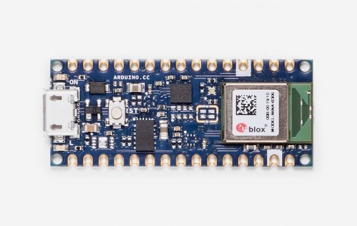
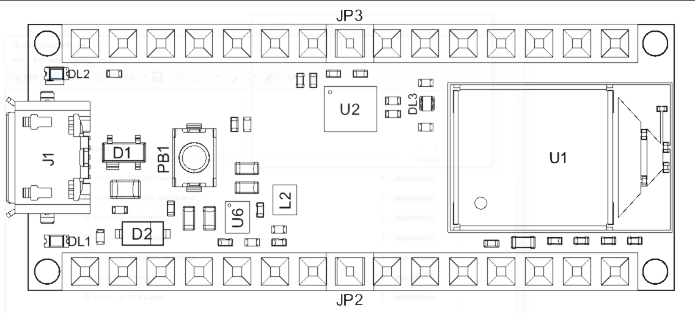
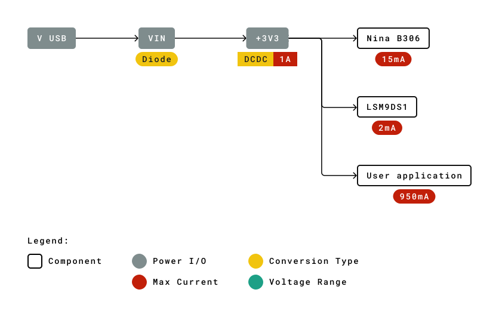
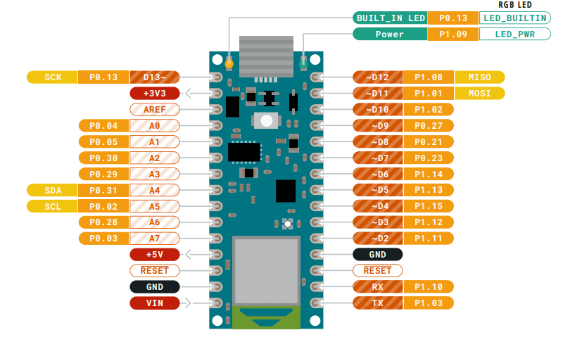
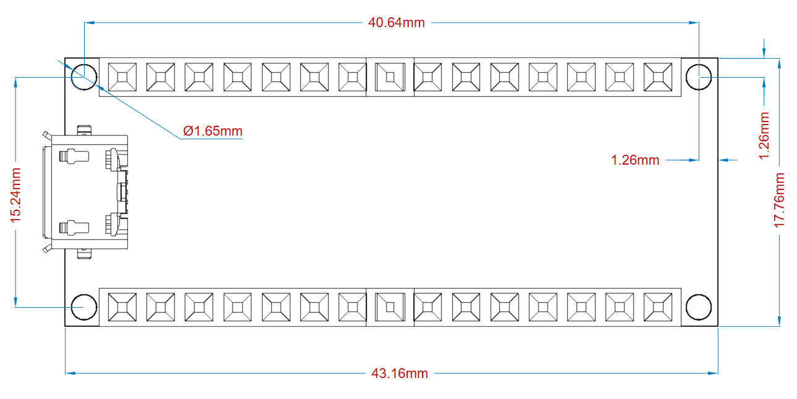

# Description
Nano 33 BLE is a miniature sized module containing a NINA B306 module, based on Nordic nRF52480 and containing a Cortex M4F and a 9 axis IMU. The module can either be mounted as a DIP component (when mounting pin headers), or as a SMT component, directly soldering it via the castellated pads.

# Target areas:
Maker, enhancements, basic IoT application scenarios

# Features
- **NINA B306 Module** 
    - **Processor**
        - 64 MHz Arm® Cortex-M4F (with FPU)
        - 1 MB Flash + 256 KB RAM 

    - **Bluetooth®  5 multiprotocol radio**
        - 2 Mbps
        - CSA #2
        - Advertising Extensions
        - Long Range
        - +8 dBm TX power
        - -95 dBm sensitivity
        - 4.8 mA in TX (0 dBm)
        - 4.6 mA in RX (1 Mbps)
        - Integrated balun with 50 Ω single-ended output
        - IEEE 802.15.4 radio support
        - Thread
        - Zigbee 

- **Peripherals**
    - Full-speed 12 Mbps USB
    - NFC-A tag
    - Arm CryptoCell CC310 security subsystem
    - QSPI/SPI/TWI/I²S/PDM/QDEC
    - High speed 32 MHz SPI
    - Quad SPI interface 32 MHz
    - EasyDMA for all digital interfaces
    - 12-bit 200 ksps ADC
    - 128 bit AES/ECB/CCM/AAR co-processor

- **LSM9DS1** (9 axis IMU)
    - 3 acceleration channels, 3 angular rate channels, 3 magnetic field channels
    - ±2/±4/±8/±16 g linear acceleration full scale
    - ±4/±8/±12/±16 gauss magnetic full scale
    - ±245/±500/±2000 dps angular rate full scale
    - 16-bit data output
- **MPM3610** DC-DC
    - Regulates input voltage from up to 21V with a minimum of 65% efficiency @minimum load
    - More than 85% efficiency @12V

# Contents
## The Board
As all Nano form factor boards, Nano 33 BLE does not have a battery charger but can be powered through USB or headers.

**NOTE:** Arduino Nano 33 BLE only supports 3.3V I/Os and is **NOT** 5V tolerant so please make sure you are not directly connecting 5V signals to this board or it will be damaged. Also, as opposed to Arduino Nano boards that support 5V operation, the 5V pin does NOT supply voltage but is rather connected, through a jumper, to the USB power input.

### Application Examples
**Sound spectrum:** Create a sound spectrum to visualize sound frequencies. Connect an Arduino 33 Nano BLE and a microphone or amplifier.

**Social distancing sensor:** Keeping the social distance has become more important than ever to ensure your own, as well as others health. By connecting an Arduino Nano 33 BLE with a sensor and a LED display, you can create a wearable band that alerts you when you get too close to other people.

**Healthy plant scanner:** Watering your plants isn’t always enough to keep them happy. Diseases, lack of sunlight etc. could also be vital factors for unhealthy plants. Keep your plants happy by creating a detector and train it to detect any diseases, all with an Arduino Nano 33 BLE 

### Ratings
#### Recommended Operating Conditions
| Symbol | Description                                      | Min             | Max            |
| ------ | ------------------------------------------------ | --------------- | -------------- |
|        | Conservative thermal limits for the whole board: | -40 °C ( 40 °F) | 85°C ( 185 °F) |

### Power Consumption
| Symbol | Description                         | Min  | Typ  | Max  | Unit |
| ------ | ----------------------------------- | ---- | ---- | ---- | ---- |
| PBL    | Power consumption with busy loop    |      | TBC  |      | mW   |
| PLP    | Power consumption in low power mode |      | TBC  |      | mW   |
| PMAX   | Maximum Power Consumption           |      | TBC  |      | mW   |

## Functional Overview
### Board Topology 
#### Top

| **Ref.** | **Description**                 | **Ref.** | **Description**                  |
| -------- | ------------------------------- | -------- | -------------------------------- |
| U1       | NINA-B306 Module Bluetooth® Low Energy 5.0 Module | U6       | MP2322GQH Step Down Converter    |
| U2       | LSM9DS1TR Sensor IMU            | PB1      | IT-1185AP1C-160G-GTR Push button |
| DL1      | Led L                           | DL2      | Led Power                        |

#### Bottom

| **Ref.** | **Description** | **Ref.** | **Description** |
| -------- | --------------- | -------- | --------------- |
| SJ1      | VUSB Jumper     | SJ2      | D7 Jumper       |
| SJ3      | D8 Jumper       | SJ4      | 3v3 Jumper     |

### Processor 
The Main Processor is a Cortex M4F running at up to 64MHz. Most of its pins are connected to the external headers, however some are reserved for internal communication with the wireless module and the on-board internal I2C peripherals (IMU and Crypto).

**NOTE**: As opposed to other Arduino Nano boards, pins A4 and A5 have an internal pull up and default to be used as an I2C Bus so usage as analog inputs is not recommended.

### Power Tree
The board can be powered via USB connector, VIN or VUSB pins on headers. 

**NOTE:** Since VUSB feeds VIN via a Schottky diode and a DC-DC regulator specified minimum input voltage is 4.5V the minimum supply voltage from USB has to be increased to a voltage in the range between 4.8V to 4.96V depending on the current being drawn.

## Board Operation 
### Getting Started - IDE
If you want to program your Arduino Nano 33 BLE while offline you need to install the Arduino Desktop IDE [1] To connect the Arduino Nano 33 BLE to your computer, you’ll need a Micro-B USB cable. This also provides power to the board, as indicated by the LED.

### Getting Started - Arduino Web Editor
All Arduino boards, including this one, work out-of-the-box on the Arduino Web Editor [2], by just installing a simple plugin.

The Arduino Web Editor is hosted online, therefore it will always be up-to-date with the latest features and support for all boards. Follow **[3]** to start coding on the browser and upload your sketches onto your board.

### Getting Started - Arduino Cloud
All Arduino IoT enabled products are supported on Arduino Cloud which allows you to Log, graph and analyze sensor data, trigger events, and automate your home or business.

### Sample Sketches
Sample sketches for the Arduino Nano 33 BLE can be found either in the “Examples” menu in the Arduino IDE or in the “Documentation” section of the Arduino Pro website [4]

### Online Resources
Now that you have gone through the basics of what you can do with the board you can explore the endless possibilities it provides by checking exciting projects on ProjectHub **[5]**, the Arduino Library Reference **[6]** and the online store **[7]** where you will be able to complement your board with sensors, actuators and more

### Board Recover 
All Arduino boards have a built-in bootloader which allows flashing the board via USB. In case a sketch locks up the processor and the board is not reachable anymore via USB it is possible to enter bootloader mode by double-tapping the reset button right after power up.

## Connector Pinouts

### USB
| Pin  | **Function** | **Type**     | **Description**                                              |
| ---- | ------------ | ------------ | ------------------------------------------------------------ |
| 1    | VUSB         | Power        | Power Supply Input. If board is powered via VUSB from header this is an Output **(1)** |
| 2    | D-           | Differential | USB differential data -                                      |
| 3    | D+           | Differential | USB differential data +                                      |
| 4    | ID           | Analog       | Selects Host/Device functionality                            |
| 5    | GND          | Power        | Power Ground                                                 |

### Headers
The board exposes two 15 pin connectors which can either be assembled with pin headers or soldered through castellated vias. 

| Pin  | **Function** | **Type**     | **Description**                                              |
| ---- | ------------ | ------------ | ------------------------------------------------------------ |
| 1    | D13          | Digital      | GPIO/Built-in LED                                                          |
| 2    | +3V3         | Power Out    | Internally generated power output to external devices        |
| 3    | AREF         | Analog       | Analog Reference; can be used as GPIO                        |
| 4    | A0/DAC0      | Analog       | ADC in/DAC out; can be used as GPIO                          |
| 5    | A1           | Analog       | ADC in; can be used as GPIO                                  |
| 6    | A2           | Analog       | ADC in; can be used as GPIO                                  |
| 7    | A3           | Analog       | ADC in; can be used as GPIO                                  |
| 8    | A4/SDA       | Analog       | ADC in; I2C SDA; Can be used as GPIO **(1)**                 |
| 9    | A5/SCL       | Analog       | ADC in; I2C SCL; Can be used as GPIO **(1)**                 |
| 10   | A6           | Analog       | ADC in; can be used as GPIO                                  |
| 11   | A7           | Analog       | ADC in; can be used as GPIO                                  |
| 12   | VUSB         | Power In/Out | Normally NC; can be connected to VUSB pin of the USB connector by shorting a jumper |
| 13   | RST          | Digital In   | Active low reset input (duplicate of pin 18)                 |
| 14   | GND          | Power        | Power Ground                                                 |
| 15   | VIN          | Power In     | Vin Power input                                              |
| 16   | TX           | Digital      | USART TX; can be used as GPIO                                |
| 17   | RX           | Digital      | USART RX; can be used as GPIO                                |
| 18   | RST          | Digital      | Active low reset input (duplicate of pin 13)                 |
| 19   | GND          | Power        | Power Ground                                                 |
| 20   | D2           | Digital      | GPIO                                                         |
| 21   | D3/PWM       | Digital      | GPIO; can be used as PWM                                     |
| 22   | D4           | Digital      | GPIO                                                         |
| 23   | D5/PWM       | Digital      | GPIO; can be used as PWM                                     |
| 24   | D6/PWM       | Digital      | GPIO, can be used as PWM                                     |
| 25   | D7           | Digital      | GPIO                                                         |
| 26   | D8           | Digital      | GPIO                                                         |
| 27   | D9/PWM       | Digital      | GPIO; can be used as PWM                                     |
| 28   | D10/PWM      | Digital      | GPIO; can be used as PWM                                     |
| 29   | D11/MOSI     | Digital      | SPI MOSI; can be used as GPIO                                |
| 30   | D12/MISO     | Digital      | SPI MISO; can be used as GPIO                                |

### Debug
On the bottom side of the board, under the communication module, debug signals are arranged as 3x2 test pads with 100 mil pitch with pin 4 removed. Pin 1 is depicted in Figure 3 – Connector Positions

| Pin  | **Function** | **Type**   | **Description**                                              |
| ---- | ------------ | ---------- | ------------------------------------------------------------ |
| 1    | +3V3         | Power Out  | Internally generated power output to be used as voltage reference |
| 2    | SWD          | Digital    | nRF52480 Single Wire Debug Data                              |
| 3    | SWCLK        | Digital In | nRF52480 Single Wire Debug Clock                             |
| 5    | GND          | Power      | Power Ground                                                 |
| 6    | RST          | Digital In | Active low reset input                                       |
| 1    | +3V3         | Power Out  | Internally generated power output to be used as voltage reference |

## Mechanical Information
### Board Outline and Mounting Holes
The board measures are mixed between metric and imperial. Imperial measures are used to maintain 100 mil pitch grid between pin rows to allow them to fit a breadboard whereas board length is Metric

## Certifications
### Declaration of Conformity CE DoC (EU)
We declare under our sole responsibility that the products above are in conformity with the essential requirements of the following EU Directives and therefore qualify for free movement within markets comprising the European Union (EU) and European Economic Area (EEA). 

### Declaration of Conformity to EU RoHS & REACH 211 01/19/2021
Arduino boards are in compliance with RoHS 2 Directive 2011/65/EU of the European Parliament and RoHS 3 Directive 2015/863/EU of the Council of 4 June 2015 on the restriction of the use of certain hazardous substances in electrical and electronic equipment. 

| Substance                              | **Maximum limit (ppm)** |
| -------------------------------------- | ----------------------- |
| Lead (Pb)                              | 1000                    |
| Cadmium (Cd)                           | 100                     |
| Mercury (Hg)                           | 1000                    |
| Hexavalent Chromium (Cr6+)             | 1000                    |
| Poly Brominated Biphenyls (PBB)        | 1000                    |
| Poly Brominated Diphenyl ethers (PBDE) | 1000                    |
| Bis(2-Ethylhexyl} phthalate (DEHP)     | 1000                    |
| Benzyl butyl phthalate (BBP)           | 1000                    |
| Dibutyl phthalate (DBP)                | 1000                    |
| Diisobutyl phthalate (DIBP)            | 1000                    |

Exemptions : No exemptions are claimed. 

Arduino Boards are fully compliant with the related requirements of European Union Regulation (EC) 1907 /2006 concerning the Registration, Evaluation, Authorization and Restriction of Chemicals (REACH). We declare none of the SVHCs (https://echa.europa.eu/web/guest/candidate-list-table), the Candidate List of Substances of Very High Concern for authorization currently released by ECHA, is present in all products (and also package) in quantities totaling in a concentration equal or above 0.1%. To the best of our knowledge, we also declare that our products do not contain any of the substances listed on the "Authorization List" (Annex XIV of the REACH regulations) and Substances of Very High Concern (SVHC) in any significant amounts as specified by the Annex XVII of Candidate list published by ECHA (European Chemical Agency) 1907 /2006/EC.

### Conflict Minerals Declaration 
As a global supplier of electronic and electrical components, Arduino is aware of our obligations with regards to laws and regulations regarding Conflict Minerals, specifically the Dodd-Frank Wall Street Reform and Consumer Protection Act, Section 1502. Arduino does not directly source or process conflict minerals such as Tin, Tantalum, Tungsten, or Gold. Conflict minerals are contained in our products in the form of solder, or as a component in metal alloys. As part of our reasonable due diligence Arduino has contacted component suppliers within our supply chain to verify their continued compliance with the regulations. Based on the information received thus far we declare that our products contain Conflict Minerals sourced from conflict-free areas. 

## FCC Caution
Any Changes or modifications not expressly approved by the party responsible for compliance could void the user’s authority to operate the equipment.

This device complies with part 15 of the FCC Rules. Operation is subject to the following two conditions: 

(1) This device may not cause harmful interference

 (2) this device must accept any interference received, including interference that may cause undesired operation.

**FCC RF Radiation Exposure Statement:**

1. This Transmitter must not be co-located or operating in conjunction with any other antenna or transmitter.

2. This equipment complies with RF radiation exposure limits set forth for an uncontrolled environment.

3. This equipment should be installed and operated with minimum distance 20cm between the radiator & your body.

English: 
User manuals for license-exempt radio apparatus shall contain the following or equivalent notice in a conspicuous location in the user manual or alternatively on the device or both. This device complies with Industry Canada license-exempt RSS standard(s). Operation is subject to the following two conditions:

(1) this device may not cause interference

 (2) this device must accept any interference, including interference that may cause undesired operation of the device.

French: 
Le présent appareil est conforme aux CNR d’Industrie Canada applicables aux appareils radio exempts de licence. L’exploitation est autorisée aux deux conditions suivantes :

(1) l’ appareil nedoit pas produire de brouillage

(2) l’utilisateur de l’appareil doit accepter tout brouillage radioélectrique subi, même si le brouillage est susceptible d’en compromettre le fonctionnement.

**IC SAR Warning:**

English 
This equipment should be installed and operated with minimum distance 20 cm between the radiator and your body.  

French: 
Lors de l’ installation et de l’ exploitation de ce dispositif, la distance entre le radiateur et le corps est d ’au moins 20 cm.

**Important:** The operating temperature of the EUT can’t exceed 85℃ and shouldn’t be lower than -40℃.

Hereby, Arduino S.r.l. declares that this product is in compliance with essential requirements and other relevant provisions of Directive 2014/53/EU. This product is allowed to be used in all EU member states. 

| Frequency bands | Maximum output power (ERP) |
| --------------- | -------------------------- |
| 863-870Mhz      | 5.47 dBm                   |

## Company Information
| Company name    | Arduino S.r.l                           |
| --------------- | --------------------------------------- |
| Company Address | Via Andrea Appiani 25 20900 MONZA Italy |

## Reference Documentation
| Reference                 | **Link**                                                     |
| ------------------------- | ------------------------------------------------------------ |
| Arduino IDE (Desktop)     | https://www.arduino.cc/en/software                           |
| Arduino IDE (Cloud)       | https://create.arduino.cc/editor                             |
| Cloud IDE Getting Started | https://create.arduino.cc/projecthub/Arduino_Genuino/getting-started-with-arduino-web-editor-4b3e4a |
| Forum                     | http://forum.arduino.cc/                                     |
| SAMD21G18                 | https://ww1.microchip.com/downloads/aemDocuments/documents/MCU32/ProductDocuments/DataSheets/SAM-D21DA1-Family-Data-Sheet-DS40001882G.pdf |
| NINA W102                 | https://content.u-blox.com/sites/default/files/NINA-W10_DataSheet_UBX-17065507.pdf |
| ECC608                    | https://ww1.microchip.com/downloads/aemDocuments/documents/SCBU/ProductDocuments/DataSheets/ATECC608A-CryptoAuthentication-Device-Summary-Data-Sheet-DS40001977B.pdf |
| MPM3610                   | https://www.monolithicpower.com/pub/media/document/MPM3610_r1.01.pdf |
| NINA Firmware             | https://github.com/arduino/nina-fw                           |
| ECC608 Library            | https://github.com/arduino-libraries/ArduinoECCX08           |
| LSM6DSL Library           | https://github.com/stm32duino/LSM6DSL                        |
| ProjectHub                | https://create.arduino.cc/projecthub?by=part&part_id=11332&sort=trending |
| Library Reference         | https://www.arduino.cc/reference/en/                         |
| Arduino Store             | https://store.arduino.cc/                                    |

## Revision History

| Date       | **Revision** | **Changes**                           |
| ---------- | ------------ | ------------------------------------- |
| 03/08/2022 | 2            | Reference documentation links updates |
| 21/04/2021 | 1            | General datasheet updates             |