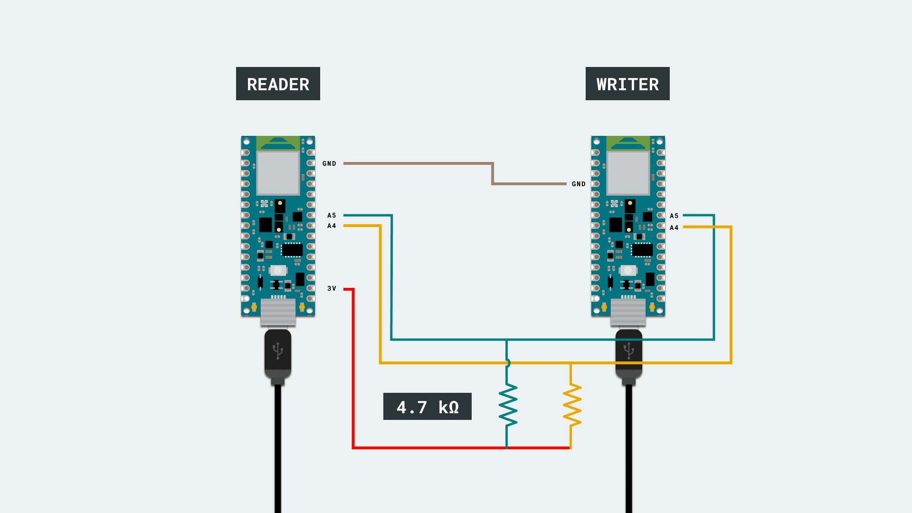

In this tutorial we will control the built-in LED of an Arduino Nano 33 BLE from another Arduino Nano 33 BLE. To do so, we will connect both boards using a wired communication protocol called I2C.

> **Note:** This example would work connecting an Arduino Bluetooth® Low Energy board with any other Arduino board, but be mindful that by using any other board the connections might differ. If the connections vary, it may happen that the code might also need changes to match with the I2C pins of the different boards. 

In this example, we will power both the Arduino boards through a computer, then through the Serial Monitor, we will introduce some commands to turn **ON** or **OFF** the LED of the Nano 33 BLE board. 


## Goals

The goals of this project are:
- Understand what I2C protocol is.
- Use the `Wire.h` library.
- Use I2C communication between two Arduino boards.


## Hardware & Software Needed

For this project we will need:

* Arduino Nano 33 BLE
* Arduino Nano 33 BLE (or any other Arduino board that supports I2C)
* 2 x [mini breadboard](https://store.arduino.cc/mini-breadboard-white-998) 
* 10 x [jumper wires](https://store.arduino.cc/10-jumper-wires-150mm-male)
* 2 x 4.7k Ohm resistor

## I2C Protocol

I2C (Inter Integrated Circuits) is a well known and widely used protocol. It allows us to connect multiple readers to a single writer, meaning that, you could have more than one sensor connected to the same pins of your Arduino board through I2C. The only requisite is that each of those sensors have a unique address. 

The I2C protocol involves using two lines to send and receive data: a serial clock pin (SCL) where the Arduino writer board pulses at a regular interval, and a serial data pin (SDA) over which data is sent between the two devices. 

As the clock line changes from **low** to **high**, a single bit of information that will form the address of a specific device, and a command or data is transferred from the board to the I2C device over the SDA line. When this information is sent, the called upon device executes the request and transmits it's data back, if required, to the board over the same line using the clock signal still generated by the writer on SCL. 

If you want to learn more about the I2C protocol and how it works, you can check the [I2C standards](https://www.nxp.com/docs/en/application-note/AN10216.pdf).

## The Wire Library

To simplify the use of the I2C protocol, Arduino uses the "Wire" library, which allows you to implement and use this protocol throughout different Arduino boards. This library can only be used on some specific pins of the board, those pins are called SCL and SDA, on the Arduino Nano family boards, the SDA (data line) and SCL (clock line) are on the A4 and A5 pin headers respectively.

If you want to read more about the `Wire.h` library see <a href="https://www.arduino.cc/en/reference/wire" target="_blank">here</a>. 


### Circuit

In order to communicate both Arduino boards, we will need to connect them as shown in the image below.



At the moment of making the connections, we need to remember that this protocol has two dedicated lines SCL (clock) and SDA (data) so we need to make sure to connect the SCL pin, of one of the boards, with the SCL of the other one. The same goes for the SDA as it is shown in the image.

To finish, we need to connect the GND pins of both boards to each other.

> **Note:** In order to enable serial communication, both Arduino boards must be connected to your computer via USB.


## Creating the Program

**1. Setting up** 

First start by connecting your Arduino Nano 33 BLE board to the computer and opening the Arduino Create Web Editor. This board will act as the reader. Start a new sketch and name it **Nano_I2C_Reader**. 

**2. Reader code explanation**

Let's start by adding the `Wire.h` library by adding the `#include <Wire.h>` statement. Then, in the `setup()` we need to add `Wire.begin(8)` to initiate the library and give the reader board the address of 8, so the writer can identify who to send or receive data from. We will also use `Wire.onReceive()` which gets called every time data is received from the writer.

```arduino
#include <Wire.h>

void setup() {
  Wire.begin(8);                // join i2c bus with address #8
  Wire.onReceive(receiveEvent); // function that executes whenever data is received from writer
}
```

The `loop()` of this code is not as important, since nothing is required to run until we receive something through I2C. Due to this, we will leave the `loop()` function empty.

Instead the focus is on the `loop()` where we will create a `receiveEvent()` function that is going to run when we get any data received by the board. We can store the data we will receive in the `c` variable, for ease of use. The data we will receive will be a character, so we need to compare it as such. The `if` statements will check if the character that was sent is a 1 or a 0. It will then turn **on** or **off** the built-in LED depending on the received character.

```arduino
void receiveEvent(int howMany) {
   char c = Wire.read(); // receive a character
   if(c == '0'){
     digitalWrite(LED_BUILTIN, LOW);   // turn the LED off by making the voltage LOW
   }
   if(c == '1'){
     digitalWrite(LED_BUILTIN, HIGH);  // turn the LED on (HIGH is the voltage level)
   }
}
```

**3. Uploading the code to the reader**

Once we have finished the code, let's upload it to our Arduino Nano 33 BLE board. This board is now programmed to act as the reader in this scenario. Once the code is uploaded, let's connect the other board to the computer.
> **Note:** After uploading the code to the reader board, it is not necessary for it to stay connected to the computer in order to function. However, it needs to be powered in order to work.

**4. Writer code**

It is time to open a new sketch and name it as **Nano_I2C_Writer**, then let's add the Wire library as we did in the previous code. 

In the `setup()` we need to add the `Serial.begin(9600)` which opens the serial port and sets the data rate to 9600 bits per second (baud). Next we will add the `while (!Serial);` which ensures that there is something at the other end of the USB connection, for the Arduino to talk to before it starts sending messages. Otherwise, the message might be sent, but not displayed. We also add `Wire.begin()` to initiate the Wire library and join the I2C bus as a writer or reader.

```arduino
#include <Wire.h>

void setup() {
  Serial.begin(9600);
  while (!Serial);
  Wire.begin(); // join i2c bus (address optional for writer)
}
```

Next, in the `loop()` we first print the message that lets us know what values can be entered. We then define a variable, `ledVal`, that will hold the value we entered into the Serial Monitor. With the `readSerial()` we will take the value entered into the Serial Monitor and store it in the `ledVal` variable. We will then begin the I2C communication. 

With `Wire.beginTransmission(8)` we designate which reader we will send data to. If you remember, in the reader's code we gave the board the address 8. After communication has been opened we use `Wire.write()` to chose what we send to the reader, in this case we send the variable `ledVal`. After that we simply end the transmission with `Wire.endTransmission()`.

```arduino
void loop() {
  Serial.print("Enter 0 to turn off led, enter 1 to turn it on ");
  char ledVal[0];
  readSerial(ledVal);
  Serial.println(ledVal);
  Wire.beginTransmission(8); // transmit to device #8
  Wire.write(ledVal);        // sends the given value
  Wire.endTransmission();    // stop transmitting
  delay(500);
}
```

The `readSerial()` function allows us to take a value that is entered into the Serial Monitor and store it into a variable, enabling us to send it via I2C. The function detects when an entry is sent and takes whatever is typed before the entry and puts it into a variable. It can hold longer strings of characters if needed.

```arduino
int readSerial(char result[]) {
  int i = 0;
  while (1) {
    while (Serial.available() > 0) {
      char inChar = Serial.read();
      if (inChar == '\n') {
        result[i] = '\0';
        Serial.flush();
        return 0;
      }
      if (inChar != '\r') {
        result[i] = inChar;
        i++;
      }
    }
  }
}
```

**5. Uploading the code to the writer**

Once we have finished the code, let's upload it to our Arduino Nano 33 BLE board. This board is now programmed to act as the writer.

**6. Complete code**

If you choose to skip the code building section, the complete code for both the reader and the writer can be found below:

### Reader:

```arduino
#include <Wire.h>

void setup() {
  Wire.begin(8);                // join i2c bus with address #8
  Wire.onReceive(receiveEvent); // function that executes whenever data is received from writer
}

void loop() {
  delay(100);
}

void receiveEvent(int howMany) {
   char c = Wire.read(); // receive a character
   if(c == '0'){
     digitalWrite(LED_BUILTIN, LOW);   // turn the LED off by making the voltage LOW
   }
   if(c == '1'){
     digitalWrite(LED_BUILTIN, HIGH);  // turn the LED on (HIGH is the voltage level)
   }
}
```

### Writer:

```arduino
#include <Wire.h>

void setup() {
  Serial.begin(9600);
  while (!Serial);
  Wire.begin(); // join i2c bus (address optional for writer)
}

void loop() {
  Serial.print("Enter 0 to turn off led, enter 1 to turn it on ");
  char ledVal[0];
  readSerial(ledVal);
  Serial.println(ledVal);
  Wire.beginTransmission(8); // transmit to device #8
  Wire.write(ledVal);        // sends the given value
  Wire.endTransmission();    // stop transmitting
  delay(500);
}

/* Read input serial */
int readSerial(char result[]) {
  int i = 0;
  while (1) {
    while (Serial.available() > 0) {
      char inChar = Serial.read();
      if (inChar == '\n') {
        result[i] = '\0';
        Serial.flush();
        return 0;
      }
      if (inChar != '\r') {
        result[i] = inChar;
        i++;
      }
    }
  }
}
```

## Testing It Out
After you have successfully verified and uploaded the sketch to the two boards, make sure the writer board is connected, open the Serial Monitor. You will see a text asking for a value of 1 or 0 to be entered. When a value is entered it will be sent to the reader board.


### Troubleshoot

Sometimes errors occur, if the code is not working there are some common issues we can troubleshoot:
- Missing a bracket or a semicolon.
- Arduino board connected to the wrong port.
- Connection between the Arduino boards are not correct.
- Accidental interruption of cable connection.


## Conclusion

In this simple tutorial we learned how to connect two boards so that they can communicate using I2C, with the help of the **Wire.h** library.