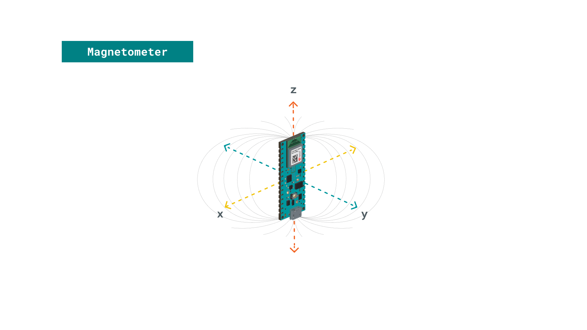
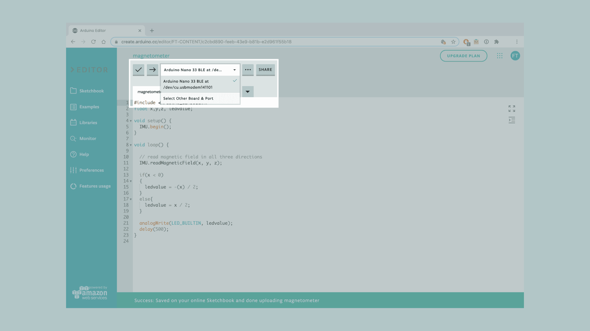
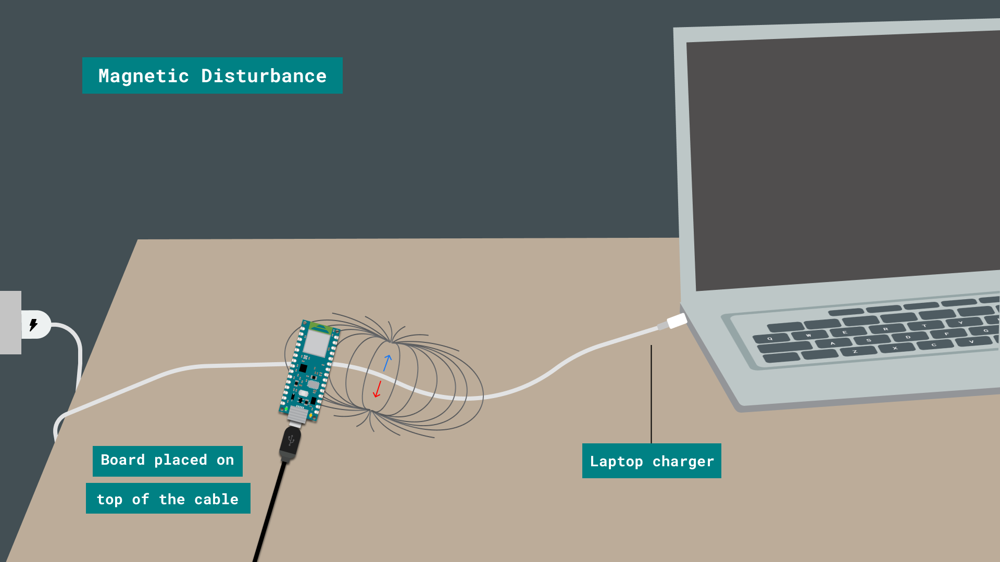

## IMU Module

This tutorial will focus on the 3-axis magnetometer sensor of the **LSM9DS1** module, on the Arduino Nano 33 BLE. The tutorial will utilize the IMU sensor in order to create an application that will detect changes and disturbances in the magnetic field around an appliance or electric device. This will be achieved by reading the values of the magnetometer's axes and blink the board's in-built LED according to the magnetic disturbances. 


## Goals

The goals of this project are:
- Understand what an LSM9DS1 module is.
- Use the LSM9DS1 library.
- Measure the value of a magnetometer sensor.
- Create visual feedback according to magnetic disturbance in the environment.
- Convert the sensor's values in LED light intensity.


## Hardware & Software Needed

* This project uses no external sensors or components.
* In this tutorial we will use the Arduino Create Cloud Editor to program the board.


## The LSM9DS1 Inertial Module
IMU stands for: inertial measurement unit. It is an electronic device that measures and reports a body's specific force, angular rate and the orientation of the body, using a combination of accelerometers, gyroscopes, and oftentimes magnetometers. In this tutorial we will learn a bit more of the LSM9DS1 IMU module, which is included in the Arduino Nano 33 BLE Board. 


The LSM9DS1 is a system-in-package featuring a 3D digital linear acceleration sensor, a 3D digital angular rate sensor, and a 3D digital magnetic sensor.


### The Library

The Arduino LSM9DS1 library allows us to use the Arduino Nano 33 BLE IMU module without having to go into complicated programming. The library takes care of the sensor initialization and sets its values as follows:

- **Accelerometer** range is set at [-4, +4]g -/+0.122 mg.
- **Gyroscope** range is set at [-2000, +2000] dps +/-70 mdps.
- **Magnetometer** range is set at [-400, +400] uT +/-0.014 uT.
- **Accelerometer** output data rate is fixed at 104 Hz.
- **Gyroscope** output data rate is fixed at 104 Hz.
- **Magnetometer** output data rate is fixed at 20 Hz.

If you want to read more about the LSM9DS1 sensor module see <a href="https://www.st.com/resource/en/datasheet/lsm9ds1.pdf" target="_blank">here</a>. 


### Magnetometer

A magnetometer is a device that measures magnetism, that is the direction, strength, or relative change of a magnetic field at a particular location.



In this tutorial we will read the values X, Y and Z and provide visual feedback through the in-built LED according to the intensity of magnetism around an electric object's cord.


## Creating the Program

**1. Setting up** 

Let's start by opening the [Arduino Cloud Editor](https://create.arduino.cc/editor) and creating a new sketch, this can be named "magnetometer". Then, navigate to the **Libraries** tab, search for the **LSM9DS1** library and click on the **Include** button. 


**2. Connecting the board**

Next, connect the Arduino Nano 33 BLE to the computer and make sure that the Cloud Editor recognizes it. If so, the board and port should appear as shown in the image below. If they don't appear, follow the [instructions](https://create.arduino.cc/getting-started/plugin/welcome) to install the plugin that will allow the Editor to recognize your board.




**3. Identifying changes in the magnetic field**

After including the library, we can begin by building the rest of the code. 

Let's start by defining the float variables `float x,y,z, ledvalue;` which will be needed for our code to work.

In the `setup()` we only need to initialize the IMU sensor with the function `IMU.begin();`.

In the `loop()` we add the function `IMU.readMagneticField(x, y, z);` in order to read the values of the three axes on the IMU. 
Next we will add an `if` statement that checks if the magnetic field detected by the board is positive or negative (it will depend on the orientation of the board). If the magnetic field is negative, we convert the ledvalue in a positive range with ledvalue = -(x); , meaning that it is a valid value for the built in LED.

Lastly, we use the command `analogWrite(LED_BUILTIN, ledvalue);` to set the intensity of the LED according to the disturbance in the magnetic field, and add a small delay. 


**4. Complete code**

If you choose to skip the code building section, the complete code can be found below:

```arduino
/*
  Arduino LSM9DS1 - Magnetometer

  This example reads the magnetometer's values from the LSM9DS1 sensor 
  and `analogWrite` the built-in LED according to the intensity of
  the magnetic field surrounding electrical devices.

  The circuit:
  - Arduino Nano 33 BLE

  Created by Benjamin Dannegård
  4 Dec 2020

  This example code is in the public domain.
*/


#include <Arduino_LSM9DS1.h>
float x,y,z, ledvalue;

void setup() {
  IMU.begin();
}

void loop() {
  
  // read magnetic field in all three directions
  IMU.readMagneticField(x, y, z);
  
  if(x < 0)
  {
    ledvalue = -(x);
  }
  else{
    ledvalue = x;
  }
  
  analogWrite(LED_BUILTIN, ledvalue);
  delay(500);
}
```

## Testing It Out

After you have successfully verified and uploaded the sketch to the board, it's time to put it to the test. You can choose an electric appliance at home or any object that runs with electrical current. For example, in this tutorial we will use a laptop charger to test it out. 

Place your board on top of the laptop's charging cord for 5-10 seconds and then move it away from it for some seconds again. While the board is close to the cord you should notice the (orange) built-in LED blinking. The intensity of the LED will vary according to the magnetic field detected.

Here is a screenshot illustrating the board's position:



However, there are other ways you can play around with this application. If you feel that the LED's brightness intensity is not visible enough you could experiment with other devices such as: electric kettle, toaster, TV or coffee machine. To do so, simply follow the same process and place the board close to the cable when the said device is active.

### Troubleshoot

Sometimes errors occur, if the code is not working there are some common issues we can troubleshoot:
- Missing a bracket or a semicolon.
- Arduino board connected to the wrong port. 
- Accidental interruption of cable connection.


## Conclusion

In this simple tutorial we learned what an IMU sensor module is, how to use the **LSM9DS1** library, and how to use an Arduino Nano 33 BLE microcontroller, to detect magnetic field disturbances with a magnetometer sensor. Furthermore, we created an application that controls the intensity of an LED according to the values read from an IMU sensor module.