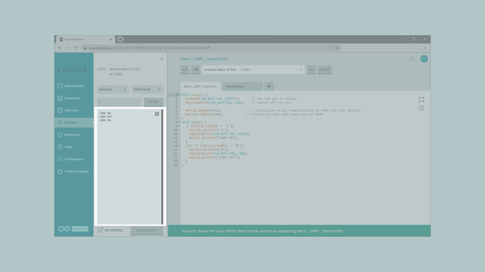

In this tutorial we will control the built-in LED on the Arduino Nano 33 BLE from another Arduino Nano 33 BLE. To do so, we will connect both boards using a wired communication protocol called UART.

> **Note:** This example would work connecting an Arduino Bluetooth® Low Energy board with any other Arduino board, but be mindful that both board must work at the same voltage. If the operating voltage differ between connected boards, the board with the lower operating voltage could be damaged.

In this example, we will power both the Arduino boards through the computer, then we will use the Serial Monitor to send some commands to the 33 Arduino Nano 33 BLE board, that will be connected through the UART with another Arduino Nano 33 BLE board. Depending on the commands received by the Nano 33 BLE board, it will turn **ON** or **OFF** its built-in LED.


## Goals

The goals of this project are:
- Understand what the UART is.
- Use UART communication between two Arduino boards.


## Hardware & Software Needed

For this project we will need:

* Arduino Nano 33 BLE
* Arduino Nano 33 BLE (or any other Arduino board that works at 3.3V)
* 2 x [mini breadboard](https://store.arduino.cc/mini-breadboard-white-998)
* 3 x [jumper wires](https://store.arduino.cc/10-jumper-wires-150mm-male)

## UART Communication

UART (Universal Asynchronous Receiver-Transmitter) is one of the most used device-to-device communication protocols. It allows an asynchronous serial communication in which the data format and transmission speed are configurable. The UART communication sends data bits one by one, from the least significant to the most significant, framed by start and stop bits so that precise timing is handled by the communication channel.

Embedded systems, microcontrollers, and computers mostly use UART as a form of device-to-device hardware protocol. Among the available communication protocols, UART uses only two wires for its transmitting and receiving ends, TX (Transmitter) and RX (Receiver). These pins are dedicated for that specific purpose, either transmitting or receiving.

Asynchronous means there is no clock signal to synchronize the output bits from the transmitting device going to the receiving end, but the baud rate needs to be the same on both the transmitting and receiving devices. The baud rate, is the rate at which information is transferred to a communication channel. In the serial port context, the set baud rate will serve as the maximum number of bits per second to be transferred.

UART is the communication protocol we use to communicate the PC to the board through the USB cable. In some older boards, TX and RX pins are used for communication with the computer, which means connecting anything to these pins can interfere with that communication, including causing failed uploads to the board. This is not the case for the Nano or MKR families, since these ones have two separate channels, using **Serial** for the communication with the computer and **Serial1** for the communication with any other device through UART.

If you want to learn more about the UART protocol and how it works, you can check [this link](https://en.wikipedia.org/wiki/Universal_asynchronous_receiver-transmitter).


### Circuit

In order to communicate both Arduino boards, we will need to connect them as shown in the image below.


At the moment of making the connections, we need to remember that this protocol has two dedicated lines **TX** and **RX** so we need to make sure to connect the TX pin, of one of the boards, with the RX of the other one. The same goes for the second, where his TX pin need to be connected to the RX pin of the first board.

To finish, it is very important that we connect the GND pins of both boards to each other. If we don't do this, the voltage reference will be different for each one of the boards so the communication won't work as intended.

> **Note:** In order to enable serial communication, both Arduino boards must be connected to your computer via USB.


## Creating the Program

**1. Configuring the Receiver board**

First, let's connect the Arduino Nano 33 BLE board to the computer and opening the Arduino Web Editor. This board will act as the receiver, which means that it will only receive data from the other board and turn ON or OFF the built-in LED according the received values.
To start with the programming, start a new sketch and name it **Nano_UART_receiver**.

**1.1. Receiver code walkthrough**

Let's start inside the `setup()` function. We need to initialize the built-in LED as `OUTPUT` and then turn it off. Then, we need to initialize the UART communication with the other board using the `Serial1.begin()` function.

```arduino
void setup() {
  pinMode(LED_BUILTIN, OUTPUT);      // set LED pin as output
  digitalWrite(LED_BUILTIN, LOW);    // switch off LED pin

  Serial1.begin(9600);            // initialize UART with baud rate of 9600
}
```

> Note: If you want to initialize the UART communication with any other Arduino board, please check [here](https://www.arduino.cc/reference/en/language/functions/communication/serial/) the serial port and the pins you need to use.

Inside the `loop()`, we need to check if there is any byte available on the buffer using the `Serial1.available()` function inside a `while` statement. This configuration will run the portion of code inside the brackets of the `while() ` only if there is any byte available to be read on the buffer of the UART1. If it is the case, we will read and store the available data in the `receivedData` variable using the `Serial1.read()` function, since we want to read the data coming from the other Arduino board.

```arduino
void loop() {
  while (Serial1.available() >= 0) {
    char receivedData = Serial1.read();   // read one byte from serial buffer and save to receivedData
```

Now, we need to add a `if...else` statement to check if the received data is `'1'` or `'0'` in order to turn on or off the built in LED respectively.

> **Note:** When we use UART communication, all the data transmitted is text formatted, which means that we need to use character logic instead of numeric logic for compatibility. For example, in order to know if the data received is a "5" we need to check with the ASCII character of 5 ('5') instead of the numeric value of 5 (5). Therefore, we use dataReceived == '5' instead of dataReceived == 5.

```arduino
    if (receivedData == '1') {
      digitalWrite(LED_BUILTIN, HIGH); // switch LED On
    }
    else if (receivedData == '0') {
      digitalWrite(LED_BUILTIN, LOW);  // switch LED Off
    }
  }
}
```

**1.2. Uploading the code to the receiver**

Once we have finished the code, let's upload it to our Arduino Nano 33 BLE board. This board is now programmed to act as the receiver in this scenario. Once the code is uploaded, let's connect the other board to the computer.

> **Note:** After uploading the code to the receiver board, it is not necessary for it to stay connected to the computer in order to function. However, it needs to be powered in order to work.

**2. Configuring the Transmitter board**

It is time to open a new sketch and name it as **Nano_UART_transmitter**, then let's start initializing the built in LED and the Serial communication as we did in the previous code but in this case since we need to read data also from the Serial Monitor we need to initialize the serial communication with the computer adding a `Serial.begin()` function.

```arduino
void setup() {
  pinMode(LED_BUILTIN, OUTPUT);      // set LED pin as output
  digitalWrite(LED_BUILTIN, LOW);    // switch off LED pin

  Serial.begin(9600);               // initialize serial communication at 9600 bits per second:
  Serial1.begin(9600);            // initialize UART with baud rate of 9600
}
```

In the `loop()`, we will use an `if` statement to check if the data read from the Serial Monitor is equal to `1`. If it is, we will use the `Serial1.println()` function to send the same data to the other board. At the same time, we will turn on the built in LED of this board and print out a message in the Serial Monitor showing the state of the LED using the `digitalWrite()` and `Serial.println` functions respectively.

```arduino
void loop() {
  if (Serial.read() == '1'){
    Serial1.println('1');
    digitalWrite(LED_BUILTIN, HIGH);
    Serial.println("LEDS ON");
  }
```

Then, using an `else if` statement, we need to do the same but in this case, if the data read from the Serial Monitor is equal to `0`, we will turn the LED off.

```arduino
  else if (Serial.read() == '0'){
    Serial1.println('0');
    digitalWrite(LED_BUILTIN, LOW);
    Serial.print("LEDS OFF");
  }
}
```

**2.1 Uploading the code to the transmitter**

Once we have finished the code, let's upload it to our other Arduino Nano 33 BLE board. This board is now programmed to act as the transmitter.

**3. Complete code**

If you choose to skip the code building section, the complete code for both the receiver and the transmitter can be found below:

### Receiver:

```arduino
void setup() {
  pinMode(LED_BUILTIN, OUTPUT);      // set LED pin as output
  digitalWrite(LED_BUILTIN, LOW);    // switch off LED pin

  Serial1.begin(9600);            // initialize UART with baud rate of 9600
}
void loop() {
  while (Serial1.available() >= 0) {
    char receivedData = Serial1.read();   // read one byte from serial buffer and save to receivedData
    if (receivedData == '1') {
      digitalWrite(LED_BUILTIN, HIGH); // switch LED On
    }
    else if (receivedData == '0') {
      digitalWrite(LED_BUILTIN, LOW);  // switch LED Off
    }
  }
}
```

### Transmitter:

```arduino
void setup() {
  pinMode(LED_BUILTIN, OUTPUT);      // set LED pin as output
  digitalWrite(LED_BUILTIN, LOW);    // switch off LED pin

  Serial.begin(9600);               // initialize serial communication at 9600 bits per second:
  Serial1.begin(9600);            // initialize UART with baud rate of 9600
}
void loop() {
  if (Serial.read() == '1'){
    Serial1.println('1');
    digitalWrite(LED_BUILTIN, HIGH);
    Serial.println("LEDS ON");
  }
  else if (Serial.read() == '0'){
    Serial1.println('0');
    digitalWrite(LED_BUILTIN, LOW);
    Serial.print("LEDS OFF");
  }
}
```

## Testing It Out
After you have successfully verified and uploaded the sketch to the two boards, make sure the transmitter board is connected and open the Serial Monitor. You need to enter a 1 to turn ON both LEDs, or a 0 to turn them OFF.




### Troubleshoot

Sometimes errors occur, if the code is not working there are some common issues we can troubleshoot:
- Missing a bracket or a semicolon.
- Arduino board connected to the wrong port.
- Connection between the Arduino boards are not correct.
- Accidental interruption of cable connection.


## Conclusion

In this simple tutorial we learned how to connect two Arduino boards so that they can communicate using UART communication.


