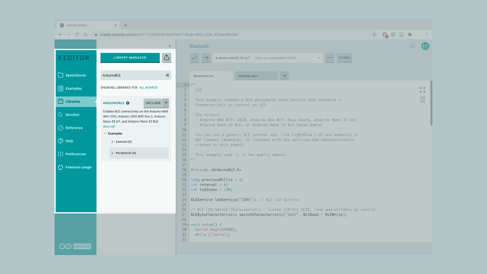
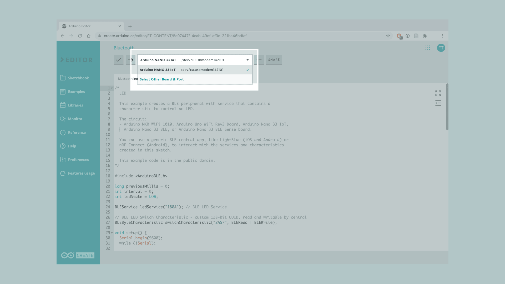
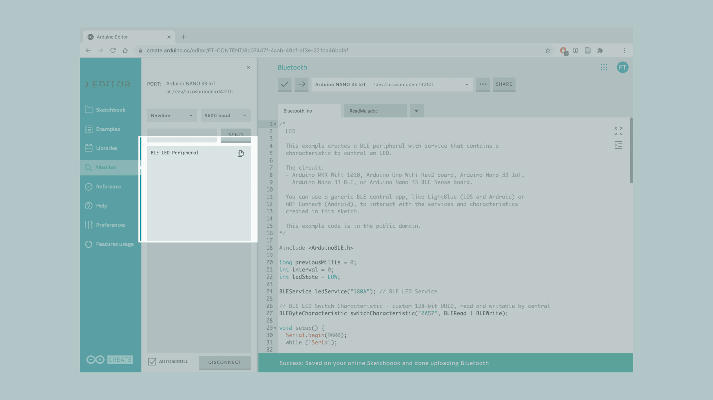
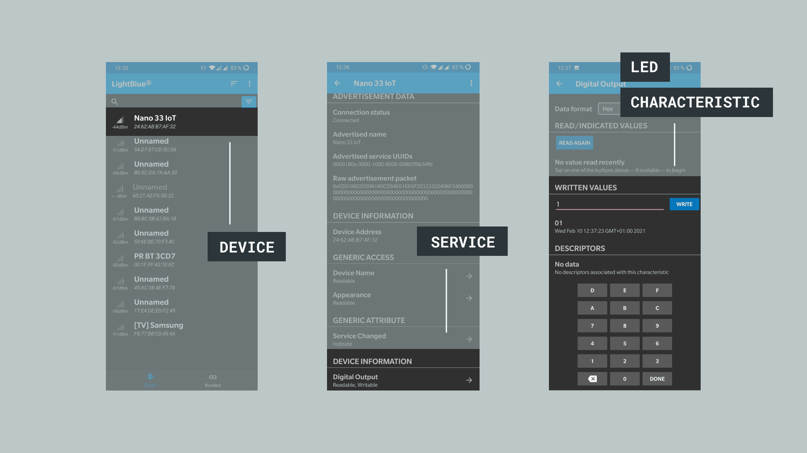

In this tutorial we will use an Arduino Nano 33 IoT to turn on the built-in LED over Bluetooth®, made possible by the NINA module embedded on the board.


## Goals

The goals of this project are:
 - Learn what Bluetooth® Low Energy and Bluetooth® are.
 - Use the Arduino BLE library.
 - Learn how to create a new service.
 - Learn how to control a LED from an external device (smartphone).


## Hardware & Software Needed

* This project uses no external sensors or components.
* In this tutorial we will use the [Arduino Cloud Editor](https://create.arduino.cc/editor) to program the board.


## Bluetooth® Low Energy and Bluetooth®

Bluetooth® Low Energy, referred to as Bluetooth® Low Energy, separates itself from what is now known as “Bluetooth® Classic” by being optimized to use low power with low data rates. There are two different types of Bluetooth® devices: central or peripheral. A central Bluetooth® device is designed to read data from peripheral devices, while the peripheral devices are designed to do the opposite. Peripheral devices continuously post data for other devices to read, and it is precisely what we will be focusing on this tutorial.


## Service & Characteristics

A service can be made up of different data measurements. For example, if we have a device that measures wind speed, temperature and humidity, we can set up a service that is called “Weather Data”. Let’s say the device also records battery levels and energy consumption, we can set up a service that is called “Energy information”. These services can then be subscribed to central Bluetooth® devices.

Characteristics are components of the service we mentioned above. For example, the temperature or battery level are both characteristics, which record data and update continuously.


## Unique Universal Identifier (UUID)

When we read data from a service, it is important to know what type of data we are reading. For this, we use UUIDs, who basically give a name to the characteristics. For example, if we are recording temperature, we want to label that characteristic as temperature, and to do that, we have to find the UUID, which in this case is “2A6E”. When we are connecting to the device, this service will then appear as “temperature”. This is very useful when tracking multiple values.

If you want to read more about UUIDs, services, and characteristics, check the links below:

- <a href="https://www.bluetooth.com/specifications/gatt/services/" target="_blank">GATT services</a>.
- <a href="https://www.bluetooth.com/specifications/gatt/characteristics/" target="_blank">GATT characteristics</a>.


## Creating the Program

**1. Setting up**

Let's start by opening the [Arduino Cloud Editor](https://create.arduino.cc/editor), click on the **Libraries** tab and search for the **ArduinoBLE** library. Then in **Examples > Peripheral**, open the **LED** sketch and once it opens, you could rename it as desired.




**2. Connecting the board**

Now, connect the Arduino Nano 33 IoT to the computer and make sure that the Cloud Editor recognizes it, if so, the board and port should appear as shown in the image below. If they don't appear, follow the [instructions](https://create.arduino.cc/getting-started/plugin/welcome) to install the plugin that will allow the Editor to recognize your board.




**3.Turning ON the LED**

Now we will need to modify the code on the example, in order to control LED, based on the information we sent through the smartphone.

After including the `ArduinoBLE.h` library, in the `ledService()` function change the argument to `"180A"` which is translated to **"Device Information"**. Then in the `switchCharacteristic()` function change the argument to `"2A57"` which is translated to **"Digital Output"**.

```arduino
BLEService ledService("180A"); // BLE LED Service

// BLE LED Switch Characteristic - custom 128-bit UUID, read and writable by central
BLEByteCharacteristic switchCharacteristic("2A57", BLERead | BLEWrite);
```

In the `setup()` after initializing the serial communication we set the LED pin as `OUTPUT`.

```arduino

Serial.begin(9600);
  while (!Serial);

  // set built in LED pin to output mode
  pinMode(LED_BUILTIN, OUTPUT);
```


Then, inside the `setup()` function, we need to go to the `BLE.setLocalName()` and change the name to `"Nano 33 IoT"` in order to identify the board we are using.


```arduino

 // set advertised local name and service UUID:
  BLE.setLocalName("Nano 33 IoT");
  BLE.setAdvertisedService(ledService);
```

Now, in the `loop()`, we replace the second `if()` function inside the `while` loop with a `switch case` function, where each case will control the LED in a different manner:

- The default case will keep the LED OFF
- Case 01 will turn the LED ON
- Case 02 will blink the LED each 500 ms
- Case 03 will blink the LED each second


```arduino
// while the central is still connected to peripheral:
while (central.connected()) {
  // if the remote device wrote to the characteristic,
  // use the value to control the LED:
  if (switchCharacteristic.written()) {
    switch (switchCharacteristic.value()) {   // any value other than 0
      case 01:
        Serial.println("LED on");
        digitalWrite(LED_BUILTIN, HIGH);            // will turn the LED on
        break;
      case 02:
          Serial.println("LED fast blink");
          digitalWrite(LED_BUILTIN, HIGH);         // will turn the LED on
          delay(500);
          digitalWrite(LED_BUILTIN, LOW);         // will turn the LED off
          delay(500);
          digitalWrite(LED_BUILTIN, HIGH);      // will turn the LED on
          delay(500);
          digitalWrite(LED_BUILTIN, LOW);       // will turn the LED off
        break;
      case 03:
        Serial.println("LED slow blink");
        digitalWrite(LED_BUILTIN, HIGH);         // will turn the LED on
          delay(1000);
          digitalWrite(LED_BUILTIN, LOW);         // will turn the LED off
          delay(1000);
          digitalWrite(LED_BUILTIN, HIGH);      // will turn the LED on
          delay(1000);
          digitalWrite(LED_BUILTIN, LOW);       // will turn the LED off
        break;
      default:
        Serial.println(F("LED off"));
        digitalWrite(LED_BUILTIN, LOW);          // will turn the LED off
        break;
    }
  }
}
```

Lastly, after the last `Serial.println()` function we use the `digitalWrite()` to turn off the LED once the phone is disconnected from the board.

```arduino
    // when the central disconnects, print it out:
    Serial.print(F("Disconnected from central: "));
    Serial.println(central.address());
    digitalWrite(LED_BUILTIN, LOW);         // will turn the LED off
  }
}
```

**4. Complete code**

If you choose to skip the code building section, the complete code can be found below:

```arduino
#include <ArduinoBLE.h>

long previousMillis = 0;
int interval = 0;
int ledState = LOW;

BLEService ledService("180A"); // BLE LED Service

// BLE LED Switch Characteristic - custom 128-bit UUID, read and writable by central
BLEByteCharacteristic switchCharacteristic("2A57", BLERead | BLEWrite);

void setup() {
  Serial.begin(9600);
  while (!Serial);

  // set built in LED pin to output mode
  pinMode(LED_BUILTIN, OUTPUT);

  // begin initialization
  if (!BLE.begin()) {
    Serial.println("starting Bluetooth® Low Energy failed!");

    while (1);
  }

  // set advertised local name and service UUID:
  BLE.setLocalName("Nano 33 IoT");
  BLE.setAdvertisedService(ledService);

  // add the characteristic to the service
  ledService.addCharacteristic(switchCharacteristic);

  // add service
  BLE.addService(ledService);

  // set the initial value for the characteristic:
  switchCharacteristic.writeValue(0);

  // start advertising
  BLE.advertise();

  Serial.println("BLE LED Peripheral");
}

void loop() {
  // listen for BLE peripherals to connect:
  BLEDevice central = BLE.central();

  // if a central is connected to peripheral:
  if (central) {
    Serial.print("Connected to central: ");
    // print the central's MAC address:
    Serial.println(central.address());

    // while the central is still connected to peripheral:
    while (central.connected()) {
      // if the remote device wrote to the characteristic,
      // use the value to control the LED:
      if (switchCharacteristic.written()) {
        switch (switchCharacteristic.value()) {   // any value other than 0
          case 01:
            Serial.println("LED on");
            digitalWrite(LED_BUILTIN, HIGH);            // will turn the LED on
            break;
          case 02:
              Serial.println("LED fast blink");
              digitalWrite(LED_BUILTIN, HIGH);         // will turn the LED on
              delay(500);
              digitalWrite(LED_BUILTIN, LOW);         // will turn the LED off
              delay(500);
              digitalWrite(LED_BUILTIN, HIGH);      // will turn the LED on
              delay(500);
              digitalWrite(LED_BUILTIN, LOW);       // will turn the LED off
            break;
          case 03:
            Serial.println("LED slow blink");
            digitalWrite(LED_BUILTIN, HIGH);         // will turn the LED on
              delay(1000);
              digitalWrite(LED_BUILTIN, LOW);         // will turn the LED off
              delay(1000);
              digitalWrite(LED_BUILTIN, HIGH);      // will turn the LED on
              delay(1000);
              digitalWrite(LED_BUILTIN, LOW);       // will turn the LED off
            break;
          default:
            Serial.println(F("LED off"));
            digitalWrite(LED_BUILTIN, LOW);          // will turn the LED off
            break;
        }
      }
    }

    // when the central disconnects, print it out:
    Serial.print(F("Disconnected from central: "));
    Serial.println(central.address());
    digitalWrite(LED_BUILTIN, LOW);         // will turn the LED off
  }
}
```


## Testing It Out
Once we are finished with the coding, we can upload the sketch to the board. When it has successfully uploaded, open the Serial Monitor. In the Serial Monitor, the text **"BLE LED Peripheral"** will appear as seen in the image below.



We can now discover our Nano 33 IoT board in the list of available Bluetooth® devices. To access the service and characteristic we recommend using the **LightBlue** application. Follow <a href="https://apps.apple.com/us/app/lightblue/id557428110">this link for iPhones</a> or <a href="https://play.google.com/store/apps/details?id=com.punchthrough.lightblueexplorer&hl=en">this link for Android phones</a>.

Once we have the application open, follow the image below for instructions:



To control the LED, we simply need to write 1,2 or 3 in the "WRITTEN VALUES" field to turn on the LED, make the LED blink fast or slow and any other value to turn them off. This is within the **"Digital Output"** characteristic, which is located under **"Device Information"**.


### Troubleshoot

Sometimes errors occur, if the code is not working there are some common issues we can troubleshoot:
- Missing a bracket or a semicolon.
- Arduino board connected to the wrong port.
- We haven't opened the Serial Monitor to initialize the program.
- The device you are using to connect has its Bluetooth® turned off.


## Conclusion

In this tutorial we have created a basic Bluetooth® peripheral device. We learned how to create services and characteristics, and how to use UUIDs from the official Bluetooth® documentation. Lastly, we control the LED based on the values sent from the smartphone.

Now that you have learned a little bit how to use the ArduinoBLE library, you can try out some of our other tutorials for the Nano 33 IoT. You can also check out the <a href="https://www.arduino.cc/en/Reference/ArduinoBLE">ArduinoBLE</a> library for more examples and inspiration for creating Bluetooth® projects!

