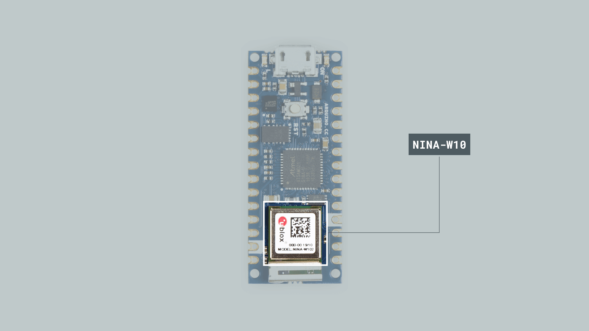
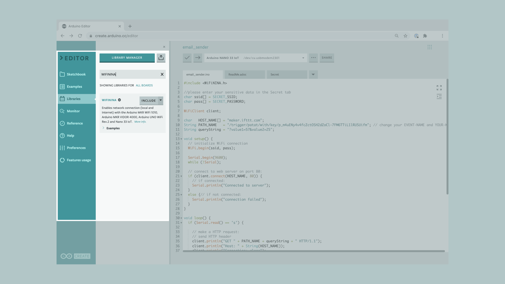
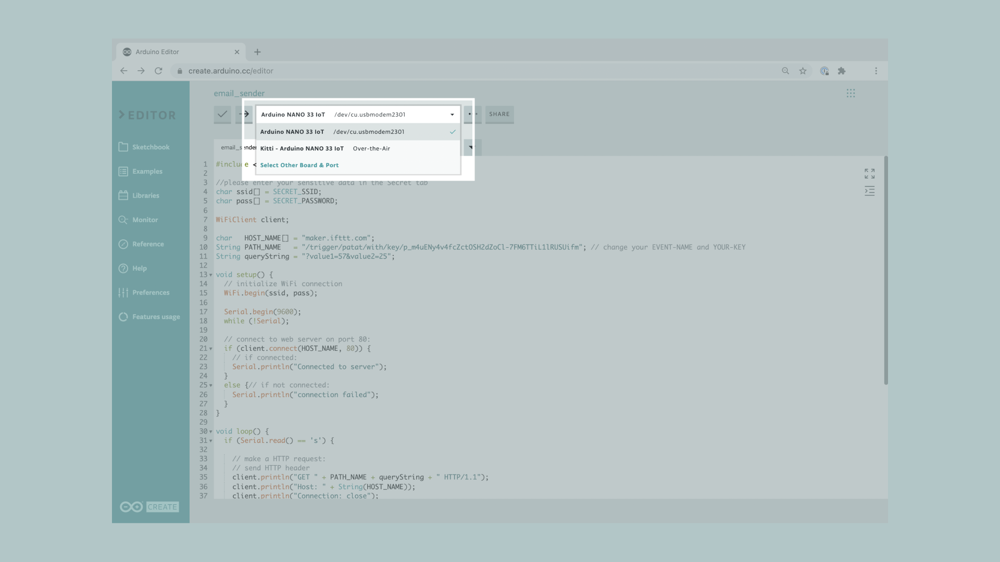
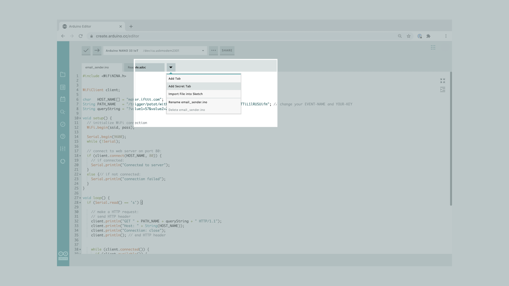
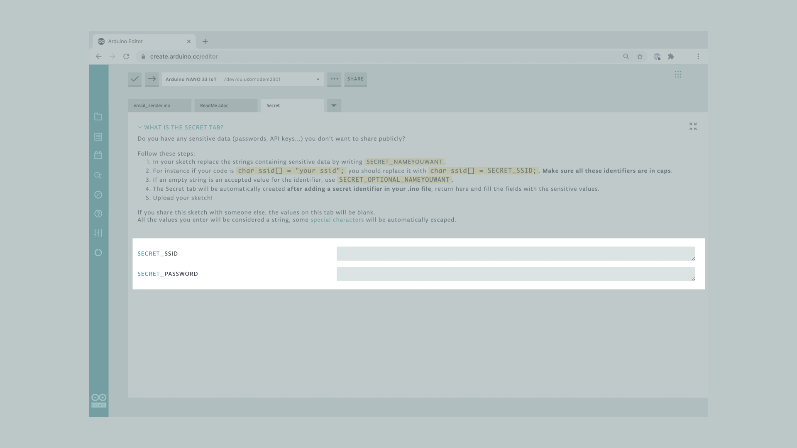
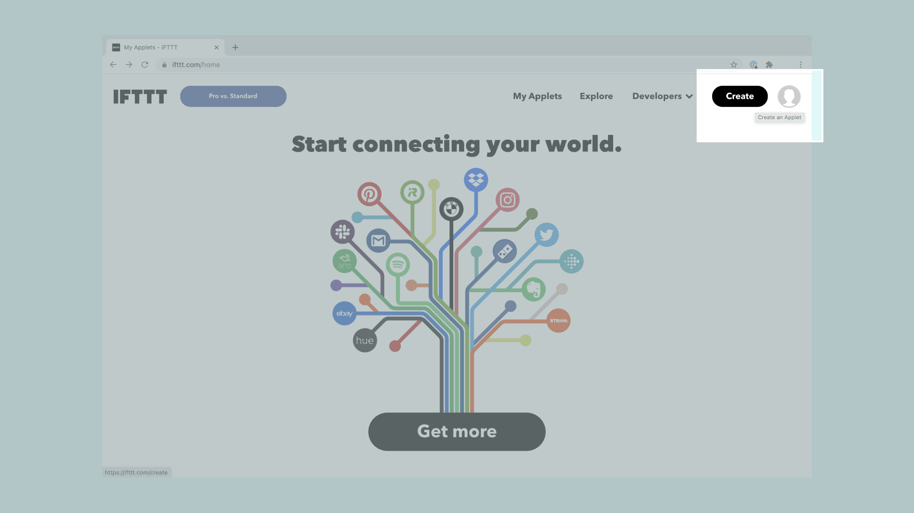
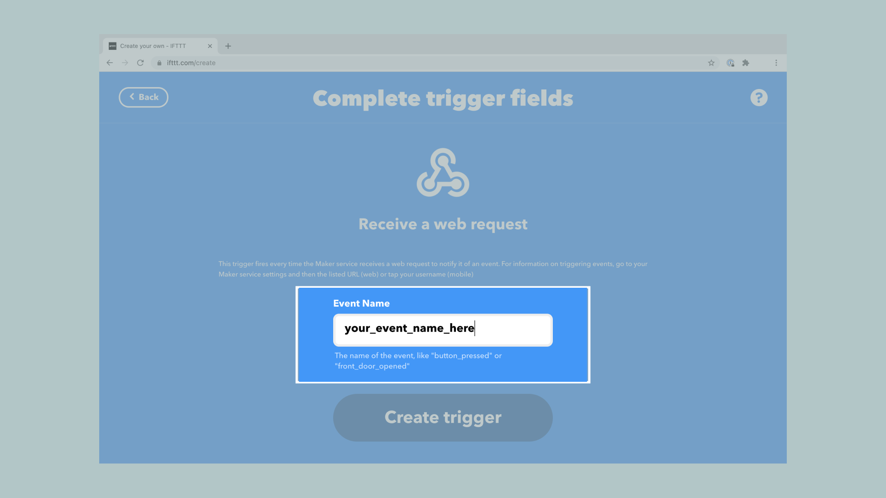
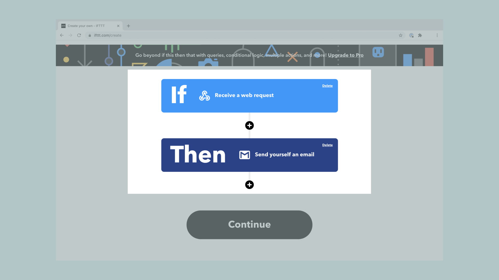
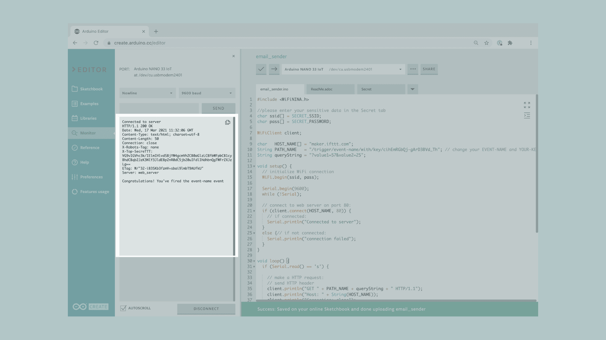

In this tutorial we will use an Arduino Nano 33 IoT, to send and email using an online automation tool that connects applications and services, named IFTTT.


## Goals
The goals of this project are:
 - Learn what an online automation tool is.
 - Understand what the NINA-W102 module is.
 - Use the WiFiNINA library.
 - Learn how to connect Arduino to a service.
 - Learn how to send an email from the Arduino Cloud Editor using online automation tools.


## Hardware & Software Needed
* This project uses no external sensors or components.
* In this tutorial we will use the [Arduino Cloud Editor](https://create.arduino.cc/editor) to program the board.


## Online Automation Tools

An online automation tool is used to connect applications and services to automate repetitive tasks without having to code that process or relying on developers to build the integration. The workflows followed by these tools are "If this, do this". The first part of the process (if this), starts with a trigger, the trigger could be anything from turning on a light, to posting something on your Instagram account. The second part (do this), will run an action step of your choice, every time the set trigger event occurs. For example: if a new row is added to a google spreadsheet, then send me and email.

## The NINA-W102 Module
The NINA-W102 module is a stand-alone multiradio MCU modules module that integrate a powerful microcontroller (MCU) and a radio for wireless communication. The radio provides support for Wi-Fi 802.11 b/g/n in the 2.4 Hz ISM band and Bluetooth® v4.2 (Bluetooth® BR/EDR and Bluetooth® low energy) communications.

If you want to learn more about Wi-Fi and how it works, you can check [this link](https://en.wikipedia.org/wiki/Wi-Fi).



The NINA-W102 includes the wireless MCU, Flash memory, crystal, and components for matching, filtering, antenna and decoupling, making it a very compact stand-alone multiradio module. The module can be used to design solutions with top grade security, thanks to integrated cryptographic hardware accelerators.

### The Library
The WiFiNINA library allows us to use the Arduino Nano 33 IoT NINA-W102 module, without having to go into complicated programming. The library supports **WEP**, **WPA2 Personal** and **WPA2 Enterprise** encryptions and it can serve as either a **server** accepting incoming connections or a **client** making outgoing ones. Some of the most common applications for the module are the following:

- **Internet of Things**
- **Wi-Fi networks**
- **Bluetooth® and Bluetooth® low energy applications**
- **Telematics**
- **Access to laptops, mobile phones, and similar consumer devices**
- **Medical and industrial networking**
- **Home/building automation**

If you want to read more about the NINA-W102 module see <a href="https://content.arduino.cc/assets/Arduino_NINA-W10_DataSheet_%28UBX-17065507%29.pdf" target="_blank">here</a>.

In this tutorial we will use the library to connect the board to the Wi-Fi network and send a HTTP request to a specific URL to trigger an action.


## Creating the Program

**1. Setting up**

Let's start by opening the [Arduino Cloud Editor](https://create.arduino.cc/editor), create a new sketch and name it **email_sender**. Then, navigate to the **Libraries** tab, search for the **WIFININA** library and click on the **Include** button.




**2. Connecting the board**

Next, connect the Arduino Nano 33 IoT to the computer and make sure that the Cloud Editor recognizes it. If so, the board and port should appear as shown in the image below. If they don't appear, follow the [instructions](https://create.arduino.cc/getting-started/plugin/welcome) to install the plugin that will allow the Editor to recognize your board.




**3.Sending the HTTP request**

After including the library, we can begin by building the code.

Let's start by creating a secret header file to store our credential for the Wi-Fi network which we will connect to. In this way we don't accidentally store our credentials in a code we may share on the internet. To do this, we need to click the downward arrow next to our sketch tab, and click **Add Secret Tab**. This will create a tab called **Secret**.



We now need to head back to the original sketch file, and enter the following code:

```arduino
//please enter your sensitive data in the Secret tab
char ssid[] = SECRET_SSID;                // your network SSID (name)
char pass[] = SECRET_PASS;                // your network password (use for WPA, or use as key for WEP)
```

This will automatically create two fields in the **Secret** tab. If we go back to this tab, we can enter our credentials there.



Now that are network credentials are safe, we can go back to the sketch and continue coding. We need to create a client that can connect to a specified internet IP address and port, using the `WiFiClient` function. We want to keep the code as simple as we possible, so in this case the name of the client will just be `client`, but you can name it however you please.

```arduino
WiFiClient client;
```

Then, we need to initialize three new variables called `HOST_NAME[]`, `PATH_NAME` and `queryString` that will store the URL of the webpage we are sending the HTTP request to and the path we need to follow to trigger the action.

```arduino
char   HOST_NAME[] = "maker.ifttt.com";
String PATH_NAME   = "/trigger/event-name/with/key/your-key"; // change your EVENT-NAME and YOUR-KEY
String queryString = "?value1=57&value2=25";
```

>**Note:** Keep in mind that the `PATH_NAME` will be updated once we create the action on the online automation tool.

In the `setup()`, we need to start connecting to Wi-Fi using a `WiFi.begin()` function and then we start the serial communication at 9600 bauds, followed by `while(!Serial)`, which basically means that unless we open the Serial Monitor, the program will not run. We then use an `if else` statement to check if the connection to the web server was successful or not.

```arduino
void setup() {
  // initialize WiFi connection
  WiFi.begin(ssid, pass);

  Serial.begin(9600);
  while (!Serial);

  // connect to web server on port 80:
  if (client.connect(HOST_NAME, 80)) {
    // if connected:
    Serial.println("Connected to server");
  }
  else {// if not connected:
    Serial.println("connection failed");
  }
}
```

Inside the `loop()`, we will be adding an `if()` function to check if the data enter in the Serial Monitor matches. If the data matches, we start making a HTTP request using some `.println()` functions.

```arduino
void loop() {
  if (Serial.read() == 's') {

    // make a HTTP request:
    // send HTTP header
    client.println("GET " + PATH_NAME + queryString + " HTTP/1.1");
    client.println("Host: " + String(HOST_NAME));
    client.println("Connection: close");
    client.println(); // end HTTP header
```

We then add a function that will create a loop where while the client is connected (`while (client.connected())`), if the client have any data available for reading (`if (client.available())`), will be read and print in the Serial Monitor.

```arduino
    while (client.connected()) {
      if (client.available()) {
        // read an incoming byte from the server and print it to serial monitor:
        char c = client.read();
        Serial.print(c);
      }
    }
```

Lastly, we add a `.stop()` function that will stop the communication with the client, when the client is not connected, and we use a `Serial.println()` function to print that the client has disconnected.

```arduino
    // the server's disconnected, stop the client:
    client.stop();
    Serial.println();
    Serial.println("disconnected");
  }
}
```

**4. Complete code**

If you choose to skip the code building section, the complete code can be found below:

```arduino
#include <WiFiNINA.h>

//please enter your sensitive data in the Secret tab
char ssid[] = SECRET_SSID;
char pass[] = SECRET_PASSWORD;

WiFiClient client;

char   HOST_NAME[] = "maker.ifttt.com";
String PATH_NAME   = "/trigger/event-name/with/key/your-key"; // change your EVENT-NAME and YOUR-KEY
String queryString = "?value1=57&value2=25";

void setup() {
  // initialize WiFi connection
  WiFi.begin(ssid, pass);

  Serial.begin(9600);
  while (!Serial);

  // connect to web server on port 80:
  if (client.connect(HOST_NAME, 80)) {
    // if connected:
    Serial.println("Connected to server");
  }
  else {// if not connected:
    Serial.println("connection failed");
  }
}

void loop() {
  if (Serial.read() == 's') {

    // make a HTTP request:
    // send HTTP header
    client.println("GET " + PATH_NAME + queryString + " HTTP/1.1");
    client.println("Host: " + String(HOST_NAME));
    client.println("Connection: close");
    client.println(); // end HTTP header


    while (client.connected()) {
      if (client.available()) {
        // read an incoming byte from the server and print it to serial monitor:
        char c = client.read();
        Serial.print(c);
      }
    }

    // the server's disconnected, stop the client:
    client.stop();
    Serial.println();
    Serial.println("disconnected");
  }
}
```

## Testing It Out

First we need to create the trigger and the action of our choice, using an online automation tool. In this case, we will use the <a href="https://ifttt.com/" target="_blank">IFTTT</a> (If This Then That) as our online automation tool, but you can use any tool you prefer. The process will be similar.

The first step is to log in, if you don't have an account you can create one. Then we need to click on the **Create** button on the top right. We will see the following:



Now we need to click the **Add** button to add the trigger. We will see that we can choose a great amount of services to create a trigger, each of them consisting of different triggers. The one we need for this tutorial is called **Webhooks**, this services will activate the trigger every time the Maker services receives a web request. Click on **Receive a web request** and set an event name. We have set **sketch_received** as event name. Once we have chosen an event name click the **Create trigger** button.



The next part is to create an action that will happen every time Webhooks receives a web request. Click the **Add** button on the **Then That** section. As before we can choose between a lot of applications and services, but the one we are going to use here is **Gmail**. The action will be to receive and email in your own account, so we need to click on the **Send yourself an email** action. Then we just need to set the subject, the body and if we want, attach an URL. Once we have set all the info we just need to click the **Create action** and then **Continue**. It should looks like the image below.



Once we have created the trigger and the action, we can change the title of the applet and click the **Finish** button. The last step is to click on the **Webhooks** symbol and on the **Documentation** button in the top right. Here we can see the **Key**. We need to copy this key, go to the sketch we created before and paste the key to the variable `PATH_NAME` in the space for `your-key`. Then we need to change the `event-name` to the event name we choose in our sketch before, in this case `sketch_received`. Lastly, we just need to upload to code to the board.


Everything is ready! Now we just need to open the Serial Monitor, to see if the client is connected and whenever we enter an `s` and email will be send to your own account and we will see the trigger has been activated successfully in the Serial Monitor.



### Troubleshoot
Sometimes errors occur, if the code is not working there are some common issues we can troubleshoot:
- Missing a bracket or a semicolon.
- Arduino board connected to the wrong port.
- We haven't opened the Serial Monitor to initialize the program.
- We haven't changed the event name or the key


## Conclusion
In this tutorial, we have learned how to simply connect to a Wi-Fi network by using the credentials in the code and send a HTTP request. We also learned how to use an online automation tool to use the HTTP request as a trigger that will execute an action on a different application or service.

