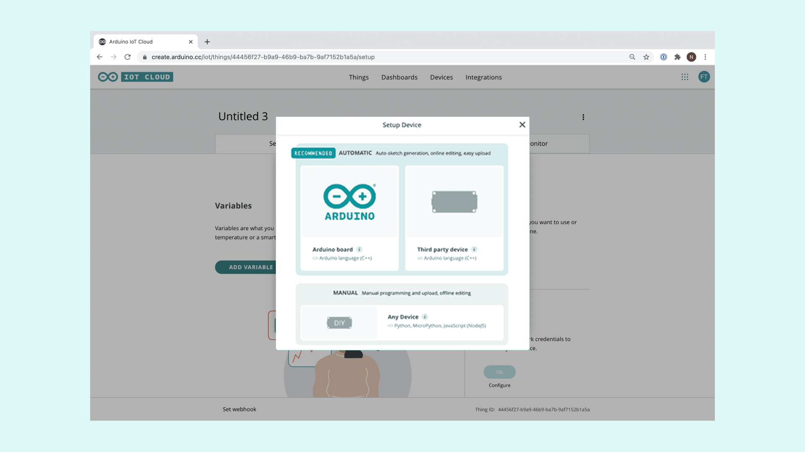

In this tutorial we will use an Arduino Nano 33 IoT, to set an alarm that will turn on an LED controlled by the Arduino Cloud, using the `RTCZero` library.

## Goals

The goals of this project are:
 - Learn what IoT is.
 - Learn about RTC (real-time clock).
 - Use the Arduino RTCZero library.
 - Learn how to create a new thing in the Arduino Cloud.
 - Learn how to set an alarm from the IoT Cloud.


## Hardware & Software Needed
* This project uses no external sensors or components.
* In this tutorial we will use the [Arduino Cloud](https://create.arduino.cc/iot) to program the board.


## Internet of Things and Arduino Cloud


Internet of Things, or IoT, is referring to a giant network of connected devices that are collecting and sharing data all over the world. Billion of devices are simultaneously connected to the Internet sharing information with each other and contributing to a vast digital ecosystem.

This vision of a connected world, brings a new computing paradigm where computation happens in a distributed manner, but data is later shared and processed at different centralized pieces of infrastructure. This network of interconnected entities includes lamps, cellphones, smart watches, washing machines, cars, houses, buildings and people amongst other. All of these interconnected entities “talk” to each other using various technologies and protocols and exchange information over the internet. The nature of applications vary from a simple phone-controlled light bulb, to a complex garbage-management system.

Arduino Cloud is an easy-to-use Internet of Things application platform. Arduino Cloud makes the creation of connected objects quick, simple, and secure. You can connect multiple devices and allow them to exchange real-time data. You can also monitor them from anywhere using a simple user interface.

## RTC - Real Time Clock

A real-time clock is a clock that keeps track of the current time and can be used to program specific actions at a certain time. The term **real-time clock** is used to avoid confusion with ordinary hardware clocks which are only signals that govern digital electronics, and do not count time in human units. RTC should not be confused with real-time computing.

Most RTCs use a crystal oscillator whose frequency is 32.768 KHz (same frequency used in quartz clocks and watches). Namely this frequency equal to 2^15 cycles per second and so is a convenient rate to use with simple binary counter circuits. Furthermore, the RTC continues to operate in sleep mode, so it can be used to wake up the device from sleep modes in a programmed way. Every time the board is powered, the RTC is reset and starts from standard date. To keep the time and the RTC running it is necessary to keep the device powered.

## RTCZero Library

This library allows us to control and use the internal RTC (Real Time Clock) in all the Arduino boards with the **samd** architecture. The library takes care of the initialization of the internal RTC and includes some of the following functions:

```arduino
begin()
setTime()
setDate()
getHours()
getMinutes()
getSeconds()
getYear()
getMonth()
getDay()
setAlarmTime()
setAlarmDate()
enableAlarm()
disableAlarm()
```
If you want to read more about the RTCZero library see <a href="https://www.arduino.cc/reference/en/libraries/rtczero/" target="_blank">here</a>.

## Setting up the Arduino Cloud

**1. Creating the thing**

Let's start by opening the [Arduino Cloud](https://create.arduino.cc/iot). Once we are in the Arduino Cloud, we will see the **Things** where we need to click the **Create Thing** button and rename it as **Nano Alarm**.


**2. Configuring the device**

 We need to connect the Arduino Nano 33 IoT to the computer and make sure that the IoT Cloud recognizes it by clicking on the **Select Device** button on the device field of the thing. A pop up window will appear, asking you to configure either an Arduino device, or an ESP device. Here, we will choose the **Set up an Arduino device** option.



Then, we need to click the **Configure** button, and next we will be asked to name our device. A name is automatically generated, but we can choose any name we want, and click **Next** to continue.

This will initiate a configuration sequence. If nothing goes wrong, we will see a screen below telling us it was successful. Simply press the **Done** button to finish the configuration. If something goes wrong, it could be due to the firmware version (check the note below) or because of the USB cable. Make sure you have an updated version of the Create Plugin on the computer and try to connect the device to the computer with another USB cable.


>**Note:** When we configure the board the first time, in order to provide users with the best performance, the Cloud checks if the core version of the Wi-Fi module of our Arduino Nano 33 IoT board is the last one. If the core version is not the latest you can upload it following [these instructions](https://support.arduino.cc/hc/en-us/articles/360018104880)

**3.Creating variables**

Let's begin by clicking on the **Add variable** button. This will open up a new window, where we can choose the **name**, **data type**, **permission setting** and **update setting**.

Next, we need to set up the following variables in the Cloud. All of them should be configured as **On change** following the next specifications:

| Name               | Data type | Variable permission | Function                                              |
| ------------------ | --------- | ------------------- | ----------------------------------------------------- |
| alarm_state        | boolean   | Read & Write        | Activate or deactivate the alarm                      |
| hours_alarm        | int       | Read & Write        | Set the hours for the alarm                           |
| minutes_alarm      | int       | Read & Write        | Set the minutes for the alarm                         |
| seconds_alarm      | int       | Read & Write        | Set the seconds for the alarm                         |
| led                | boolean   | Read Only           | Indicate if the alarm has been activated or not       |

Remember, we will also need to make sure that we enter our network credentials. This is done by clicking on the **Configure** button at the **Network** panel in the Setup tab of our thing.

**4. Creating the dashboard**

Let's head over to the **Dashboard** tab in the Arduino Cloud, and create a new dashboard by clicking on the **Build Dashboard** button. It is time to rename out "Untitled" dashboard as **Nano Alarm** and start adding the different widgets that we will need. We can do this by clicking on the **Add** button. Once we select each one of the widgets, we will need to link them to the variables we created in the previous step, check the table below to know the matchings between widgets and variables. 

The dashboard needs five widgets in total, each of them is described in the table below.

| Widget               | Variable linked |
| -------------------- | --------------- |
| value                | hours_alarm     |
| value                | minutes_alarm   |
| value                | seconds_alarm   |
| switch               | alarm_state     |
| led                  | led             |

Once we have created all of the widgets, we can arrange them however we want pressing the **arrows** button on the top left, but to keep it clear and simple, it should look similar to the image below.


**5. Building the code**

All of the configurations we have done so far, have basically been compiled into a special sketch. This sketch now contains information on what device we are using, a unique ID of our thing, the variables we created and the network information we entered. All we have to do now, is to add some code to the sketch!

Let's go back to our thing overview by navigating to the **Things** tab, then select our thing named "Nano Alarm" and click on the **Sketch** tab. Here, we should see an automatically generated sketch. This sketch is practically a "shell" for the code that we will add next, meaning it has no functionality yet. Since the code we are creating is quite long, we can press the **Open full editor** button that will link us to the Arduino Web Editor, and work from there.

Once we are in the Arduino Web Editor, we can start modifying the code in order to create an alarm controlled through the IoT Cloud.

After including the `thingProperties` library, we will need to include the `RTCZero` library and create and name an object in this library. In this case, we have called the object `alarm` but you can call it as you want.

```arduino
#include "thingProperties.h"
#include "RTCZero.h"

RTCZero alarm;
```

At the beginning of the `setup()`, we need to initialize the Serial Communication at 9600 bauds using a `Serial.begin(9600)`:

```arduino
void setup() {
  // Initialize serial and wait for port to open:
  Serial.begin(9600);
```

Then at the end, after the `ArduinoCloud.printDebugInfo` function we need to initialize the **RTCZero** library using the `.begin()` function, then we will set the **led** variable as `false`, this will keep the LED off if the alarm hasn't been activated.

```arduino
  ArduinoCloud.printDebugInfo();

  alarm.begin();

  led = false;
}
```

In the `loop()` section, after the `ArduinoCloud.update` function we will use some `Serial.print` functions followed by a `.getHours`, `.getMinutes` and `.getSeconds` functions to keep track and print the current time in the Serial Monitor.

```arduino
void loop() {
  ArduinoCloud.update();

  Serial.print(alarm.getHours());
  Serial.print(":");
  Serial.print(alarm.getMinutes());
  Serial.print(":");
  Serial.println(alarm.getSeconds());
}
```

Now, we will see that after the `loop()` there are some empty functions. These functions have been created automatically from the Cloud and shouldn't be deleted or the sketch won't compile. These functions are created when we add a new variable with **Read & Write** permission, and are called each time we change the value of the variable from the Cloud. So, in order to set a new alarm time each time we change the value from the Cloud, we need to add a `.setAlarmTime()` function inside the following empty functions.

```arduino
void onHoursAlarmChange() {
  alarm.setAlarmTime(hours_alarm, minutes_alarm, seconds_alarm);
}

void onMinutesAlarmChange() {
  alarm.setAlarmTime(hours_alarm, minutes_alarm, seconds_alarm);
}

void onSecondsAlarmChange() {
  alarm.setAlarmTime(hours_alarm, minutes_alarm, seconds_alarm);
}
```

The `onAlarmStateChange()` function will be called each time we press the switch button from the Cloud. We want to activate the alarm when the switch is on (`true`) and deactivate it when the switch is off (`false`). To do this, we need to add an `if else` statement to check if the switch value is true or false. If the switch value is `true`, we will use the `.setAlarmTime()`, `.enableAlarm()` and `.attachInterrupt()` functions to activate the alarm. Inside the `.attachInterrupt()` function we will add a new function called `alarmMatch` that will control what happens when the alarm match. If the switch value is `false` we will use a `.disableAlarm()` function to deactivate the alarm and we will change the led value to `false`.

```arduino
void onAlarmStateChange() {
  if (alarm_state == true) {
    alarm.setAlarmTime(hours_alarm, minutes_alarm, seconds_alarm);
    alarm.enableAlarm(alarm.MATCH_HHMMSS);
    alarm.attachInterrupt(alarmMatch);
  }
  else {
    alarm.disableAlarm();
    led = false;
  }
}
```

The last step is to create a new function called `alarmMatch()` that will control what happen when the alarm match. In this case, we will use this function to turn on the LED on the Cloud setting the led value to `true`.

```arduino
void alarmMatch() {
  led = true;
}
```

Now the code is complete!

**6. Complete code**

```arduino
/*
  Sketch generated by the Arduino Cloud Thing "Nano_Alarm"
  Arduino Cloud Variables description
  The following variables are automatically generated and updated when changes are made to the Thing
  int hours_alarm;
  int seconds_alarm;
  int minutes_alarm;
  bool alarm_state;
  bool led;
  Variables which are marked as READ/WRITE in the Cloud Thing will also have functions
  which are called when their values are changed from the Dashboard.
  These functions are generated with the Thing and added at the end of this sketch.
*/

#include "thingProperties.h"
#include "RTCZero.h"

RTCZero alarm;

void setup() {
  // Initialize serial and wait for port to open:
  Serial.begin(9600);

  // This delay gives the chance to wait for a Serial Monitor without blocking if none is found
  delay(1500);

  // Defined in thingProperties.h
  initProperties();

  // Connect to Arduino Cloud
  ArduinoCloud.begin(ArduinoIoTPreferredConnection);

  /*
     The following function allows you to obtain more information
     related to the state of network and IoT Cloud connection and errors
     the higher number the more granular information you'll get.
     The default is 0 (only errors).
     Maximum is 4
  */

  setDebugMessageLevel(2);

  ArduinoCloud.printDebugInfo();

  alarm.begin();

  led = false;
}

void loop() {
  ArduinoCloud.update();

  Serial.print(alarm.getHours());
  Serial.print(":");
  Serial.print(alarm.getMinutes());
  Serial.print(":");
  Serial.println(alarm.getSeconds());
}

void onHoursAlarmChange() {
  alarm.setAlarmTime(hours_alarm, minutes_alarm, seconds_alarm);
}

void onMinutesAlarmChange() {
  alarm.setAlarmTime(hours_alarm, minutes_alarm, seconds_alarm);
}

void onSecondsAlarmChange() {
  alarm.setAlarmTime(hours_alarm, minutes_alarm, seconds_alarm);
}

void onAlarmStateChange() {
  if (alarm_state == true) {
    alarm.setAlarmTime(hours_alarm, minutes_alarm, seconds_alarm);
    alarm.enableAlarm(alarm.MATCH_HHMMSS);
    alarm.attachInterrupt(alarmMatch);
  }
  else {
    alarm.disableAlarm();
    led = false;
  }
}

void alarmMatch() {
  led = true;
}
```

## Testing It Out

Once we are finished with the coding, we can upload the sketch to the board. When it has successfully uploaded, open the Serial Monitor. In the Serial Monitor, after initializing the communication between the board and the Cloud, we will see the time set as HH:MM:SS.


We can now go to the **Dashboard** tab in the Arduino Cloud to the **Nano Alarm** dashboard we created before. There we can set time for the alarm and activate the alarm with the switch. If the switch is on and the alarm match we will see the LED turn on.


### Troubleshoot

Sometimes errors occur, if the code is not working there are some common issues we can troubleshoot:
- Missing a bracket or a semicolon.
- Arduino board not connected to the IoT Cloud.
- We haven't opened the Serial Monitor to initialize the program.
- The widgets are not linked to the variables


## Conclusion

In this tutorial we have created a basic alarm that turns on a LED through the Arduino Cloud. We learned how to use the Arduino Cloud, how to create a new Thing, create Variables and add widgets to the Dashboard. Lastly, we learned how to use the `RTCZero` library to utilize the RTC peripheral and activate an action at a certain moment.