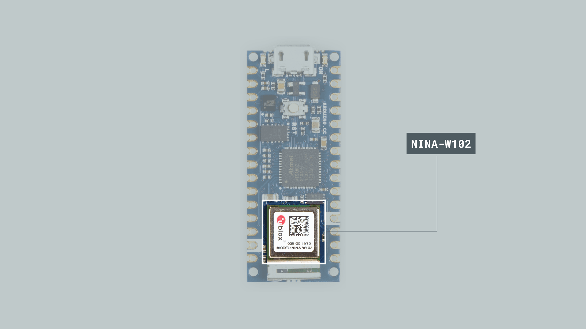
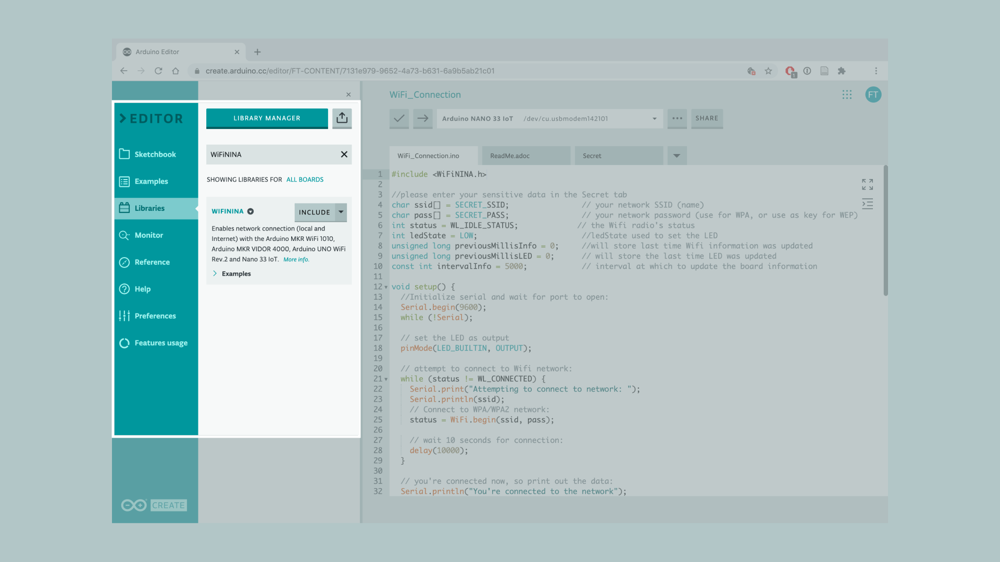
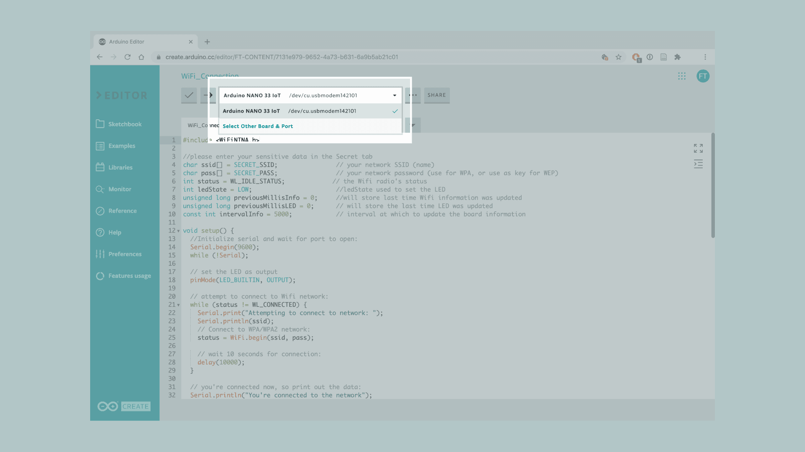
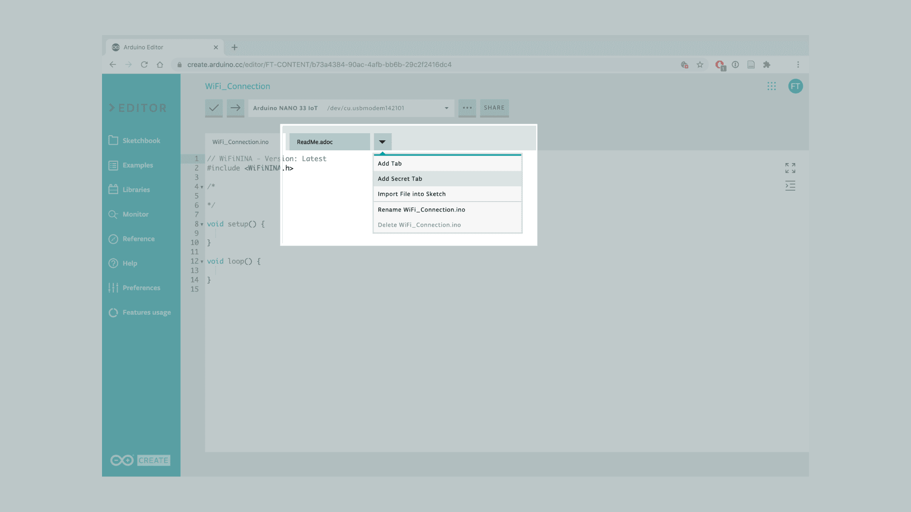
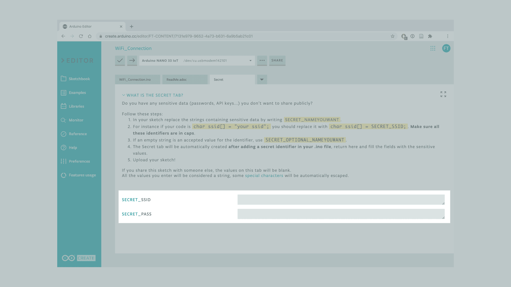
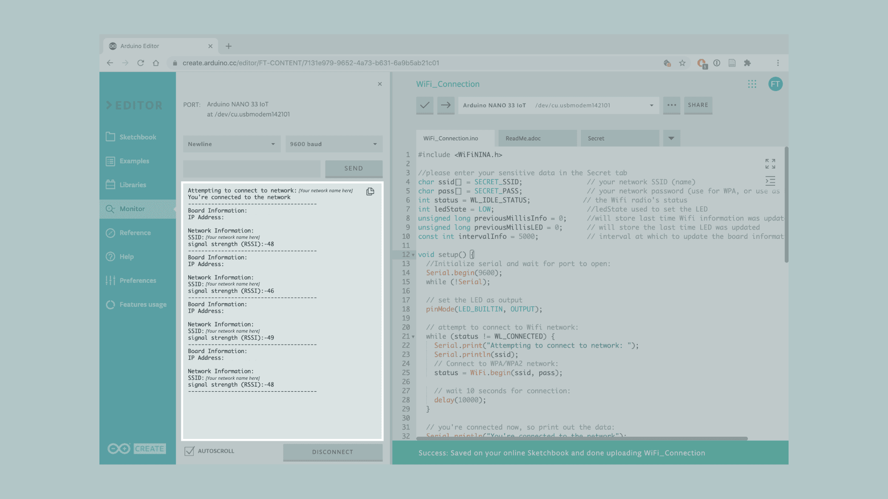

This tutorial will connect an Arduino Nano 33 IoT to the Wi-Fi network, by using the **NINA-W102** module embedded on the board. To do so, we will use the module to create an application that will connect to the Wi-Fi network, measure its strength signal, and make a LED blink based on the strength of the signal.


## Goals

The goals of this project are:
- Understand what the NINA-W102 module is.
- Use the WiFiNINA library.
- Measure the signal strength of a Wi-Fi network.
- Convert the signal strength values in blinking speed of the LED.


## Hardware & Software Needed
* This project uses no external sensors or components.
* In this tutorial we will use the Arduino Cloud Editor to program the board.


## The NINA-W102 Module
The NINA-W102 module is a stand-alone multiradio MCU modules module that integrate a powerful microcontroller (MCU) and a radio for wireless communication. The radio provides support for Wi-Fi 802.11 b/g/n in the 2.4 Hz ISM band and Bluetooth® v4.2 (Bluetooth® BR/EDR and Bluetooth® low energy) communications.

If you want to learn more about Wi-Fi and how it works, you can the check [this link](https://en.wikipedia.org/wiki/Wi-Fi).



The NINA-W102 includes the wireless MCU, Flash memory, crystal, and components for matching, filtering, antenna and decoupling, making it a very compact stand-alone multiradio module. The module can be used to design solutions with top grade security, thanks to integrated cryptographic hardware accelerators.


### The Library
The WiFiNINA library allows us to use the Arduino Nano 33 IoT NINA-W102 module without having to go into complicated programming. The library supports **WEP**, **WPA2 Personal** and **WPA2 Enterprise** encryptions and it can serve as either a **server** accepting incoming connections or a **client** making outgoing ones. Some of the most common applications for the module are the following:

- **Internet of Things**
- **Wi-fi networks**
- **Bluetooth® and Bluetooth® low energy applications**
- **Telematics**
- **Access to laptops, mobile phones, and similar consumer devices**
- **Medical and industrial networking**
- **Home/building automation**

If you want to read more about the NINA-W102 module see <a href="https://content.arduino.cc/assets/Arduino_NINA-W10_DataSheet_%28UBX-17065507%29.pdf" target="_blank">here</a>.

In this tutorial we will read the information of a Wi-Fi network as the SSID, the IP of the board and the strength signal. With this information we will be able to make the LED_BUILTIN of the board blink faster or slower based on the signal strength of the network.


## Creating the Program

**1. Setting up**

Let's start by opening the [Arduino Cloud Editor](https://create.arduino.cc/editor) and creating a new sketch, this can be named "WiFi_Connection". Then, navigate to the **Libraries** tab, search for the **WiFiNINA** library and click on the **Include** button.




**2. Connecting the board**

Next, connect the Arduino Nano 33 IoT to the computer and make sure that the Cloud Editor recognizes it. If so, the board and port should appear as shown in the image below. If they don't appear, follow the [instructions](https://create.arduino.cc/getting-started/plugin/welcome) to install the plugin that will allow the Editor to recognize your board.




**3. Connecting to Wi-Fi**

After including the library, we can begin by building the rest of the code.

Let's start by creating a header file to store our credential for the Wi-Fi network which we will connect to. In this way we don't accidentally store our credentials in a code we may share on the internet. To do this, we need to click the downward arrow next to our sketch tab, and click **"Add Secret Tab"**. This will create a tab called **Secret**.



We now need to head back to the original sketch file, and enter the following code:

```arduino
//please enter your sensitive data in the Secret tab
char ssid[] = SECRET_SSID;                // your network SSID (name)
char pass[] = SECRET_PASS;                // your network password (use for WPA, or use as key for WEP)
```

This will automatically create two fields in the **Secret** tab. If we go back to this tab, we can enter our credentials there.



Now, back to the sketch, we can continue coding. We need to initialize five more variables to store some information as the Wi-Fi radio's status, the state of the LED and time of the last update.

```arduino
int status = WL_IDLE_STATUS;             // the Wi-Fi radio's status
int ledState = LOW;                       //ledState used to set the LED
unsigned long previousMillisInfo = 0;     //will store last time Wi-Fi information was updated
unsigned long previousMillisLED = 0;      // will store the last time LED was updated
const int intervalInfo = 5000;            // interval at which to update the board information
```

In the `setup()` we start serial communication at 9600 bauds, followed by `while(!Serial);`, which basically means that unless we open the Serial Monitor the program will not run. We then use a `pinMode()` to set the LED_BUILTIN pin as an `OUTPUT`.

```arduino
void setup() {
  //Initialize serial and wait for port to open:
  Serial.begin(9600);
  while (!Serial);

  // set the LED as output
  pinMode(LED_BUILTIN, OUTPUT);
```

Then, we create a `while()` loop that checks if we are connected to Wi-Fi, to begin connecting to it. We then use `status = WiFi.begin(ssid, pass);` to start connecting to Wi-Fi, and a delay of 10 seconds to give it enough time to connect.

```arduino
// attempt to connect to Wi-Fi network:
while (status != WL_CONNECTED) {
  Serial.print("Attempting to connect to network: ");
  Serial.println(ssid);
  // Connect to WPA/WPA2 network:
  status = WiFi.begin(ssid, pass);

  // wait 10 seconds for connection:
  delay(10000);
}
```

At the end of the `setup()` we use two `Serial.println()` functions to print out in the serial monitor that we are now connected to the network and to separate the block of data.

```arduino
// you're connected now, so print out the data:
Serial.println("You're connected to the network");
Serial.println("---------------------------------------");
```

In the `loop()` we start initializing a new variable that will store the time since the sketch start running.

```arduino
void loop() {
  unsigned long currentMillisInfo = millis();
```

Then, we will use an `if()` statement to check if the time after the last update is bigger than the interval we set before.

```arduino
// check if the time after the last update is bigger the interval
if (currentMillisInfo - previousMillisInfo >= intervalInfo) {
```

Inside the `if()` statement, we start setting the `previousMillisInfo` variable equal to the `currentMillisInfo` and then we print out three different types of information:

- Board's IP address using the `WiFi.localIP()` function.
- Name of network connected to using the `WiFi.SSID()` function.
- Signal strength using the `WiFi.RSSI()` function.

```arduino
    previousMillisInfo = currentMillisInfo;

    Serial.println("Board Information:");
    // print your board's IP address:
    IPAddress ip = WiFi.localIP();
    Serial.print("IP Address: ");
    Serial.println(ip);

    // print your network's SSID:
    Serial.println();
    Serial.println("Network Information:");
    Serial.print("SSID: ");
    Serial.println(WiFi.SSID());

    // print the received signal strength:
    long rssi = WiFi.RSSI();
    Serial.print("signal strength (RSSI):");
    Serial.println(rssi);
    Serial.println("---------------------------------------");
  }
```

After this, we need to initialize another two variables, one to keep track of the time for the LED and another one to convert the signal strength measured for the `WiFi.RSSI()` function to a time interval.

```arduino
unsigned long currentMillisLED = millis();

// measure the signal strength and convert it into a time interval
int intervalLED = WiFi.RSSI() * -10;
```

Lastly, we create another `if()` statement to check if the time after the last blink is bigger than the interval, in the same way we did before. Inside the `if()` statement we add a new `else if()` statement to turn the LED on if it was off and vice-versa, and a `digitalWrite()` function to set the state of the LED.

```arduino
// check if the time after the last blink is bigger the interval 
  if (currentMillisLED - previousMillisLED >= intervalLED) {
    previousMillisLED = currentMillisLED;

    // if the LED is off turn it on and vice-versa:
    if (ledState == LOW) {
      ledState = HIGH;
    } else {
      ledState = LOW;
    }

    // set the LED with the ledState of the variable:
    digitalWrite(LED_BUILTIN, ledState);
  }
}
```

**4. Complete code**

If you choose to skip the code building section, the complete code can be found below:

```arduino
#include <WiFiNINA.h>

//please enter your sensitive data in the Secret tab
char ssid[] = SECRET_SSID;                // your network SSID (name)
char pass[] = SECRET_PASS;                // your network password (use for WPA, or use as key for WEP)
int status = WL_IDLE_STATUS;             // the Wi-Fi radio's status
int ledState = LOW;                       //ledState used to set the LED
unsigned long previousMillisInfo = 0;     //will store last time Wi-Fi information was updated
unsigned long previousMillisLED = 0;      // will store the last time LED was updated
const int intervalInfo = 5000;            // interval at which to update the board information

void setup() {
  //Initialize serial and wait for port to open:
  Serial.begin(9600);
  while (!Serial);

  // set the LED as output
  pinMode(LED_BUILTIN, OUTPUT);

  // attempt to connect to Wi-Fi network:
  while (status != WL_CONNECTED) {
    Serial.print("Attempting to connect to network: ");
    Serial.println(ssid);
    // Connect to WPA/WPA2 network:
    status = WiFi.begin(ssid, pass);

    // wait 10 seconds for connection:
    delay(10000);
  }

  // you're connected now, so print out the data:
  Serial.println("You're connected to the network");
  Serial.println("---------------------------------------");
}

void loop() {
  unsigned long currentMillisInfo = millis();

  // check if the time after the last update is bigger the interval
  if (currentMillisInfo - previousMillisInfo >= intervalInfo) {
    previousMillisInfo = currentMillisInfo;

    Serial.println("Board Information:");
    // print your board's IP address:
    IPAddress ip = WiFi.localIP();
    Serial.print("IP Address: ");
    Serial.println(ip);

    // print your network's SSID:
    Serial.println();
    Serial.println("Network Information:");
    Serial.print("SSID: ");
    Serial.println(WiFi.SSID());

    // print the received signal strength:
    long rssi = WiFi.RSSI();
    Serial.print("signal strength (RSSI):");
    Serial.println(rssi);
    Serial.println("---------------------------------------");
  }
  
  unsigned long currentMillisLED = millis();
  
  // measure the signal strength and convert it into a time interval
  int intervalLED = WiFi.RSSI() * -10;
 
  // check if the time after the last blink is bigger the interval 
  if (currentMillisLED - previousMillisLED >= intervalLED) {
    previousMillisLED = currentMillisLED;

    // if the LED is off turn it on and vice-versa:
    if (ledState == LOW) {
      ledState = HIGH;
    } else {
      ledState = LOW;
    }

    // set the LED with the ledState of the variable:
    digitalWrite(LED_BUILTIN, ledState);
  }
}
```


## Testing It Out

After you have successfully verified and uploaded the sketch to the board, it's time to put it to the test. Don't forget to enter the credentials of the network in the **Secret** tab. Once the board it's connected to the network we can see the information in the Serial Monitor.



Move the board around and you will see how the signal strength changes as well as the blinking speed of the board's LED. The signal strength is measure in **dBm** (decibel-milliwatts) which means that the lower the number is, the stronger the connection, and the faster the LED will blink.


### Troubleshoot

Sometimes errors occur, if the code is not working there are some common issues we can troubleshoot:
- Missing a bracket or a semicolon.
- Arduino board connected to the wrong port.
- Missing the SSID and PASS in the Secret tab. Remember, it is a case sensitive.


## Conclusion

In this tutorial, we have learned how to simply connect to a Wi-Fi network by using the credentials in the code. We also learned how to obtain specific information regarding our connection, such as signal strength, IP address and name of our network, and then use that information to make a LED blink faster or slower.