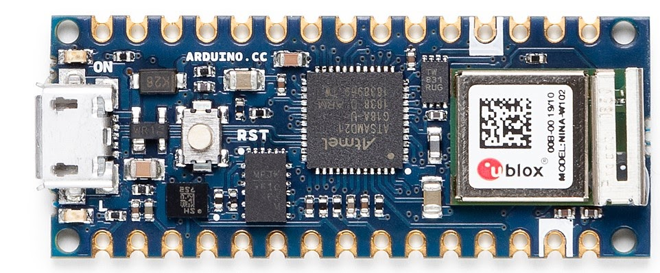

# Description 
The Arduino® Nano ESP32 (with and without headers) is a Nano form factor board based on the ESP32-S3 microcontroller unit (MCU). This is the first Arduino board to be based fully on an ESP32 MCU, and features Wi-Fi, Bluetooth® LE, debugging via native USB in the Arduino IDE as well as low power.

The Nano ESP32 is compatible with the Arduino IoT Cloud, and has support for MicroPython. It is an ideal board for getting started with IoT development.

# Target areas:
Maker, Debugging, IoT, MicroPython

# Features
* **Espressif ESP32-S3** 
    * **Xtensa® Dual-core 32-bit LX7 Microprocessor**
      * Up to 240 MHz
      * 384 KB ROM
      * 512 KB SRAM
      * 16 KB SRAM in RTC (low power mode)
      * Built-in temperature sensor (not ambient)
      * DMA Controller
    * **Power**
      * Operating voltage 3.3V
      * VUSB supplies 5V via USB-C connector
      * VIN range is 6-18V
    * **Connectivity**
      * Wi-Fi
      * Bluetooth® LE
      * Built-in antenna
      * 2.4 GHz transmitter/receiver
      * Up to 150 Mbps
    * **Pins**
      * 14x digital (21x including analog)
      * 8x analog (available in RTC mode)
      * SPI(D11,D12,D13), I2C (A4/A5), UART(D0/D1)
    * **Communication Ports**
      * SPI
      * I2C
      * I2S
      * UART
      * CAN (TWAI®)
    * **Low Power**
      * 7 μA consumption in deep sleep mode
      * 240 μA consumption in light sleep mode
      * RTC Memory
      * Ultra Low Power (ULP) Coprocessor
      * Power Management Unit (PMU)
      * ADC in RTC mode

# Contents

## The Board

Nano ESP32 is a 3.3V development board based on the NORA-W106-10B from uBlox, a module that includes a ESP32-S3 system on a chip (SoC). This module has support for Wi-Fi and Bluetooth® Low Energy (LE), with amplified communication through a a built-in antenna. The CPU (32-bit Xtensa® LX7) support clock frequencies up to 240 MHz and has native support for debugging via the USB-C connector. 

### Application Examples

**Home automation:** an ideal board for building home automations for your home, such as smart switches, automatic lighting and motor control for e.g. motor controlled blinds. 

**IoT sensors:** with several dedicated ADC channels, accessible I2C/SPI buses and a robust ESP32 based radio module, this board can easily be deployed to monitor sensor values. 

**Low power design:** create battery powered applications with low power consumption, utilising the built in low power modes of the ESP32-S3 SoC. 

## ESP32 Core

The Nano ESP32 is based on the [Arduino Core for ESP32 boards](), a derivation of Espressif's [arduino-esp32](https://github.com/espressif/arduino-esp32) core.

# Rating

## Recommended Operating Conditions

| Symbol          | Description                      | Min                | Typ | Max                | Unit |
| --------------- | -------------------------------- | ------------------ | --- | ------------------ | ---- |
| VIN  | Input voltage from VIN pad       | 6                  | 7.0 | 24                 | V    |
| VUSB | Input voltage from USB connector | 4.8                | 5.0 | 5.5                | V    |
| VDD  | Input high-level voltage         | 0.7*VDD |     | VDD     | V    |
| VIL  | Input low-level voltage          | 0                  |     | 0.3*VDD | V    |
| TOP  | Operating Temperature            | -40                | 25  | 85                 | °C   |

**Note:** VDD controls the logic level and is connected to the 5V power rail. VAREF is for the analog logic.

# Functional Overview

## Block Diagram

## Board Topology

### Front View

| **Ref.** | **Description**                                  |
| -------- | ------------------------------------------------ |
| M1       | NORA-W106-10B (ESP32-S3 SoC)                     |
| J1       | CX90B-16P USB-C connector                        |
| JP1      | 1x15 analog header                               |
| JP2      | 1x15 digital header                              |
| U2       | MP2322GQH step down converter                    |
| U3       | GD25B128EWIGR 128 Mbit (16 MB) ext. flash memory |
| DL1      | RGB LED                                          |
| DL2      | LED SCK (serial clock)                           |
| DL3      | LED Power (green)                                |
| D2       | PMEG6020AELRX Schottky Diode                     |
| D3       | PRTR5V0U2X,215 ESD Protection                    |

### Back View

## NORA-W106-10B (Radio Module / MCU)

The Nano ESP32 features the **NORA-W106-10B** stand alone radio module, embedding an ESP32-S3 series SoC as well as an antenna. The ESP32-S3 is based on a LX7 Microprocessor with a clock frequency at up to 240 MHz and 512kB SRAM.

The ESP32-S3 SoC includes 

### Wi-Fi

Data rate up to 150 Mbps

* 802.11b: 11 Mbit/s
* 802.11g: 54 Mbit/s 
* 802.11n: 72 Mbit/s max at HT-20 (20 MHz), 150 Mbit/s max at HT-40 (40 MHz)

### Bluetooth

## Serial Communication Protocols

The ESP32-S3 chip provides flexibility for the various serial protocols it supports. For example, the I2C bus can be assigned to almost any available GPIO.

### I2C  

Default pins:
- A4 - SDA
- A5 - SCL

The I2C bus is by default assigned to the A4/A5 (SDA/SCL) pins for retro compatibility. This pin assignment can however be changed, due to the flexibility of the ESP32-S3 chip.

The SDA and SCL pins can be assigned to most available GPIOs, however some of these pins may have other essential functions that prevents I2C operations to run successfully.

**Please note:** many software libraries uses the standard pin assignment (A4/A5) and requires manual changes in the library code to work.   

### I2S

There two I2S controllers that are typically used for communication with audio devices. There are no specific pins assigned for I2S, this can be used by any free GPIO.

Using standard or TDM mode, the following lines are used:
- **MCLK** - master clock
- **BCLK** - bit clock
- **WS** - word select
- **DIN/DOUT** - serial data

Using PDM mode:
- **CLK** - PDM clock
- **DIN/DOUT** serial data

Read more about the I2S protocol in [Espressif's Peripheral API - InterIC Sounds (I2S)](https://docs.espressif.com/projects/esp-idf/en/latest/esp32s3/api-reference/peripherals/i2s.html)  

### SPI

- SCK - D13
- COPI - D12
- CIPO - D11  
- CS - D10

The SPI controller 

### UART

- D0 / TX
- D1 / RX

The 

### CAN (TWAI®)

## USB Connector

The Nano ESP32 has one USB-C® port, used to power and program your board as well as sending & receiving serial communication.

Note that you should not power the board with more than 5V via the USB-C® port.

## Power Options

Power can either be supplied via the VIN pin, or via USB-C® connector. If power is supplied via VIN, the ISL854102FRZ buck converter steps the voltage down to 5V.

Both VUSB and VIN pins are connected to the ISL854102FRZ buck converter, with Schottky diodes in place for reverse polarity & overvoltage protection respectively. 

Power via USB supplies about ~4.7V (due to Schottky drop) to the RA4M1 MCU.

The linear regulator (SGM2205-3.3XKC3G/TR) converts 5V from either the buck converter or USB, and provides 3.3V to a number of components, including the ESP32-S3 module.

### Power Tree

### Pin Voltage

The general operating voltage for Nano ESP32 is 5V, however the ESP32-S3 module's operating voltage is 3.3V. 

### Pin Current

The GPIOs on the R7FA4M1AB3CFM#AA0 microcontroller can handle up to 20 mA. Never connect devices that draw higher current directly to a GPIO.

For powering e.g. servo motors, use an external power supply.

# Mechanical Information

## Pinout

### Analog

| Pin | Function | Type   | Description                                     |
| --- | -------- | ------ | ----------------------------------------------- |
| 1   | BOOT     | NC     | Not Connected                                   |
| 2   | IOREF    | IOREF  | Reference for digital logic V - connected to 5V |
| 3   | Reset    | Reset  | Reset                                           |
| 4   | +3V3     | Power  | +3V3 Power Rail                                 |
| 5   | +5V      | Power  | +5V Power Rail                                  |
| 6   | GND      | Power  | Ground                                          |
| 7   | GND      | Power  | Ground                                          |
| 8   | VIN      | Power  | Voltage Input                                   |
| 9   | A0       | Analog | Analog input 0 / DAC                            |
| 10  | A1       | Analog | Analog input 1 / OPAMP+                         |
| 11  | A2       | Analog | Analog input 2 / OPAMP-                         |
| 12  | A3       | Analog | Analog input 3 / OPAMPOut                       |
| 13  | A4       | Analog | Analog input 4 / I²C Serial Datal (SDA)         |
| 14  | A5       | Analog | Analog input 5 / I²C Serial Clock (SCL)         |

### Digital

| Pin | Function  | Type    | Description                                      |
| --- | --------- | ------- | ------------------------------------------------ |
| 1   | SCL       | Digital | I²C Serial Clock (SCL)                           |
| 2   | SDA       | Digital | I²C Serial Datal (SDA)                           |
| 3   | AREF      | Digital | Analog Reference Voltage                         |
| 4   | GND       | Power   | Ground                                           |
| 5   | D13/SCK   | Digital | GPIO 13 / SPI Clock                              |
| 6   | D12/CIPO  | Digital | GPIO 12 / SPI Controller In Peripheral Out       |
| 7   | D11/COPI  | Digital | GPIO 11 (PWM) / SPI Controller Out Peripheral In |
| 8   | D10/CS    | Digital | GPIO 10 (PWM) / SPI Chip Select                  |
| 9   | D9        | Digital | GPIO 9 (PWM~)                                    |
| 10  | D8        | Digital | GPIO 8                                           |
| 11  | D7        | Digital | GPIO 7                                           |
| 12  | D6        | Digital | GPIO 6 (PWM~)                                    |
| 13  | D5/CANRX0 | Digital | GPIO 5 (PWM~) / CAN Transmitter (TX)             |
| 14  | D4/CANTX0 | Digital | GPIO 4 / CAN Receiver (RX)                       |
| 15  | D3        | Digital | GPIO 3 (PWM~)                                    |
| 16  | D2        | Digital | GPIO 2                                           |
| 17  | D1/TX0    | Digital | GPIO 1 / Serial 0 Transmitter (TX)               |
| 18  | D0/TX0    | Digital | GPIO 0 / Serial 0 Receiver    (RX)               |

## Mounting Holes And Board Outline

