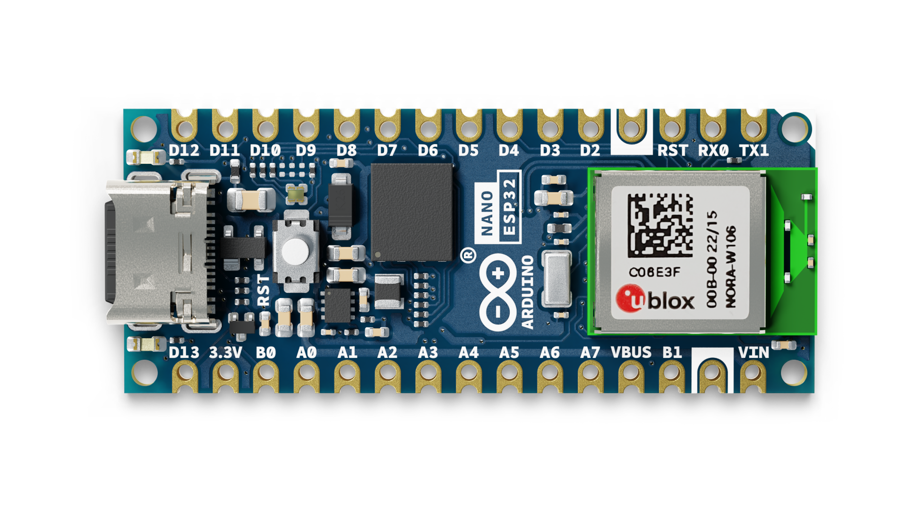

# Description 
The Arduino Nano ESP32 (with and without headers) is a Nano form factor board based on the ESP32-S3 (embedded in the NORA-W106-10B from u-blox®). This is the first Arduino board to be based fully on an ESP32, and features Wi-Fi® as well as Bluetooth® LE.

The Nano ESP32 is compatible with the Arduino Cloud, and has support for MicroPython. It is an ideal board for getting started with IoT development.

# Target areas:
Maker, IoT, MicroPython

# Features

* **Xtensa® Dual-core 32-bit LX7 Microprocessor**
  * Up to 240 MHz
  * 384 kB ROM
  * 512 kB SRAM
  * 16 kB SRAM in RTC (low power mode)
  * DMA Controller
* **Power**
  * Operating voltage 3.3 V
  * VBUS supplies 5 V via USB-C® connector
  * VIN range is 6-21 V
* **Connectivity**
  * Wi-Fi®
  * Bluetooth® LE
  * Built-in antenna
  * 2.4 GHz transmitter/receiver
  * Up to 150 Mbps
* **Pins**
  * 14x digital (21x including analog)
  * 8x analog (available in RTC mode)
  * SPI(D11,D12,D13), I2C (A4/A5), UART(D0/D1)
* **Communication Ports**
  * SPI
  * I2C
  * I2S
  * UART
  * CAN (TWAI®)
* **Low Power**
  * 7 μA consumption in deep sleep mode\*
  * 240 μA consumption in light sleep mode\*
  * RTC Memory
  * Ultra Low Power (ULP) Coprocessor
  * Power Management Unit (PMU)
  * ADC in RTC mode

\*The power consumption ratings listed in low power modes are only for the ESP32-S3 SoC. Other components on the board (such as LEDs), consumes power as well, which increases the overall power consumption of the board.

# Contents

## The Board

Nano ESP32 is a 3.3 V development board based on the NORA-W106-10B from u-blox®, a module that includes a ESP32-S3 system on a chip (SoC). This module has support for Wi-Fi® and Bluetooth® Low Energy (LE), with amplified communication through a built-in antenna. The CPU (32-bit Xtensa® LX7) supports clock frequencies at up to 240 MHz.

### Application Examples

**Home automation:** an ideal board for automating your home, and can be used for smart switches, automatic lighting and motor control for e.g. motor controlled blinds. 

**IoT sensors:** with several dedicated ADC channels, accessible I2C/SPI buses and a robust ESP32-S3 based radio module, this board can easily be deployed to monitor sensor values. 

**Low power designs:** create battery powered applications with low power consumption, utilising the built in low power modes of the ESP32-S3 SoC.

## ESP32 Core

The Nano ESP32 uses the [Arduino Board Package for ESP32 boards](https://github.com/arduino/arduino-esp32), a derivation of Espressif's [arduino-esp32](https://github.com/espressif/arduino-esp32) core.

# Rating

## Recommended Operating Conditions

| Symbol              | Description                      | Min | Typ | Max | Unit |
| ------------------- | -------------------------------- | --- | --- | --- | ---- |
| VIN      | Input voltage from VIN pad       | 6   | 7.0 | 21  | V    |
| VUSB     | Input voltage from USB connector | 4.8 | 5.0 | 5.5 | V    |
| Tambient | Ambient Temperature              | -40 | 25  | 105 | °C   |

# Functional Overview

## Block Diagram

## Board Topology

### Front View

| **Ref.** | **Description**                                  |
| -------- | ------------------------------------------------ |
| M1       | NORA-W106-10B (ESP32-S3 SoC)                     |
| J1       | CX90B-16P USB-C® connector                       |
| JP1      | 1x15 analog header                               |
| JP2      | 1x15 digital header                              |
| U2       | MP2322GQH step down converter                    |
| U3       | GD25B128EWIGR 128 Mbit (16 MB) ext. flash memory |
| DL1      | RGB LED                                          |
| DL2      | LED SCK (serial clock)                           |
| DL3      | LED Power (green)                                |
| D2       | PMEG6020AELRX Schottky Diode                     |
| D3       | PRTR5V0U2X,215 ESD Protection                    |

## NORA-W106-10B (Radio Module / MCU)

The Nano ESP32 features the **NORA-W106-10B** stand alone radio module, embedding an ESP32-S3 series SoC as well as an embedded antenna. The ESP32-S3 is based on an Xtensa® LX7 series microprocessor.

### Xtensa® Dual-Core 32bit LX7 Microprocessor

The microprocessor for the ESP32-S3 SoC inside the NORA-W106 module is a dual-core 32-bit Xtensa® LX7. Each core can run at up to 240 MHz and has 512 kB SRAM memory. The LX7 features:
- 32-bit customized instruction set
- 128-bit data bus 
- 32-bit multiplier / divider

The LX7 has a 384 kB ROM (Read Only Memory), and 512 kB of SRAM (Static Random Access Memory). It also features an 8 kB **RTC FAST** and **RTC SLOW** memory. These memories are designed for low-power operations, where the **SLOW** memory can be accessed by the ULP (Ulta Low Power) coprocessor, retaining the data in deep sleep mode.

### Wi-Fi®

The NORA-W106-10B module supports the Wi-Fi® 4 IEEE 802.11 standards b/g/n, with an output power EIRP at up to 10 dBm. The max range for this module is 500 meters.

* 802.11b: 11 Mbit/s
* 802.11g: 54 Mbit/s 
* 802.11n: 72 Mbit/s max at HT-20 (20 MHz), 150 Mbit/s max at HT-40 (40 MHz)

### Bluetooth®

The NORA-W106-10B module supports Bluetooth® LE v5.0 with an output power EIRP at up to 10 dBm and data rates up to 2 Mbps. It has the option to scan and advertise simultaneously, as well as supporting multiple connections in peripheral/central mode.

### PSRAM

The NORA-W106-10B module includes 8 MB of embedded PSRAM. (Octal SPI)

### Antenna Gain

The built-in antenna on the NORA-W106-10B module uses GFSK modulation technique, with the performance ratings listed below:

Wi-Fi®:
- Typical conducted output power: **17 dBm.**
- Typical radiated output power: **20 dBm EIRP.**
- Conducted sensitivity: **-97 dBm**.

Bluetooth® Low Energy:
- Typical conducted output power: **7 dBm.**
- Typical radiated output power: **10 dBm EIRP.**
- Conducted sensitivity: **-98 dBm**.

This data is retrieved from the uBlox NORA-W10 data sheet (page 7, section 1.5) available [here](https://www.u-blox.com/en/product/nora-w10-series). 

## System

### Resets

The ESP32-S3 has support for four levels of reset:
- **CPU:** resets CPU0/CPU1 core 
- **Core:** resets the digital system, except for the RTC peripherals (ULP coprocessor, RTC memory).
- **System:** resets the entire digital system, including the RTC peripherals.
- **Chip:** resets the entire chip.

It is possible to conduct a software reset of this board, as well as obtaining the reset reason.

To do a hardware reset of the board, use the onboard reset button (PB1). 

### Timers

The Nano ESP32 has the following timers:
- 52-bit system timer with 2x 52-bit counters (16 MHz) and 3x comparators. 
- 4x general-purpose 54-bit timers
- 3x watchdog timers, two in main system (MWDT0/1), one in the RTC module (RWDT).

### Interrupts

All GPIOs on the Nano ESP32 can be configured to be used as interrupts, and is provided by an interrupt matrix. Interrupt pins are configured on an application level, using the following configurations:
- LOW
- HIGH
- CHANGE
- FALLING	
- RISING

## Serial Communication Protocols

The ESP32-S3 chip provides flexibility for the various serial protocols it supports. For example, the I2C bus can be assigned to almost any available GPIO.

### Inter-Integrated Circuit (I2C)

Default pins:
- A4 - SDA
- A5 - SCL

The I2C bus is by default assigned to the A4/A5 (SDA/SCL) pins for retro compatibility. This pin assignment can however be changed, due to the flexibility of the ESP32-S3 chip.

The SDA and SCL pins can be assigned to most GPIOs, however some of these pins may have other essential functions that prevents I2C operations to run successfully.

**Please note:** many software libraries uses the standard pin assignment (A4/A5).

### Inter-IC Sound (I2S)

There two I2S controllers that are typically used for communication with audio devices. There are no specific pins assigned for I2S, this can be used by any free GPIO.

Using standard or TDM mode, the following lines are used:
- **MCLK** - master clock
- **BCLK** - bit clock
- **WS** - word select
- **DIN/DOUT** - serial data

Using PDM mode:
- **CLK** - PDM clock
- **DIN/DOUT** serial data

Read more about the I2S protocol in [Espressif's Peripheral API - InterIC Sounds (I2S)](https://docs.espressif.com/projects/esp-idf/en/latest/esp32s3/api-reference/peripherals/i2s.html)  

### Serial Peripheral Interface (SPI)

- SCK - D13
- CIPO - D12
- COPI - D11  
- CS - D10

The SPI controller is by default assigned to the pins above.

### Universal Asynchronous Receiver/Transmitter (UART)

- D0 / TX
- D1 / RX

The UART controller is by default assigned to the the pins above.

### Two Wire Automotive Interface (TWAI®)

The CAN/TWAI® controller is used to communicate with systems using the CAN/TWAI® protocol, particularly common in the automotive industry. There are no specific pins assigned for the CAN/TWAI® controller, any free GPIO can be used. 

**Please note:** TWAI® is also known as the CAN2.0B, or "CAN classic". The CAN controller is **NOT** compatible with CAN FD frames.

## External Flash Memory

Nano ESP32 features a 128 Mbit (16 MB) external flash, the GD25B128EWIGR (U3). This memory is connected to the ESP32 via Quad Serial Peripheral Interface (QSPI).

The operating frequency for this IC is 133 MHz, and has a data transfer rate at up to 664 Mbit/s.

## USB Connector

The Nano ESP32 has one USB-C® port, used to power and program your board as well as sending & receiving serial communication.

Note that you should not power the board with more than 5 V via the USB-C® port.

## Power Options

Power can either be supplied via the VIN pin, or via USB-C® connector. Any voltage input either via USB or VIN is stepped down to 3.3 V using the MP2322GQH (U2) converter.

The operating voltage for this board is 3.3 V. Please note that there's no 5V pin available on this board, only the VBUS can provide 5 V when the board is powered via USB.

### Power Tree

### Pin Voltage

All digital & analog pins on the Nano ESP32 are 3.3 V. Do not connect any higher voltage devices to any of the pins as it will risk damaging the board.

### VIN Rating

The recommended input voltage range is **6-21 V**.

You should not attempt to power the board with a voltage outside the recommended range, particularly not higher than 21 V.

The efficiency of the converter depends on the input voltage via the VIN pin. See the average below for a board operation with normal current consumption:  
- **4.5 V** - >90%.
- **12 V** - 85-90%
- **18 V** - <85%

This information is extracted from the MP2322GQH's datasheet.

### VBUS

There is no 5V pin available on the Nano ESP32. 5 V can only be provided via the **VBUS**, which is supplied directly from the USB-C® power source.

While powering the board via the VIN pin, the VBUS pin is not activated. This means you have no option of providing 5 V from the board unless powered via USB or externally.

### Using the 3.3 V Pin

The 3.3 V pin is connected to the 3.3 V rail which is connected to the output of the MP2322GQH step down converter. This pin is primarily used to power external components.

### Pin Current

The GPIOs on the Nano ESP32 can handle **source currents** up to **40 mA**, and **sink currents** up to **28 mA**. Never connect devices that draw higher current directly to a GPIO. 

# Mechanical Information

## Pinout

### Analog (JP1)

| Pin | Function  | Type   | Description                             |
| --- | --------- | ------ | --------------------------------------- |
| 1   | D13 / SCK | NC     | Serial Clock                            |
| 2   | +3V3      | Power  | +3V3 Power Rail                         |
| 3   | BOOT0     | Mode   | Board Reset 0                           |
| 4   | A0        | Analog | Analog input 0                          |
| 5   | A1        | Analog | Analog input 1                          |
| 6   | A2        | Analog | Analog input 2                          |
| 7   | A3        | Analog | Analog input 3                          |
| 8   | A4        | Analog | Analog input 4 / I²C Serial Datal (SDA) |
| 9   | A5        | Analog | Analog input 5 / I²C Serial Clock (SCL) |
| 10  | A6        | Analog | Analog input 6                          |
| 11  | A7        | Analog | Analog input 7                          |
| 12  | VBUS      | Power  | USB power (5V)                          |
| 13  | BOOT1     | Mode   | Board Reset 1                           |
| 14  | GND       | Power  | Ground                                  |
| 15  | VIN       | Power  | Voltage Input                           |

### Digital (JP2)

| Pin | Function     | Type     | Description                             |
| --- | ------------ | -------- | --------------------------------------- |
| 1   | D12 / CIPO\* | Digital  | Controller In Peripheral Out            |
| 2   | D11 / COPI\* | Digital  | Controller Out Peripheral In            |
| 3   | D10 / CS\*   | Digital  | Chip Select                             |
| 4   | D9           | Digital  | Digital pin 9                           |
| 5   | D8           | Digital  | Digital pin 8                           |
| 6   | D7           | Digital  | Digital pin 7                           |
| 7   | D6           | Digital  | Digital pin 6                           |
| 8   | D5           | Digital  | Digital pin 5                           |
| 9   | D4           | Digital  | Digital pin 4                           |
| 10  | D3           | Digital  | Digital pin 3                           |
| 11  | D2           | Digital  | Digital pin 2                           |
| 12  | GND          | Power    | Ground                                  |
| 13  | RST          | Internal | Reset                                   |
| 14  | D1/RX        | Digital  | Digital pin 1 / Serial Receiver (RX)    |
| 15  | D0/TX        | Digital  | Digital pin 0 / Serial Transmitter (TX) |

\*CIPO/COPI/CS replaces the MISO/MOSI/SS terminology. 

## Mounting Holes And Board Outline

## Board Operation

### Getting Started - IDE

If you want to program your Nano ESP32 while offline you need to install the Arduino IDE **[1]**. To connect the Nano ESP32 to your computer, you will need a Type-C® USB cable, which can also provide power to the board, as indicated by the LED (DL1).

### Getting Started - Arduino Web Editor

All Arduino boards, including this one, work out-of-the-box on the Arduino Web Editor **[2]**, by just installing a simple plugin.

The Arduino Web Editor is hosted online, therefore it will always be up-to-date with the latest features and support for all boards. Follow **[3]** to start coding on the browser and upload your sketches onto your board.

### Getting Started - Arduino Cloud

All Arduino IoT enabled products are supported on Arduino Cloud which allows you to log, graph and analyze sensor data, trigger events, and automate your home or business.

### Online Resources

Now that you have gone through the basics of what you can do with the board you can explore the endless possibilities it provides by checking exciting projects on Arduino Project Hub **[4]**, the Arduino Library Reference **[5]**, and the online store **[6]**; where you will be able to complement your board with sensors, actuators and more.

### Board Recovery

All Arduino boards have a built-in bootloader which allows flashing the board via USB. In case a sketch locks up the processor and the board is not reachable anymore via USB, it is possible to enter bootloader mode by double-tapping the reset button right after the power-up.

# Certifications

## Declaration of Conformity CE DoC (EU)

We declare under our sole responsibility that the products above are in conformity with the essential requirements of the following EU Directives and therefore qualify for free movement within markets comprising the European Union (EU) and European Economic Area (EEA).

## Declaration of Conformity to EU RoHS & REACH 211 01/19/2021

Arduino boards are in compliance with RoHS 2 Directive 2011/65/EU of the European Parliament and RoHS 3 Directive 2015/863/EU of the Council of 4 June 2015 on the restriction of the use of certain hazardous substances in electrical and electronic equipment.

| **Substance**                          | **Maximum Limit (ppm)** |
| -------------------------------------- | ----------------------- |
| Lead (Pb)                              | 1000                    |
| Cadmium (Cd)                           | 100                     |
| Mercury (Hg)                           | 1000                    |
| Hexavalent Chromium (Cr6+)             | 1000                    |
| Poly Brominated Biphenyls (PBB)        | 1000                    |
| Poly Brominated Diphenyl ethers (PBDE) | 1000                    |
| Bis(2-Ethylhexyl} phthalate (DEHP)     | 1000                    |
| Benzyl butyl phthalate (BBP)           | 1000                    |
| Dibutyl phthalate (DBP)                | 1000                    |
| Diisobutyl phthalate (DIBP)            | 1000                    |

Exemptions : No exemptions are claimed.

Arduino Boards are fully compliant with the related requirements of European Union Regulation (EC) 1907 /2006 concerning the Registration, Evaluation, Authorization and Restriction of Chemicals (REACH). We declare none of the SVHCs (<https://echa.europa.eu/web/guest/candidate-list-table>), the Candidate List of Substances of Very High Concern for authorization currently released by ECHA, is present in all products (and also package) in quantities totaling in a concentration equal or above 0.1%. To the best of our knowledge, we also declare that our products do not contain any of the substances listed on the "Authorization List" (Annex XIV of the REACH regulations) and Substances of Very High Concern (SVHC) in any significant amounts as specified by the Annex XVII of Candidate list published by ECHA (European Chemical Agency) 1907 /2006/EC.

## Conflict Minerals Declaration

As a global supplier of electronic and electrical components, Arduino is aware of our obligations with regards to laws and regulations regarding Conflict Minerals, specifically the Dodd-Frank Wall Street Reform and Consumer Protection Act, Section 1502. Arduino does not directly source or process conflict minerals such as Tin, Tantalum, Tungsten, or Gold. Conflict minerals are contained in our products in the form of solder, or as a component in metal alloys. As part of our reasonable due diligence Arduino has contacted component suppliers within our supply chain to verify their continued compliance with the regulations. Based on the information received thus far we declare that our products contain Conflict Minerals sourced from conflict-free areas.

## FCC Caution

Any Changes or modifications not expressly approved by the party responsible for compliance could void the user’s authority to operate the equipment.

This device complies with part 15 of the FCC Rules. Operation is subject to the following two conditions:

(1) This device may not cause harmful interference

(2) this device must accept any interference received, including interference that may cause undesired operation.

**FCC RF Radiation Exposure Statement:**

1. This Transmitter must not be co-located or operating in conjunction with any other antenna or transmitter.

2. This equipment complies with RF radiation exposure limits set forth for an uncontrolled environment.

3. This equipment should be installed and operated with a minimum distance of 20 cm between the radiator & your body.

**Note:** This equipment has been tested and found to comply with the limits for a Class B digital
device, pursuant to part 15 of the FCC Rules. These limits are designed to provide
reasonable protection against harmful interference in a residential installation. This equipment
generates, uses and can radiate radio frequency energy and, if not installed and used in
accordance with the instructions, may cause harmful interference to radio communications.
However, there is no guarantee that interference will not occur in a particular installation. If
this equipment does cause harmful interference to radio or television reception, which can be
determined by turning the equipment off and on, the user is encouraged to try to correct the
interference by one or more of the following measures:
- Reorient or relocate the receiving antenna.
- Increase the separation between the equipment and receiver.
- Connect the equipment into an outlet on a circuit different from that to which the
receiver is connected.
- Consult the dealer or an experienced radio/TV technician for help.

English:
User manuals for licence-exempt radio apparatus shall contain the following or equivalent notice in a conspicuous location in the user manual or alternatively on the device or both. This device complies with Industry Canada licence-exempt RSS standard(s). Operation is subject to the following two conditions:

(1) this device may not cause interference

(2) this device must accept any interference, including interference that may cause undesired operation of the device.

French:
Le présent appareil est conforme aux CNR d’Industrie Canada applicables aux appareils radio exempts de licence. L’exploitation est autorisée aux deux conditions suivantes :

(1) l’ appareil nedoit pas produire de brouillage

(2) l’utilisateur de l’appareil doit accepter tout brouillage radioélectrique subi, même si le brouillage est susceptible d’en compromettre le fonctionnement.

**IC SAR Warning:**

English
This equipment should be installed and operated with a minimum distance of 20 cm between the radiator and your body.  

French:
Lors de l’ installation et de l’ exploitation de ce dispositif, la distance entre le radiateur et le corps est d ’au moins 20 cm.

**Important:** The operating temperature of the EUT can’t exceed 85℃ and shouldn’t be lower than -40 ℃.

Hereby, Arduino S.r.l. declares that this product is in compliance with essential requirements and other relevant provisions of Directive 201453/EU. This product is allowed to be used in all EU member states.

## Company Information

| Company name    | Arduino S.r.l.                                |
| --------------- | --------------------------------------------- |
| Company Address | Via Andrea Appiani, 25 Monza, MB, 20900 Italy |

## Reference Documentation

| Ref                          | Link                                                                                            |
| ---------------------------- | ----------------------------------------------------------------------------------------------- |
| Arduino IDE (Desktop)        | <https://www.arduino.cc/en/Main/Software>                                                       |
| Arduino Web Editor (Cloud)   | <https://create.arduino.cc/editor>                                                              |
| Web Editor - Getting Started | <https://docs.arduino.cc/cloud/web-editor/tutorials/getting-started/getting-started-web-editor> |
| Project Hub                  | <https://create.arduino.cc/projecthub?by=part&part_id=11332&sort=trending>                      |
| Library Reference            | <https://github.com/arduino-libraries/>                                                         |
| Online Store                 | <https://store.arduino.cc/>                                                                     |

## Change Log

| **Date**   | **Changes**                                            |
| ---------- | ------------------------------------------------------ |
| 08/06/2023 | Release                                                |
| 09/01/2023 | Update power tree flowchart.                           |
| 09/11/2023 | Update SPI section, update analog/digital pin section. |
| 11/06/2023 | Correct company name, correct VBUS/VUSB                |
| 11/09/2023 | Block Diagram Update, Antenna Specifications           |
| 11/15/2023 | Ambient temperature update                             |
| 11/23/2023 | Added label to LP modes                                |

