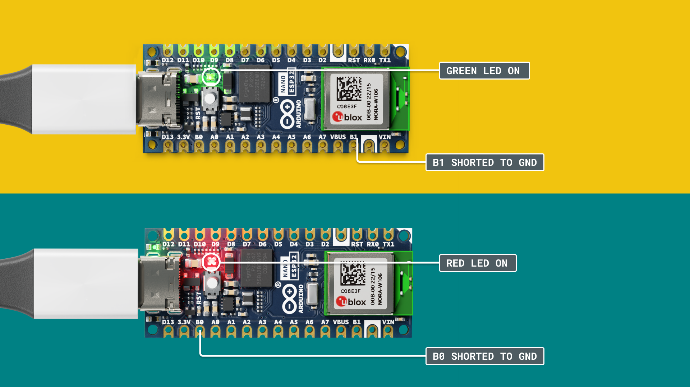
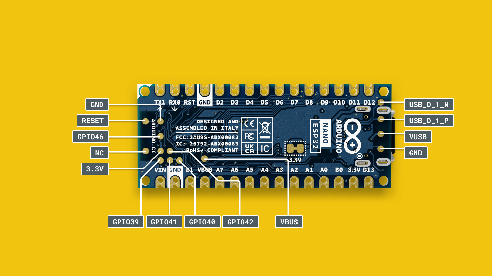

The **Arduino Nano ESP32** is the first Arduino to feature an ESP32 SoC, based on the [ESP32-S3](https://www.espressif.com/en/products/socs/esp32-s3). This SoC is found inside the **u-blox® NORA-W106** module and provides both Bluetooth® & Wi-Fi® connectivity, as well as embedding an antenna.


In this document, you will find information regarding features your board, and links to resources. 

***Note that this board is compatible with many ESP32 examples out of the box, but that the pinout may vary. You can find the complete API at [ESP32-S3 API reference](https://docs.espressif.com/projects/esp-idf/en/latest/esp32s3/api-reference/index.html).*** 

## NORA-W106 (ESP32-S3)


The Nano ESP32 features the **ESP32-S3** system on a chip (SoC) from Espressif, which is embedded in the **NORA-W106** module. The ESP32-S3 has a dual-core microprocessor Xtensa® 32-bit LX7, and has support for the 2.4 GHz Wi-Fi® band as well as Bluetooth® 5. The operating voltage of this SoC is 3.3 V.

The NORA-W106 also embeds an antenna for Bluetooth® and Wi-Fi® connectivity.

### Memory

The Nano ESP32 has
- 384 kB ROM
- 512 kB SRAM
- 16 MB of Flash (external, provided via GD25B128EWIGR)

## Datasheet

The full datasheet is available as a downloadable PDF from the link below:

- [Download the Nano ESP32 datasheet](/resources/datasheets/ABX00083-datasheet.pdf)

## Nano ESP32 Core

This board is based on the [Arduino ESP32 Core](https://github.com/arduino/arduino-esp32), that is derived from the original ESP32 core. It provides a rich set of examples to access the various features on your board, which is accessed directly through the IDE.


To install the core, go the **board manager** and search for **Nano ESP32**. For more detailed instructions to install the core, please refer to the [Getting Started with Nano ESP32](/tutorials/nano-esp32/getting-started-nano-esp32) article.

You can also program your board via the [Arduino Web Editor](arduino-cloud/getting-started/getting-started-web-editor), an online IDE.

## MicroPython

The Nano ESP32 has support for MicroPython, a micro-implementation of Python® that can easily be installed on your board.

To get started with MicroPython, please visit [MicroPython 101](/micropython-course), a course dedicated towards learning MicroPython on the Nano ESP32.

In this course, you will fundamental knowledge to get started, as well as a large selection of examples for popular third-party components.

## Arduino IoT Cloud

Nano ESP32 is supported in the [Arduino IoT Cloud](https://create.arduino.cc/iot/) platform. You can connect to the cloud either through "classic" Arduino, using the C++ library, or via MicroPython:
- [Getting Started with Arduino IoT Cloud (classic)](https://docs.arduino.cc/arduino-cloud/getting-started/iot-cloud-getting-started)
- [MicroPython with Arduino IoT Cloud](https://docs.arduino.cc/arduino-cloud/getting-started/iot-cloud-micropython)

## API

The Nano ESP32 can be programmed using the same API as for other Arduino boards (see [language reference](https://www.arduino.cc/reference/en/)).

However, the ESP32 platform provides additional libraries and built-in functionalities that may not available in the standard Arduino API.

For more information, see the [ESP32-S3 API](https://docs.espressif.com/projects/esp-idf/en/latest/esp32s3/api-reference/index.html#)

### Peripherals API

To learn more about the ESP32-S3's peripherals (e.g. ADC, I2C, SPI, I2S, RTC), refer to the [Peripherals API section](https://docs.espressif.com/projects/esp-idf/en/latest/esp32s3/api-reference/peripherals/index.html#).

### Sleep Modes

The Nano ESP32 can be programmed to draw a minimal amount of power, making it suitable for power constrained designs, such as solar/battery powered projects. 

The [Sleep Modes](https://docs.espressif.com/projects/esp-idf/en/latest/esp32s3/api-reference/system/sleep_modes.html) section in the ESP32 docs explains how to configure your board to draw minimal power, introducing the **light sleep** and **deep sleep**

## Power Considerations


To power the Nano ESP32 you may either use a USB-C® cable, or the VIN pin. When using the VIN pin, use voltages within the range of 5-18 V as the **MP2322GQH** converter on the board may otherwise be damaged. 

### Input Voltage (VIN)

- If you're using the USB-C® connector you must power it with 5 V.
- The recommended input voltage on the VIN pin is 5-18 V.

### Operating Voltage

The internal operating voltage of the ESP32-S3 SoC is 3.3 V, and you should not apply voltages higher than that to the GPIO pins.

### 5V Pin / VUSB

The Nano ESP32 is the first board to not feature a **5V** pin. It has instead been replaced with VBUS, which is a more accurate description of the pin's capabilities.

`VBUS` provides 5 V whenever powered via USB. If powered via the VIN pin, it is disabled. This means that while powering the board through the VIN pin, you can't get 5 V from the board, and you need to use a logic level shifter or an external 5 V power supply.

This measure is taken to prevent the board's microcontroller from accidentally receiving 5 V, which will damage it.

## Pins

The Nano ESP32 has two headers: the **analog** and **digital**. Listed here are the **default** pins that comply with previous Nano form factor designs.

The following pins are available on the board:

| Pin      | Type    | Function                                    |
| -------- | ------- | ------------------------------------------- |
| D13/SCK  | Digital | **SPI** Serial Clock / LED Built in         |
| D12/CIPO | Digital | **SPI** Controller In Peripheral Out        |
| D11/COPI | Digital | **SPI** Controller Out Peripheral In        |
| D10      | Digital | GPIO                                        |
| D9       | Digital | GPIO                                        |
| D8       | Digital | GPIO                                        |
| D7       | Digital | GPIO                                        |
| D6       | Digital | GPIO                                        |
| D5       | Digital | GPIO                                        |
| D4       | Digital | GPIO                                        |
| D3       | Digital | GPIO                                        |
| D2       | Digital | GPIO                                        |
| D1/RX    | Digital | GPIO 1 / **UART** Receiver (RX)             |
| D0/TX    | Digital | GPIO 0 / **UART** Transmitter (TX)          |
| A0       | Analog  | Analog input 0                              |
| A1       | Analog  | Analog input 1                              |
| A2       | Analog  | Analog input 2                              |
| A3       | Analog  | Analog input 3                              |
| A4       | Analog  | Analog input 4 / **I2C** Serial Datal (SDA) |
| A5       | Analog  | Analog input 5 / **I2C** Serial Clock (SCL) |
| A6       | Analog  | Analog input 6                              |
| A7       | Analog  | Analog input 7                              |

Note that all pins can be used as GPIO, due to the ESP32's flexibility.

### Digital

The Nano ESP32 has 14 digital pins (D0-D13), that can be read by using `digitalRead()` or written to using `digitalWrite()`.

| Pin      | Type    | Function                             |
| -------- | ------- | ------------------------------------ |
| D13/SCK  | Digital | **SPI** Serial Clock / LED Built in  |
| D12/CIPO | Digital | **SPI** Controller In Peripheral Out |
| D11/COPI | Digital | **SPI** Controller Out Peripheral In |
| D10      | Digital | GPIO                                 |
| D9       | Digital | GPIO                                 |
| D8       | Digital | GPIO                                 |
| D7       | Digital | GPIO                                 |
| D6       | Digital | GPIO                                 |
| D5       | Digital | GPIO                                 |
| D4       | Digital | GPIO                                 |
| D3       | Digital | GPIO                                 |
| D2       | Digital | GPIO                                 |
| D0/RX    | Digital | GPIO 0 / **UART** Receiver (RX)      |
| D1/TX    | Digital | GPIO 1 / **UART** Transmitter (TX)   |

Note that all analog pins can be used as digital pins as well, but not vice versa.

### Analog

There are 8 analog input pins on the Nano ESP32, with 2 reserved for I2C communication (A4/A5). The ESP32-S3 embeds two SAR ADCs, `ADC1` and `ADC2`, where each ADC uses 4 channels each. 

| Pin | Type   | Function                                    | ADC channel |
| --- | ------ | ------------------------------------------- | ----------- |
| A0  | Analog | Analog input 0                              | `ADC1_CH0`  |
| A1  | Analog | Analog input 1                              | `ADC1_CH1`  |
| A2  | Analog | Analog input 2                              | `ADC1_CH2`  |
| A3  | Analog | Analog input 3                              | `ADC1_CH3`  |
| A4  | Analog | Analog input 4 / **I2C** Serial Datal (SDA) | `ADC2_CH1`  |
| A5  | Analog | Analog input 5 / **I2C** Serial Clock (SCL) | `ADC2_CH2`  |
| A6  | Analog | Analog input 6                              | `ADC2_CH3`  |
| A7  | Analog | Analog input 7                              | `ADC2_CH4`  |

***Please note that `ADC2` is also used for Wi-Fi® communication and can fail if used simultaneously.***

For more details, see [Analog to Digital Converter (link to Espressif docs)](https://docs.espressif.com/projects/esp-idf/en/v4.4/esp32s3/api-reference/peripherals/adc.html).

### PWM

Pulse width modulation (PWM) is supported on **all digital pins (D0-D13)** as well **as all analog pins (A0-A7)**, where the output is controlled via the `analogWrite()` method. 

```arduino
analogWrite(pin,value);
```

***Due to timer restrictions, only 4 PWM signals can be generated simultaneously.***

### Boot Pins

To enter bootloader mode (chip boot mode), you can use either the BOOT0 (B0) or BOOT1 (B1) pins, which are connected to the ESP32-S3's `GPIO0` and `GPIO46`. 



Shorting these to GND + pressing the reset button will enter a bootloader mode. Note that while shorting these pins, a corresponding LED will light up (blue for )

You can read more about different this in the [Strapping Pins section](https://www.espressif.com/sites/default/files/documentation/esp32-s3_datasheet_en.pdf#page=23) in the ESP32-S3's datasheet.

## I2C


The default pins used for I2C on the Nano ESP32 are the following:

| Pin | Function | Description          |
| --- | -------- | -------------------- |
| A4  | SDA      | **I2C** Serial Data  |
| A5  | SCL      | **I2C** Serial Clock |

To connect I2C devices you will need to include the [Wire](https://www.arduino.cc/reference/en/language/functions/communication/wire/) library at the top of your sketch.

```arduino
#include <Wire.h>
```

Inside `void setup()` you need to initialize the library, and initialize the I2C port you want to use.

```arduino
Wire.begin() //SDA & SDL
```

And to write something to a device connected via I2C, we can use the following commands:

```arduino
Wire.beginTransmission(1); //begin transmit to device 1
Wire.write(byte(0x00)); //send instruction byte 
Wire.write(val); //send a value
Wire.endTransmission(); //stop transmit
```

## SPI


The Nano ESP32's SPI pins are listed below:

| Pin   | Function | Description                   |
| ----- | -------- | ----------------------------- |
| D10\* | CS       | Chip Select                   |
| D11   | COPI     | Controller In, Peripheral Out |
| D12   | CIPO     | Controller Out, Peripheral In |
| D13   | SCK      | Serial Clock                  |

\*Any GPIO can be used for chip select.

The following example shows how to use SPI:

```arduino
#include <SPI.h>

const int CS = 10;


void setup() {
  pinMode(CS, OUTPUT);

  SPI.begin();

  digitalWrite(CS, LOW);

  SPI.transfer(0x00);
  
  digitalWrite(CS, HIGH);
}

void loop() {
}
```

## UART

The pins used for UART on the Nano ESP32 are the following:

| Pin | Function | Description          |
| --- | -------- | -------------------- |
| D0  | RX       | Receive Serial Data  |
| D1  | TX       | Transmit Serial Data |


To send and receive data through UART, we will first need to set the baud rate inside `void setup()`. Note that when using the UART (RX/TX pins), we use the `Serial1` object.

```arduino
Serial1.begin(9600);
```

To read incoming data, we can use a while loop() to read each individual character and add it to a string.

```arduino
  while(Serial1.available()){
    delay(2);
    char c = Serial1.read();
    incoming += c;
  }
```

And to write something, we can use the following command:

```arduino
Serial1.write("Hello world!");
```

## IO Mux & GPIO Matrix

The ESP32-S3 SoC features an IO mux (input/output multiplexer) and a GPIO matrix. The IO mux acts as a data selector and allows for different peripherals to be connected to a physical pin. 

The ESP32-S3 chip has 45 physical GPIOs, but many more digital peripherals. The IO mux provides the flexibility of routing the signals to different GPIOs, thus changing the function of a specific pin.


This technique is well known and applied within ESP32 boards, but on the Nano ESP32 we use a set of default pins for the I2C, SPI & UART peripherals to remain consistent with previous designs.

As an example, the Nano ESP32's SDA/SCL pins are attached to A4/A5 by default. These pins can be changed to e.g. D8,D9 if you need to use another set of pins. This is done through the mux / GPIO matrix.

### Re-Assigning Pins

You can read more about re-assigning the peripherals through the links below:
- [I2C configuration (link to Espressif docs)](https://docs.espressif.com/projects/esp-idf/en/latest/esp32s3/api-reference/peripherals/i2c.html#i2c-api-configure-driver)
- [UART configuration (link to Espressif docs)](https://docs.espressif.com/projects/esp-idf/en/latest/esp32s3/api-reference/peripherals/uart.html#uart-api-setting-communication-pins)

You can also read Espressifs technical reference manual here:

- [IO MUX and GPIO Matrix (ESP32-S3 technical reference manual)](https://www.espressif.com/sites/default/files/documentation/esp32-s3_technical_reference_manual_en.pdf#iomuxgpio)

## Wi-Fi®

The Nano ESP32 has a NORA-W106 module which has the ESP32-S3 SoC embedded. This module supports Wi-Fi® communication over the 2.4 GHz band.

There are several examples provided bundled with the core that showcase how to make HTTP requests, host web servers, send data over MQTT etc.

## RGB

The ESP32 features an RGB that can be controlled with the `0`, `45` and `46` GPIO. These are not connected to any physical pins. 

To control them, use:

```arduino
digitalWrite(46, STATE); //red
digitalWrite(45, STATE); //green
digitalWrite(0, STATE); //blue
```


## USB HID

Nano ESP32 can be used to emulate an HID device by using e.g. `Mouse.move(x,y)` or `Keyboard.press('w')`. The API documentation can be found in Arduino's language reference:

- [Keyboard API](https://www.arduino.cc/reference/en/language/functions/usb/keyboard/)
- [Mouse API](https://www.arduino.cc/reference/en/language/functions/usb/mouse/)

Several ready to use examples are also available in the core at **Examples > USB**.

## Test Pads

There are several test pads on the bottom side of the Nano ESP32. See the image below:

