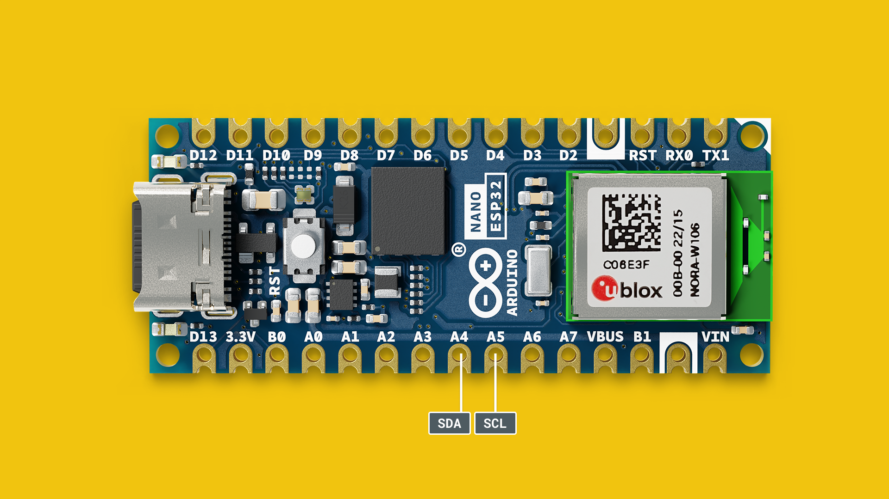
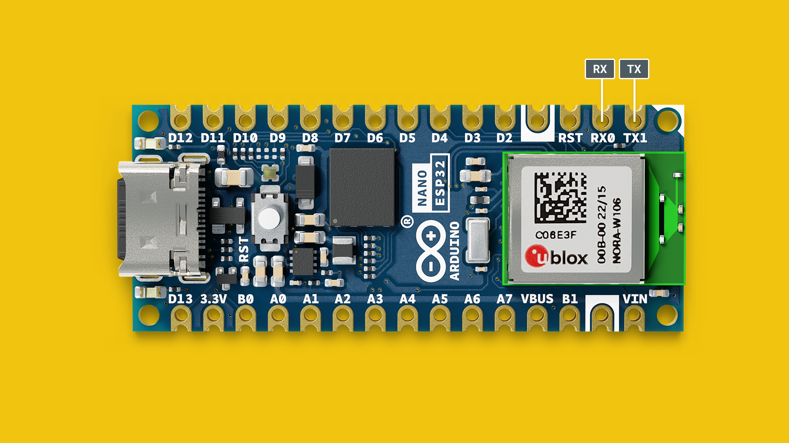

The **Arduino Nano ESP32** is the first Arduino to feature an ESP32 SoC as its main microcontroller, based on the [ESP32-S3](https://www.espressif.com/en/products/socs/esp32-s3). This SoC is found inside the **u-blox® NORA-W106** module and provides both Bluetooth® & Wi-Fi® connectivity, as well as embedding an antenna.


In this document, you will find information regarding features of the board, and links to resources. 

***Note that this board is compatible with many ESP32 examples out of the box, but that the pinout may vary. You can find the complete API at [ESP32-S3 API reference](https://docs.espressif.com/projects/esp-idf/en/latest/esp32s3/api-reference/index.html).*** 

## NORA-W106 (ESP32-S3)


The Nano ESP32 features the **ESP32-S3** system on a chip (SoC) from Espressif, which is embedded in the **NORA-W106** module. The ESP32-S3 has a dual-core microprocessor Xtensa® 32-bit LX7, and has support for the 2.4 GHz Wi-Fi® band as well as Bluetooth® 5. The operating voltage of this SoC is 3.3 V.

The NORA-W106 also embeds an antenna for Bluetooth® and Wi-Fi® connectivity.

### Memory

The Nano ESP32 has
- 384 kB ROM
- 512 kB SRAM
- 16 MB of Flash (external, provided via GD25B128EWIGR)
- 8 MB of PSRAM 


## Datasheet

The full datasheet is available as a downloadable PDF from the link below:

- [Download the Nano ESP32 datasheet](/resources/datasheets/ABX00083-datasheet.pdf)

## Arduino ESP32 Core

This board is based on the [Arduino ESP32 Core](https://github.com/arduino/arduino-esp32), that is derived from the original ESP32 core. It provides a rich set of examples to access the various features on your board, which is accessed directly through the IDE.


To install the core, go the **board manager** and search for **Nano ESP32**. For more detailed instructions to install the core, please refer to the [Getting Started with Nano ESP32](/tutorials/nano-esp32/getting-started-nano-esp32) article.

## ESP32 Pin Map

The Nano ESP32's default pins are designed to match the **Nano form factor**. This pin mapping is done in the official Arduino ESP32 core (see just above). See below the pin map to understand how the physical pins correlate to the ESP32: 

| Nano  | ESP32  |
| ----- | ------ |
| D0    | GPIO44 |
| D1    | GPIO43 |
| D2    | GPIO5  |
| D3    | GPIO6  |
| D4    | GPIO7  |
| D5    | GPIO8  |
| D6    | GPIO9  |
| D7    | GPIO10 |
| D8    | GPIO17 |
| D9    | GPIO18 |
| D10   | GPIO21 |
| D11   | GPIO38 |
| D12   | GPIO47 |
| D13   | GPIO48 |
| A0    | GPIO1  |
| A1    | GPIO2  |
| A2    | GPIO3  |
| A3    | GPIO4  |
| A4    | GPIO11 |
| A5    | GPIO12 |
| A6    | GPIO13 |
| A7    | GPIO14 |
| BOOT0 | GPIO46 |
| BOOT1 | GPIO0  |

See the pinout below for a better visual translation:


## Arduino Bootloader Mode
The Nano ESP32 has a feature that we call Arduino Bootloader-mode, what this means is that you are able to put the board in a sort of recovery mode by double pressing the reset button while the board is powered on.

This mode is useful if you've uploaded a sketch that produces some unwanted behaviour. Maybe the sketch causes it to become undetectable by your computer, or maybe its an HID sketch that took over your keyboard and mouse and you need to regain control of your computer. It lets you turn the board on without actually running any sketch.

To enter bootloader-mode, press the reset button, and then press it again once you see the RGB LED flashing. You'll know that you've successfully entered bootloader-mode if you see the green LED pulsing slowly. 

***Some boards from the first limited production batch were assembled with a different RGB LED which has the green and blue pins inverted. Read our full Help Center article [here](https://support.arduino.cc/hc/en-us/articles/9589073738012)***

### ROM Boot Mode

In addition to the normal bootloader-mode, the Arduino Nano ESP32 lets you enter ROM boot mode. This is rarely needed, but there are some cases where it might be useful, for example you may want to follow this process to:

- Update the Arduino bootloader already on the board. This can resolve issues with Nano ESP32 being misidentified as other ESP32 boards.
- Restore the ability to upload regular Arduino sketches to a Nano ESP32 that has been flashed with a third party firmware.

If you need to reflash the bootloader, you can follow the steps of this [Help Center article](https://support.arduino.cc/hc/en-us/articles/9810414060188-Reset-the-Arduino-bootloader-on-the-Nano-ESP32)

## MicroPython

The Nano ESP32 has support for MicroPython, a micro-implementation of Python® that can easily be installed on your board.

To get started with MicroPython, please visit [MicroPython 101](/micropython-course), a course dedicated towards learning MicroPython on the Nano ESP32.

In this course, you will fundamental knowledge to get started, as well as a large selection of examples for popular third-party components.

### Reset Your Board

If you have installed MicroPython but wish to go back to classic Arduino / C++ programming, it is easy to do so. Simply **double tap** the **RESET** button on the board (there's only one button). The board will enter boot mode (you should see a pulsing green light), and will be visible in the Arduino IDE. 

## Arduino IoT Cloud

Nano ESP32 is supported in the [Arduino IoT Cloud](https://create.arduino.cc/iot/) platform. You can connect to the cloud either through "classic" Arduino, using the C++ library, or via MicroPython:

- [Getting Started with Arduino IoT Cloud (classic)](https://docs.arduino.cc/arduino-cloud/getting-started/iot-cloud-getting-started)
- [MicroPython with Arduino IoT Cloud](https://docs.arduino.cc/arduino-cloud/getting-started/iot-cloud-micropython)


## API

The Nano ESP32 can be programmed using the same API as for other Arduino boards (see [language reference](https://www.arduino.cc/reference/en/)).

However, the ESP32 platform provides additional libraries and built-in functionalities that may not available in the standard Arduino API.

For more information, see the [ESP32-S3 API](https://docs.espressif.com/projects/esp-idf/en/latest/esp32s3/api-reference/index.html#)

### Peripherals API

To learn more about the ESP32-S3's peripherals (e.g. ADC, I2C, SPI, I2S, RTC), refer to the [Peripherals API section](https://docs.espressif.com/projects/esp-idf/en/latest/esp32s3/api-reference/peripherals/index.html#).

### Sleep Modes

The Nano ESP32 can be programmed to draw a minimal amount of power, making it suitable for power constrained designs, such as solar/battery powered projects. 

The [Sleep Modes](https://docs.espressif.com/projects/esp-idf/en/latest/esp32s3/api-reference/system/sleep_modes.html) section in the ESP32 docs explains how to configure your board to draw minimal power, introducing the **light sleep** and **deep sleep**

## Power Considerations


To power the Nano ESP32 you may either use a USB-C® cable, or the VIN pin. When using the VIN pin, use voltages within the range of 5-18 V as the **MP2322GQH** converter on the board may otherwise be damaged. 

### Input Voltage (VIN)

- If you're using the USB-C® connector you must power it with 5 V.
- The recommended input voltage on the VIN pin is 6-21 V.

If you flip the board to view its underside, you'll find a solder jumper labelled "**3.3V**". If you cut the small trace between the two pads, you disconnect the step-down converter from the board, and your board will no longer turn on when plugged in to the USB port, or when its powered through the VIN pin. Instead you must provide **exactly** 3.3 V directly to the 3.3 V pin of your board. This can, depending on your power source, be a more energy efficient method of powering your board than powering through the VIN pin or the USB port.


### Operating Voltage

The internal operating voltage of the ESP32-S3 SoC is 3.3 V, and you should not apply voltages higher than that to the GPIO pins.

### 5V Pin / VBUS

The Nano ESP32 is the first board to not feature a **5V** pin. It has instead been replaced with VBUS, which is a more accurate description of the pin's capabilities.

`VBUS` provides 5 V whenever powered via USB. If powered via the VIN pin, it is disabled. This means that while powering the board through the VIN pin, you can't get 5 V from the board, and you need to use a logic level shifter or an external 5 V power supply.

This measure is taken to prevent the board's microcontroller from accidentally receiving 5 V, which will damage it.

## Pins

The Nano ESP32 has two headers: the **analog** and **digital**. Listed here are the **default** pins that comply with previous Nano form factor designs.

The following pins are available on the board:

| Pin      | Type    | Function                                    |
| -------- | ------- | ------------------------------------------- |
| D13/SCK  | Digital | **SPI** Serial Clock / LED Built in         |
| D12/CIPO | Digital | **SPI** Controller In Peripheral Out        |
| D11/COPI | Digital | **SPI** Controller Out Peripheral In        |
| D10      | Digital | GPIO                                        |
| D9       | Digital | GPIO                                        |
| D8       | Digital | GPIO                                        |
| D7       | Digital | GPIO                                        |
| D6       | Digital | GPIO                                        |
| D5       | Digital | GPIO                                        |
| D4       | Digital | GPIO                                        |
| D3       | Digital | GPIO                                        |
| D2       | Digital | GPIO                                        |
| D1/RX    | Digital | GPIO 1 / **UART** Receiver (RX)             |
| D0/TX    | Digital | GPIO 0 / **UART** Transmitter (TX)          |
| A0       | Analog  | Analog input 0                              |
| A1       | Analog  | Analog input 1                              |
| A2       | Analog  | Analog input 2                              |
| A3       | Analog  | Analog input 3                              |
| A4       | Analog  | Analog input 4 / **I2C** Serial Datal (SDA) |
| A5       | Analog  | Analog input 5 / **I2C** Serial Clock (SCL) |
| A6       | Analog  | Analog input 6                              |
| A7       | Analog  | Analog input 7                              |

Note that all pins can be used as GPIO, due to the ESP32's flexibility.

### Digital

The Nano ESP32 has 14 digital pins (D0-D13), that can be read by using `digitalRead()` or written to using `digitalWrite()`.

| Pin      | Type    | Function                             |
| -------- | ------- | ------------------------------------ |
| D13/SCK  | Digital | **SPI** Serial Clock / LED Built in  |
| D12/CIPO | Digital | **SPI** Controller In Peripheral Out |
| D11/COPI | Digital | **SPI** Controller Out Peripheral In |
| D10      | Digital | GPIO                                 |
| D9       | Digital | GPIO & RX1                           |
| D8       | Digital | GPIO & TX1                           |
| D7       | Digital | GPIO                                 |
| D6       | Digital | GPIO                                 |
| D5       | Digital | GPIO                                 |
| D4       | Digital | GPIO                                 |
| D3       | Digital | GPIO                                 |
| D2       | Digital | GPIO                                 |
| D0/RX    | Digital | GPIO 0 / **UART** Receiver (RX0)     |
| D1/TX    | Digital | GPIO 1 / **UART** Transmitter (TX0)  |

Note that all analog pins can be used as digital pins as well, but not vice versa.

### Analog

There are 8 analog input pins on the Nano ESP32, with 2 reserved for I2C communication (A4/A5). The ESP32-S3 embeds two SAR ADCs, `ADC1` and `ADC2`, where each ADC uses 4 channels each. 

| Pin | Type   | Function                                    | ADC channel |
| --- | ------ | ------------------------------------------- | ----------- |
| A0  | Analog | Analog input 0                              | `ADC1_CH0`  |
| A1  | Analog | Analog input 1                              | `ADC1_CH1`  |
| A2  | Analog | Analog input 2                              | `ADC1_CH2`  |
| A3  | Analog | Analog input 3                              | `ADC1_CH3`  |
| A4  | Analog | Analog input 4 / **I2C** Serial Datal (SDA) | `ADC2_CH1`  |
| A5  | Analog | Analog input 5 / **I2C** Serial Clock (SCL) | `ADC2_CH2`  |
| A6  | Analog | Analog input 6                              | `ADC2_CH3`  |
| A7  | Analog | Analog input 7                              | `ADC2_CH4`  |

***Please note that `ADC2` is also used for Wi-Fi® communication and can fail if used simultaneously.***

For more details, see [Analog to Digital Converter (link to Espressif docs)](https://docs.espressif.com/projects/esp-idf/en/v4.4/esp32s3/api-reference/peripherals/adc.html).

### PWM

Pulse width modulation (PWM) is supported on **all digital pins (D0-D13)** as well **as all analog pins (A0-A7)**, where the output is controlled via the `analogWrite()` method. 

```arduino
analogWrite(pin,value);
```

***Due to timer restrictions, only 5 PWM signals can be generated simultaneously.***

## I2C



The default pins used for the **main I2C bus** on the Nano ESP32 are the following:

| Pin | Function | Description          |
| --- | -------- | -------------------- |
| A4  | SDA      | **I2C** Serial Data  |
| A5  | SCL      | **I2C** Serial Clock |

To connect I2C devices you will need to include the [Wire](https://www.arduino.cc/reference/en/language/functions/communication/wire/) library at the top of your sketch.

```arduino
#include <Wire.h>
```

Inside `void setup()` you need to initialize the library, and initialize the I2C port you want to use.

```arduino
Wire.begin() //SDA & SDL
```

And to write something to a device connected via I2C, we can use the following commands:

```arduino
Wire.beginTransmission(1); //begin transmit to device 1
Wire.write(byte(0x00)); //send instruction byte 
Wire.write(val); //send a value
Wire.endTransmission(); //stop transmit
```

### Second I2C Bus

The Nano ESP32 has a second I2C bus, accessed via `Wire1`. To use it, you will need to set two free pins for SDA & SCL.

For example:

```arduino
//initializes second I2C bus on pins D4,D5
Wire1.begin(D4, D5); //sda, scl
```

***`Wire` and `Wire1` can be used simultaneously, a great feature when working with devices that may share the same addresses.***

## SPI


The Nano ESP32's SPI pins are listed below:

| Pin   | Function | Description                   |
| ----- | -------- | ----------------------------- |
| D10\* | CS       | Chip Select                   |
| D11   | COPI     | Controller In, Peripheral Out |
| D12   | CIPO     | Controller Out, Peripheral In |
| D13   | SCK      | Serial Clock                  |

\*Any GPIO can be used for chip select.

The following example shows how to use SPI:

```arduino
#include <SPI.h>

const int CS = 10;


void setup() {
  pinMode(CS, OUTPUT);

  SPI.begin();

  digitalWrite(CS, LOW);

  SPI.transfer(0x00);
  
  digitalWrite(CS, HIGH);
}

void loop() {
}
```

### Second SPI Port (HSPI)

The Nano ESP32 has a second SPI port (HSPI). To use it, we need to create an object using `SPIClass`, and initialize communication on a specific set of pins.

***The HSPI port's default pins are: `GPIO14` (SCK), `GPIO12` (CIPO), `GPIO13` (COPI), `GPIO15` (CS). As some of these pins are not accessible on the Nano ESP32, you will need to configure them manually. See the definitions at the top of the code example below.***

```arduino
//define SPI2 pins manually
//you can also choose any other free pins
#define SPI2_SCK D2
#define SPI2_CIPO D3
#define SPI2_COPI D4
#define SPI2_CS D5

//create SPI2 object
SPIClass SPI2(HSPI);

void setup() {
//initialize SPI communication
  SPI2.begin(SPI2_SCK, SPI2_CIPO, SPI2_COPI, SPI2_CS);
}
```

## USB Serial & UART

The Nano ESP32 board features 2 separate hardware serial ports.

One port is exposed via USB-C®, and
One is exposed via RX/TX pins.

### Native USB

Sending serial data to your computer is done using the standard `Serial` object.

```arduino
Serial.begin(9600);
Serial.print("hello world");
```

To send and receive data through UART, we will first need to set the baud rate inside `void setup()`.

### UART

The pins used for UART on the Nano ESP32 are the following:

| Pin | Function | Description          |
| --- | -------- | -------------------- |
| D0  | RX       | Receive Serial Data  |
| D1  | TX       | Transmit Serial Data |



To send and receive data through UART, we will first need to set the baud rate inside `void setup()`. Note that when using the UART (RX/TX pins), we use the `Serial0` object.

```arduino
Serial0.begin(9600);
```

To read incoming data, we can use a while loop() to read each individual character and add it to a string.

```arduino
  while(Serial0.available()){
    delay(2);
    char c = Serial0.read();
    incoming += c;
  }
```

And to write something, we can use the following command:

```arduino
Serial0.write("Hello world!");
```

## I2S

The Inter-IC Sound (I2S or IIS) protocol is used for connecting digital audio devices with a variety of configurations (Philips mode, PDM, ADC/DAC). 

The default pin configuration for I2S is:

| Pin | Definition       |
| --- | ---------------- |
| D7  | `PIN_I2S_SCK`    |
| D8  | `PIN_I2S_FS`     |
| D9  | `PIN_I2S_SD`     |
| D9  | `PIN_I2S_SD_OUT` |
| D10 | `PIN_I2S_SD_IN`  |

The default pins can be changed by using the `setAllPins()` method:

```arduino
I2S.setAllPins(sck, fs, sd, sd_out, sd_in)
```

To inialitize the library, use the `begin()` method: 

```arduino
I2S.begin(mode, sampleRate, bitPerSample)
``` 

To read data, use the `read()` method, which will return the last sample.

```arduino
I2S.read()
```

Examples for different modes & different audio devices are available in the core under **Examples > I2S**.


Further reading:
- [I2S API docs (Espressif)](https://espressif-docs.readthedocs-hosted.com/projects/arduino-esp32/en/latest/api/i2s.html)
- [I2S Reference (Espressif)](https://docs.espressif.com/projects/esp-idf/en/latest/esp32/api-reference/peripherals/i2s.html)

## Dual Core

The ESP32-S3 is based on the dual-core XTensa LX7, which can run code separately on two cores. This is enabled through FreeRTOS, by setting up tasks that run on each core (similarly to how `void loop()` is implemented). The cores available are `0` and `1`.

The example below is a modified version of the [BasicMultiThreading](https://github.com/espressif/arduino-esp32/tree/master/libraries/ESP32/examples/FreeRTOS/BasicMultiThreading) example found in the Arduino ESP32 core, and demonstrates how to use two common operations simultaneously:
- Blink an LED using one task on a specific core (0),
- Read an analog pin using a second task on a specific core (1).

```arduino
/* Basic Multi Threading Arduino Example
   
   Modified 16th October 2023 by Karl Söderby

   Set up two tasks that run on each core of a Nano ESP32 (ESP32-S3 XTensa LX7 MCU),
   one that blinks an LED, one that reads an analog signal.

   These tasks will execute infinitely.

   This example code is in the Public Domain (or CC0 licensed, at your option.)
   Unless required by applicable law or agreed to in writing, this
   software is distributed on an "AS IS" BASIS, WITHOUT WARRANTIES OR
   CONDITIONS OF ANY KIND, either express or implied.
*/

// Define the cores
#define CORE_0 0
#define CORE_1 1

#define ANALOG_INPUT_PIN A0 //Specify analog pin
#define LED_BUILTIN 13  // Specify the on which is your LED


int counter = 0;
// Define two tasks for Blink & AnalogRead.
void TaskBlink(void *pvParameters);
void TaskAnalogRead(void *pvParameters);
TaskHandle_t analog_read_task_handle;  // You can (don't have to) use this to be able to manipulate a task from somewhere else.

void setup() {
  Serial.begin(115200);
  uint32_t blink_delay = 1000;  // Delay between changing state on LED pin

  //create task for blinking an LED
  xTaskCreatePinnedToCore(
    TaskBlink, "Task Blink"  // A name just for humans
    ,
    2048  // The stack size can be checked by calling `uxHighWaterMark = uxTaskGetStackHighWaterMark(NULL);`
    ,
    (void *)&blink_delay  // Task parameter which can modify the task behavior. This must be passed as pointer to void.
    ,
    2  // Priority
    ,
    NULL  // Task handle is not used here - simply pass NULL
    ,
    CORE_0  // Core on which the task will run
  );

  //create a task for reading analog signals
  xTaskCreatePinnedToCore(
    TaskAnalogRead, "Analog Read", 2048  // Stack size
    ,
    NULL  // When no parameter is used, simply pass NULL
    ,
    1  // Priority
    ,
    &analog_read_task_handle  // With task handle we will be able to manipulate with this task.
    ,
    CORE_1  // Core on which the task will run
  );
}

void loop() {
  //loop is empty, the tasks are instead looped infinitely
}

void TaskBlink(void *pvParameters) {  // This is a task.
  uint32_t blink_delay = *((uint32_t *)pvParameters);

  pinMode(LED_BUILTIN, OUTPUT);

  for (;;) {  // A Task shall never return or exit.
    counter++;
    digitalWrite(LED_BUILTIN, HIGH);  // turn the LED on (HIGH is the voltage level)

    delay(1000);
    digitalWrite(LED_BUILTIN, LOW);  // turn the LED off by making the voltage LOW

    delay(1000);
    Serial.print("Core ");
    Serial.print(CORE_0);
    Serial.print(": Blink task complete. Times run: ");
    Serial.println(counter);
  }
}

void TaskAnalogRead(void *pvParameters) {  // This is a task.
  (void)pvParameters;

  for (;;) {
    // read the input on analog pin:
    int sensorValue = analogRead(ANALOG_INPUT_PIN);
    // print out the value you read:
    Serial.print("Core ");
    Serial.print(CORE_1);
    Serial.print(": Analog reading task, value is: ");
    Serial.println(sensorValue);
    delay(500);  // 100ms delay
  }
}
```

When running this example, open the Serial Monitor tool and you will see what happens on each core. 


- The task is created in the `xTaskCreatePinnedToCore()`,
- inside `xTaskCreatePinnedToCore()` we specify a number of parameters, most importantly what **core** and what **function** to run,
- code inside task functions are placed inside the `for (;;){}` statement, that will loop infinitely.

***More information about dual-core on the ESP32 along with a detailed explanation of the example is available at [Basic Multi Threading Example](https://github.com/espressif/arduino-esp32/tree/master/libraries/ESP32/examples/FreeRTOS/BasicMultiThreading).***

## IO Mux & GPIO Matrix

The ESP32-S3 SoC features an IO mux (input/output multiplexer) and a GPIO matrix. The IO mux acts as a data selector and allows for different peripherals to be connected to a physical pin. 

The ESP32-S3 chip has 45 physical GPIOs, but many more digital peripherals. The IO mux provides the flexibility of routing the signals to different GPIOs, thus changing the function of a specific pin.


This technique is well known and applied within ESP32 boards, but on the Nano ESP32 we use a set of default pins for the I2C, SPI & UART peripherals to remain consistent with previous designs.

As an example, the Nano ESP32's SDA/SCL pins are attached to A4/A5 by default. These pins can be changed to e.g. D8,D9 if you need to use another set of pins. This is done through the mux / GPIO matrix.

### Re-Assigning Pins

You can read more about re-assigning the peripherals through the links below:
- [I2C configuration (link to Espressif docs)](https://docs.espressif.com/projects/esp-idf/en/latest/esp32s3/api-reference/peripherals/i2c.html#i2c-api-configure-driver)
- [UART configuration (link to Espressif docs)](https://docs.espressif.com/projects/esp-idf/en/latest/esp32s3/api-reference/peripherals/uart.html#uart-api-setting-communication-pins)

You can also read Espressifs technical reference manual here:

- [IO MUX and GPIO Matrix (ESP32-S3 technical reference manual)](https://www.espressif.com/sites/default/files/documentation/esp32-s3_technical_reference_manual_en.pdf#iomuxgpio)

## Wi-Fi®

The Nano ESP32 has a NORA-W106 module which has the ESP32-S3 SoC embedded. This module supports Wi-Fi® communication over the 2.4 GHz band.

There are several examples provided bundled with the core that showcase how to make HTTP requests, host web servers, send data over MQTT etc.

## RGB

The ESP32 features an RGB LED that can be controlled with the `LED_RED`, `LED_GREEN` and `LED_BLUE` pin names. These pins are not accessible on the headers of the board, and can only be used for the RGB LED. 

***Some boards from the first limited production batch were assembled with a different RGB LED which has the green and blue pins inverted. Read our full Help Center article [here](https://support.arduino.cc/hc/en-us/articles/9589073738012)***

To control them, use:

```arduino
digitalWrite(LED_RED, STATE); //red
digitalWrite(LED_GREEN, STATE); //green
digitalWrite(LED_BLUE, STATE); //blue
```
These pins are so called active-low, what this means in practice is that to turn on one of the LEDs, you need to write it to `LOW`, like this:

```arduino
digitalWrite(LED_RED, LOW);
```

## USB HID

Nano ESP32 can be used to emulate an HID device by using e.g. `Mouse.move(x,y)` or `Keyboard.press('w')`.

These are minimal examples for keyboard and mouse use:

### Keyboard Example 
```arduino
#include "USB.h"
#include "USBHIDKeyboard.h"
USBHIDKeyboard Keyboard;

void setup() {
  // put your setup code here, to run once:
  Keyboard.begin();
  USB.begin();
}

void loop() {
  // put your main code here, to run repeatedly:
  Keyboard.print("Hello World");
  delay(500);
}
```

### Mouse Example 

```arduino
#include "USB.h"
#include "USBHIDMouse.h"
USBHIDMouse Mouse;

void setup() {
  // put your setup code here, to run once:
  Mouse.begin();
  USB.begin();
}

void loop() {
  // put your main code here, to run repeatedly:
  Mouse.move(5, 0, 0); 
  delay(50);
}
```

Several ready to use examples are also available in the core at **Examples > USB**.

Remember that if the board stops being recognised in the IDE, you can put it in [Arduino Bootloader Mode](#arduino-bootloader-mode) to recover it.