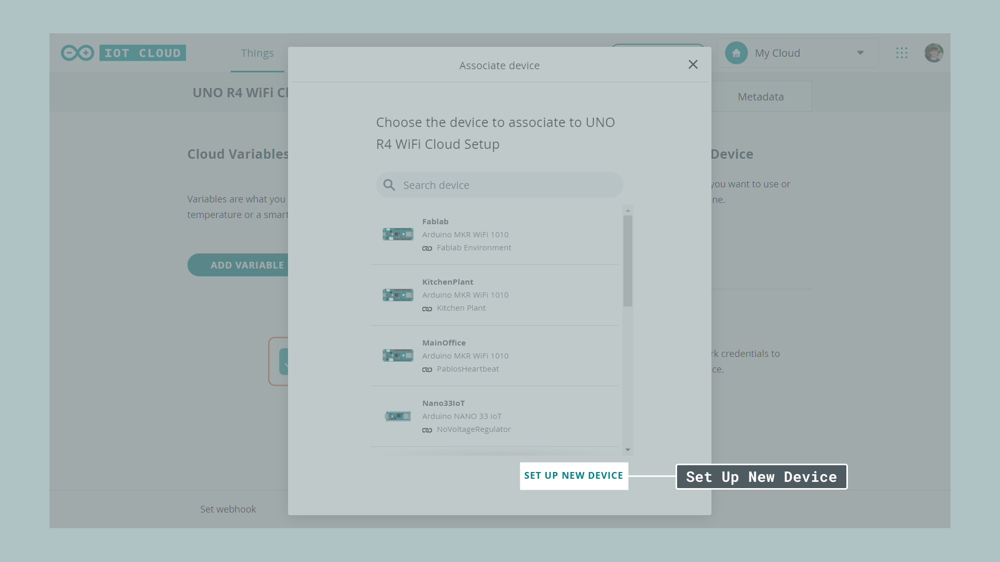
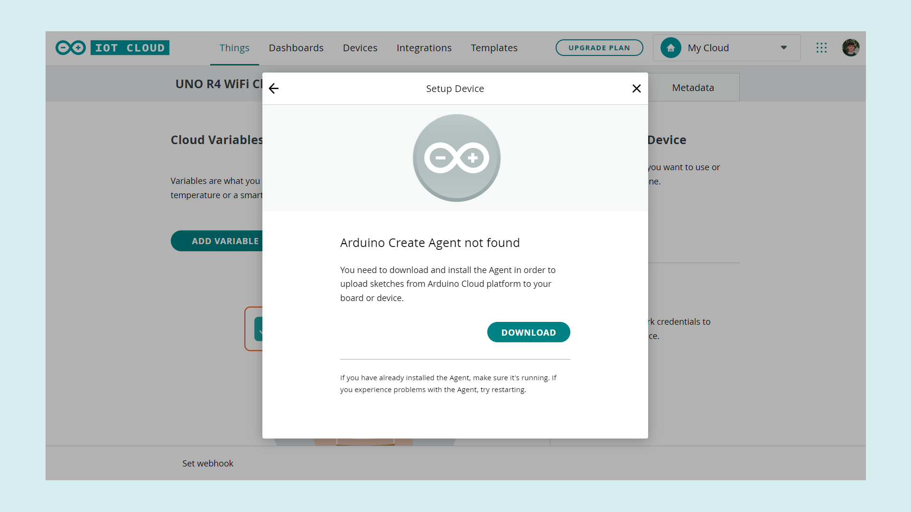
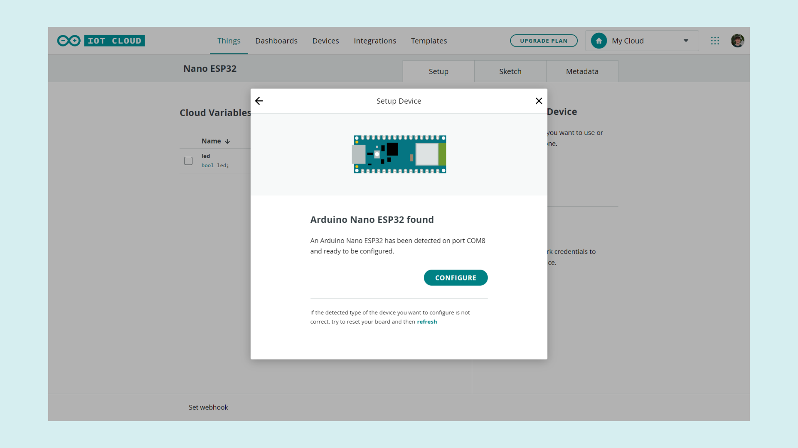
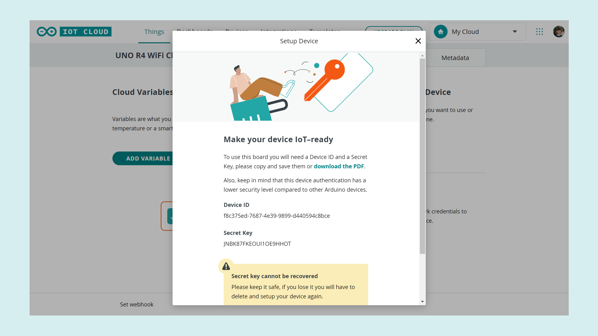
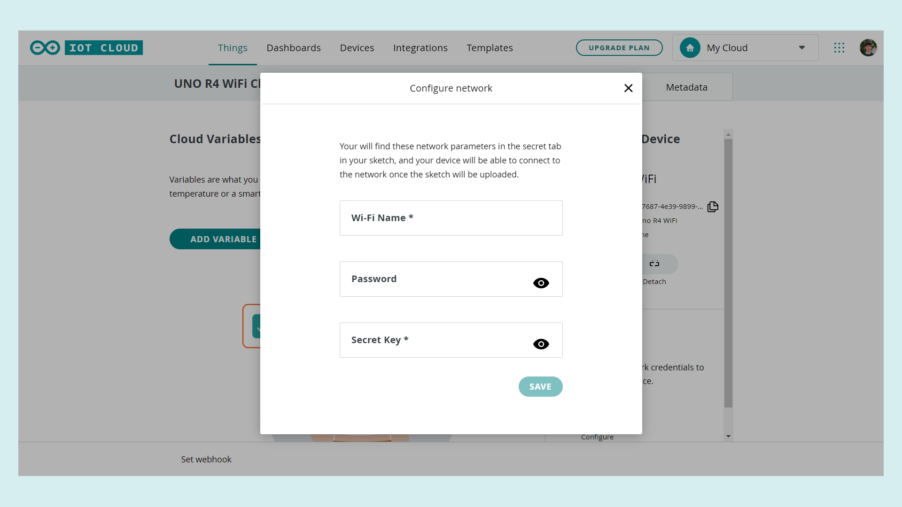

The ESP32 microcontroller on the Nano ESP32 allows for Wi-Fi® functionality. This also means you can use it with Arduino's IoT Cloud!

This article shows you how to set up your board and connect it to the cloud allowing you to upload code over the air, create dashboards to monitor your data and control your Arduino remotely.

## Software & Hardware Needed

- [Arduino Nano ESP32](https://store.arduino.cc/products/nano-esp32)
- [Arduino IoT Cloud](https://cloud.arduino.cc/home/)

## Setup and Process

***If you are new to the Arduino IoT Cloud before check out [Getting Started With the Arduino IoT Cloud](/arduino-cloud/getting-started/iot-cloud-getting-started).***

To use the Arduino IoT Cloud you will need to register and set up a **free** account. 

### Configure Your Board

After you have set up your account you can connect your board to your pc. Inside the IoT Cloud Things overview click on **Create**.

This will take you to the setup menu for creating your Thing. Here you can set up your device, configure your network connection and add cloud variables. You can learn more about cloud variables in [Getting Started With the Arduino IoT Cloud](/arduino-cloud/getting-started/iot-cloud-getting-started). First, under associate device, click on **Select Device**.

Then click on **Set Up New Device**.

You can now choose between three different options depending on what type of board you are using. In this case, using the Nano ESP32 continue by clicking on **Arduino board**.

If this is your first time using the Arduino IoT Cloud you will be asked to download the **Arduino Create Agent**. The Create Agent is a piece of software that is necessary for your Arduino board to communicate with your browser. Download and install it by clicking on download and following the installation process.

When the installation is finished you will see a short loading screen and once your board has been found continue by pressing **configure**.

Choose a name for your board and press next. The next part needs a little bit more attention. Because the Nano ESP32 doesn't have a crypto chip it needs a **secret key** that works as an identifier, guaranteeing a safe connection. That secret key is shown to you in the next step and you can either download a pdf containing all the information you need to save or copy and paste the secret key and the device ID someplace where you won't lose it.

***Note: If you don't save the secret key you will not be able to continue with the next step so make sure you document and save it! In case you lose it, start over and you will receive a new key.***

After completing the steps in the popup you should be greeted by a prompt telling you that you can now use the board with the IoT Cloud.

### Network Configuration

We are almost done with the setup. In the following step, you will need the **secret key** previously saved. Under Network click on **configure** and add your Wi-Fi credentials as well as your secret key.

## Summary

You have now successfully set up your Nano ESP32 to work with the IoT Cloud. To get started with your first IoT project, check out our [Getting Started With the Arduino IoT Cloud](arduino-cloud/getting-started/iot-cloud-getting-started) guide.