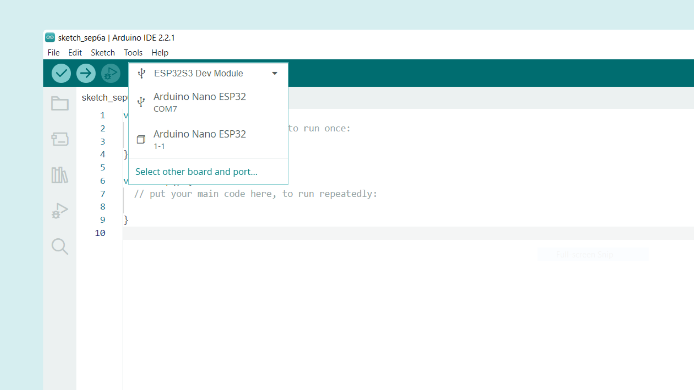
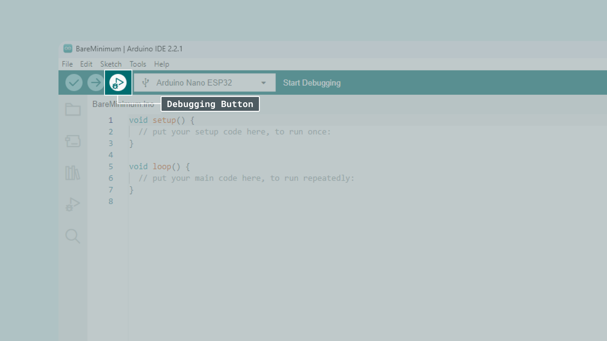

Debugging skills are valuable not only for tackling complex projects but also for beginners and those working on intermediate-level projects, as they offer valuable insights into the specific behavior of your code.

## What Is Debugging?

Debugging is an essential skill for anyone working with technology, whether you're a software developer, a student learning to code, or someone who just wants to understand how computers work. Here's why it's so crucial:

**Improving Performance**: Debugging helps identify and resolve issues that can slow down your software or make it behave unpredictably.

**Ensuring Reliability**: Debugging ensures that your programs and devices work correctly and reliably, preventing crashes or malfunctions.

**Saving Time and Frustration**: Fixing bugs early in the development process can save you hours, days, or even weeks of frustration down the road.

**Learning Opportunity**: Debugging challenges your problem-solving skills and deepens your understanding of programming and technology.

## Software & Hardware Needed

- [Arduino Nano ESP32](https://store.arduino.cc/nano-esp32)
- [Arduino IDE](https://www.arduino.cc/en/software)
- [Arduino ESP32 Core](https://github.com/arduino/arduino-esp32) installed (2.0.12 or newer)

## IDE Setup

To use the debugging feature on the Nano ESP32, you need to have the IDE 2.2.0 or a newer version installed. After you install it, you have to configure the IDE as follows:

-  **Tools** > **USB Mode** > **Debug mode (Hardware CDC)**

-  **Tools** > **Programmer** > **Esptool**

-  **Sketch** > **Optimize for Debugging**

## Running a Debug Session

If this is your first time debugging your code we recommend starting with the classic Blink example. It's a simple sketch but works great for understanding the basics of debugging.

Before starting a debug session make sure to always do one of the following:

- Either connect a jumper cable between the **GND** and the **B1** pins and press the reset button **once**. The RGB LED will turn on with a green or blue color. Remove the jumper cable and you should see the RGB LED light up in a purple or yellow color. Then inside **Tools**, the board will be shown as a random ESP32 board.

***This is because in this mode all ESP32 chips share the same identifier assigned to USB devices, therefore the IDE selects a random ESP32 board.***

Continue to select **Tools** > **Board** > **Arduino Nano ESP32** as well as the correct **Port**.

After that select **Sketch** > **Upload Using Programmer**.

- Or double-tap the reset button. You will see the RGB LED fading slowly which means you correctly entered the recovery / Device Firmware Update (DFU) mode. You should see two ports in the drop-down menu, one showing a USB symbol and another one showing a cube.

**After the upload completes** either way, make sure to also **manually reset** the board by pressing the reset button **once**. Otherwise, it may not properly connect via USB and not show up inside the IDE.

Finally, after completing all steps above the last step is to start the debugging sessions via the **Start Debugging** button found at the top of the IDE next to the Upload button.

***Note: During the upload you will see a debug_custom.json appear in the file view. If you want to debug using another board it's important that you delete this file otherwise the IDE will use the wrong debugger and fail. You can find the file inside your sketch folder, typically at `~/documents/Arduino/<yoursketch>`***

After starting the debugging session you have to press the continue button **several times** until you reach your main sketch and the breakpoints you set. This is due to how the recovery system works is expected behavior.

## Restore Normal Upload Functionality

Debug-enabled sketches will only accept updates with the above instructions. To restore normal upload functionality, set **Tools** > **USB Mode** to "**Normal mode (Tiny USB)**". You can also uncheck "**Optimize for Debugging**" to increase compilation speed.

Then repeat the steps described above:

- Either connect a jumper cable between the **GND** and the **B1** pins press the reset button **once** and upload using programmer.

- Or **double-tap** the reset button to enter **DFU mode** and perform a normal upload using the upload button.

## Summary

In this article we covered the basic steps for debugging the Arduino Nano ESP32 using the Arduino IDE. We have learned how to select the debug mode, how to place the board in the right mode, and how to test out the Arduino IDE's debugging features.

## Learn More
This article only covers how to configure the Nano ESP32 for debugging, and how to get things working. To learn more about how to use the debugging features in the IDE, see the [Debugging with the Arduino IDE 2](/software/ide-v2/tutorials/ide-v2-debugger) article, which covers things in more detail.