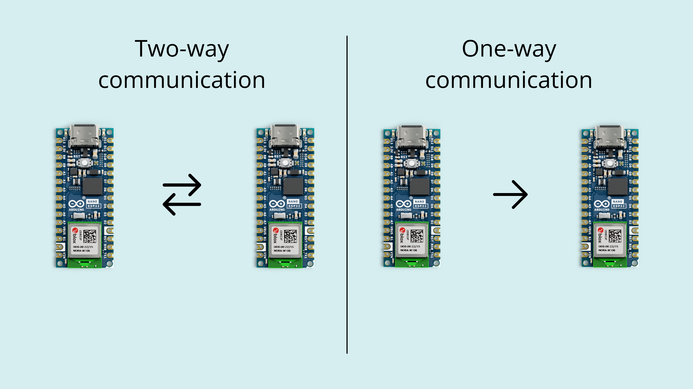

## Introduction

ESP-NOW is a wireless communication protocol developed by Espressif, the company behind the ESP32 microcontroller (MCU). Since the Arduino Nano ESP32 is equipped with that MCU it also supports the ESP-NOW protocol out of the box. It's designed for efficient and low-latency communication between devices, capable of sending up to 250 bytes.

## Hardware Requirements

ESP-NOW is supported on the following microcontrollers: 

- [Arduino Nano ESP32](https://store.arduino.cc/products/nano-esp32)
- generic ESP8266
- generic ESP32
- generic ESP32-S 
- ESP32-C series of SoCs

You need two boards or more to communicate via ESP-NOW. Minimum one sender and one receiver.

## How It Works

### Communication Protocol 
ESP-NOW operates as a peer-to-peer (P2P) protocol, meaning it allows direct communication between two ESP8266 or ESP32 devices without the need for a central server or access point, e.g. a Wi-Fi® router. Each ESP device has a unique [MAC address](https://en.wikipedia.org/wiki/MAC_address) which is used to identify the receiving board.

ESP-NOW can be set up in different ways:

**One-way communication**: In one-way communication mode, one device (the sender) can send data to another device (the receiver) without expecting a response. This mode is often used for scenarios where one device provides data or commands to another device, such as remote sensor readings or control commands.

**Two-way communication**: In two-way communication mode, both devices can exchange data bidirectionally. This mode enables a back-and-forth exchange of information between the devices, allowing for more interactive and responsive communication. It's suitable for applications where devices need to send and receive data from each other, such as remote control systems or interactive IoT devices.



### Protocol Stack

ESP-NOW operates primarily at the data-link layer of the [OSI model](https://en.wikipedia.org/wiki/OSI_model). In contrast to traditional networking protocols that involve multiple layers, ESP-NOW condenses the communication stack, streamlining the process. By reducing the protocol stack to a single layer, ESP-NOW eliminates the need for complex [packet headers](https://www.cloudflare.com/en-gb/learning/network-layer/what-is-a-packet/) and unpackers on each layer. This simplicity results in quicker response times, reducing delays caused by packet loss in congested networks.


### Lightweight Design
The protocol minimizes communication overhead, making it more efficient for resource-constrained devices. It also doesn’t perform [handshakes](https://en.wikipedia.org/wiki/Handshake_(computing)) as devices are preconfigured to allow for faster data transmission and reduced power consumption.

### Limited Data Quantities 
ESP-NOW is useful when transmitting smaller amounts of data (max 250 bytes). It utilizes action frames for communication. Action frames are specialized data frames that contain information about the action being performed. These frames allow ESP-NOW devices to efficiently exchange data without the overhead associated with more generic data frames.


### Low Latency
As a result of the limited data quantities and its lightweight design ESP-NOW introduces a low latency, which means that devices can quickly exchange data making it suitable for remote controlling other devices, e.g. a radio car.

## Limitations

### Limited Range 
ESP-NOW has a limited signal range, typically around 220 meters under ideal conditions. The actual range can vary depending on factors like environmental interference, antenna design, and obstacles in the communication path.

### Interference 
Like other wireless communication technologies operating in the 2.4GHz band, ESP-NOW can be susceptible to interference from other devices and Wi-Fi networks. It's essential to choose communication channels carefully to minimize interference and ensure reliable communication.

### No Network Infrastructure
ESP-NOW is designed for point-to-point and point-to-multipoint communication but doesn't provide the infrastructure for building complex network topologies. If your application requires a network with multiple interconnected devices or internet connectivity, you may need to complement ESP-NOW with additional networking solutions.

### Limited Data Payload 
ESP-NOW is optimized for transmitting smaller amounts of data, with a maximum payload of around 250 bytes. If your application requires high-bandwidth data transfer or large file exchanges, other services such as the [Arduino IoT Cloud](https://cloud.arduino.cc/) might be more suitable.

### Security Considerations
While ESP-NOW offers some level of data privacy, it may not be as secure as other communication protocols like HTTPS or MQTT with robust encryption. If your project involves sensitive data, consider implementing additional security measures to protect against eavesdropping and unauthorized access.

### No Message Acknowledgment
ESP-NOW does not provide built-in acknowledgment mechanisms for confirming successful message delivery. If message reliability is crucial for your application, you'll need to implement your own acknowledgment and error-handling mechanisms.

### Compatibility
ESP-NOW is primarily designed for use with ESP8266 and ESP32 microcontrollers. While it can be compatible with other ESP32-based devices, it may not work seamlessly with other non-ESP platforms. Compatibility should be considered when designing a system with multiple types of devices.

## Arduino IoT Cloud

Arduino provides their own service for handling wireless communication called Arduino IoT Cloud. You can read more about it [here](https://docs.arduino.cc/arduino-cloud/).

While the Arduino IoT Cloud offers similar features to the ESP-NOW protocols they are vastly different and should be used for specific usecases. Check the comparison table below for more information.

|                     | Arduino IoT Cloud                                                           | ESP-NOW                                                                        |
|---------------------|-----------------------------------------------------------------------------|--------------------------------------------------------------------------------|
| Range               | Depends on internet connectivity, suitable for global reach.                | Approx 220m.                                                                   |
| Security            | Secure communication with encryption and authentication.                    | Basic security, may need additional measures.                                  |
| Delay               | Network-related delays due to internet communication.                       | Low latency for local communication.                                           |
| Data Size           | Unlimited data (min. Entry plan)                                            | max 250 bytes.                                                                 |
| Device Compatibility| Compatible with various Arduino boards and IoT devices.                     | Primarily used with ESP8266 and ESP32 microcontrollers.                        |
| Protocol            | Uses MQTT for communication.                                                | Uses a custom ESP-NOW protocol.                                                |
| Power Consumption   | May consume more power, especially when connected to the internet.          | Known for low power consumption.                                               |
| Data Processing     | Allows for cloud-based data processing and analytics.                       | Primarily for direct device-to-device communication.                           |
| Use Cases           | IoT projects requiring global connectivity and cloud-based data management. | Applications needing low-latency, local communication.                         |

***Check out the different Arduino IoT Cloud plans [here](https://cloud.arduino.cc/plans).***

## Code

Below you can find examples for sending and receiving data via the ESP-NOW protocol. You first need to identify the MAC address of your receiving board to let the sender know where to send the data. To identify the MAC address of your board upload the following code:

```arduino
// Complete Instructions to Get and Change ESP MAC Address: https://RandomNerdTutorials.com/get-change-esp32-esp8266-mac-address-arduino/

#include "WiFi.h"

void setup(){
  Serial.begin(115200);
  WiFi.mode(WIFI_MODE_STA);
  Serial.println(WiFi.macAddress());
}
 
void loop(){

}
```

### Sender Sketch

```arduino
/*
  Rui Santos
  Complete project details at https://RandomNerdTutorials.com/esp-now-esp32-arduino-ide/
  
  Permission is hereby granted, free of charge, to any person obtaining a copy
  of this software and associated documentation files.
  
  The above copyright notice and this permission notice shall be included in all
  copies or substantial portions of the Software.
*/

#include <esp_now.h>
#include <WiFi.h>

// REPLACE WITH YOUR RECEIVER MAC Address
uint8_t broadcastAddress[] = {0xFF, 0xFF, 0xFF, 0xFF, 0xFF, 0xFF};

// Structure example to send data
// Must match the receiver structure
typedef struct struct_message {
  char a[32];
  int b;
  float c;
  bool d;
} struct_message;

// Create a struct_message called myData
struct_message myData;

esp_now_peer_info_t peerInfo;

// callback when data is sent
void OnDataSent(const uint8_t *mac_addr, esp_now_send_status_t status) {
  Serial.print("\r\nLast Packet Send Status:\t");
  Serial.println(status == ESP_NOW_SEND_SUCCESS ? "Delivery Success" : "Delivery Fail");
}
 
void setup() {
  // Init Serial Monitor
  Serial.begin(115200);
 
  // Set device as a Wi-Fi Station
  WiFi.mode(WIFI_STA);

  // Init ESP-NOW
  if (esp_now_init() != ESP_OK) {
    Serial.println("Error initializing ESP-NOW");
    return;
  }

  // Once ESPNow is successfully Init, we will register for Send CB to
  // get the status of Transmitted packet
  esp_now_register_send_cb(OnDataSent);
  
  // Register peer
  memcpy(peerInfo.peer_addr, broadcastAddress, 6);
  peerInfo.channel = 0;  
  peerInfo.encrypt = false;
  
  // Add peer        
  if (esp_now_add_peer(&peerInfo) != ESP_OK){
    Serial.println("Failed to add peer");
    return;
  }
}
 
void loop() {
  // Set values to send
  strcpy(myData.a, "THIS IS A CHAR");
  myData.b = random(1,20);
  myData.c = 1.2;
  myData.d = false;
  
  // Send message via ESP-NOW
  esp_err_t result = esp_now_send(broadcastAddress, (uint8_t *) &myData, sizeof(myData));
   
  if (result == ESP_OK) {
    Serial.println("Sent with success");
  }
  else {
    Serial.println("Error sending the data");
  }
  delay(2000);
}
```

### Receiver Sketch

```arduino
/*
  Rui Santos
  Complete project details at https://RandomNerdTutorials.com/esp-now-esp32-arduino-ide/
  
  Permission is hereby granted, free of charge, to any person obtaining a copy
  of this software and associated documentation files.
  
  The above copyright notice and this permission notice shall be included in all
  copies or substantial portions of the Software.
*/

#include <esp_now.h>
#include <WiFi.h>

// Structure example to receive data
// Must match the sender structure
typedef struct struct_message {
    char a[32];
    int b;
    float c;
    bool d;
} struct_message;

// Create a struct_message called myData
struct_message myData;

// callback function that will be executed when data is received
void OnDataRecv(const uint8_t * mac, const uint8_t *incomingData, int len) {
  memcpy(&myData, incomingData, sizeof(myData));
  Serial.print("Bytes received: ");
  Serial.println(len);
  Serial.print("Char: ");
  Serial.println(myData.a);
  Serial.print("Int: ");
  Serial.println(myData.b);
  Serial.print("Float: ");
  Serial.println(myData.c);
  Serial.print("Bool: ");
  Serial.println(myData.d);
  Serial.println();
}
 
void setup() {
  // Initialize Serial Monitor
  Serial.begin(115200);
  
  // Set device as a Wi-Fi Station
  WiFi.mode(WIFI_STA);

  // Init ESP-NOW
  if (esp_now_init() != ESP_OK) {
    Serial.println("Error initializing ESP-NOW");
    return;
  }
  
  // Once ESPNow is successfully Init, we will register for recv CB to
  // get recv packer info
  esp_now_register_recv_cb(OnDataRecv);
}
 
void loop() {

}
```

## Read More
For a more detailed explanation on how the code works check out the article at [randomnerdtutorials.com](https://randomnerdtutorials.com/esp-now-esp32-arduino-ide/).

You can also read more about the `esp_now` library over at [https://docs.espressif.com/](https://docs.espressif.com/).

## Summary
In this article we covered the basics of the ESP-NOW protocol and how it works. We also provided example code serving as a starting point for your project. Overall, ESP-NOW is a powerful communication protocol for local and low-latency applications, particularly when using ESP8266 and ESP32 microcontrollers. 

However, it comes with certain limitations that you should be aware of when designing projects.