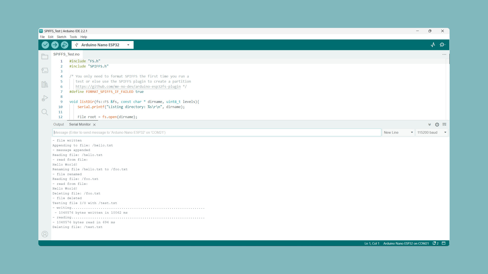

The SPIFFS (Serial Peripheral Interface Flash File System) is a file system designed to be used with NOR flash memory devices and microcontrollers that support the Serial Peripheral Interface (SPI) protocol such as the ESP32 found on the [Nano ESP32](https://store.arduino.cc/products/nano-esp32?queryID=undefined).

***Before proceeding with the SPIFFS file system setup on Nano ESP, please be aware that the mounting instructions mentioned in a comment on the code from the packaged built-in example are tailored for specific older IDE versions such as IDE 1.8. These instructions might not be relevant to IDE 2.0, as it does not support the utilization of custom tools, which are unnecessary in this case.***

## Hardware & Software Needed

- [Arduino Nano ESP32](https://store.arduino.cc/nano-esp32)
- [Arduino IDE](https://www.arduino.cc/en/software)
- [Arduino ESP32 Core](https://github.com/arduino/arduino-esp32) installed (done in the Arduino IDE).

## Set Up SPIFFS File System

Start by opening the **SPIFFS_Test example** by navigating to:

- File > Examples > SPIFFS > SPIFFS_Test

***The example is also included at the bottom (see [Example](#example)), together with an explanation of how the code work.***


Select the correct **Partition Scheme** by clicking: 

- Tools > Partition Scheme > With SPIFFS partition (advanced)


Prepare your following these steps:

- Take your **unplugged** board and connect a jumper cable between the **GND** and **B1** pins. 

- **Plug it in** and the RGB LED will turn on with a green or blue color.

- While the **GND** and **B1** pins are shorted, press the white **RST** button on the top of the board to reset the board.

- **Remove** the jumper cable. The RGB LED should stay on, in a purple or yellow color.

Select the correct port:


***If your board shows up as a generic ESP32 device go to Tools > Board and select "Arduino Nano ESP32" as well as the correct port under Tools > Port.***

Select the **Esptool as Programmer** by going to:

- Tools > Programmer > Esptool


**Burn the bootloader** by clicking:

- Tools > Burn Bootloader


We have now successfully changed the partition scheme and the final step is to upload a sketch using programmer and reset the board.

Upload the sketch via **Using Programmer** by going to:

- Sketch > Upload Using Programmer


After the successful upload press the white **RST** button on the top of the board. You should see two ports in the drop-down menu, one showing a USB symbol and another one showing a cube.

Select the port next to the USB symbol. 


Open the serial monitor and you should see the following output:



***Note: It might take a short while for the messages to be printed. If you don't see any messages after one minute repeat the process.***

## Example

As mentioned above the code is taken from **File > Examples > SPIFFS > SPIFFS_Test** and can also be found inside the IDE's example section. It showcases different features available when using the SPIFSF file system.

```arduino
#include "FS.h"
#include "SPIFFS.h"

/* You only need to format SPIFFS the first time you run a
   test or else use the SPIFFS plugin to create a partition
   https://github.com/me-no-dev/arduino-esp32fs-plugin */
#define FORMAT_SPIFFS_IF_FAILED true

void listDir(fs::FS &fs, const char * dirname, uint8_t levels){
    Serial.printf("Listing directory: %s\r\n", dirname);

    File root = fs.open(dirname);
    if(!root){
        Serial.println("- failed to open directory");
        return;
    }
    if(!root.isDirectory()){
        Serial.println(" - not a directory");
        return;
    }

    File file = root.openNextFile();
    while(file){
        if(file.isDirectory()){
            Serial.print("  DIR : ");
            Serial.println(file.name());
            if(levels){
                listDir(fs, file.path(), levels -1);
            }
        } else {
            Serial.print("  FILE: ");
            Serial.print(file.name());
            Serial.print("\tSIZE: ");
            Serial.println(file.size());
        }
        file = root.openNextFile();
    }
}

void readFile(fs::FS &fs, const char * path){
    Serial.printf("Reading file: %s\r\n", path);

    File file = fs.open(path);
    if(!file || file.isDirectory()){
        Serial.println("- failed to open file for reading");
        return;
    }

    Serial.println("- read from file:");
    while(file.available()){
        Serial.write(file.read());
    }
    file.close();
}

void writeFile(fs::FS &fs, const char * path, const char * message){
    Serial.printf("Writing file: %s\r\n", path);

    File file = fs.open(path, FILE_WRITE);
    if(!file){
        Serial.println("- failed to open file for writing");
        return;
    }
    if(file.print(message)){
        Serial.println("- file written");
    } else {
        Serial.println("- write failed");
    }
    file.close();
}

void appendFile(fs::FS &fs, const char * path, const char * message){
    Serial.printf("Appending to file: %s\r\n", path);

    File file = fs.open(path, FILE_APPEND);
    if(!file){
        Serial.println("- failed to open file for appending");
        return;
    }
    if(file.print(message)){
        Serial.println("- message appended");
    } else {
        Serial.println("- append failed");
    }
    file.close();
}

void renameFile(fs::FS &fs, const char * path1, const char * path2){
    Serial.printf("Renaming file %s to %s\r\n", path1, path2);
    if (fs.rename(path1, path2)) {
        Serial.println("- file renamed");
    } else {
        Serial.println("- rename failed");
    }
}

void deleteFile(fs::FS &fs, const char * path){
    Serial.printf("Deleting file: %s\r\n", path);
    if(fs.remove(path)){
        Serial.println("- file deleted");
    } else {
        Serial.println("- delete failed");
    }
}

void testFileIO(fs::FS &fs, const char * path){
    Serial.printf("Testing file I/O with %s\r\n", path);

    static uint8_t buf[512];
    size_t len = 0;
    File file = fs.open(path, FILE_WRITE);
    if(!file){
        Serial.println("- failed to open file for writing");
        return;
    }

    size_t i;
    Serial.print("- writing" );
    uint32_t start = millis();
    for(i=0; i<2048; i++){
        if ((i & 0x001F) == 0x001F){
          Serial.print(".");
        }
        file.write(buf, 512);
    }
    Serial.println("");
    uint32_t end = millis() - start;
    Serial.printf(" - %u bytes written in %u ms\r\n", 2048 * 512, end);
    file.close();

    file = fs.open(path);
    start = millis();
    end = start;
    i = 0;
    if(file && !file.isDirectory()){
        len = file.size();
        size_t flen = len;
        start = millis();
        Serial.print("- reading" );
        while(len){
            size_t toRead = len;
            if(toRead > 512){
                toRead = 512;
            }
            file.read(buf, toRead);
            if ((i++ & 0x001F) == 0x001F){
              Serial.print(".");
            }
            len -= toRead;
        }
        Serial.println("");
        end = millis() - start;
        Serial.printf("- %u bytes read in %u ms\r\n", flen, end);
        file.close();
    } else {
        Serial.println("- failed to open file for reading");
    }
}

void setup(){
    Serial.begin(115200);
    if(!SPIFFS.begin(FORMAT_SPIFFS_IF_FAILED)){
        Serial.println("SPIFFS Mount Failed");
        return;
    }
    
    listDir(SPIFFS, "/", 0);
    writeFile(SPIFFS, "/hello.txt", "Hello ");
    appendFile(SPIFFS, "/hello.txt", "World!\r\n");
    readFile(SPIFFS, "/hello.txt");
    renameFile(SPIFFS, "/hello.txt", "/foo.txt");
    readFile(SPIFFS, "/foo.txt");
    deleteFile(SPIFFS, "/foo.txt");
    testFileIO(SPIFFS, "/test.txt");
    deleteFile(SPIFFS, "/test.txt");
    Serial.println( "Test complete" );
}

void loop(){

}
```

### How it works?

- First, the **necessary libraries** are included:

```arduino
#include "FS.h"
#include "SPIFFS.h"
```

- The constant `FORMAT_SPIFFS_IF_FAILED` is used to specify whether the SPIFFS file system should be formatted if it fails to mount. If it's `true`, the file system will be formatted:

```arduino
#define FORMAT_SPIFFS_IF_FAILED true
```

- The code consists of several **functions** defined in the code showcasing **different features** such as:
  - `void listDir()` = List Files
  - `void readFile()` = Read Files
  - `void writeFile()` = Write Files
  - `void appendFile()` = Append a message to an existing file
  - `void renameFile()` = Rename Files
  - `void deleteFile()` =  Delete Files
  - `void testFileIO()` = Testing a file's input and output by writing a large amount of data and then reading it.

- Before calling all the functions mentioned above **two things** are done inside `setup()`:
  -  The serial communication is initialized with a baud rate of 115200.
  -  The SPIFFS file system is mounted and if `FORMAT_SPIFFS_IF_FAILED` is `true` it's formatted.

```arduino
void setup(){
    Serial.begin(115200);
    if(!SPIFFS.begin(FORMAT_SPIFFS_IF_FAILED)){
        Serial.println("SPIFFS Mount Failed");
        return;
    }
    ...
}
```

Lastly, all functions are called with parameters:

```arduino
void setup(){
    Serial.begin(115200);
    if(!SPIFFS.begin(FORMAT_SPIFFS_IF_FAILED)){
        Serial.println("SPIFFS Mount Failed");
        return;
    }
    
    listDir(SPIFFS, "/", 0);
    writeFile(SPIFFS, "/hello.txt", "Hello ");
    appendFile(SPIFFS, "/hello.txt", "World!\r\n");
    readFile(SPIFFS, "/hello.txt");
    renameFile(SPIFFS, "/hello.txt", "/foo.txt");
    readFile(SPIFFS, "/foo.txt");
    deleteFile(SPIFFS, "/foo.txt");
    testFileIO(SPIFFS, "/test.txt");
    deleteFile(SPIFFS, "/test.txt");
    Serial.println( "Test complete" );
}
```

- All messages printed on the serial monitor are defined in the respective function, except "Test Complete" which printed by `setup()` once everything is done.