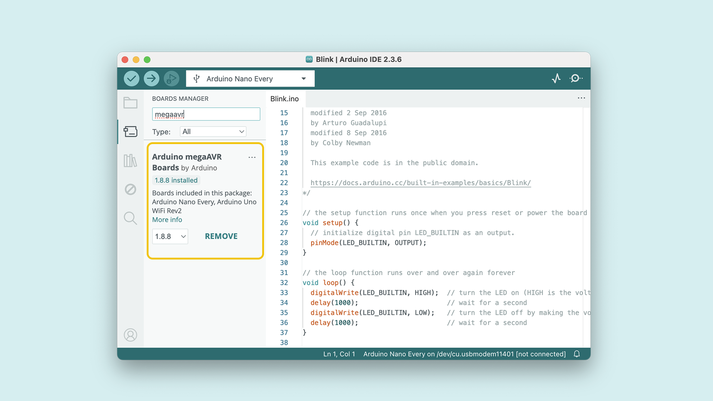
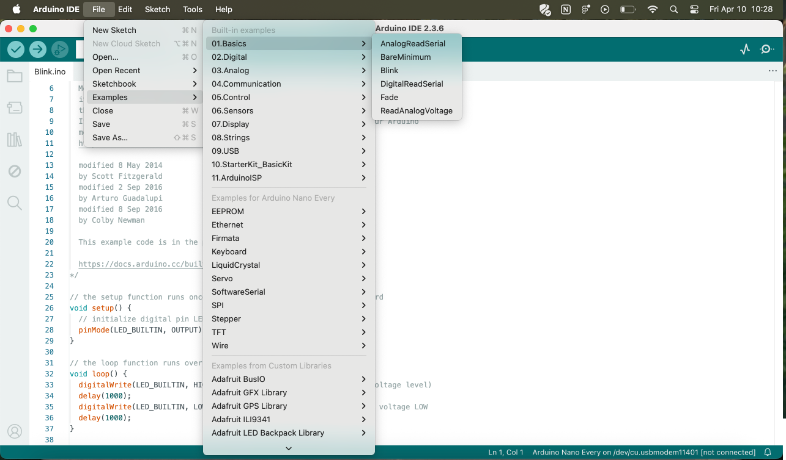
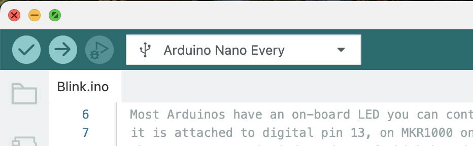
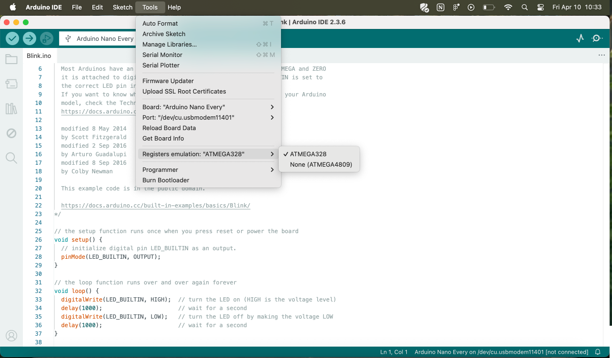

To use the [Arduino Nano Every](/hardware/nano-every) board, you will need to install the Nano Every board package, which is part of the [Arduino megaAVR Boards core](https://github.com/arduino/ArduinoCore-megaavr).

To install it, you will need the Arduino IDE, which you can download from the [Arduino Software page](https://www.arduino.cc/en/software). In this guide, we will use the latest version of the IDE 2.

## Software & Hardware Needed

- [Arduino Nano Every](https://store.arduino.cc/nano-every)
- [Arduino IDE](/software/ide-v2)

***You can also use the [Arduino Cloud Editor](https://create.arduino.cc/editor) which comes with all Arduino boards pre-installed.***

## Download & Install IDE

1. Download the Arduino IDE from the [Arduino Software page](https://www.arduino.cc/en/software/).
2. Install the Arduino IDE on your local machine.
3. Open the Arduino IDE.

## Install Board Package

To install the board package, open the **Board Manager** from the menu on the left. Search for **Nano Every** and install the **Arduino megaAVR Boards** package.

You should now be able to select your board in the board selector. Connect your board to your computer via a USB cable.

## Compile & Upload Sketches

To compile and upload sketches, you can use the:
- **Checkmark** for compiling code.
- **Right arrow** to upload code.

To get started, open the Blink example: **File > Examples > 01.Basics > Blink**.

Select **Arduino Nano Every** from the **Tools > Board** menu.

Click the **Upload** button. After a few seconds, the on-board LED will start to blink. If it does, congratulations! You've gotten your Arduino Nano Every up and running.

***If you have problems, please see the [troubleshooting suggestions](https://www.arduino.cc/en/Guide/Troubleshooting).***

## Summary

In this tutorial, we have installed the Arduino Nano Every board package and uploaded a Blink sketch using the Arduino IDE.

For more projects and tutorials, visit our [Project Hub](https://create.arduino.cc/projecthub?by=part&part_id=104149&sort=trending).

## Additional Information

The microcontroller on the Arduino Nano Every runs at 5V and it is fully electrically compatible with the original Arduino Nano designs. The headers are mapped in the same way and it is possible to substitute any Arduino Nano board with the new Arduino Nano Every.

On the software side there might be some issue with third party libraries that don't manage the pin mapping of the microcontroller; if the sketch has assembly parts inside, you should turn on the "Register Emulation" mode to emulate ATmega328P registers in the 4809 while compiling.

### Features

**Batteries, Pins and board LEDs**

* _Batteries:_ the Nano Every has no battery connector, nor charger. You can connect any external battery of your liking as long as you respect the voltage limits of the board.
* _Vin:_ This pin can be used to power the board with a DC voltage source. If the power is fed through this pin, the USB power source is disconnected. This pin is an INPUT. Respect the voltage limits of 7-21V to assure the proper functionality of the board.
* _5V:_ This pin outputs 5V from the board when powered from the USB connector or from the VIN pin of the board.
* _3.3V:_ This pin outputs 3.3V through the on-board voltage regulator.
* _LED ON:_ This LED is connected to the 5V input from either USB or VIN.

**Serial ports on the Arduino Nano Every**

The USB connector of the board is connected to the pins 11 and 12 of the SAMD11. The firmware loaded on this microcontroller supports the standard features of the USB to Serial interface common to the Arduino boards, but allows high performance transfers up to 1Mbit/s. The firmware is open source and can be modified to implement new functions. The interface to the SAMD11 / USB is **Serial** and the the one available on pins RX0 and TX1 is **Serial1**.

**ADC and PWM resolutions **

The Arduino Nano Every has the standard ADC and PWM resolutions of 10-bits and 8-bits, respectively. This board doesn't have PWM on D11 and therefore it supports only 5 PWM outputs.

## Firmware for SAMD11D14A

The USB interface is managed by a dedicated SAMD11 that is factory loaded with the proper firmware to program the ATMega4809 microcontroller and let the Arduino NANO Every behave as it should when connected to a host computer for programming and serial communication.

Since we don't officially support SAMD11 in our SAMD core, the core to be used is the awesome [fork by MattairTech](https://github.com/mattairtech/ArduinoCore-samd). Once you install it you'll be able to compile a basic firmware for MuxTO. To get the whole firmware you'll need to replace some files with [our own fork](https://github.com/arduino/ArduinoCore-samd/commits/muxto) and select "Arduino MuxTO" variant target.

To reprogram the D11, simply power it while shorting SWDIO to GND pins.

The board will appear as "MuxTo bootloader" and can be reprogammed using bossac or the IDE Upload button if you selected "Arduino MuxTO" target.