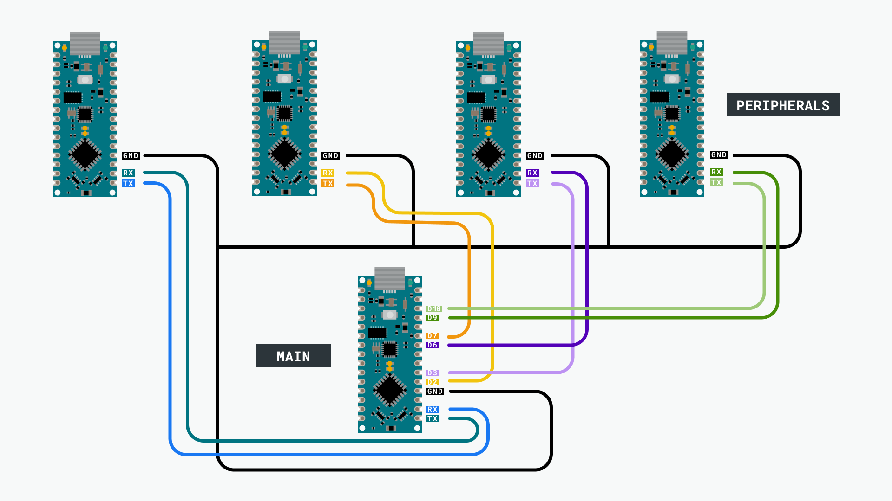
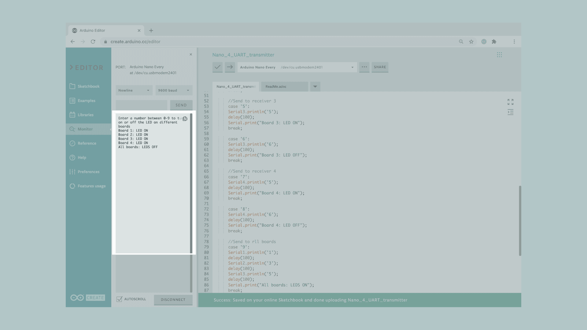

## Communicating with Four Boards Through UART

In this tutorial we will control the built-in LED on four Arduino Nano Every boards, from a main Arduino Nano Every. To do so, we will connect the boards using a wired communication protocol called UART.

> **Note:** This example would work by connecting an Arduino Nano Every board with **any** other Arduino board, but be mindful that both board must work at the same voltage. If the operating voltage differs between the connected boards, the board with the lower operating voltage could be damaged.

In this example, we will power the Arduino boards through the computer, then we will use the Serial Monitor to send some commands to the main Nano Every board, that will be connected through the UART with others Nano Every boards. Depending on the commands received by the main Nano Every board, it will turn **ON** or **OFF** the built-in LED on different boards.


## Goals
The goals of this project are:
- Understand what the UART is.
- Use the SoftwareSerial library
- Use UART communication between five Arduino boards.


## Hardware & Software Needed

For this project we will need:

* [Arduino Nano Every](https://store.arduino.cc/products/arduino-nano-every)
* 4 x Arduino Nano Every (or any other Arduino boards that works at 5V)
* 5 x [mini breadboard](https://store.arduino.cc/mini-breadboard-white-998)
* 13 x [jumper wires](https://store.arduino.cc/10-jumper-wires-150mm-male)

## UART Communication

UART (Universal Asynchronous Receiver-Transmitter) is one of the most used device-to-device communication protocols. It allows an asynchronous serial communication in which the data format and transmission speed are configurable. The UART communication sends data bits one by one, from the least significant to the most significant, framed by start and stop bits so that precise timing is handled by the communication channel.

Embedded systems, microcontrollers, and computers mostly use UART as a form of device-to-device hardware protocol. Among the available communication protocols, UART uses only two wires for its transmitting and receiving ends, TX (Transmitter) and RX (Receiver). These pins are dedicated for that specific purpose, either transmitting or receiving.

Asynchronous means there is no clock signal to synchronize the output bits from the transmitting device going to the receiving end, but the baud rate needs to be the same on both the transmitting and receiving devices. The baud rate, is the rate at which information is transferred to a communication channel. In the serial port context, the set baud rate will serve as the maximum number of bits per second to be transferred.

UART is the communication protocol we use to communicate from the computer to the board through the USB cable. In some older boards, TX and RX pins are used for communication with the computer, which means connecting anything to these pins can interfere with that communication, including causing failed uploads to the board. This is not the case for the Nano or MKR families, since these boards have two separate channels, using **Serial** for the communication with the computer and **Serial1** for the communication with any other device through UART.

If you want to learn more about the UART protocol and how it works, you can check [this link](https://en.wikipedia.org/wiki/Universal_asynchronous_receiver-transmitter).

## SoftwareSerial Library

The Arduino hardware has built-in support for UART communication on pins 0 and 1. The `SoftwareSerial` library has been developed to allow serial communication on other digital pins of the Arduino, using software to replicate the functionality (hence the name "SoftwareSerial").

It is possible to have multiple software serial ports with a speed up to 115200 bps, but in the Nano Every board the maximum speed is limited to 9600 bps.


### Circuit

In order to communicate all the Arduino boards, we will need to connect them as shown in the image below.

> **Note:** If you want to initialize the UART communication with any other Arduino board, please check [here](https://www.arduino.cc/reference/en/language/functions/communication/serial/) the serial port and the pins you need to use.



At the moment of making the connections, we need to remember that this protocol has two dedicated lines TX and RX, so we need to make sure to connect the TX pin of the main board, with the RX of the other one. The same goes for the RX pin, which need to be connected to the TX pin of the other board.

To finish, it is very important that we connect the GND pins of all boards to each other. If we don't do this, the voltage reference will be different for each one of the boards so the communication won't work as intended.

> **Note:** In order to enable serial communication, the Arduino boards must be connected to your computer via USB.


## Creating the Program

**1. Configuring the Peripheral boards**

First, let's connect one of the Arduino Nano Every board to the computer and open the Arduino Cloud Editor. This board will act as a peripheral, which means that it will only receive data from the main board and turn ON or OFF the built-in LED according to the received values.
To start with the programming, start a new sketch and name it **Nano_4_UART_receiver**.

**1.1. Receiver code walkthrough**

Let's start inside the `setup()` function. We need to initialize the built-in LED as `OUTPUT` and then turn it off. Then, we need to initialize the UART communication with the main board using the `Serial1.begin()` function since the receiver board will receive the data through the **UART1** port.

```arduino
void setup() {
  pinMode(LED_BUILTIN, OUTPUT);      // set LED pin as output
  digitalWrite(LED_BUILTIN, LOW);    // switch off LED pin

  Serial1.begin(9600);            // initialize UART with baud rate of 9600
}
```

> **Note:** Remember that if you used a different board to the ones used on this tutorial, you will need to check the pins you need to use, they may vary depending on the board.

Inside the `loop()`, we need to check if there is any byte available on the buffer using the `Serial1.available()` function inside a `while` statement. This configuration will run the portion of code that is inside the brackets of the `while() `, only if there is any byte available to be read on the buffer of the UART1. If that is the case, we will read and store the available data in the `receivedData` variable using the `Serial1.read()` function, since we want to read the incoming data from the main Arduino board.

```arduino
void loop() {
  while (Serial1.available() >= 0) {
    char receivedData = Serial1.read();   // read one byte from serial buffer and save to receivedData
```

Now, we need to add a `if...else` statement to check if the received data is `'1'` or `'2'` in order to turn on or off the built-in LED respectively.

> **Note:** When we use UART communication, all the data transmitted is text formatted, which means that we need to use character logic instead of numeric logic for compatibility. For example, in order to know if the data received is a "5" we need to check with the ASCII character of 5 ('5') instead of the numeric value of 5 (5). Therefore, we use dataReceived == '5' instead of dataReceived == 5.

```arduino
    if (receivedData == '1') {
      digitalWrite(LED_BUILTIN, HIGH); // switch LED On
    }
    else if (receivedData == '2') {
      digitalWrite(LED_BUILTIN, LOW);  // switch LED Off
    }
  }
}
```

**1.2. Uploading the code to the peripherals**

Once we have finished the code, let's upload it to the first peripheral Arduino Nano Every board. This board is now programmed to act as a peripheral in this scenario. Once the code is uploaded, let's connect the next peripheral board to the computer.

All the boards that act as a peripheral will use the same sketch, the only thing we need to change is the value that will trigger the built-in LED. In the table below we can see the value use for each board.

|Board         |Value to turn ON the LED  |Value to turn OFF the LED  |
|:------------:|:------------------------:|:-------------------------:|
|Peripheral 1  | `'1'`                    |`'2'`                      |
|Peripheral 2  | `'3'`                    |`'4'`                      |
|Peripheral 3  | `'5'`                    |`'6'`                      |
|Peripheral 4  | `'7'`                    |`'8'`                      |


> **Note:** After uploading the code to the peripheral boards, it is not necessary for it to stay connected to the computer in order to function. However, it needs to be powered in order to work.

**2. Configuring the Main board**

It is time to open a new sketch and name it as **Nano_4_UART_transmitter**, and include the **SoftwareSerial** library using the `#include <SoftwareSerial.h>` function. Now we need to name the new UART ports and set the pins that we will use for each port. In order to make the coding easier we will call the UART ports as `Serial2`, `Serial3` and `Serial4`.

```arduino
#include <SoftwareSerial.h>

SoftwareSerial Serial2(7, 2); // RX, TX
SoftwareSerial Serial3(3, 6); // RX, TX
SoftwareSerial Serial4(10, 9); // RX, TX
```
> **Note:** This pins can not be selected randomly since each port has assigned specific pins internally. For more information about the pins you can use for each board, please check [here](https://www.arduino.cc/en/Reference/SoftwareSerial)

Inside the `setup()`, we will start initializing the built-in LED as we did in the code for the peripheral boards.

```arduino
void setup() {
  pinMode(LED_BUILTIN, OUTPUT);      // set LED pin as output
  digitalWrite(LED_BUILTIN, LOW);    // switch off LED pin
```

In addition, we need to initialize the Serial communication with the computer and all the peripheral boards using `Serial.begin()` functions. After that, we will use a `Serial.println()` function to print a message in the Serial Monitor.

```arduino
  Serial.begin(9600);              // initialize serial communication at 9600 bits per second:
  Serial1.begin(9600);            // initialize UART with the first board with baud rate of 9600
  Serial2.begin(9600);            // initialize UART with the second board with baud rate of 9600
  Serial3.begin(9600);            // initialize UART with the third board with baud rate of 9600
  Serial4.begin(9600);            // initialize UART with the fourth board with baud rate of 9600

  Serial.println("Enter a number between 0-9 to turn on or off the LED on different boards");
}
```


In the `loop()`, we will use an `if` statement to check if the there is any incoming byte to read from the Serial Monitor using the `Serial.available()` function. If it is, it will be stored in the `inByte` variable using the `Serial.read()` function. We then use a `switch case` statement to create an action for each number entered in the Serial Monitor.

```arduino
void loop() {
  // check if there is any incoming byte to read from the Serial Monitor
  if (Serial.available() > 0){
    int inByte = Serial.read();

    switch (inByte){
```

Each `case` will turn on or off a different built-in led thanks to the `Serial.println()` functions that will send the data through different UART ports. Then, we need to add a `delay()` of 100 milliseconds in order to have enough time to send the data. Once the data are sent, we will use a `Serial.print()` function to print a message in the Serial Monitor about which board has been turned on or off and finally we use `break` statement to end the case and start the next one.

**Send to receiver 1**
```arduino
      // Send to receiver 1
      case '1':
      Serial1.println('1');
      delay(100);
      Serial.print("Board 1: LED ON");
      break;

      case '2':
      Serial1.println('2');
      delay(100);
      Serial.print("Board 1: LED OFF");
      break;
```

**Send to receiver 2**
```arduino
      //Send to receiver 2
      case '3':
      Serial2.println('3');
      delay(100);
      Serial.print("Board 2: LED ON");
      break;

      case '4':
      Serial2.println('4');
      delay(100);
      Serial.print("Board 2: LED OFF");
      break;
```

**Send to receiver 3**
```arduino
      //Send to receiver 3
      case '5':
      Serial3.println('5');
      delay(100);
      Serial.print("Board 3: LED ON");
      break;

      case '6':
      Serial3.println('6');
      delay(100);
      Serial.print("Board 3: LED OFF");
      break;
```

**Send to receiver 4**
```arduino
      //Send to receiver 4
      case '7':
      Serial4.println('5');
      delay(100);
      Serial.print("Board 4: LED ON");
      break;

      case '8':
      Serial4.println('6');
      delay(100);
      Serial.print("Board 4: LED OFF");
      break;
```

**Send to all boards**
```arduino
      //Send to all boards
      case '9':
      Serial1.println('1');
      delay(100);
      Serial2.println('3');
      delay(100);
      Serial3.println('5');
      delay(100);
      Serial.print("All boards: LEDS ON");
      break;

      case '0':
      Serial1.println('2');
      delay(100);
      Serial2.println('4');
      delay(100);
      Serial3.println('6');
      delay(100);
      Serial4.println('8');
      delay(100);
      Serial.print("All boards: LEDS OFF");
      break;
```

Lastly, we need to end the `switch case` statement using a `default :` function. This part of the code will be called when the `inByte` doesn't match with any of the cases. So, we will only add a `Serial.println()` function to move the incoming text in the Serial Monitor one line down and finally the `break` statement as in the other cases.

```arduino
      default:
      Serial.println(" ");
      break;
    }
  }
}
```

**2.1 Uploading the code to the main board**

Once we have finished the code, let's upload it to our main Arduino Nano Every board. This board is now programmed to act as the main board.

**3. Complete code**

If you choose to skip the code building section, the complete code for both the receivers and the transmitter can be found below:

### Receivers:

```arduino
void setup() {
  pinMode(LED_BUILTIN, OUTPUT);      // set LED pin as output
  digitalWrite(LED_BUILTIN, LOW);    // switch off LED pin

  Serial1.begin(9600);            // initialize UART with baud rate of 9600
}
void loop() {
  while (Serial1.available() >= 0) {
    char receivedData = Serial1.read();   // read one byte from serial buffer and save to receivedData
    // Change the value according to the board you are programming
    // Receiver 1: '1' and '2'
    // Receiver 2: '3' and '4'
    // Receiver 3: '5' and '6'
    // Receiver 4: '7' and '8'
    if (receivedData == '1') {
      digitalWrite(LED_BUILTIN, HIGH); // switch LED On
    }
    else if (receivedData == '2') {
      digitalWrite(LED_BUILTIN, LOW);  // switch LED Off
    }
  }
}
```

### Transmitter:

```arduino
#include <SoftwareSerial.h>

SoftwareSerial Serial2(7, 2); // RX, TX
SoftwareSerial Serial3(3, 6); // RX, TX
SoftwareSerial Serial4(10, 9); // RX, TX

void setup() {
  pinMode(LED_BUILTIN, OUTPUT);      // set LED pin as output
  digitalWrite(LED_BUILTIN, LOW);    // switch off LED pin

  Serial.begin(9600);              // initialize serial communication at 9600 bits per second:
  Serial1.begin(9600);            // initialize UART with the first board with baud rate of 9600
  Serial2.begin(9600);            // initialize UART with the second board with baud rate of 9600
  Serial3.begin(9600);            // initialize UART with the third board with baud rate of 9600
  Serial4.begin(9600);            // initialize UART with the fourth board with baud rate of 9600

  Serial.println("Enter a number between 0-9 to turn on or off the LED on different boards");
}

void loop() {
  // check if there is any incoming byte to read from the Serial Monitor
  if (Serial.available() > 0){
    int inByte = Serial.read();

    switch (inByte){
      // Send to receiver 1
      case '1':
      Serial1.println('1');
      delay(100);
      Serial.print("Board 1: LED ON");
      break;

      case '2':
      Serial1.println('2');
      delay(100);
      Serial.print("Board 1: LED OFF");
      break;

      //Send to receiver 2
      case '3':
      Serial2.println('3');
      delay(100);
      Serial.print("Board 2: LED ON");
      break;

      case '4':
      Serial2.println('4');
      delay(100);
      Serial.print("Board 2: LED OFF");
      break;

      //Send to receiver 3
      case '5':
      Serial3.println('5');
      delay(100);
      Serial.print("Board 3: LED ON");
      break;

      case '6':
      Serial3.println('6');
      delay(100);
      Serial.print("Board 3: LED OFF");
      break;

      //Send to receiver 4
      case '7':
      Serial4.println('5');
      delay(100);
      Serial.print("Board 4: LED ON");
      break;

      case '8':
      Serial4.println('6');
      delay(100);
      Serial.print("Board 4: LED OFF");
      break;

      //Send to all boards
      case '9':
      Serial1.println('1');
      delay(100);
      Serial2.println('3');
      delay(100);
      Serial3.println('5');
      delay(100);
      Serial.print("All boards: LEDS ON");
      break;

      case '0':
      Serial1.println('2');
      delay(100);
      Serial2.println('4');
      delay(100);
      Serial3.println('6');
      delay(100);
      Serial4.println('8');
      delay(100);
      Serial.print("All boards: LEDS OFF");
      break;

      default:
      Serial.println(" ");
      break;
    }
  }
}
```

## Testing It Out
After you have successfully verified and uploaded the sketch to the boards, make sure the main board is connected and then open the Serial Monitor. You need to enter a number between 0-9 to turn ON or OFF a built-in LED in any peripheral board.




### Troubleshoot

Sometimes errors occur, if the code is not working there are some common issues we can troubleshoot:
- Missing a bracket or a semicolon.
- Arduino board connected to the wrong port.
- Connection between the Arduino boards are not correct.
- Missing the initialization of a UART port.
- Accidental interruption of cable connection.


## Conclusion

In this simple tutorial we learned how to connect four Arduino boards to a main Arduino Nano Every board so that they can communicate using UART communication.
