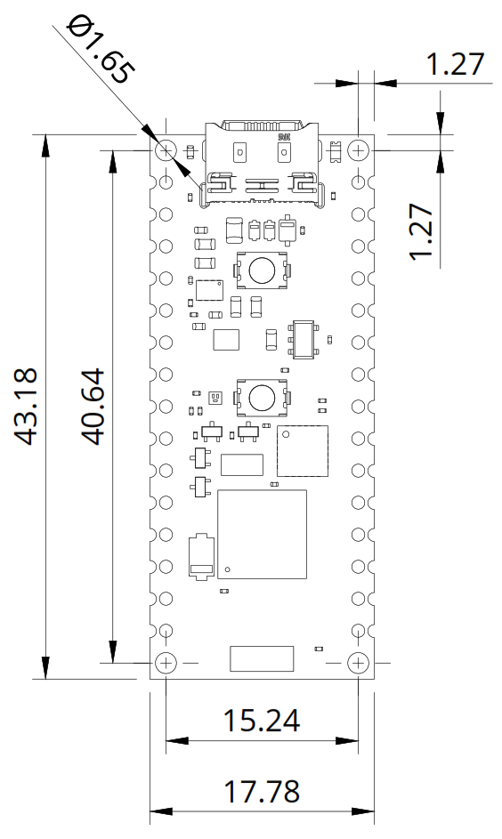
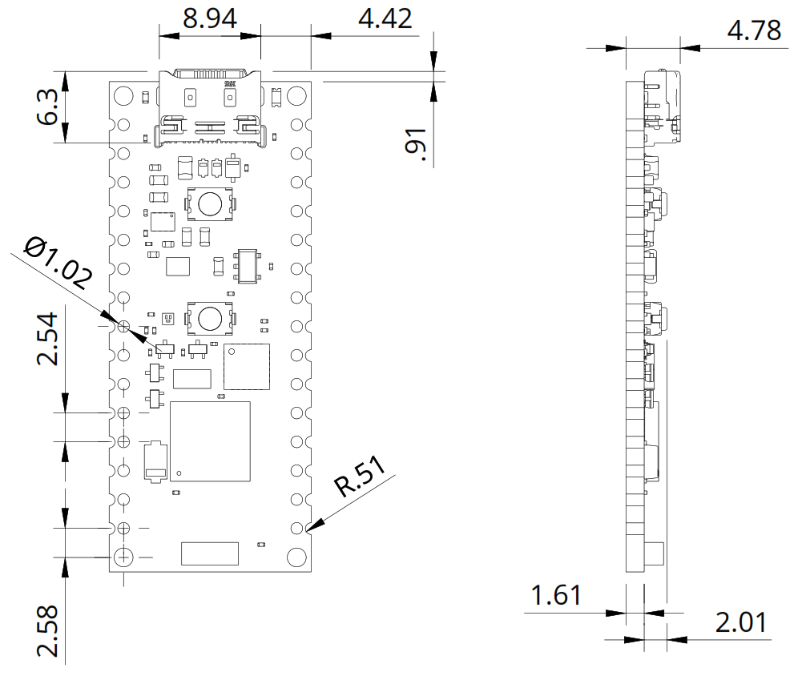

# Description 

Expand your home automation and building management projects with the Arduino Nano Matter. This board integrates the high-performance MGM240S microcontroller from Silicon Labs and directly brings the advanced Matter standard for Internet of Things (IoT) connectivity to hobbyists and professionals. The Nano Matter's compact and sturdy build, measuring 18 mm x 45 mm, is perfect for projects that demand energy efficiency and diverse connectivity options, such as Bluetooth® Low Energy (BLE) and OpenThread®. Embrace the simplicity and versatility of the Nano Matter to effortlessly interface with any Matter-compatible devices and leverage the Arduino ecosystem's wide range of peripherals and inputs/outputs to enhance your device connectivity and project capabilities.

# Target Areas

Home automation, environmental monitoring, and climate control

# CONTENTS
## Application Examples

The Arduino Nano Matter (from now on referred to as Nano Matter) is not just an IoT board; it is a gateway to innovation in various sectors. From streamlining manufacturing processes to creating responsive and comfortable living and working environments. Discover more about the transformative potential of the Nano Matter in the following application examples:

- **Industrial automation**: Unlock the full potential of modern manufacturing with the Nano Matter. Designed for seamless integration into industrial settings, the Nano Matter streamlines operations through:
  - **Machine-to-Machine interoperability**: Enhance your factory floor with the Nano Matter boards to enable dynamic supervision between machines. Should one machine begin producing defective parts due to a malfunction, adjacent machines are instantly alerted, halting their operations and notifying a human operator, thus reducing waste and downtime.
  - **Machine status monitoring**: Integrate the Nano Matter into your industrial systems for real-time monitoring of critical conditions such as temperature, pressure, and humidity, ensuring timely maintenance and intervention, preventing costly breakdowns, and maintaining consistent production quality.
  - **Worker safety optimization**: Elevate safety standards in your facility with the Nano Matter, which provides real-time monitoring of environmental conditions and detects personnel presence in hazardous areas, enhancing worker safety by preventing machine operation when a human is detected in dangerous zones.

- **Smart homes**: Transform residential spaces into intelligent environments with the Nano Matter, capable of:
  - **Voice-controlled smart home**: Integrate the Nano Matter with popular voice assistant platforms like Amazon Alexa or Google Assistant, enabling residents to control smart home devices, such as lights, thermostats, and switches, using simple voice commands, enhancing convenience and accessibility.
  - **Smart lighting**: Automate your home lighting system with the Nano Matter to adjust the brightness based on occupancy, time of day, or ambient light levels, saving energy and ensuring optimal lighting conditions in every room.
  - **Automated shades**: Connect the Nano Matter to your motorized shades to automatically adjust them according to sunlight exposure, room occupancy, or specific times of the day, creating the perfect ambiance while improving energy efficiency.
  - **Home health monitoring**: Use the Nano Matter to connect with environmental sensors, monitor indoor conditions like pressure, humidity, and temperature, and maintain a healthy living environment by providing actionable insights for comfort and well-being.

- **Building automation**: Elevate building management with the Nano Matter, enhancing comfort and efficiency through:
  - **HVAC control and monitoring**: Implement the Nano Matter to connect and control HVAC systems across various building zones. Monitor environmental conditions and adjust settings for optimal indoor comfort while maximizing energy efficiency.
  - **Energy management**: Use Nano Matter's connectivity to smart meters and appliances to view a building's energy consumption. Implement energy-saving measures automatically, reducing costs and environmental impact.
  - **Occupancy sensing and space utilization**: With the Nano Matter and Matter-enabled sensors, gain insights into actual building occupancy and use this data to adjust lighting, heating, and cooling systems, ensuring efficient use of space and resources.

## Features
### General Specifications Overview

The Nano Matter merges the well-known Arduino way of making complex technology more accessible with the powerful MGM240S from Silicon Labs to bring Matter, one of the most popular IoT connectivity standards, closer to the maker and professional world. The board's main features are highlighted in the table shown below:

<table>
<thead>
  <tr>
    <th>Feature</th>
    <th>Description</th>
  </tr>
</thead>
<tbody>
  <tr>
    <td>Microcontroller</td>
    <td>78 MHz, 32-bit ARM Cortex®-M33 core (MGM240SD22VNA)</td>
  </tr>
  <tr>
    <td>Internal Memory</td>
    <td>1536 kB Flash and 256 kB RAM</td>
  </tr>
  <tr>
    <td>Connectivity</td>
    <td>802.15.4 Thread®, Bluetooth® Low Energy 5.3, and Bluetooth® Mesh</td>
  </tr>
  <tr>
    <td>Security</td>
    <td>Secure Vault® from Silicon Labs</td>
  </tr>
  <tr>
    <td>USB Connectivity</td>
    <td>USB-C® port for power and data</td>
  </tr>
  <tr>
    <td>Power Supply</td>
    <td>Various options for easily powering the board: USB-C® port and external power supply connected through the board's Nano-styled header connector pins (IN5V, VIN)</td>
  </tr>
  <tr>
    <td>Analog Peripherals</td>
    <td> 12-bit ADC (x19), up to 12-bit DAC (x2)</td>
  </tr>
  <tr>
    <td>Digital Peripherals</td>
    <td>GPIO (x22), I2C (x1), UART (x1), SPI (x1), PWM (x10)</td>
  </tr>
  <tr>
    <td>Debugging</td>
    <td>JTAG/SWD debug port (accessible through the board's test pads)</td>
  </tr>
  <tr>
    <td>Dimensions</td>
    <td>18 mm x 45 mm</td>
  </tr>
  <tr>
    <td>Surface-mount</td>
    <td>Castellated pins allow the board to be positioned as a surface-mountable module</td>
  </tr>
</tbody>
</table>

### Included Accessories

- None

### Related Products

- Arduino USB Type-C® Cable 2-in-1 (SKU: TPX00094)
- Arduino® Nano Motor Carrier (SKU: ABX00041)
- Arduino® Nano Screw Terminal Adapter (SKU: ASX00037-3P)

## Ratings

### Recommended Operating Conditions

The table below provides a comprehensive guideline for the optimal use of the Nano Matter, outlining typical operating conditions and design limits. The operating conditions of the Nano Matter are largely a function based on its component's specifications.

|         **Parameter**        |    **Symbol**   | **Min** | **Typ** | **Max** | **Unit** |
|:----------------------------:|:---------------:|:-------:|:-------:|:-------:|:--------:|
|   USB Supply Input Voltage   | VUSB |    -    |   5.0   |    -    |     V    |
|     Supply Input Voltage     |  VIN |    -    |   5.0   |    -    |     V    |
|     Operating Temperature    |  TOP |   TBD   |    -    |   TBD   |    °C    |

### Current Consumption

The table below summarizes the power consumption of the Nano Matter in different test cases. Notice that the board's operating current will depend greatly on the application.

<table>
<thead>
  <tr>
    <th style="text-align: center; vertical-align: middle;">Parameter</th>
    <th style="text-align: center; vertical-align: middle;">Symbol</th>
    <th style="text-align: center; vertical-align: middle;">Min</th>
    <th style="text-align: center; vertical-align: middle;">Typ</th>
    <th style="text-align: center; vertical-align: middle;">Max</th>
    <th style="text-align: center; vertical-align: middle;">Unit</th>
  </tr>
</thead>
<tbody>
  <tr>
    <td style="text-align: center; vertical-align: middle;">Deep Sleep Mode Current Consumption1</td>
    <td style="text-align: center; vertical-align: middle;">IDS</td>
    <td style="text-align: center; vertical-align: middle;">-</td>
    <td style="text-align: center; vertical-align: middle;">TBD</td>
    <td style="text-align: center; vertical-align: middle;">-</td>
    <td style="text-align: center; vertical-align: middle;">µA</td>
  </tr>
  <tr>
    <td style="text-align: center; vertical-align: middle;">Normal Mode Current Consumption2</td>
    <td style="text-align: center; vertical-align: middle;">INM</td>
    <td style="text-align: center; vertical-align: middle;">-</td>
    <td style="text-align: center; vertical-align: middle;">TBD</td>
    <td style="text-align: center; vertical-align: middle;">-</td>
    <td style="text-align: center; vertical-align: middle;">mA</td>
  </tr>
</tbody>
</table>

## Functional Overview

The core of the Nano Matter is the MGM240SD22VNA microcontroller from Silicon Labs. The board also contains several peripherals connected to its microcontroller, such as a user button and an RGB LED. 

### Pinout 

The Nano-styled header connectors pinout is shown in the figure below.

### Block Diagram

An overview of the high-level architecture of the Nano Matter is illustrated in the figure below.

### Power Supply

The Nano Matter can be powered through one of these interfaces:

- Onboard USB-C® port
- External +5 VDC power supply connected IN5V pin of the Nano-styled header connector
- External +5 VDC power supply connected VIN pin of the Nano-styled header connector. You must close the VIN jumper pad with a solder to do this.

The figure below shows the power options available on the Nano Matter and illustrates the main system power architecture.

## Device Operation

### Getting Started - IDE

If you want to program your Nano Matter offline, install the Arduino® Desktop IDE **[1]**. To connect the Nano Matter to your computer, you will need a USB-C® cable.

### Getting Started - Arduino Web Editor

All Arduino® devices work out of the box on the Arduino® Web Editor **[2]** by installing a simple plugin. The Arduino® Web Editor is hosted online. Therefore, it will always be up-to-date with all the latest features and support for all boards and devices. Follow **[3]** to start coding on the browser and upload your sketches onto your device.

### Getting Started - Arduino Cloud

All Arduino® IoT-enabled products are supported on Arduino Cloud, which allows you to log, graph, and analyze sensor data, trigger events, and automate your home or business.

### Sample Sketches

Sample sketches for the Nano Matter can be found either in the “Examples” menu in the Arduino® IDE or the “Nano Matter Documentation” section of Arduino documentation **[4]**.

### Online Resources

Now that you have gone through the basics of what you can do with the device, you can explore the endless possibilities it provides by checking exciting projects on ProjectHub **[5]**, the Arduino® Library Reference **[6]**, and the online store **[7]** where you will be able to complement your Nano Matter board with additional extensions, sensors, and actuators.

## Mechanical Information

The Nano Matter is a double-sided 18 mm x 45 mm board with a USB-C® port overhanging the top edge and dual
castellated/through-hole pins around the two long edges. The onboard wireless antenna is located in the center of the bottom edge of the board.

### Board Dimensions

The Nano Matter board outline and mounting holes dimensions are shown in the figure below.

The Nano Matter has four 1.65 mm drilled mounting holes for mechanical fixing.

### Board Connectors

Connectors of the Nano Matter are placed on the top and bottom sides of the board; their placement can be seen in the figure below.

The Nano Matter was designed to be usable as a surface-mount module and presents a dual inline package (DIP) format with the Nano-styled header connectors on a 2.54 mm pitch grid with 1 mm holes.

## Certifications

### Certifications Summary

| **Certification** | **Status** |
|:-----------------:|:----------:|
|  CE/RED (Europe)  |     Yes    |
|     UKCA (UK)     |     Yes    |
|     FCC (USA)     |     Yes    |
|    IC (Canada)    |     Yes    |
| MIC/Telec (Japan) |     Yes    |
|  RCM (Australia)  |     Yes    |
|        RoHS       |     Yes    |
|       REACH       |     Yes    |
|        WEEE       |     Yes    |
 
### Declaration of Conformity CE DoC (EU)

We declare under our sole responsibility that the products above are in conformity with the essential requirements of the following EU Directives and therefore qualify for free movement within markets comprising the European Union (EU) and European Economic Area (EEA).

### Declaration of Conformity to EU RoHS & REACH 211 01/19/2021

Arduino boards are in compliance with RoHS 2 Directive 2011/65/EU of the European Parliament and RoHS 3 Directive 2015/863/EU of the Council of 4 June 2015 on the restriction of the use of certain hazardous substances in electrical and electronic equipment.

| **Substance**                          | **Maximum Limit (ppm)** |
|----------------------------------------|-------------------------|
| Lead (Pb)                              | 1000                    |
| Cadmium (Cd)                           | 100                     |
| Mercury (Hg)                           | 1000                    |
| Hexavalent Chromium (Cr6+)             | 1000                    |
| Poly Brominated Biphenyls (PBB)        | 1000                    |
| Poly Brominated Diphenyl ethers (PBDE) | 1000                    |
| Bis(2-Ethylhexyl) phthalate (DEHP)     | 1000                    |
| Benzyl butyl phthalate (BBP)           | 1000                    |
| Dibutyl phthalate (DBP)                | 1000                    |
| Diisobutyl phthalate (DIBP)            | 1000                    |

Exemptions: No exemptions are claimed.

Arduino Boards are fully compliant with the related requirements of European Union Regulation (EC) 1907 /2006 concerning the Registration, Evaluation, Authorization and Restriction of Chemicals (REACH). We declare none of the SVHCs (https://echa.europa.eu/web/guest/candidate-list-table), the Candidate List of Substances of Very High Concern for authorization currently released by ECHA, is present in all products (and also package) in quantities totaling in a concentration equal or above 0.1%. To the best of our knowledge, we also declare that our products do not contain any of the substances listed on the "Authorization List" (Annex XIV of the REACH regulations) and Substances of Very High Concern (SVHC) in any significant amounts as specified by the Annex XVII of Candidate list published by ECHA (European Chemical Agency) 1907 /2006/EC.

### Conflict Minerals Declaration

As a global supplier of electronic and electrical components, Arduino is aware of our obligations concerning laws and regulations regarding Conflict Minerals, specifically the Dodd-Frank Wall Street Reform and Consumer Protection Act, Section 1502. Arduino does not directly source or process conflict minerals such as Tin, Tantalum, Tungsten, or Gold. Conflict minerals are contained in our products in the form of solder, or as a component in metal alloys. As part of our reasonable due diligence, Arduino has contacted component suppliers within our supply chain to verify their continued compliance with the regulations. Based on the information received thus far we declare that our products contain Conflict Minerals sourced from conflict-free areas.

## FCC Caution

Any Changes or modifications not expressly approved by the party responsible for compliance could void the user’s authority to operate the equipment.

This device complies with part 15 of the FCC Rules. Operation is subject to the following two conditions:

1. This device may not cause harmful interference

2. This device must accept any interference received, including interference that may cause undesired operation.

**FCC RF Radiation Exposure Statement:**

1. This Transmitter must not be co-located or operating in conjunction with any other antenna or transmitter

2. This equipment complies with RF radiation exposure limits set forth for an uncontrolled environment

3. This equipment should be installed and operated with a minimum distance of 20 cm between the radiator and your body.

**Note:** This equipment has been tested and found to comply with the limits for a Class B digital
device, pursuant to part 15 of the FCC Rules. These limits are designed to provide
reasonable protection against harmful interference in a residential installation. This equipment
generates, uses and can radiate radio frequency energy and, if not installed and used in
accordance with the instructions, may cause harmful interference to radio communications.
However, there is no guarantee that interference will not occur in a particular installation. If
this equipment does cause harmful interference to radio or television reception, which can be
determined by turning the equipment off and on, the user is encouraged to try to correct the
interference by one or more of the following measures:
- Reorient or relocate the receiving antenna.
- Increase the separation between the equipment and receiver.
- Connect the equipment into an outlet on a circuit different from that to which the
receiver is connected.
- Consult the dealer or an experienced radio/TV technician for help.

English:
User manuals for license-exempt radio apparatus shall contain the following or equivalent notice in a conspicuous location in the user manual or alternatively on the device or both. This device complies with Industry Canada license-exempt RSS standard(s). Operation is subject to the following two conditions:

1. This device may not cause interference

2. This device must accept any interference, including interference that may cause undesired operation of the device.

French:
Le présent appareil est conforme aux CNR d’Industrie Canada applicables aux appareils radio exempts de licence. L’exploitation est autorisée aux deux conditions suivantes:

1. L’ appareil nedoit pas produire de brouillage

2. L’utilisateur de l’appareil doit accepter tout brouillage radioélectrique subi, même si le brouillage est susceptible d’en compromettre le fonctionnement.

**IC SAR Warning:**

English:
This equipment should be installed and operated with a minimum distance of 20 cm between the radiator and your body.

French:
Lors de l’ installation et de l’ exploitation de ce dispositif, la distance entre le radiateur et le corps est d ’au moins 20 cm.

**Important:** The operating temperature of the EUT can’t exceed 85 °C and shouldn’t be lower than -40 °C.

Hereby, Arduino S.r.l. declares that this product is in compliance with essential requirements and other relevant provisions of Directive 2014/53/EU. This product is allowed to be used in all EU member states.

## Company Information

| **Company name** |                **Arduino S.r.l.**               |
|:----------------:|:--------------------------------------------:|
|  Company address | Via Andrea Appiani, 25 - 20900 MONZA (Italy) |

## Reference Documentation
|        **Ref**                     | **Link**                                                                                    |
|:----------------------------------:|---------------------------------------------------------------------------------------------|
| Arduino IDE (Desktop)              | https://www.arduino.cc/en/Main/Software                                                     |
| Arduino IDE (Cloud)                | https://create.arduino.cc/editor                                                            |
| Arduino Cloud - Getting started    | https://docs.arduino.cc/arduino-cloud/getting-started/iot-cloud-getting-started             |
| Nano Matter Documentation         | https://docs.arduino.cc/hardware/nano-matter                                               |
| Project Hub                        | https://create.arduino.cc/projecthub?by=part&part_id=11332&sort=trending                    |
| Library Reference                  | https://www.arduino.cc/reference/en/                                                        |
| Online Store                       | https://store.arduino.cc/                                                                   |
         

## Document Revision History

|  **Date**  | **Revision** |                      **Changes**                       |
| :--------: | :----------: | :----------------------------------------------------: |
| 14/03/2023 |      1       |                     First release                      |
