## Overview

This user manual will guide you through a practical journey covering the most interesting features of the Arduino Nano Matter. With this user manual, you will learn how to set up, configure and use this Arduino board.

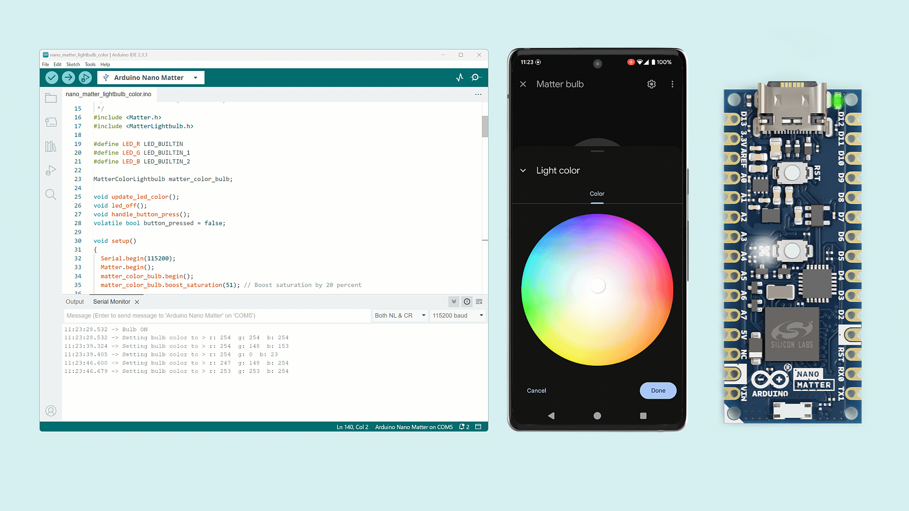

## Hardware and Software Requirements
### Hardware Requirements

- [Nano Matter](https://store.arduino.cc/products/nano-matter) (x1)
- USB-C® cable (x1)

### Software Requirements

- [Arduino IDE 2.0+](https://www.arduino.cc/en/software) or [Arduino Cloud Editor](https://create.arduino.cc/editor)

### Board Core and Libraries

The **Silicon Labs** core contains the libraries and examples you need to work with the board's components, such as its Matter, Bluetooth® Low Energy, and I/Os. To install the Nano Matter core, navigate to **Tools > Board > Boards Manager** or click the Boards Manager icon in the left tab of the IDE. In the Boards Manager tab, search for `Nano Matter` and install the latest `Silicon Labs` core version.


## Product Overview

The Nano Matter merges the well-known Arduino way of making complex technology more accessible with the powerful MGM240S from Silicon Labs, to bring Matter closer to the maker world, in one of the smallest form factors in the market.  

It enables 802.15.4 (Thread®) and Bluetooth® Low Energy connectivity, to interact with Matter-compatible devices with a user-friendly software layer ready for quick prototyping.

### Board Architecture Overview

The Nano Matter features a compact and efficient architecture powered by the MGM240S (32-bit Arm® Cortex®-M33) from Silicon Labs, a high-performance wireless module
optimized for the needs of battery and line-powered IoT devices for 2.4 GHz mesh networks.


Here is an overview of the board's main components, as shown in the image above:

- **Microcontroller**: at the heart of the Nano Matter is the MGM240S, a high-performance wireless module from Silicon Labs. The MGM240S is built around a 32-bit Arm® Cortex®-M33 processor running at 78 MHz.
- **Wireless connectivity**: the Nano Matter microcontroller also features multiprotocol connectivity to enable Matter IoT protocol and Bluetooth® Low Energy. This allows the Nano Matter to be integrated with smart home systems and communicate wirelessly with other devices.

### Pinout

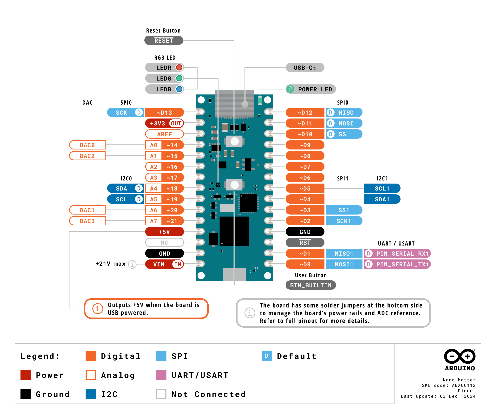

The full pinout is available and downloadable as PDF from the link below:

- [Nano Matter pinout](https://docs.arduino.cc/resources/pinouts/ABX00112-full-pinout.pdf)

### Datasheet

The complete datasheet is available and downloadable as PDF from the link below:

- [Nano Matter datasheet](https://docs.arduino.cc/resources/datasheets/ABX00112-datasheet.pdf)

### Schematics

The complete schematics are available and downloadable as PDF from the link below:

- [Nano Matter schematics](https://docs.arduino.cc/resources/schematics/ABX00112-schematics.pdf)

### STEP Files

The complete STEP files are available and downloadable from the link below:

- [Nano Matter STEP files](../../downloads/ABX00112-step.zip)


### Form Factor

The Nano Matter (ABX00112) board features castellated pins, which are ideal for integrating the board into final solutions.

You can easily solder the Nano Matter (ABX00112) in your custom PCB, since the board does not present any bottom-mounted components.

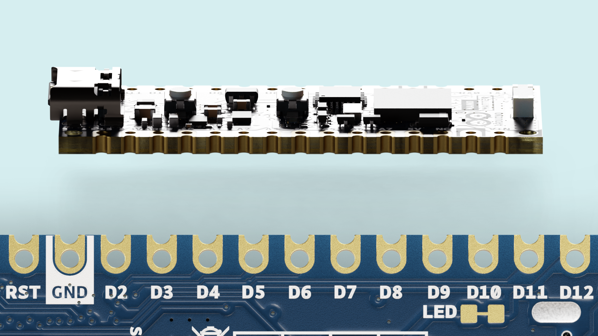

The Nano Matter with headers (ABX00137) out of the box is also available, providing easy access for probing and testing through the headers.

## First Use
### Powering the Board

The Nano Matter can be powered by:

- A USB-C® cable (not included).
- An external **5 V power supply** connected to `5V` pin (please, refer to the [board pinout section](#pinout) of the user manual).
- An external **6-21 V power supply** connected to `VIN` pin (please, refer to the [board pinout section](#pinout) of the user manual).

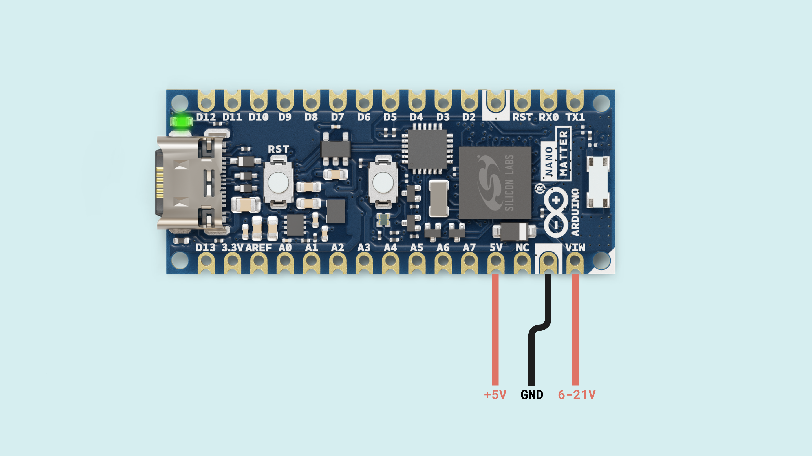

For low-power consumption applications, the following hacks are recommended:

- Cut the power status LED jumper off to save energy.
- Power the board with an external **3.3 V power supply** connected to **3.3V** pin. This will not power the *USB bridge IC*, so more energy will be saved.

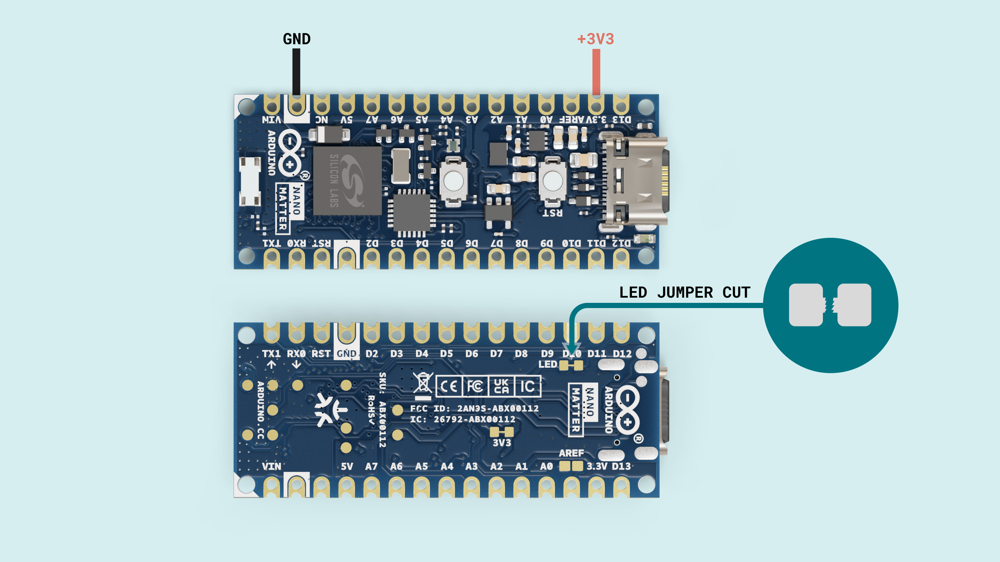

***To power the board through the VIN pin you need to close the jumper pads with solder. The maximum voltage supported is +5 VDC.***

### Install Board Core and Libraries

The **Silicon Labs** core contains the libraries and examples you need to work with the board's components, such as its Matter, Bluetooth® Low Energy, and I/Os. To install the Nano Matter core, navigate to **Tools > Board > Boards Manager** or click the Boards Manager icon in the left tab of the IDE. In the Boards Manager tab, search for `Nano Matter` and install the latest `Silicon Labs` core version.


### Hello World Example

Let's program the Nano Matter with the classic `hello world` example typical of the Arduino ecosystem: the `Blink` sketch. We will use this example to verify that the board is correctly connected to the Arduino IDE and that the Silicon Labs core and the board itself are working as expected. 

Copy and paste the code below into a new sketch in the Arduino IDE.

```arduino
// the setup function runs once when you press reset or power the board
void setup() {
  // initialize digital pin LED_BUILTIN as an output.
  pinMode(LED_BUILTIN, OUTPUT);
}

// the loop function runs over and over again forever
void loop() {
  digitalWrite(LED_BUILTIN, HIGH);  // turn the LED on (HIGH is the voltage level)
  delay(1000);                      // wait for a second
  digitalWrite(LED_BUILTIN, LOW);   // turn the LED off by making the voltage LOW
  delay(1000);                      // wait for a second
}
```

In the Nano Matter, the `LED_BUILTIN` macro represents the **red LED** of the built-in RGB LED of the board. Please refer to the image below.

To upload the code to the Nano Matter, click the **Verify** button to compile the sketch and check for errors; then click the **Upload** button to program the board with the sketch.


You should now see the red LED of the built-in RGB LED turning on for one second, then off for one second, repeatedly.

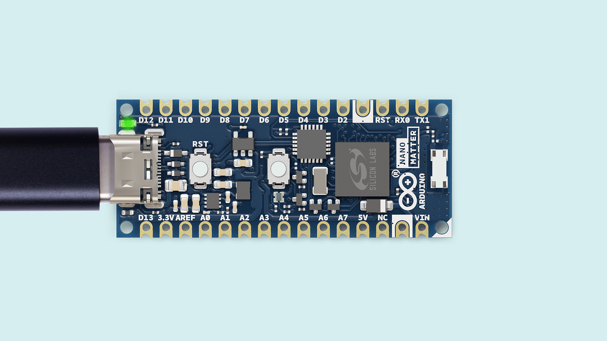

If everything works as expected, you are ready to continue searching and experimenting with this mighty board.

## Matter

Developing Matter-compatible IoT solutions has never been easier with the Arduino ecosystem. 


The Nano Matter can communicate with Matter hubs through a Thread® network, so the hubs used must be **Thread® border routers**.

The Silicon Labs core in the Arduino IDE comes with several Matter examples ready to be tested with the Nano Matter and works as a starting point for almost any IoT device we can imagine building.

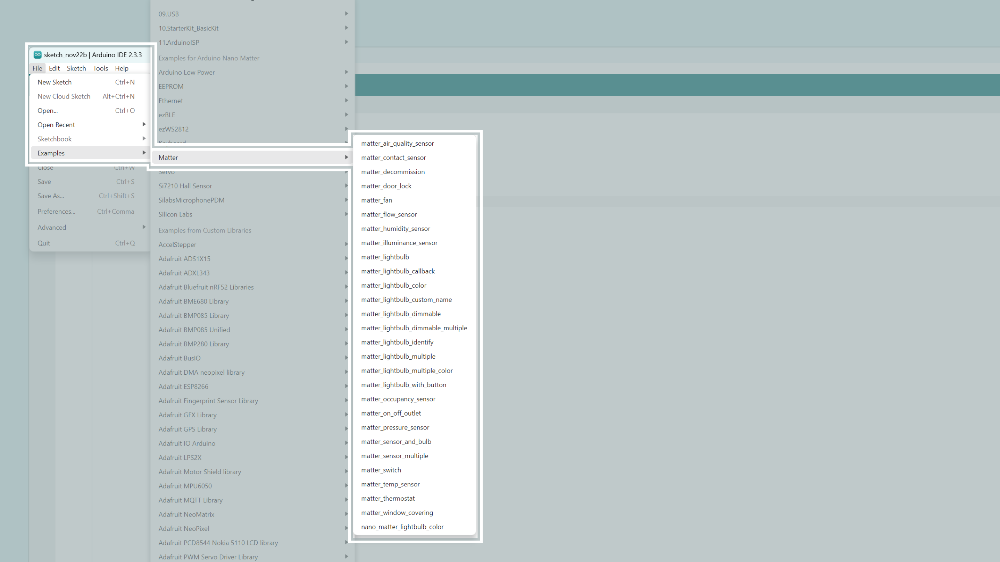

***The _matter_lightbulb_ example is the only officially Matter-certified profile for the Nano Matter. Consequently, while running any of the other available profile examples, it is expected to get an _Uncertified device_ message in the different Matter-compatible apps. This does not prevent the user from prototyping a solution with different configurations.***

First, to start creating *Matter-enabled* solutions, we need to select the Matter protocol in **Tools > Protocol stack > Matter**:

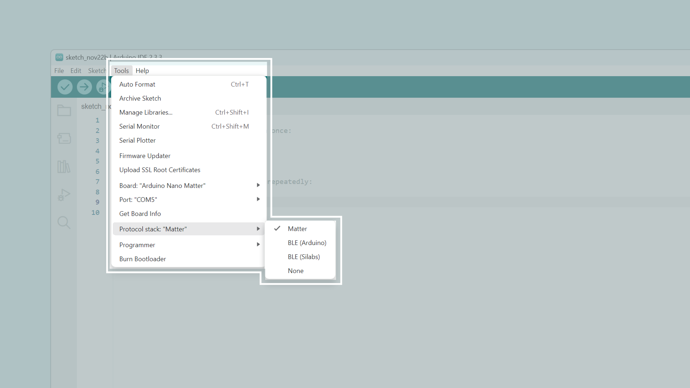

In the example below, we are going to use the Nano Matter as a *RGB Lightbulb*. For this, navigate to **File > Examples > Matter** and open the built-in sketch called **nano_matter_lightbulb_color**.

```arduino
#include <Matter.h>
#include <MatterLightbulb.h>

#define LED_R LED_BUILTIN
#define LED_G LED_BUILTIN_1
#define LED_B LED_BUILTIN_2

MatterColorLightbulb matter_color_bulb;

void update_led_color();
void led_off();
void handle_button_press();
volatile bool button_pressed = false;

void setup()
{
  Serial.begin(115200);
  Matter.begin();
  matter_color_bulb.begin();
  matter_color_bulb.boost_saturation(51); // Boost saturation by 20 percent

  // Set up the onboard button
  pinMode(BTN_BUILTIN, INPUT_PULLUP);
  attachInterrupt(BTN_BUILTIN, &handle_button_press, FALLING);

  // Turn the LED off
  led_off();

  Serial.println("Arduino Nano Matter - color lightbulb");

  if (!Matter.isDeviceCommissioned()) {
    Serial.println("Matter device is not commissioned");
    Serial.println("Commission it to your Matter hub with the manual pairing code or QR code");
    Serial.printf("Manual pairing code: %s\n", Matter.getManualPairingCode().c_str());
    Serial.printf("QR code URL: %s\n", Matter.getOnboardingQRCodeUrl().c_str());
  }
  while (!Matter.isDeviceCommissioned()) {
    delay(200);
  }

  Serial.println("Waiting for Thread network...");
  while (!Matter.isDeviceThreadConnected()) {
    delay(200);
  }
  Serial.println("Connected to Thread network");

  Serial.println("Waiting for Matter device discovery...");
  while (!matter_color_bulb.is_online()) {
    delay(200);
  }
  Serial.println("Matter device is now online");
}

void loop()
{
  // If the physical button state changes - update the lightbulb's on/off state
  if (button_pressed) {
    button_pressed = false;
    // Toggle the on/off state of the lightbulb
    matter_color_bulb.toggle();
  }

  // Get the current on/off state of the lightbulb
  static bool matter_lightbulb_last_state = false;
  bool matter_lightbulb_current_state = matter_color_bulb.get_onoff();

  // If the current state is ON and the previous was OFF - turn on the LED
  if (matter_lightbulb_current_state && !matter_lightbulb_last_state) {
    matter_lightbulb_last_state = matter_lightbulb_current_state;
    Serial.println("Bulb ON");
    // Set the LEDs to the last received state
    update_led_color();
  }

  // If the current state is OFF and the previous was ON - turn off the LED
  if (!matter_lightbulb_current_state && matter_lightbulb_last_state) {
    matter_lightbulb_last_state = matter_lightbulb_current_state;
    Serial.println("Bulb OFF");
    led_off();
  }

  static uint8_t hue_prev = 0;
  static uint8_t saturation_prev = 0;
  static uint8_t brightness_prev = 0;
  uint8_t hue_curr = matter_color_bulb.get_hue();
  uint8_t saturation_curr = matter_color_bulb.get_saturation_percent();
  uint8_t brightness_curr = matter_color_bulb.get_brightness_percent();

  // If either the hue, saturation or the brightness changes - update the LED to reflect the latest change
  if (hue_prev != hue_curr || saturation_prev != saturation_curr || brightness_prev != brightness_curr) {
    update_led_color();
    hue_prev = hue_curr;
    saturation_prev = saturation_curr;
    brightness_prev = brightness_curr;
  }
}

// Updates the color of the RGB LED to match the Matter lightbulb's color
void update_led_color()
{
  if (!matter_color_bulb.get_onoff()) {
    return;
  }
  uint8_t r, g, b;
  matter_color_bulb.get_rgb(&r, &g, &b);
  // If our built-in LED is active LOW, we need to invert the brightness values
  if (LED_BUILTIN_ACTIVE == LOW) {
    analogWrite(LED_R, 255 - r);
    analogWrite(LED_G, 255 - g);
    analogWrite(LED_B, 255 - b);
  } else {
    analogWrite(LED_R, r);
    analogWrite(LED_G, g);
    analogWrite(LED_B, b);
  }
  Serial.printf("Setting bulb color to > r: %u  g: %u  b: %u\n", r, g, b);
}

// Turns the RGB LED off
void led_off()
{
  // If our built-in LED is active LOW, we need to invert the brightness values
  if (LED_BUILTIN_ACTIVE == LOW) {
    analogWrite(LED_R, 255);
    analogWrite(LED_G, 255);
    analogWrite(LED_B, 255);
  } else {
    analogWrite(LED_R, 0);
    analogWrite(LED_G, 0);
    analogWrite(LED_B, 0);
  }
}

void handle_button_press()
{
  static uint32_t btn_last_press = 0;
  if (millis() < btn_last_press + 200) {
    return;
  }
  btn_last_press = millis();
  button_pressed = true;
}
```

Here is the example sketch main functions explanation:

- In the `setup()` function, Matter is initialized with `Matter.begin()` alongside the initial configurations of the board to handle the different inputs and outputs. 

- The device commissioning is verified with `Matter.isDeviceCommissioned()` to show the user the network pairing credentials if needed, and the connection is confirmed with the `Matter.isDeviceThreadConnected()` function. 

- With the `matter_color_bulb.is_online()` function, we confirm that the device is online and reachable by the coordinator app.

- In the `loop()` function, the RGB LED is controlled on and off with `matter_color_bulb.set_onoff(state)`, the current state is retrieved with `matter_color_bulb.get_onoff()` and the button state is read to control the LED manually.

- In the `update_led_color()` function, the color defined in the app is retrieved using the function `matter_color_bulb.get_rgb(&r, &g, &b)` that stores the requested color code in RGB format variables.

To upload the code to the Nano Matter, click the **Verify** button to compile the sketch and check for errors; then click the **Upload** button to program the board with the sketch.

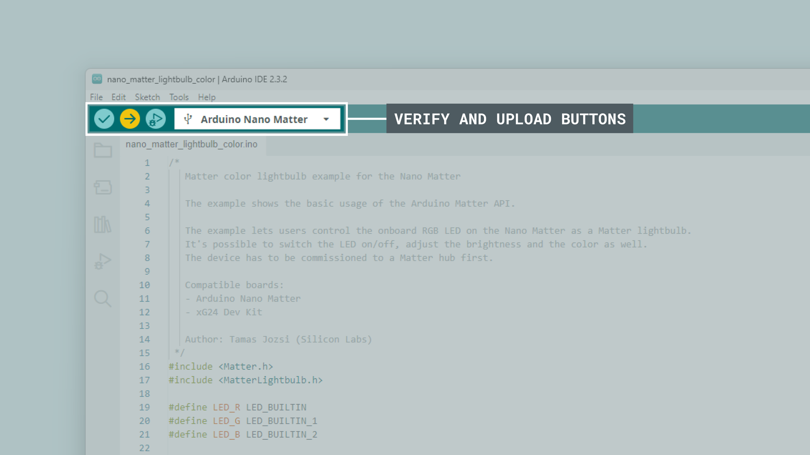

After the code is uploaded, open the Arduino IDE Serial Monitor and reset the board by clicking on the reset button. To commission a Matter device to the network you will need the credentials shown in the terminal.

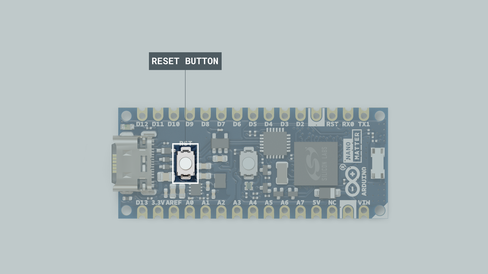

You will find a **Manual pairing code** and a **QR code URL** as follows:

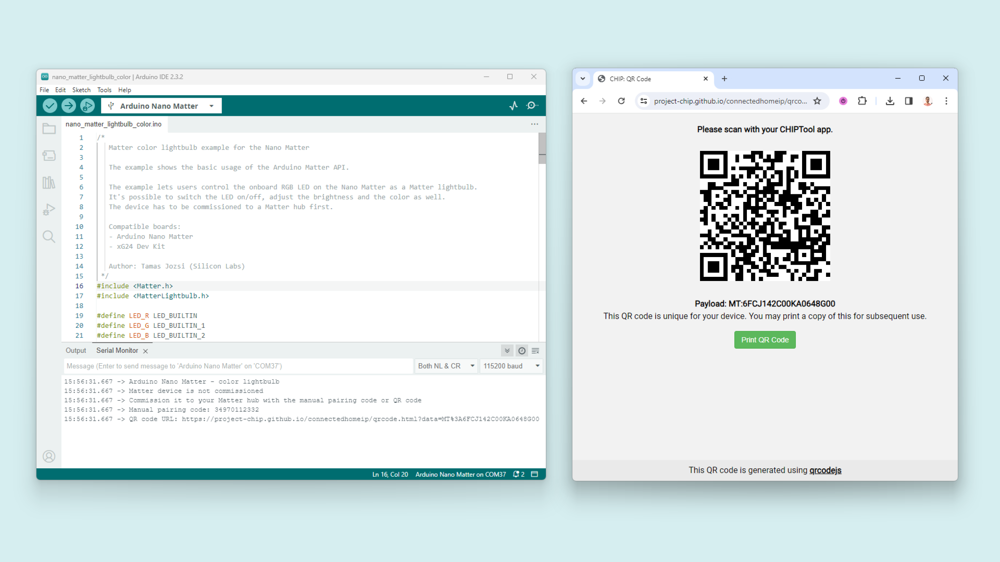

***Open the QR code URL on your browser to generate the QR code.***

### With Google Home™

To create your first IoT device with the Nano Matter and the Google Home ecosystem, you first need to have a Matter-compatible hub. The Google Home products that can work as a **Matter hub** through **Thread®** are listed below:

- Nest Hub (2nd Gen)
- Nest Hub Max
- Nest Wifi Pro (Wi-Fi 6E)
- Nest Wifi

***Other Google devices are compatible with Matter but not Thread®.***

To commission your device, open the Google Home app, navigate to devices, click on **add device** and select the **matter-enabled device** option:

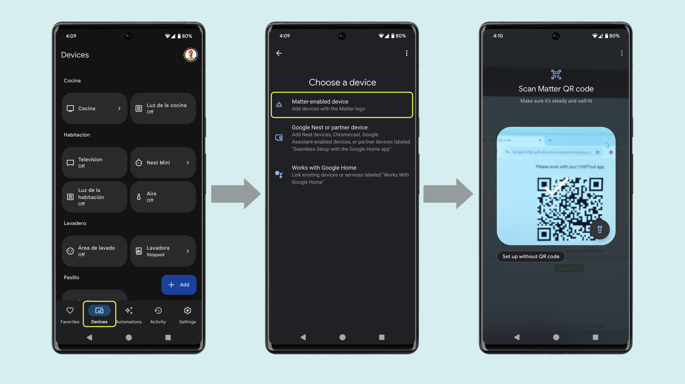

Then, wait for the device to be commissioned and added to the Google Home app:

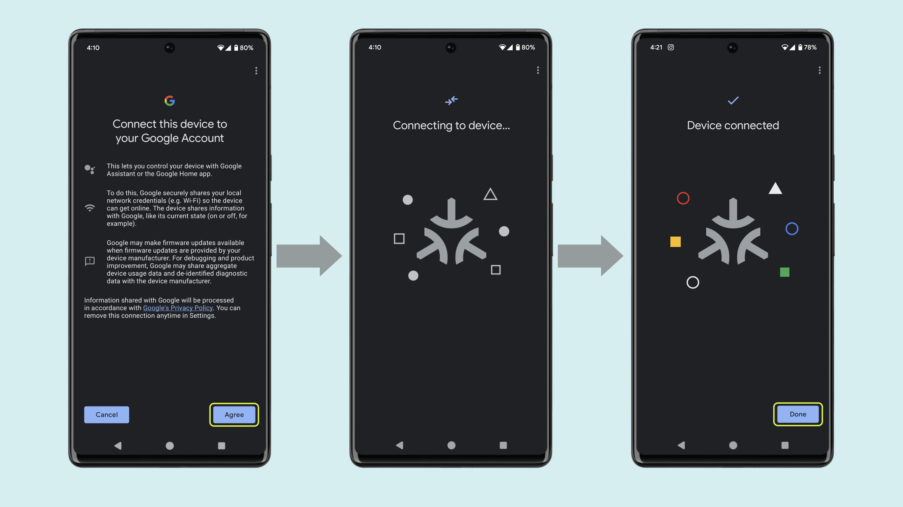

Finally, you will be able to control the Nano Matter built-in RGB LED as a native smart device. You can turn it on and off and control its color and brightness.


You are also able to control your device using voice commands with your personal assistant.

If you want to commission your Nano Matter solution with another service, follow the steps in the [decommissioning](#device-decommissioning) section.

### With Amazon Alexa

The Amazon Alexa products that can work as a **Matter hub** through **Thread®** are listed below:

- Echo (4th Gen)
- Echo Show 10 (3rd Gen)
- Echo Show 8 (3rd Gen)
- Echo Hub
- Echo Studio (2nd Gen)
- Echo Plus (2nd Gen)
- eero Pro 6 and 6E
- eero 6 and 6+
- eero PoE 6 and gateway
- eero Pro
- eero Beacon
- eero Max 7

***Other Amazon devices are compatible with Matter but not Thread®.***

To commission your device, open the Amazon Alexa app, click on the upper right **+** symbol, select **device** and select the **Matter** logo option:

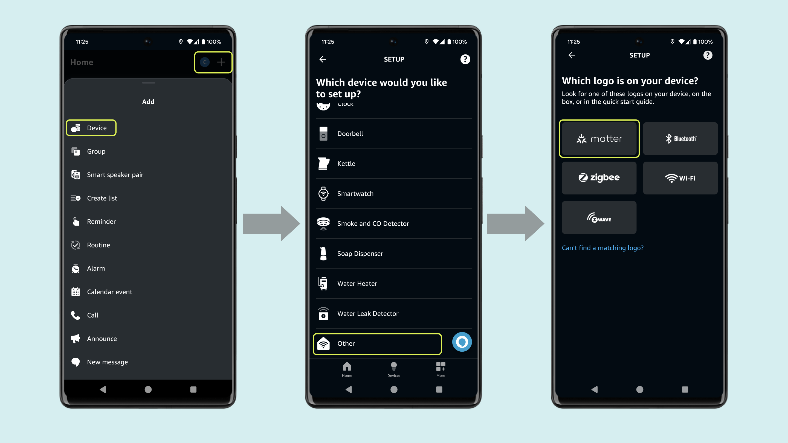

Read the QR code generated by the Nano Matter sketch, select the **Thread®** network available and then wait for the device to be commissioned and added to the Alexa app:


Finally, you will be able to control the Nano Matter built-in RGB LED as a native smart device. You can turn it on and off and control its color and brightness.

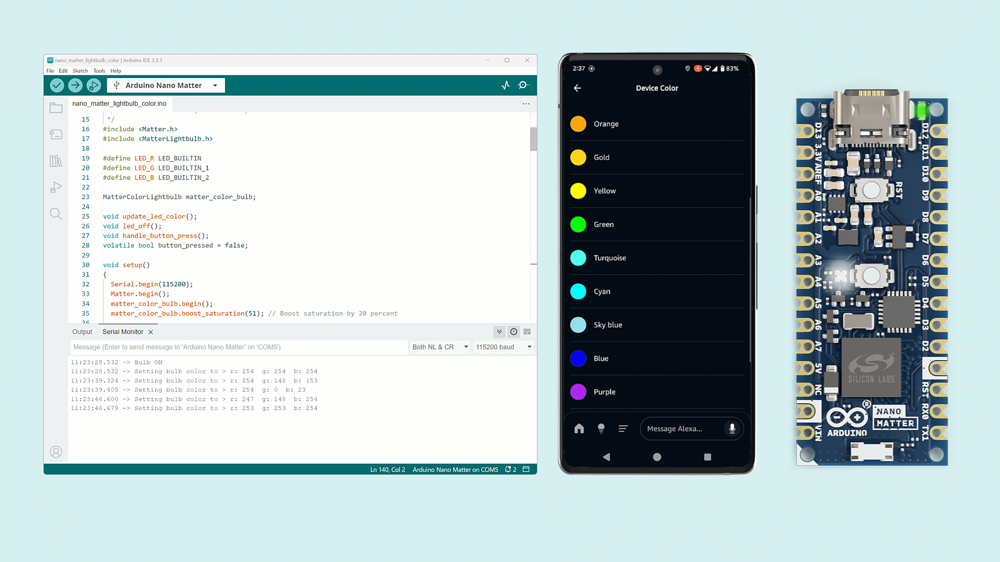

You are also able to control your device using voice commands with your personal assistant.

If you want to commission your Nano Matter solution with another service, follow the steps in the [decommissioning](#device-decommissioning) section.

### With Apple Home

The Apple Home products that can work as a **Matter hub** through **Thread®** are listed below:

- Apple TV 4K (3rd generation) Wi-Fi + Ethernet
- Apple TV 4K (2nd generation)
- HomePod (2nd generation)
- HomePod mini

To commission your device, open the Apple Home app, click on the upper right **+** symbol, select **Add Accessory** and scan the **QR code** generated by the Nano Matter in the Serial Monitor:

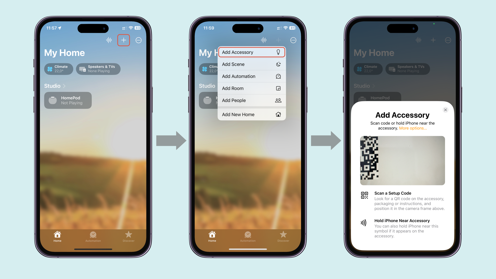

If this is your first Matter device, you may be asked to define the Matter hub to be used. Select its house location and give it a name:

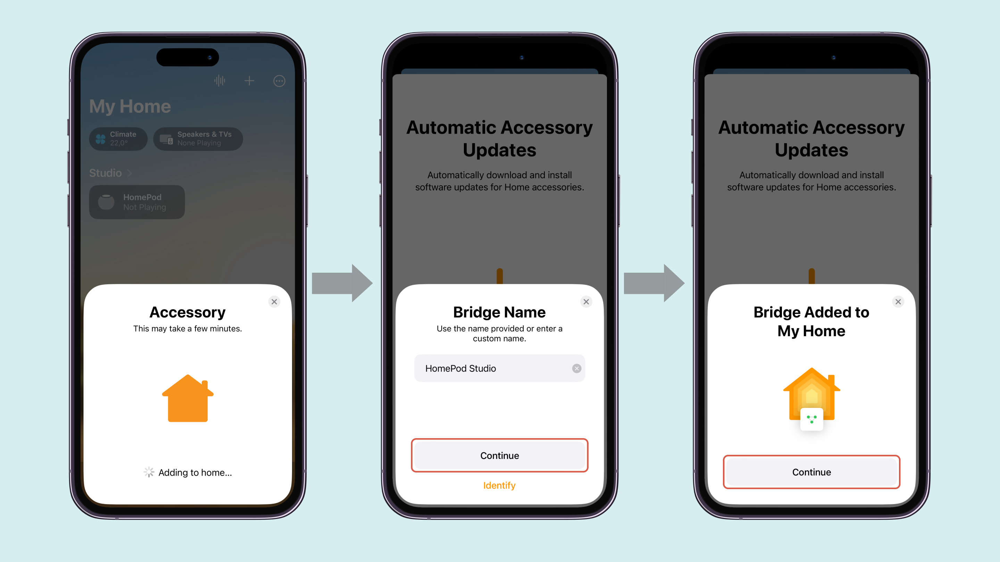

Then, follow the steps for adding and naming the Matter Light bulb:

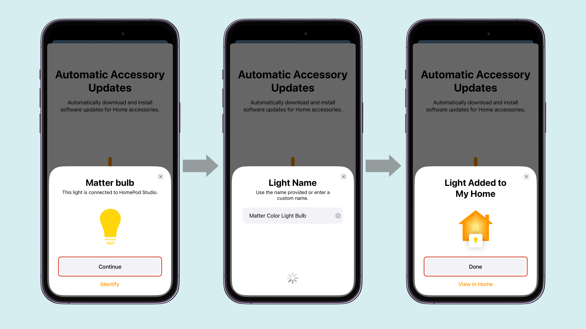

Finally, you will be able to control the Nano Matter built-in RGB LED as a native smart device. You can turn it on and off and control its color and brightness.

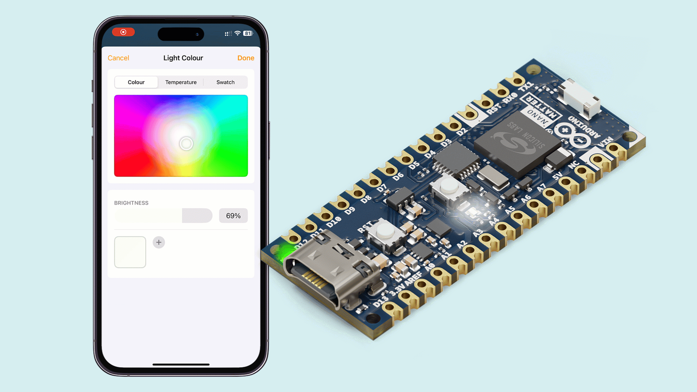

You are also able to control your device using voice commands with your personal assistant.

If you want to commission your Nano Matter solution with another service, follow the steps in the [decommissioning](#device-decommissioning) section.

### With Home Assistant

To use Matter with Home Assistant, you will need one of the *Google Home* or *Apple Home* devices that can work as a **Thread® Border Router**, as listed in the previous sections.

To set up Home Assistant so that it can manage Matter devices, we need first to install the **Matter Server** add-on. For this, navigate to **Settings > Add-Ons > Add-On Store** and search for **Matter server**:

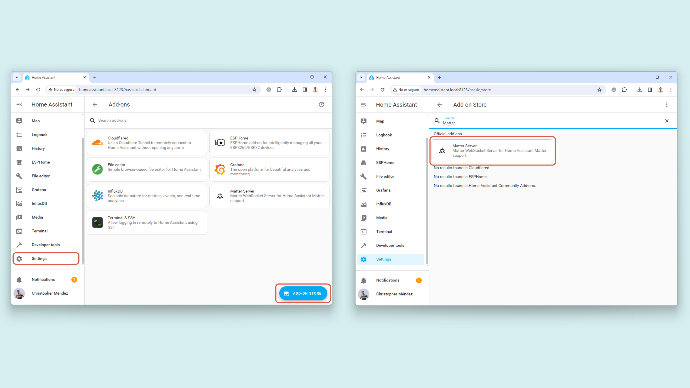

When the Matter server is correctly installed, navigate to **Settings > Devices & Services > Add Integration** and search for **Matter**:

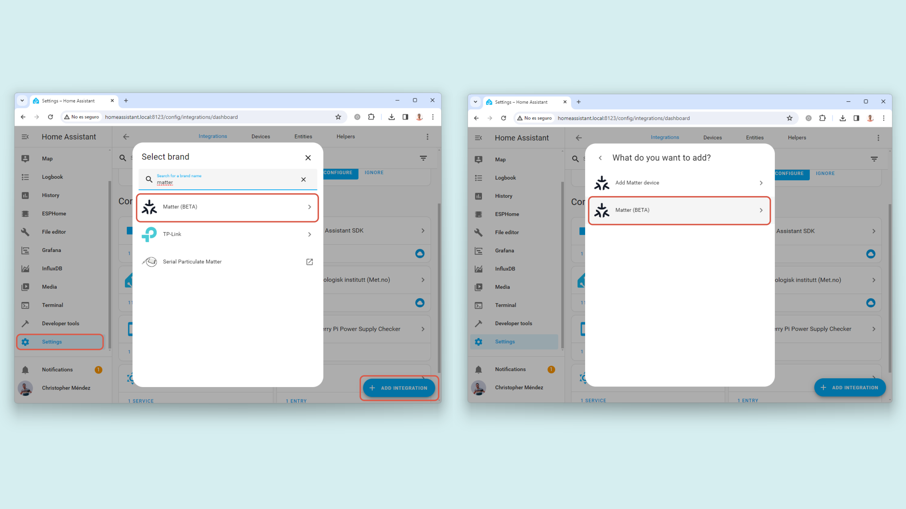

A prompt will show up asking for a connection method; if you are working with custom containers running the Matter server, uncheck the box.

In our case, we leave it checked as the Matter server is running in Home Assistant.

You will receive a **Success** message if everything is okay. With the Home Assistant integration ready, we can start with the Nano Matter commissioning.

To commission your device, open the Home Assistant app on your smartphone, go to **Settings > Devices & Services**, in the lower tabs bar, go to **Devices** and tap on **Add Device**. Tap on **Add Matter device** and scan the QR code generated by the Nano Matter in the Serial Monitor:

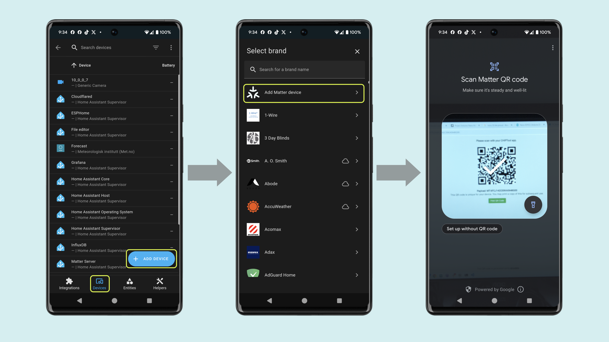

Then, wait for the device to be commissioned and added to the Home Assistant app:

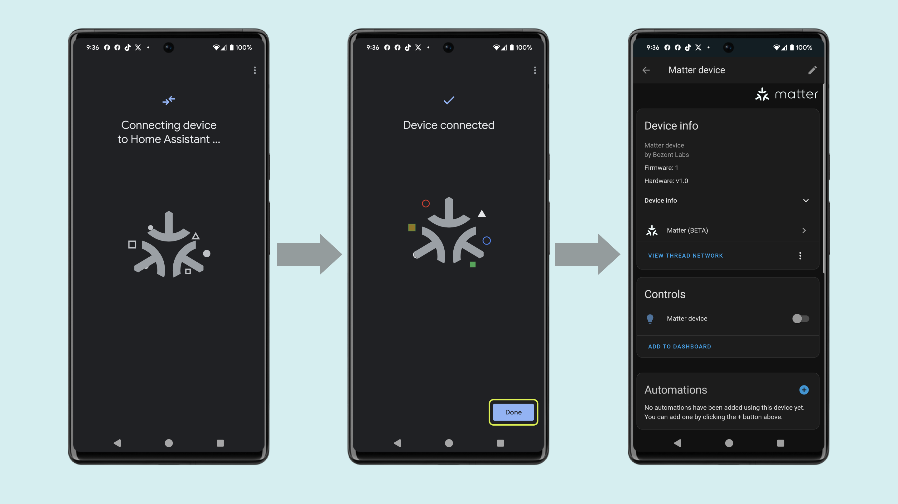

Finally, you will be able to control the Nano Matter built-in RGB LED as a native smart device. You can turn it on and off and control its color and brightness.

You can use the Home Assistant web view or mobile app to control your device.

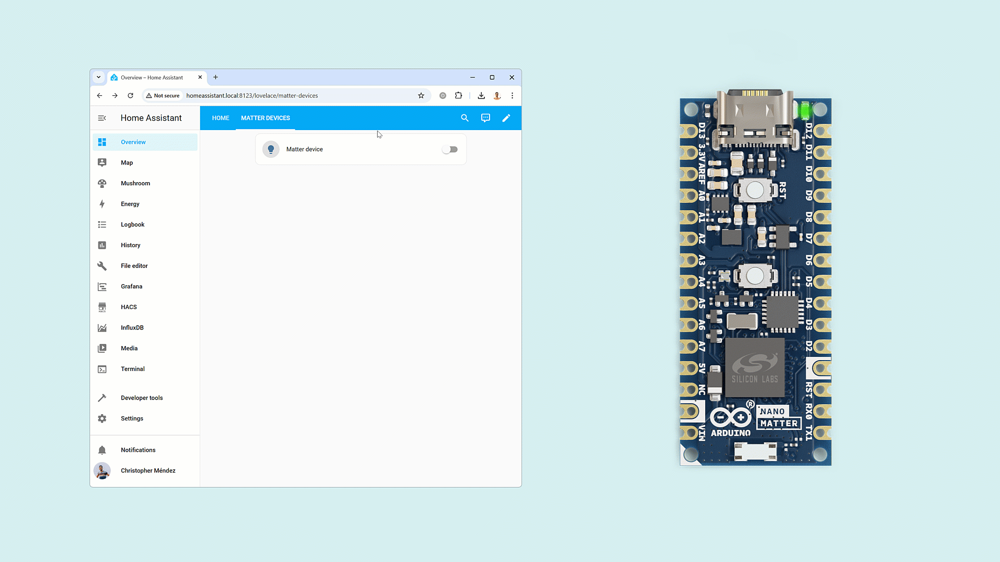

If you want to commission your Nano Matter solution with another service, follow the steps in the [decommissioning](#device-decommissioning) section.

***We tested the Matter integration with the Home Assistant OS and hosting Home Assistant in Docker containers.***

#### Home Assistant Tips

- Make sure you are using a **64-bit** Home Assistant version (OS or Docker containerized version).
- Use the **Thread®** add-on to verify your available Thread® networks.
- You can just have a Matter device commissioned to one platform at a time.

***Be aware that the Matter integration for Home Assistant is still in BETA, it can receive major updates and its functionality may vary between different vendors.***

### Updating the Commissioning QR Code

Each Nano Matter board comes with a default QR code used for commissioning. In this section, you will learn how to **generate a unique QR code** for your device by updating its provisioning ID.

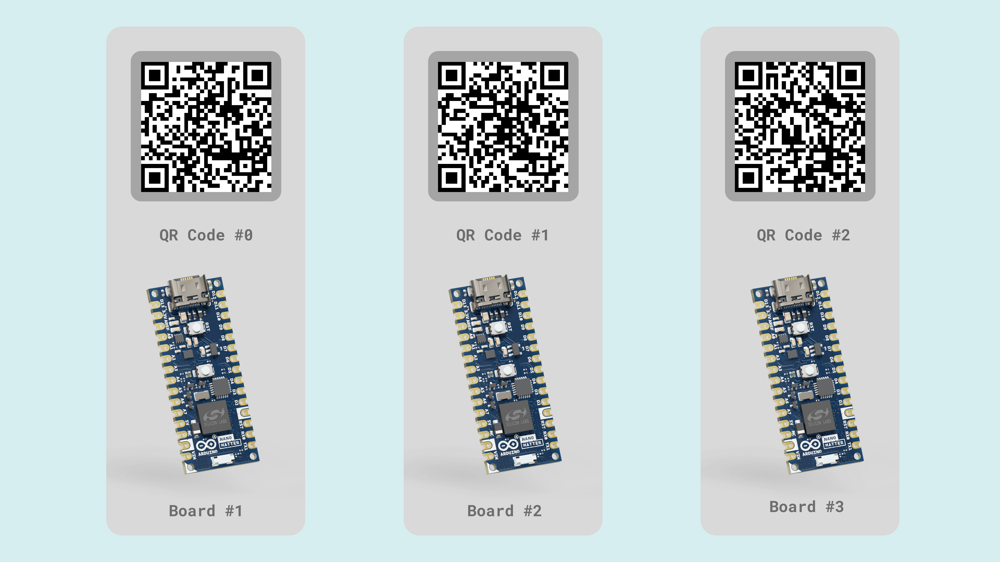

By assigning a unique provisioning ID, you can:

- Generate a distinct QR code for each board.
- Commission multiple Nano Matter boards to the same network without conflicts.
- Prepare your devices for real-world field deployment.

#### Prerequisites 

Before starting, make sure you have the following:

- Make sure the **Arduino IDE** and the **Silicon Labs Arduino Core** are both installed.
- Make sure there is only **one** board connected to your computer at a time.
- Your Matter sketch already flashed to the board.
- Clone the [Arduino Matter Provision Tool](https://github.com/silabs-bozont/arduino_matter_provision) repository on your local machine.

#### Changing the Provisioning ID

To assign a new provisioning ID and generate a new QR code:

- Open a terminal and navigate to the cloned `/arduino_matter_provision` folder.
- The provisioning command has the following format:

  ```bash
  python arduino_matter_provision.py <board_name> <config_number>
  ```

- Replace `<board_name>` with `nano_matter` and choose a configuration number (e.g., `1`):
  ```bash
  python arduino_matter_provision.py nano_matter 1
  ```

- Run the script to change the provisioning data using the given structure.

  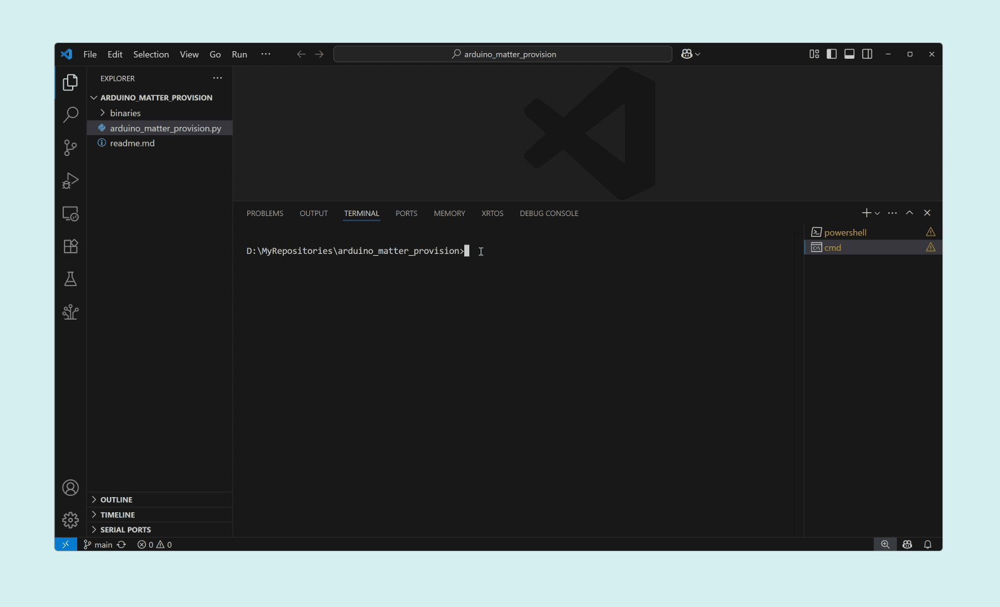

Once the script finishes, open the **Arduino Serial Monitor**. You will see the updated commissioning credentials there, no need to re-upload the sketch. 

Here’s what the new credentials might look like:

- Manual Pairing Code: `00417637863`
- QR code URL: `https://project-chip.github.io/connectedhomeip/qrcode.html?data=MT%3A8YT00-D000CQ-01VB10`

***Make sure all your Nano Matter boards has been configured with a different ID.***

### Device Decommissioning 

If you have a Matter device configured and working with a _specific platform_, for example with the Google Home ecosystem, and you want to integrate it with Alexa or Apple Home instead, you need to decommission it first from the previous service.

In simple terms, **decommissioning** refers to unpairing your device from a current service to be able to pair it with a new one.

***Use the library built-in example found in __File > Examples > Matter > matter_decommission__.***

You can integrate this method in your solutions to leverage the Nano Matter built-in button to handle decommissioning:

```arduino
#include <Matter.h>

void setup() {
  // put your setup code here, to run once:
  Serial.begin(115200);

  Matter.begin();
  pinMode(BTN_BUILTIN, INPUT_PULLUP);
  pinMode(LEDR, OUTPUT);
  digitalWrite(LEDR, HIGH);
}

void loop() {
  // put your main code here, to run repeatedly:
  decommission_handler();
}


void decommission_handler() {
  if (digitalRead(BTN_BUILTIN) == LOW) {  //Push button pressed
    // measures time pressed
    int startTime = millis();
    while (digitalRead(BTN_BUILTIN) == LOW) {

      int elapsedTime = (millis() - startTime) / 1000.0;

      if (elapsedTime > 10) {
        Serial.printf("Decommissioning!\n");
        for (int i = 0; i < 10; i++) {
          digitalWrite(LEDR, !(digitalRead(LEDR)));
          delay(100);
        };

        if (!Matter.isDeviceCommissioned()) {
          Serial.println("Decommission done!");
          digitalWrite(LEDR, LOW);
          Matter.decommission();
        } else {
          Serial.println("Matter device is commissioned-> Starting Decommission process");
          digitalWrite(LED_BUILTIN, LOW);
          Serial.println("Decommission done!");
          Matter.decommission();
        }
        break;
      }
    }
  }
}
```
The sketch above allows you to decommission your board manually after **pressing** the Nano Matter user button for **10 seconds**. You can monitor the status in the Arduino IDE Serial Monitor.

## Arduino Cloud

The Nano Matter has no built-in Wi-Fi® but can be seamlessly integrated with the Arduino Cloud using its [API](https://www.arduino.cc/reference/en/iot/api/) and Matter. 

We are going to use the [Home Assistant Matter integration](#with-home-assistant) to create automations and scripts that help us forward the Nano Matter data to the Arduino Cloud.

In case it is the first time you are using the Arduino Cloud:

- To use the Arduino Cloud, you need an account. If you do not have an account, create one for free [here](https://cloud.arduino.cc/).
- See the [Arduino Cloud plans](https://cloud.arduino.cc/plans/) and choose one that features **API** support.

As a practical example, we are going to use the Nano Matter CPU temperature sensor and send the data to Arduino Cloud for monitoring. We will leverage the variety of widgets to create a professional and nice-looking user interface.

### Nano Matter Programming

The application sketch below is based on the `matter_temp_sensor` example that can be also found in **File > Examples > Matter**. This variation includes the [decommission](#device-decommissioning) feature to show it implemented in a real application.

```arduino
#include <Matter.h>
#include <MatterTemperature.h>

MatterTemperature matter_temp_sensor;

void setup()
{
  Serial.begin(115200);
  Matter.begin();

  pinMode(BTN_BUILTIN, INPUT_PULLUP);
  pinMode(LEDR, OUTPUT);
  digitalWrite(LEDR, HIGH);

  matter_temp_sensor.begin();

  Serial.println("Matter temperature sensor");

  if (!Matter.isDeviceCommissioned()) {
    Serial.println("Matter device is not commissioned");
    Serial.println("Commission it to your Matter hub with the manual pairing code or QR code");
    Serial.printf("Manual pairing code: %s\n", Matter.getManualPairingCode().c_str());
    Serial.printf("QR code URL: %s\n", Matter.getOnboardingQRCodeUrl().c_str());
  }
  while (!Matter.isDeviceCommissioned()) {
    delay(200);
    decommission_handler();  // if the user button is pressed for 10 seconds
  }

  Serial.println("Waiting for Thread network...");
  while (!Matter.isDeviceThreadConnected()) {
    delay(200);
    decommission_handler();
  }
  Serial.println("Connected to Thread network");

  Serial.println("Waiting for Matter device discovery...");
  while (!matter_temp_sensor.is_online()) {
    delay(200);
    decommission_handler();
  }
  Serial.println("Matter device is now online");
}

void loop()
{
  decommission_handler();  // if the user button is pressed for 10 seconds

  float current_cpu_temp = getCPUTemp();
  matter_temp_sensor.set_measured_value_celsius(current_cpu_temp);
  Serial.printf("Current CPU temperature: %.02f C\n", current_cpu_temp);
  delay(2000);
}

void decommission_handler() {
  if (digitalRead(BTN_BUILTIN) == LOW) {  //Push button pressed
    // measures time pressed
    int startTime = millis();
    while (digitalRead(BTN_BUILTIN) == LOW) {
      //delay(50);

      int elapsedTime = (millis() - startTime) / 1000.0;

      if (elapsedTime > 10) {
        Serial.printf("Decommissioning!\n");
        for (int i = 0; i < 10; i++) {
          digitalWrite(LEDR, !(digitalRead(LEDR)));
          delay(100);
        };

        if (!Matter.isDeviceCommissioned()) {
          Serial.println("Decommission done!");
          digitalWrite(LEDR, LOW);
        } else {
          Serial.println("Matter device is commissioned-> Starting Decommission process");
          nvm3_eraseAll(nvm3_defaultHandle);  // Decomission command
          digitalWrite(LED_BUILTIN, LOW);
          Serial.println("Decommission done!");
        }
        break;
      }
    }
  }
}
```
The main code functions are explained below:

- The temperature sensor object is created with the `MatterTemperature matter_temp_sensor;` statement. To initiate it, in the `setup()` function, we used `matter_temp_sensor.begin();`
- The `decommission_handler()` lets us unpair the device from a previous platform.
- The microcontroller's internal temperature is measured with the function `getCPUTemp();`.
- The temperature value is advertised using the `matter_temp_sensor.set_measured_value_celsius(current_cpu_temp);` function.

After uploading the code to the Nano Matter, verify it is decommissioned from any other service previously used. For this, open the Serial Monitor and reset the board by clicking on the reset button.

If it is not decommissioned you will see temperature readings printed in the Serial Monitor. To decommission it, follow these steps:

- Press the user button for **10 seconds** until the board's built-in LED starts **blinking in red**. You will also see a message confirming the process in the Serial Monitor.

- Finally, reset the board by clicking on the reset button and you should see the Matter commissioning credentials in the Serial Monitor.

### Device Commissioning

Now it is time to commission the Nano Matter with Home Assistant, for this, follow the steps explained in this [section](#with-home-assistant).

Once you have everything set up and running you will be able to monitor the Nano Matter temperature in Home Assistant:

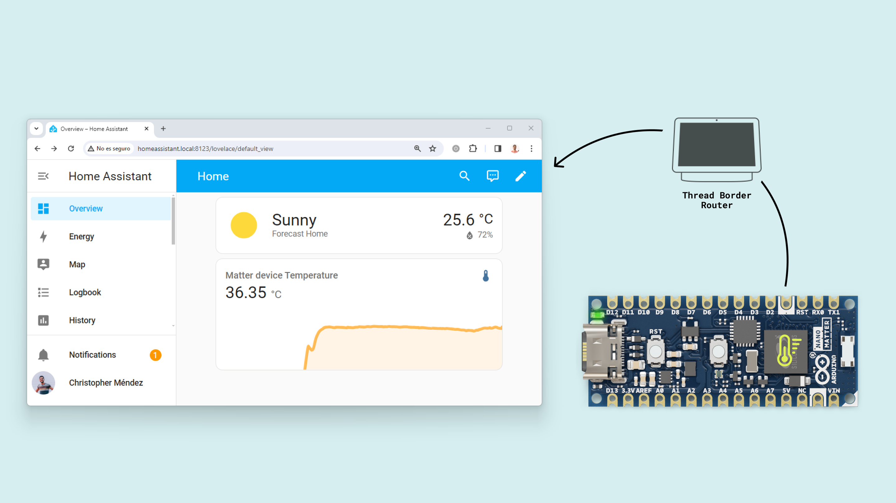

***Be aware that the Matter integration for Home Assistant is still in BETA, it can receive major updates and its functionality may vary between different vendors.***

### Arduino Cloud Set-Up

Let's walk through a step-by-step demonstration of how to set up the Arduino Cloud.

Log in to your Arduino Cloud account; you should see the following:

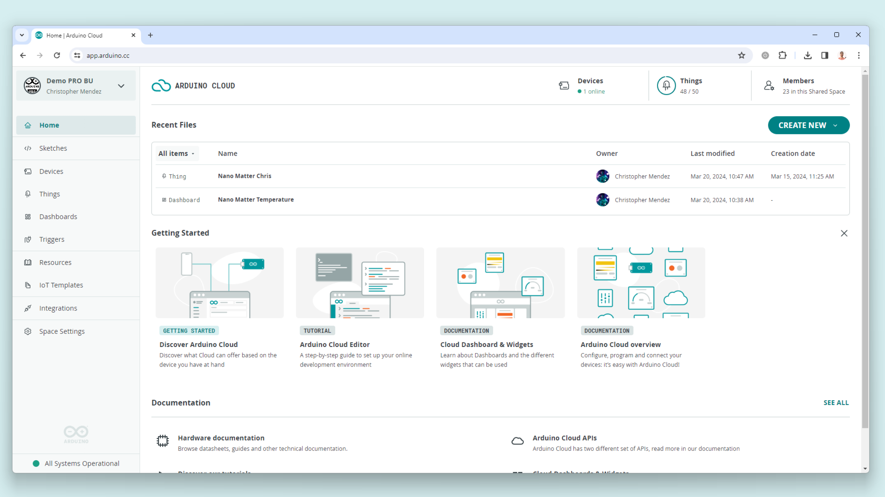

Navigate to **Things** in the left bar menu and click on **+ Thing** to add a Thing:

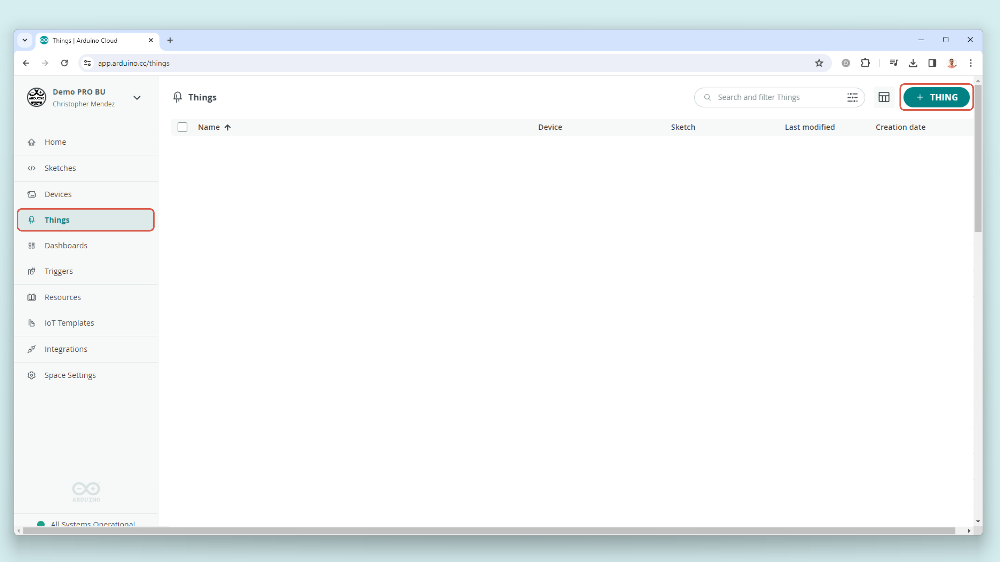

Give your Thing a name and click on **ADD** to add the temperature variable:

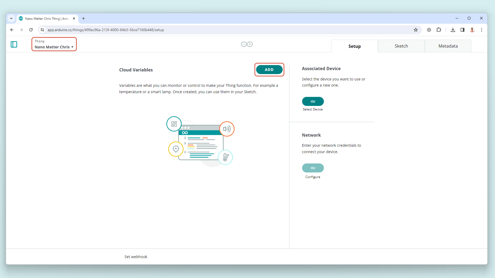

Define the variable with the following settings:

- Name: temperature
- Type: Floating Point Number
- Permission: Read & Write
- Update Policy: On change

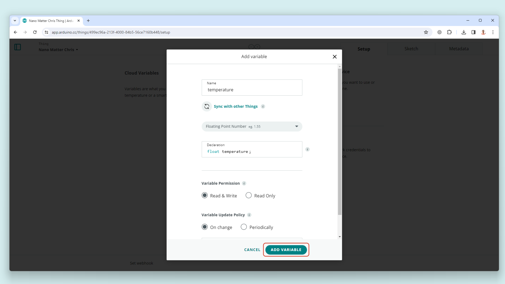

Click on the created variable and copy its **ID**, we will need it later.

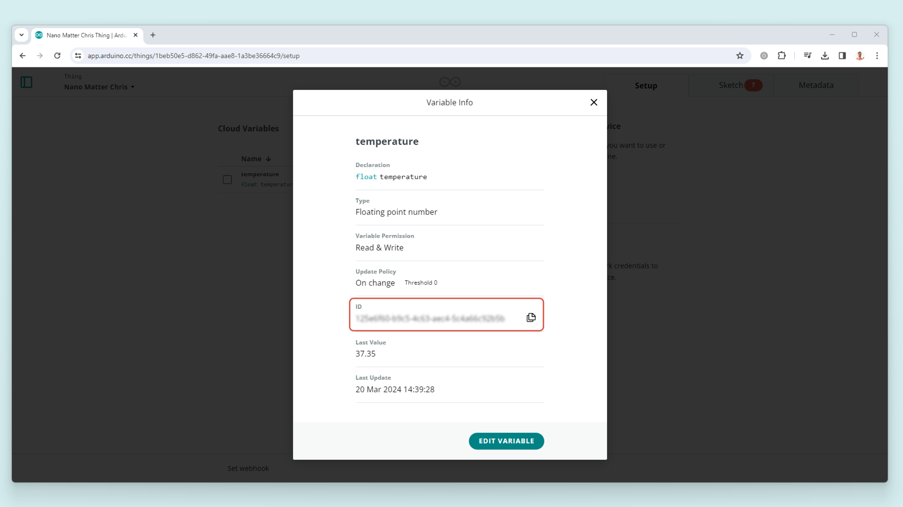

Navigate to your Thing metadata and copy the **Thing ID**, we will need it later.

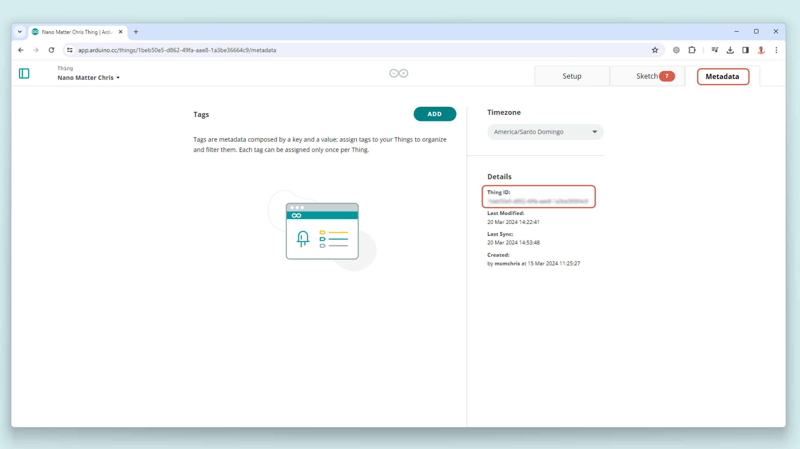

In the left bar menu, navigate to **Space Settings** and copy the **Space ID**, we will need it later.

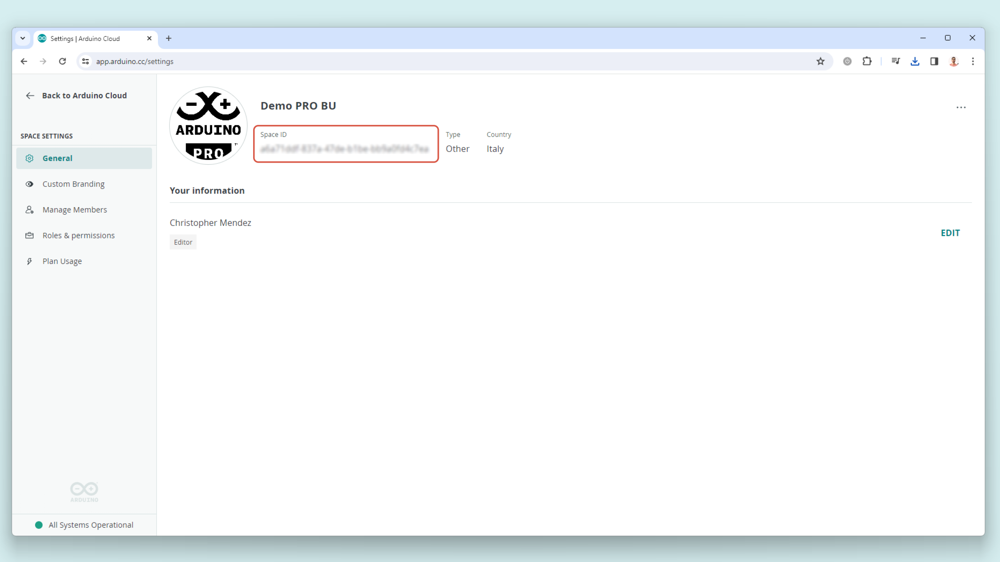

***If you can't see the _Space Settings_ section is because you are using an Arduino Cloud free plan, check the [plans](https://cloud.arduino.cc/plans) with the API feature enabled.***

At this point you should have three IDs related to your project:

- Variable ID
- Thing ID
- Space ID

To properly authenticate the requests we are going to use to upload the data to the Arduino Cloud we need to create **API Keys**.
 
For this, navigate to **API Keys** in the upper left corner drop-down menu and click on **Create API Key**:

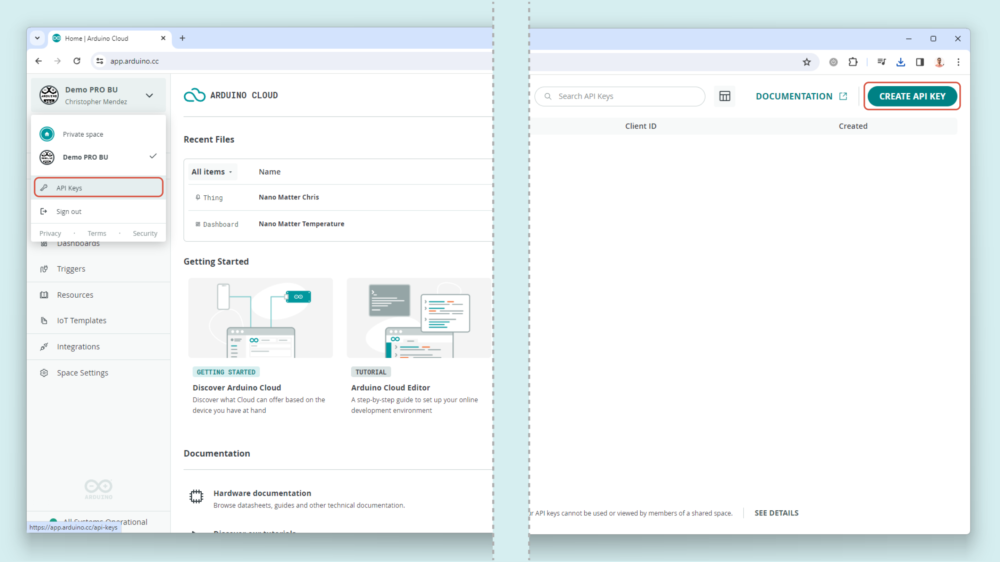

You should get a **Client ID** and a **Client Secret**. Save these credentials in a safe place, you will not be able to see them again.

### Home Assistant Set-Up

Now, let's configure Home Assistant to set the forwarding method to Arduino Cloud.

First, we are going to save and define our project IDs, credentials and Keys in a safe place inside the Home Assistant directory called **secrets.yaml**. Use the _File Editor_ Add-on to easily edit this file, and format the data as follows:

```
arduino_organization: <Space ID>

token_get_payload: '{"grant_type":"client_credentials","client_id":"<your client ID>","client_secret":"<your client secret>","audience":"https://api2.arduino.cc/iot"}'

arduino_temp_url: https://api2.arduino.cc/iot/v2/things/<your Thing ID>/properties/<temperature variable ID>/publish
```
This will let us use this data without exposing it later.

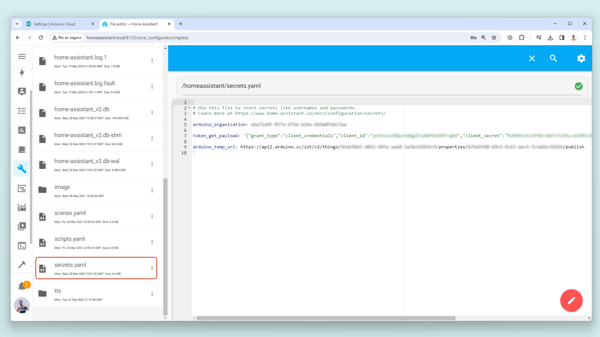

Now, let's define the services that will help us do the HTTP requests to Arduino Cloud sending the temperature value to it. Using the **File Editor** navigate to the **configuration.yaml** file and add the following blocks:

```
rest:
  - resource: "https://api2.arduino.cc/iot/v1/clients/token"
    scan_interval: 240 #4 min
    timeout: 60
    method: "POST"
    headers:
      content_type:  'application/json,application/x-www-form-urlencoded'
    payload: !secret token_get_payload
    sensor:  
      - name: "API_Token_Bearer"
        value_template: "OK"
        json_attributes_path: '$..'
        json_attributes:
          - 'access_token' 
```
The [RESTful integration](https://www.home-assistant.io/integrations/rest/) lets us periodically gather from our Arduino Cloud account a **token** that is mandatory to authenticate our requests. This token expires every 5 minutes, this is why we generate it every 4 minutes. The token is stored in a sensor attribute called **API_Token_Bearer**. 

```
rest_command:      
    send_temperature:
      method: PUT
      headers:
        Authorization: "Bearer {{ state_attr('sensor.api_token_bearer', 'access_token') }}"
        accept: "application/vnd.arduino.property+json,application/vnd.goa.error+json"
        content_type:  'application/json,application/x-www-form-urlencoded'
        X-Organization: !secret arduino_organization
      url: !secret arduino_temp_url
      payload: "{\"value\":{{states('sensor.matter_device_temperature')}}}"
```
The [RESTful command integration](https://www.home-assistant.io/integrations/rest_command/) lets us define the HTTP request structure to be able to send the Nano Matter temperature sensor data to the Arduino Cloud. We can call this service from an automation.

As you may noticed, the sensitive data we stored in the "secrets.yaml" file is being called here with the `!secret` prefix.

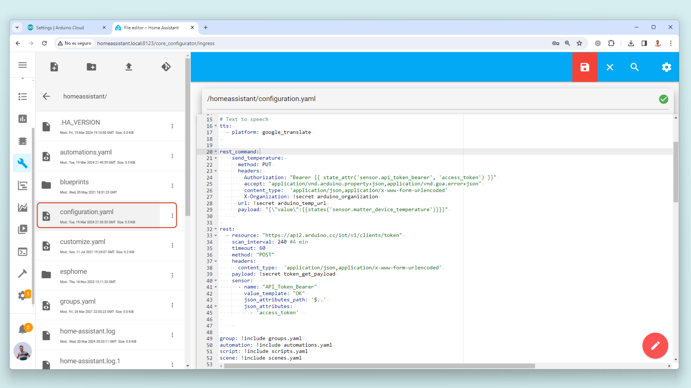

To learn more about the Arduino Cloud API, follow this [guide](https://docs.arduino.cc/arduino-cloud/api/arduino-iot-api/).

For the changes to take effect, navigate to **Developers Tools** and click on **Check Configuration**, if there are no errors, click on **Restart** and restart Home Assistant.

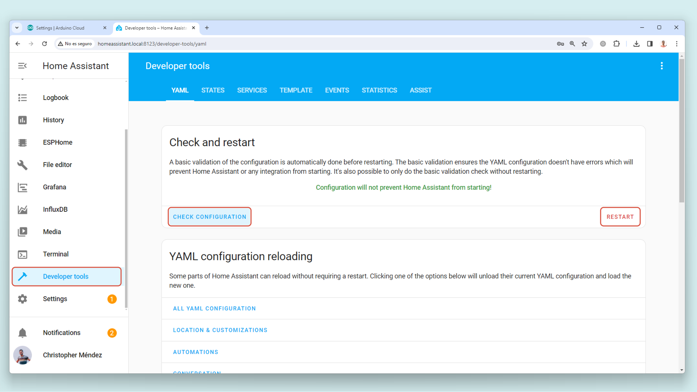

Finally, let's set up the automation that will call the **send_temperature** service every time the temperature sensor values change.

For this, navigate to **Settings > Automations & scenes** and click on **Create Automation**.

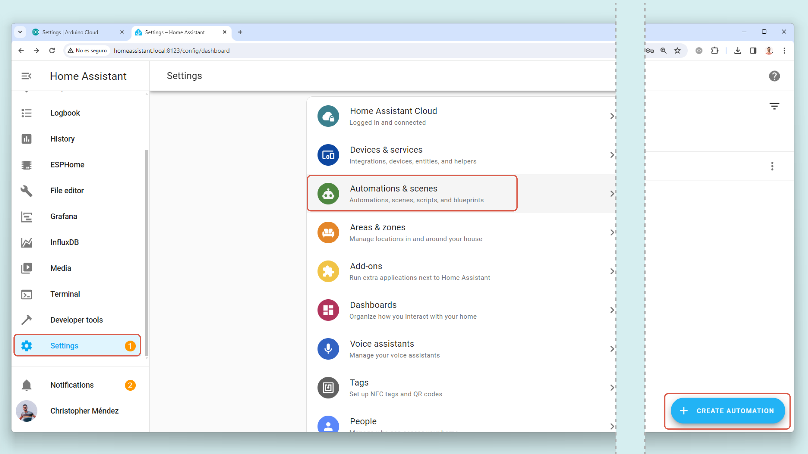

In the upper right corner, click on the "three dots" menu and select **Edit in YAML**, replace the text there with the following:

```
alias: Nano Matter Temperature
description: ""
trigger:
  - platform: state
    entity_id:
      - sensor.matter_device_temperature
condition: []
action:
  - service: rest_command.send_temperature
    data: {}
mode: single
```

This automation will be triggered if the Nano Matter sensor temperature value changes and will act by calling the **rest_command.send_temperature** service.

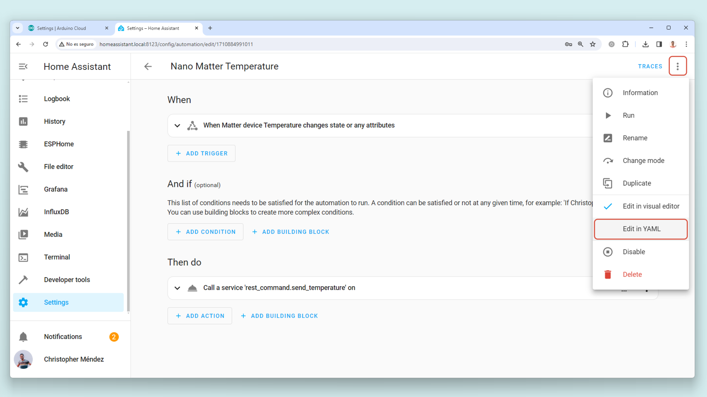

***If you use different names for the services or devices, make sure to update them in the YAML code above.***

### Final Results

With this done, Home Assistant should be forwarding the Nano Matter sensor data to Arduino Cloud where you can monitor it with different widgets and charts as follows:

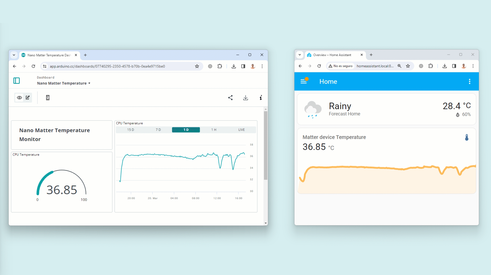

## Bluetooth® Low Energy

### Silicon Labs BLE Library

To enable Bluetooth® Low Energy communication on the Nano Matter, you must enable the "BLE" protocol stack in the Arduino IDE board configurations. In this section we will use the official Silabs Bluetooth library.

In the upper menu, navigate to **Tools > Protocol stack** and select **BLE(Silabs)**.

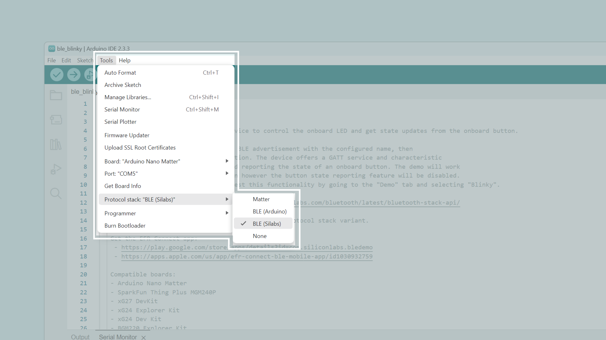

For this Bluetooth® Low Energy application example, we are going to control the Nano Matter built-in LED and read the onboard button status. The example sketch to be used can be found in **File > Examples > Silicon Labs > ble_blinky**:

```arduino
/*
   BLE blinky example
 */

bool btn_notification_enabled = false;
volatile bool btn_state_changed = false;
volatile uint8_t btn_state = LOW;
static void btn_state_change_callback();
static void send_button_state_notification();
static void set_led_on(bool state);

void setup()
{
  pinMode(LED_BUILTIN, OUTPUT);
  digitalWrite(LED_BUILTIN, LED_BUILTIN_INACTIVE);
  set_led_on(false);
  Serial.begin(115200);
  Serial.println("Silicon Labs BLE blinky example");

  // If the board has a built-in button configure it for usage
  #ifdef BTN_BUILTIN
  pinMode(BTN_BUILTIN, INPUT_PULLUP);
  attachInterrupt(BTN_BUILTIN, btn_state_change_callback, CHANGE);
  #else // BTN_BUILTIN
  // Avoid warning for unused function on boards without a button
  (void)btn_state_change_callback;
  #endif // BTN_BUILTIN
}

void loop()
{
  if (btn_state_changed) {
    btn_state_changed = false;
    send_button_state_notification();
  }
}

static void ble_initialize_gatt_db();
static void ble_start_advertising();

static const uint8_t advertised_name[] = "Blinky Example";
static uint16_t gattdb_session_id;
static uint16_t generic_access_service_handle;
static uint16_t name_characteristic_handle;
static uint16_t blinky_service_handle;
static uint16_t led_control_characteristic_handle;
static uint16_t btn_report_characteristic_handle;

/**************************************************************************//**
 * Bluetooth stack event handler
 * Called when an event happens on BLE the stack
 *
 * @param[in] evt Event coming from the Bluetooth stack
 *****************************************************************************/
void sl_bt_on_event(sl_bt_msg_t *evt)
{
  switch (SL_BT_MSG_ID(evt->header)) {
    // -------------------------------
    // This event indicates the device has started and the radio is ready.
    // Do not call any stack command before receiving this boot event!
    case sl_bt_evt_system_boot_id:
    {
      Serial.println("BLE stack booted");

      // Initialize the application specific GATT table
      ble_initialize_gatt_db();

      // Start advertising
      ble_start_advertising();
      Serial.println("BLE advertisement started");
    }
    break;

    // -------------------------------
    // This event indicates that a new connection was opened
    case sl_bt_evt_connection_opened_id:
      Serial.println("BLE connection opened");
      break;

    // -------------------------------
    // This event indicates that a connection was closed
    case sl_bt_evt_connection_closed_id:
      Serial.println("BLE connection closed");
      // Restart the advertisement
      ble_start_advertising();
      Serial.println("BLE advertisement restarted");
      break;

    // -------------------------------
    // This event indicates that the value of an attribute in the local GATT
    // database was changed by a remote GATT client
    case sl_bt_evt_gatt_server_attribute_value_id:
      // Check if the changed characteristic is the LED control
      if (led_control_characteristic_handle == evt->data.evt_gatt_server_attribute_value.attribute) {
        Serial.println("LED control characteristic data received");
        // Check the length of the received data
        if (evt->data.evt_gatt_server_attribute_value.value.len == 0) {
          break;
        }
        // Get the received byte
        uint8_t received_data = evt->data.evt_gatt_server_attribute_value.value.data[0];
        // Turn the LED on/off according to the received data
        if (received_data == 0x00) {
          set_led_on(false);
          Serial.println("LED off");
        } else if (received_data == 0x01) {
          set_led_on(true);
          Serial.println("LED on");
        }
      }
      break;

    // -------------------------------
    // This event is received when a GATT characteristic status changes
    case sl_bt_evt_gatt_server_characteristic_status_id:
      // If the 'Button report' characteristic has been changed
      if (evt->data.evt_gatt_server_characteristic_status.characteristic == btn_report_characteristic_handle) {
        // The client just enabled the notification - send notification of the current button state
        if (evt->data.evt_gatt_server_characteristic_status.client_config_flags & sl_bt_gatt_notification) {
          Serial.println("Button state change notification enabled");
          btn_notification_enabled = true;
          btn_state_change_callback();
        } else {
          Serial.println("Button state change notification disabled");
          btn_notification_enabled = false;
        }
      }
      break;

    // -------------------------------
    // Default event handler
    default:
      break;
  }
}

/**************************************************************************//**
 * Called on button state change - stores the current button state and
 * sets a flag that a button state change occurred.
 * If the board doesn't have a button the function does nothing.
 *****************************************************************************/
static void btn_state_change_callback()
{
  // If the board has a built-in button
  #ifdef BTN_BUILTIN
  // The real button state is inverted - most boards have an active low button configuration
  btn_state = !digitalRead(BTN_BUILTIN);
  btn_state_changed = true;
  #endif // BTN_BUILTIN
}

/**************************************************************************//**
 * Sends a BLE notification the the client if notifications are enabled and
 * the board has a built-in button.
 *****************************************************************************/
static void send_button_state_notification()
{
  if (!btn_notification_enabled) {
    return;
  }
  sl_status_t sc = sl_bt_gatt_server_notify_all(btn_report_characteristic_handle,
                                                sizeof(btn_state),
                                                (const uint8_t*)&btn_state);
  if (sc == SL_STATUS_OK) {
    Serial.print("Notification sent, button state: ");
    Serial.println(btn_state);
  }
}

/**************************************************************************//**
 * Sets the built-in LED to the desired state accounting for the inverted LED
 * logic on select boards.
 *****************************************************************************/
static void set_led_on(bool state)
{
  if (state) {
    digitalWrite(LED_BUILTIN, LED_BUILTIN_ACTIVE);
  } else {
    digitalWrite(LED_BUILTIN, LED_BUILTIN_INACTIVE);
  }
}

/**************************************************************************//**
 * Starts BLE advertisement
 * Initializes advertising if it's called for the first time
 *****************************************************************************/
static void ble_start_advertising()
{
  static uint8_t advertising_set_handle = 0xff;
  static bool init = true;
  sl_status_t sc;

  if (init) {
    // Create an advertising set
    sc = sl_bt_advertiser_create_set(&advertising_set_handle);
    app_assert_status(sc);

    // Set advertising interval to 100ms
    sc = sl_bt_advertiser_set_timing(
      advertising_set_handle,
      160,   // minimum advertisement interval (milliseconds * 1.6)
      160,   // maximum advertisement interval (milliseconds * 1.6)
      0,     // advertisement duration
      0);    // maximum number of advertisement events
    app_assert_status(sc);

    init = false;
  }

  // Generate data for advertising
  sc = sl_bt_legacy_advertiser_generate_data(advertising_set_handle, sl_bt_advertiser_general_discoverable);
  app_assert_status(sc);

  // Start advertising and enable connections
  sc = sl_bt_legacy_advertiser_start(advertising_set_handle, sl_bt_advertiser_connectable_scannable);
  app_assert_status(sc);
}

/**************************************************************************//**
 * Initializes the GATT database
 * Creates a new GATT session and adds certain services and characteristics
 *****************************************************************************/
static void ble_initialize_gatt_db()
{
  sl_status_t sc;
  // Create a new GATT database
  sc = sl_bt_gattdb_new_session(&gattdb_session_id);
  app_assert_status(sc);

  // Add the Generic Access service to the GATT DB
  const uint8_t generic_access_service_uuid[] = { 0x00, 0x18 };
  sc = sl_bt_gattdb_add_service(gattdb_session_id,
                                sl_bt_gattdb_primary_service,
                                SL_BT_GATTDB_ADVERTISED_SERVICE,
                                sizeof(generic_access_service_uuid),
                                generic_access_service_uuid,
                                &generic_access_service_handle);
  app_assert_status(sc);

  // Add the Device Name characteristic to the Generic Access service
  // The value of the Device Name characteristic will be advertised
  const sl_bt_uuid_16_t device_name_characteristic_uuid = { .data = { 0x00, 0x2A } };
  sc = sl_bt_gattdb_add_uuid16_characteristic(gattdb_session_id,
                                              generic_access_service_handle,
                                              SL_BT_GATTDB_CHARACTERISTIC_READ,
                                              0x00,
                                              0x00,
                                              device_name_characteristic_uuid,
                                              sl_bt_gattdb_fixed_length_value,
                                              sizeof(advertised_name) - 1,
                                              sizeof(advertised_name) - 1,
                                              advertised_name,
                                              &name_characteristic_handle);
  app_assert_status(sc);

  // Start the Generic Access service
  sc = sl_bt_gattdb_start_service(gattdb_session_id, generic_access_service_handle);
  app_assert_status(sc);

  // Add the Blinky service to the GATT DB
  // UUID: de8a5aac-a99b-c315-0c80-60d4cbb51224
  const uuid_128 blinky_service_uuid = {
    .data = { 0x24, 0x12, 0xb5, 0xcb, 0xd4, 0x60, 0x80, 0x0c, 0x15, 0xc3, 0x9b, 0xa9, 0xac, 0x5a, 0x8a, 0xde }
  };
  sc = sl_bt_gattdb_add_service(gattdb_session_id,
                                sl_bt_gattdb_primary_service,
                                SL_BT_GATTDB_ADVERTISED_SERVICE,
                                sizeof(blinky_service_uuid),
                                blinky_service_uuid.data,
                                &blinky_service_handle);
  app_assert_status(sc);

  // Add the 'LED Control' characteristic to the Blinky service
  // UUID: 5b026510-4088-c297-46d8-be6c736a087a
  const uuid_128 led_control_characteristic_uuid = {
    .data = { 0x7a, 0x08, 0x6a, 0x73, 0x6c, 0xbe, 0xd8, 0x46, 0x97, 0xc2, 0x88, 0x40, 0x10, 0x65, 0x02, 0x5b }
  };
  uint8_t led_char_init_value = 0;
  sc = sl_bt_gattdb_add_uuid128_characteristic(gattdb_session_id,
                                               blinky_service_handle,
                                               SL_BT_GATTDB_CHARACTERISTIC_READ | SL_BT_GATTDB_CHARACTERISTIC_WRITE,
                                               0x00,
                                               0x00,
                                               led_control_characteristic_uuid,
                                               sl_bt_gattdb_fixed_length_value,
                                               1,                               // max length
                                               sizeof(led_char_init_value),     // initial value length
                                               &led_char_init_value,            // initial value
                                               &led_control_characteristic_handle);

  // Add the 'Button report' characteristic to the Blinky service
  // UUID: 61a885a4-41c3-60d0-9a53-6d652a70d29c
  const uuid_128 btn_report_characteristic_uuid = {
    .data = { 0x9c, 0xd2, 0x70, 0x2a, 0x65, 0x6d, 0x53, 0x9a, 0xd0, 0x60, 0xc3, 0x41, 0xa4, 0x85, 0xa8, 0x61 }
  };
  uint8_t btn_char_init_value = 0;
  sc = sl_bt_gattdb_add_uuid128_characteristic(gattdb_session_id,
                                               blinky_service_handle,
                                               SL_BT_GATTDB_CHARACTERISTIC_READ | SL_BT_GATTDB_CHARACTERISTIC_NOTIFY,
                                               0x00,
                                               0x00,
                                               btn_report_characteristic_uuid,
                                               sl_bt_gattdb_fixed_length_value,
                                               1,                               // max length
                                               sizeof(btn_char_init_value),     // initial value length
                                               &btn_char_init_value,            // initial value
                                               &btn_report_characteristic_handle);

  // Start the Blinky service
  sc = sl_bt_gattdb_start_service(gattdb_session_id, blinky_service_handle);
  app_assert_status(sc);

  // Commit the GATT DB changes
  sc = sl_bt_gattdb_commit(gattdb_session_id);
  app_assert_status(sc);
}
```
Here are the main functions explanations of the example sketch:

The `sl_bt_on_event(sl_bt_msg_t *evt)` function is the main one of the sketch and it is responsible for:
- Initiating the Bluetooth® Low Energy radio, and start advertising the defined services alongside its characteristics.
- Handling the opening and closing of connections.
- Handling incoming and outgoing Bluetooth® Low Energy messages.

The `ble_initialize_gatt_db()` function is responsible for:
- Adding the Generic Access service with the `1800` UUID.
- Adding the Blinky service with the `de8a5aac-a99b-c315-0c80-60d4cbb51224` UUID.
- Creating the device name characteristic so we can find the device as "Blinky Example" with the `2A00` UUID.
- Adding the LED Control characteristic to the Blinky service with the `5b026510-4088-c297-46d8-be6c736a087a` UUID.
- Adding the Button report characteristic to the Blinky service with the `61a885a4-41c3-60d0-9a53-6d652a70d29c` UUID.

***Note that if you want to implement a different or custom Bluetooth® Low Energy service or characteristic, the UUID arrays have to start with the least significant bit (LSB) from left to right.***

After uploading the sketch to the Nano Matter, it is time to communicate with it via Bluetooth® Low Energy. To do this Silicon Labs has developed a **mobile app** that you can download from here:

- [Android](https://play.google.com/store/apps/details?id=com.siliconlabs.bledemo)
- [iOS](https://itunes.apple.com/us/app/silicon-labs-blue-gecko-wstk/id1030932759)

Open the **Simplicity Connect** app on your smartphone, in the lower menu, navigate to **Demo** and select **Blinky**:

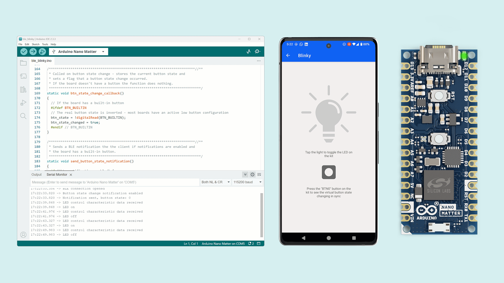

***You can also manage the LED and button status manually from the Scan tab in the lower menu of the app.***

### Arduino BLE Library

Now let's do the same but using the `ArduinoBLE` library.

In the upper menu, navigate to **Tools > Protocol stack** and select **BLE(Arduino)**.

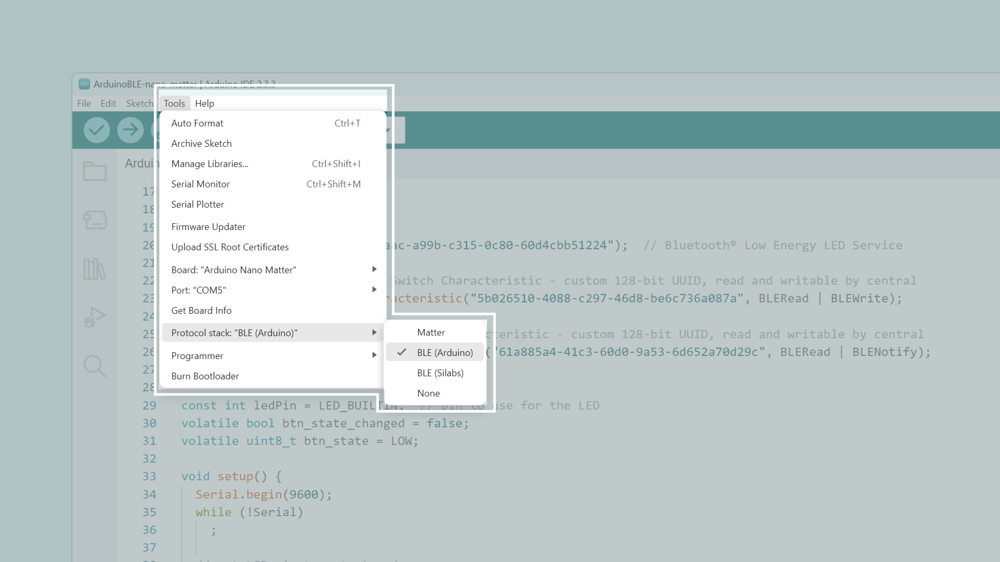

For this Bluetooth® Low Energy application example, we are going to control the Nano Matter built-in LED and read the onboard button status, everything from the **Simplicity Connect** app.

```arduino
#include <ArduinoBLE.h>

BLEService ledService("de8a5aac-a99b-c315-0c80-60d4cbb51224");  // Bluetooth® Low Energy LED Service

// Bluetooth® Low Energy LED Switch Characteristic - custom 128-bit UUID, read and writable by central
BLEByteCharacteristic ledCharacteristic("5b026510-4088-c297-46d8-be6c736a087a", BLERead | BLEWrite);

// Bluetooth® Low Energy Push Button Characteristic - custom 128-bit UUID, read and notify by central
BLEByteCharacteristic switchCharacteristic("61a885a4-41c3-60d0-9a53-6d652a70d29c", BLERead | BLENotify);

const int ledPin = LED_BUILTIN;  // pin to use for the LED
volatile bool btn_state_changed = false;
volatile uint8_t btn_state = LOW;

void setup() {
  Serial.begin(9600);
  while (!Serial)
    ;

  // set LED pin to output mode
  pinMode(ledPin, OUTPUT);
  digitalWrite(ledPin, HIGH);

  pinMode(BTN_BUILTIN, INPUT_PULLUP);
  attachInterrupt(BTN_BUILTIN, &btn_handle, CHANGE);

  // begin initialization
  if (!BLE.begin()) {
    Serial.println("starting Bluetooth® Low Energy module failed!");

    while (1)
      ;
  }

  // set advertised local name and service UUID:
  BLE.setLocalName("Blinky Example");
  BLE.setAdvertisedService(ledService);

  // add the characteristic to the service
  ledService.addCharacteristic(ledCharacteristic);
  ledService.addCharacteristic(switchCharacteristic);

  // add service
  BLE.addService(ledService);

  // set the initial value for the characeristic:
  ledCharacteristic.writeValue(0);
  switchCharacteristic.writeValue(0);

  // start advertising
  BLE.advertise();

  Serial.println("BLE LED Peripheral");
}

void loop() {
  // listen for Bluetooth® Low Energy peripherals to connect:
  BLEDevice central = BLE.central();

  // if a central is connected to peripheral:
  if (central) {
    Serial.print("Connected to central: ");
    // print the central's MAC address:
    Serial.println(central.address());

    // while the central is still connected to peripheral:
    while (central.connected()) {
      // if the remote device wrote to the characteristic,
      // use the value to control the LED:
      if (ledCharacteristic.written()) {
        if (ledCharacteristic.value()) {  // any value other than 0
          Serial.println("LED on");
          digitalWrite(ledPin, LOW);  // will turn the LED on
        } else {                      // a 0 value
          Serial.println(F("LED off"));
          digitalWrite(ledPin, HIGH);  // will turn the LED off
        }
      }

      if (btn_state_changed) {
        // button state changed, update characteristics
        btn_state_changed = false;
        Serial.println("Button toggle");
        switchCharacteristic.writeValue(btn_state);
      }
    }

    // when the central disconnects, print it out:
    Serial.print(F("Disconnected from central: "));
    Serial.println(central.address());
  }
}

/**************************************************************************/ /**
 * Called on button state change - stores the current button state and
 * sets a flag that a button state change occurred.
 *****************************************************************************/
static void btn_handle() {
  // The real button state is inverted - most boards have an active low button configuration
  btn_state = !digitalRead(BTN_BUILTIN);
  btn_state_changed = true;
}
```

As you can see, using the `ArduinoBLE` library makes the Bluetooth example more similar to the Bluetooth implementation of other Arduino boards, making it easier to migrate code from one board to another. We end up with a simple `setup()` and `loop()` sketch.

- In the `setup()` function the board outputs and inputs are set and configured alongside the BLE service and characteristics.
- In the `loop()` function we continuously ask if the peripheral is properly connected to a central and then start notifying the push button status and retrieving the app LED status.

After uploading the sketch to the Nano Matter, it is time to communicate with it via Bluetooth® Low Energy. To do this Silicon Labs has developed a **mobile app** that you can download from here:

- [Android](https://play.google.com/store/apps/details?id=com.siliconlabs.bledemo)
- [iOS](https://itunes.apple.com/us/app/silicon-labs-blue-gecko-wstk/id1030932759)

Open the **Simplicity Connect** app on your smartphone, in the lower menu, navigate to **Demo** and select **Blinky**:

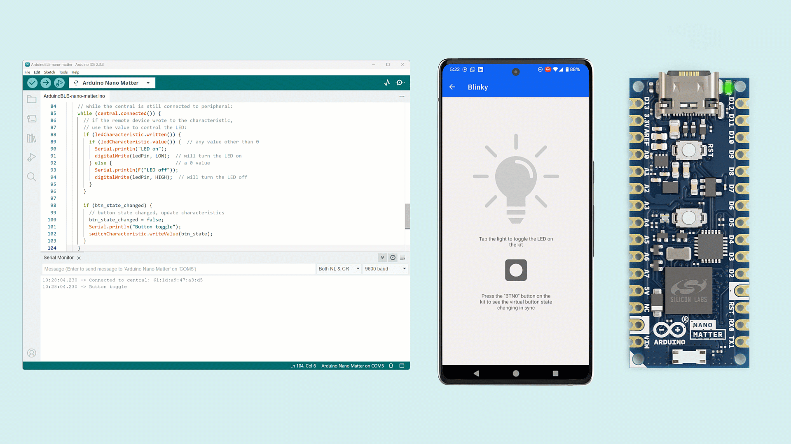

***You can also manage the LED and button status manually from the Scan tab in the lower menu of the app.***

## Onboard User Interface

### User Button

The Nano Matter includes an onboard **push button** that can be used as an input by the user. The button is connected to the GPIO `PA0` and can be read using the `BTN_BUILTIN` macro.

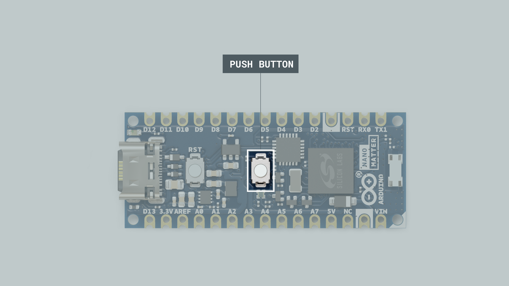

The button pulls the input to the ground when pressed, so is important to define the **pull-up resistor** to avoid undesired behavior by leaving the input floating.

Here you can find a complete example code to blink the built-in RGB LED of the Nano Matter:

```arduino
volatile bool button_pressed = false;

void handle_button_press();

void setup() {
  Serial.begin(115200);

  pinMode(BTN_BUILTIN, INPUT_PULLUP);
  attachInterrupt(BTN_BUILTIN, &handle_button_press, FALLING);
}

void loop() {
  // If the physical button state changes - update the state
  if (button_pressed) {
    button_pressed = false;
    Serial.println("Button Pressed!");
  }
}

void handle_button_press()
{
  static uint32_t btn_last_press = 0;
  if (millis() < btn_last_press + 200) {
    return;
  }
  btn_last_press = millis();
  button_pressed = true;
}

```

After pressing the push button, you will see a **"Button Pressed!"** message in the Serial Monitor.

### RGB LED

The Nano Matter features a built-in RGB LED that can be a visual feedback indicator for the user. The LED is connected through the board GPIO's; therefore, usual digital pins built-in functions can be used to operate the LED colors. 

| **LED Color Segment** |   **Arduino Name**    | **Microcontroller Pin** |
|:---------------------:|:---------------------:|:-----------------------:|
|          Red          |  LEDR or LED_BUILTIN  |          PC01           |
|         Green         | LEDG or LED_BUILTIN_1 |          PC02           |
|         Blue          | LEDB or LED_BUILTIN_2 |          PC03           |

***The RGB LED colors are activated with zeros, this means that you need to set to LOW the color segment you want to turn on.***

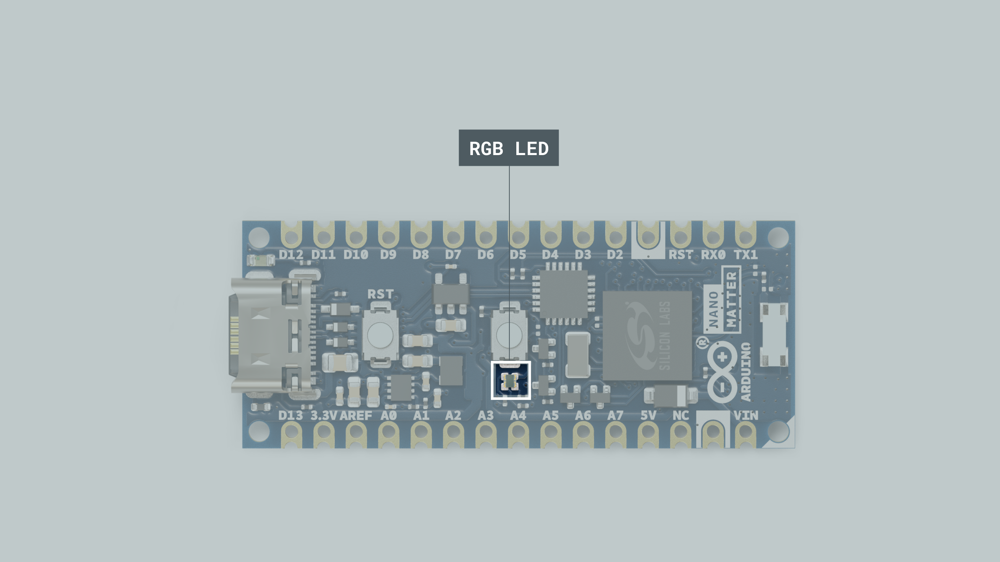


Here you can find a complete example code to blink the built-in RGB LED of the Nano Matter:

```arduino
void setup() {
  // initialize LED digital pins as outputs.
  pinMode(LEDR, OUTPUT);
  pinMode(LEDG, OUTPUT);
  pinMode(LEDB, OUTPUT);
}

// the loop function runs over and over again forever
void loop() {
  digitalWrite(LEDR, LOW);  // turn the LED on (LOW is the voltage level)
  digitalWrite(LEDG, HIGH);  // turn the LED off (HIGH is the voltage level)
  digitalWrite(LEDB, HIGH);  // turn the LED off (HIGH is the voltage level)
  delay(1000);                      // wait for a second
  digitalWrite(LEDR, HIGH);   // turn the LED off by making the voltage HIGH
  digitalWrite(LEDG, LOW);   // turn the LED on by making the voltage LOW
  digitalWrite(LEDB, HIGH);   // turn the LED off by making the voltage HIGH
  delay(1000);                      // wait for a second
  digitalWrite(LEDR, HIGH);   // turn the LED off by making the voltage HIGH
  digitalWrite(LEDG, HIGH);   // turn the LED off by making the voltage HIGH
  digitalWrite(LEDB, LOW);   // turn the LED on by making the voltage LOW
  delay(1000);   
}
```


## Pins

### Digital Pins

The Nano Matter has **22 digital pins**, mapped as follows:

| **Microcontroller Pin** |   **Arduino Pin Mapping**   |  **Pin Functionality**  |
|:-----------------------:|:---------------------------:|:-----------------------:|
|          PB00           |          A0 / DAC0          |    GPIO / ADC / DAC     |
|          PB02           |          A1 / DAC2          |    GPIO / ADC / DAC     |
|          PB05           |             A2              |       GPIO / ADC        |
|          PC00           |             A3              |       GPIO / ADC        |
|          PA06           |          A4 / SDA           |    I2C / GPIO / ADC     |
|          PA07           |          A5 / SCL           |    I2C / GPIO / ADC     |
|          PB01           |          A6 / DAC1          |    GPIO / ADC / DAC     |
|          PB03           |          A7 / DAC3          |    GPIO / ADC / DAC     |
|          PB04           |          D13 / SCK          |    SPI / GPIO / ADC     |
|          PA08           |         D12 / MISO          |    SPI / GPIO / ADC     |
|          PA09           |         D11 / MOSI          |    SPI / GPIO / ADC     |
|          PD05           |          D10 / SS           |       SPI / GPIO        |
|          PD04           |             D9              |          GPIO           |
|          PD03           |             D8              |       GPIO / ADC        |
|          PD02           |             D7              |       GPIO / ADC        |
|          PC09           |             D6              |       GPIO / ADC        |
|          PC08           |          D5 / SCL1          |    I2C / GPIO / ADC     |
|          PC07           |          D4 / SDA1          |    I2C / GPIO / ADC     |
|          PC06           |          D3 / SS1           |    GPIO / SPI / ADC     |
|          PA03           |          D2 / SCK1          |       SPI / GPIO        |
|          PA05           | D1 / PIN_SERIAL_RX1 / MISO1 | UART / SPI / GPIO / ADC |
|          PA04           | D0 / PIN_SERIAL_TX1 / MOSI1 | UART / SPI / GPIO / ADC |

The digital pins of the Nano Matter can be used as inputs or outputs through the built-in functions of the Arduino programming language. 

The configuration of a digital pin is done in the `setup()` function with the built-in function `pinMode()` as shown below:

```arduino
// Pin configured as an input
pinMode(pin, INPUT);        

// Pin configured as an output
pinMode(pin, OUTPUT);        

// Pin configured as an input, internal pull-up resistor enabled
pinMode(pin, INPUT_PULLUP);  
```

The state of a digital pin, configured as an input, can be read using the built-in function `digitalRead()` as shown below:

```arduino
// Read pin state, store value in a state variable
state = digitalRead(pin);
```

The state of a digital pin, configured as an output, can be changed using the built-in function `digitalWrite()` as shown below:

```arduino
// Set pin on
digitalWrite(pin, HIGH);    

// Set pin off
digitalWrite(pin, LOW);    
```

The example code shown below uses digital pin `D5` to control an LED and reads the state of a button connected to digital pin `D4`:

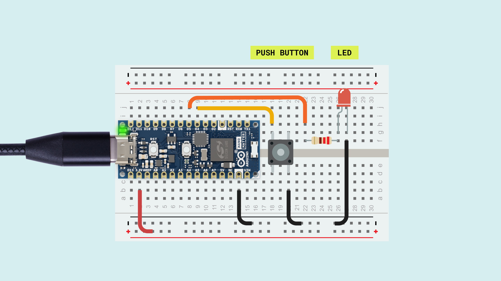

```arduino
// Define button and LED pin
int buttonPin = D4;
int ledPin = D5;

// Variable to store the button state
int buttonState = 0;

void setup() {
  // Configure button and LED pins
  pinMode(buttonPin, INPUT_PULLUP);
  pinMode(ledPin, OUTPUT);

  // Initialize Serial communication
  Serial.begin(115200);
}

void loop() {
  // Read the state of the button
  buttonState = digitalRead(buttonPin);

  // If the button is pressed, turn on the LED and print its state to the Serial Monitor
  if (buttonState == LOW) {
    digitalWrite(ledPin, HIGH);
    Serial.println("- Button is pressed. LED is on.");
  } else {
    // If the button is not pressed, turn off the LED and print to the Serial Monitor
    digitalWrite(ledPin, LOW);
    Serial.println("- Button is not pressed. LED is off.");
  }

  // Wait for 1000 milliseconds
  delay(1000);
}
```

### PWM Pins

All the digital and analog pins of the Nano Matter can be used as PWM (Pulse Width Modulation) pins. 

***You can only use 5 PWM outputs simultaneously.***

This functionality can be used with the built-in function `analogWrite()` as shown below:

```arduino
analogWrite(pin, value);  
```
By default, the output resolution is 8 bits, so the output value should be between 0 and 255. To set a greater resolution, do it using the built-in function `analogWriteResolution` as shown below:

```arduino
analogWriteResolution(bits);  
```

Using this function has some limitations, for example, the PWM signal frequency is fixed at 1 kHz, and this could not be ideal for every application.

Here is an example of how to create a **1 kHz** variable duty-cycle PWM signal:

```arduino
const int analogInPin = A0;   // Analog input pin that the potentiometer is attached to
const int pwmOutPin = D13;  // PWM output pin

int sensorValue = 0;  // value read from the pot
int outputValue = 0;  // value output to the PWM (analog out)

void setup() {
  // initialize serial communications at 9600 bps:
  Serial.begin(115200);
  analogWriteResolution(12);
}

void loop() {
  // read the analog in value:
  sensorValue = analogRead(analogInPin);
  // map it to the range of the analog out:
  outputValue = sensorValue;
  // change the analog out value:
  analogWrite(pwmOutPin, outputValue);

  // print the results to the Serial Monitor:
  Serial.print("sensor = ");
  Serial.print(sensorValue);
  Serial.print("\t output = ");
  Serial.println(outputValue);

  // wait 2 milliseconds before the next loop for the analog-to-digital
  // converter to settle after the last reading:
  delay(2);
}
```

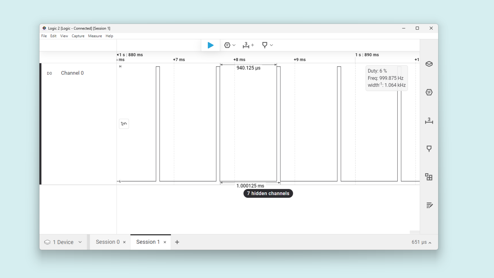

If you need to work with a **higher frequency** PWM signal, you can do it with the following PWM class-specific function:

```arduino
PWM.frequency_mode(output_pin, frequency);
```
Here is an example of how to create a **10 kHz** fixed duty-cycle PWM signal:

```arduino
const int analogOutPin = D13;  // PWM output pin to use

void setup() {
  analogWriteResolution(12); 
}

void loop() {
  PWM.frequency_mode(analogOutPin, 10000);
}
```

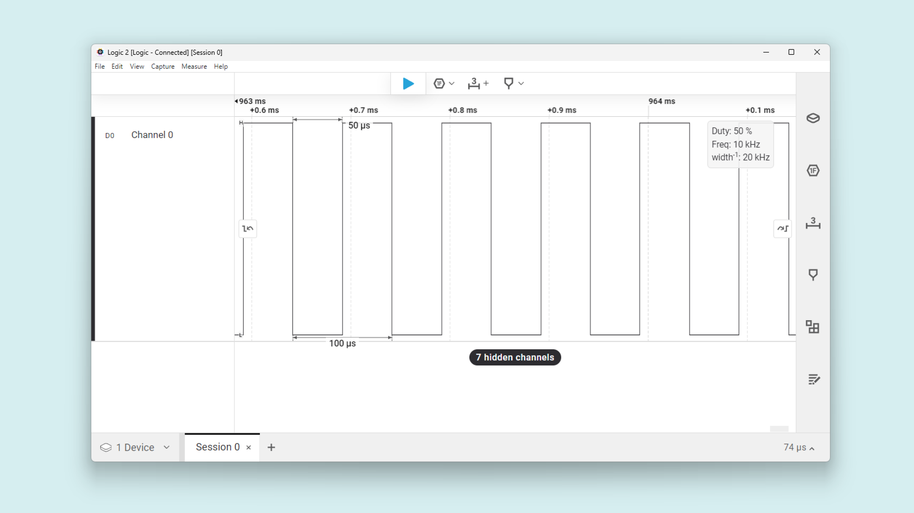

### Analog Input Pins (ADC)

The Nano Matter has **20 analog input pins**, mapped as follows:

| **Microcontroller Pin** |   **Arduino Pin Mapping**   |  **Pin Functionality**  |
|:-----------------------:|:---------------------------:|:-----------------------:|
|          PB00           |          A0 / DAC0          |    GPIO / ADC / DAC     |
|          PB02           |          A1 / DAC2          |    GPIO / ADC / DAC     |
|          PB05           |             A2              |       GPIO / ADC        |
|          PC00           |             A3              |       GPIO / ADC        |
|          PA06           |          A4 / SDA           |    I2C / GPIO / ADC     |
|          PA07           |          A5 / SCL           |    I2C / GPIO / ADC     |
|          PB01           |          A6 / DAC1          |    GPIO / ADC / DAC     |
|          PB03           |          A7 / DAC3          |    GPIO / ADC / DAC     |
|          PB04           |          D13 / SCK          |    SPI / GPIO / ADC     |
|          PA08           |         D12 / MISO          |    SPI / GPIO / ADC     |
|          PA09           |         D11 / MOSI          |    SPI / GPIO / ADC     |
|          PD03           |             D8              |       GPIO / ADC        |
|          PD02           |             D7              |       GPIO / ADC        |
|          PC09           |             D6              |       GPIO / ADC        |
|          PC08           |          D5 / SCL1          |    I2C / GPIO / ADC     |
|          PC07           |          D4 / SDA1          |    I2C / GPIO / ADC     |
|          PC06           |          D3 / SS1           |    GPIO / SPI / ADC     |
|          PA03           |          D2 / SCK1          |       SPI / GPIO        |
|          PA05           | D1 / PIN_SERIAL_RX1 / MISO1 | UART / SPI / GPIO / ADC |
|          PA04           | D0 / PIN_SERIAL_TX1 / MOSI1 | UART / SPI / GPIO / ADC |

***Digital I/O's can also be used as analog inputs except for `D9` and `D10`.***

Analog input pins can be used through the built-in functions of the Arduino programming language.

Nano Matter ADC resolution is fixed to **12 bits** and cannot be changed by the user.

The Nano Matter ADC reference voltage is 3.3 V by default, it can be configured using the function `analogReference()` with the following arguments:


|   **Argument**   |        **Description**         |
|:----------------:|:------------------------------:|
|  AR_INTERNAL1V2  |    Internal 1.2V reference     |
| AR_EXTERNAL_1V25 |    External 1.25V reference    |
|      AR_VDD      |   VDD (unbuffered to ground)   |
|     AR_08VDD     | 0.8 * VDD (buffered to ground) |

To set a different analog reference from the default one, see the following example:

```arduino
analogReference(AR_INTERNAL1V2); 
```

The example code shown below reads the analog input value from a potentiometer connected to `A0` and displays it on the IDE Serial Monitor. To understand how to properly connect a potentiometer to the Nano Matter, take the following image as a reference:

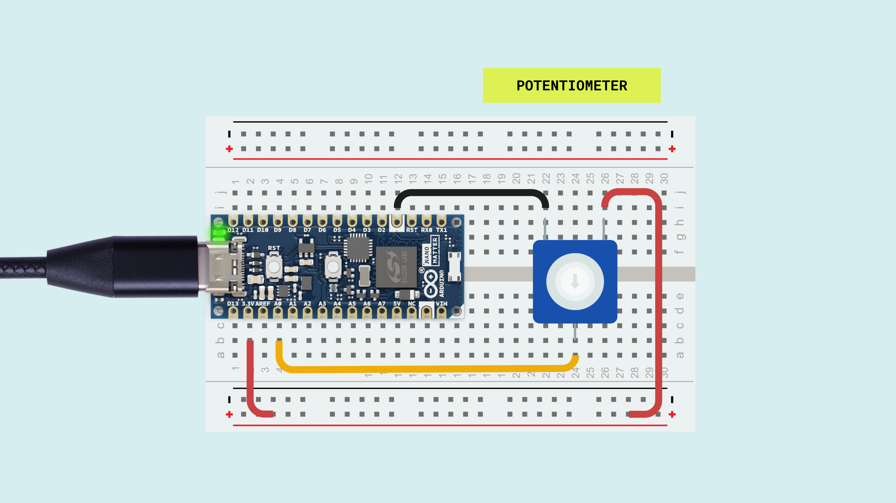

```arduino
int sensorPin = A0;   // select the input pin for the potentiometer

int sensorValue = 0;  // variable to store the value coming from the sensor

void setup() {
  Serial.begin(115200); 
}

void loop() {
  // read the value from the sensor:
  sensorValue = analogRead(sensorPin);

  Serial.println(sensorValue);
  delay(100);
}
```

### Analog Output Pins (DAC)

The Nano Matter has **two DACs** with two channels each, mapped as follows:

| **Microcontroller Pin** | **Arduino Name** | **Board Pin Output** | **Peripheral** |
|:-----------------------:|:----------------:|:--------------------:|:--------------:|
|          PB00           |       DAC0       |          A0          |    DAC0_CH0    |
|          PB01           |       DAC1       |          A6          |    DAC0_CH1    |
|          PB02           |       DAC2       |          A1          |    DAC1_CH0    |
|          PB03           |       DAC3       |          A7          |    DAC1_CH1    |

The digital-to-analog converters of the Nano Matter can be used as outputs through the built-in functions of the Arduino programming language.

The DAC output resolution can be configured from 8 to 12 bits using the `analogWriteResolution()` function as follows:

```arduino
analogWriteResolution(12);  // enter the desired resolution in bits (8,10,12)
```
The DAC voltage reference can be configured using the `analogReferenceDAC()` function. The available setups are listed below:

|     **Argument**      |     **Description**      |
|:---------------------:|:------------------------:|
|     DAC_VREF_1V25     | Internal 1.25V reference |
|     DAC_VREF_2V5      | Internal 2.5V reference  |
|     DAC_VREF_AVDD     |        Analog VDD        |
| DAC_VREF_EXTERNAL_PIN |    External AREF pin     |

```arduino
analogReferenceDAC(DAC_VREF_2V5);  // enter the desired reference as argument
```
To output an analog voltage value through a DAC pin, use the `analogWrite()` function with the **DAC channel** as an argument. See the example below:

```arduino
analogWrite(DAC0, value);   // the value should be in the range of the DAC resolution (e.g. 0-4095 with a 12 bits resolution)
```

***If a normal GPIO is passed to the analogWrite() function, the output will be a PWM signal.***


The following sketch will create a **sine** wave signal in the `A0` Nano Matter pin:

```arduino
float sample_rate = 9600.0, freq = 60.0;  //samples/second, AC waveform freq.
int npts = sample_rate / freq;

void setup()
{
  Serial.begin(115200);
  // Set the DAC resolution to 12 bits
  analogWriteResolution(12);
  // Select the 1.25V reference voltage (feel free to change it)
  analogReferenceDAC(DAC_VREF_1V25);
}

void loop()
{

  for (int i = 0; i < npts; i++) {
    int x = 2000 + 1000.0 * sin(2 * PI * (freq / sample_rate) * i);
    analogWrite(DAC0, x);
    delayMicroseconds(1.0E6 / sample_rate);  //adjust constant to get correct rate
  }
}
```
The DAC output should look like the image below:

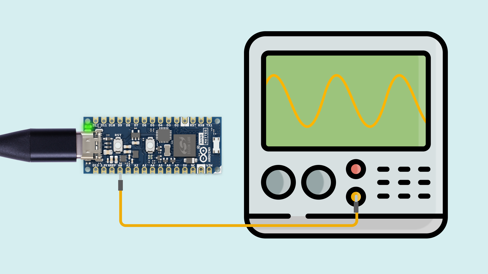

The following sketch will create a **sawtooth** wave signal in the `A0` Nano Matter pin:

```arduino
void setup()
{
  Serial.begin(115200);
  // Set the DAC resolution to 8 bits
  analogWriteResolution(8);
  // Select the 2.5V reference voltage (feel free to change it)
  analogReferenceDAC(DAC_VREF_2V5);
}

void loop()
{
  static int value = 0;
  analogWrite(DAC0, value);
  Serial.println(value);

  value++;
  if (value == 255) {
    value = 0;
  }
}
```
The DAC output should look like the image below:

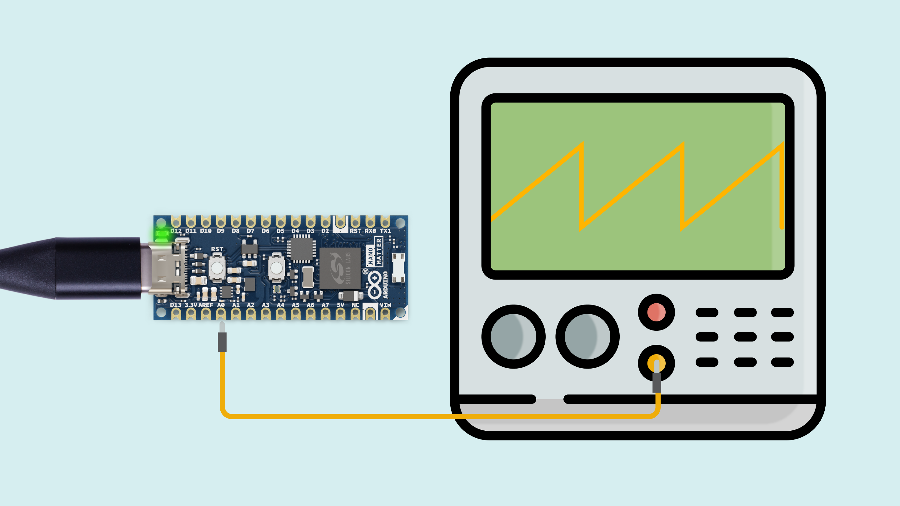

## Communication

This section of the user manual covers the different communication protocols that are supported by the Nano Matter, including the Serial Peripheral Interface (SPI), Inter-Integrated Circuit (I2C) and Universal Asynchronous Receiver-Transmitter (UART). The Nano Matter features dedicated pins for each communication protocol, simplifying the connection and communication with different components, peripherals, and sensors.

### SPI

The Nano Matter supports SPI communication, which enables data transmission between the board and other SPI-compatible devices. It counts with two SPI interfaces and the pins used in the Nano Matter for the SPI communication protocol are the following:


| **Microcontroller Pin** | **Arduino Pin Mapping** |
|:-----------------------:|:-----------------------:|
|          PD05           |        SS or D10        |
|          PA09           |       MOSI or D11       |
|          PA08           |       MISO or D12       |
|          PB04           |       SCK or D13        |
|          PA04           |       MOSI1 or D0       |
|          PA05           |       MISO1 or D1       |
|          PA03           |       SCK1 or D2        |
|          PC06           |       SS1 or D3        |

Please, refer to the [board pinout section](#pinout) of the user manual to localize them on the board.

***You can not use __SPI1__ and __UART__ interfaces at the same time because they share pins.***

Include the `SPI` library at the top of your sketch to use the SPI communication protocol. The SPI library provides functions for SPI communication:

```arduino
#include <SPI.h>
```

In the `setup()` function, initialize the SPI peripheral, define and configure the chip select (`SS`) pin:

***Use SPI.begin() for SPI0 and SPI1.begin() for SPI1.***

```arduino

void setup() {
  // Set the chip select pin as output
  pinMode(SS, OUTPUT); 

  // Pull the CS pin HIGH to unselect the device
  digitalWrite(SS, HIGH); 
  
  // Initialize the SPI communication
  SPI.begin();
}
```

To transmit data to an SPI-compatible device, you can use the following commands:

```arduino
// Replace with the target device's address
byte address = 0x35; 

// Replace with the value to send
byte value = 0xFA; 

// Pull the CS pin LOW to select the device
digitalWrite(SS, LOW); 

// Send the address
SPI.transfer(address); 

// Send the value
SPI.transfer(value); 

// Pull the CS pin HIGH to unselect the device
digitalWrite(SS, HIGH); 
```

The example code above should output this:

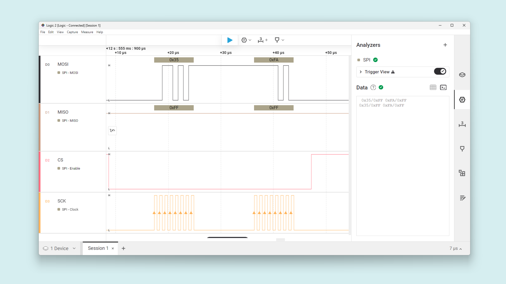

### I2C

The Nano Matter supports I2C communication, which enables data transmission between the board and other I2C-compatible devices. The Nano Matter features two I2C interfaces and the pins used in the Nano Matter for the I2C communication protocol are the following:

| **Microcontroller Pin** | **Arduino Pin Mapping** |
|:-----------------------:|:-----------------------:|
|          PA06           |        SDA or A4        |
|          PA07           |        SCL or A5        |
|          PC07           |       SDA1 or D4        |
|          PC08           |       SCL1 or D5        |

Please, refer to the [board pinout section](#pinout) of the user manual to localize them on the board.

To use I2C communication, include the `Wire` library at the top of your sketch. The `Wire` library provides functions for I2C communication:

```arduino
#include <Wire.h>
```

In the `setup()` function, initialize the I2C library:

***Use Wire.begin() for I2C0 and Wire1.begin() for I2C1.***

```arduino
 // Initialize the I2C communication
Wire.begin();
```

To transmit data to an I2C-compatible device, you can use the following commands:

```arduino
// Replace with the target device's I2C address
byte deviceAddress = 0x35; 

// Replace with the appropriate instruction byte
byte instruction = 0x00; 

// Replace with the value to send
byte value = 0xFA; 

// Begin transmission to the target device
Wire.beginTransmission(deviceAddress); 

// Send the instruction byte
Wire.write(instruction); 

// Send the value
Wire.write(value); 

// End transmission
Wire.endTransmission(); 
```

The output data should look like the image below, where we can see the device address data frame:

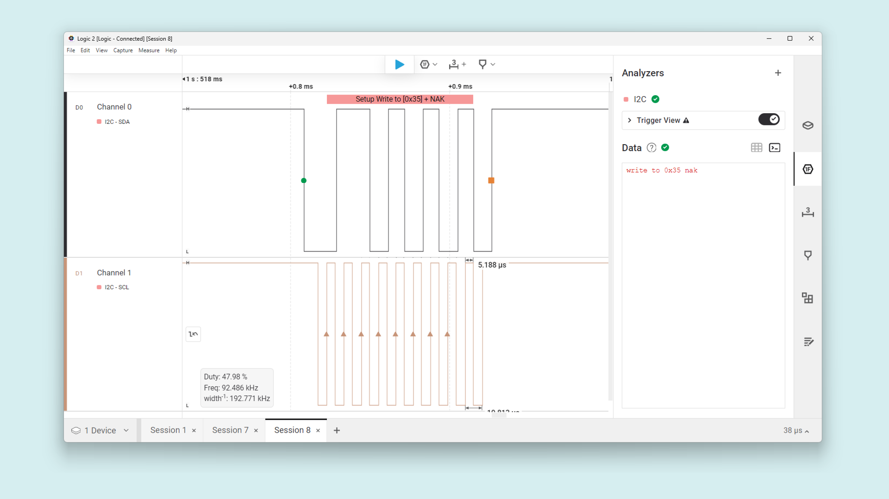


To read data from an I2C-compatible device, you can use the `requestFrom()` function to request data from the device and the `read()` function to read the received bytes:

```arduino
// The target device's I2C address
byte deviceAddress = 0x1; 

// The number of bytes to read
int numBytes = 2; 

// Request data from the target device
Wire.requestFrom(deviceAddress, numBytes);

// Read while there is data available
while (Wire.available()) {
  byte data = Wire.read(); 
}
```

### UART

The Nano Matter features two UARTs. The pins used in the Nano Matter for the UART communication protocol are the following:

| **Microcontroller Pin** | **Arduino Pin Mapping** |
|:-----------------------:|:-----------------------:|
|          PA05           |   PIN_SERIAL_RX1 or D1   |
|          PA04           |   PIN_SERIAL_TX1 or D0   |
|          PC05           |   PIN_SERIAL_RX (internal)    |
|          PC04           |   PIN_SERIAL_TX (internal)   |

Please, refer to the [board pinout section](#pinout) of the user manual to localize them on the board.

***You can not use __UART__ and __SPI1__ interfaces at the same time because they share pins.***

***Use Serial.begin() for UART0 (internal) and Serial1.begin() for UART1 (exposed).***

To begin with UART communication, you will need to configure it first. In the `setup()` function, set the baud rate (bits per second) for UART communication:

```arduino
// Start UART communication at 115200 baud
Serial1.begin(115200); 
```

To read incoming data, you can use a `while()` loop to continuously check for available data and read individual characters. The code shown below stores the incoming characters in a String variable and processes the data when a line-ending character is received:

```arduino
// Variable for storing incoming data
String incoming = ""; 

void loop() {
  // Check for available data and read individual characters
  while (Serial1.available()) {
    // Allow data buffering and read a single character
    delay(2); 
    char c = Serial1.read();
    
    // Check if the character is a newline (line-ending)
    if (c == '\n') {
      // Process the received data
      processData(incoming);

      // Clear the incoming data string for the next message
      incoming = ""; 
    } else {
      // Add the character to the incoming data string
      incoming += c; 
    }
  }
}
```

To transmit data to another device via UART, you can use the `write()` function:

```arduino
// Transmit the string "Hello world!
Serial1.write("Hello world!");
```

You can also use the `print` and `println()` to send a string without a newline character or followed by a newline character:

```arduino
// Transmit the string "Hello world!" 
Serial1.print("Hello world!");

// Transmit the string "Hello world!" followed by a newline character
Serial1.println("Hello world!");
```

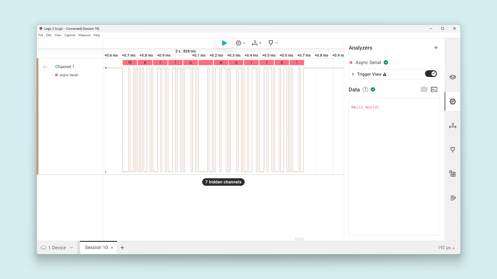

## Support

If you encounter any issues or have questions while working with the Nano Matter, we provide various support resources to help you find answers and solutions.

### Help Center

Explore our [Help Center](https://support.arduino.cc/hc/en-us), which offers a comprehensive collection of articles and guides for the Nano Matter. The Arduino Help Center is designed to provide in-depth technical assistance and help you make the most of your device.

- [Nano Matter Help Center page](https://support.arduino.cc/hc/en-us/sections/360004605400-Nano-Family)

### Forum

Join our community forum to connect with other Nano Matter users, share your experiences, and ask questions. The forum is an excellent place to learn from others, discuss issues, and discover new ideas and projects related to the Nano Matter.

- [Nano Matter category in the Arduino Forum](https://forum.arduino.cc/c/hardware/nano-family/87)

### Contact Us

Please get in touch with our support team if you need personalized assistance or have questions not covered by the help and support resources described before. We're happy to help you with any issues or inquiries about the Nano Matter.

- [Contact us page](https://www.arduino.cc/en/contact-us/) 