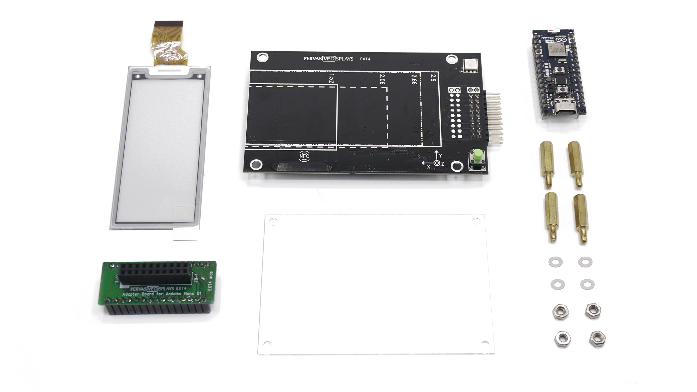

## Overview

The [Nano Matter Display](https://www.pervasivedisplays.com/product/epdk-matter/) is a development kit for the Nano Matter that features an extension board from [Pervasive Displays](https://www.pervasivedisplays.com/). It includes a [2.9 inches (384x168 resolution) E-ink monochrome high-definition display](https://www.pervasivedisplays.com/product/2-9-e-ink-displays/), a temperature and humidity sensor, a 3-axis accelerometer and an addressable RGB LED.


The Nano Matter Display has been created to be used along the Arduino Nano Matter to extend its capabilities and allow the user to create interesting and useful applications around the E-ink display technology.

## Goals

- Learn how to use the Nano Matter Display and all its features
- Learn how to develop a Matter application using the Nano Matter Display with the Arduino Nano Matter

## Required Hardware and Software



### Hardware Requirements

- [Arduino Nano Matter](https://store.arduino.cc/products/nano-matter) (x1)
- Nano Matter Display extension board (x1)
- [USB Type-C® Cable](https://store.arduino.cc/products/usb-cable2in1-type-c) (x1)

### Software Requirements

- [Arduino IDE](https://www.arduino.cc/en/software) or [Arduino Cloud Editor](https://create.arduino.cc/editor)
- [Silicon Labs boards package](https://github.com/SiliconLabs/arduino) (to support the Nano Matter within the Arduino IDE)

### Pervasive Displays EPDK-Matter Official Documentation

To learn more about the EPDK-Matter Development Kit read the Pervasive Displays [documentation](https://docs.pervasivedisplays.com/epd-usage/development-kits/ext4). 

## Nano Matter Display Main Features


The [Nano Matter Display](https://www.pervasivedisplays.com/product/epdk-matter/) include the following features:

- **[E-ink display:](https://www.pervasivedisplays.com/product/2-9-e-ink-displays/)** a 2.9 inches (384x168) E-ink monochrome high-definition display with a wide temperature working range and fast update.
- **RGB LED:** a WS2813C addressable RGB LED for visual status feedback.
- **3-axis accelerometer:** a MEMS digital output motion sensor (LIS2DH12).
- **Temperature and humidity sensor:** a HDC2080 Low-Power humidity and temperature digital sensor.
- **Flexible power options:** can be powered by a pair of CR2450 3V batteries or through the USB connector of the Arduino Nano.

## Nano Matter Display Kit Assembly

In the [Nano Matter Display kit](https://www.pervasivedisplays.com/product/epdk-matter/) you will find the following parts:

- [E-ink display (2.9" 384x168)](https://www.pervasivedisplays.com/product/2-9-e-ink-displays/).
- [Pervasive Displays EPD Extension Kit Gen 4 (EXT4)](https://www.pervasivedisplays.com/product/epd-extension-kit-gen-4-ext4/).
- Pervasive Displays EXT4-to-Nano adapter.
- Brass spacer standoffs (x4).
- M3 nuts for the standoffs (x4).
- Plastic washers (x4).
- Acrylic sheet to protect the display (x1).

Follow the next animation for the assembly steps:


- To connect the E-ink display, pull up gently the black lever on the connector and slide in the display flat cable with the copper contacts facing down, it will go in like 2mm. Finally, push down the connector lever so it latches the cable.
- Align the E-ink display with the white silkscreen outlines in the other side of the PCB. Use a thin double-sided tape to fix it (not included).
- The EXT4-to-Nano adapter must be connected so its **11-10** white mark is aligned with the **11-10** breakout pins of the Matter Display board.
  


## Configuring the Development Environment

To start using the Nano Matter Display we first need to install some basic dependencies for the Arduino IDE.

### Arduino IDE Download

We are going to use the Arduino IDE to develop around the Nano Matter Display. Follow this guide to learn how to install the IDE if you have not done so.

- [Arduino IDE Installation Guide](https://docs.arduino.cc/software/ide-v2/tutorials/getting-started/ide-v2-downloading-and-installing/)

### Board Core and Library Installation

The **Silicon Labs** core contains the libraries and examples you need to work with the board's components, such as its Matter, Bluetooth® Low Energy, and I/Os. To install the Nano Matter core, navigate to **Tools > Board > Boards Manager** or click the Boards Manager icon in the left tab of the IDE. In the Boards Manager tab, search for `Nano Matter` and install the latest `Silicon Labs` core version.


Download the following libraries:

- `PDLS_EXT4_Basic_Matter.h`: enables support for Pervasive Displays extension board to control the E-ink display and every other features. You can install it from the Library Manager on the Arduino IDE or from its [repository](https://github.com/rei-vilo/PDLS_EXT4_Basic_Matter).
  
- `qrcode.h`: allows you to create QR codes to then be displayed on the E-ink display. You can install it from the Library Manager on the Arduino IDE or from its [repository](https://github.com/ricmoo/qrcode/).


***Follow these guides to learn more about library installation process ([Library Manager](https://docs.arduino.cc/software/ide-v2/tutorials/ide-v2-installing-a-library/), [.zip install](https://docs.arduino.cc/software/ide-v1/tutorials/installing-libraries/))***

## Powering the Kit


You have several options to power your EXT4 EPD development board that are listed below:

- **USB power**: you can power the board using a USB-C cable connected to the Arduino Nano Matter.
- **Battery power**: you can use two CR2450 batteries to power your kit. Recommended for remote deployments without access to wired power.

***To avoid damaging your board only use one power source at a time. If USB power is used make sure not to have batteries installed.***

## Matter RGB Lightbulb

In order to quickly understand the product capabilities we are going to jump straight to a hands-on section based on the [RGB Lightbulb example](https://docs.arduino.cc/tutorials/nano-matter/user-manual/#matter) showcased in the **[Nano Matter User Manual](https://docs.arduino.cc/tutorials/nano-matter/user-manual)**.


***As this example uses the Matter network you will need a __Thread Border Router__ to replicate it. See the supported ones on the [Matter section of the Nano Matter User Manual](https://docs.arduino.cc/tutorials/nano-matter/user-manual/#matter).***

The following example code is based on the Matter library built-in example called **nano_matter_lightbulb_color** and the **Pervasive Displays library API**, copy and paste it from the code snippet below:

```arduino
#include <Matter.h>
#include <MatterLightbulb.h>
#include "PDLS_EXT4_Basic_Matter.h"
#include "hV_Configuration.h"
#include "ezWS2812gpio.h"
#include "qrcode.h"

uint8_t r, g, b;

MatterColorLightbulb matter_color_bulb;  // RGB LED Matter UI instance

const pins_t nano_matter = boardArduinoNanoMatter;

ezWS2812gpio myRGB(1, nano_matter.ledData);  // Pervasive Displays onboard WS2813C LED set up (Number of LEDs, LED Pin)

Screen_EPD_EXT4_Fast EPD(eScreen_EPD_290_KS_0F, nano_matter);  // Pervasive Displays E-INK set up (screen type, host board)

#define MATTER_EXAMPLE_NAME "Nano Matter RGB"

static uint8_t countFlush = 1;          // Counter for global update
const uint8_t FAST_BEFORE_GLOBAL = 16;  // Number of fast updates before global update

volatile bool button_pressed = false;

void setup() {
  Serial.begin(115200);

  // Nano Matter device set up
  Matter.begin();
  matter_color_bulb.begin();
  matter_color_bulb.boost_saturation(51);  // Boost saturation by 20 percent

  // Screen set up
  EPD.begin();
  EPD.setPowerProfile(POWER_MODE_AUTO, POWER_SCOPE_GPIO_ONLY);
  EPD.setOrientation(3);
  EPD.regenerate();  // Clear buffer and screen

  // Set up the onboard button for LED control and decommissioning
  pinMode(nano_matter.button, INPUT_PULLUP);
  attachInterrupt(nano_matter.button, &handle_button_press, FALLING);

  // Pervasive Displays onboard WS2813C LED set up
  myRGB.begin();
  // Turn the LED off
  led_off();

  Serial.println("Arduino Nano Matter - color lightbulb");

  if (!Matter.isDeviceCommissioned()) {
    Serial.println("Matter device is not commissioned");
    Serial.println("Commission it to your Matter hub with the manual pairing code or QR code");
    Serial.printf("Manual pairing code: %s\n", Matter.getManualPairingCode().c_str());
    Serial.printf("QR code URL: %s\n", Matter.getOnboardingQRCodeUrl().c_str());
    displayCommissioning();
  }

  while (!Matter.isDeviceCommissioned()) {
    decommission_handler();
    delay(200);
  }

  EPD.clear();
  EPD.selectFont(Font_Terminal12x16);
  uint16_t y = 0;
  uint16_t dy = EPD.characterSizeY();

  EPD.gText(0, y, MATTER_EXAMPLE_NAME);
  y += dy * 2;
  EPD.flush();

  EPD.selectFont(Font_Terminal8x12);
  dy = EPD.characterSizeY();

  Serial.println("Waiting for Thread network...");
  EPD.gText(0, y, "Waiting for Thread network...");
  y += dy;
  EPD.flush();

  while (!Matter.isDeviceThreadConnected()) {
    decommission_handler();
    delay(200);
  }

  Serial.println("Connected to Thread network");
  EPD.gText(0, y, "Connected to Thread network");
  y += dy;
  EPD.flush();

  Serial.println("Waiting for Matter device discovery...");
  EPD.gText(0, y, "Waiting for Matter device discovery...");
  y += dy;
  EPD.flush();
  while (!matter_color_bulb.is_online()) {
    decommission_handler();
    delay(200);
  }
  Serial.println("Matter device is now online");
  EPD.gText(0, y, "Matter device is now online");
  y += dy;
  EPD.flush();

  delay(1000);
  EPD.clear();
  EPD.flush();

  // Initial LED state
  matter_color_bulb.get_rgb(&r, &g, &b);
  displayValue();
  EPD.flush();
}

void loop() {
  // If the physical button state changes - update the lightbulb's on/off state
  if (button_pressed) {
    button_pressed = false;
    // Toggle the on/off state of the lightbulb
    matter_color_bulb.toggle();
  }

  // Get the current on/off state of the lightbulb
  static bool matter_lightbulb_last_state = false;
  bool matter_lightbulb_current_state = matter_color_bulb.get_onoff();

  // If the current state is ON and the previous was OFF - turn on the LED
  if (matter_lightbulb_current_state && !matter_lightbulb_last_state) {
    matter_lightbulb_last_state = matter_lightbulb_current_state;
    Serial.println("Bulb ON");
    matter_color_bulb.set_onoff(1);
    // Set the LEDs to the last received state
    update_led_color();
    countFlush += 1;
  }

  // If the current state is OFF and the previous was ON - turn off the LED
  if (!matter_lightbulb_current_state && matter_lightbulb_last_state) {
    matter_lightbulb_last_state = matter_lightbulb_current_state;
    Serial.println("Bulb OFF");
    matter_color_bulb.set_onoff(0);
    led_off();
    displayValue();
    EPD.flush();
    countFlush += 1;
  }

  countFlush %= FAST_BEFORE_GLOBAL;

  if (countFlush == 0) {
    EPD.regenerate();
  }

  static uint8_t hue_prev = 0;
  static uint8_t saturation_prev = 0;
  static uint8_t brightness_prev = 0;
  uint8_t hue_curr = matter_color_bulb.get_hue();
  uint8_t saturation_curr = matter_color_bulb.get_saturation_percent();
  uint8_t brightness_curr = matter_color_bulb.get_brightness_percent();

  // If either the hue, saturation or the brightness changes - update the LED to reflect the latest change
  if (hue_prev != hue_curr || saturation_prev != saturation_curr || brightness_prev != brightness_curr) {
    update_led_color();
    hue_prev = hue_curr;
    saturation_prev = saturation_curr;
    brightness_prev = brightness_curr;
  }

  decommission_handler();
}

// Updates the color of the RGB LED to match the Matter lightbulb's color
void update_led_color() {
  if (!matter_color_bulb.get_onoff()) {
    return;
  }

  matter_color_bulb.get_rgb(&r, &g, &b);
  myRGB.set_all(r, g, b);

  Serial.printf("Setting bulb color to > r: %u  g: %u  b: %u\n", r, g, b);

  displayValue();
  EPD.flush();
}

// Turns the RGB LED off
void led_off() {
  // set the RGB LED to OFF
  myRGB.set_all( 0, 0, 0);
  matter_color_bulb.set_onoff(0);
}

void handle_button_press() {
  static uint32_t btn_last_press = 0;
  if (millis() < btn_last_press + 200) {
    return;
  }
  btn_last_press = millis();
  button_pressed = true;
}

void decommission_handler() {
  if (digitalRead(nano_matter.button) == LOW) {  //Push button pressed
    // measures time pressed
    int startTime = millis();
    while (digitalRead(nano_matter.button) == LOW) {

      int elapsedTime = (millis() - startTime) / 1000.0;

      if (elapsedTime > 10) {
        Serial.printf("Decommissioning!\n");
        for (int i = 0; i < 10; i++) {
          digitalWrite(LEDR, !(digitalRead(LEDR)));
          delay(50);
        };

        displayDecommissioning();
        break;
      }
    }
  }
}

void displayQR(const char* code) {
  // Create the QR code
  QRCode qrcode;
  uint8_t qrcodeData[qrcode_getBufferSize(3)];
  qrcode_initText(&qrcode, qrcodeData, 3, 0, code);

  uint16_t x = EPD.screenSizeX();
  uint16_t y = EPD.screenSizeY();
  uint8_t k = qrcode.size;
  uint16_t dxy = hV_HAL_min(x, y);
  uint16_t dz = dxy / k;
  uint16_t dxy0 = (dxy - k * dz) / 2;
  uint16_t dx0 = x - dxy + dxy0;
  uint16_t dy0 = 0 + dxy0;

  EPD.setPenSolid(true);
  EPD.dRectangle(x - dxy, 0, dxy, dxy, myColours.white);

  for (uint8_t jy = 0; jy < k; jy++) {
    for (uint8_t ix = 0; ix < k; ix++) {
      uint16_t colour = qrcode_getModule(&qrcode, ix, jy) ? myColours.black : myColours.white;
      EPD.dRectangle(dx0 + dz * ix, dy0 + dz * jy, dz, dz, colour);
    }
  }
  EPD.setPenSolid(false);
}

void displayCommissioning() {
  EPD.selectFont(Font_Terminal12x16);

  uint16_t y = 0;
  uint16_t dy = EPD.characterSizeY();

  EPD.gText(0, y, MATTER_EXAMPLE_NAME);
  y += dy * 2;
  EPD.flush();
  EPD.selectFont(Font_Terminal8x12);

  EPD.gText(0, y, "Device not commissioned");
  y += dy * 2;

  EPD.gText(0, y, "Commission with:");
  y += dy;

  EPD.gText(0, y, "- Manual pairing code:");
  y += dy;
  EPD.gText(0, y, Matter.getManualPairingCode());
  y += dy;

  EPD.gText(0, y, "- Scan QR-code:");
  y += dy;

  displayQR(Matter.getOnboardingQRCodePayload().c_str());
  EPD.flush();
}

void displayDecommissioning() {
  EPD.clear();
  EPD.selectFont(Font_Terminal12x16);
  uint16_t y = 0;
  uint16_t dy = EPD.characterSizeY();

  EPD.gText(0, y, MATTER_EXAMPLE_NAME);
  y += dy * 2;
  EPD.flush();
  EPD.selectFont(Font_Terminal8x12);

  EPD.gText(0, y, "Decommissioning");
  y += dy;
  EPD.flush();

  EPD.gText(0, y, ". Starting");
  y += dy;
  EPD.flush();

  Matter.decommission();
}

void displayValue() {
  EPD.setPenSolid();
  EPD.setFontSolid();

  uint16_t x = EPD.screenSizeX();
  uint16_t y = EPD.screenSizeY();
  uint16_t dx, dy, x0, y0;

  x0 = 0;
  dx = x / 6;
  y0 = 0;
  dy = y / 7;

  EPD.selectFont(Font_Terminal12x16);

  EPD.gText(x0, y0, MATTER_EXAMPLE_NAME);
  y0 += dy;

  EPD.selectFont(Font_Terminal8x12);
  EPD.gText(x0 + dx * 0, y0 + dy * 1, "Red");
  EPD.gText(x0 + dx * 2, y0 + dy * 1, "Green");
  EPD.gText(x0 + dx * 4, y0 + dy * 1, "Blue");

  EPD.gText(x0 + dx * 2 - EPD.characterSizeX() * 2, y0 + dy * 2 - EPD.characterSizeY(), "%");
  EPD.gText(x0 + dx * 4 - EPD.characterSizeX() * 2, y0 + dy * 2 - EPD.characterSizeY(), "%");
  EPD.gText(x0 + dx * 6 - EPD.characterSizeX() * 2, y0 + dy * 2 - EPD.characterSizeY(), "%");

  EPD.selectFont(Font_Terminal12x16);
  EPD.gTextLarge(x0 + dx * 0, y0 + dy * 2, formatString("%4i", r * 100 / 254));
  EPD.gTextLarge(x0 + dx * 2, y0 + dy * 2, formatString("%4i", g * 100 / 254));
  EPD.gTextLarge(x0 + dx * 4, y0 + dy * 2, formatString("%4i", b * 100 / 254));

  EPD.gTextLarge(x0 + dx * 2, y0 + dy * 4, (matter_color_bulb.get_onoff() ? " ON " : " OFF"));
}
```

Some of the code main functions to pay attention to are:

- The `displayCommissioning()` function displays the commissioning steps on the screen, letting you know how to device status and showing the QR code.
- The `displayQR()` function converts the Nano Matter onboarding QR payload on an image to be shown in the E-ink display. 
- The `loop()` function continuously checks if the user button was pressed and updates the LED color with the data received from the Matter controller.
- The `setup()` function initiates the Matter service, E-ink display and other peripherals.

Using the Nano Matter Display will allow you to enjoy the following new features:

- Commissioning QR Code displayed on the E-Ink screen so we will be able to scan it with your phone.


- Real time data monitoring on the E-ink display showing the lightbulb state and colors.
  


### Upload the Example Sketch

You can copy the code from the previous section and paste it on the Arduino IDE or download it from this [link](assets/rgb-matter-code.zip) or by clicking on the image below: 

[](assets/rgb-matter-code.zip)

In the Arduino IDE select the **Arduino Nano Matter** inside the _Silicon Labs_ board package and make sure the **Protocol Stack** is set to _Matter_.


### Commissioning the Matter RGB Lightbulb and Final Test

Once the code is uploaded, the display will show the commissioning steps alongside the QR code. 

See the following video that shows the whole process with the Amazon Alexa app.

<div style="text-align: center;">
  <video width="100%" controls="true">
  <source src="assets/video.mp4" type="video/mp4"/>
  </video>
</div>

***Make sure to use the right assistant app respectively to your Thread Border Router brand. Here are the suggestions for [Google Home](https://docs.arduino.cc/tutorials/nano-matter/user-manual/#with-google-home), [Amazon Alexa](https://docs.arduino.cc/tutorials/nano-matter/user-manual/#with-amazon-alexa) and [Apple Home](https://docs.arduino.cc/tutorials/nano-matter/user-manual/#with-apple-home)***

## Matter Weather Station

As another hands-on application, we are going to create a **weather station** using our Matter Display that measures `temperature` and `humidity` while showing the readings on the screen and sharing the measurements with our preferred personal assistant.


***As this example uses the Matter network you will need a __Thread Border Router__ to replicate it. See the supported ones on the [Matter section of the Nano Matter User Manual](https://docs.arduino.cc/tutorials/nano-matter/user-manual/#matter).***

Download the following library using the Arduino IDE Library Manager:

- `HDC2080.h`: includes the support for the temperature and humidity sensor. You can install it from the Library Manager on the Arduino IDE or from its [repository](https://github.com/lime-labs/HDC2080-Arduino).

The following code is based on the **Pervasive Displays** example included in the library called **EXT4_Matter_Weather**, copy and paste it from the code snippet below:

```arduino
#include <Matter.h>
#include <MatterTemperature.h>
#include <MatterHumidity.h>
#include "PDLS_EXT4_Basic_Matter.h"
#include "hV_HAL_Peripherals.h"
#include "hV_Configuration.h"
#include "Wire.h"
#include "qrcode.h"
#include <HDC2080.h>

MatterTemperature myMatterTemperature;
MatterHumidity myMatterHumidity;

pins_t nano_matter = boardArduinoNanoMatter;

Screen_EPD_EXT4_Fast EPD(eScreen_EPD_290_KS_0F, nano_matter);

#define MATTER_EXAMPLE_NAME "Matter Weather"

#define HDC_ADDR 0x40
HDC2080 sensor(HDC_ADDR);

unsigned long previousMillis = 0;
const long interval = 5000;

struct measure_s {
  float value;
  float oldValue = 999.9;
  float minimum = 999.9;
  float maximum = -999.9;
};

measure_s temperature;
measure_s humidity;

static uint8_t countFlush = 1;          // Counter for global update
const uint8_t FAST_BEFORE_GLOBAL = 16;  // Number of fast updates before global update
bool flagDisplay = true;

volatile bool button_pressed = false;

void setup() {

  Serial.begin(115200);
  delay(500);

  Matter.begin();
  myMatterTemperature.begin();
  myMatterHumidity.begin();

  // Start
  EPD.begin();
  EPD.setPowerProfile(POWER_MODE_AUTO, POWER_SCOPE_GPIO_ONLY);
  EPD.setOrientation(3);
  EPD.regenerate();  // Clear buffer and screen

  // --- Matter
  // Set up the onboard button for decommissioning
  pinMode(nano_matter.button, INPUT_PULLUP);

  sensor.begin();
  sensor.reset();

  // Configure Measurements
  sensor.setMeasurementMode(TEMP_AND_HUMID);  // Set measurements to temperature and humidity
  sensor.setRate(ONE_HZ);                     // Set measurement frequency to 1 Hz
  sensor.setTempRes(FOURTEEN_BIT);
  sensor.setHumidRes(FOURTEEN_BIT);

  sensor.triggerMeasurement();

  if (!Matter.isDeviceCommissioned()) {
    Serial.println("Matter device is not commissioned");
    Serial.println("Commission it to your Matter hub with the manual pairing code or QR code");
    Serial.printf("Manual pairing code: %s\n", Matter.getManualPairingCode().c_str());
    Serial.printf("QR code URL: %s\n", Matter.getOnboardingQRCodeUrl().c_str());
    displayCommissioning();
  }

  while (!Matter.isDeviceCommissioned()) {
    decommission_handler();
    delay(200);
  }

  EPD.clear();
  EPD.selectFont(Font_Terminal12x16);
  uint16_t y = 0;
  uint16_t dy = EPD.characterSizeY();

  EPD.gText(0, y, MATTER_EXAMPLE_NAME);
  y += dy * 2;
  EPD.flush();

  EPD.selectFont(Font_Terminal8x12);
  dy = EPD.characterSizeY();

  Serial.println("Waiting for Thread network...");
  EPD.gText(0, y, "Waiting for Thread network...");
  y += dy;
  EPD.flush();

  while (!Matter.isDeviceThreadConnected()) {
    decommission_handler();
    delay(200);
  }

  Serial.println("Connected to Thread network");
  EPD.gText(0, y, "Connected to Thread network");
  y += dy;
  EPD.flush();

  Serial.println("Waiting for Matter device discovery...");
  EPD.gText(0, y, "Waiting for Matter device discovery...");
  y += dy;
  EPD.flush();
  while (!myMatterTemperature.is_online() || !myMatterHumidity.is_online()) {
    decommission_handler();
    delay(200);
  }
  Serial.println("Matter device is now online");
  EPD.gText(0, y, "Matter device is now online");
  y += dy;
  EPD.flush();

  delay(1000);

  EPD.regenerate();
}

void loop() {

  unsigned long currentMillis = millis();
  if (currentMillis - previousMillis >= interval) {

    previousMillis = currentMillis;

    // HDC2080
    // Temperature
    temperature.value = sensor.readTemp();
    // Humidity
    humidity.value = sensor.readHumidity();

    // --- Matter
    // Publish the temperature value - you can also use 'myMatterTemperature = current_cpu_temp'
    myMatterTemperature.set_measured_value_celsius(temperature.value);
    // Publish the humidity value - you can also use 'myMatterHumidity.set_measured_value(current_humidity)'
    myMatterHumidity = humidity.value;
    // --- End of Matter

    countFlush %= FAST_BEFORE_GLOBAL;

    if (countFlush == 0) {
      EPD.regenerate();
    }

    displayValue(0, "Temperature", &temperature, "°C");
    displayValue(1, "Humidity", &humidity, "%");
    EPD.flush();

    countFlush += 1;

    // Serial
    Serial.print(formatString("Temperature = %5.1f < %5.1f < %5.1f oC, Humidity= %5.1f < %5.1f < %5.1f %%",
                              temperature.minimum, temperature.value, temperature.maximum,
                              humidity.minimum, humidity.value, humidity.maximum));
    Serial.println();
  }

  delay(2000);

  temperature.value = sensor.readTemp();
  // Humidity
  humidity.value = sensor.readHumidity();

  decommission_handler();
}

void displayQR(const char* code) {
  // Create the QR code
  QRCode qrcode;
  uint8_t qrcodeData[qrcode_getBufferSize(3)];
  qrcode_initText(&qrcode, qrcodeData, 3, 0, code);

  uint16_t x = EPD.screenSizeX();
  uint16_t y = EPD.screenSizeY();
  uint8_t k = qrcode.size;
  uint16_t dxy = hV_HAL_min(x, y);
  uint16_t dz = dxy / k;
  uint16_t dxy0 = (dxy - k * dz) / 2;
  uint16_t dx0 = x - dxy + dxy0;
  uint16_t dy0 = 0 + dxy0;

  EPD.setPenSolid(true);
  EPD.dRectangle(x - dxy, 0, dxy, dxy, myColours.white);

  for (uint8_t jy = 0; jy < k; jy++) {
    for (uint8_t ix = 0; ix < k; ix++) {
      uint16_t colour = qrcode_getModule(&qrcode, ix, jy) ? myColours.black : myColours.white;
      EPD.dRectangle(dx0 + dz * ix, dy0 + dz * jy, dz, dz, colour);
    }
  }
  EPD.setPenSolid(false);
}


bool displayValue(uint8_t slot, String name, measure_s* value, String unit) {
  uint16_t x = EPD.screenSizeX();
  uint16_t y = EPD.screenSizeY();
  uint16_t dx, dy, x0, y0;

  x0 = x * slot / 2;
  dx = x / 8;
  y0 = 0;
  dy = y / 5;

  (*value).value = ((int32_t)(10 * (*value).value + 5)) / 10.0;
  bool result = ((*value).value != (*value).oldValue);
  (*value).oldValue = (*value).value;
  (*value).maximum = hV_HAL_max((*value).maximum, (*value).value);
  (*value).minimum = hV_HAL_min((*value).minimum, (*value).value);

  EPD.setPenSolid(true);
  EPD.setFontSolid(true);
  EPD.dRectangle(x0, y0, dx * 4, dy * 4, myColours.white);

  EPD.selectFont(Font_Terminal12x16);
  EPD.gText(x0, y0, name);

  EPD.selectFont(Font_Terminal16x24);
  EPD.gTextLarge(x0, y0 + 1 * dy, formatString("%5.1f", (*value).value));

  EPD.selectFont(Font_Terminal12x16);
  char unit_c[4] = { 0 };
  strcpy(unit_c, utf2iso(unit).c_str());
  EPD.gText(x0 + 3 * dx - EPD.characterSizeX() * 0, y0 + 1 * dy - EPD.characterSizeY(), formatString("%s", unit_c));

  EPD.selectFont(Font_Terminal8x12);
  EPD.gText(x0, y0 + 3 * dy, "Minimum");
  EPD.gText(x0 + 2 * dx, y0 + 3 * dy, "Maximum");

  EPD.selectFont(Font_Terminal12x16);
  EPD.gText(x0, y0 + 4 * dy, formatString("%5.1f", (*value).minimum));
  EPD.gText(x0 + 2 * dx, y0 + 4 * dy, formatString("%5.1f", (*value).maximum));

  EPD.setPenSolid(false);
  return result;
}


void displayCommissioning() {
  EPD.selectFont(Font_Terminal12x16);

  uint16_t y = 0;
  uint16_t dy = EPD.characterSizeY();

  EPD.gText(0, y, MATTER_EXAMPLE_NAME);
  y += dy * 2;
  EPD.flush();
  EPD.selectFont(Font_Terminal8x12);

  EPD.gText(0, y, "Device not commissioned");
  y += dy * 2;

  EPD.gText(0, y, "Commission with:");
  y += dy;

  EPD.gText(0, y, "- Manual pairing code:");
  y += dy;
  EPD.gText(0, y, Matter.getManualPairingCode());
  y += dy;

  EPD.gText(0, y, "- Scan QR-code:");
  y += dy;

  displayQR(Matter.getOnboardingQRCodePayload().c_str());
  EPD.flush();
}

void displayDecommissioning() {
  EPD.clear();
  EPD.selectFont(Font_Terminal12x16);
  uint16_t y = 0;
  uint16_t dy = EPD.characterSizeY();

  EPD.gText(0, y, MATTER_EXAMPLE_NAME);
  y += dy * 2;
  EPD.flush();
  EPD.selectFont(Font_Terminal8x12);

  EPD.gText(0, y, "Decommissioning");
  y += dy;
  EPD.flush();

  EPD.gText(0, y, ". Starting");
  y += dy;
  EPD.flush();

  Matter.decommission();
}

void decommission_handler() {
  if (digitalRead(nano_matter.button) == LOW) {  //Push button pressed
    // measures time pressed
    int startTime = millis();
    while (digitalRead(nano_matter.button) == LOW) {

      int elapsedTime = (millis() - startTime) / 1000.0;

      if (elapsedTime > 10) {
        Serial.printf("Decommissioning!\n");
        for (int i = 0; i < 10; i++) {
          digitalWrite(LEDR, !(digitalRead(LEDR)));
          delay(50);
        };

        displayDecommissioning();
        break;
      }
    }
  }
}
```
Some of the code main functions to pay attention to are:

- The `displayCommissioning()` function displays the commissioning steps on the screen, letting you know how to device status and showing the QR code.
- The `displayQR()` function converts the Nano Matter onboarding QR payload on an image to be shown in the E-ink display. 
- The `loop()` function continuously checks for the temperature and humidity data from the sensor and display it on the E-ink screen.
- The `setup()` function initiates the Matter service, E-ink display and other peripherals.

### Upload the Example Sketch

You can copy the code from the previous section and paste it on the Arduino IDE or download it from this [link](assets/weather-matter-code.zip) or by clicking on the image below: 

[](assets/weather-matter-code.zip)

***Download the complete example code from [here](assets/weather-matter-code.zip).***

In the Arduino IDE select the **Arduino Nano Matter** inside the _Silicon Labs_ board package and make sure the **Protocol Stack** is set to _Matter_.


### Commissioning the Matter Weather Station and Final Test

Once the code is uploaded, the display will show the commissioning steps alongside the QR code. Use your preferred personal assistant app and ecosystem.

***Follow the previous example for commissioning reference.***

With the Weather Station properly commissioned, now you can deploy it on an interesting place at home to monitor.


## Nano Matter Display Sensors and Actuators

In the following sections we are going to highlight some of the [Nano Matter Display](https://www.pervasivedisplays.com/product/epdk-matter/) main features and learn how to use them.

### E-Ink Display

The API basic functions to control the [E-ink display](https://www.pervasivedisplays.com/product/2-9-e-ink-displays/) are shown below.

- Define the screen object using the Pervasive Displays class and initialize it:

```arduino
Screen_EPD_EXT4_Fast <screen-name>(eScreen_EPD_290_KS_0F, boardArduinoNanoMatter);

<screen-name>.begin();
```
Replace the `<screen-name>` with a custom designation of your display for further usage. For this guide we are going to use `EPD`.

#### Screen Orientation

**Orientation options:**

- `0`: default
- `1`: right rotated
- `2`: reverse default
- `3`: left rotated
- `6`: ORIENTATION_PORTRAIT
- `7`: ORIENTATION_LANDSCAPE 

Define the screen orientation using the following function:

```arduino
EPD.setOrientation(7);
```


***Test the library example called __[Common_Orientation](https://github.com/rei-vilo/PDLS_EXT4_Basic_Matter/blob/main/examples/Common/Common_Orientation/Common_Orientation.ino)__***

#### Text

To display text on the E-ink screen you need to define different screen parameters such as **font**, **orientation**, the **string** to be shown and its **color**.

**Fonts available:**

- `Font_Terminal6x8`
- `Font_Terminal8x12`
- `Font_Terminal12x16`
- `Font_Terminal16x24`

Define the font using the following function:

```arduino
EPD.selectFont(Font_Terminal8x12);
```

**Text writing:**

Display text using the `gText` function, pass the coordinates and string:

```arduino
EPD.gText(<x_coordinate>, <y_coordinate>, <string>);
```

For example:

```arduino
EPD.gText(0, 0, "Hello World"); 
EPD.flush(); // update the screen to show the text on buffer
```

**Colors:**

The `gText` function also admits color definition for the text and the screen background. These are the available colors for this **Monochrome** display:

- `myColours.black`: default
- `myColours.white`: use when background color is not _white_
- `myColours.gray`: simulates gray using black and white dots (not gray scale).

For example:

```arduino
EPD.gText(0, 0, "Hello World", myColours.black, myColours.white); 
EPD.flush(); // update the screen to show the text on buffer
```

To print inverted color text you must clear the screen in black, then show white text using the following method:

```arduino
EPD.clear(myColours.black);
EPD.gText(0, 0, "Hello World", myColours.white, myColours.black); 
EPD.flush(); // update the screen to show the text on buffer
```

**Text Size:**

You can choose between different fonts to achieve different text size or use the `gTextLarge` to make the text shown bigger.

```arduino
EPD.gTextLarge(0, 0, "Hello World"); 
EPD.flush(); // update the screen to show the text on buffer
```


***Test the library example called __[Common_Text](https://github.com/rei-vilo/PDLS_EXT4_Basic_Matter/blob/main/examples/Common/Common_Text/Common_Text.ino)__***

#### Graphics

The E-ink display API includes some predefined functions for basic geometrical shapes, here you find some:

- `EPD.line(<x1>, <y1>, <x2>, <y2>, <color>)`
- `EPD.circle(<x0>, <y0>, <radius>, <color>)`
- `EPD.triangle(<x1>, <y1>, <x2>, <y2>, <x3>, <y3>, <color>)`
- `EPD.rectangle(<x1>, <y1>, <x2>, <y2>, <color>)`
- `EPD.point(<x1>, <y1>, <color>)`

You can make them opaque or a wire frame using the `setPenSolid()` function as follows:

```arduino
EPD.setPenSolid(true);  // print opaque forms

EPD.setPenSolid(false);  // print wire frame forms 
```


***Follow the [Pervasive Displays documentation](https://pdls.pervasivedisplays.com/reference/html/de/d04/a01209.html) for advanced graphics.***

### RGB LED

The Nano Matter Display features an addressable WS2813C RGB LED that can be easily used for visual status feedback.

The LED object is configured using the `ezWS2812gpio` class as follows:

```arduino
const pins_t myBoard = boardArduinoNanoMatter; // myBoard stores the Nano Matter pinout configuration 
ezWS2812gpio myRGB(1, myBoard.ledData); // (<LED_quantity>, <data_pin>)
```

To control the LED color use the `set_all` function as follows:

```arduino
myRGB.set_all(<R>, <G>, <B>); // pass the RGB color code in the (0 - 255) range
```


***Test the library example called __[EXT4_WS2813C](https://github.com/rei-vilo/PDLS_EXT4_Basic_Matter/blob/main/examples/EXT4/EXT4_WS2813C/EXT4_WS2813C.ino)__***

### 3-Axis Accelerometer

The Nano Matter Display features a LIS2DH12 3-axis accelerometer that can be easily used with open-source libraries as the `SparkFun LIS2DH12`, install it by using the IDE Library Manager.

The following example code adapts the screen orientation to the physical board rotation just as your smartphone does.

```arduino
#include <Wire.h>

// EPD Screen Library and Configuration
#include "PDLS_EXT4_Basic_Matter.h"
#include "hV_Configuration.h"

// Accelerometer support library
#include "SparkFun_LIS2DH12.h"  //Click here to get the library: http://librarymanager/All#SparkFun_LIS2DH12

SPARKFUN_LIS2DH12 accel;  //Create instance

// PDLS
pins_t myBoard = boardArduinoNanoMatter;

Screen_EPD_EXT4_Fast EPD(eScreen_EPD_290_KS_0F, myBoard);

uint8_t orientation = 9;
uint8_t oldOrientation = 0;
int aX, aY, aZ;

void setup() {
  Serial.begin(115200);
  delay(500);
  Serial.println();

  // Start
  EPD.begin();
  EPD.regenerate();  // Clear buffer and screen

  Wire.begin();

  if (accel.begin() == false) {
    Serial.println("Accelerometer no detected. Freezing...");
    while (1)
      ;
  }
  accel.disableTemperature();

  pinMode(myBoard.button, INPUT_PULLUP);
}

void loop() {

  if (accel.available()) {

    aX = accel.getX();
    aY = accel.getY();
    aZ = accel.getZ();

    Serial.println();
    Serial.printf("x: %d, y: %d, z: %d", aX, aY, aZ);

    oldOrientation = orientation;
    if (oldOrientation == 9)  // Default
    {
      orientation = 3;
    }

    if (abs(aZ) < 900) {
      if ((aX > 500) and (abs(aY) < 400)) {
        orientation = 2;
      } else if ((aX < -500) and (abs(aY) < 400)) {
        orientation = 0;
      } else if ((aY > 500) and (abs(aX) < 400)) {
        orientation = 3;
      } else if ((aY < -500) and (abs(aX) < 400)) {
        orientation = 1;
      }
    }
    Serial.printf(", o %i -> %i", oldOrientation, orientation);

    if (orientation != oldOrientation)  // Update display
    {
      EPD.clear();
      EPD.setOrientation(orientation);
      EPD.selectFont(Font_Terminal12x16);
      EPD.gText(0, 0, "Orientation");
      uint16_t dt = EPD.characterSizeY();
      EPD.selectFont(Font_Terminal16x24);
      EPD.gText(0, dt, formatString("%i", orientation));
      EPD.gText(1, dt, formatString("%i", orientation));

      uint16_t x = EPD.screenSizeX();
      uint16_t y = EPD.screenSizeY();
      uint16_t dx = x / 2;
      uint16_t dy = y / 2;
      uint16_t dz = min(dx, dy) / 3;

      EPD.setPenSolid(true);
      EPD.triangle(dx, dy - dz, dx + dz, dy, dx - dz, dy, myColours.black);
      EPD.rectangle(dx + dz / 3, dy, dx - dz / 3, dy + dz, myColours.black);

      EPD.setPenSolid(false);
      EPD.circle(dx, dy, dz + 8, myColours.black);

      EPD.flush();
      Serial.print(" *");
    }
  } else {
    Serial.print(".");
    delay(8);
  }

  if (digitalRead(myBoard.button) == LOW) {
    EPD.regenerate();
    while (true) {
      delay(1000);
    }
  }

  delay(200);
}
```

If you rotate the Nano Matter Display you will notice how the screen orientation will change making the arrow always to point upward.


### Temperature and Humidity Sensor

The Nano Matter Display features a HDC2080 temperature and relative humidity sensor that can be easily used with open-source libraries as the `Lime Labs HDC2080`, install it by using the IDE Library Manager.

```arduino
#include "PDLS_EXT4_Basic_Matter.h"
#include "hV_HAL_Peripherals.h"
#include "hV_Configuration.h"
#include "Wire.h"
#include <HDC2080.h>

pins_t nano_matter = boardArduinoNanoMatter;

Screen_EPD_EXT4_Fast EPD(eScreen_EPD_290_KS_0F, nano_matter);

#define MATTER_EXAMPLE_NAME "Matter Weather"

#define HDC_ADDR 0x40
HDC2080 sensor(HDC_ADDR);

unsigned long previousMillis = 0;
const long interval = 5000;

struct measure_s {
  float value;
  float oldValue = 999.9;
  float minimum = 999.9;
  float maximum = -999.9;
};

measure_s temperature;
measure_s humidity;

static uint8_t countFlush = 1;          // Counter for global update
const uint8_t FAST_BEFORE_GLOBAL = 16;  // Number of fast updates before global update

void setup() {
  // Serial = Serial by default, otherwise edit hV_HAL_Peripherals.h
  Serial.begin(115200);
  delay(500);

  // Start
  EPD.begin();
  EPD.setPowerProfile(POWER_MODE_AUTO, POWER_SCOPE_GPIO_ONLY);
  EPD.setOrientation(3);
  EPD.regenerate();  // Clear buffer and screen

  sensor.begin();
  sensor.reset();

  // Configure Measurements
  sensor.setMeasurementMode(TEMP_AND_HUMID);  // Set measurements to temperature and humidity
  sensor.setRate(ONE_HZ);                     // Set measurement frequency to 1 Hz
  sensor.setTempRes(FOURTEEN_BIT);
  sensor.setHumidRes(FOURTEEN_BIT);

  sensor.triggerMeasurement();
}

void loop() {

 unsigned long currentMillis = millis();
  if (currentMillis - previousMillis >= interval) {

    previousMillis = currentMillis;

    // HDC2080
    // Temperature
    temperature.value = sensor.readTemp();
    // Humidity
    humidity.value = sensor.readHumidity();

    countFlush %= FAST_BEFORE_GLOBAL;

    if (countFlush == 0) {
      EPD.regenerate();
    }

    displayValue(0, "Temperature", &temperature, "°C");
    displayValue(1, "Humidity", &humidity, "%");
    EPD.flush();

    countFlush += 1;

    // Serial
    Serial.print(formatString("Temperature = %5.1f < %5.1f < %5.1f oC, Humidity= %5.1f < %5.1f < %5.1f %%",
                              temperature.minimum, temperature.value, temperature.maximum,
                              humidity.minimum, humidity.value, humidity.maximum));
    Serial.println();
  }

  delay(1000);

}

bool displayValue(uint8_t slot, String name, measure_s* value, String unit) {
  uint16_t x = EPD.screenSizeX();
  uint16_t y = EPD.screenSizeY();
  uint16_t dx, dy, x0, y0;

  x0 = x * slot / 2;
  dx = x / 8;
  y0 = 0;
  dy = y / 5;

  (*value).value = ((int32_t)(10 * (*value).value + 5)) / 10.0;
  bool result = ((*value).value != (*value).oldValue);
  (*value).oldValue = (*value).value;
  (*value).maximum = max((*value).maximum, (*value).value);
  (*value).minimum = min((*value).minimum, (*value).value);

  EPD.setPenSolid(true);
  EPD.setFontSolid(true);
  EPD.dRectangle(x0, y0, dx * 4, dy * 4, myColours.white);

  EPD.selectFont(Font_Terminal12x16);
  EPD.gText(x0, y0, name);

  EPD.selectFont(Font_Terminal16x24);
  EPD.gTextLarge(x0, y0 + 1 * dy, formatString("%5.1f", (*value).value));

  EPD.selectFont(Font_Terminal12x16);
  char unit_c[4] = { 0 };
  strcpy(unit_c, utf2iso(unit).c_str());
  EPD.gText(x0 + 3 * dx - EPD.characterSizeX() * 0, y0 + 1 * dy - EPD.characterSizeY(), formatString("%s", unit_c));

  EPD.selectFont(Font_Terminal8x12);
  EPD.gText(x0, y0 + 3 * dy, "Minimum");
  EPD.gText(x0 + 2 * dx, y0 + 3 * dy, "Maximum");

  EPD.selectFont(Font_Terminal12x16);
  EPD.gText(x0, y0 + 4 * dy, formatString("%5.1f", (*value).minimum));
  EPD.gText(x0 + 2 * dx, y0 + 4 * dy, formatString("%5.1f", (*value).maximum));

  EPD.setPenSolid(false);
  return result;
}
```

After uploading the example sketch you will be able to monitor the environment temperature and relative humidity alongside their historical minimum and maximums.


## Where to Buy

You can buy the Nano Matter Display Kit directly from the [Pervasive Displays](https://www.pervasivedisplays.com/) official store referenced below:

- [Nano Matter Display Kit](https://www.pervasivedisplays.com/product/epdk-matter/)

You can also buy some kit main components separately.

- [2.9" E-ink display](https://www.pervasivedisplays.com/product/2-9-e-ink-displays/)
- [EPD Extension Kit Gen 4 (EXT4)](https://www.pervasivedisplays.com/product/epd-extension-kit-gen-4-ext4/)

## Conclusion

In this tutorial you learned how to use the Nano Matter Display expansion kit, leveraging all its features like the E-ink screen to display high-contrast graphics with a low power consumption on 2.9" 384x168 resolution. Features like the built-in RGB LED, the 3-axis accelerometer and the temperature and humidity sensor were explained.

Thanks to the E-ink display, your IoT-oriented products can have a better and more natural user experience while maintaining a low power consumption. Allowing you to set up and commission your solution by scanning the QR code and showing real-time sensor data on the screen, being a game-changer feature for your IoT solutions.

### Next Steps

- Extend your knowledge with E-ink displays following the [Pervasive Displays documentation](https://docs.pervasivedisplays.com/).
- Try all the examples included in the library for a deeper understanding on the API.
- Start creating your own graphics to display custom data on the screen.

