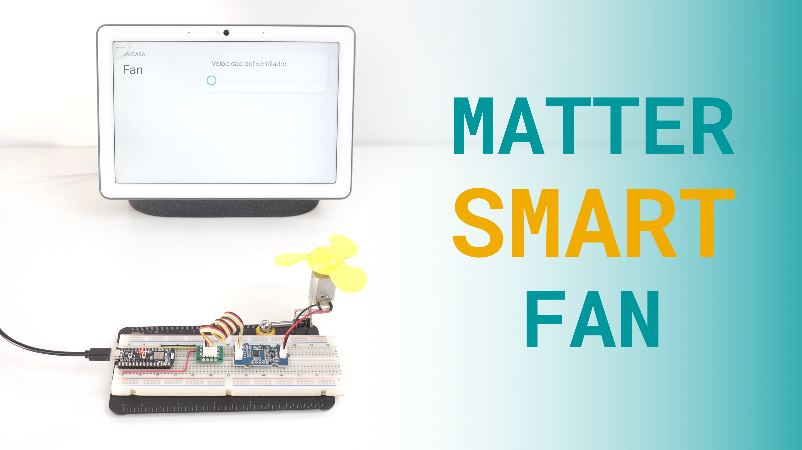
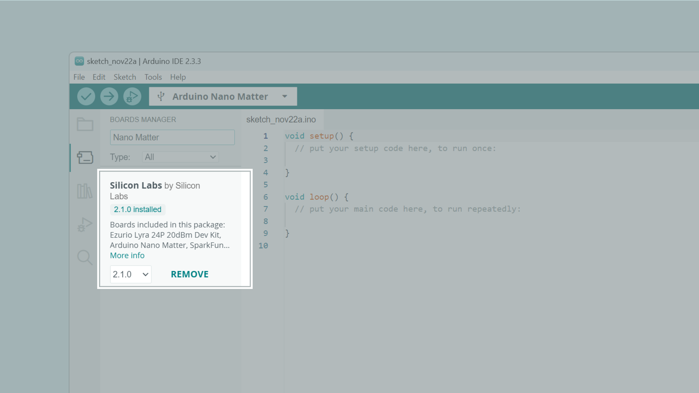
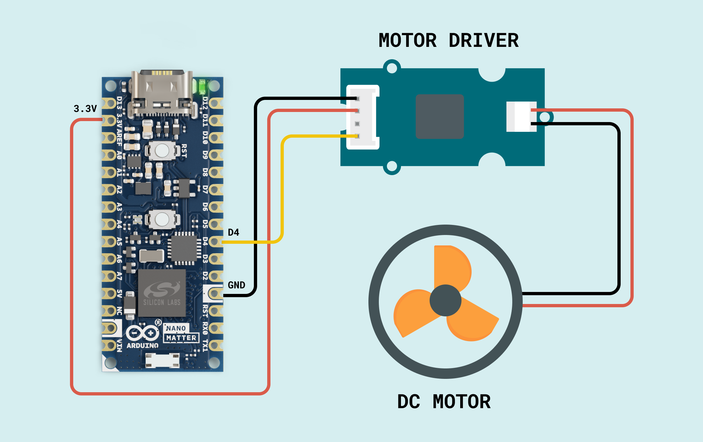
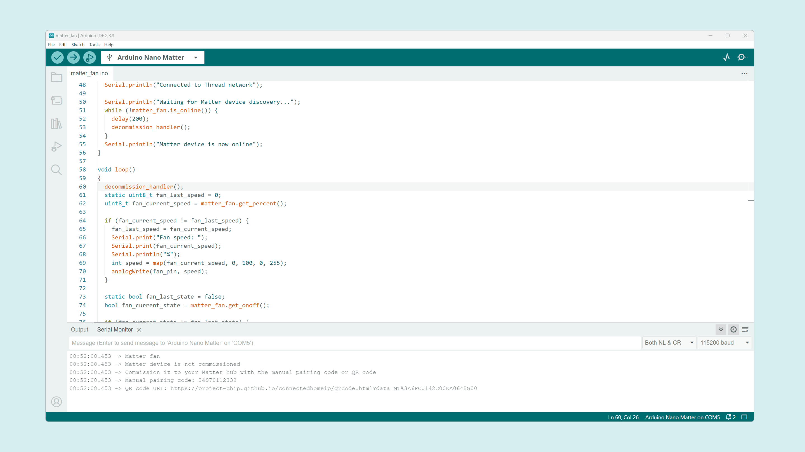
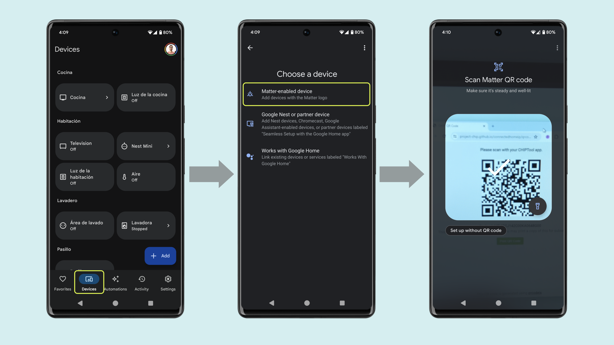
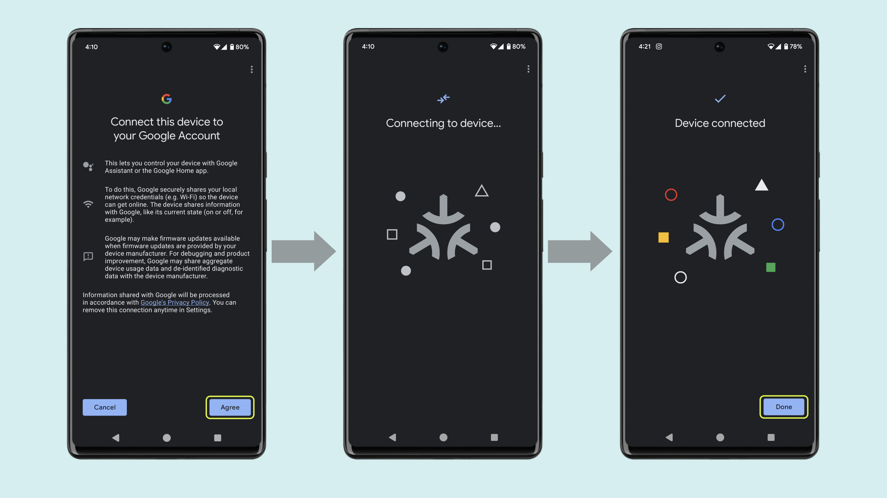

## Overview

This tutorial will teach you how to use the Arduino Nano Matter to create a Matter fan to keep you cool. 



Thanks to the seamless compatibility of the Nano Matter with almost any Matter network we can easily integrate our fan with Amazon Alexa, Google Assistant, Apple Home, Home Assistant and even any professional custom solution.

We have prepared a short demo in video format in case you are a visual learner.

<iframe width="100%" height="480" src="https://www.youtube.com/embed/AiFm4T9EfnA" title="YouTube video player" frameborder="0" allow="accelerometer; autoplay; clipboard-write; encrypted-media; gyroscope; picture-in-picture; web-share" allowfullscreen></iframe>

## Hardware and Software Requirements
### Hardware Requirements

- [Arduino Nano Matter](https://store.arduino.cc/products/nano-matter) (x1)
- Grove motor driver module (x1)
- DC motor (x1)
- Breadboard (x1)
- Jumper wires
- Google Nest Hub Max (Thread Border Router) (x1)
- [USB-C® cable](https://store.arduino.cc/products/usb-cable2in1-type-c) (x1)

### Software Requirements

- [Arduino IDE 2.0+](https://www.arduino.cc/en/software) or [Arduino Cloud Editor](https://create.arduino.cc/editor)
- [Google Home App](https://home.google.com/get-app/)

### Download the Project Code

[](assets/matter_fan.zip)

Download the complete project code [here](assets/matter_fan.zip).

### Board Core and Libraries

The **Silicon Labs** core contains the libraries and examples you need to work with the board's components, such as its Matter, Bluetooth® Low Energy, and I/Os. To install the Nano Matter core, navigate to **Tools > Board > Boards Manager** or click the Boards Manager icon in the left tab of the IDE. In the Boards Manager tab, search for `Nano Matter` and install the latest `Silicon Labs` core version.



## Project Setup

### Schematic Diagram

Use the following connection diagram for the project:



The motor driver module is powered by the `3.3V` Nano Matter output pin. The motor speed is controlled by a PWM signal generated by the pin `D4`.

### Programming

In the Arduino IDE upper menu, navigate to **Tools > Protocol stack** and select **Matter**.


Copy and paste the following sketch:

```arduino
#include <Matter.h>
#include <MatterFan.h>

#define fan_pin D4

MatterFan matter_fan;

void setup()
{
  Serial.begin(115200);
  Matter.begin();
  matter_fan.begin();

  pinMode(BTN_BUILTIN, INPUT_PULLUP);
  pinMode(LEDR, OUTPUT);
  digitalWrite(LEDR, HIGH);

  pinMode(fan_pin, OUTPUT);

  Serial.println("Matter fan");

  if (!Matter.isDeviceCommissioned()) {
    Serial.println("Matter device is not commissioned");
    Serial.println("Commission it to your Matter hub with the manual pairing code or QR code");
    Serial.printf("Manual pairing code: %s\n", Matter.getManualPairingCode().c_str());
    Serial.printf("QR code URL: %s\n", Matter.getOnboardingQRCodeUrl().c_str());
  }
  while (!Matter.isDeviceCommissioned()) {
    delay(200);
  }

  Serial.println("Waiting for Thread network...");
  while (!Matter.isDeviceThreadConnected()) {
    delay(200);
    decommission_handler();
  }
  Serial.println("Connected to Thread network");

  Serial.println("Waiting for Matter device discovery...");
  while (!matter_fan.is_online()) {
    delay(200);
    decommission_handler();
  }
  Serial.println("Matter device is now online");
}

void loop()
{
  decommission_handler();
  static uint8_t fan_last_speed = 0;
  uint8_t fan_current_speed = matter_fan.get_percent();

  if (fan_current_speed != fan_last_speed) {
    fan_last_speed = fan_current_speed;
    Serial.print("Fan speed: ");
    Serial.print(fan_current_speed);
    Serial.println("%");
    int speed = map(fan_current_speed, 0, 100, 0, 255);
    analogWrite(fan_pin, speed);
  }

  static bool fan_last_state = false;
  bool fan_current_state = matter_fan.get_onoff();

  if (fan_current_state != fan_last_state) {
    fan_last_state = fan_current_state;
    if (fan_current_state) {
      Serial.println("Fan ON");
    } else {
      Serial.println("Fan OFF");
    }
  }
}

void decommission_handler()
{
  // If the button is not pressed or the device is not commissioned - return
  if (digitalRead(BTN_BUILTIN) != LOW || !Matter.isDeviceCommissioned()) {
    return;
  }

  // Store the time when the button was first pressed
  uint32_t start_time = millis();
  // While the button is being pressed
  while (digitalRead(BTN_BUILTIN) == LOW) {
    // Calculate the elapsed time
    uint32_t elapsed_time = millis() - start_time;
    // If the button has been pressed for less than 10 seconds, continue
    if (elapsed_time < 10000u) {
      yield();
      continue;
    }

    // Blink the LED to indicate the start of the decommissioning process
    for (uint8_t i = 0u; i < 10u; i++) {
      digitalWrite(LED_BUILTIN, !(digitalRead(LED_BUILTIN)));
      delay(100);
    }

    Serial.println("Starting decommissioning process, device will reboot...");
    Serial.println();
    digitalWrite(LED_BUILTIN, LED_BUILTIN_INACTIVE);
    // This function will not return
    // The device will restart once decommissioning has finished
    Matter.decommission();
  }
}
```

The structure of this example code is very simple, the main functions are explained below:

- In the `setup()` function we initialize the Matter connectivity and the fan output pin. 
- In the `loop()` function we listen to any fan control command sent from the smartphone or voice assistant and then adjust the fan speed setting the PWM signal accordingly.

Once you uploaded the example code to the Nano Matter, open the Serial Monitor and reset the board.



After the reset you will find on the serial port the URL that generates the QR for the Matter device commissioning.

### Adding the Device (Commissioning)

Copy and paste the QR code URL on your favorite web browser and a unique QR code will be generated for your board.

Go to your **Google Home** app, navigate to **devices** and tap on **Add**, select the **Matter-enabled device** option and scan the QR code.





## Final Results

Finally, you will be able to control the fan from your smartphone, hub or asking your personal assistant.


## Conclusion

In this tutorial we have learned how to create a Matter enabled fan that can be controlled from our smartphone and personal assistant. The Nano Matter allows us to seamlessly integrate our own custom or old fan as a commercial product with our current smart home ecosystem.

### Next Steps

You can take this solution even further by adding an external knob to adjust the fan speed manually or integrating an AC motor driver to control an actual ceiling fan.