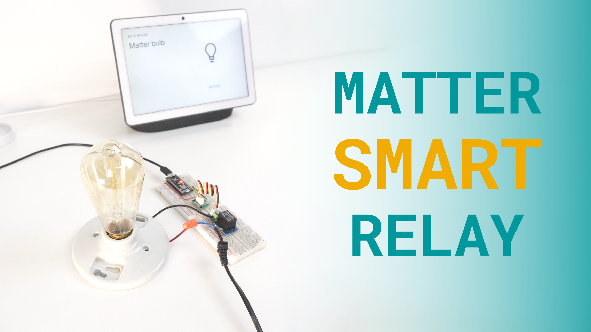

## Overview

This tutorial will teach you how to use the Arduino Nano Matter to create a Matter smart relay to control an AC lightbulb. 



Thanks to the seamless compatibility of the Nano Matter with almost any Matter network we can easily integrate our smart relay with Amazon Alexa, Google Assistant, Apple Home, Home Assistant and even any professional custom solution.

We have prepared a short demo in video format in case you are a visual learner.

<iframe width="100%" height="480" src="https://www.youtube.com/embed/8w-XDghqdEw" title="YouTube video player" frameborder="0" allow="accelerometer; autoplay; clipboard-write; encrypted-media; gyroscope; picture-in-picture; web-share" allowfullscreen></iframe>

## Hardware and Software Requirements
### Hardware Requirements

- [Arduino Nano Matter](https://store.arduino.cc/products/nano-matter) (x1)
- Grove Relay Module (x1)
- Lightbulb socket (x1)
- AC lightbulb (x1)
- AC cable (x1)
- Breadboard (x1)
- Jumper wires
- Google Nest Hub Max (Thread Border Router) (x1)
- [USB-C® cable](https://store.arduino.cc/products/usb-cable2in1-type-c) (x1)

### Software Requirements

- [Arduino IDE 2.0+](https://www.arduino.cc/en/software) or [Arduino Cloud Editor](https://create.arduino.cc/editor)
- [Google Home App](https://home.google.com/get-app/)

### Download the Project Code

[](assets/matter_smart_relay.zip)

Download the complete project code [here](assets/matter_smart_relay.zip).

### Board Core and Libraries

The **Silicon Labs** core contains the libraries and examples you need to work with the board's components, such as its Matter, Bluetooth® Low Energy, and I/Os. To install the Nano Matter core, navigate to **Tools > Board > Boards Manager** or click the Boards Manager icon in the left tab of the IDE. In the Boards Manager tab, search for `Nano Matter` and install the latest `Silicon Labs` core version.


## Project Setup

### Schematic Diagram

Use the following connection diagram for the project:


The relay module is powered by the Nano Matter `3.3V` output pin and the relay is controlled with the `D4` pin. Wire the AC cable with the lightbulb so the relay interrupts the current path when open.

***Be careful when handling with main voltages.***

### Programming

In the Arduino IDE upper menu, navigate to **Tools > Protocol stack** and select **Matter**.


Copy and paste the following sketch:

```arduino
#include <Matter.h>
#include <MatterLightbulb.h>

#define RELAY D4  // Relay output

MatterLightbulb matter_bulb;

void setup()
{
  Serial.begin(115200);
  Matter.begin();
  matter_bulb.begin();

  pinMode(BTN_BUILTIN, INPUT_PULLUP);

  pinMode(LED_BUILTIN, OUTPUT);
  digitalWrite(LED_BUILTIN, LED_BUILTIN_INACTIVE);

  pinMode(RELAY, OUTPUT);
  digitalWrite(RELAY, LOW);

  Serial.println("Matter lightbulb");

  if (!Matter.isDeviceCommissioned()) {
    Serial.println("Matter device is not commissioned");
    Serial.println("Commission it to your Matter hub with the manual pairing code or QR code");
    Serial.printf("Manual pairing code: %s\n", Matter.getManualPairingCode().c_str());
    Serial.printf("QR code URL: %s\n", Matter.getOnboardingQRCodeUrl().c_str());
  }
  while (!Matter.isDeviceCommissioned()) {
    delay(200);
  }

  Serial.println("Waiting for Thread network...");
  while (!Matter.isDeviceThreadConnected()) {
    delay(200);
    decommission_handler();
  }
  Serial.println("Connected to Thread network");

  Serial.println("Waiting for Matter device discovery...");
  while (!matter_bulb.is_online()) {
    delay(200);
    decommission_handler();
  }
  Serial.println("Matter device is now online");
}

void loop()
{
  decommission_handler();
  static bool matter_lightbulb_last_state = false;
  bool matter_lightbulb_current_state = matter_bulb.get_onoff();

  // If the current state is ON and the previous was OFF - turn on the LED
  if (matter_lightbulb_current_state && !matter_lightbulb_last_state) {
    matter_lightbulb_last_state = matter_lightbulb_current_state;
    digitalWrite(LED_BUILTIN, LED_BUILTIN_ACTIVE);
    digitalWrite(RELAY, HIGH);
    Serial.println("Bulb ON");
  }

  // If the current state is OFF and the previous was ON - turn off the LED
  if (!matter_lightbulb_current_state && matter_lightbulb_last_state) {
    matter_lightbulb_last_state = matter_lightbulb_current_state;
    digitalWrite(LED_BUILTIN, LED_BUILTIN_INACTIVE);
    digitalWrite(RELAY, LOW);
    Serial.println("Bulb OFF");
  }
}

void decommission_handler()
{
  // If the button is not pressed or the device is not commissioned - return
  if (digitalRead(BTN_BUILTIN) != LOW || !Matter.isDeviceCommissioned()) {
    return;
  }

  // Store the time when the button was first pressed
  uint32_t start_time = millis();
  // While the button is being pressed
  while (digitalRead(BTN_BUILTIN) == LOW) {
    // Calculate the elapsed time
    uint32_t elapsed_time = millis() - start_time;
    // If the button has been pressed for less than 10 seconds, continue
    if (elapsed_time < 10000u) {
      yield();
      continue;
    }

    // Blink the LED to indicate the start of the decommissioning process
    for (uint8_t i = 0u; i < 10u; i++) {
      digitalWrite(LED_BUILTIN, !(digitalRead(LED_BUILTIN)));
      delay(100);
    }

    Serial.println("Starting decommissioning process, device will reboot...");
    Serial.println();
    digitalWrite(LED_BUILTIN, LED_BUILTIN_INACTIVE);
    // This function will not return
    // The device will restart once decommissioning has finished
    Matter.decommission();
  }
}

```

The structure of this example code is very simple, the main functions are explained below:

- In the `setup()` function we initialize the Matter connectivity and the relay output pin. 
- In the `loop()` function we listen to any relay toggle command sent from the smartphone or voice assistant.

Once you uploaded the example code to the Nano Matter, open the Serial Monitor and reset the board.


After the reset you will find on the serial port the URL that generates the QR for the Matter device commissioning.

### Adding the Device (Commissioning)

Copy and paste the QR code URL on your favorite web browser and a unique QR code will be generated for your board.

Go to your **Google Home** app, navigate to **devices** and tap on **Add**, select the **Matter-enabled device** option and scan the QR code.


## Final Results

Finally, you will be able to control the AC lightbulb from your smartphone, hub or asking your personal assistant.


## Conclusion

In this tutorial we have learned how to create a Matter enabled smart relay that can be controlled from our smartphone and personal assistant. The Nano Matter allows us to seamlessly integrate our own smart relay as a commercial product with our current smart home ecosystem.

### Next Steps

You can take this solution even further by adding several relay channels or solid state relays to control more than one load.