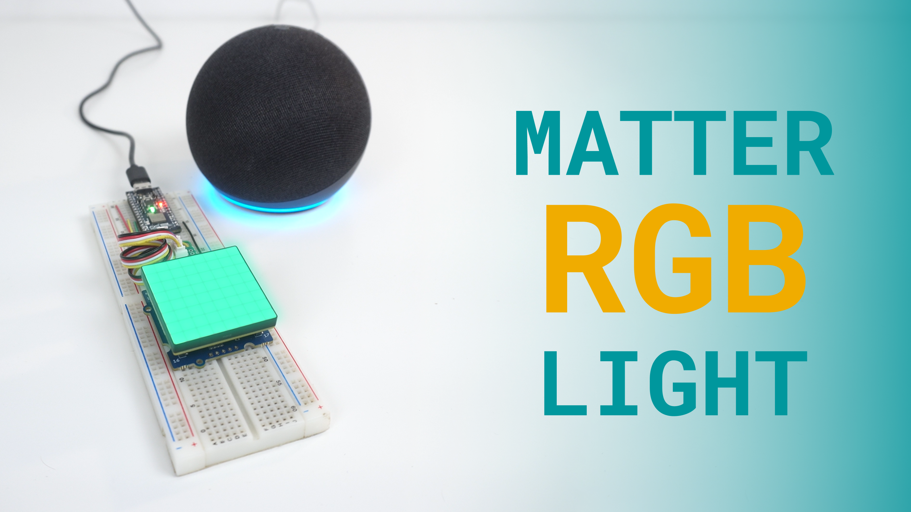
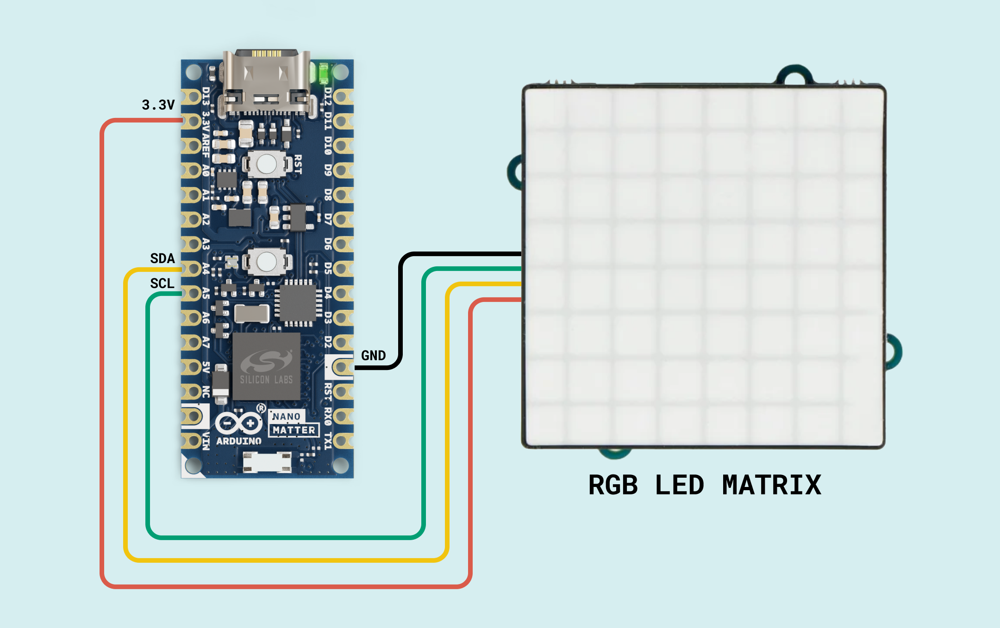
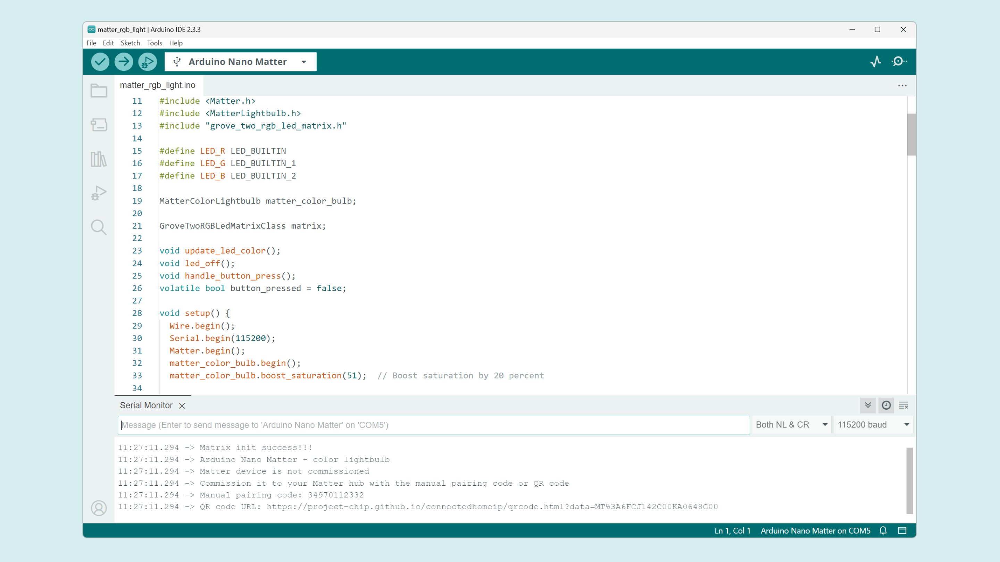
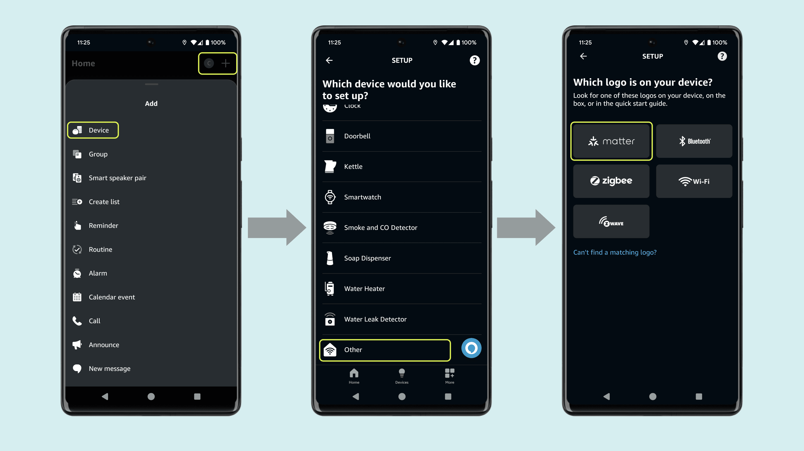
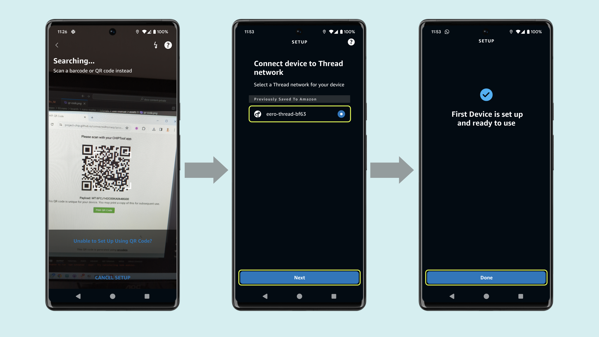

## Overview

This tutorial will teach you how to use the Arduino Nano Matter to create a Matter RGB Lightbulb to light up any room with colors. 



Thanks to the seamless compatibility of the Nano Matter with almost any Matter network we can easily integrate our RGB light with Amazon Alexa, Google Assistant, Apple Home, Home Assistant and even any professional custom solution.

We have prepared a short demo in video format in case you are a visual learner.

<iframe width="100%" height="480" src="https://www.youtube.com/embed/OsZ8-_djK9c" title="YouTube video player" frameborder="0" allow="accelerometer; autoplay; clipboard-write; encrypted-media; gyroscope; picture-in-picture; web-share" allowfullscreen></iframe>

## Hardware and Software Requirements
### Hardware Requirements

- [Arduino Nano Matter](https://store.arduino.cc/products/nano-matter) (x1)
- Grove - 8x8 RGB LED Matrix (x1)
- Breadboard (x1)
- Jumper wires
- Eero 6+ WiFi Extender (Thread Border Router) (x1)
- [USB-C® cable](https://store.arduino.cc/products/usb-cable2in1-type-c) (x1)

### Software Requirements

- [Arduino IDE 2.0+](https://www.arduino.cc/en/software) or [Arduino Cloud Editor](https://create.arduino.cc/editor)
- [Amazon Alexa](https://www.amazon.com/Alexa-App/b?ie=UTF8&node=18354642011)
- [Seeed_RGB_LED_Matrix](https://github.com/Seeed-Studio/Seeed_RGB_LED_Matrix) library to control the RGB LED matrix. You can install it as .ZIP using the Arduino IDE.

### Download the Project Code

[](assets/matter_rgb_light.zip)

Download the complete project code [here](assets/matter_rgb_light.zip).

### Board Core and Libraries

The **Silicon Labs** core contains the libraries and examples you need to work with the board's components, such as its Matter, Bluetooth® Low Energy, and I/Os. To install the Nano Matter core, navigate to **Tools > Board > Boards Manager** or click the Boards Manager icon in the left tab of the IDE. In the Boards Manager tab, search for `Nano Matter` and install the latest `Silicon Labs` core version.


## Project Setup

### Schematic Diagram

Use the following connection diagram for the project:



The RGB LED matrix is powered by the Nano Matter `3.3V` output pin, and it is controlled using an I2C connection.

### Programming

In the Arduino IDE upper menu, navigate to **Tools > Protocol stack** and select **Matter**.


Copy and paste the following sketch:

```arduino
#include <Matter.h>
#include <MatterLightbulb.h>
#include "grove_two_rgb_led_matrix.h"

#define LED_R LED_BUILTIN
#define LED_G LED_BUILTIN_1
#define LED_B LED_BUILTIN_2

MatterColorLightbulb matter_color_bulb;

GroveTwoRGBLedMatrixClass matrix;

void update_led_color();
void led_off();
void handle_button_press();
volatile bool button_pressed = false;

void setup() {
  Wire.begin();
  Serial.begin(115200);
  Matter.begin();
  matter_color_bulb.begin();
  matter_color_bulb.boost_saturation(51);  // Boost saturation by 20 percent

  // Set up the onboard button
  pinMode(BTN_BUILTIN, INPUT_PULLUP);
  attachInterrupt(BTN_BUILTIN, &handle_button_press, FALLING);

  uint16_t VID = 0;
  VID = matrix.getDeviceVID();
  if (VID != 0x2886) {
    Serial.println("Can not detect led matrix!!!");
    while (1)
      ;
  }
  Serial.println("Matrix init success!!!");

  matrix.stopDisplay();

  // Turn the LED off
  led_off();

  Serial.println("Arduino Nano Matter - color lightbulb");

  if (!Matter.isDeviceCommissioned()) {
    Serial.println("Matter device is not commissioned");
    Serial.println("Commission it to your Matter hub with the manual pairing code or QR code");
    Serial.printf("Manual pairing code: %s\n", Matter.getManualPairingCode().c_str());
    Serial.printf("QR code URL: %s\n", Matter.getOnboardingQRCodeUrl().c_str());
  }
  while (!Matter.isDeviceCommissioned()) {
    delay(200);
  }

Serial.println("Waiting for Thread network...");
  while (!Matter.isDeviceThreadConnected()) {
    delay(200);
  }
  Serial.println("Connected to Thread network");

  Serial.println("Waiting for Matter device discovery...");
  while (!matter_color_bulb.is_online()) {
    delay(200);
  }
  Serial.println("Matter device is now online");

}

void loop() {
  // If the physical button state changes - update the lightbulb's on/off state
  if (button_pressed) {
    button_pressed = false;
    // Toggle the on/off state of the lightbulb
    matter_color_bulb.toggle();
  }

  // Get the current on/off state of the lightbulb
  static bool matter_lightbulb_last_state = false;
  bool matter_lightbulb_current_state = matter_color_bulb.get_onoff();

  // If the current state is ON and the previous was OFF - turn on the LED
  if (matter_lightbulb_current_state && !matter_lightbulb_last_state) {
    matter_lightbulb_last_state = matter_lightbulb_current_state;
    Serial.println("Bulb ON");
    // Set the LEDs to the last received state
    update_led_color();
  }

  // If the current state is OFF and the previous was ON - turn off the LED
  if (!matter_lightbulb_current_state && matter_lightbulb_last_state) {
    matter_lightbulb_last_state = matter_lightbulb_current_state;
    Serial.println("Bulb OFF");
    led_off();
  }

  static uint8_t hue_prev = 0;
  static uint8_t saturation_prev = 0;
  static uint8_t brightness_prev = 0;
  uint8_t hue_curr = matter_color_bulb.get_hue();
  uint8_t saturation_curr = matter_color_bulb.get_saturation_percent();
  uint8_t brightness_curr = matter_color_bulb.get_brightness_percent();

  // If either the hue, saturation or the brightness changes - update the LED to reflect the latest change
  if (hue_prev != hue_curr || saturation_prev != saturation_curr || brightness_prev != brightness_curr) {
    update_led_color();
    hue_prev = hue_curr;
    saturation_prev = saturation_curr;
    brightness_prev = brightness_curr;
  }
}

// Updates the color of the RGB LED to match the Matter lightbulb's color
void update_led_color() {
  if (!matter_color_bulb.get_onoff()) {
    return;
  }
  uint8_t r, g, b;
  matter_color_bulb.get_rgb(&r, &g, &b);
// If our built-in LED is active LOW, we need to invert the brightness values
  if (LED_BUILTIN_ACTIVE == LOW) {
    analogWrite(LED_R, 255 - r);
    analogWrite(LED_G, 255 - g);
    analogWrite(LED_B, 255 - b);
  } else {
    analogWrite(LED_R, r);
    analogWrite(LED_G, g);
    analogWrite(LED_B, b);
  }

  uint32_t RGB = ((uint8_t)r << 16L) | ((uint8_t)g << 8L) | (uint8_t)b;
  matrix.displayColorBlock(RGB, 0, true);

  Serial.printf("Setting bulb color to > r: %u  g: %u  b: %u\n", r, g, b);
}

// Turns the RGB LED off
void led_off() {
  // If our built-in LED is active LOW, we need to invert the brightness values
  if (LED_BUILTIN_ACTIVE == LOW) {
    analogWrite(LED_R, 255);
    analogWrite(LED_G, 255);
    analogWrite(LED_B, 255);
  } else {
    analogWrite(LED_R, 0);
    analogWrite(LED_G, 0);
    analogWrite(LED_B, 0);
  }
  matrix.stopDisplay();
}

void handle_button_press() {
  static uint32_t btn_last_press = 0;
  if (millis() < btn_last_press + 200) {
    return;
  }
  btn_last_press = millis();
  button_pressed = true;
}
```
The structure of this example code is very simple, the main functions are explained below:

- In the `setup()` function we initialize the Matter connectivity and the RGB Matrix I2C communication. 
- In the `loop()` function we listen to any request of controlling the lightbulb state or color and update the matrix respectively.
- There are some other functions to handle button press or RGB matrix color setup.

Once you uploaded the example code to the Nano Matter, open the Serial Monitor and reset the board.



After the reset you will find on the serial port the URL that generates the QR for the Matter device commissioning.

### Adding the Device (Commissioning)

Copy and paste the QR code URL on your favorite web browser and a unique QR code will be generated for your board.

Go to your **Amazon Alexa** app, navigate to **Devices > Add Device > Other**, select the **Matter** option and scan the QR code.





## Final Results

Finally, you will be able to control the RGB light from your smartphone, hub or asking your personal assistant.


## Conclusion

In this tutorial we have learned how to create a Matter enabled RGB light that can be controlled from our smartphone and personal assistant. The Nano Matter allows us to seamlessly integrate our own light as a commercial product with our current smart home ecosystem.

### Next Steps

You can take this solution even further by adding fading animations or even using the matrix to display text or graphics.