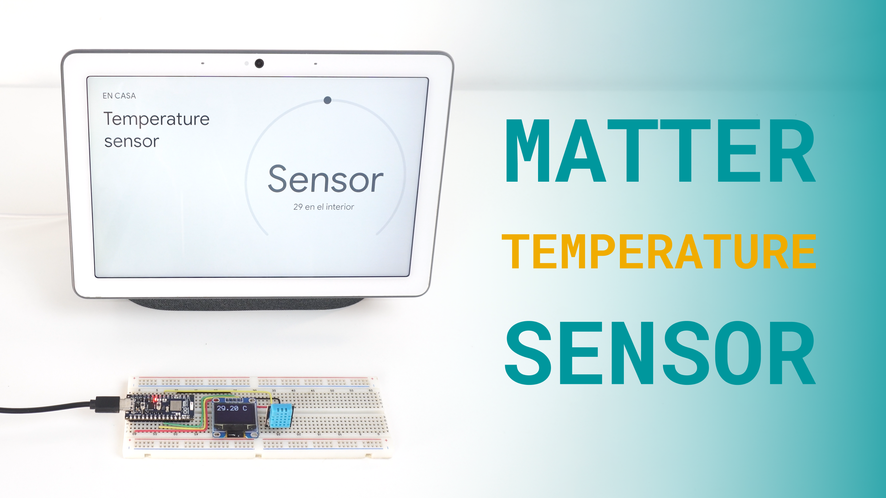
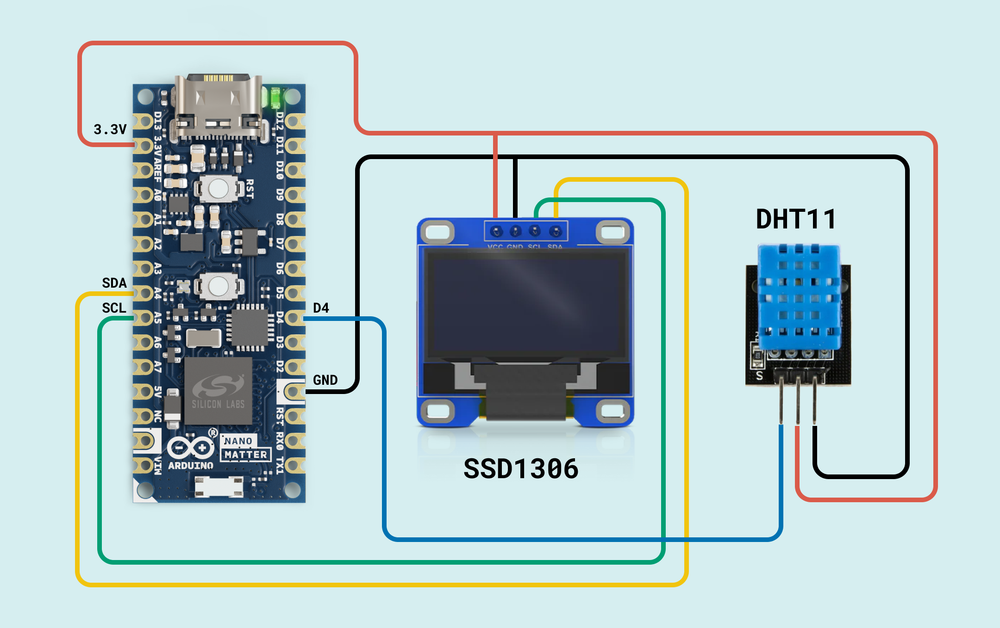
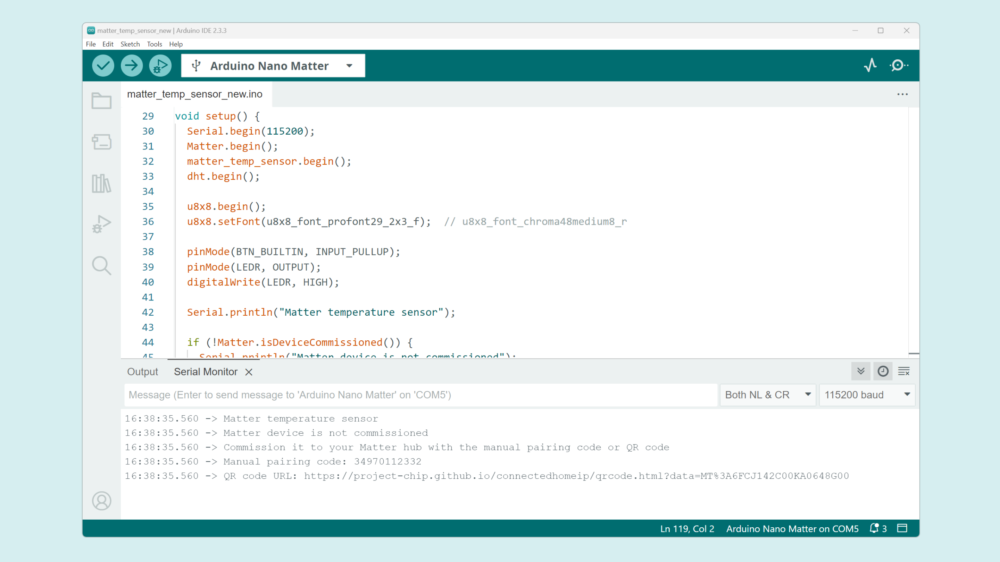
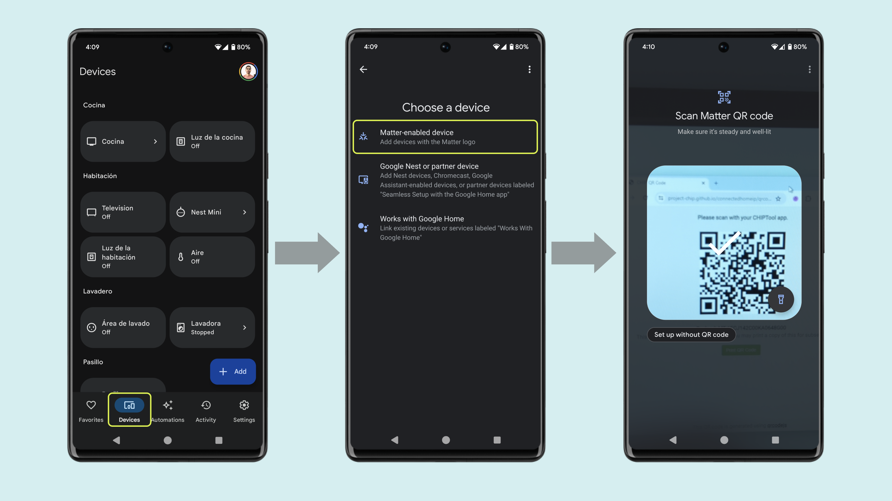
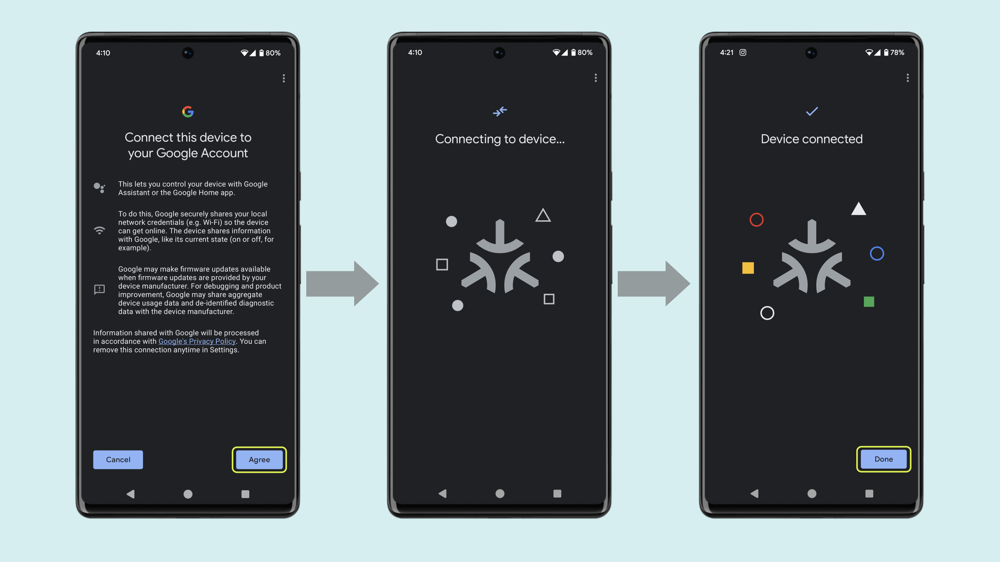

## Overview

This tutorial will teach you how to use the Arduino Nano Matter to create a Matter sensor to monitor your room or workplace temperature. 



Thanks to the seamless compatibility of the Nano Matter with almost any Matter network we can easily integrate our sensor with Amazon Alexa, Google Assistant, Apple Home, Home Assistant and even any professional custom solution.

We have prepared a short demo in video format in case you are a visual learner.

<iframe width="100%" height="480" src="https://www.youtube.com/embed/kYcF_HjyLeg" title="YouTube video player" frameborder="0" allow="accelerometer; autoplay; clipboard-write; encrypted-media; gyroscope; picture-in-picture; web-share" allowfullscreen></iframe>

## Hardware and Software Requirements
### Hardware Requirements

- [Arduino Nano Matter](https://store.arduino.cc/products/nano-matter) (x1)
- DHT11 Temperature and Humidity sensor (x1)
- I2C OLED Display SSD1306 (x1)
- Breadboard (x1)
- Jumper wires
- Google Nest Hub Max (Thread Border Router) (x1)
- [USB-C® cable](https://store.arduino.cc/products/usb-cable2in1-type-c) (x1)

### Software Requirements

- [Arduino IDE 2.0+](https://www.arduino.cc/en/software) or [Arduino Cloud Editor](https://create.arduino.cc/editor)
- [Google Home App](https://home.google.com/get-app/)
- [U8g2](https://github.com/olikraus/u8g2) library to control the OLED display. You can install it from the Arduino IDE library manager.
- [DHT](https://github.com/mcmchris/DHT-sensor-library/tree/patch-1) library. Download from this [branch](https://github.com/mcmchris/DHT-sensor-library/tree/patch-1) so it supports the Nano Matter.

### Download the Project Code

[](assets/matter_temperature_sensor.zip)
Download the complete project code [here](assets/matter_temperature_sensor.zip).

### Board Core and Libraries

The **Silicon Labs** core contains the libraries and examples you need to work with the board's components, such as its Matter, Bluetooth® Low Energy, and I/Os. To install the Nano Matter core, navigate to **Tools > Board > Boards Manager** or click the Boards Manager icon in the left tab of the IDE. In the Boards Manager tab, search for `Nano Matter` and install the latest `Silicon Labs` core version.


## Project Setup

### Schematic Diagram

Use the following connection diagram for the project:



The OLED display and the DHT temperature sensor are powered by the Nano Matter `3.3V` output pin. The OLED display uses I2C for communication and the DHT sensor uses a one-wire digital communication connected to `D4`.

### Programming

In the Arduino IDE upper menu, navigate to **Tools > Protocol stack** and select **Matter**.


Copy and paste the following sketch:

```arduino
#include <Matter.h>
#include <MatterTemperature.h>
#include "DHT.h"
#include <U8x8lib.h>
#include <Wire.h>

U8X8_SSD1306_128X64_NONAME_HW_I2C u8x8(/* clock=*/SCL, /* data=*/SDA, /* reset=*/U8X8_PIN_NONE);  // OLEDs without Reset of the Display

MatterTemperature matter_temp_sensor;

#define DHTPIN D4  // Digital pin connected to the DHT sensor

#define DHTTYPE DHT11

DHT dht(DHTPIN, DHTTYPE);

float temp = 0;

void setup() {
  Serial.begin(115200);
  Matter.begin();
  matter_temp_sensor.begin();
  dht.begin();

  u8x8.begin();
  u8x8.setFont(u8x8_font_profont29_2x3_f);  // u8x8_font_chroma48medium8_r

  pinMode(BTN_BUILTIN, INPUT_PULLUP);
  pinMode(LEDR, OUTPUT);
  digitalWrite(LEDR, HIGH);

  Serial.println("Matter temperature sensor");

  if (!Matter.isDeviceCommissioned()) {
    Serial.println("Matter device is not commissioned");
    Serial.println("Commission it to your Matter hub with the manual pairing code or QR code");
    Serial.printf("Manual pairing code: %s\n", Matter.getManualPairingCode().c_str());
    Serial.printf("QR code URL: %s\n", Matter.getOnboardingQRCodeUrl().c_str());
  }
  while (!Matter.isDeviceCommissioned()) {
    delay(200);
    decommission_handler();
  }

  Serial.println("Waiting for Thread network...");
  while (!Matter.isDeviceThreadConnected()) {
    delay(200);
    decommission_handler();
  }
  Serial.println("Connected to Thread network");

  Serial.println("Waiting for Matter device discovery...");
  while (!matter_temp_sensor.is_online()) {
    delay(200);
    decommission_handler();
  }
  Serial.println("Matter device is now online");
}

void loop() {
  temp = dht.readTemperature();

  if (!isnan(temp)) {
    matter_temp_sensor.set_measured_value_celsius(temp);
    Serial.printf("Current CPU temperature: %.02f C\n", temp);

    upDateValue(temp);
  }

  delay(2000);
  decommission_handler();
}

void upDateValue(float t) {
  u8x8.setCursor(0, 0);
  u8x8.print(t);
  u8x8.print(" C");
}

void decommission_handler() {
  if (digitalRead(BTN_BUILTIN) == LOW) {  //Push button pressed
    // measures time pressed
    int startTime = millis();
    while (digitalRead(BTN_BUILTIN) == LOW) {

      int elapsedTime = (millis() - startTime) / 1000.0;

      if (elapsedTime > 10) {
        Serial.printf("Decommissioning!\n");
        for (int i = 0; i < 10; i++) {
          digitalWrite(LEDR, !(digitalRead(LEDR)));
          delay(100);
        };

        if (!Matter.isDeviceCommissioned()) {
          Serial.println("Decommission done!");
          digitalWrite(LEDR, LOW);
          Matter.decommission();
        } else {
          Serial.println("Matter device is commissioned-> Starting Decommission process");
          digitalWrite(LED_BUILTIN, LOW);
          Serial.println("Decommission done!");
          Matter.decommission();
        }
        break;
      }
    }
  }
}
```

The structure of this example code is very simple, the main functions are explained below:

- In the `setup()` function we initialize the Matter connectivity, the OLED display and temperature sensor. 
- In the `loop()` function we measure the temperature and update the device value to be monitored in the Matter network.

Once you uploaded the example code to the Nano Matter, open the Serial Monitor and reset the board.



After the reset you will find on the serial port the URL that generates the QR for the Matter device commissioning.

### Adding the Device (Commissioning)

Copy and paste the QR code URL on your favorite web browser and a unique QR code will be generated for your board.

Go to your **Google Home** app, navigate to **devices** and tap on **Add**, select the **Matter-enabled device** option and scan the QR code.





## Final Results

Finally, you will be able to monitor your room temperature from your smartphone, hub or asking your personal assistant.


You can also see the temperature value on the device OLED display.

## Conclusion

In this tutorial we have learned how to create a Matter enabled temperature sensor that can be monitored from our smartphone and personal assistant. The Nano Matter allows us to seamlessly integrate our own sensor as a commercial product with our current smart home ecosystem.

### Next Steps

You can take this solution even further by adding the humidity measuring capability of the DHT11 sensor and integrate it as a second sensor to your Matter network.

