## Introduction

Thread is a low-power, wireless mesh networking protocol for smart homes and Internet of Things (IoT) devices. A Thread Border Router serves as a bridge between the Thread network and the wider Internet or local networks, allowing devices within the Thread network to communicate with external systems.

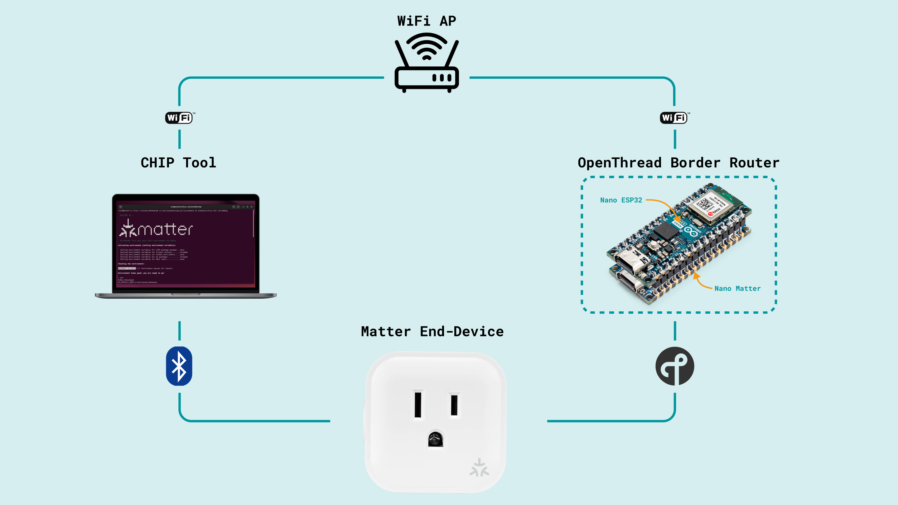

Matter devices can use Thread as their primary communication method, especially for low-power devices such as sensors, light bulbs, and door locks. These devices use the Thread protocol and leverage Matter's application layer for interoperability.

### OpenThread Border Router

An OpenThread Border Router (OTBR) consists of a **Matter Controller** and a **Radio Co-Processor** (RCP):

- The *Matter Controller* is essential for managing devices using the Matter protocol, which ensures interoperability between nodes. It handles: commissioning, communication and network management.
- The *Radio Co-Processor* (RCP) is dedicated to handling Thread network communications, improving efficiency by offloading radio communication tasks.

The **Nano Matter** is the **RCP**, connected to the **Nano ESP32** (the Matter Controller) via serial port.

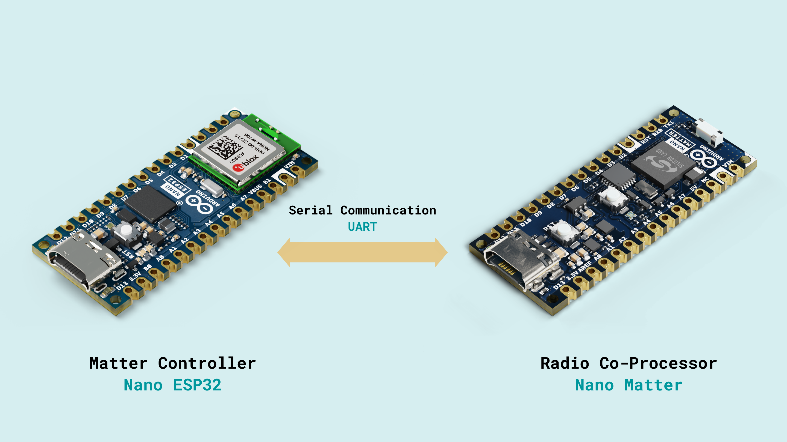

## Goals

This tutorial's main objective is to guide you through the build and configuration of an OpenThread Border Router. This router will allow you to deploy a Matter network over Thread and integrate Matter devices into your Smart Home system.

- Create an OTBR using Arduino products.
- Leverage the Nano Matter as a Radio Co-Processor (RCP).
- Use the Nano ESP32 as a Matter Controller.
- Integrate a smart outlet based on the Nano Matter to your network.

## Hardware and Software Requirements

### Hardware Requirements

- [Nano Matter](https://store.arduino.cc/products/nano-matter) (x2)
- [Nano ESP32](https://store.arduino.cc/products/nano-esp32) (x1)
- Linux Computer (Laptop/PC) (x1)
- [USB-C® cable](https://store.arduino.cc/products/usb-cable2in1-type-c) (x1)

### Software Requirements

- [Arduino IDE 2.0+](https://www.arduino.cc/en/software)
- [Silicon Labs Core](https://docs.arduino.cc/tutorials/nano-matter/user-manual/#board-core-and-libraries)
- [Simplicity Studio](https://www.silabs.com/developers/simplicity-studio)
- [Visual Studio Code](https://code.visualstudio.com/)

  
## Setting up the OTBR

### The RCP: Nano Matter

This section outlines the steps to build the RCP firmware for the Nano Matter.

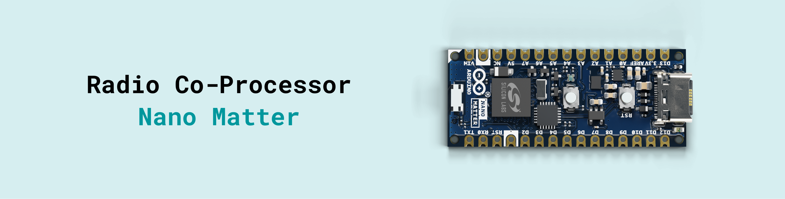

#### Ready to Flash Binary

We recommend you to use this pre-compiled binary to flash your Nano Matter board.

- Download the `.hex` binary from [here](assets/nano-matter-ot-rcp-uart.zip) and locate it on a known directory.
- Open any text editor and paste the following command:

```bash
/Users/<username>/AppData/Local/Arduino15/packages/SiliconLabs/tools/openocd/0.12.0-arduino1-static/bin/openocd -d2 -s /Users/<username>/AppData/Local/Arduino15/packages/SiliconLabs/tools/openocd/0.12.0-arduino1-static/share/openocd/scripts/ -f interface/cmsis-dap.cfg -f target/efm32s2_g23.cfg -c "init; reset_config srst_nogate; reset halt; program <project-directory>; reset; exit"
```

- Update the `username` field with yours.
- Update the `project-directory` field with the binary directory you downloaded in the previous step.
- Open the Command Prompt and paste the formatted command.
- Connect the Nano Matter to your PC using a USB-C® cable.
- Run the command and verify the download process was successful.

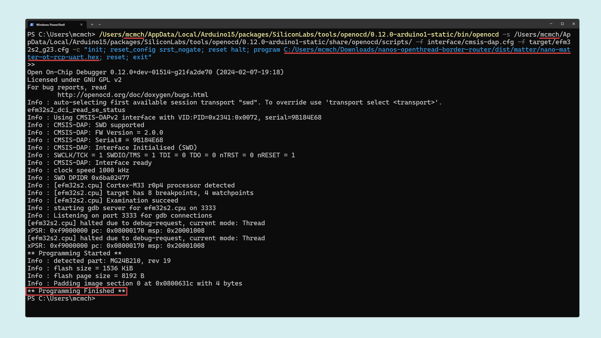

***Make sure to have the [Silicon Labs core](https://docs.arduino.cc/tutorials/nano-matter/user-manual/#board-core-and-libraries) installed on your Arduino IDE so you can use the __openocd__ tool for flashing.***

From here, jump directly to the [Matter Controller section](https://docs.arduino.cc/tutorials/nano-matter/open-thread-border-router/#the-matter-controller-nano-esp32).

#### Build the Binary From Scratch (Optional)

If you want to build the Nano Matter program by yourself, follow the steps below:

- Download Simplicity Studio. Silicon Labs provides this IDE, which is designed to simplify the development process for Silicon Labs hardware platforms. Download latest version [here](https://www.silabs.com/developers/simplicity-studio).

- Open Simplicity Studio and create a new project by clicking **File > New > Silicon Labs Project Wizard**.
  
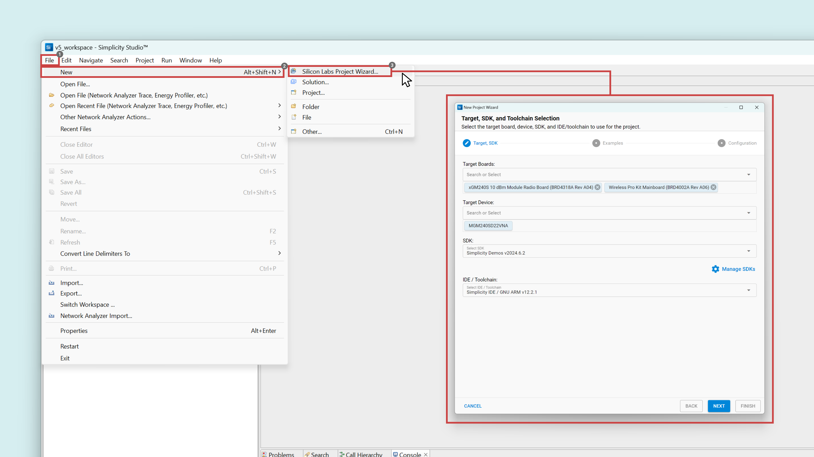

- Set the following project configurations and click on *Next*.

|   **Field**   |                     **Setting**                      |
| :-----------: | :--------------------------------------------------: |
| Target Boards | xGM240S 10 dBm Module Radio Board (BRD4318A Rev A04) |
| Target Device |                    MGM240SD22VNA                     |

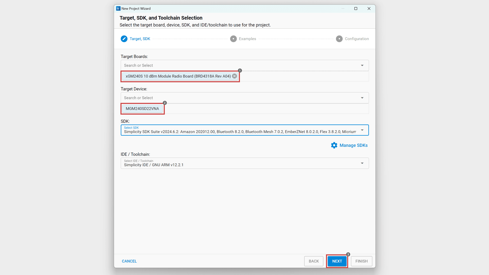

- In the *Examples* tab search for the **OpenThread - RCP** example, select it and click on *Next*.

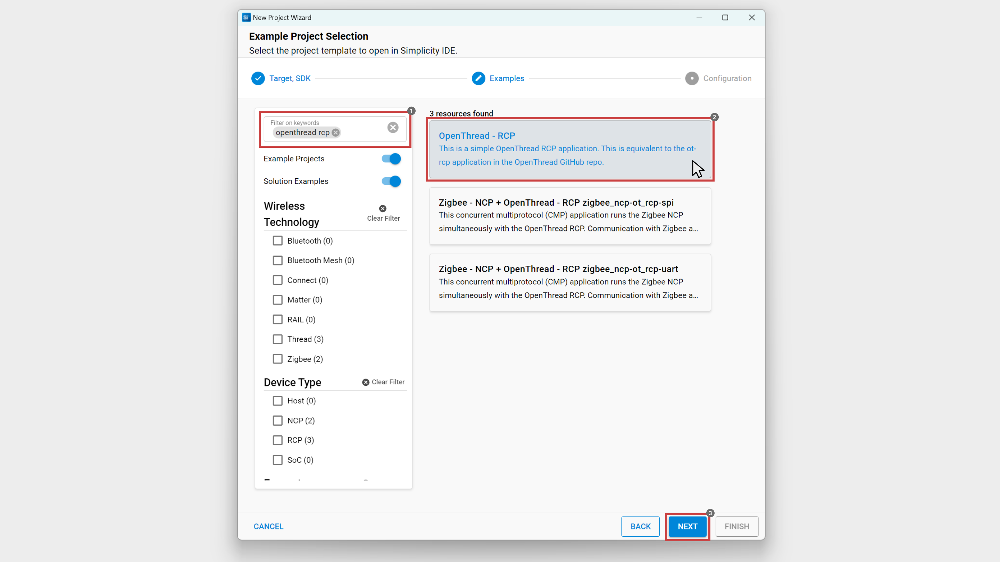

- In the *Configuration* tab give the project a name and click on *Finish*.

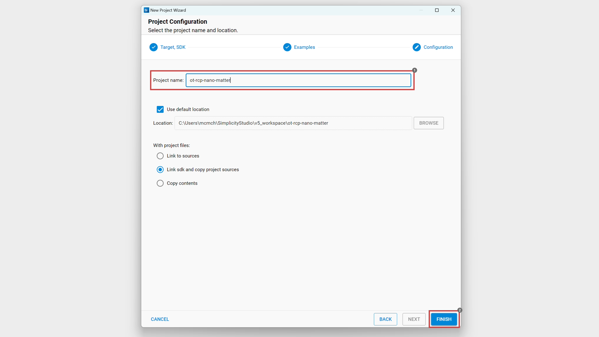

#### Change the Serial Port Pinout

The default pinout is **PA8 > TX** and **PA9 > RX**, but we need to change it to **PA4 > TX** and **PA5 > RX**, so they correspond to the **D0** and **D1** of the standard Nano layout.

- Delete the default `USART0` setting:

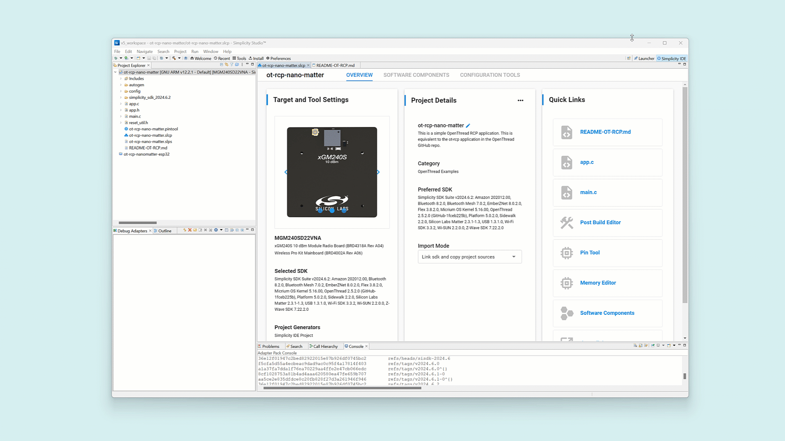

- Add the new setting:


- Save your project with the new configurations.

#### Disable USART Flow Control

- Open the `<project-folder>/config/sl_uartdrv_usart_vcom_config.h` file.
  
- Modify the `SL_UARTDRV_USART_VCOM_FLOW_CONTROL_TYPE` variable as follows:
```
#define SL_UARTDRV_USART_VCOM_FLOW_CONTROL_TYPE uartdrvFlowControlNone
```

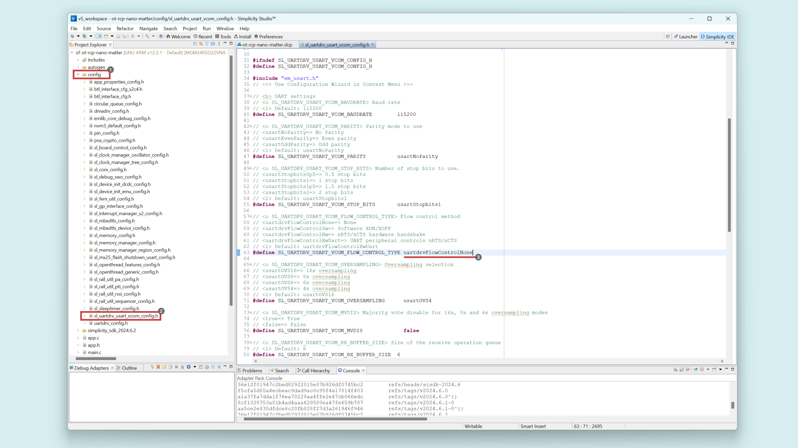

#### Build and Flash the Project

- In the upper menu navigate to **Project > Build Project** to compile and build the RCP firmware.

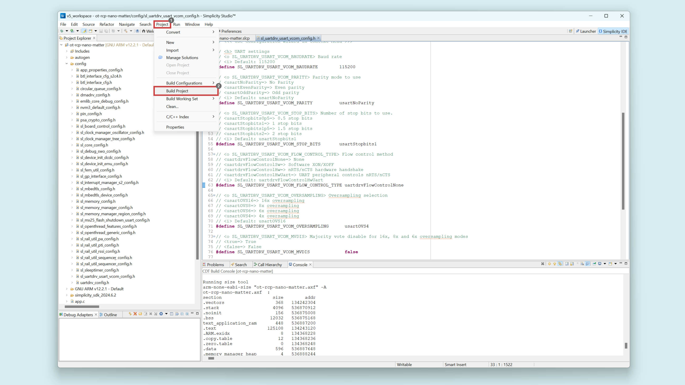

- In your project directory navigate to the `/GNU ARM v12.2.1 - Default/` folder, right click on it and open a **Command Line**.

Use the following command to flash the firmware to the Nano Matter, make sure to modify the `<username>` and `<project name>` with yours:

```bash
/Users/<your-username>/AppData/Local/Arduino15/packages/SiliconLabs/tools/openocd/0.12.0-arduino1-static/bin/openocd -d2 -s /Users/<your-username>/AppData/Local/Arduino15/packages/SiliconLabs/tools/openocd/0.12.0-arduino1-static/share/openocd/scripts/ -f interface/cmsis-dap.cfg -f target/efm32s2_g23.cfg -c "init; reset_config srst_nogate; reset halt; program {<project-name>.hex}; reset; exit"
```

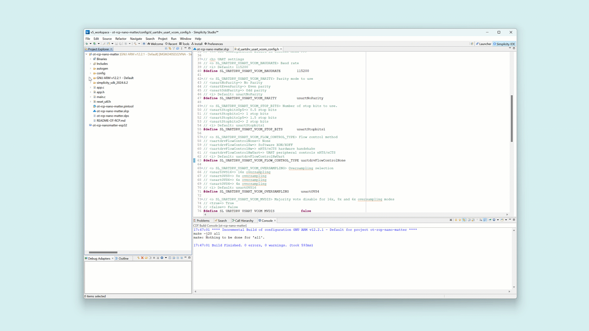

***The __Openocd__ tool directory may vary according to your OS, modify the command above respectively.***

### The Matter Controller: Nano ESP32

This section outlines the steps to build the Matter Controller firmware for the Arduino Nano ESP32.

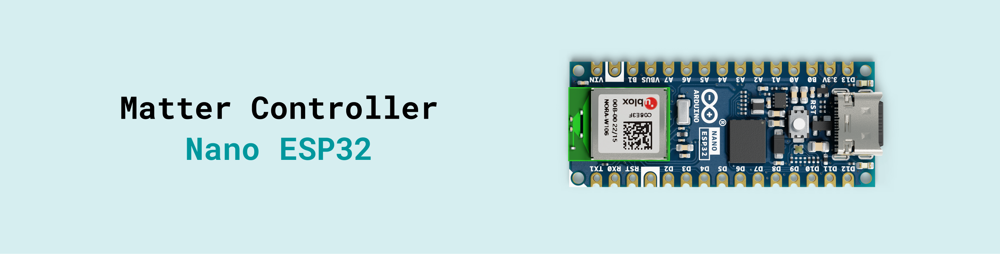

To set up the environment for the ESP32 firmware development use the following commands on a **Linux computer**.

- Install dependencies (Ubuntu and Debian):
  
```bash
sudo apt-get install git wget flex bison gperf python3 python3-pip python3-venv cmake ninja-build ccache libffi-dev libssl-dev dfu-util libusb-1.0-0
```

***Search for the correct commands [here](https://docs.espressif.com/projects/esp-idf/en/stable/esp32s3/get-started/linux-macos-setup.html#for-linux-users) if you use a different Linux distribution.***

- Install the **ESP-IDF**:
  
```bash
git clone -b v5.1.2 --recursive https://github.com/espressif/esp-idf.git
cd esp-idf
./install.sh
. ./export.sh
```

- Navigate to the `ot_rcp` example included in the `esp-idf` directory, and build it using the `esp32h2` target:
  
```bash
cd examples/openthread/ot_rcp
idf.py set-target esp32h2
idf.py build
```

- Clone the ESP Thread Border Router example repository:
  
```bash
cd ..
git clone -b v1.0 --recursive https://github.com/espressif/esp-thread-br.git
cd esp-thread-br/examples/basic_thread_border_router/
```
- For the `sdkconfig` file to be generated, and we can later modify it with our Nano ESP32 custom settings, set the device target from the command line:

```bash
idf.py set-target esp32s3
```

Using a **code editor**, open the `sdkconfig` file located in `esp-thread-br/examples/basic_thread_border_router/sdkconfig` and do the following modifications:

- Update the Wi-Fi credentials with your network `SSID` and `Password`:

```bash
CONFIG_EXAMPLE_WIFI_SSID="<your-wifi-ssid>"
CONFIG_EXAMPLE_WIFI_PASSWORD="<your-wifi-password>"
```

- Modify the Serial pinout so it matches with the Arduino Nano layout:

```bash
CONFIG_PIN_TO_RCP_TX=43
CONFIG_PIN_TO_RCP_RX=44
```

- Disable the RCP firmware auto-update verifying this parameter is not set:

```bash
# CONFIG_OPENTHREAD_BR_AUTO_UPDATE_RCP=y
```

- Enable the OpenThread webserver:

```bash
CONFIG_OPENTHREAD_BR_START_WEB=y
```

- Enable OpenThread commissioner and joiner:

```bash
CONFIG_OPENTHREAD_COMMISSIONER=y
CONFIG_OPENTHREAD_JOINER=y
```

- Navigate to `esp-thread-br/examples/basic_thread_border_router/main/esp_ot_config.h`

- Modify the Serial port baud rate to `115200`, the result should look like this:

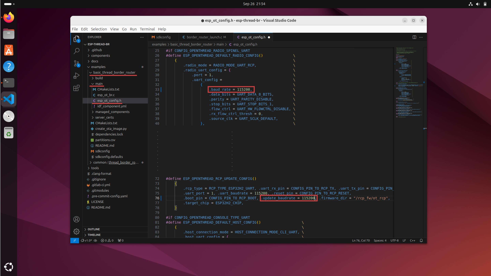

- Navigate to `esp-thread-br/examples/common/thread_border_router/src/border_router_launch.c`.

- Disable the ESP RCP update process by commenting the following line of the `border_router_launch.c` file, the result should look like this:

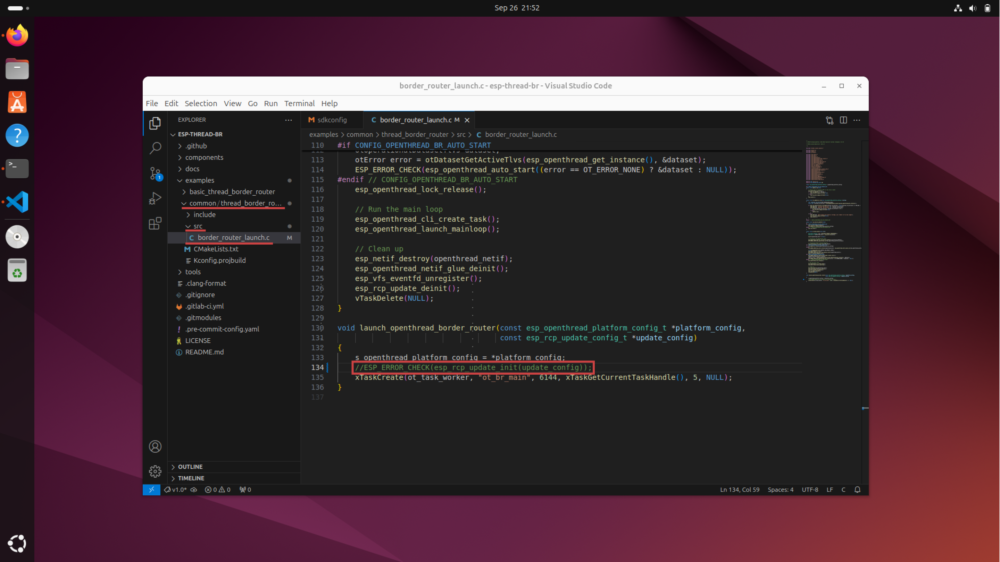

- Go back to the `basic_thread_border_router` example folder and build the firmware:

```bash
cd esp-thread-br/examples/basic_thread_border_router
idf.py build
```

- When the build is completed, flash the Nano ESP32:

```bash
idf.py -p /dev/ttyACM0 flash monitor
```


***Do not run the `idf.py set-target esp32s3` command again to avoid overriding the customized configurations.***

### OTBR Assembly

After configuring and flashing the Nano Matter and Nano ESP32 separately, it is time to connect them. As they communicate through a serial connection, you can stack them using breakout headers or jumper wires as follows:

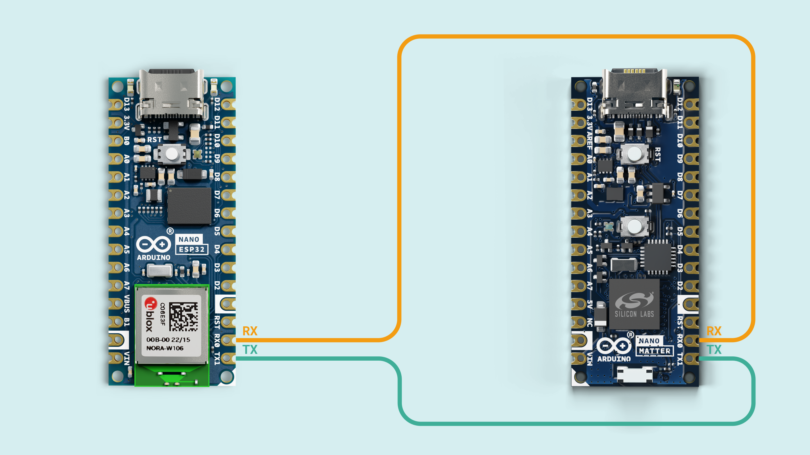
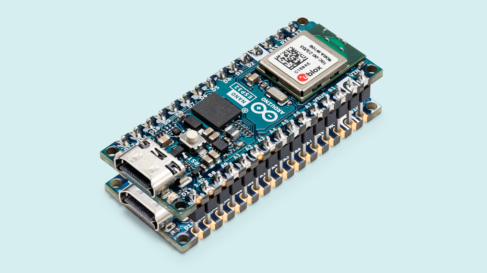

***It doesn't matter which board is on top.***

### CHIP Tool

**CHIP Tool** is a command-line tool for *commissioning*, *controlling*, and *managing* **Matter** devices within a Matter network.

Due to its high demand for storage space and computational power it must be executed on a separate, more powerful device, such as a Unix laptop (macOS or Linux), that is connected to the same Wi-Fi network. 

This third device will handle the complex tasks, while the Nano ESP32 acts as the Matter Controller in the network.

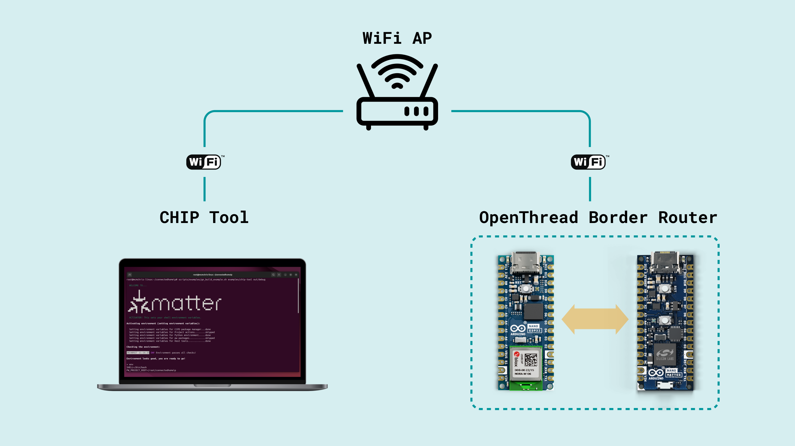

#### Configure the CHIP Tool

- On a Linux system, clone the CHIP Tool repository:

```bash
git clone --recurse-submodules https://github.com/project-chip/connectedhomeip.git
```

- Install prerequisites:

Before building, you must install a few OS specific dependencies.

```bash
sudo apt-get install git gcc g++ pkg-config libssl-dev libdbus-1-dev \
     libglib2.0-dev libavahi-client-dev ninja-build python3-venv python3-dev \
     python3-pip unzip libgirepository1.0-dev libcairo2-dev libreadline-dev \
     default-jre
```

- Open a command prompt in the `connectedhomeip` directory and run the following command:

```bash
cd connectedhomeip
scripts/examples/gn_build_example.sh examples/chip-tool out/debug
```

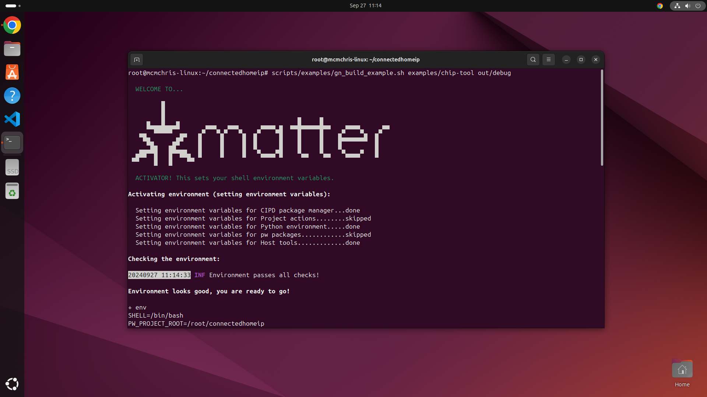

Wait for the packages installation process to finish.

- To check if the CHIP Tool runs correctly, execute the following command:

```bash
./out/debug/chip-tool
```
As a result, the CHIP Tool starts and prints all available commands.

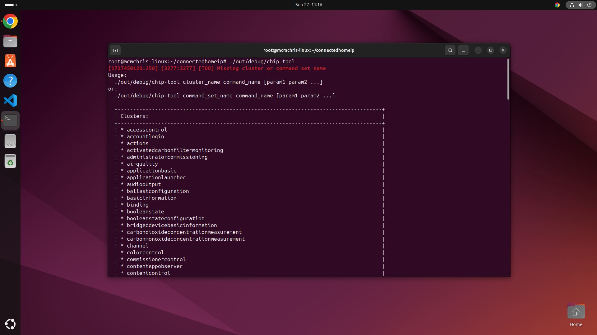

## The Use Case: Smart Outlet

This section provides an example of commissioning and communication over Matter between an end-device node and the OTBR.

### Setup

- **OTBR**: Nano ESP32 + Nano Matter
- **CHIP Tool**: running on a Linux PC (with Bluetooth capabilities)
- **End-device**: Nano Matter or other boards compatible with the Silabs Arduino core

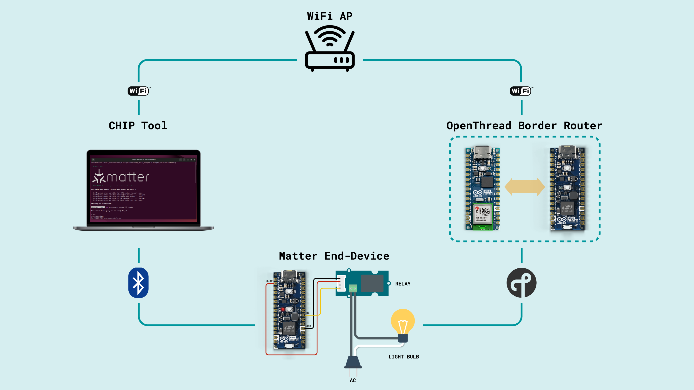

### End-Device Configuration

As the *end-device* we are going to use a Nano Matter configured as **Smart Outlet**.

- Ensure the Silicon Labs boards package is installed in the Arduino IDE 2.

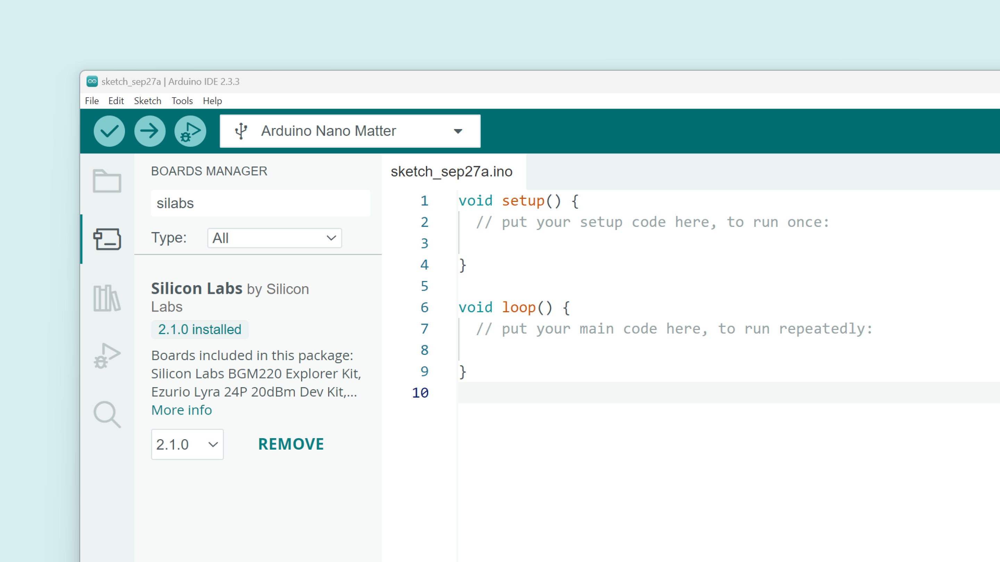

- Go to **File > Examples > Matter > matter_on_off_outlet** and flash the example to the Nano Matter.

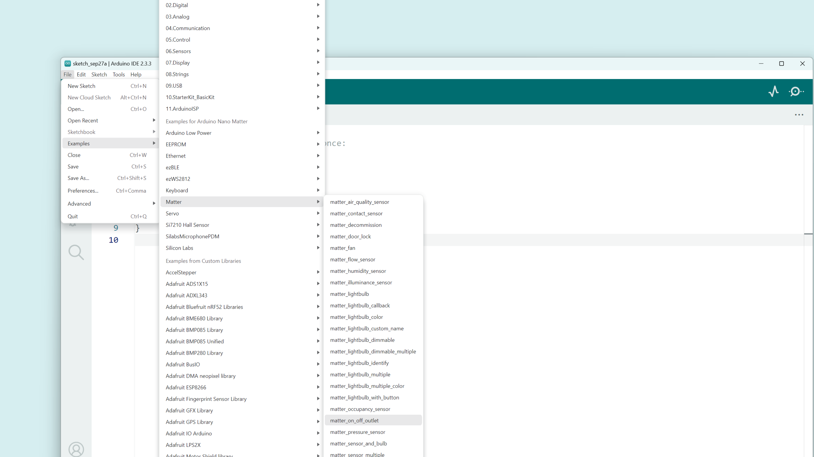

***By default the example will use the built-in LED as an output, you can easily update the code so it controls a GPIO to activate an external relay.***

- Once flashed, open the serial terminal and reset the board. Take note of the **manual pairing code**:

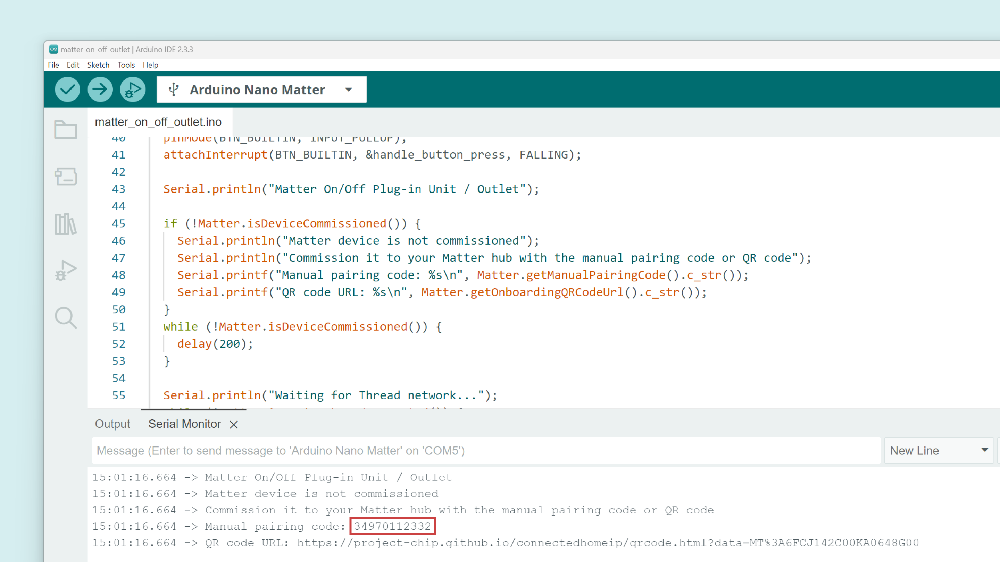

For example:

```bash
34970112332
```

### Getting Thread Network Credentials

Connect through USB to the Nano ESP32 and run the following command from the Arduino IDE Serial Monitor:

```bash
dataset active -x
```

***This command will display the active Thread network dataset as a hexadecimal string.***

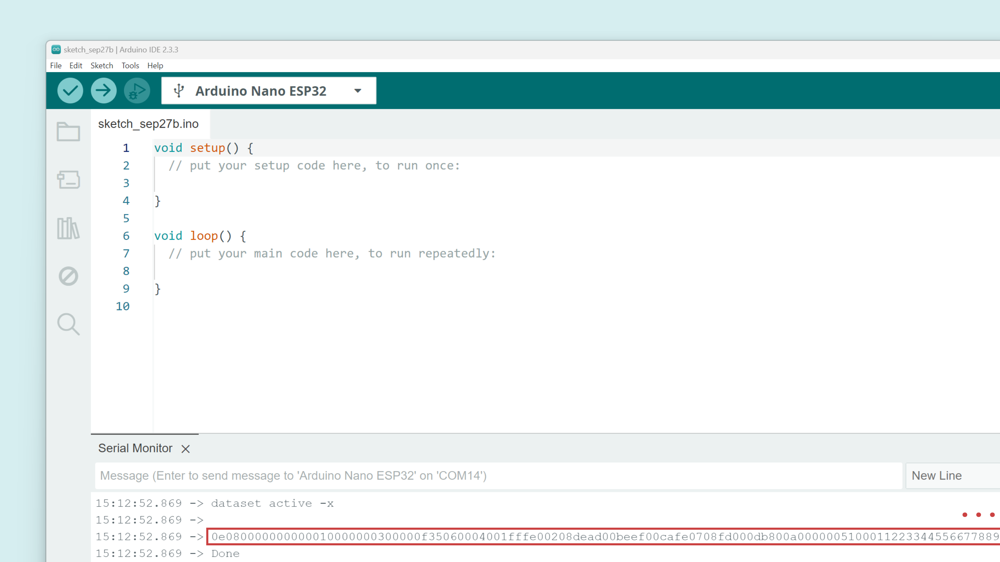

For example:

```bash
0e080000000000010000000300000f35060004001fffe00208dead00beef00cafe0708fd000db800a00000051000112233445566778899aabbccddeeff030e4f70656e5468726561642d455350010212340410104810e2315100afd6bc9215a6bfac530c0402a0f7f8
```

If an **error** appears, for example: 

```bash
Error 23: NotFound
```

This means that there is no active Thread Network dataset configured. The following steps will help fix the error:

- Check if the OpenThread is enabled, sending this command through the Serial Monitor:
  
```bash
state
```
- If the response is **disabled**, it means OpenThread has not started. To start it, use:

```bash
ifconfig up
```
```bash
thread start
```
- Then, try `dataset active -x` command again.

Now you should see the dataset string.

### Matter Commissioning

Commissioning refers to setting up and integrating a new device into the Matter network.

In this case, commissioning will occur via **Bluetooth**, where the laptop or PC with the CHIP Tool installed will communicate with the end device using a Bluetooth connection.

- Open the terminal on the system where the **CHIP Tool** is running, and execute the following command:

```bash
./out/debug/chip-tool pairing code-thread <node-id> hex:<thread-network-dataset> <end-device-pairing-code>
```

1. Replace `node-id` with the unique identifier for the device you are pairing (you can choose it freely according to your preference).
2. Replace `thread-network-dataset` with the hexadecimal string representing the Thread network dataset.
3. Replace `end-device-pairing-code` with the manual pairing code for the end device.

Here is an example using the previously gathered parameters:

```bash
./out/debug/chip-tool pairing code-thread 1 hex:0e080000000000010000000300000f35060004001fffe00208dead00beef00cafe0708fd000db800a00000051000112233445566778899aabbccddeeff030e4f70656e5468726561642d455350010212340410104810e2315100afd6bc9215a6bfac530c0402a0f7f8 34970112332
```

If commissioning phase works fine, on the end-device serial monitor you will get the following:

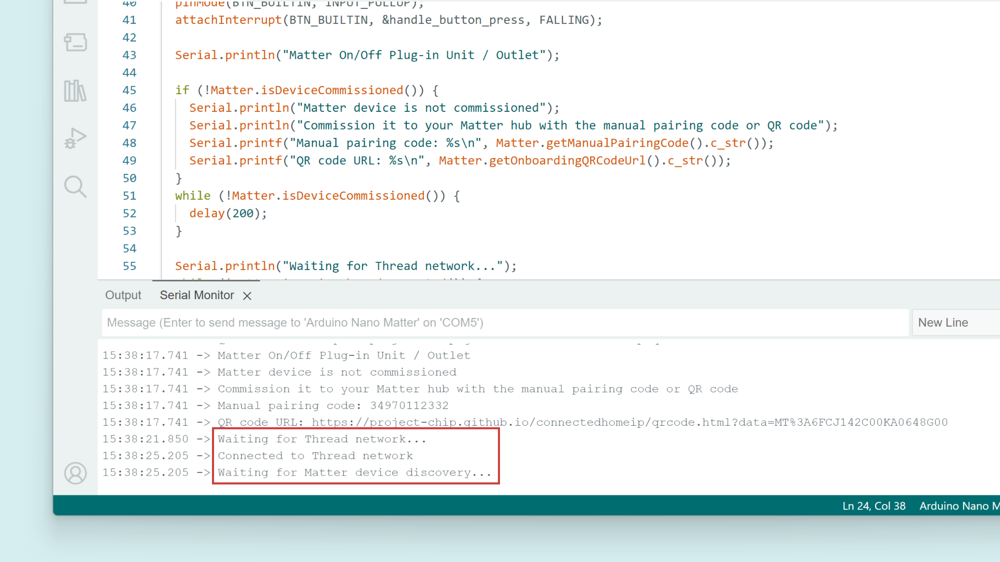

Now we are ready to control the Smart Outlet from the CHIP Tool system.

### Final Result (Testing)

To control the Smart Outlet use the following command format:

```bash
./out/debug/chip-tool <cluster-name> <command> <node-id> <endpoint-id>
# formatted command
./out/debug/chip-tool onoff toggle 1 0x03
```

- `onoff`: This specifies that the command pertains to the On/Off cluster, which controls the device's power state (on/off).
- `toggle`: This command switches the current state of the device.
- `1`: This is the Node ID of the device receiving the command.
- `0x03`: This is the endpoint ID of the device (fixed to 0x03 for Silicon Labs device).

Every time you run the command, the Smart Outlet toggles, turning the connected load on or off.


## Conclusion

This tutorial showed how to create an OpenThread Border Router using the Arduino Nano Matter and the Nano ESP32 alongside a Linux computer. With this solution you can easily integrate and control Matter Accessory Devices for Smart Homes or Industries.

### Next Steps

Now that you know how to create your own Thread Border Router, you can continue developing a custom platform or application that uses the CHIP Tool API to control Matter end devices from a mobile app or web platform with user-friendly dashboards and interfaces.

