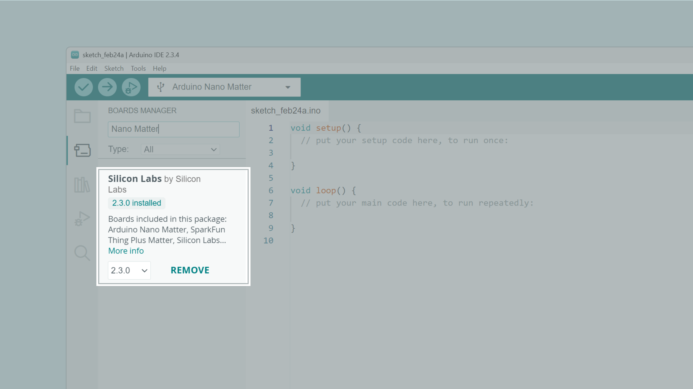
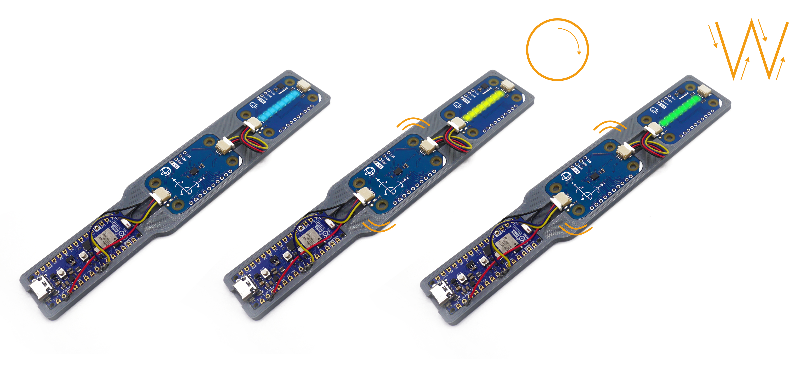
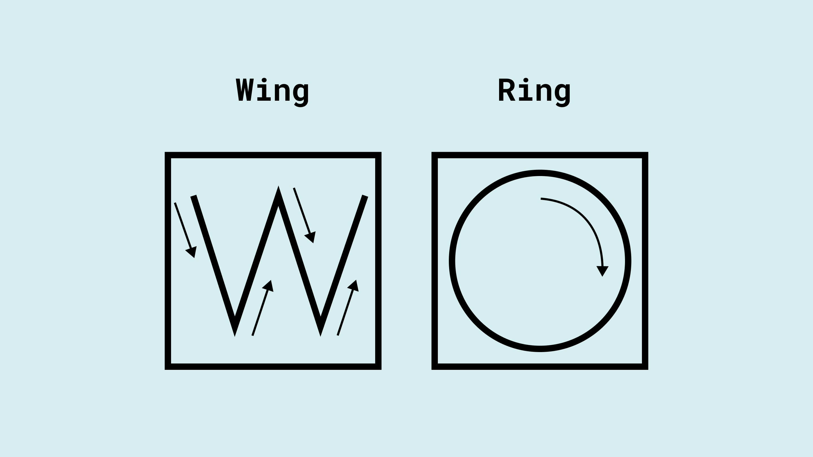
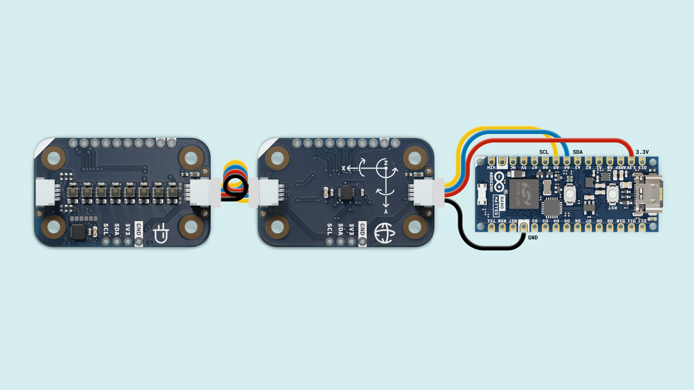
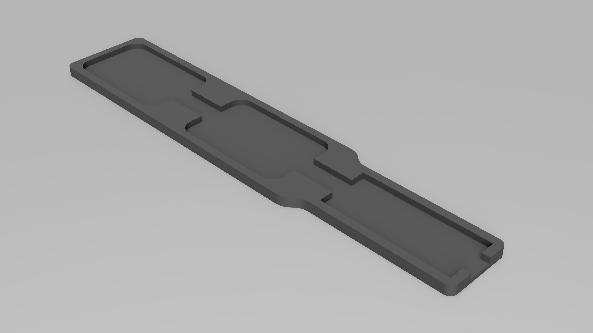
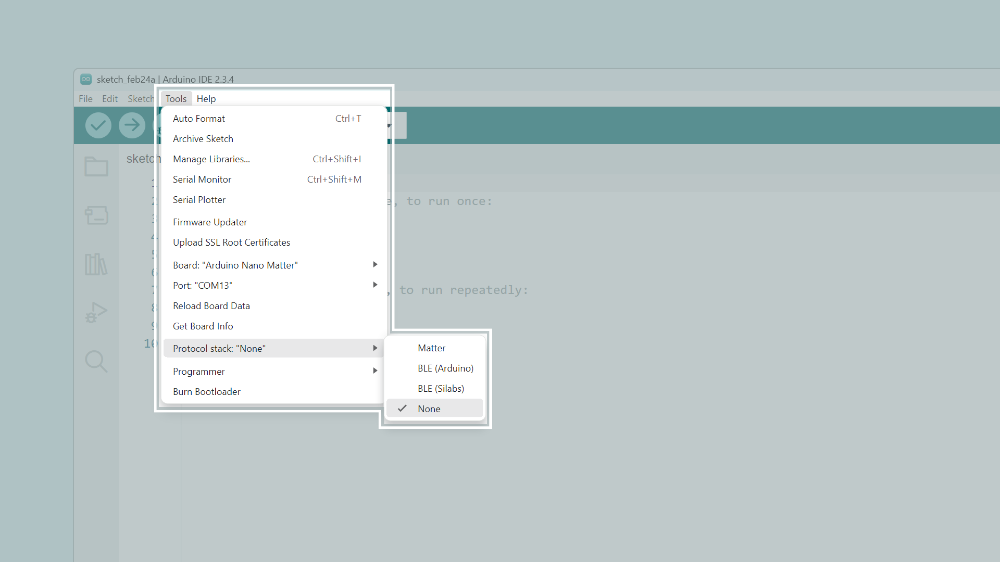
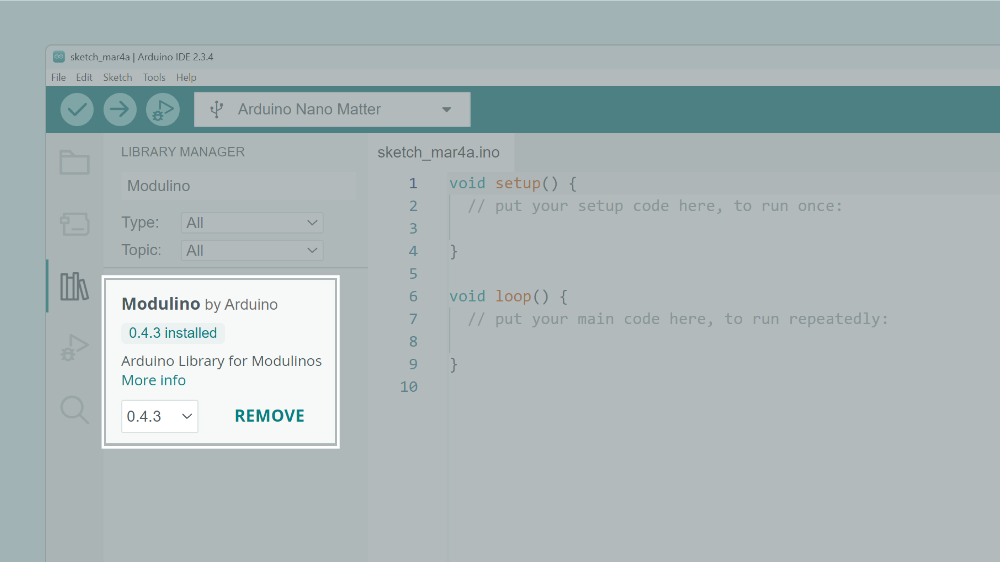
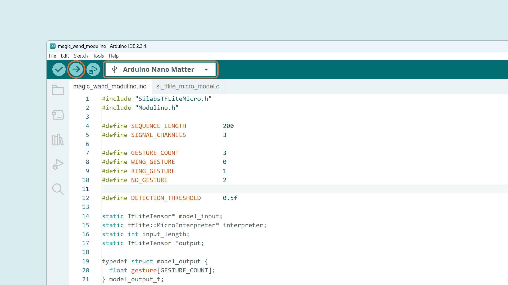

## Overview

This tutorial describes how to build a gesture recognition system based on a machine learning model using TensorFlow Lite and the Arduino Nano Matter.


The Arduino Nano Matter acts as a digital magic wand 🪄, where sensor data from its movements is processed by a model to classify and detect specific gestures. The inference results will turn on Modulino Pixels on a specific color respectively to the detected gesture.

### Goals

The goal of this project tutorial is to showcase the capabilities of the Arduino Nano Matter running Tiny Machine Learning models on the edge for gesture recognition. 
The wand can detect two gestures drawn in the air: **"W" (wing gesture)** and **"O" (ring gesture)**.


## Hardware and Software Requirements


### Hardware Requirements

- [Arduino Nano Matter](https://store.arduino.cc/products/nano-matter) (x1)
- Modulino Movement (x1)
- Modulino Pixels (x1)
- Qwiic cables (x2)
- [USB-C® cable](https://store.arduino.cc/products/usb-cable2in1-type-c) (x1)
- [Custom 3D printed parts](assets/3d-files.zip)

### Software Requirements

- [Arduino IDE 2.0+](https://www.arduino.cc/en/software) or [Arduino Cloud Editor](https://create.arduino.cc/editor)
- [Modulino library](https://github.com/arduino-libraries/Modulino). This library adds the support for the Modulino nodes, you can install it from the **Library Manager** in the Arduino IDE.
- [Silicon Labs core](https://github.com/SiliconLabs/arduino). This enables the Silicon Labs hardware including the Arduino Nano Matter support. You can install it from the **Boards Manager** in the Arduino IDE. 

### Download the Project Code

[](assets/magic_wand_modulino.zip)

Download the complete project code [here](assets/magic_wand_modulino.zip).

### Board Core and Libraries

The **Silicon Labs** core contains the libraries and examples you need to work with the board's components, such as its Matter, Bluetooth® Low Energy, and I/Os. To install the Nano Matter core, navigate to **Tools > Board > Boards Manager** or click the Boards Manager icon in the left tab of the IDE. In the Boards Manager tab, search for `Nano Matter` and install the latest `Silicon Labs` core version.



***The core version for this tutorial must be 2.3.0 or greater for the support of the Silabs Tensorflow Lite library.***

## How to Magic Wand Works?

In its **idle state**, the wand's LEDs remain **solid blue**, indicating that it is ready to detect a gesture.

When the wand is moved, the LEDs **turn off**, showing that gesture recognition has started.



Once the recognition process is complete:

If a gesture is successfully detected, the LEDs **blink rapidly for 4 seconds** in the color assigned to the recognized gesture:
- **Green** for "W" (wing gesture)
- **Yellow** for "O" (ring gesture)


  
After this, the wand returns to its **idle state**, with the LEDs **solid blue** again.

***Gestures should be performed with wide and slow movements, lasting approximately 1-2 seconds for optimal recognition.***

### Data Collection

Accelerometer sensor readings are collected at a frequency of **104 Hz**, with a sample duration of approximately **2 seconds**. This results in **200** tuples of accelerometer (aX, aY, aZ) sensor data for each sample (`200 * 1/104 Hz = 1.92s`). Therefore, a total of **600 data points** are collected for each gesture (200 * 3 = 600).

## Project Setup

### Schematic Diagram

Use the following connection diagram for the project:



The Modulino are daisy-chained leveraging the Qwiic I2C connection with the Nano Matter. You can use the Nano Connector Carrier that includes a Qwiic connector, or you can directly solder the wires to the Nano Matter following the mapping below:

| **Qwiic Connection** | **Color** | **Arduino Pin** |
| :------------------: | :-------: | :-------------: |
|         SCL          |  Yellow   |       A5        |
|         SDA          |   Blue    |       A4        |
|         VCC          |    Red    |      3.3V       |
|         GND          |   Black   |       GND       |

### 3D Printed Parts

You can mount the Nano Matter and the Modulino nodes on a custom 3D printed or laser cut base. Download the 3D files from [here](assets/3d-files.zip).



### Programming

Let's go through some important code sections to make this project fully operational, starting with the Protocol Stack setting and required libraries:

In the Arduino IDE upper menu, after selecting the **Nano Matter board** from the Silicon Labs core, navigate to **Tools > Protocol stack** and select **None**.



***The code will only compile if the __Protocol Stack__ is set to __None__.***

Download the `Modulino` library from the Arduino IDE Library Manager. This will enable the support for the Modulino Pixels and the Modulino Movement.



***The Modulino library for this tutorial must be 0.4.3 or greater.***

You can download the **complete project code** from [here](assets/magic_wand_modulino.zip) or copy and paste it from the snippet below:

```arduino
#include "SilabsTFLiteMicro.h"
#include "Modulino.h" 

#define SEQUENCE_LENGTH          200
#define SIGNAL_CHANNELS          3

#define GESTURE_COUNT            3
#define WING_GESTURE             0
#define RING_GESTURE             1
#define NO_GESTURE               2

#define DETECTION_THRESHOLD      0.5f

static TfLiteTensor* model_input;
static tflite::MicroInterpreter* interpreter;
static int input_length;
static TfLiteTensor *output;

typedef struct model_output {
  float gesture[GESTURE_COUNT];
} model_output_t;

typedef float acc_data_t;

ModulinoColor OFF(0, 0, 0);
ModulinoColor YELLOW(255, 255, 0);

ModulinoMovement imu;
ModulinoPixels leds;

void setPixel(int pixel, ModulinoColor color) {
  leds.set(pixel, color, 25);
  leds.show();
}

bool accelerometer_setup();
void accelerometer_read(acc_data_t* dst, int n);

void setup() {
  Serial.begin(115200);
  Serial.println("Magic Wand - Silabs TensorFlowLite");
  Serial.println("init...");

  // Init TFLite model
  sl_tflite_micro_init();

  // Obtain pointer to the model's input tensor.
  model_input = sl_tflite_micro_get_input_tensor();
  interpreter = sl_tflite_micro_get_interpreter();
  output = sl_tflite_micro_get_output_tensor();


  // Check model input parameters
  if ((model_input->dims->size != 2) || (model_input->dims->data[0] != 1)
      || (model_input->dims->data[1] != SEQUENCE_LENGTH * SIGNAL_CHANNELS)
      || (model_input->type != kTfLiteFloat32)) {
    Serial.println("error: bad input tensor parameters in model");
    while(1) ;
  }

  // Initialize accelerometer
  bool setup_status = accelerometer_setup();
  if (!setup_status) {
    Serial.println("error: accelerometer setup failed\n");
    while(1) ;
  }
  
  // Init led to steady state (blue)
  leds.begin();
  for (int i = 0; i < 8; i++) {
    setPixel(i, BLUE);
  }

}

void loop() {
  acc_data_t *dst = (acc_data_t *) model_input->data.f;

  // Wait until a significant movement is detected
  bool movementDetected = false;
  Serial.println("Waiting for significant movement...");

  while (!movementDetected) {
    uint8_t acceleroStatus;
    acceleroStatus = imu.available();

    // Proceed only if new data is available
    if (acceleroStatus == 1) {
      float acceleration[3];
      imu.update();
      
      acceleration[0] = imu.getX();
      acceleration[1] = imu.getY();  
      acceleration[2] = imu.getZ();

      // Calculate the absolute sum of the acceleration components
      float absSum = fabs(acceleration[0]) + fabs(acceleration[1]) + fabs(acceleration[2]);

      // If the movement exceeds the threshold, update the state
      if (absSum > 1.8) {
          movementDetected = true;
          Serial.println("Movement detected: start collecting data!");
      }
    }
  }

  // Turn off leds when movement is detected
  for (int i = 0; i < 8; i++) {
    setPixel(i, OFF);
  }

  // Get accelerometer values
  accelerometer_read(dst, input_length);

  // Run inference
  TfLiteStatus invoke_status = interpreter->Invoke();

  if (invoke_status == kTfLiteOk) {
    // Analyze the results to obtain a prediction
    const model_output_t *output = (const model_output_t *)interpreter->output(0)->data.f;

    // Print inference results (Gesture, probability)
    int max_i = -1;
    float max_val = 0;
    for (int i = 0; i < GESTURE_COUNT; i++) {
      switch(i) {
        case WING_GESTURE: Serial.print("W"); break;
        case RING_GESTURE: Serial.print("O"); break;
        case NO_GESTURE: Serial.print("No gesture"); break;
      }
      Serial.print(": ");
      Serial.print(interpreter->output(0)->data.f[i]);
      Serial.println();
      if (output->gesture[i] > max_val) {
        max_val = output->gesture[i];
        max_i = i;
      }
    }

    // Print the graphical representation of the recognized gesture
    if (max_val >= DETECTION_THRESHOLD) {
      switch(max_i) {
        case WING_GESTURE:
          Serial.println("detection = wing (W)");
          Serial.println("*       *");
          Serial.println("*       *");
          Serial.println("*   *   *");
          Serial.println(" * * * * ");
          Serial.println("  *   *  ");

          // Green leds for W gesture
          for (int i = 0; i < 10; i++) { 
            for (int j = 0; j < 8; j++) {
              setPixel(j, GREEN);
            }
            delay(200); 

            for (int j = 0; j < 8; j++) {
              setPixel(j, OFF);
            }
            delay(200); 
          }
          break;
        case RING_GESTURE:
          Serial.println("detection = ring (O)");
          Serial.println("  *****  ");
          Serial.println(" *     * ");
          Serial.println("*       *");
          Serial.println(" *     * ");
          Serial.println("  *****  ");

          // Yellow leds for O gesture
          for (int i = 0; i < 10; i++) { 
            for (int j = 0; j < 8; j++) {
              setPixel(j, YELLOW);
            }
            delay(200); 

            for (int j = 0; j < 8; j++) {
              setPixel(j, OFF);
            }
            delay(200); 
          }
          break;
        case NO_GESTURE:
          Serial.println("No gesture");
          break;
      }
    }

    // reset LEDs to steady state (blue)
    for (int i = 0; i < 8; i++) {
      setPixel(i, BLUE);
    }
  } else {
    printf("error: inference failed");
  }
}

bool accelerometer_setup() {
  Modulino.begin();
  bool status = imu.begin();

  return status;
}

void accelerometer_read(acc_data_t* dst, int n) {
  int i = 0;

  while (i < n) {
    uint8_t acceleroStatus;
    acceleroStatus = imu.available();

    if (acceleroStatus == 1) {
      float acceleration[3];

      imu.update();

      acceleration[0] = imu.getX();
      acceleration[1] = imu.getY();  
      acceleration[2] = imu.getZ();
      
      dst[i]    = (acceleration[0]*1000+4000)/8000;
      dst[i+1]  = (acceleration[1]*1000+4000)/8000;
      dst[i+2]  = (acceleration[2]*1000+4000)/8000;

      i+=SIGNAL_CHANNELS;
    }
  }
}
```
***Be aware that your sketch needs the model header `sl_tflite_micro_model.c` that is included in the [complete code download file](assets/magic_wand_modulino.zip).***

After the libraries import, several variables and structures are declared that has to be with the Machine Learning implementation:

```arduino
#include "SilabsTFLiteMicro.h"
#include "Modulino.h" 

#define SEQUENCE_LENGTH          200
#define SIGNAL_CHANNELS          3

#define GESTURE_COUNT            3
#define WING_GESTURE             0
#define RING_GESTURE             1
#define NO_GESTURE               2

#define DETECTION_THRESHOLD      0.5f

static TfLiteTensor* model_input;
static tflite::MicroInterpreter* interpreter;
static int input_length;
static TfLiteTensor *output;

typedef struct model_output {
  float gesture[GESTURE_COUNT];
} model_output_t;

typedef float acc_data_t;
```

We define some function prototypes to manage the Modulino Pixels and the Modulino Movement accelerometer data. Also, the classes for the Modulino Nodes are declared.

```arduino
ModulinoColor OFF(0, 0, 0);
ModulinoColor YELLOW(255, 255, 0);

ModulinoMovement imu;
ModulinoPixels leds;

void setPixel(int pixel, ModulinoColor color) {
  leds.set(pixel, color, 25);
  leds.show();
}

bool accelerometer_setup();
void accelerometer_read(acc_data_t* dst, int n);
```
In the `setup()` function, the **Tensorflow Lite model** is initialized alongside some modules support, including:

- Serial communication
- Modulino Pixels LEDs
- Modulino Movement IMU

At the beginning, relevant model parameters as the input tensor and its characteristics are printed in the Serial Monitor for debugging.

```arduino
void setup() {
  Serial.begin(115200);
  Serial.println("Magic Wand - Silabs TensorFlowLite");
  Serial.println("init...");

  // Init TFLite model
  sl_tflite_micro_init();

  // Obtain pointer to the model's input tensor.
  model_input = sl_tflite_micro_get_input_tensor();
  interpreter = sl_tflite_micro_get_interpreter();
  output = sl_tflite_micro_get_output_tensor();


  // Check model input parameters
  if ((model_input->dims->size != 2) || (model_input->dims->data[0] != 1)
      || (model_input->dims->data[1] != SEQUENCE_LENGTH * SIGNAL_CHANNELS)
      || (model_input->type != kTfLiteFloat32)) {
    Serial.println("error: bad input tensor parameters in model");
    while(1) ;
  }


  // Initialize accelerometer
  bool setup_status = accelerometer_setup();
  if (!setup_status) {
    Serial.println("error: accelerometer setup failed\n");
    while(1) ;
  }
  
  // Init led to steady state (blue)
  leds.begin();
  for (int i = 0; i < 8; i++) {
    setPixel(i, BLUE);
  }

}
```

In the `loop()` function, a four steps process is executed as following:

1. **Significant movement detection:** The Nano Matter reads the accelerometer data searching for significant movement, if detected then the next step starts.
2. **Accelerometer values reading:** The model input buffer is filled with new accelerometer values and normalized in the model format.
3. **Inference run:** The inference is run, and its results are retrieved for visual feedback triggering.
4. **Feedback results:** The inference results are analysed, printed in the Serial Monitor and reflected on the Modulino Pixels.

```arduino
void loop() {
  acc_data_t *dst = (acc_data_t *) model_input->data.f;

  // Wait until a significant movement is detected
  bool movementDetected = false;
  Serial.println("Waiting for significant movement...");

  while (!movementDetected) {
    uint8_t acceleroStatus;
    acceleroStatus = imu.available();

    // Proceed only if new data is available
    if (acceleroStatus == 1) {
      float acceleration[3];
      imu.update();
      
      acceleration[0] = imu.getX();
      acceleration[1] = imu.getY();  
      acceleration[2] = imu.getZ();

      // Calculate the absolute sum of the acceleration components
      float absSum = fabs(acceleration[0]) + fabs(acceleration[1]) + fabs(acceleration[2]);

      // If the movement exceeds the threshold, update the state
      if (absSum > 1.8) {
          movementDetected = true;
          Serial.println("Movement detected: start collecting data!");
      }
    }
  }

  // Turn off leds when movement is detected
  for (int i = 0; i < 8; i++) {
    setPixel(i, OFF);
  }

  // Get accelerometer values
  accelerometer_read(dst, input_length);

  // Run inference
  TfLiteStatus invoke_status = interpreter->Invoke();

  if (invoke_status == kTfLiteOk) {
    // Analyze the results to obtain a prediction
    const model_output_t *output = (const model_output_t *)interpreter->output(0)->data.f;

    // Print inference results (Gesture, probability)
    int max_i = -1;
    float max_val = 0;
    for (int i = 0; i < GESTURE_COUNT; i++) {
      switch(i) {
        case WING_GESTURE: Serial.print("W"); break;
        case RING_GESTURE: Serial.print("O"); break;
        case NO_GESTURE: Serial.print("No gesture"); break;
      }
      Serial.print(": ");
      Serial.print(interpreter->output(0)->data.f[i]);
      Serial.println();
      if (output->gesture[i] > max_val) {
        max_val = output->gesture[i];
        max_i = i;
      }
    }

    // Print the graphical representation of the recognized gesture
    if (max_val >= DETECTION_THRESHOLD) {
      switch(max_i) {
        case WING_GESTURE:
          Serial.println("detection = wing (W)");
          Serial.println("*       *");
          Serial.println("*       *");
          Serial.println("*   *   *");
          Serial.println(" * * * * ");
          Serial.println("  *   *  ");

          // Green leds for W gesture
          for (int i = 0; i < 10; i++) { 
            for (int j = 0; j < 8; j++) {
              setPixel(j, GREEN);
            }
            delay(200); 

            for (int j = 0; j < 8; j++) {
              setPixel(j, OFF);
            }
            delay(200); 
          }
          break;
        case RING_GESTURE:
          Serial.println("detection = ring (O)");
          Serial.println("  *****  ");
          Serial.println(" *     * ");
          Serial.println("*       *");
          Serial.println(" *     * ");
          Serial.println("  *****  ");

          // Yellow leds for O gesture
          for (int i = 0; i < 10; i++) { 
            for (int j = 0; j < 8; j++) {
              setPixel(j, YELLOW);
            }
            delay(200); 

            for (int j = 0; j < 8; j++) {
              setPixel(j, OFF);
            }
            delay(200); 
          }
          break;
        case NO_GESTURE:
          Serial.println("No gesture");
          break;
      }
    }

    // reset LEDs to steady state (blue)
    for (int i = 0; i < 8; i++) {
      setPixel(i, BLUE);
    }
  } else {
    printf("error: inference failed");
  }
}
``` 

In addition, some helper functions are used:

- `accelerometer_setup()`: This function initialize the Modulino Movement accelerometer and returns true if it did it successfully.
- `accelerometer_read(acc_data_t* dst, int n)`: This function read the accelerometer data, normalize it and prepare the model input buffer.

### Upload the Project Sketch

You can download the code from [here](assets/magic_wand_modulino.zip) or by clicking on the image below: 

[](assets/magic_wand_modulino.zip)

In the Arduino IDE select the **Arduino Nano Matter** inside the _Silicon Labs_ board package and make sure the **Protocol Stack** is set to _None_.



After the code is uploaded successfully, you can test your Nano Matter Magic Wand.

## Project Testing

Power the Nano Matter of your Magic Wand using a USB cable and start moving it following the **Wing** or **Ring** gesture to see if it recognizes it.

<div style="text-align: center;">
  <video width="100%" controls="true" autoplay loop>
  <source src="assets/animation2.mp4" type="video/mp4"/>
  </video>
</div>

## Conclusion

In this tutorial you learned how to use the Arduino Nano Matter as a Machine Learning gesture recognizer; leveraging the optimized Silicon Labs library for Tiny Machine Learning, we showcased the board capabilities of running TinyML algorithms with ease thanks to the **hardware acceleration** achieved with the **Matrix Vector Processor (MVP)** integrated into the Nano Matter microcontroller.

### Next Steps

- Extend your knowledge about the Nano Matter following the [Arduino Documentation](https://docs.arduino.cc/hardware/nano-matter/).
- Improve gesture recognition model accuracy by incorporating gyroscope data.
- Create your own custom gestures recognition model.
- Create machine learning models leveraging other Modulino sensors.


