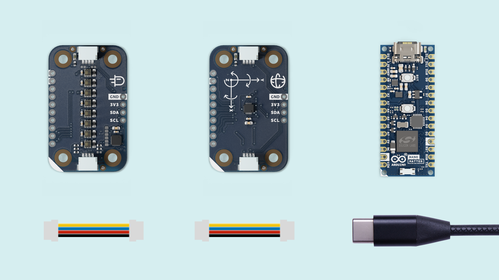

## Overview

This tutorial describes how to build a gesture recognition system based on a machine learning model using TensorFlow and the Arduino Nano Matter.

The Arduino Nano Matter acts as a digital magic wand 🪄, where sensor data from its movements is processed by a model to classify and detect specific gestures. The inference results will tur

## Hardware and Software Requirements

### Hardware Requirements

- [Arduino Nano Matter](https://store.arduino.cc/products/nano-matter) (x1)
- Modulino Movement (x1)
- Modulino Pixels (x1)
- Qwiic cables (x2)
- [USB-C® cable](https://store.arduino.cc/products/usb-cable2in1-type-c) (x1)
- Custom 3D printed parts

### Software Requirements

- [Arduino IDE 2.0+](https://www.arduino.cc/en/software) or [Arduino Cloud Editor](https://create.arduino.cc/editor)
- [Modulino library](https://github.com/arduino-libraries/Modulino). This library adds the support for the Modulinos, you can install it from the **Library Manager** in the Arduino IDE.
- [Silicon Labs core](https://github.com/SiliconLabs/arduino). This enables the Silicon Labs hardware including the Arduino Nano Matter support. You can install it from the **Boards Manager** in the Arduino IDE. 

### Download the Project Code

Download the complete project code [here](assets/magic_wand_modulino.zip).

### Board Core and Libraries

The **Silicon Labs** core contains the libraries and examples you need to work with the board's components, such as its Matter, Bluetooth® Low Energy, and I/Os. To install the Nano Matter core, navigate to **Tools > Board > Boards Manager** or click the Boards Manager icon in the left tab of the IDE. In the Boards Manager tab, search for `Nano Matter` and install the latest `Silicon Labs` core version.

***The core version for this tutorial must be 2.3.0 or greater for the support of the Silabs Tensorflow Lite library.***

## Project Setup

### Schematic Diagram

Use the following connection diagram for the project:

The Modulino are daisy-chained leveraging the Qwiic I2C connection with the Nano Matter. You can use the Nano Connector Carrier that includes a Qwiic connector, or you can directly solder the wires to the Nano Matter following the mapping below:

| **Qwiic Connection** | **Color** | **Arduino Pin** |
| :------------------: | :-------: | :-------------: |
|         SCL          |  Yellow   |       A5        |
|         SDA          |   Blue    |       A4        |
|         VCC          |    Red    |      3.3V       |
|         GND          |   Black   |       GND       |

### Programming

In the Arduino IDE upper menu, after selecting the **Nano Matter board** from the Silicon Labs core, navigate to **Tools > Protocol stack** and select **None**.

***The code will only compile if the Protocol Stack is set to None.***

You can download the complete project code from [here](assets/magic_wand_modulino.zip). 

Let's go through some important code sections to make this application fully operational, starting with the required libraries:

Download the `Modulino.h` library from the Arduino IDE Library Manager. This will enable the support for the Modulino Pixels and the Modulino Movement.

