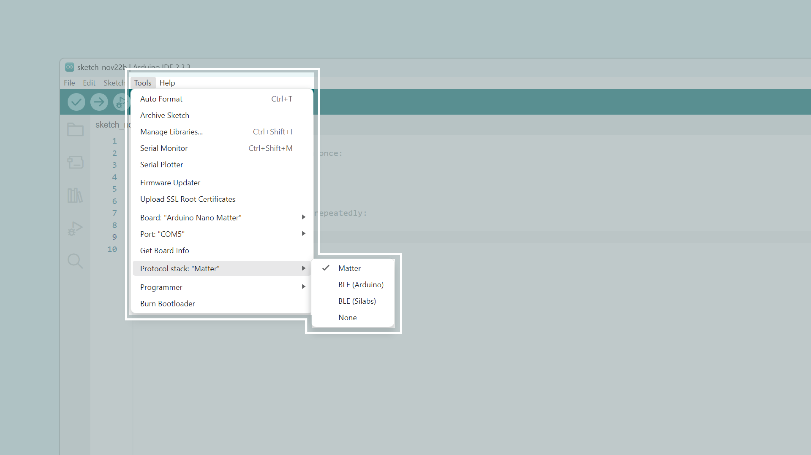

## Overview

This tutorial will teach you how to create a Matter RGB Lightbulb to light up any room with colors. 


Thanks to the seamless compatibility of the Nano Matter with almost any Matter network we can easily integrate our RGB light with Amazon Alexa, Google Assistant, Apple Home, Home Assistant and even custom assistants.

## Hardware and Software Requirements
### Hardware Requirements

- [Nano Matter](https://store.arduino.cc/products/nano-matter) (x1)
- Grove - 8x8 RGB LED Matrix (x1)
- Breadboard (x1)
- Jumper wires
- Eero 6+ WiFi Extender (Thread Border Router) (x1)
- [USB-C® cable](https://store.arduino.cc/products/usb-cable2in1-type-c) (x1)

### Software Requirements

- [Arduino IDE 2.0+](https://www.arduino.cc/en/software) or [Arduino Cloud Editor](https://create.arduino.cc/editor)
- [Amazon Alexa](https://www.amazon.com/Alexa-App/b?ie=UTF8&node=18354642011)
- [Seeed_RGB_LED_Matrix](https://github.com/Seeed-Studio/Seeed_RGB_LED_Matrix) library to control the RGB LED matrix. You can install it as .ZIP using the Arduino IDE.
- [DHT](https://github.com/mcmchris/DHT-sensor-library/tree/patch-1) library. Download from this [branch](https://github.com/mcmchris/DHT-sensor-library/tree/patch-1) so it support the Nano Matter. 

### Board Core and Libraries

The **Silicon Labs** core contains the libraries and examples you need to work with the board's components, such as its Matter, Bluetooth® Low Energy, and I/Os. To install the Nano Matter core, navigate to **File > Preferences** and in the **Additional boards manager URLs**, add the following:

`https://siliconlabs.github.io/arduino/package_arduinosilabs_index.json`

Now navigate to **Tools > Board > Boards Manager** or click the Boards Manager icon in the left tab of the IDE. In the Boards Manager tab, search for `Nano Matter` and install the latest `Silicon Labs` core version.


## Project Setup

### Schematic Diagram

Use the following connection diagram for the project:


### Programming

In the Arduino IDE upper menu, navigate to **Tools > Protocol stack** and select **Matter**.



Copy and paste the following sketch:

```arduino

```

Once you uploaded the example code to the Nano Matter, open the Serial Monitor and reset the board.


There you will find the URL that generates the QR for the Matter device commissioning.

### Commissioning 

Copy and paste the QR code URL on your favorite web browser and a unique QR code will be generated for your board.

Go to your **Google Home** app, navigate to **devices** and tap on **Add**, select the **Matter-enabled device** option and scan the QR code.


## Final Results

Finally, you will be able to monitor your room temperature from your smartphone, hub or asking to your personal assistant.


You can also see the temperature value on the device OLED display.

## Conclusion

In this tutorial we have learned how to create a Matter enabled temperature sensor that can be monitored from our smartphone and personal assistant. The Nano Matter allows us to seamlessly integrate the sensor as a commercial product with our current smart home ecosystem.

### Next Steps

You can take this solution even further by adding the humidity measuring capability of the DHT11 sensor and integrate it as a 2nd sensor to your Matter network.