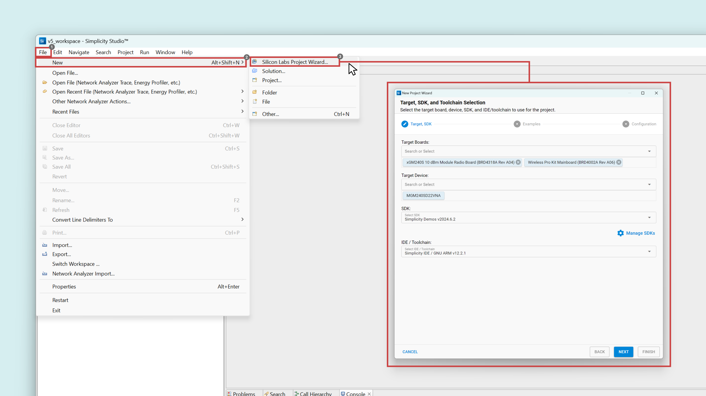
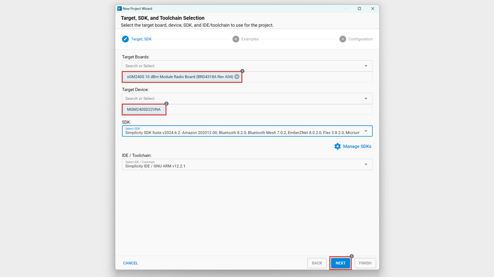
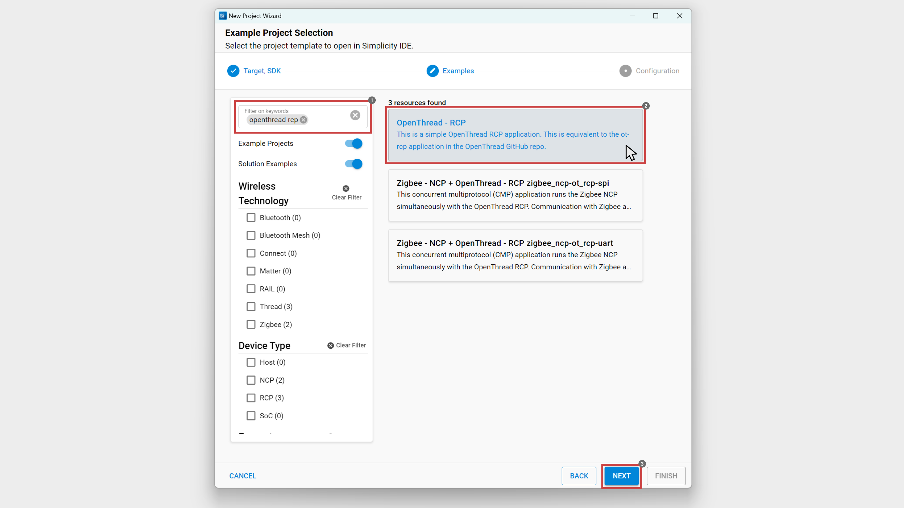
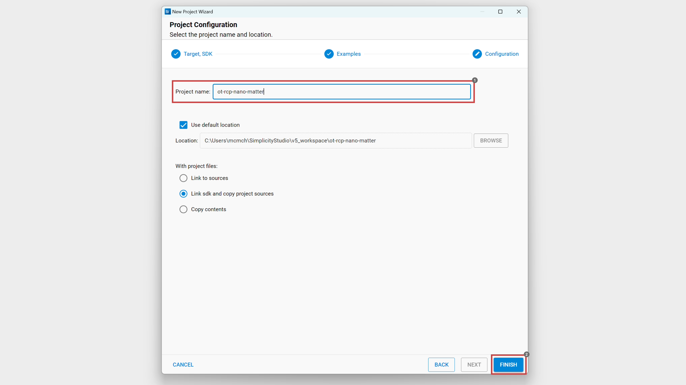
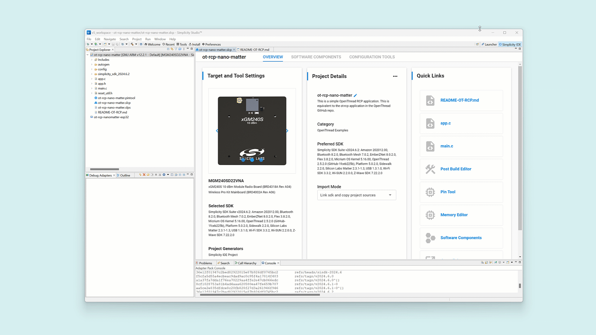
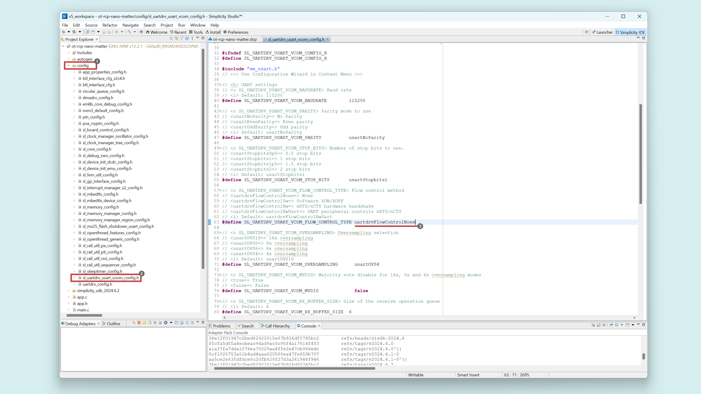
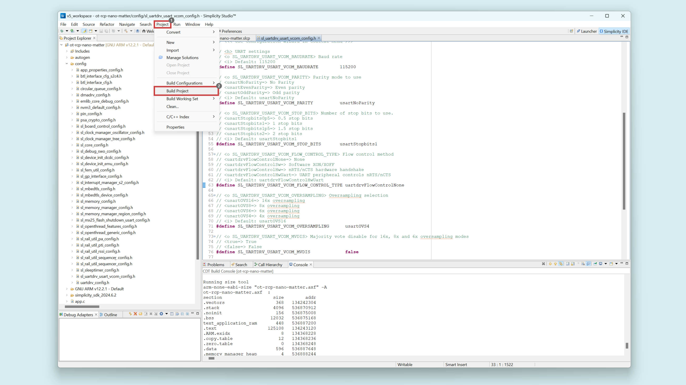
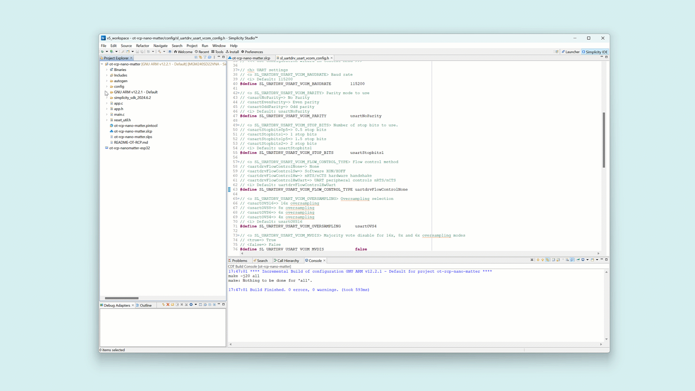

## Introduction

Thread is a low-power, wireless mesh networking protocol designed for smart homes and IoT devices. A Thread Border Router serves as a bridge between the Thread network and the wider internet or local networks, allowing devices within the Thread network to communicate with external systems.


Matter devices can use Thread as their primary communication method, especially for low-power devices such as sensors, light bulbs, and door locks. These devices communicate using the Thread protocol and leverage Matter's application layer for interoperability.

### What is an OTBR?

An OpenThread Border Router (OTBR) consists of a **Matter Controller** and a **Radio Co-Processor** (RCP):

- The *Matter Controller* is essential for managing devices using the Matter protocol, which ensures interoperability between nodes. It handles: commissioning, communication and network management.
- The *Radio Co-Processor* (RCP) is dedicated to handling Thread network communications, improving efficiency by offloading radio communication tasks.

The **Arduino Nano Matter** serves as the **RCP**, connected to the **Arduino Nano ESP32** (the Matter Controller) via serial port.

## Goals

This tutorial main objective is to guide you through the build and configuration of an OpenThread Border Router that will allow you to deploy a Matter network over Thread to integrate Matter devices to your Smart Home system. 

- Create an OTBR using Arduino products.
- Leverage the Arduino Nano Matter as a Radio Co-Processor.
- Use the Arduino Nano ESP32 as a Matter Controller.
- Integrate a smart outlet based on the Nano Matter to your network.

## Hardware and Software Requirements

### Hardware Requirements

- [Nano Matter](https://store.arduino.cc/products/nano-matter) (x2)
- [Nano ESP32](https://store.arduino.cc/products/nano-esp32) (x1)
- Linux Computer (Laptop/PC) (x1)
- USB-C® cable (x1)

### Software Requirements

- [Arduino IDE 2.0+](https://www.arduino.cc/en/software)
- [Simplicity Studio](https://www.silabs.com/developers/simplicity-studio)
- [Visual Studio Code](https://code.visualstudio.com/)

## Setting up the OTBR

### The RCP: Arduino Nano Matter

This section outlines the steps to build the RCP firmware for the Arduino Nano Matter.

#### Create a New Project

- Download Simplicity Studio, this is an IDE provided by Silicon Labs. It is designed to simplify the development process for Silicon Labs hardware platforms. Download latest version [here](https://www.silabs.com/developers/simplicity-studio).

- Open Simplicity Studio and create a new project by clicking on **File > New > Silicon Labs Project Wizard**.
  


- Set the following project configurations and click on *Next*.

|   **Field**   |                     **Setting**                      |
| :-----------: | :--------------------------------------------------: |
| Target Boards | xGM240S 10 dBm Module Radio Board (BRD4318A Rev A04) |
| Target Device |                    MGM240SD22VNA                     |



- In the *Examples* tab search for the **OpenThread - RCP** example, select it and click on *Next*.



- In the *Configuration* tab give the project a name and click on *Finish*.



#### Change the Serial Port Pinout

The default pinout is **PA8 > TX** and **PA9 > RX**, but we need to change it to **PA4 > TX** and **PA5 > RX**, so they correspond to the **D0** and **D1** of the standard Nano layout.

- Delete the default `USART0` setting:



- Add the new setting:


- Save your project with the new configurations.

#### Disable USART Flow Control

- Open the `<project-folder>/config/sl_uartdrv_usart_vcom_config.h` file.
  
- Modify the `SL_UARTDRV_USART_VCOM_FLOW_CONTROL_TYPE` variable as follows:
```
#define SL_UARTDRV_USART_VCOM_FLOW_CONTROL_TYPE uartdrvFlowControlNone
```



#### Build and Flash the Project

- In the upper menu navigate to **Project > Build Project** to compile and build the RCP firmware.



- In your project directory navigate to the `/GNU ARM v12.2.1 - Default/` folder, right click on it and open a **Command Line**.

Use the following command to flash the firmware to the Arduino Nano Matter, make sure to modify the `<username>` and `<project name>` with yours:

```bash
/Users/<your-username>/AppData/Local/Arduino15/packages/SiliconLabs/tools/openocd/0.12.0-arduino1-static/bin/openocd -d2 -s /Users/<your-username>/AppData/Local/Arduino15/packages/SiliconLabs/tools/openocd/0.12.0-arduino1-static/share/openocd/scripts/ -f interface/cmsis-dap.cfg -f target/efm32s2_g23.cfg -c "init; reset_config srst_nogate; reset halt; program {<project-name>.hex}; reset; exit"
```



***The __Openocd__ tool directory may vary according to your OS, modify the command above respectively.***

### The Matter Controller: Arduino Nano ESP32

### The CHIP Tool: Linux Computer

## Testing the OTBR

## Setup

## The Use Case: Smart Outlet