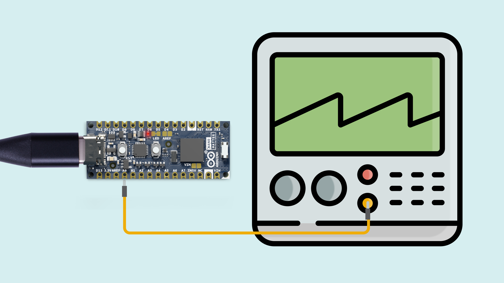

## Overview

This user manual will guide you through a practical journey covering the most interesting features of the Arduino Nano Matter. With this user manual, you will learn how to set up, configure and use this Arduino board.

## Hardware and Software Requirements
### Hardware Requirements

- [Nano Matter](https://store.arduino.cc/products/nano-matter) (x1)
- USB-C® cable (x1)

### Software Requirements

- [Arduino IDE 1.8.10+](https://www.arduino.cc/en/software), [Arduino IDE 2.0+](https://www.arduino.cc/en/software), or [Arduino Web Editor](https://create.arduino.cc/editor)

## Product Overview

The Nano Matter merges the well-known Arduino way of making complex technology more accessible, with the powerful MGM240S from Silicon Labs to bring Matter, one of the most popular IoT connectivity standards for smart home devices, closer to the maker world in one of the smallest form factors in the market. Enables 802.15.4 (Thread) and Bluetooth® Low Energy connectivity to interact with Matter compatible devices with a user-friendly software layer for quick prototyping.


### Board Architecture Overview

The Nano Matter features a compact and efficient architecture powered by the MGM240S (32-bit ARM Cortex®-M33) from Silicon Labs, a high-performance wireless module
optimized for the needs of battery and line-powered IoT devices for 2.4 GHz mesh networks. 


Here is an overview of the board's main components, as shown in the images above:

- **Microcontroller**: at the heart of the Nano Matter is the MGM240S, a high-performance wireless module from Silicon Labs. The MGM240S is built around a 32-bit ARM Cortex®-M33 processor running at 78 MHz. 
- **Wireless connectivity**: the Nano Matter microcontroller also features multi-protocol connectivity to enable Matter IoT protocol and Bluetooth® Low Energy. This allows the Nano Matter to be integrated with smart home systems and communicate wirelessly with other devices.

### Board Core and Libraries

The **Silicon Labs** core contains the libraries and examples you need to work with the board's components, such as its IMU, magnetometer, and environment sensor. To install the Nano Matter core, navigate to **Tools > Board > Boards Manager** or click the Boards Manager icon in the left tab of the IDE. In the Boards Manager tab, search for `Nano Matter` and install the latest `Silicon Labs` core version.


### Pinout


The full pinout is available and downloadable as PDF from the link below:

- [Nano Matter pinout](https://docs.arduino.cc/static/b35956b631d757a0455c286da441641b/ABX00050-full-pinout.pdf)

### Datasheet

The complete datasheet is available and downloadable as PDF from the link below:

- [Nano Matter datasheet](https://docs.arduino.cc/resources/datasheets/ABX00050-datasheet.pdf)

### Schematics

The complete schematics are available and downloadable as PDF from the link below:

- [Nano Matter schematics](https://docs.arduino.cc/resources/schematics/ABX00050-schematics.pdf)

### STEP Files

The complete STEP files are available and downloadable from the link below:

- [Nano Matter STEP files](https://docs.arduino.cc/static/10c0953581f489a9a136ff00f2d2fa9d/ABX00050-step.zip)


## First Use
### Powering the Board

The Nano Matter can be powered by:

- A USB-C® cable (not included). 
- An external **5V power supply** connected to `IN5V` pin (please, refer to the [board pinout section](#pinout) of the user manual).


For low-power consumption applications, the following hacks are recommended:

- Cut the power status LED jumper off to save energy.
- Power the board with an external **3V3 power supply** connected to `3.3V` pin, this will not power the *USB bridge IC*, so more energy will be saved.


***To power the board through the VIN pin you need to close the jumper pads with solder. The máximum voltage supported is +5 VDC.***

### Hello World Example

Let's program the Arduino Nano Matter with the classic `hello world` example typical of the Arduino ecosystem: the `Blink` sketch. We will use this example to verify that the board is correctly connected to the Arduino IDE and that the Silicon Labs core and the board itself are working as expected. 

Copy and paste the code below into a new sketch in the Arduino IDE.

```arduino
// the setup function runs once when you press reset or power the board
void setup() {
  // initialize digital pin LED_BUILTIN as an output.
  pinMode(LED_BUILTIN, OUTPUT);
}

// the loop function runs over and over again forever
void loop() {
  digitalWrite(LED_BUILTIN, HIGH);  // turn the LED on (HIGH is the voltage level)
  delay(1000);                      // wait for a second
  digitalWrite(LED_BUILTIN, LOW);   // turn the LED off by making the voltage LOW
  delay(1000);                      // wait for a second
}
```

For the Nano Matter, the `LED_BUILTIN` macro represents the **red LED** of the built-in RGB LED of the board.

To upload the code to the Nano Matter, click the **Verify** button to compile the sketch and check for errors; then click the **Upload** button to program the board with the sketch.


You should now see the red LED of the built-in RGB LED turning on for one second, then off for one second, repeatedly.


## Pins
### Analog Input Pins (ADC)

The Nano Matter has **19 analog input pins**, mapped as follows:

| **Microcontroller Pin** | **Arduino Pin Mapping** | **Pin Functionality** |
|:-----------------------:|:-----------------------:|:---------------------:|
|          PB00           |           A0            |     GPIO/ADC/DAC      |
|          PB02           |           A1            |       GPIO/ADC        |
|          PB05           |           A2            |       GPIO/ADC        |
|          PC00           |           A3            |       GPIO/ADC        |
|          PA06           |       A4/I2C_SDA        |     I2C/GPIO/ADC      |
|          PA07           |       A5/I2C_SCL        |     I2C/GPIO/ADC      |
|          PB01           |           A6            |     GPIO/ADC/DAC      |
|          PB03           |           A7            |       GPIO/ADC        |
|          PB04           |           13            |     SPI/GPIO/ADC      |
|          PA08           |           12            |     SPI/GPIO/ADC      |
|          PA09           |           11            |     SPI/GPIO/ADC      |
|          PD03           |            8            |       GPIO/ADC        |
|          PD02           |            7            |       GPIO/ADC        |
|          PC09           |            6            |       GPIO/ADC        |
|          PC08           |            5            |       GPIO/ADC        |
|          PC07           |            4            |       GPIO/ADC        |
|          PC06           |            3            |       GPIO/ADC        |
|          PA04           |           TX            |     UART/GPIO/ADC     |
|          PA05           |           RX            |     UART/GPIO/ADC     |

***Digital I/O's can also be used as analog inputs with some exceptions.***

Analog input pins can be used through the built-in functions of the Arduino programming language. 

Nano Matter ADC resolution is fixed to 12 bits and can not be changed by the user.

The Nano Matter ADC reference voltage is 3.3 V by default, it can be configured using the function `analogReference()` with the following arguments:


|   **Argument**   |        **Description**         |
|:----------------:|:------------------------------:|
|  AR_INTERNAL1V2  |    Internal 1.2V reference     |
| AR_EXTERNAL_1V25 |    External 1.25V reference    |
|      AR_VDD      |   VDD (unbuffered to ground)   |
|     AR_08VDD     | 0.8 * VDD (buffered to ground) |
|      AR_MAX      |         Maximum value          |

To set a different analog reference from the default one, see the following example:

```arduino
analogReference(AR_INTERNAL1V2); 
```

The example code shown below reads the analog input value from a potentiometer connected to `A0` and displays it on the IDE Serial Monitor. To understand how to properly connect a potentiometer to the Nano Matter, take the following image as a reference:


```arduino
int sensorPin = A0;   // select the input pin for the potentiometer

int sensorValue = 0;  // variable to store the value coming from the sensor

void setup() {
  Serial.begin(115200); 
}

void loop() {
  // read the value from the sensor:
  sensorValue = analogRead(sensorPin);

  Serial.println(sensorValue);
  delay(100);
}
```

### Analog Output Pins (DAC)

The Nano Matter has **one DAC** with two channels, mapped as follows:

| **Microcontroller Pin** | **Arduino Name** | **Board Pin Output** | **Peripheral** |
|:-----------------------:|:----------------:|:--------------------:|:--------------:|
|          PB00           |       DAC0       |          A0          |    DAC0_CH0    |
|          PB01           |       DAC1       |          A6          |    DAC0_CH1    |

The digital-to-analog converters of the Nano Matter can be used as outputs through the built-in functions of the Arduino programming language.

The DAC output resolution can be configured using the `analogWriteResolution()` function as follows:

```arduino
analogWriteResolution(12);  // enter the desired resolution in bits (8,10,12)
```
The DAC voltage reference can be configured using the `analogReferenceDAC()` function. The available setups are listed below:

|     **Argument**      |     **Description**      |
|:---------------------:|:------------------------:|
|     DAC_VREF_1V25     | Internal 1.25V reference |
|     DAC_VREF_2V5      | Internal 2.5V reference  |
|     DAC_VREF_AVDD     |        Analog VDD        |
| DAC_VREF_EXTERNAL_PIN |    External AREF pin     |

```arduino
analogReferenceDAC(DAC_VREF_2V5);  // enter the desired reference as argument
```
To output an analog voltage value through a DAC pin, use the `analogWrite()` function with the **DAC channel** as an argument. See the example below:

```arduino
analogWrite(DAC0, value);   // the value should be in the range of the DAC resolution (e.g. 0-4095 with a 12 bits resolution)
```

***If a normal GPIO is passed to the analogWrite() function, the output will be a PWM signal.***

The following sketch will create a **sawtooth** wave signal in the `A0` Nano Matter pin:

```arduino
void setup()
{
  Serial.begin(115200);
  // Set the DAC resolution to 8 bits
  analogWriteResolution(8);
  // Select the 2.5V reference voltage (feel free to change it)
  analogReferenceDAC(DAC_VREF_2V5);
}

void loop()
{
  static int value = 0;
  analogWrite(DAC0, value);
  Serial.println(value);

  value++;
  if (value == 255) {
    value = 0;
  }
}
```

The DAC output should look like the image below:



### Digital Pins

The Nano Matter has **19 digital pins**, mapped as follows:

| **Microcontroller Pin** | **Arduino Pin Mapping** | **Pin Functionality** |
|:-----------------------:|:-----------------------:|:---------------------:|
|          PB00           |           A0            |     GPIO/ADC/DAC      |
|          PB02           |           A1            |       GPIO/ADC        |
|          PB05           |           A2            |       GPIO/ADC        |
|          PC00           |           A3            |       GPIO/ADC        |
|          PA06           |       A4/I2C_SDA        |     I2C/GPIO/ADC      |
|          PA07           |       A5/I2C_SCL        |     I2C/GPIO/ADC      |
|          PB01           |           A6            |     GPIO/ADC/DAC      |
|          PB03           |           A7            |       GPIO/ADC        |
|          PB04           |           13            |     SPI/GPIO/ADC      |
|          PA08           |           12            |     SPI/GPIO/ADC      |
|          PA09           |           11            |     SPI/GPIO/ADC      |
|          PD03           |            8            |       GPIO/ADC        |
|          PD02           |            7            |       GPIO/ADC        |
|          PC09           |            6            |       GPIO/ADC        |
|          PC08           |            5            |       GPIO/ADC        |
|          PC07           |            4            |       GPIO/ADC        |
|          PC06           |            3            |       GPIO/ADC        |
|          PA04           |           TX            |     UART/GPIO/ADC     |
|          PA05           |           RX            |     UART/GPIO/ADC     |

***Notice that GPIO's as `D2`,`D9` and `D10` are reserved and can not be used as analog or digital.*** 

The digital pins of the Nano Matter can be used as inputs or outputs through the built-in functions of the Arduino programming language. 

The configuration of a digital pin is done in the `setup()` function with the built-in function `pinMode()` as shown below:

```arduino
// Pin configured as an input
pinMode(pin, INPUT);        

// Pin configured as an output
pinMode(pin, OUTPUT);        

// Pin configured as an input, internal pull-up resistor enabled
pinMode(pin, INPUT_PULLUP);  
```

The state of a digital pin, configured as an input, can be read using the built-in function `digitalRead()` as shown below:

```arduino
// Read pin state, store value in a state variable
state = digitalRead(pin);
```

The state of a digital pin, configured as an output, can be changed using the built-in function `digitalWrite()` as shown below:

```arduino
// Set pin on
digitalWrite(pin, HIGH);    

// Set pin off
digitalWrite(pin, LOW);    
```

The example code shown below uses digital pin `5` to control an LED and reads the state of a button connected to digital pin `4`:


```arduino
// Define button and LED pin
int buttonPin = 4;
int ledPin = 5;

// Variable to store the button state
int buttonState = 0;

void setup() {
  // Configure button and LED pins
  pinMode(buttonPin, INPUT_PULLUP);
  pinMode(ledPin, OUTPUT);

  // Initialize Serial communication
  Serial.begin(115200);
}

void loop() {
  // Read the state of the button
  buttonState = digitalRead(buttonPin);

  // If the button is pressed, turn on the LED and print its state to the Serial Monitor
  if (buttonState == LOW) {
    digitalWrite(ledPin, HIGH);
    Serial.println("- Button is pressed. LED is on.");
  } else {
    // If the button is not pressed, turn off the LED and print to the Serial Monitor
    digitalWrite(ledPin, LOW);
    Serial.println("- Button is not pressed. LED is off.");
  }

  // Wait for 1000 milliseconds
  delay(1000);
}
```

### PWM Pins

Most digital and analog pins of the Nano Matter can be used as PWM (Pulse Width Modulation) pins. This functionality can be used with the built-in function `analogWrite()` as shown below:

```arduino
analogWrite(pin, value);  
```
By default, the output resolution is 8 bits, so the output value should be between 0 and 255. To set a greater resolution, do it using the built-in function `analogWriteResolution` as shown below:

```arduino
analogWriteResolution(bits);  
```

Using this function has some limitations, for example, the PWM signal frequency is fixed at 1 KHz, and this could not be ideal for every application.

Here is an example of how to create a **1 KHz** variable duty-cycle PWM signal:

```arduino
const int analogInPin = A0;   // Analog input pin that the potentiometer is attached to
const int pwmOutPin = 13;  // PWM output pin

int sensorValue = 0;  // value read from the pot
int outputValue = 0;  // value output to the PWM (analog out)

void setup() {
  // initialize serial communications at 9600 bps:
  Serial.begin(115200);
  analogWriteResolution(12);
}

void loop() {
  // read the analog in value:
  sensorValue = analogRead(analogInPin);
  // map it to the range of the analog out:
  outputValue = sensorValue;
  // change the analog out value:
  analogWrite(pwmOutPin, outputValue);

  // print the results to the Serial Monitor:
  Serial.print("sensor = ");
  Serial.print(sensorValue);
  Serial.print("\t output = ");
  Serial.println(outputValue);

  // wait 2 milliseconds before the next loop for the analog-to-digital
  // converter to settle after the last reading:
  delay(2);
}
```


If you need to work with a **higher frequency** PWM signal, you can do it with the following PWM class-specific function:

```arduino
PWM.frequency_mode(output_pin, frecuency);
```
Here is an example of how to create a **10 KHz** fixed duty-cycle PWM signal:

```arduino
const int analogOutPin = 13;  // PWM output pin to use

void setup() {
  analogWriteResolution(12); 
}

void loop() {
  PWM.frequency_mode(analogOutPin, 10000);
}
```


## Actuators

### RGB LED

The Nano Matter features a built-in RGB LED that can be a visual feedback indicator for the user. The LED is connected through the board GPIO's; therefore, usual digital pins built-in functions can be used to operate the LED colors. 

| **LED Color Segment** | **Arduino Name** | **Microcontroller Pin** |
|:---------------------:|:----------------:|:-----------------------:|
|          Red          |   LED_BUILTIN    |          PC01           |
|         Green         |  LED_BUILTIN_1   |          PC02           |
|         Blue          |  LED_BUILTIN_2   |          PC03           |

***The RGB LED colors are activated with zeros, this means that you need to set to LOW the color segment you want to turn on.***


Here you can find a complete example code to blink the built-in RGB LED of the Nano Matter:

```arduino
void setup() {
  // initialize LED digital pins as outputs.
  pinMode(LED_BUILTIN, OUTPUT);
  pinMode(LED_BUILTIN_1, OUTPUT);
  pinMode(LED_BUILTIN_2, OUTPUT);
}

// the loop function runs over and over again forever
void loop() {
  digitalWrite(LED_BUILTIN, LOW);  // turn the LED on (LOW is the voltage level)
  digitalWrite(LED_BUILTIN_1, HIGH);  // turn the LED off (HIGH is the voltage level)
  digitalWrite(LED_BUILTIN_2, HIGH);  // turn the LED off (HIGH is the voltage level)
  delay(1000);                      // wait for a second
  digitalWrite(LED_BUILTIN, HIGH);   // turn the LED off by making the voltage HIGH
  digitalWrite(LED_BUILTIN_1, LOW);   // turn the LED on by making the voltage LOW
  digitalWrite(LED_BUILTIN_2, HIGH);   // turn the LED off by making the voltage HIGH
  delay(1000);                      // wait for a second
  digitalWrite(LED_BUILTIN, HIGH);   // turn the LED off by making the voltage HIGH
  digitalWrite(LED_BUILTIN_1, HIGH);   // turn the LED off by making the voltage HIGH
  digitalWrite(LED_BUILTIN_2, LOW);   // turn the LED on by making the voltage LOW
  delay(1000);   
}
```


## Communication

This section of the user manual covers the different communication protocols that are supported by the Nicla Sense ME board, including the Serial Peripheral Interface (SPI), Inter-Integrated Circuit (I2C), Universal Asynchronous Receiver-Transmitter (UART), and Bluetooth® Low Energy; communication via the onboard ESLOV connector is also explained in this section. The Nicla Sense ME features dedicated pins for each communication protocol, simplifying the connection and communication with different components, peripherals, and sensors.

### SPI

The Nano Matter supports SPI communication, which allows data transmission between the board and other SPI-compatible devices. The pins used in the Nano Matter for the SPI communication protocol are the following:

| **Microcontroller Pin** | **Arduino Pin Mapping** |
|:-----------------------:|:-----------------------:|
|      PD05     |       SS or 10      |
|      PA09     |       MOSI or 11     |
|      PA08     |       MISO or 12     |
|      PB04     |       SCK or 13      |

Please, refer to the [board pinout section](#pinout) of the user manual to localize them on the board.

Include the `SPI` library at the top of your sketch to use the SPI communication protocol. The SPI library provides functions for SPI communication:

```arduino
#include <SPI.h>
```

In the `setup()` function, initialize the SPI library, define and configure the chip select (`SS`) pin:

```arduino

void setup() {
  // Set the chip select pin as output
  pinMode(SS, OUTPUT); 

  // Pull the CS pin HIGH to unselect the device
  digitalWrite(SS, HIGH); 
  
  // Initialize the SPI communication
  SPI.begin();
}
```

To transmit data to an SPI-compatible device, you can use the following commands:

```arduino
// Replace with the target device's address
byte address = 0x35; 

// Replace with the value to send
byte value = 0xFA; 

// Pull the CS pin LOW to select the device
digitalWrite(SS, LOW); 

// Send the address
SPI.transfer(address); 

// Send the value
SPI.transfer(value); 

// Pull the CS pin HIGH to unselect the device
digitalWrite(SS, HIGH); 
```

The example code above should output this:


### I2C

The Nano Matter supports I2C communication, which allows data transmission between the board and other I2C-compatible devices. The pins used in the Nano Matter for the I2C communication protocol are the following:

| **Microcontroller Pin** | **Arduino Pin Mapping** |
|:-----------------------:|:-----------------------:|
|         PA06         |       I2C_SDA or A4      |
|         PA07         |       I2C_SCL or A5      |

Please, refer to the [board pinout section](#pinout) of the user manual to localize them on the board.

To use I2C communication, include the `Wire` library at the top of your sketch. The `Wire` library provides functions for I2C communication:

```arduino
#include <Wire.h>
```

In the `setup()` function, initialize the I2C library:

```arduino
 // Initialize the I2C communication
Wire.begin();
```

To transmit data to an I2C-compatible device, you can use the following commands:

```arduino
// Replace with the target device's I2C address
byte deviceAddress = 0x35; 

// Replace with the appropriate instruction byte
byte instruction = 0x00; 

// Replace with the value to send
byte value = 0xFA; 

// Begin transmission to the target device
Wire.beginTransmission(deviceAddress); 

// Send the instruction byte
Wire.write(instruction); 

// Send the value
Wire.write(value); 

// End transmission
Wire.endTransmission(); 
```

The output data should look like the image below, where we can see the device address data frame:


To read data from an I2C-compatible device, you can use the `requestFrom()` function to request data from the device and the `read()` function to read the received bytes:

```arduino
// The target device's I2C address
byte deviceAddress = 0x1; 

// The number of bytes to read
int numBytes = 2; 

// Request data from the target device
Wire.requestFrom(deviceAddress, numBytes);

// Read while there is data available
while (Wire.available()) {
  byte data = Wire.read(); 
}
```

### UART

The pins used in the Nano Matter for the UART communication protocol are the following:

| **Microcontroller Pin** | **Arduino Pin Mapping** |
|:-----------------------:|:-----------------------:|
|         PA05         |       RX       |
|         PA04         |       TX        |

Please, refer to the [board pinout section](#pinout) of the user manual to localize them on the board.

To begin with UART communication, you will need to configure it first. In the `setup()` function, set the baud rate (bits per second) for UART communication:

```arduino
// Start UART communication at 115200 baud
Serial1.begin(115200); 
```

To read incoming data, you can use a `while()` loop to continuously check for available data and read individual characters. The code shown below stores the incoming characters in a String variable and processes the data when a line-ending character is received:

```arduino
// Variable for storing incoming data
String incoming = ""; 

void loop() {
  // Check for available data and read individual characters
  while (Serial1.available()) {
    // Allow data buffering and read a single character
    delay(2); 
    char c = Serial1.read();
    
    // Check if the character is a newline (line-ending)
    if (c == '\n') {
      // Process the received data
      processData(incoming);

      // Clear the incoming data string for the next message
      incoming = ""; 
    } else {
      // Add the character to the incoming data string
      incoming += c; 
    }
  }
}
```

To transmit data to another device via UART, you can use the `write()` function:

```arduino
// Transmit the string "Hello world!
Serial1.write("Hello world!");
```

You can also use the `print` and `println()` to send a string without a newline character or followed by a newline character:

```arduino
// Transmit the string "Hello world!" 
Serial1.print("Hello world!");

// Transmit the string "Hello world!" followed by a newline character
Serial1.println("Hello world!");
```


### Bluetooth® Low Energy

To enable Bluetooth® Low Energy communication on the Nicla Sense ME, you can use the [ArduinoBLE library](https://www.arduino.cc/reference/en/libraries/arduinoble/).

For this BLE application example, we are going to monitor the Nicla Sense ME battery level. Here is an example of how to use the ArduinoBLE library to achieve it:

```arduino
#include "Nicla_System.h"
#include <ArduinoBLE.h>

// Bluetooth® Low Energy Battery Service
BLEService batteryService("180F");

// Bluetooth® Low Energy Battery Level Characteristic
BLEUnsignedCharCharacteristic batteryLevelChar("2A19",                // standard 16-bit characteristic UUID
                                               BLERead | BLENotify);  // remote clients will be able to get notifications if this characteristic changes

int oldBatteryLevel = 0;  // last battery level reading from analog input
long previousMillis = 0;  // last time the battery level was checked, in ms

void blePeripheralDisconnectHandler(BLEDevice central) {
  nicla::leds.setColor(red);
  Serial.println("Device disconnected.");
}

void blePeripheralConnectHandler(BLEDevice central) {
  nicla::leds.setColor(blue);
  Serial.println("Device connected.");
}

void setup() {
  Serial.begin(9600);  // initialize serial communication
  while (!Serial)
    ;

  // run this code once when Nicla Sense ME board turns on
  nicla::begin();       // initialize library
  nicla::leds.begin();  // initialize LEDs support 

  nicla::setBatteryNTCEnabled(false);  // Set to false if your battery doesn't have an NTC thermistor.
  nicla::enableCharging(100);  // enable the battery charger and define the charging current in mA

  nicla::leds.setColor(green);

  // begin initialization
  if (!BLE.begin()) {
    Serial.println("starting BLE failed!");

    while (1)
      ;
  }

  /* Set a local name for the Bluetooth® Low Energy device
     This name will appear in advertising packets
     and can be used by remote devices to identify this Bluetooth® Low Energy device
     The name can be changed but maybe be truncated based on space left in advertisement packet
  */
  BLE.setLocalName("BatteryMonitor");
  BLE.setAdvertisedService(batteryService);            // add the service UUID
  batteryService.addCharacteristic(batteryLevelChar);  // add the battery level characteristic
  BLE.addService(batteryService);                      // Add the battery service
  batteryLevelChar.writeValue(oldBatteryLevel);        // set initial value for this characteristic
  BLE.setEventHandler(BLEDisconnected, blePeripheralDisconnectHandler);   // handler that fires when BLE is disconnected
  BLE.setEventHandler(BLEConnected, blePeripheralConnectHandler);         // handler that fires when BLE is disconnected

  /* Start advertising Bluetooth® Low Energy.  It will start continuously transmitting Bluetooth® Low Energy
     advertising packets and will be visible to remote Bluetooth® Low Energy central devices
     until it receives a new connection */

  // start advertising
  BLE.advertise();

  Serial.println("Bluetooth® device active, waiting for connections...");
}

void loop() {
  // wait for a Bluetooth® Low Energy central
  BLEDevice central = BLE.central();

  // if a central is connected to the peripheral:
  if (central) {
    Serial.print("Connected to central: ");
    // print the central's BT address:
    Serial.println(central.address());

    // check the battery level every 200ms
    // while the central is connected:
    while (central.connected()) {
      long currentMillis = millis();
      // if 200ms have passed, check the battery level:
      if (currentMillis - previousMillis >= 200) {
        previousMillis = currentMillis;
        updateBatteryLevel();
      }
    }

    Serial.print("Disconnected from central: ");
    Serial.println(central.address());
  }
}

void updateBatteryLevel() {
  /* Read the power management IC registers to retrieve the battery percentage
  */

  int batteryLevel = nicla::getBatteryVoltagePercentage();  // this command return the battery percentage

  if (batteryLevel != oldBatteryLevel) {       // if the battery level has changed
    Serial.print("Battery Level % is now: ");  // print it
    Serial.println(batteryLevel);
    batteryLevelChar.writeValue(batteryLevel);  // and update the battery level characteristic
    oldBatteryLevel = batteryLevel;             // save the level for next comparison
  }
}


```

The example code shown above creates a Bluetooth® Low Energy service and characteristics according to the [BLE standard](https://btprodspecificationrefs.blob.core.windows.net/assigned-numbers/Assigned%20Number%20Types/Assigned_Numbers.pdf) for transmitting a battery percentage value read by Nicla Sense ME power management IC. 

- The code begins by importing all the necessary libraries and defining the Bluetooth® Low Energy service and characteristics for a battery-level application.


  |         **Description**        |       **ID**       |
  |:------------------------------:|:------------------:|
  |  Battery Service             |       180F       |
  | Battery Level Characteristic |       2A19       |

- In the `setup()` function, the code initializes the Nicla Sense ME board and sets up the Bluetooth® Low Energy service and characteristics; then, it begins advertising the defined Bluetooth® Low Energy service.

- A Bluetooth® Low Energy connection is constantly verified in the `loop()` function; when a central device connects to the Nicla Sense ME, its built-in LED is turned on blue. The code then enters into a loop that constantly reads the battery percent. It also prints it to the Serial Monitor and transmits it to the central device over the defined Bluetooth® Low Energy characteristic.

Using the nRF Connect app (available for [Android](https://play.google.com/store/apps/details?id=no.nordicsemi.android.mcp&hl=es_419&gl=US) and [iOS](https://apps.apple.com/us/app/nrf-connect-for-mobile/id1054362403?platform=iphone)) you can easily connect to your Nicla Sense ME and monitor the battery level in real time.


## Support

If you encounter any issues or have questions while working with the Nicla Sense ME, we provide various support resources to help you find answers and solutions.

### Help Center

Explore our [Help Center](https://support.arduino.cc/hc/en-us), which offers a comprehensive collection of articles and guides for the Nicla Sense ME. The Arduino Help Center is designed to provide in-depth technical assistance and help you make the most of your device.

- [Nicla Family help center page](https://support.arduino.cc/hc/en-us/sections/4410176504978-Nicla-Family)

### Forum

Join our community forum to connect with other Nicla Sense ME users, share your experiences, and ask questions. The forum is an excellent place to learn from others, discuss issues, and discover new ideas and projects related to the Nicla Sense ME.

- [Nicla Sense ME category in the Arduino Forum](https://forum.arduino.cc/c/hardware/nicla-family/nicla-family/170)

### Contact Us

Please get in touch with our support team if you need personalized assistance or have questions not covered by the help and support resources described before. We're happy to help you with any issues or inquiries about the Nicla Sense ME.

- [Contact us page](https://www.arduino.cc/en/contact-us/) 