## Overview

This user manual will guide you through a practical journey covering the most interesting features of the Arduino Nano Matter. With this user manual, you will learn how to set up, configure and use this Arduino board.

## Hardware and Software Requirements
### Hardware Requirements

- [Nano Matter](https://store.arduino.cc/products/nano-matter) (x1)
- USB-C® cable (x1)

### Software Requirements

- [Arduino IDE 1.8.10+](https://www.arduino.cc/en/software), [Arduino IDE 2.0+](https://www.arduino.cc/en/software), or [Arduino Web Editor](https://create.arduino.cc/editor)

## Product Overview

The Nano Matter merges the well-known Arduino way of making complex technology more accessible, with the powerful MGM240S from Silicon Labs to bring Matter closer to the maker world in one of the smallest form factors in the market. 

It enables 802.15.4 (Thread) and Bluetooth® Low Energy connectivity to interact with Matter-compatible devices with a user-friendly software layer for quick prototyping.


### Board Architecture Overview

The Nano Matter features a compact and efficient architecture powered by the MGM240S (32-bit ARM Cortex®-M33) from Silicon Labs, a high-performance wireless module
optimized for the needs of battery and line-powered IoT devices for 2.4 GHz mesh networks. 

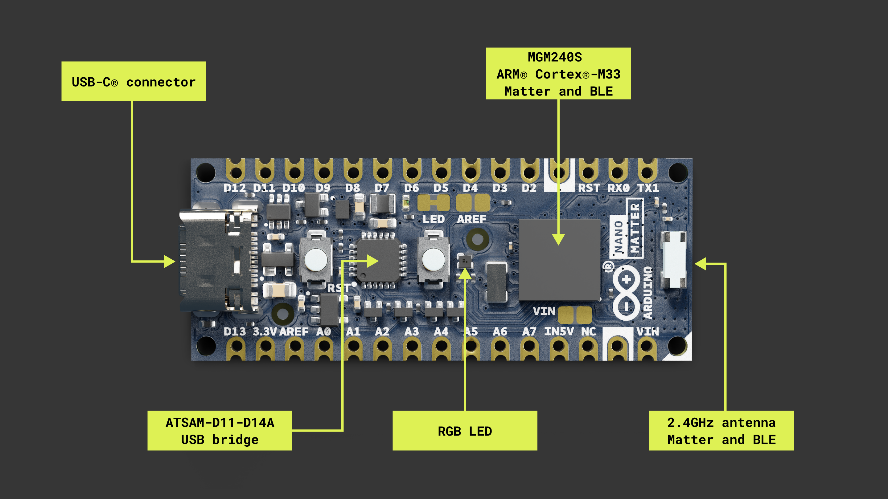

Here is an overview of the board's main components, as shown in the images above:

- **Microcontroller**: at the heart of the Nano Matter is the MGM240S, a high-performance wireless module from Silicon Labs. The MGM240S is built around a 32-bit ARM Cortex®-M33 processor running at 78 MHz. 
- **Wireless connectivity**: the Nano Matter microcontroller also features multi-protocol connectivity to enable Matter IoT protocol and Bluetooth® Low Energy. This allows the Nano Matter to be integrated with smart home systems and communicate wirelessly with other devices.

### Board Core and Libraries

The **Silicon Labs** core contains the libraries and examples you need to work with the board's components, such as its Matter, BLE, and I/Os. To install the Nano Matter core, navigate to **File > Preferences** and in the **Additional boards manager URLs**, add the following:

`https://siliconlabs.github.io/arduino/package_arduinosilabs_index.json`

Now navigate to **Tools > Board > Boards Manager** or click the Boards Manager icon in the left tab of the IDE. In the Boards Manager tab, search for `Nano Matter` and install the latest `Silicon Labs` core version.

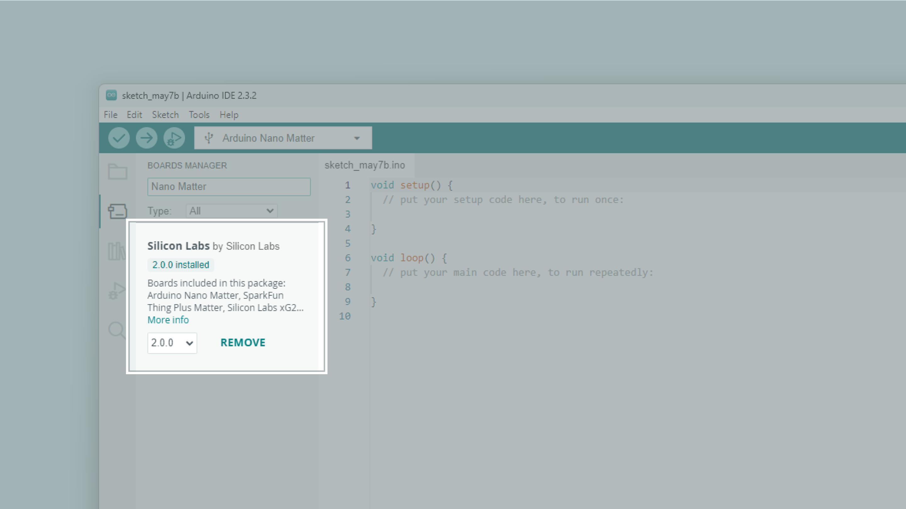

### Pinout

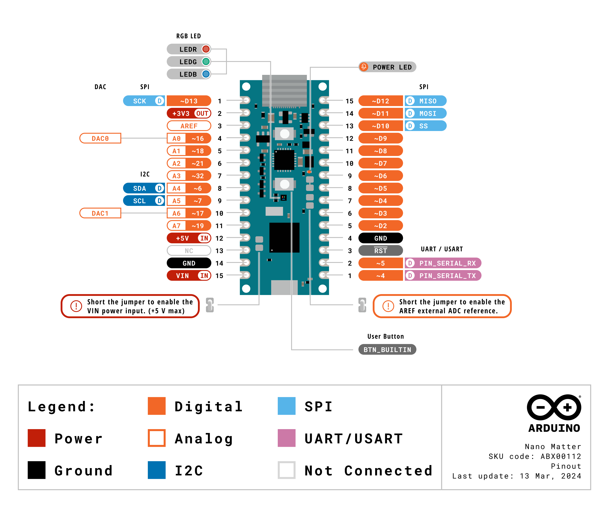

The full pinout is available and downloadable as PDF from the link below:

- [Nano Matter pinout](https://docs.arduino.cc/static/b35956b631d757a0455c286da441641b/ABX00050-full-pinout.pdf)

### Datasheet

The complete datasheet is available and downloadable as PDF from the link below:

- [Nano Matter datasheet](https://docs.arduino.cc/resources/datasheets/ABX00050-datasheet.pdf)

### Schematics

The complete schematics are available and downloadable as PDF from the link below:

- [Nano Matter schematics](https://docs.arduino.cc/resources/schematics/ABX00050-schematics.pdf)

### STEP Files

The complete STEP files are available and downloadable from the link below:

- [Nano Matter STEP files](https://docs.arduino.cc/static/10c0953581f489a9a136ff00f2d2fa9d/ABX00050-step.zip)


### Form Factor

This Nano board features castellated pins which are ideal for integrating the board into final solutions. 

You can superficially mount the Nano Matter in your custom PCB thanks to the board doesn't have any bottom-mounted components.


## First Use
### Powering the Board

The Nano Matter can be powered by:

- A USB-C® cable (not included). 
- An external **5V power supply** connected to `IN5V` pin (please, refer to the [board pinout section](#pinout) of the user manual).

***Running a Matter application the board uses up to 16 mA (not standardized test).***

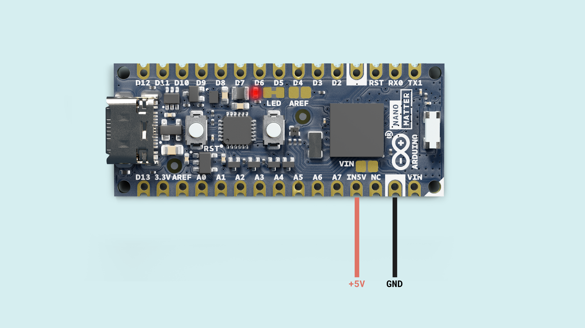

For low-power consumption applications, the following hacks are recommended:

- Cut the power status LED jumper off to save energy.
- Power the board with an external **3V3 power supply** connected to **3.3V** pin, this will not power the *USB bridge IC*, so more energy will be saved.

***Running a Matter application the board uses up to 8 mA (not standardized test).***


***To power the board through the VIN pin you need to close the jumper pads with solder. The máximum voltage supported is +5 VDC.***

### Hello World Example

Let's program the Arduino Nano Matter with the classic `hello world` example typical of the Arduino ecosystem: the `Blink` sketch. We will use this example to verify that the board is correctly connected to the Arduino IDE and that the Silicon Labs core and the board itself are working as expected. 

Copy and paste the code below into a new sketch in the Arduino IDE.

```arduino
// the setup function runs once when you press reset or power the board
void setup() {
  // initialize digital pin LED_BUILTIN as an output.
  pinMode(LED_BUILTIN, OUTPUT);
}

// the loop function runs over and over again forever
void loop() {
  digitalWrite(LED_BUILTIN, HIGH);  // turn the LED on (HIGH is the voltage level)
  delay(1000);                      // wait for a second
  digitalWrite(LED_BUILTIN, LOW);   // turn the LED off by making the voltage LOW
  delay(1000);                      // wait for a second
}
```

For the Nano Matter, the `LED_BUILTIN` macro represents the **red LED** of the built-in RGB LED of the board.

To upload the code to the Nano Matter, click the **Verify** button to compile the sketch and check for errors; then click the **Upload** button to program the board with the sketch.

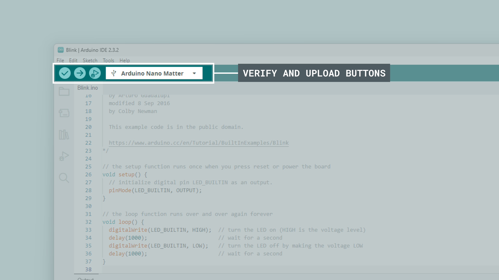

You should now see the red LED of the built-in RGB LED turning on for one second, then off for one second, repeatedly.


If everything works as expected, you are ready to continue searching and experimenting with this mighty board.

## Matter

Developing Matter-compatible IoT solutions has never been easier with the Arduino ecosystem. 


The Nano Matter can communicate with Matter hubs through a Thread network, so the hubs used must be **Thread border routers**.

The Silicon Labs core in the Arduino IDE comes with several Matter examples ready to be tested with the Nano Matter and works as a starting point for almost any IoT device we can imagine building.

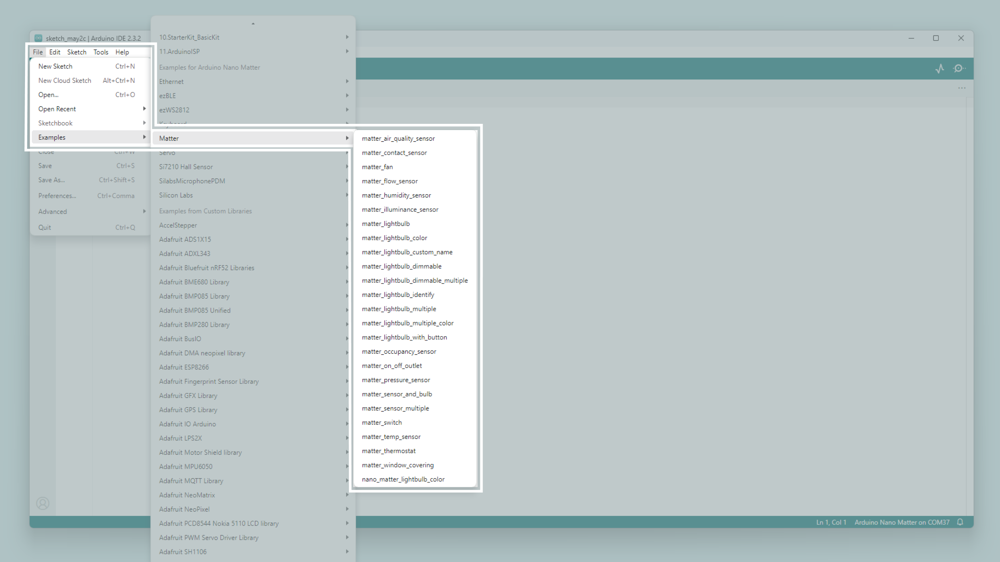

***At the moment the "matter_lightbulb" example is the only one certified, so it is normal to get an "Uncertified device" message. The remaining example certifications are still in progress.***

First, to start creating *Matter-enabled* solutions, we need to select the Matter protocol in **Tools > Protocol stack > Matter**:


In the example below, we are going to use the Nano Matter as a *RGB Lightbulb*. For this, navigate to **File > Examples > Matter** and open the built-in sketch called **nano_matter_lightbulb_color**.

```arduino
#include <Matter.h>
#include <MatterLightbulb.h>

#define LED_R LED_BUILTIN
#define LED_G LED_BUILTIN_1
#define LED_B LED_BUILTIN_2

MatterColorLightbulb matter_color_bulb;

void update_led_color();
void led_off();
void handle_button_press();
volatile bool button_pressed = false;

void setup()
{
  Serial.begin(115200);
  Matter.begin();
  matter_color_bulb.begin();
  matter_color_bulb.boost_saturation(51); // Boost saturation by 20 percent

  // Set up the onboard button
  pinMode(BTN_BUILTIN, INPUT_PULLUP);
  attachInterrupt(BTN_BUILTIN, &handle_button_press, FALLING);

  // Turn the LED off
  led_off();

  Serial.println("Arduino Nano Matter - color lightbulb");

  if (!Matter.isDeviceCommissioned()) {
    Serial.println("Matter device is not commissioned");
    Serial.println("Commission it to your Matter hub with the manual pairing code or QR code");
    Serial.printf("Manual pairing code: %s\n", Matter.getManualPairingCode().c_str());
    Serial.printf("QR code URL: %s\n", Matter.getOnboardingQRCodeUrl().c_str());
  }
  while (!Matter.isDeviceCommissioned()) {
    delay(200);
  }

  if (!Matter.isDeviceConnected()) {
    Serial.println("Waiting for network connection...");
  }
  while (!Matter.isDeviceConnected()) {
    delay(200);
  }
  Serial.println("Device connected");
}

void loop()
{
  // If the physical button state changes - update the lightbulb's on/off state
  if (button_pressed) {
    button_pressed = false;
    // Invert the on/off state of the lightbulb
    bool bulb_state = matter_color_bulb.get_onoff();
    matter_color_bulb.set_onoff(!bulb_state);
  }

  // Get the current on/off state of the lightbulb
  static bool matter_lightbulb_last_state = false;
  bool matter_lightbulb_current_state = matter_color_bulb.get_onoff();

  // If the current state is ON and the previous was OFF - turn on the LED
  if (matter_lightbulb_current_state && !matter_lightbulb_last_state) {
    matter_lightbulb_last_state = matter_lightbulb_current_state;
    Serial.println("Bulb ON");
    // Set the LEDs to the last received state
    update_led_color();
  }

  // If the current state is OFF and the previous was ON - turn off the LED
  if (!matter_lightbulb_current_state && matter_lightbulb_last_state) {
    matter_lightbulb_last_state = matter_lightbulb_current_state;
    Serial.println("Bulb OFF");
    led_off();
  }

  static uint8_t hue_prev = 0;
  static uint8_t saturation_prev = 0;
  static uint8_t brightness_prev = 0;
  uint8_t hue_curr = matter_color_bulb.get_hue();
  uint8_t saturation_curr = matter_color_bulb.get_saturation_percent();
  uint8_t brightness_curr = matter_color_bulb.get_brightness_percent();

  // If either the hue, saturation or the brightness changes - update the LED to reflect the latest change
  if (hue_prev != hue_curr || saturation_prev != saturation_curr || brightness_prev != brightness_curr) {
    update_led_color();
    hue_prev = hue_curr;
    saturation_prev = saturation_curr;
    brightness_prev = brightness_curr;
  }
}

// Updates the color of the RGB LED to match the Matter lightbulb's color
void update_led_color()
{
  if (!matter_color_bulb.get_onoff()) {
    return;
  }
  uint8_t r, g, b;
  matter_color_bulb.get_rgb(&r, &g, &b);
  analogWrite(LED_R, 255 - r);
  analogWrite(LED_G, 255 - g);
  analogWrite(LED_B, 255 - b);
  Serial.printf("Setting bulb color to > r: %u  g: %u  b: %u\n", r, g, b);
}

// Turns the RGB LED off
void led_off()
{
  analogWrite(LED_R, 255);
  analogWrite(LED_G, 255);
  analogWrite(LED_B, 255);
}

void handle_button_press()
{
  static uint32_t btn_last_press = 0;
  if (millis() < btn_last_press + 200) {
    return;
  }
  btn_last_press = millis();
  button_pressed = true;
}
```

Here is the example sketch main functions explanation:

- In the `setup()` function, Matter is initialized with `Matter.begin()` alongside the initial configurations of the board to handle the different inputs and outputs. The device commissioning is verified with `Matter.isDeviceCommissioned()` to show the user the network pairing credentials if needed and the connection is confirmed with the `Matter.isDeviceConnected()` function. 
- In the `loop()` function, the RGB LED is controlled on and off with `matter_color_bulb.set_onoff(state)`, the current state is retrieved with `matter_color_bulb.get_onoff()` and the button state is read to control the LED manually.
- In the `update_led_color()` function, the color defined in the app is retrieved using the function `matter_color_bulb.get_rgb(&r, &g, &b)` that stores the requested color code in RGB format variables.


To upload the code to the Nano Matter, click the **Verify** button to compile the sketch and check for errors; then click the **Upload** button to program the board with the sketch.


After the code is uploaded, open the Arduino IDE Serial Monitor and reset the board. To commission a Matter device to the network you will need the credentials shown in the terminal.

You will find a **Manual pairing code** and a **QR code URL** as follows:


***Open the QR code URL on your favorite browser to generate the QR code.***

### With Google Home

To create your first IoT device with the Nano Matter and the Google Home ecosystem you first need to have a Matter-compatible hub. The Google Home products that can work as a **Matter hub** through **Thread** are listed below:

- Nest Hub (2nd Gen)
- Nest Hub Max
- Nest Wifi Pro (Wi-Fi 6E)
- Nest Wifi

***Other Google devices are compatible with Matter but not Thread.***

To commission your device, open the Google Home app, navigate to devices, click on **add device** and select the **matter-enabled device** option:

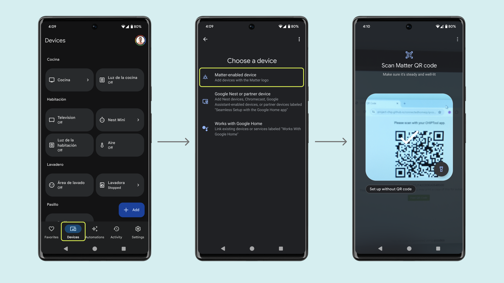

Then, wait for the device to be commissioned and added to the Google Home app:

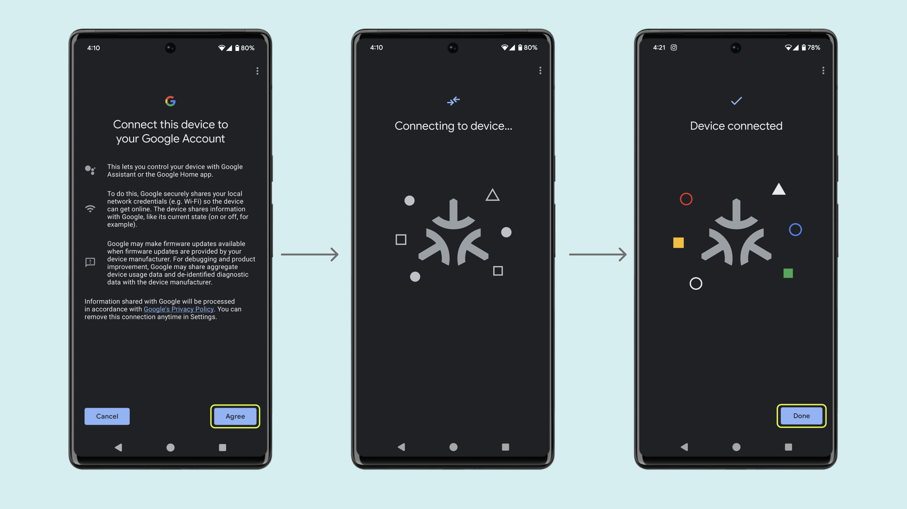

Finally, you will be able to control the Nano Matter built-in RGB LED as a native smart device. You can turn it on and off and control its color and brightness.


You are also able to control your device using voice commands with your personal assistant. 

If you want to commission your Nano Matter solution with another service, follow the steps in the [decommissioning](#device-decommissioning) section.

### With Amazon Alexa

The Amazon Alexa products that can work as a **Matter hub** through **Thread** are listed below:

- Echo (4th Gen)
- Echo Show 10 (3rd Gen)
- Echo Show 8 (3rd Gen)
- Echo Hub
- Echo Studio (2nd Gen)
- Echo Plus (2nd Gen)
- eero Pro 6 and 6E
- eero 6 and 6+
- eero PoE 6 and gateway
- eero Pro
- eero Beacon
- eero Max 7

***Other Amazon devices are compatible with Matter but not Thread.***

To commission your device, open the Amazon Alexa app, click on the upper right **+** symbol, select **device** and select the **Matter** logo option:


Read the QR code generated by the Nano Matter sketch, select the **Thread** network available and then wait for the device to be commissioned and added to the Alexa app:

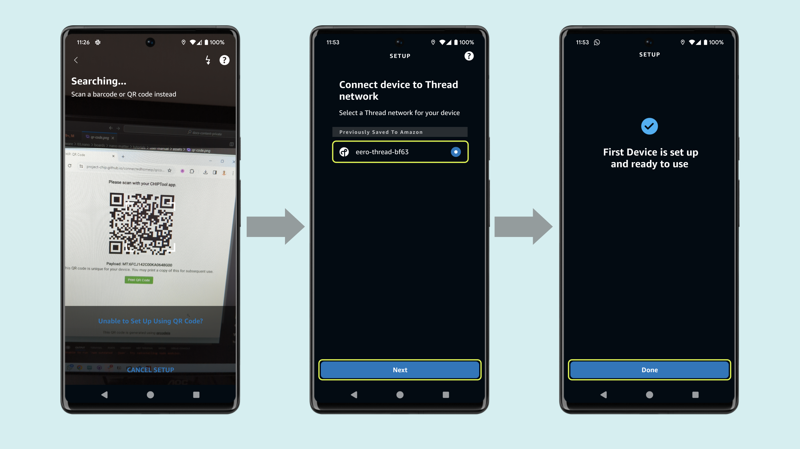

Finally, you will be able to control the Nano Matter built-in RGB LED as a native smart device. You can turn it on and off and control its color and brightness.

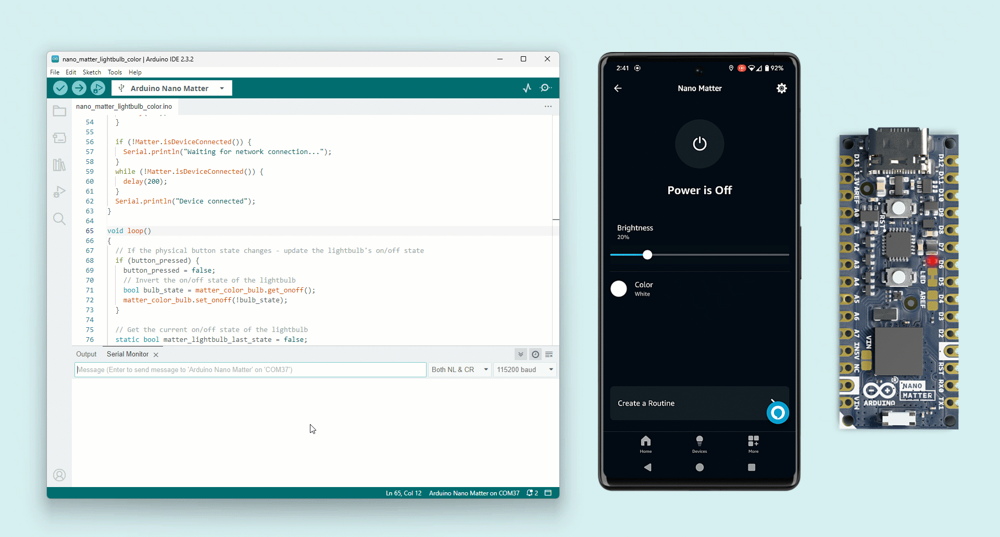

You are also able to control your device using voice commands with your personal assistant.

If you want to commission your Nano Matter solution with another service, follow the steps in the [decommissioning](#device-decommissioning) section.

### With Apple Home

The Apple Home products that can work as a **Matter hub** through **Thread** are listed below:

- Apple TV 4K (3rd generation) Wi-Fi + Ethernet
- Apple TV 4K (2nd generation)
- HomePod (2nd generation)
- HomePod mini

You are also able to control your device using voice commands with your personal assistant.

If you want to commission your Nano Matter solution with another service, follow the steps in the [decommissioning](#device-decommissioning) section.

### With Home Assistant

To use Matter with Home Assistant you will need one of the *Google Home* or *Apple Home* devices that can work as a **Thread Border Router**, listed in the previous sections.

To set up Home Assistant so it can manage our Matter devices, first, we need to install the **Matter Server** add-on. For this, navigate to **Settings > Add-Ons > Add-On Store** and search for **Matter server**:


With the Matter server installed, now navigate to **Settings > Devices % Services > Add Integration** and search for **Matter**:

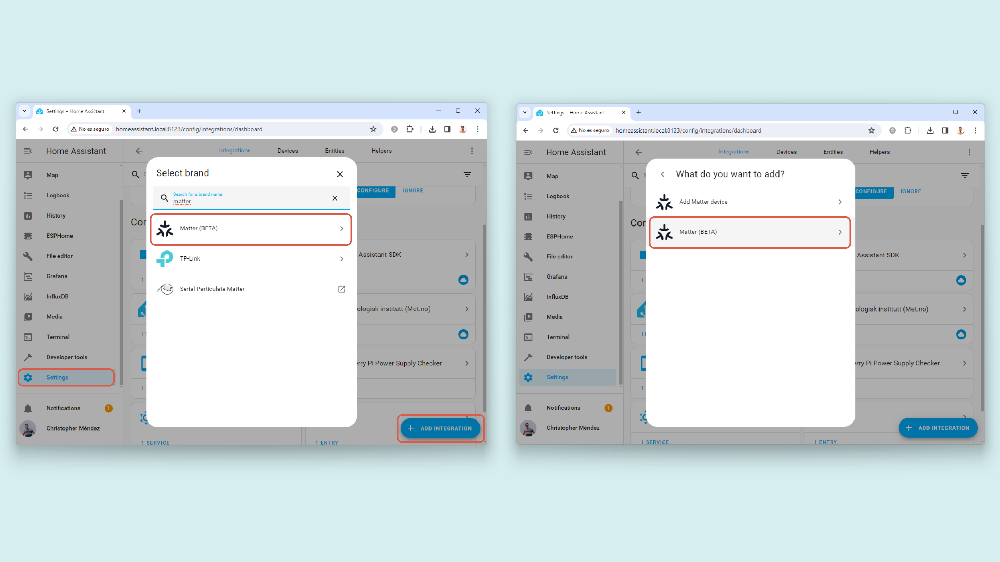

A prompt will show up asking for a connection method; if you are working with customs containers to run the Matter server, uncheck the box. 

In our case, we leave it checked as the Matter server is running in Home Assistant.

You will receive a **Success** message if everything is okay. With the Home Assistant integration ready, we can start with the Nano Matter commissioning.

To commission your device, open the Home Assistant app on your smartphone, go to **Settings > Devices & Services**, in the lower tabs bar, go to **Devices** and tap on **Add Device**. Tap on **Add Matter device** and scan the QR code generated by the Nano Matter in the Serial Monitor:


Then, wait for the device to be commissioned and added to the Home Assistant app:

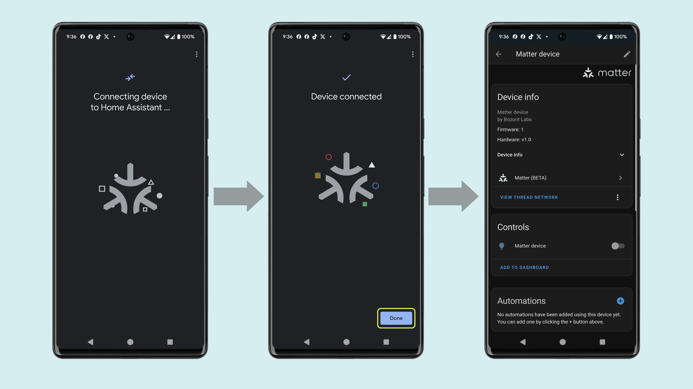

Finally, you will be able to control the Nano Matter built-in RGB LED as a native smart device. You can turn it on and off and control its color and brightness.

You can use the Home Assistant web view or mobile app to control your device.


If you want to commission your Nano Matter solution with another service, follow the steps in the [decommissioning](#device-decommissioning) section.

#### Tips 

- Make sure you are using a **64-bit** Home Assistant OS version.
- Use the **Thread** add-on to verify your available Thread networks.
- You can just have a Matter device commissioned to one vendor at a time.

### Device Decommissioning 

If you have a Matter device configured and working for example with the Google Home ecosystem, and you want to integrate it with Alexa or Apple Home instead; you need to decommission it first from the previous service. 

In simple terms, **decommissioning** refers to unpairing your device from a current service to be able to pair it with a new one.

You can integrate this method in your solutions to leverage the Nano Matter built-in button to handle decommissioning:

```arduino
#include <Matter.h>

void setup() {
  // put your setup code here, to run once:
  Serial.begin(115200);

  Matter.begin();
  pinMode(BTN_BUILTIN, INPUT_PULLUP);
  pinMode(LEDR, OUTPUT);
  digitalWrite(LEDR, HIGH);
}

void loop() {
  // put your main code here, to run repeatedly:
  decommission_handler();
}


void decommission_handler() {
  if (digitalRead(BTN_BUILTIN) == LOW) {  //Push button pressed
    // measures time pressed
    int startTime = millis();
    while (digitalRead(BTN_BUILTIN) == LOW) {
      delay(50);

      int elapsedTime = (millis() - startTime) / 1000.0;

      if (elapsedTime > 10) {
        Serial.printf("Decommissioning!\n");
        for (int i = 0; i < 10; i++) {
          digitalWrite(LEDR, !(digitalRead(LEDR)));
          delay(100);
        };

        if (!Matter.isDeviceCommissioned()) {
          Serial.println("Decommission done!");
          digitalWrite(LEDR, LOW);
        } else {
          Serial.println("Matter device is commissioned-> Starting Decommission process");
          nvm3_eraseAll(nvm3_defaultHandle);  // Decomission command
          digitalWrite(LED_BUILTIN, LOW);
          Serial.println("Decommission done!");
        }
        break;
      }
    }
  }
}
```
The sketch above allows you to decommission your board manually after **pressing** the Nano Matter user button for **10 seconds**. You can monitor the status in the Arduino IDE Serial Monitor.

## Bluetooth® Low Energy

To enable Bluetooth® Low Energy communication on the Nano Matter, you must enable the BLE protocol stack in the Arduino IDE board configurations. 

In the upper menu, navigate to **Tools > Protocol stack** and select **BLE**.

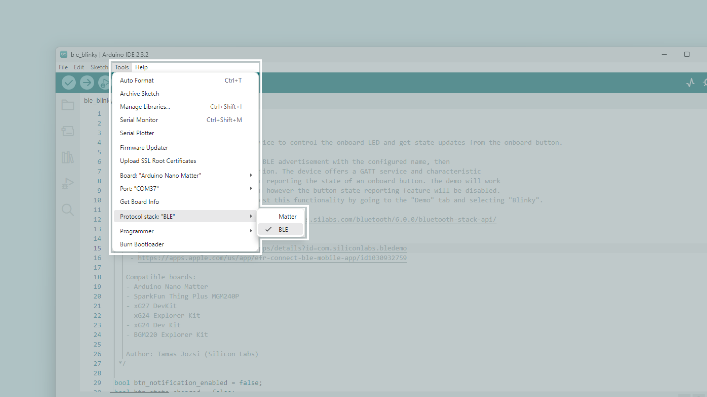

For this BLE application example, we are going to control the Nano Matter built-in LED and read the onboard button status. The example sketch to be used can be found in **File > Examples > Silicon Labs >ble_blinky**:

```arduino
/*
   BLE blinky example
*/

bool btn_notification_enabled = false;
bool btn_state_changed = false;
uint8_t btn_state = LOW;
static void btn_state_change_callback();
static void send_button_state_notification();
static void set_led_on(bool state);

void setup()
{
  pinMode(LED_BUILTIN, OUTPUT);
  set_led_on(false);
  Serial.begin(115200);
  Serial.println("Silicon Labs BLE blinky example");

  // If the board has a built-in button configure it for usage
  #ifdef BTN_BUILTIN
  pinMode(BTN_BUILTIN, INPUT_PULLUP);
  attachInterrupt(BTN_BUILTIN, btn_state_change_callback, CHANGE);
  #else // BTN_BUILTIN
  // Avoid warning for unused function on boards without a button
  (void)btn_state_change_callback;
  #endif // BTN_BUILTIN
}

void loop()
{
  if (btn_state_changed) {
    btn_state_changed = false;
    send_button_state_notification();
  }
}

static void ble_initialize_gatt_db();
static void ble_start_advertising();

static const uint8_t advertised_name[] = "Blinky Example";
static uint16_t gattdb_session_id;
static uint16_t generic_access_service_handle;
static uint16_t name_characteristic_handle;
static uint16_t blinky_service_handle;
static uint16_t led_control_characteristic_handle;
static uint16_t btn_report_characteristic_handle;

/**************************************************************************//**
 * Bluetooth stack event handler
 * Called when an event happens on BLE the stack
 *
 * @param[in] evt Event coming from the Bluetooth stack
 *****************************************************************************/
void sl_bt_on_event(sl_bt_msg_t *evt)
{
  switch (SL_BT_MSG_ID(evt->header)) {
    // -------------------------------
    // This event indicates the device has started and the radio is ready.
    // Do not call any stack command before receiving this boot event!
    case sl_bt_evt_system_boot_id:
    {
      Serial.println("BLE stack booted");

      // Initialize the application specific GATT table
      ble_initialize_gatt_db();

      // Start advertising
      ble_start_advertising();
      Serial.println("BLE advertisement started");
    }
    break;

    // -------------------------------
    // This event indicates that a new connection was opened
    case sl_bt_evt_connection_opened_id:
      Serial.println("BLE connection opened");
      break;

    // -------------------------------
    // This event indicates that a connection was closed
    case sl_bt_evt_connection_closed_id:
      Serial.println("BLE connection closed");
      // Restart the advertisement
      ble_start_advertising();
      Serial.println("BLE advertisement restarted");
      break;

    // -------------------------------
    // This event indicates that the value of an attribute in the local GATT
    // database was changed by a remote GATT client
    case sl_bt_evt_gatt_server_attribute_value_id:
      // Check if the changed characteristic is the LED control
      if (led_control_characteristic_handle == evt->data.evt_gatt_server_attribute_value.attribute) {
        Serial.println("LED control characteristic data received");
        // Check the length of the received data
        if (evt->data.evt_gatt_server_attribute_value.value.len == 0) {
          break;
        }
        // Get the received byte
        uint8_t received_data = evt->data.evt_gatt_server_attribute_value.value.data[0];
        // Turn the LED on/off according to the received data
        if (received_data == 0x00) {
          set_led_on(false);
          Serial.println("LED off");
        } else if (received_data == 0x01) {
          set_led_on(true);
          Serial.println("LED on");
        }
      }
      break;

    // -------------------------------
    // This event is received when a GATT characteristic status changes
    case sl_bt_evt_gatt_server_characteristic_status_id:
      // If the 'Button report' characteristic has been changed
      if (evt->data.evt_gatt_server_characteristic_status.characteristic == btn_report_characteristic_handle) {
        // The client just enabled the notification - send notification of the current button state
        if (evt->data.evt_gatt_server_characteristic_status.client_config_flags & sl_bt_gatt_notification) {
          Serial.println("Button state change notification enabled");
          btn_notification_enabled = true;
          btn_state_change_callback();
        } else {
          Serial.println("Button state change notification disabled");
          btn_notification_enabled = false;
        }
      }
      break;

    // -------------------------------
    // Default event handler
    default:
      break;
  }
}

/**************************************************************************//**
 * Called on button state change - stores the current button state and
 * sets a flag that a button state change occurred.
 * If the board doesn't have a button the function does nothing.
 *****************************************************************************/
static void btn_state_change_callback()
{
  // If the board has a built-in button
  #ifdef BTN_BUILTIN
  // The real button state is inverted - most boards have an active low button configuration
  btn_state = !digitalRead(BTN_BUILTIN);
  btn_state_changed = true;
  #endif // BTN_BUILTIN
}

/**************************************************************************//**
 * Sends a BLE notification the the client if notifications are enabled and
 * the board has a built-in button.
 *****************************************************************************/
static void send_button_state_notification()
{
  if (!btn_notification_enabled) {
    return;
  }
  sl_status_t sc = sl_bt_gatt_server_notify_all(btn_report_characteristic_handle,
                                                sizeof(btn_state),
                                                &btn_state);
  if (sc == SL_STATUS_OK) {
    Serial.print("Notification sent, button state: ");
    Serial.println(btn_state);
  }
}

/**************************************************************************//**
 * Sets the built-in LED to the desired state accounting for the inverted LED
 * logic on select boards.
 *****************************************************************************/
static void set_led_on(bool state)
{
  bool state_out = state;
  #if defined(ARDUINO_NANO_MATTER) || defined(ARDUINO_SILABS_WIOMG24_BLE) || defined(ARDUINO_SILABS_XG24DEVKIT)
  // These boards have an inverted LED logic, state is negated to account for this
  state_out = !state_out;
  #endif
  digitalWrite(LED_BUILTIN, state_out);
}

/**************************************************************************//**
 * Starts BLE advertisement
 * Initializes advertising if it's called for the first time
 *****************************************************************************/
static void ble_start_advertising()
{
  static uint8_t advertising_set_handle = 0xff;
  static bool init = true;
  sl_status_t sc;

  if (init) {
    // Create an advertising set
    sc = sl_bt_advertiser_create_set(&advertising_set_handle);
    app_assert_status(sc);

    // Set advertising interval to 100ms
    sc = sl_bt_advertiser_set_timing(
      advertising_set_handle,
      160,   // minimum advertisement interval (milliseconds * 1.6)
      160,   // maximum advertisement interval (milliseconds * 1.6)
      0,     // advertisement duration
      0);    // maximum number of advertisement events
    app_assert_status(sc);

    init = false;
  }

  // Generate data for advertising
  sc = sl_bt_legacy_advertiser_generate_data(advertising_set_handle, sl_bt_advertiser_general_discoverable);
  app_assert_status(sc);

  // Start advertising and enable connections
  sc = sl_bt_legacy_advertiser_start(advertising_set_handle, sl_bt_advertiser_connectable_scannable);
  app_assert_status(sc);
}

/**************************************************************************//**
 * Initializes the GATT database
 * Creates a new GATT session and adds certain services and characteristics
 *****************************************************************************/
static void ble_initialize_gatt_db()
{
  sl_status_t sc;
  // Create a new GATT database
  sc = sl_bt_gattdb_new_session(&gattdb_session_id);
  app_assert_status(sc);

  // Add the Generic Access service to the GATT DB
  const uint8_t generic_access_service_uuid[] = { 0x00, 0x18 };
  sc = sl_bt_gattdb_add_service(gattdb_session_id,
                                sl_bt_gattdb_primary_service,
                                SL_BT_GATTDB_ADVERTISED_SERVICE,
                                sizeof(generic_access_service_uuid),
                                generic_access_service_uuid,
                                &generic_access_service_handle);
  app_assert_status(sc);

  // Add the Device Name characteristic to the Generic Access service
  // The value of the Device Name characteristic will be advertised
  const sl_bt_uuid_16_t device_name_characteristic_uuid = { .data = { 0x00, 0x2A } };
  sc = sl_bt_gattdb_add_uuid16_characteristic(gattdb_session_id,
                                              generic_access_service_handle,
                                              SL_BT_GATTDB_CHARACTERISTIC_READ,
                                              0x00,
                                              0x00,
                                              device_name_characteristic_uuid,
                                              sl_bt_gattdb_fixed_length_value,
                                              sizeof(advertised_name) - 1,
                                              sizeof(advertised_name) - 1,
                                              advertised_name,
                                              &name_characteristic_handle);
  app_assert_status(sc);

  // Start the Generic Access service
  sc = sl_bt_gattdb_start_service(gattdb_session_id, generic_access_service_handle);
  app_assert_status(sc);

  // Add the Blinky service to the GATT DB
  // UUID: de8a5aac-a99b-c315-0c80-60d4cbb51224
  const uuid_128 blinky_service_uuid = {
    .data = { 0x24, 0x12, 0xb5, 0xcb, 0xd4, 0x60, 0x80, 0x0c, 0x15, 0xc3, 0x9b, 0xa9, 0xac, 0x5a, 0x8a, 0xde }
  };
  sc = sl_bt_gattdb_add_service(gattdb_session_id,
                                sl_bt_gattdb_primary_service,
                                SL_BT_GATTDB_ADVERTISED_SERVICE,
                                sizeof(blinky_service_uuid),
                                blinky_service_uuid.data,
                                &blinky_service_handle);
  app_assert_status(sc);

  // Add the 'LED Control' characteristic to the Blinky service
  // UUID: 5b026510-4088-c297-46d8-be6c736a087a
  const uuid_128 led_control_characteristic_uuid = {
    .data = { 0x7a, 0x08, 0x6a, 0x73, 0x6c, 0xbe, 0xd8, 0x46, 0x97, 0xc2, 0x88, 0x40, 0x10, 0x65, 0x02, 0x5b }
  };
  uint8_t led_char_init_value = 0;
  sc = sl_bt_gattdb_add_uuid128_characteristic(gattdb_session_id,
                                               blinky_service_handle,
                                               SL_BT_GATTDB_CHARACTERISTIC_READ | SL_BT_GATTDB_CHARACTERISTIC_WRITE,
                                               0x00,
                                               0x00,
                                               led_control_characteristic_uuid,
                                               sl_bt_gattdb_fixed_length_value,
                                               1,                               // max length
                                               sizeof(led_char_init_value),     // initial value length
                                               &led_char_init_value,            // initial value
                                               &led_control_characteristic_handle);

  // Add the 'Button report' characteristic to the Blinky service
  // UUID: 61a885a4-41c3-60d0-9a53-6d652a70d29c
  const uuid_128 btn_report_characteristic_uuid = {
    .data = { 0x9c, 0xd2, 0x70, 0x2a, 0x65, 0x6d, 0x53, 0x9a, 0xd0, 0x60, 0xc3, 0x41, 0xa4, 0x85, 0xa8, 0x61 }
  };
  uint8_t btn_char_init_value = 0;
  sc = sl_bt_gattdb_add_uuid128_characteristic(gattdb_session_id,
                                               blinky_service_handle,
                                               SL_BT_GATTDB_CHARACTERISTIC_READ | SL_BT_GATTDB_CHARACTERISTIC_NOTIFY,
                                               0x00,
                                               0x00,
                                               btn_report_characteristic_uuid,
                                               sl_bt_gattdb_fixed_length_value,
                                               1,                               // max length
                                               sizeof(btn_char_init_value),     // initial value length
                                               &btn_char_init_value,            // initial value
                                               &btn_report_characteristic_handle);

  // Start the Blinky service
  sc = sl_bt_gattdb_start_service(gattdb_session_id, blinky_service_handle);
  app_assert_status(sc);

  // Commit the GATT DB changes
  sc = sl_bt_gattdb_commit(gattdb_session_id);
  app_assert_status(sc);
}

```
Here are the main functions explanations of the example sketch:

The `sl_bt_on_event(sl_bt_msg_t *evt)` function is the main one of the sketch and it is responsible for:
- Initiating the BLE radio, and start advertising the defined services alongside its characteristics.
- Handling the opening and closing of connections.
- Handling incoming and outgoing BLE messages.

The `ble_initialize_gatt_db()` function is responsible for:
- Adding the Generic Access service with the `1800` UUID.
- Adding the Blinky service with the `de8a5aac-a99b-c315-0c80-60d4cbb51224` UUID.
- Creating the device name characteristic so we can find the device as "Blinky Example" with the `2A00` UUID.
- Adding the LED Control characteristic to the Blinky service with the `5b026510-4088-c297-46d8-be6c736a087a` UUID.
- Adding the Button report characteristic to the Blinky service with the `61a885a4-41c3-60d0-9a53-6d652a70d29c` UUID.

***Note that if you want to implement a different or custom BLE service or characteristic, the UUID arrays have to start with the least significant bit (LSB) from left to right.***

After uploading the sketch to the Nano Matter, it's time to communicate with it through BLE. For this, Silicon Labs has developed a **mobile app** that you can download from here:

- [Android](https://play.google.com/store/apps/details?id=com.siliconlabs.bledemo)
- [iOS](https://itunes.apple.com/us/app/silicon-labs-blue-gecko-wstk/id1030932759)

Open the *EFR Connect BLE Mobile APP* on your smartphone, in the lower menu, navigate to **Demo** and select **Blinky**:

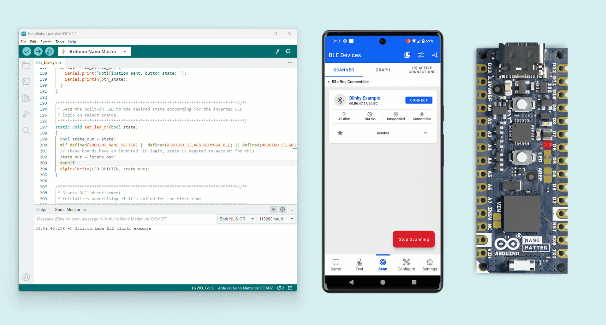

***You can also manage the LED control and button status manually from the Scan tab in the lower menu.***

## Onboard User Interface

### User Button

The Nano Matter includes an onboard **push button** that can be used as an input by the user. The button is connected to the GPIO `PA0` and can be read using the `BTN_BUILTIN` macro.

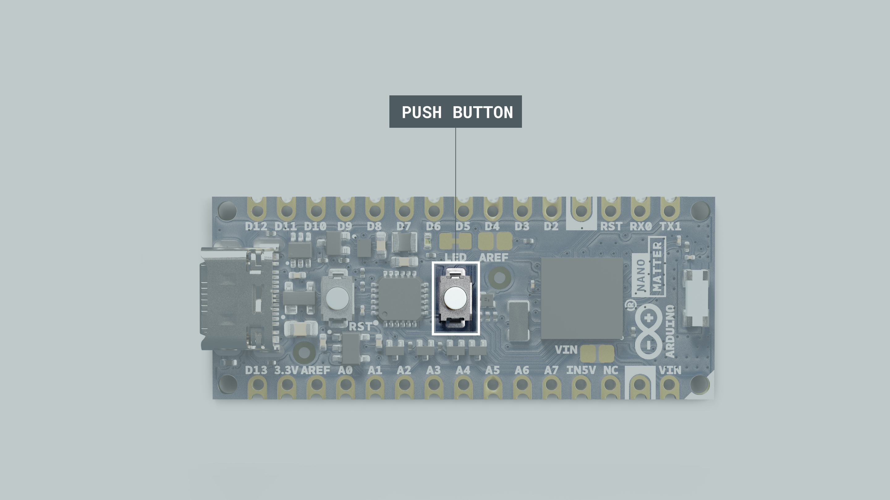

The button pulls the input to ground when pressed, so is important to define the **pull-up resistor** to avoid undesired behavior by leaving the input floating.

Here you can find a complete example code to blink the built-in RGB LED of the Nano Matter:

```arduino
volatile bool button_pressed = false;

void handle_button_press();

void setup() {
  Serial.begin(115200);

  pinMode(BTN_BUILTIN, INPUT_PULLUP);
  attachInterrupt(BTN_BUILTIN, &handle_button_press, FALLING);
}

void loop() {
  // If the physical button state changes - update the state
  if (button_pressed) {
    button_pressed = false;
    Serial.println("Button Pressed!");
  }
}

void handle_button_press()
{
  static uint32_t btn_last_press = 0;
  if (millis() < btn_last_press + 200) {
    return;
  }
  btn_last_press = millis();
  button_pressed = true;
}

```

After pressing the push button, you will see a **"Button Pressed!"** message in the Serial Monitor.

### RGB LED

The Nano Matter features a built-in RGB LED that can be a visual feedback indicator for the user. The LED is connected through the board GPIO's; therefore, usual digital pins built-in functions can be used to operate the LED colors. 

| **LED Color Segment** | **Arduino Name** | **Microcontroller Pin** |
|:---------------------:|:----------------:|:-----------------------:|
|          Red          |   LEDR or LED_BUILTIN    |          PC01           |
|         Green         |  LEDG or LED_BUILTIN_1   |          PC02           |
|         Blue          |  LEDB or LED_BUILTIN_2   |          PC03           |

***The RGB LED colors are activated with zeros, this means that you need to set to LOW the color segment you want to turn on.***

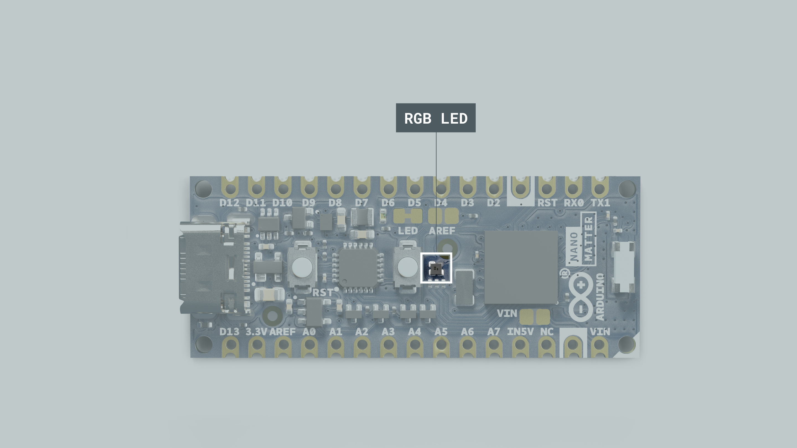


Here you can find a complete example code to blink the built-in RGB LED of the Nano Matter:

```arduino
void setup() {
  // initialize LED digital pins as outputs.
  pinMode(LEDR, OUTPUT);
  pinMode(LEDG, OUTPUT);
  pinMode(LEDB, OUTPUT);
}

// the loop function runs over and over again forever
void loop() {
  digitalWrite(LEDR, LOW);  // turn the LED on (LOW is the voltage level)
  digitalWrite(LEDG, HIGH);  // turn the LED off (HIGH is the voltage level)
  digitalWrite(LEDB, HIGH);  // turn the LED off (HIGH is the voltage level)
  delay(1000);                      // wait for a second
  digitalWrite(LEDR, HIGH);   // turn the LED off by making the voltage HIGH
  digitalWrite(LEDG, LOW);   // turn the LED on by making the voltage LOW
  digitalWrite(LEDB, HIGH);   // turn the LED off by making the voltage HIGH
  delay(1000);                      // wait for a second
  digitalWrite(LEDR, HIGH);   // turn the LED off by making the voltage HIGH
  digitalWrite(LEDG, HIGH);   // turn the LED off by making the voltage HIGH
  digitalWrite(LEDB, LOW);   // turn the LED on by making the voltage LOW
  delay(1000);   
}
```

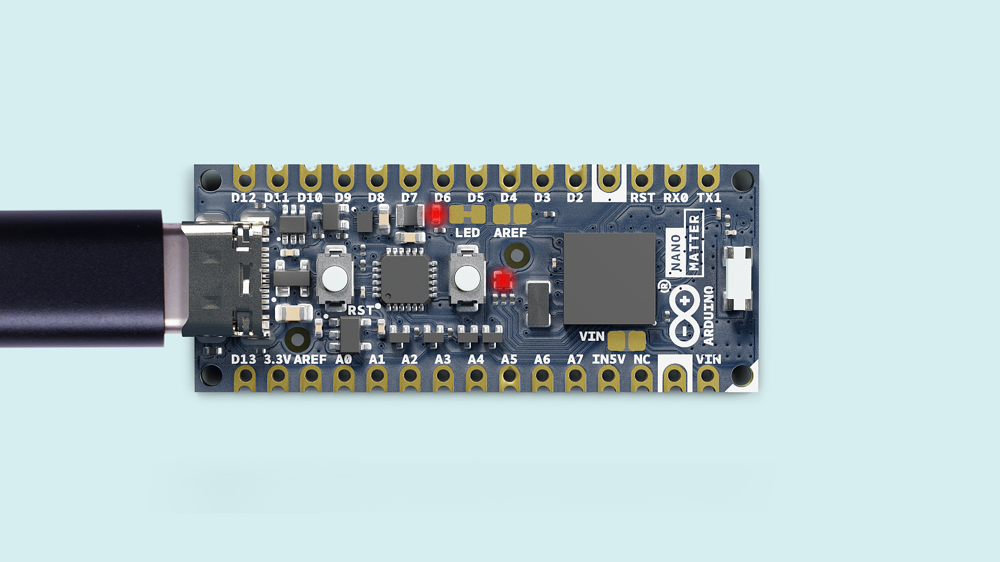

## Pins

### Digital Pins

The Nano Matter has **22 digital pins**, mapped as follows:

| **Microcontroller Pin** | **Arduino Pin Mapping** | **Pin Functionality** |
|:-----------------------:|:-----------------------:|:---------------------:|
|          PB00           |           A0            |     GPIO/ADC/DAC      |
|          PB02           |           A1            |       GPIO/ADC        |
|          PB05           |           A2            |       GPIO/ADC        |
|          PC00           |           A3            |       GPIO/ADC        |
|          PA06           |         A4/SDA          |     I2C/GPIO/ADC      |
|          PA07           |         A5/SCL          |     I2C/GPIO/ADC      |
|          PB01           |           A6            |     GPIO/ADC/DAC      |
|          PB03           |           A7            |       GPIO/ADC        |
|          PB04           |           D13           |     SPI/GPIO/ADC      |
|          PA08           |           D12           |     SPI/GPIO/ADC      |
|          PA09           |           D11           |     SPI/GPIO/ADC      |
|          PD05           |           D10           |       SPI/GPIO        |
|          PD04           |           D9            |         GPIO          |
|          PD03           |           D8            |       GPIO/ADC        |
|          PD02           |           D7            |       GPIO/ADC        |
|          PC09           |           D6            |       GPIO/ADC        |
|          PC08           |           D5            |       GPIO/ADC        |
|          PC07           |           D4            |       GPIO/ADC        |
|          PC06           |           D3            |       GPIO/ADC        |
|          PA03           |           D2            |         GPIO          |
|          PA04           |      PIN_SERIAL_TX      |     UART/GPIO/ADC     |
|          PA05           |      PIN_SERIAL_RX      |     UART/GPIO/ADC     |


The digital pins of the Nano Matter can be used as inputs or outputs through the built-in functions of the Arduino programming language. 

The configuration of a digital pin is done in the `setup()` function with the built-in function `pinMode()` as shown below:

```arduino
// Pin configured as an input
pinMode(pin, INPUT);        

// Pin configured as an output
pinMode(pin, OUTPUT);        

// Pin configured as an input, internal pull-up resistor enabled
pinMode(pin, INPUT_PULLUP);  
```

The state of a digital pin, configured as an input, can be read using the built-in function `digitalRead()` as shown below:

```arduino
// Read pin state, store value in a state variable
state = digitalRead(pin);
```

The state of a digital pin, configured as an output, can be changed using the built-in function `digitalWrite()` as shown below:

```arduino
// Set pin on
digitalWrite(pin, HIGH);    

// Set pin off
digitalWrite(pin, LOW);    
```

The example code shown below uses digital pin `5` to control an LED and reads the state of a button connected to digital pin `4`:


```arduino
// Define button and LED pin
int buttonPin = 4;
int ledPin = 5;

// Variable to store the button state
int buttonState = 0;

void setup() {
  // Configure button and LED pins
  pinMode(buttonPin, INPUT_PULLUP);
  pinMode(ledPin, OUTPUT);

  // Initialize Serial communication
  Serial.begin(115200);
}

void loop() {
  // Read the state of the button
  buttonState = digitalRead(buttonPin);

  // If the button is pressed, turn on the LED and print its state to the Serial Monitor
  if (buttonState == LOW) {
    digitalWrite(ledPin, HIGH);
    Serial.println("- Button is pressed. LED is on.");
  } else {
    // If the button is not pressed, turn off the LED and print to the Serial Monitor
    digitalWrite(ledPin, LOW);
    Serial.println("- Button is not pressed. LED is off.");
  }

  // Wait for 1000 milliseconds
  delay(1000);
}
```

### PWM Pins

All the digital and analog pins of the Nano Matter can be used as PWM (Pulse Width Modulation) pins. 

***You can only use 5 PWMs outputs simultaneously.***

This functionality can be used with the built-in function `analogWrite()` as shown below:

```arduino
analogWrite(pin, value);  
```
By default, the output resolution is 8 bits, so the output value should be between 0 and 255. To set a greater resolution, do it using the built-in function `analogWriteResolution` as shown below:

```arduino
analogWriteResolution(bits);  
```

Using this function has some limitations, for example, the PWM signal frequency is fixed at 1 KHz, and this could not be ideal for every application.

Here is an example of how to create a **1 KHz** variable duty-cycle PWM signal:

```arduino
const int analogInPin = A0;   // Analog input pin that the potentiometer is attached to
const int pwmOutPin = 13;  // PWM output pin

int sensorValue = 0;  // value read from the pot
int outputValue = 0;  // value output to the PWM (analog out)

void setup() {
  // initialize serial communications at 9600 bps:
  Serial.begin(115200);
  analogWriteResolution(12);
}

void loop() {
  // read the analog in value:
  sensorValue = analogRead(analogInPin);
  // map it to the range of the analog out:
  outputValue = sensorValue;
  // change the analog out value:
  analogWrite(pwmOutPin, outputValue);

  // print the results to the Serial Monitor:
  Serial.print("sensor = ");
  Serial.print(sensorValue);
  Serial.print("\t output = ");
  Serial.println(outputValue);

  // wait 2 milliseconds before the next loop for the analog-to-digital
  // converter to settle after the last reading:
  delay(2);
}
```


If you need to work with a **higher frequency** PWM signal, you can do it with the following PWM class-specific function:

```arduino
PWM.frequency_mode(output_pin, frequency);
```
Here is an example of how to create a **10 KHz** fixed duty-cycle PWM signal:

```arduino
const int analogOutPin = 13;  // PWM output pin to use

void setup() {
  analogWriteResolution(12); 
}

void loop() {
  PWM.frequency_mode(analogOutPin, 10000);
}
```


### Analog Input Pins (ADC)

The Nano Matter has **19 analog input pins**, mapped as follows:

| **Microcontroller Pin** | **Arduino Pin Mapping** | **Pin Functionality** |
|:-----------------------:|:-----------------------:|:---------------------:|
|          PB00           |           A0            |     GPIO/ADC/DAC      |
|          PB02           |           A1            |       GPIO/ADC        |
|          PB05           |           A2            |       GPIO/ADC        |
|          PC00           |           A3            |       GPIO/ADC        |
|          PA06           |         A4/SDA          |     I2C/GPIO/ADC      |
|          PA07           |         A5/SCL          |     I2C/GPIO/ADC      |
|          PB01           |           A6            |     GPIO/ADC/DAC      |
|          PB03           |           A7            |       GPIO/ADC        |
|          PB04           |           D13           |     SPI/GPIO/ADC      |
|          PA08           |           D12           |     SPI/GPIO/ADC      |
|          PA09           |           D11           |     SPI/GPIO/ADC      |
|          PD03           |           D8            |       GPIO/ADC        |
|          PD02           |           D7            |       GPIO/ADC        |
|          PC09           |           D6            |       GPIO/ADC        |
|          PC08           |           D5            |       GPIO/ADC        |
|          PC07           |           D4            |       GPIO/ADC        |
|          PC06           |           D3            |       GPIO/ADC        |
|          PA04           |      PIN_SERIAL_TX      |     UART/GPIO/ADC     |
|          PA05           |      PIN_SERIAL_RX      |     UART/GPIO/ADC     |

***Digital I/O's can also be used as analog inputs with `D10`,`D9` and `D2` as exceptions.***

Analog input pins can be used through the built-in functions of the Arduino programming language. 

Nano Matter ADC resolution is fixed to 12 bits and can not be changed by the user.

The Nano Matter ADC reference voltage is 3.3 V by default, it can be configured using the function `analogReference()` with the following arguments:


|   **Argument**   |        **Description**         |
|:----------------:|:------------------------------:|
|  AR_INTERNAL1V2  |    Internal 1.2V reference     |
| AR_EXTERNAL_1V25 |    External 1.25V reference    |
|      AR_VDD      |   VDD (unbuffered to ground)   |
|     AR_08VDD     | 0.8 * VDD (buffered to ground) |
|      AR_MAX      |         Maximum value          |

To set a different analog reference from the default one, see the following example:

```arduino
analogReference(AR_INTERNAL1V2); 
```

The example code shown below reads the analog input value from a potentiometer connected to `A0` and displays it on the IDE Serial Monitor. To understand how to properly connect a potentiometer to the Nano Matter, take the following image as a reference:

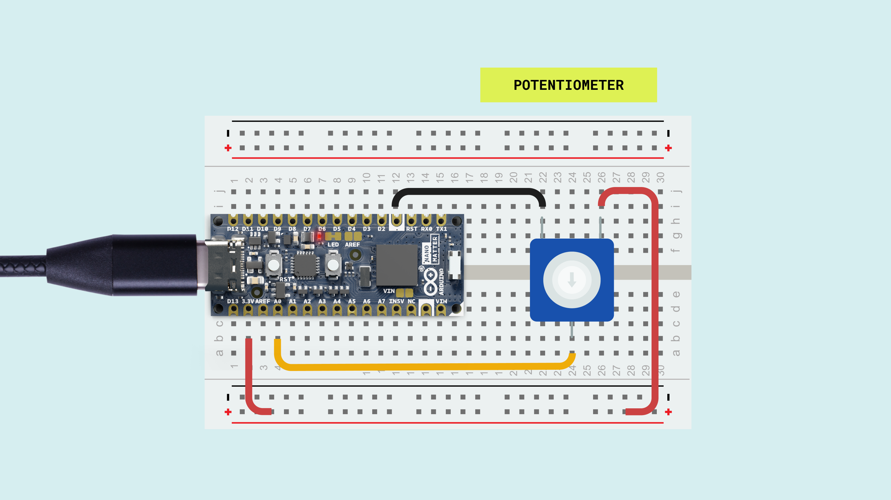

```arduino
int sensorPin = A0;   // select the input pin for the potentiometer

int sensorValue = 0;  // variable to store the value coming from the sensor

void setup() {
  Serial.begin(115200); 
}

void loop() {
  // read the value from the sensor:
  sensorValue = analogRead(sensorPin);

  Serial.println(sensorValue);
  delay(100);
}
```

### Analog Output Pins (DAC)

The Nano Matter has **one DAC** with two channels, mapped as follows:

| **Microcontroller Pin** | **Arduino Name** | **Board Pin Output** | **Peripheral** |
|:-----------------------:|:----------------:|:--------------------:|:--------------:|
|          PB00           |       DAC0       |          A0          |    DAC0_CH0    |
|          PB01           |       DAC1       |          A6          |    DAC0_CH1    |

The digital-to-analog converters of the Nano Matter can be used as outputs through the built-in functions of the Arduino programming language.

The DAC output resolution can be configured using the `analogWriteResolution()` function as follows:

```arduino
analogWriteResolution(12);  // enter the desired resolution in bits (8,10,12)
```
The DAC voltage reference can be configured using the `analogReferenceDAC()` function. The available setups are listed below:

|     **Argument**      |     **Description**      |
|:---------------------:|:------------------------:|
|     DAC_VREF_1V25     | Internal 1.25V reference |
|     DAC_VREF_2V5      | Internal 2.5V reference  |
|     DAC_VREF_AVDD     |        Analog VDD        |
| DAC_VREF_EXTERNAL_PIN |    External AREF pin     |

```arduino
analogReferenceDAC(DAC_VREF_2V5);  // enter the desired reference as argument
```
To output an analog voltage value through a DAC pin, use the `analogWrite()` function with the **DAC channel** as an argument. See the example below:

```arduino
analogWrite(DAC0, value);   // the value should be in the range of the DAC resolution (e.g. 0-4095 with a 12 bits resolution)
```

***If a normal GPIO is passed to the analogWrite() function, the output will be a PWM signal.***


The following sketch will create a **sine** wave signal in the `A0` Nano Matter pin:

```arduino
float sample_rate = 9600.0, freq = 60.0;  //samples/second, AC waveform freq.
int npts = sample_rate / freq;

void setup()
{
  Serial.begin(115200);
  // Set the DAC resolution to 12 bits
  analogWriteResolution(12);
  // Select the 1.25V reference voltage (feel free to change it)
  analogReferenceDAC(DAC_VREF_1V25);
}

void loop()
{

  for (int i = 0; i < npts; i++) {
    int x = 2000 + 1000.0 * sin(2 * PI * (freq / sample_rate) * i);
    analogWrite(DAC0, x);
    delayMicroseconds(1.0E6 / sample_rate);  //adjust constant to get correct rate
  }
}
```
The DAC output should look like the image below:


The following sketch will create a **sawtooth** wave signal in the `A0` Nano Matter pin:

```arduino
void setup()
{
  Serial.begin(115200);
  // Set the DAC resolution to 8 bits
  analogWriteResolution(8);
  // Select the 2.5V reference voltage (feel free to change it)
  analogReferenceDAC(DAC_VREF_2V5);
}

void loop()
{
  static int value = 0;
  analogWrite(DAC0, value);
  Serial.println(value);

  value++;
  if (value == 255) {
    value = 0;
  }
}
```
The DAC output should look like the image below:


## Communication

This section of the user manual covers the different communication protocols that are supported by the Nano Matter, including the Serial Peripheral Interface (SPI), Inter-Integrated Circuit (I2C) and Universal Asynchronous Receiver-Transmitter (UART). The Nano Matter features dedicated pins for each communication protocol, simplifying the connection and communication with different components, peripherals, and sensors.

### SPI

The Nano Matter supports SPI communication, which allows data transmission between the board and other SPI-compatible devices. The pins used in the Nano Matter for the SPI communication protocol are the following:

| **Microcontroller Pin** | **Arduino Pin Mapping** |
|:-----------------------:|:-----------------------:|
|          PD05           |        SS or D10         |
|          PA09           |       MOSI or D11        |
|          PA08           |       MISO or D12        |
|          PB04           |        SCK or D13        |

Please, refer to the [board pinout section](#pinout) of the user manual to localize them on the board.

Include the `SPI` library at the top of your sketch to use the SPI communication protocol. The SPI library provides functions for SPI communication:

```arduino
#include <SPI.h>
```

In the `setup()` function, initialize the SPI library, define and configure the chip select (`SS`) pin:

```arduino

void setup() {
  // Set the chip select pin as output
  pinMode(SS, OUTPUT); 

  // Pull the CS pin HIGH to unselect the device
  digitalWrite(SS, HIGH); 
  
  // Initialize the SPI communication
  SPI.begin();
}
```

To transmit data to an SPI-compatible device, you can use the following commands:

```arduino
// Replace with the target device's address
byte address = 0x35; 

// Replace with the value to send
byte value = 0xFA; 

// Pull the CS pin LOW to select the device
digitalWrite(SS, LOW); 

// Send the address
SPI.transfer(address); 

// Send the value
SPI.transfer(value); 

// Pull the CS pin HIGH to unselect the device
digitalWrite(SS, HIGH); 
```

The example code above should output this:

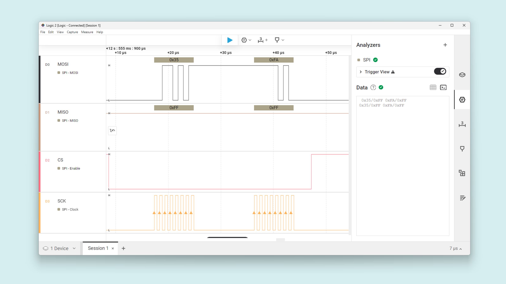

### I2C

The Nano Matter supports I2C communication, which allows data transmission between the board and other I2C-compatible devices. The pins used in the Nano Matter for the I2C communication protocol are the following:

| **Microcontroller Pin** | **Arduino Pin Mapping** |
|:-----------------------:|:-----------------------:|
|          PA06           |           SDA           |
|          PA07           |           SCL           |

Please, refer to the [board pinout section](#pinout) of the user manual to localize them on the board.

To use I2C communication, include the `Wire` library at the top of your sketch. The `Wire` library provides functions for I2C communication:

```arduino
#include <Wire.h>
```

In the `setup()` function, initialize the I2C library:

```arduino
 // Initialize the I2C communication
Wire.begin();
```

To transmit data to an I2C-compatible device, you can use the following commands:

```arduino
// Replace with the target device's I2C address
byte deviceAddress = 0x35; 

// Replace with the appropriate instruction byte
byte instruction = 0x00; 

// Replace with the value to send
byte value = 0xFA; 

// Begin transmission to the target device
Wire.beginTransmission(deviceAddress); 

// Send the instruction byte
Wire.write(instruction); 

// Send the value
Wire.write(value); 

// End transmission
Wire.endTransmission(); 
```

The output data should look like the image below, where we can see the device address data frame:


To read data from an I2C-compatible device, you can use the `requestFrom()` function to request data from the device and the `read()` function to read the received bytes:

```arduino
// The target device's I2C address
byte deviceAddress = 0x1; 

// The number of bytes to read
int numBytes = 2; 

// Request data from the target device
Wire.requestFrom(deviceAddress, numBytes);

// Read while there is data available
while (Wire.available()) {
  byte data = Wire.read(); 
}
```

### UART

The pins used in the Nano Matter for the UART communication protocol are the following:

| **Microcontroller Pin** | **Arduino Pin Mapping** |
|:-----------------------:|:-----------------------:|
|          PA05           |      PIN_SERIAL_RX      |
|          PA04           |      PIN_SERIAL_TX      |

Please, refer to the [board pinout section](#pinout) of the user manual to localize them on the board.

To begin with UART communication, you will need to configure it first. In the `setup()` function, set the baud rate (bits per second) for UART communication:

```arduino
// Start UART communication at 115200 baud
Serial1.begin(115200); 
```

To read incoming data, you can use a `while()` loop to continuously check for available data and read individual characters. The code shown below stores the incoming characters in a String variable and processes the data when a line-ending character is received:

```arduino
// Variable for storing incoming data
String incoming = ""; 

void loop() {
  // Check for available data and read individual characters
  while (Serial1.available()) {
    // Allow data buffering and read a single character
    delay(2); 
    char c = Serial1.read();
    
    // Check if the character is a newline (line-ending)
    if (c == '\n') {
      // Process the received data
      processData(incoming);

      // Clear the incoming data string for the next message
      incoming = ""; 
    } else {
      // Add the character to the incoming data string
      incoming += c; 
    }
  }
}
```

To transmit data to another device via UART, you can use the `write()` function:

```arduino
// Transmit the string "Hello world!
Serial1.write("Hello world!");
```

You can also use the `print` and `println()` to send a string without a newline character or followed by a newline character:

```arduino
// Transmit the string "Hello world!" 
Serial1.print("Hello world!");

// Transmit the string "Hello world!" followed by a newline character
Serial1.println("Hello world!");
```


## Support

If you encounter any issues or have questions while working with the Nano Matter, we provide various support resources to help you find answers and solutions.

### Help Center

Explore our [Help Center](https://support.arduino.cc/hc/en-us), which offers a comprehensive collection of articles and guides for the Nano Matter. The Arduino Help Center is designed to provide in-depth technical assistance and help you make the most of your device.

- [Nano Matter help center page](https://support.arduino.cc/hc/en-us/sections/360004605400-Nano-Family)

### Forum

Join our community forum to connect with other Nano Matter users, share your experiences, and ask questions. The forum is an excellent place to learn from others, discuss issues, and discover new ideas and projects related to the Nano Matter.

- [Nano Matter category in the Arduino Forum](https://forum.arduino.cc/c/hardware/nano-family/87)

### Contact Us

Please get in touch with our support team if you need personalized assistance or have questions not covered by the help and support resources described before. We're happy to help you with any issues or inquiries about the Nano Matter.

- [Contact us page](https://www.arduino.cc/en/contact-us/) 