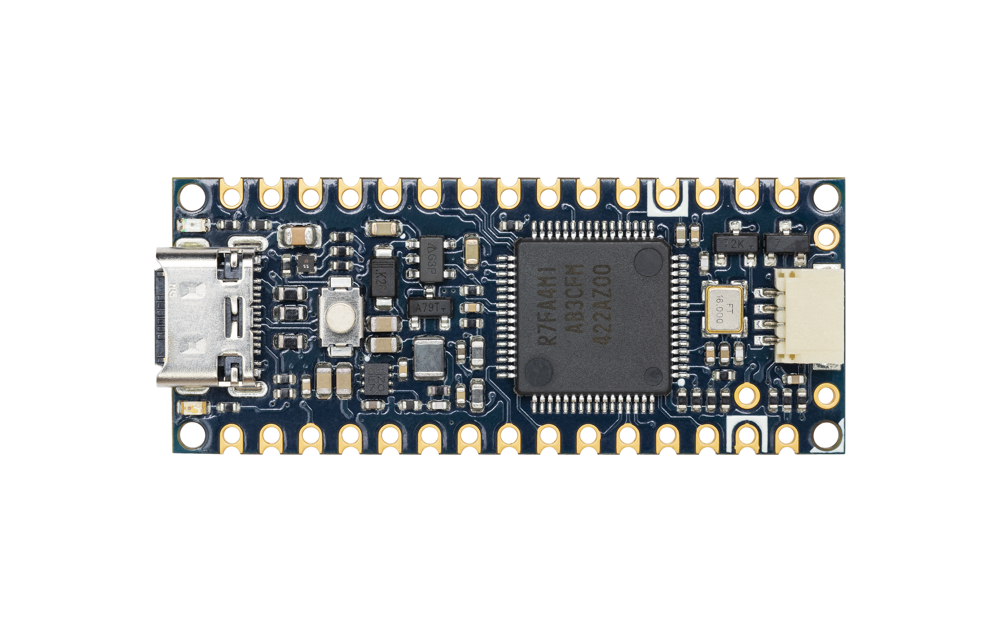
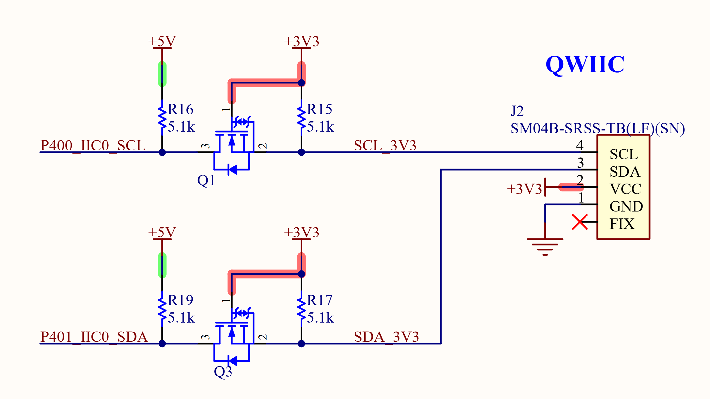
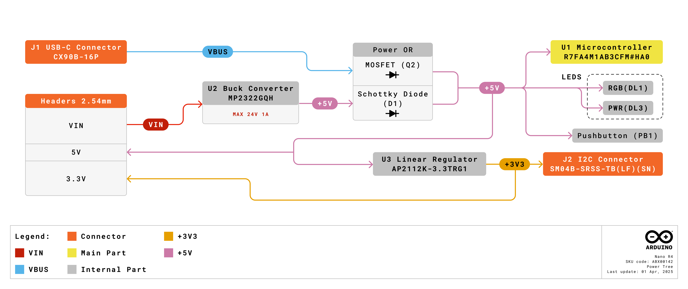
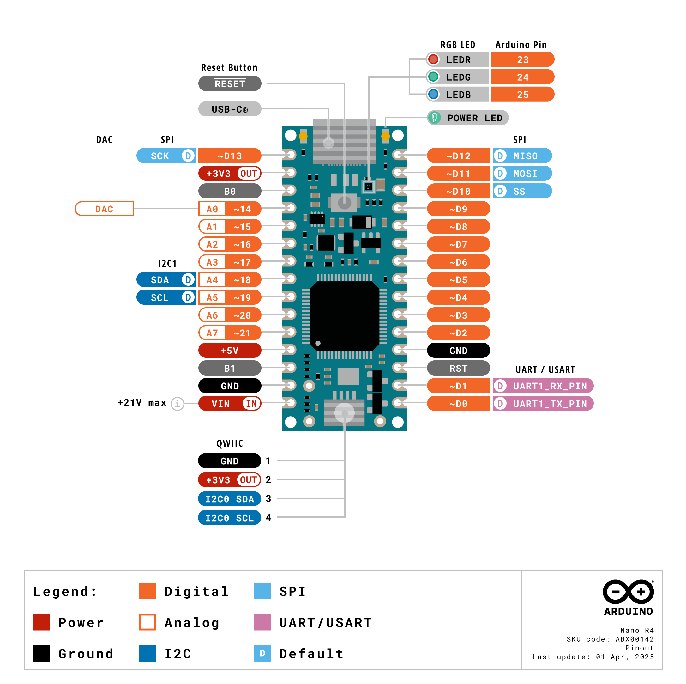
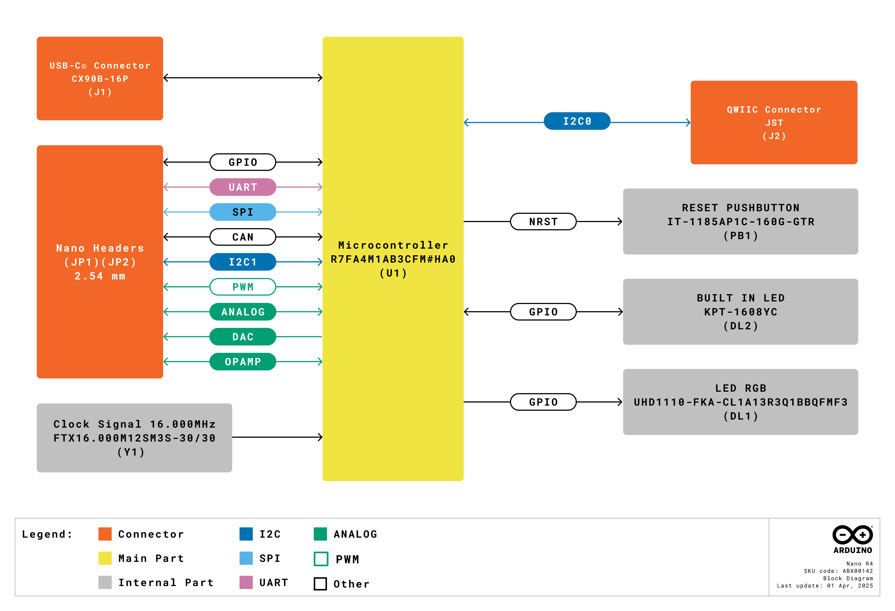
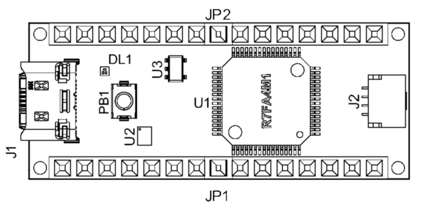
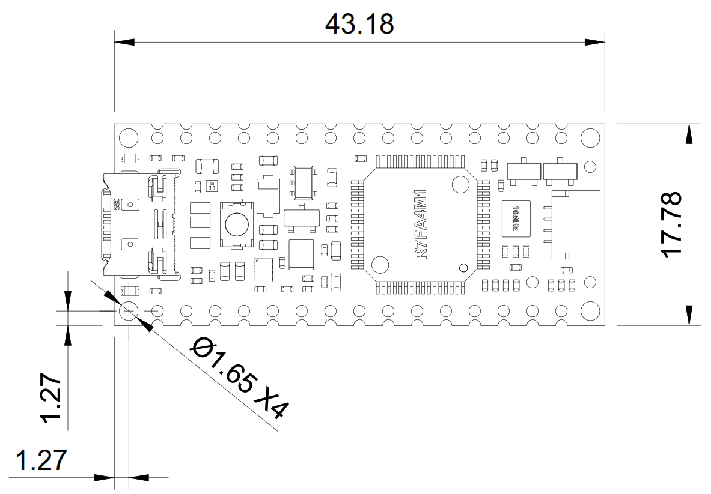
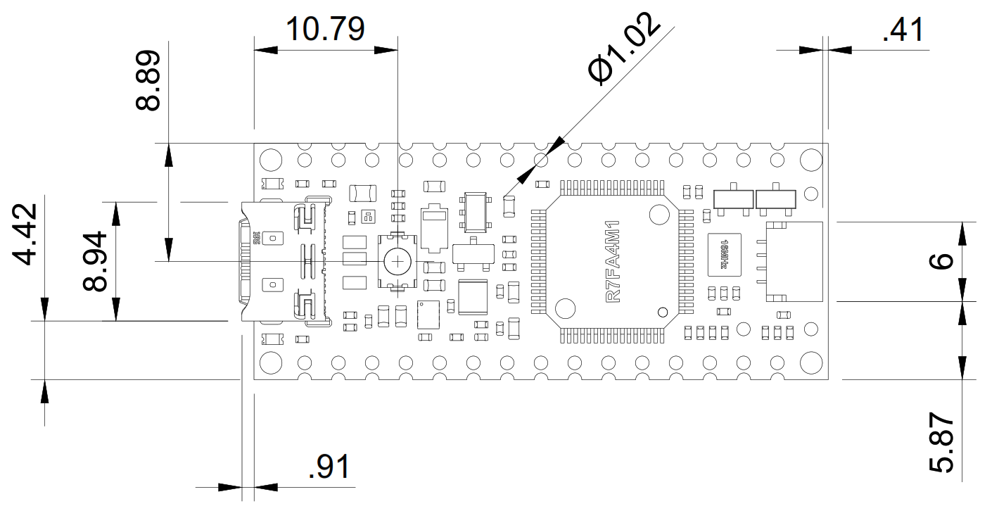

# Description

The Arduino® Nano R4 is a Nano form factor board based on the RA4M1 series microcontroller from Renesas (R7FA4M1AB3CFM#HA0), which embeds a 48 MHz Arm® Cortex®-M4 microprocessor. The Nano R4's memory is larger than its predecessors, with 256 kB flash, 32 kB SRAM and 8 kB data memory (EEPROM). The Nano R4 board operates at 5 V, making it hardware compatible with Nano form factor accessories with the same operating voltage.

The Nano R4 is available in two variants: without headers (SKU: ABX00142) and with pre-installed headers (SKU: ABX00143).

Leverage the on-board Qwiic connector for seamless integration with Modulinos, enabling quick and reliable expansion of your project.

# Target areas:

Digital Signal Processing, System on Module, Edge Computing, Rapid Prototyping

# Contents

## Application Examples

**Effortless Transition:** Move seamlessly from prototyping to production with the familiar RA4M1 microcontroller present already in the UNO R4 family.

**Entry level projects:** If this is your first project within coding and electronics, the Nano R4 is a good fit. It is easy to get started with and has a lot of online documentation (both official + community).

**Easy power management:** The Nano R4 supports input voltages from 6 to 21 V. It removes the need for additional circuitry required to step down the voltage.

**Enhanced Connectivity:** Features an onboard Qwiic connector for easy integration with a wide range of sensors and peripherals. Exposing a new I2C connection apart from the standard one found on A4 and A5 pins. The Qwiic connector makes the Nano R4 compatible with the Arduino Modulino boards.

**Cross compatibility:** The Nano form factor automatically makes it compatible with hundreds of existing third-party shields and other official accessories.

## Features
### General Specifications Overview

The Nano R4 is an evolution of its predecessor, the Nano Classic, which was previously based on 8-bit AVR microcontrollers. There are thousands of guides, tutorials and books written about the Nano board, where Nano R4 continues its legacy.

The board features the standard 14x digital I/O ports, 8x analog channels, dedicated pins for I2C, SPI and UART
connections. Compared to its predecessors the board has a much larger memory: 8x times more flash memory (256 kB) and 16x times more SRAM (32 kB).

| **Feature**           | **Description**                                                                                                                               |
|-----------------------|-----------------------------------------------------------------------------------------------------------------------------------------------|
| Microcontroller       | R7FA4M1AB3CFM 32-bit Arm® Cortex®-M4                                                                                                          |
| Frequency             | 48 MHz                                                                                                                                        |
| Internal Memory       | 256 kB Flash/32 kB RAM/8 kB EEPROM                                                                                                            |
| USB Connectivity      | USB-C® port for power and data                                                                                                                |
| Power                 | Input voltage (VIN): 6-21 V / Power via USB-C® at 5 V                                                                                         |
| Digital Inputs        | GPIO (21x - All exposed I/O can be used as digital), PWM (6x)                                                                                 |
| Analog Inputs         | 14-bit ADC (8x)                                                                                                                               |
| Real-time Clock (RTC) | Yes (external crystal oscillator included)                                                                                                    |
| Communication         | Serial interfaces (2x: Serial over USB, Serial1 on D0/D1), I2C (2x) (5 V over breakout and 3.3 V over Qwiic), SPI (1x), CAN (external transceiver required) (1x) |

| Dimensions            | 18 mm x 45 mm                                                                                                                                 |
| Operating Temperature | -40 °C to +85 °C                                                                                                                              |

### Microcontroller

The Nano R4 is based on the 32-bit RA4M1 series microcontroller, **R7FA4M1AB3CFM#HA0**, from Renesas, which uses a 48 MHz Arm® Cortex®-M4 microprocessor with a floating point unit (FPU).

On the Nano R4, the operating voltage is fixed at 5 V to be fully retro compatible with shields, accessories and circuits originally designed for older Nano revisions.

| Component                              | Details                                                                     |
| -------------------------------------- | --------------------------------------------------------------------------- |
| R7FA4M1AB3CFM Processor                | Arm® Cortex®-M4 core at up to 48 MHz                                        |
| Flash Memory                           | 256 kB of Flash Memory                                                      |
| Programming Memory                     | 32 kB of RAM                                                                |
| Data Memory                            | 8 kB of EEPROM                                                              |
| Real-time Clock (RTC)                  | Yes (external crystal oscillator included)                                  |
| Direct Memory Access Controller (DMAC) | Yes (4x)                                                                    |
| ADC                                    | Yes (14-bit)                                                                |
| DAC                                    | Yes (12-bit)                                                                |
| Operational Amplifier (OPAMP)          | Yes (ranges specified on dedicated [section](#operational-amplifier-opamp)) |
| CAN bus                                | Yes (external transceiver required)                                         |

For more technical details on this microcontroller, visit [Renesas - RA4M1 series official documentation](https://www.renesas.com/us/en/products/microcontrollers-microprocessors/ra-cortex-m-mcus/ra4m1-32-bit-microcontrollers-48mhz-arm-cortex-m4-and-lcd-controller-and-cap-touch-hmi).

### USB-C® Connector

The Nano R4 has one USB-C® port, used to power and program your board as well as send and receive serial communication.

You should not power the board with more than <strong>5 V</strong> via the USB-C® port.

### Digital Analog Converter (DAC)

The Nano R4 has a DAC with up to 12-bit resolution attached to the A0 analog pin. A DAC is used to convert a digital signal to an analog signal.

### Operational Amplifier (OPAMP)

The Nano R4 features one Operational Amplifier accessible through the board analog pins. See the [pinout](#pinout) section for details.

| Parameter               | Conitions       | Min | Typ | Max     | Unit |
| ----------------------- | --------------- | --- | --- | ------- | ---- |
| Common mode input range | Low power mode  | 0.2 | -   | VCC-0.5 | V    |
| Common mode input range | High-speed mode | 0.3 | -   | VCC-0.6 | V    |
| Output voltage range    | Low power mode  | 0.1 | -   | VCC-0.1 | V    |
| Output voltage range    | High-speed mode | 0.1 | -   | VCC-0.1 | V    |

### Qwiic I2C Connector

The I2C Qwiic connector SM04B-SRSS-TB(LF)(SN) is connected to a secondary I2C bus (I2C0) on the board. This connector is powered via 3.3 V following the Qwiic standard system and makes the Nano R4 compatible with the Arduino Modulino nodes.

The Qwiic connector logic level is fixed to 3.3 V, and it is translated to 5 V to communicate with the RA4M1 microcontroller as illustrated in the figure below:

 
**Note:** The Qwiic I2C bus object is `Wire1` and the standard I2C bus object is `Wire`.

The standard I2C is accessible through the Nano breakout pins A4 for SDA and A5 for SCL as its predecessors.

A4 and A5 are connected to the main I2C bus, these pins should not be used as ADC inputs whenever the bus is in use. You can however connect I2C devices to each of these pins and connectors simultaneously.

### Realtime Clock (RTC)

The Nano R4 features a Real-time Clock allowing you to keep accurate time (date and clock), even when the board is powered off. This is ideal for data logging, scheduling tasks, or timestamping events.

The Realtime Clock (RTC) has two counting modes: calendar count mode and binary count mode, both are controlled by the register settings.

- For calendar count mode, the RTC has a 100-year calendar from 2000 to 2099 and automatically adjusts dates for leap years.
- For binary count mode, the RTC counts seconds and retains the information as a serial value. Binary count mode can be used for calendars other than the Gregorian (Western) calendar.

The Nano R4 features an external 16 MHz crystal oscillator that improve considerably the accuracy of the RTC and other sub-clock dependent peripherals.

### Board Actuators 

The Nano R4 features an RGB LED and single color built-in LED, both can be controlled through the Nano R4 GPIOs. See the [pinout](#pinout) section for a detailed overview.

### Related Products

- Arduino Nano (A000005)
- Arduino® UNO R4 Minima (ABX00080)
- Arduino® UNO R4 WiFi (ABX00087)
- Arduino Modulino nodes
- Nano Connector Carrier (ASX00061)

## Ratings

### Recommended Operating Conditions

The table below provides a guideline for the optimal use of the Nano R4 board, outlining typical operating conditions and design limits. The operating conditions of the Nano R4 are largely a function based on its component's specifications.

|    **Symbol**   |        **Description**        | **Min** | **Typ** | **Max** | **Unit** |
|:---------------:|:-----------------------------:|:-------:|:-------:|:-------:|:--------:|
|  VIN |    Input voltage (VIN pin)    |   6.0   |   7.0   |   21.0  |    VDC   |
| VUSB | Input voltage (USB connector) |   4.8   |   5.0   |   5.5   |    VDC   |
| IUSB | Input current (USB connector) |    -    |    -    |   500   |    mA    |
|  TOP |     Operating temperature     |   -40   |    25   |    85   |    °C    |

¹USB current is limited by USB 2.0 specification (500 mA maximum).

<strong>Note:</strong> VDD controls the logic level and is connected to the +5 VDC power rail. VAREF sets the reference voltage for the analog-to-digital converter (ADC).

### Power Options

Power can either be supplied via the VIN pin, or via USB-C® connector. If power is supplied via VIN, the MP2322GQH buck converter steps the voltage down to 5 V.

A power OR circuit manages the selection between the USB and the +5 VDC output of the buck converter supplied from VIN, automatically routing the available voltage to the system's main power rail.

When using the 3V3 pin to power external peripherals, notice that above 150 mA the board may become very hot due to LDO regulator functioning basis.

#### Power Tree

The following diagram illustrates the Nano R4 main system power architecture.

### GPIO Voltage

The Nano R4 operates at 5 V as do all pins on this board except for the **Qwiic** connector that works at **3.3 V**. This connector draws power from the AP2112K-3.3TRG1 regulator.

### GPIO Current

The GPIOs on the R7FA4M1AB3CFM microcontroller can handle up to **8 mA**. Never connect devices that draw higher current directly to a GPIO.

In case you need to drive external devices that require more current, e.g. high brightness LEDs, use an external current amplifier interface (e.g. a MOSFET or a transistor).

### RTC Battery Backup

The Nano R4 features a battery backup function. It can be powered through the **VBATT** pin (see [pinout](#pinout) section).
The battery backup will power the RTC, the 32.768 kHz oscillators, the wakeup control and the backup memory.

During normal operation, the battery powered area is powered by the main power supply, which is the VCC pin. When a VCC voltage drop is detected, the power source is switched to
the dedicated battery backup power pin, the VBATT pin. When the voltage rises again, the power source is switched from the VBATT pin to the VCC pin.

| Parameter                                               | Min  | Typ  | Max  | Unit |
| ------------------------------------------------------- | ---- | ---- | ---- | ---- |
| VBATT power supply voltage                              | 1.6  | -    | 3.6  | V    |
| Voltage level for switching to battery backup (falling) | 1.99 | 2.09 | 2.19 | V    |

 

## Functional Overview

The core of the Nano R4 is the R7FA4M1AB3CFM microcontroller from Renesas. The board also contains
several peripherals connected to its microcontroller.

### Pinout

The Nano breakout connectors pinout is shown in the following figure.

#### Analog (JP1)

| Pin | Function  | Type      | Description                             |
| --- | --------- | --------- | --------------------------------------- |
| 1   | D13 / SCK | Digital   | Serial Clock                            |
| 2   | +3V3      | Power Out | +3V3 Power Rail                         |
| 3   | AREF      | Analog    | Analog Voltage Reference                |
| 4   | A0        | Analog    | Analog input 0 / DAC                    |
| 5   | A1        | Analog    | Analog input 1 / OPAMP +                |
| 6   | A2        | Analog    | Analog input 2 / OPAMP -                |
| 7   | A3        | Analog    | Analog input 3 / OPAMP Out              |
| 8   | A4        | Analog    | Analog input 4 / I²C Serial Data (SDA)  |
| 9   | A5        | Analog    | Analog input 5 / I²C Serial Clock (SCL) |
| 10  | A6        | Analog    | Analog input 6                          |
| 11  | A7        | Analog    | Analog input 7                          |
| 12  | 5V        | Power     | USB power (5 V)                         |
| 13  | BOOT      | Mode      | Mode selection                          |
| 14  | GND       | Power     | Ground                                  |
| 15  | VIN       | Power     | Voltage Input                           |

#### Digital (JP2)

| Pin | Function   | Type     | Description                             |
| --- | ---------- | -------- | --------------------------------------- |
| 15  | D12 / CIPO | Digital  | Controller In Peripheral Out            |
| 14  | D11 / COPI | Digital  | Controller Out Peripheral In / PWM      |
| 13  | D10 / CS   | Digital  | Chip Select / PWM                       |
| 12  | D9         | Digital  | Digital pin 9 / PWM                     |
| 11  | D8         | Digital  | Digital pin 8                           |
| 10  | D7         | Digital  | Digital pin 7                           |
| 9   | D6         | Digital  | Digital pin 6 / PWM                     |
| 8   | D5         | Digital  | Digital pin 5 / PWM / CAN (RX)          |
| 7   | D4         | Digital  | Digital pin 4 / CAN (TX)                |
| 6   | D3         | Digital  | Digital pin 3 / PWM                     |
| 5   | D2         | Digital  | Digital pin 2                           |
| 4   | GND        | Power    | Ground                                  |
| 3   | RST        | Internal | Reset (features a button)               |
| 2   | D0/RX      | Digital  | Digital pin 0 / Serial Receiver (RX)    |
| 1   | D1/TX      | Digital  | Digital pin 1 / Serial Transmitter (TX) |

### Block Diagram

An overview of the Nano R4 high-level architecture is illustrated in the figure below.

## Board Topology
### Overall View

| **Reference** | **Description**                          |
| ------------- | ---------------------------------------- |
| U1            | R7FA4M1AB3CFM Microcontroller IC     |
| U2            | MP2322GQH Buck Converter                 |
| U3            | AP2112K-3.3TRG1 Dropout linear regulator |
| PB1           | RESET Button                             |
| JP1           | Analog input/output headers              |
| JP2           | Digital input/output headers             |
| J1            | CX90B-16P USB-C® connector               |
| J2            | I2C Qwiic connector                      |
| DL1           | RGB LED                                  |

## Device Operation

### Getting Started - IDE

If you want to program your Nano R4 while offline you need to install the Arduino® Desktop IDE **[1]**. To connect the Nano R4 to your computer, you will need a Type-C® USB cable, which can also provide power to the board, as indicated by the LED (DL3).

### Getting Started - Arduino Cloud Editor

All Arduino boards, including this one, work out-of-the-box on the Arduino Cloud Editor **[2]**, by just installing a simple plugin.

The Arduino Cloud Editor is hosted online, therefore it will always be up-to-date with the latest features and support for all boards. Follow **[3]** to start coding on the browser and upload sketches onto your board.

### Online Resources

Now that you have gone through the basics of what you can do with the board you can explore the endless possibilities it provides by checking exciting projects on Arduino Project Hub **[4]**, the Arduino Library Reference **[5]**, and the online store **[6]**; where you will be able to complement your board with sensors, actuators and more.

### Board Recovery

All Arduino boards have a built-in bootloader which allows flashing the board via USB. In case a sketch locks up the processor and the board is not reachable anymore via USB, it is possible to enter bootloader mode by double-tapping the reset button right after the power-up.

 

## Mechanical Information

The Nano R4 is a one side 43.18 mm x 17.78 mm board with a USB-C® port overhanging the top edge.

The Nano R4 (ABX00142) has dual castellated/through-hole pins around the two long edges and a Qwiic connector on the bottom edge.

The Nano R4 with headers pre-installed (ABX00143) is also available, providing convenient access for probing and testing.

### Board Dimensions
Nano R4 board outline and mounting holes dimensions can be seen in following figure; all the dimensions are in mm.

The Nano R4 has four 1.65 mm drilled mounting holes for mechanical fixing.

### Board Connectors

Connectors of the Nano R4 are place on the top side of the board, their placement can be seen in the figure below; all the dimensions are in mm.

The Nano R4 was designed to be usable as a surface-mount module and presents a dual inline package (DIP) format with the Nano-styled header connectors on a 2.54 mm pitch grid with 1 mm holes.

## Certifications

### Certificactions Summary

|  **Certification**  | **Status** |
| :-----------------: | :--------: |
| CE (European Union) |    Yes     |
|        RoHS         |    Yes     |
|        REACH        |    Yes     |
|        WEEE         |    Yes     |
|      FCC (USA)      |    Yes     |
|     IC (Canada)     |    Yes     |
|      UKCA (UK)      |    Yes     |
|   RCM (Australia)   |    Yes     |

### Declaration of Conformity CE DoC (EU)

We declare under our sole responsibility that the products above are in conformity with the essential requirements of the following EU Directives and therefore qualify for free movement within markets comprising the European Union (EU) and European Economic Area (EEA).

### Declaration of Conformity to EU RoHS & REACH 211 01/19/2021

Arduino boards are in compliance with RoHS 2 Directive 2011/65/EU of the European Parliament and RoHS 3 Directive 2015/863/EU of the Council of 4 June 2015 on the restriction of the use of certain hazardous substances in electrical and electronic equipment.

| **Substance**                          | **Maximum Limit (ppm)** |
| -------------------------------------- | ----------------------- |
| Lead (Pb)                              | 1000                    |
| Cadmium (Cd)                           | 100                     |
| Mercury (Hg)                           | 1000                    |
| Hexavalent Chromium (Cr6+)             | 1000                    |
| Poly Brominated Biphenyls (PBB)        | 1000                    |
| Poly Brominated Diphenyl ethers (PBDE) | 1000                    |
| Bis(2-Ethylhexyl) phthalate (DEHP)     | 1000                    |
| Benzyl butyl phthalate (BBP)           | 1000                    |
| Dibutyl phthalate (DBP)                | 1000                    |
| Diisobutyl phthalate (DIBP)            | 1000                    |

Exemptions : No exemptions are claimed.

Arduino Boards are fully compliant with the related requirements of European Union Regulation (EC) 1907 /2006 concerning the Registration, Evaluation, Authorization and Restriction of Chemicals (REACH). We declare none of the SVHCs ([https://echa.europa.eu/web/guest/candidate-list-table](https://echa.europa.eu/web/guest/candidate-list-table)), the Candidate List of Substances of Very High Concern for authorization currently released by ECHA, is present in all products (and also package) in quantities totaling in a concentration equal or above 0.1%. To the best of our knowledge, we also declare that our products do not contain any of the substances listed on the "Authorization List" (Annex XIV of the REACH regulations) and Substances of Very High Concern (SVHC) in any significant amounts as specified by the Annex XVII of Candidate list published by ECHA (European Chemical Agency) 1907 /2006/EC.

### Conflict Minerals Declaration

As a global supplier of electronic and electrical components, Arduino is aware of our obligations with regards to laws and regulations regarding Conflict Minerals, specifically the Dodd-Frank Wall Street Reform and Consumer Protection Act, Section 1502. Arduino does not directly source or process conflict minerals such as Tin, Tantalum, Tungsten, or Gold. Conflict minerals are contained in our products in the form of solder, or as a component in metal alloys. As part of our reasonable due diligence Arduino has contacted component suppliers within our supply chain to verify their continued compliance with the regulations. Based on the information received thus far we declare that our products contain Conflict Minerals sourced from conflict-free areas.

### FCC Caution

Any Changes or modifications not expressly approved by the party responsible for compliance could void the user’s authority to operate the equipment.

This device complies with part 15 of the FCC Rules. Operation is subject to the following two conditions:

(1) This device may not cause harmful interference

(2) this device must accept any interference received, including interference that may cause undesired operation.

**FCC RF Radiation Exposure Statement:**

1. This Transmitter must not be co-located or operating in conjunction with any other antenna or transmitter.

2. This equipment complies with RF radiation exposure limits set forth for an uncontrolled environment.

3. This equipment should be installed and operated with a minimum distance of 20 cm between the radiator & your body.

English:
User manuals for licence-exempt radio apparatus shall contain the following or equivalent notice in a conspicuous location in the user manual or alternatively on the device or both. This device complies with Industry Canada licence-exempt RSS standard(s). Operation is subject to the following two conditions:

(1) this device may not cause interference

(2) this device must accept any interference, including interference that may cause undesired operation of the device.

French:
Le présent appareil est conforme aux CNR d’Industrie Canada applicables aux appareils radio exempts de licence. L’exploitation est autorisée aux deux conditions suivantes :

(1) l’ appareil nedoit pas produire de brouillage

(2) l’utilisateur de l’appareil doit accepter tout brouillage radioélectrique subi, même si le brouillage est susceptible d’en compromettre le fonctionnement.

**IC SAR Warning:**

English
This equipment should be installed and operated with a minimum distance of 20 cm between the radiator and your body.

French:
Lors de l’ installation et de l’ exploitation de ce dispositif, la distance entre le radiateur et le corps est d ’au moins 20 cm.

**Important:** The operating temperature of the EUT can’t exceed 85 ℃ and shouldn’t be lower than -40 ℃.

Hereby, Arduino S.r.l. declares that this product is in compliance with essential requirements and other relevant provisions of Directive 201453/EU. This product is allowed to be used in all EU member states.

## Company Information

| Company name    | Arduino S.r.l.                               |
| --------------- | -------------------------------------------- |
| Company Address | Via Andrea Appiani, 25 - 20900 MONZA (Italy) |

## Reference Documentation

| Ref                       | Link                                                                                                                                                                                           |
| ------------------------- | ---------------------------------------------------------------------------------------------------------------------------------------------------------------------------------------------- |
| Arduino IDE (Desktop)     | [https://www.arduino.cc/en/Main/Software](https://www.arduino.cc/en/Main/Software)                                                                                                             |
| Arduino IDE (Cloud)       | [https://create.arduino.cc/editor](https://create.arduino.cc/editor)                                                                                                                           |
| Cloud IDE Getting Started | [https://docs.arduino.cc/cloud/web-editor/tutorials/getting-started/getting-started-web-editor](https://docs.arduino.cc/cloud/web-editor/tutorials/getting-started/getting-started-web-editor) |
| Project Hub               | [https://create.arduino.cc/projecthub?by=part&part_id=11332&sort=trending](https://create.arduino.cc/projecthub?by=part&part_id=11332&sort=trending)                                           |
| Library Reference         | [https://github.com/arduino-libraries/](https://github.com/arduino-libraries/)                                                                                                                 |
| Online Store              | [https://store.arduino.cc/](https://store.arduino.cc/)                                                                                                                                         |

## Change Log

| Date       | **Revision** | **Changes**                           |
| ---------- | ------------ | ------------------------------------- |
| 07/07/2025 | 3            | ADC and current limitation info added |
| 23/05/2025 | 2            | Headers variant added                 |
| 31/03/2025 | 1            | First Release                         |
