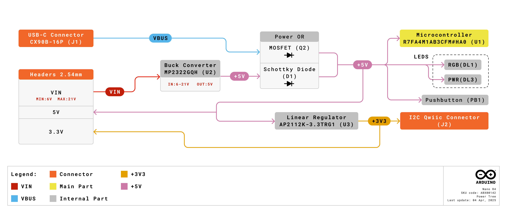

# Description

The Arduino® Nano R4 is  a Nano form factor board based on the RA4M1 series microcontroller from Renesas (R7FA4M1AB3CFM#HA0), which embeds a 48 MHz Arm® Cortex®-M4 microprocessor. The Nano R4's memory is larger than its predecessors, with 256 kB flash, 32 kB SRAM and 8 kB data memory (EEPROM).

The Nano R4 board's operating voltage is 5 V, making it hardware compatible with Nano form factor accessories with the same operating voltage. Shields designed for previous Nano revisions are therefore safe to use with this board but are not guaranteed to be software compatible due to the change of microcontroller.

Customize the on-board RGB LED to indicate different operating states, making debugging and system monitoring more intuitive.

# Target areas:

Maker, Beginner, Education

# Contents
## Application Examples

The Nano R4 is a evolution of its predecessors the Nano Classic, being previously based on 8-bit AVR
microcontrollers. There are thousands of guides, tutorials and books written about the Nano board, where Nano R4 continues its legacy.
The board features the standard 14 digital I/O ports, 6 analog channels, dedicated pins for I2C, SPI and UART
connections. Compared to its predecessors the board has a much larger memory: 8 times more flash memory (256
kB) and 16 times more SRAM (32 kB).

**Effortless Transition:** Move seamlessly from prototyping to production with the familiar RA4M1 microcontroller present already in the UNO R4 family.

**Entry level projects:** If this is your first project within coding and electronics, the Nano R4 is a good fit. It is easy to get started with and has a lot of online documentation (both official + third party).

**Easy power management:** the Nano R4 supports input voltages from 6-21 V. Removes the need for additional circuitry required to step down the voltage.

**Enhanced Connectivity:** Features an on-board QWIIC connector for easy integration with a wide range of sensors and peripherals. An extra I2C port at 5V on pins A4 and A5 offers further connectivity options

**Cross compatibility:** the Nano form factor automatically makes it compatible with hundreds of existing third-party shields and other accessories. 

## Features
### General Specifications Overview

| Feature               | Description                                                                                        |
| --------------------- | -------------------------------------------------------------------------------------------------- |
| Microcontroller       | **R7FA4M1AB3CFM#HA0** 32-bit Arm® Cortex®-M4                                                       |
| Internal Memory       | 256 kB Flash / 32 kB RAM / 8 kB EEPROM                                                             |
| USB Connectivity      | USB-C® port for power and data                                                                     |
| Power                 | Input voltage (VIN): 6-21 V / Power via USB-C® at 5 V                                              |
| Digital Inputs        | GPIO (x21 - All exposed I/O can be used as digital), PWM (x8)                                      |
| Analog Inputs         | 14-bit ADC (x8)                                                                                    |
| Communication         | UART (x1), I2C (x2) (5 V and 3.3 V over QWIIC), SPI (x1), CAN (external transceiver required) (x1) |
| Dimensions            | 18 mm x 45 mm                                                                                      |
| Operating Temperature | -40 °C to +85 °C                                                                                   |

### Microcontroller

The Nano R4 is based on the 32-bit RA4M1 series microcontroller, **R7FA4M1AB3CFM#HA0**, from Renesas, which uses a 48 MHz Arm® Cortex®-M4 microprocessor with a floating point unit (FPU).

On the Nano R4, the operating voltage is fixed at 5 V to be fully retro compatible with shields, accessories & circuits originally designed for older Nano revisions.

| Component                   | Details                               |
| --------------------------- | ------------------------------------- |
| R7FA4M1AB3CFM#HA0 Processor | Arm® Cortex®-M4 core at up to 480 MHz |
| Flash Memory                | 256 kB of Flash Memory                |
| Programming Memory          | 32kB of RAM                           |
| Data Memory                 | 8kB of EEPROM                         |

For more technical details on this microcontroller, visit [Renesas - RA4M1 series](https://www.renesas.com/us/en/products/microcontrollers-microprocessors/ra-cortex-m-mcus/ra4m1-32-bit-microcontrollers-48mhz-arm-cortex-m4-and-lcd-controller-and-cap-touch-hmi).

### USB-C® Connector

The Nano R4 has one USB-C® port, used to power and program your board as well as send & receive serial communication.

**_Note: You should not power the board with more than 5 V via the USB-C® port._**

### Digital Analog Converter (DAC)

The Nano R4 has a DAC with up to 12-bit resolution attached to the A0 analog pin. A DAC is used to convert a digital signal to an analog signal.

### I2C Connector

The I2C connector SM04B-SRSS-TB(LF)(SN) is connected to a secondary I2C bus on the board. Note that this connector is powered via 3.3 V.

This connector also shares the following pin connections:

**JP1 header**
- A4
- A5

**Note:** as A4/A5 is connected to the main I2C bus, these should not be used as ADC inputs whenever the bus is in use. You can however connect I2C devices to each of these pins and connectors simultaneously.

### Related Products

- Arduino Nano (A000005)
- Arduino® UNO R4 Minima (ABX00080)
- Arduino® UNO R4 WiFi (ABX00087)

## Ratings
### Recommended Operating Conditions

| Symbol          | Description                          | Min | Typ | Max | Unit |
| --------------- | ------------------------------------ | --- | --- | --- | ---- |
| VIN  | Input voltage from VIN pad / DC Jack | 6   | 7.0 | 21  | V    |
| VUSB | Input voltage from USB connector     | 4.8 | 5.0 | 5.5 | V    |
| TOP  | Operating Temperature                | -40 | 25  | 85  | °C   |

**Note:** VDD controls the logic level and is connected to the 5V power rail. VAREF is for the analog logic.

## Functional Overview
### Front View

| **Ref.** | **Description**                          |
| -------- | ---------------------------------------- |
| U1       | R7FA4M1AB3CFM#HA0 Microcontroller IC     |
| U2       | MP2322GQH Buck Converter                 |
| U3       | AP2112K-3.3TRG1 Dropout linear regulator |
| PB1      | RESET Button                             |
| JP1      | Analog input/output headers              |
| JP2      | Digital input/output headers             |
| J1       | CX90B-16P USB-C® connector               |
| J2       | SM04B-SRSS-TB(LF)(SN) I2C connector      |
| DL1      | RGB LED                                  |

### Pinout

### Full Pinout Table
#### Analog (JP1)

| Pin | Function  | Type      | Description                             |
| --- | --------- | --------- | --------------------------------------- |
| 1   | D13 / SCK | NC        | Serial Clock                            |
| 2   | +3V3      | Power Out | +3V3 Power Rail                         |
| 3   | B0 / AREF | Analog    | Analog Reference                        |
| 4   | A0        | Analog    | Analog input 0 / DAC                    |
| 5   | A1        | Analog    | Analog input 1 / OPAMP+                 |
| 6   | A2        | Analog    | Analog input 2 / OPAMP-                 |
| 7   | A3        | Analog    | Analog input 3 / AMPOut                 |
| 8   | A4        | Analog    | Analog input 4 / I²C Serial Datal (SDA) |
| 9   | A5        | Analog    | Analog input 5 / I²C Serial Clock (SCL) |
| 10  | A6        | Analog    | Analog input 6                          |
| 11  | A7        | Analog    | Analog input 7                          |
| 12  | 5V        | Power     | USB power (5V)                          |
| 13  | BOOT1     | Mode      | Board Reset 1                           |
| 14  | GND       | Power     | Ground                                  |
| 15  | VIN       | Power     | Voltage Input                           |

#### Digital (JP2)

| Pin | Function     | Type     | Description                             |
| --- | ------------ | -------- | --------------------------------------- |
| 1   | D12 / CIPO\* | Digital  | Controller In Peripheral Out            |
| 2   | D11 / COPI\* | Digital  | Controller Out Peripheral In            |
| 3   | D10 / CS\*   | Digital  | Chip Select                             |
| 4   | D9           | Digital  | Digital pin 9                           |
| 5   | D8           | Digital  | Digital pin 8                           |
| 6   | D7           | Digital  | Digital pin 7                           |
| 7   | D6           | Digital  | Digital pin 6                           |
| 8   | D5           | Digital  | Digital pin 5                           |
| 9   | D4           | Digital  | Digital pin 4                           |
| 10  | D3           | Digital  | Digital pin 3                           |
| 11  | D2           | Digital  | Digital pin 2                           |
| 12  | GND          | Power    | Ground                                  |
| 13  | RST          | Internal | Reset                                   |
| 14  | D0/RX        | Digital  | Digital pin 1 / Serial Receiver (RX)    |
| 15  | D1/TX        | Digital  | Digital pin 0 / Serial Transmitter (TX) |

\*CIPO/COPI/CS replaces the MISO/MOSI/SS terminology.

### Block Diagram

### Power Options

Power can either be supplied via the VIN pin, or via USB-C® connector. If power is supplied via VIN, the MP2322GQH buck converter steps the voltage down to 5 V.

The 5 V output of the uck converter is connected to a Schottky diode in place for reverse polarity & overvoltage protection respectively.

Power via USB supplies about ~4.7 V (due to Schottky drop) to the RA4M1 microcontroller.

#### Power Tree

### Pin Voltage

The Nano R4 operates on 5 V, as does all pins on this board except for the **3.3V pin**. This pin draws power from the `OUT` pin on the AP2112K-3.3TRG1.

### Pin Current

The GPIOs on the R7FA4M1AB3CFM#HA0 microcontroller can handle up to **8 mA**. Never connect devices that draw higher current directly to a GPIO.

In case you need to power external devices that require more power, e.g. servo motors, use an external power supply.

 

## Device Operation

### Getting Started - IDE

If you want to program your Nano R4 while offline you need to install the Arduino® Desktop IDE **[1]**. To connect the Nano R4 to your computer, you will need a Type-C® USB cable, which can also provide power to the board, as indicated by the LED (DL3).

### Getting Started - Arduino Cloud Editor

All Arduino boards, including this one, work out-of-the-box on the Arduino Cloud Editor **[2]**, by just installing a simple plugin.

The Arduino Cloud Editor is hosted online, therefore it will always be up-to-date with the latest features and support for all boards. Follow **[3]** to start coding on the browser and upload sketches onto your board.

### Online Resources

Now that you have gone through the basics of what you can do with the board you can explore the endless possibilities it provides by checking exciting projects on Arduino Project Hub **[4]**, the Arduino Library Reference **[5]**, and the online store **[6]**; where you will be able to complement your board with sensors, actuators and more.

## Mechanical Information
### Board Dimensions

### Board Connectors

## Company Information

| Company name    | Arduino S.r.l.                                |
| --------------- | --------------------------------------------- |
| Company Address | Via Andrea Appiani, 25 Monza, MB, 20900 Italy |

## Reference Documentation

| Reference                              | Link                                                 |
| -------------------------------------- | ---------------------------------------------------- |
| Arduino IDE (Desktop)                  | https://www.arduino.cc/en/Main/Software              |
| Arduino Cloud Editor                   | https://create.arduino.cc/editor                     |
| Arduino Cloud Editor - Getting Started | https://docs.arduino.cc/arduino-cloud/guides/editor/ |
| Arduino Project Hub                    | https://projecthub.arduino.cc/                       |
| Library Reference                      | https://github.com/arduino-libraries/                |
| Online Store                           | https://store.arduino.cc/                            |
