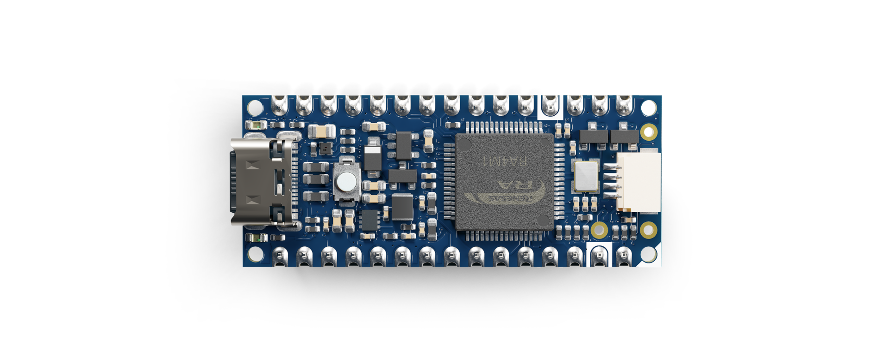

This user manual provides a comprehensive overview of the Nano R4 board, highlighting its hardware and software elements. With it, you will learn how to set up, configure and use all the main features of the Nano R4 board.

## Hardware and Software Requirements

### Hardware Requirements

- [Nano R4](https://store.arduino.cc/products/nano-r4) (x1)
- [USB-C® cable](https://store.arduino.cc/products/usb-cable2in1-type-c) (x1)
- [Breadboard](https://store.arduino.cc/products/breadboard-400-contacts) (x1) (recommended) 
- [Male/male jumper wires](https://store.arduino.cc/products/breadboard-400-contacts) (recommended)

### Software Requirements

- [Arduino IDE 2.0+](https://www.arduino.cc/en/software) or [Arduino Web Editor](https://create.arduino.cc/editor)
- [Arduino UNO R4 Boards core](https://github.com/arduino/ArduinoCore-renesas)

***The Nano R4 is compatible with the complete Arduino ecosystem and can be programmed directly as a standalone device.***

## Nano R4 Overview

The Nano R4 board represents the natural evolution of the Nano family, combining the powerful RA4M1 microcontroller from Renesas with the compact and familiar Nano form factor. This board is designed to facilitate seamless transition from prototyping to production, using the same powerful core already used in the UNO R4 family.

The Nano R4 includes a high-performance 32-bit microcontroller (R7FA4M1AB3CFM), expanded connectivity through an onboard Qwicc connector and advanced features such as DAC, CAN and operational amplifiers. Its compact dimensions (18 mm x 45 mm) and robust construction make the Nano R4 board an excellent choice for projects that demand sensor fusion capabilities and the computational power of modern microcontrollers.

### Nano R4 Architecture Overview

The Nano R4 board features a secure, certified and durable design that suits various applications, such as industrial automation, building automation and rapid prototyping.

The top view of the Nano R4 board is shown in the image below:

The bottom view of the Nano R4 board is shown in the image below:

***The bottom side of the Nano R4 board only features test points for debugging and development purposes, along with the board's certification markings and identification information (board model and SKU).***

Here is an overview of the board's main components shown in the images above:

- **Microcontroller**: At the heart of the Nano R4 board there is a Renesas RA4M1 family microcontroller ([R7FA4M1AB3CFM](https://www.renesas.com/en/document/dst/ra4m1-group-datasheet?srsltid=AfmBOoryT-HIws0lHBASVG1QdfHDNWNQ5FNnoQV3hpoQ0FbncC7FI3h4)). This single-chip microcontroller, recognized as one of the industry's most energy-efficient microcontroller, is based on a 48 MHz Arm® Cortex®-M4 core with up to 256 KB of flash memory and 32 KB of SRAM memory.
- **USB-C® connector**: The Nano R4 board features a modern USB-C connector for programming, power supply and serial communication with the external world.
- **Qwicc connector**: The Nano R4 board also includes an onboard Qwicc connector to expand the board's communication capabilities via I²C, facilitating connection with a wide range of boards, sensors, actuators and different peripherals.
- **Programmable RGB LED**: The Nano R4 board has an onboard user-programmable RGB LED to provide visual feedback about different operating states.
- **User LED**: In addition to the onboard user-programmable RGB LED, the board also includes an additional onboard user-programmable orange LED for basic status indications.
- **Castellated pins**: The board's castellated pins allow surface mounting as a module, facilitating integration into custom hardware designs.
- **Advanced microcontroller features**: The R7FA4M1AB3CFM microcontroller has integrated peripherals such as a 12-bit Digital-to-Analog Converter (DAC), CAN bus for industrial communications, integrated Operational Amplifiers (OpAmp) and HID emulation capabilities (keyboard/mouse).

### Board Core and Libraries

The **Arduino UNO R4 Boards** core contains the libraries and examples to work with the Arduino Nano R4's peripherals and onboard components, such as its RA4M1 microcontroller, advanced peripherals (DAC, CAN and OpAmp), Qwicc connector and the onboard RGB LED. To install the core for the Nano R4 board, navigate to **Tools > Board > Boards Manager** or click the **Boards Manager** icon in the left tab of the IDE. In the Boards Manager tab, search for `UNO R4` and install the latest Arduino UNO R4 Boards version.

The Arduino UNO R4 Boards core provides support for the following:

- Board control and configuration (reset, pin configuration and power management)
- Advanced peripheral functions (12-bit DAC, ADC, CAN bus and OpAmp)
- Communication interfaces (UART, I²C and SPI)
- Onboard LED control (RGB LED and orange LED)
- Real-time clock (RTC) functionality
- HID emulation capabilities (keyboard and mouse)
- Standard Arduino libraries compatibility

***Since the Nano R4 uses the same RA4M1 microcontroller as the UNO R4 WiFi and the UNO R4 Minima, it shares complete code and library compatibility, making it easy to transition projects between these boards.***

### Pinout

The full pinout is available and downloadable as PDF from the link below:

- Nano R4 pinout

### Datasheet

The complete datasheet is available and downloadable as PDF from the link below:

- Nano R4 datasheet

### Schematics

The complete schematics are available and downloadable as PDF from the link below:

- Nano R4 schematics

### STEP Files

The complete STEP files are available and downloadable from the link below:

- Nano R4 STEP files