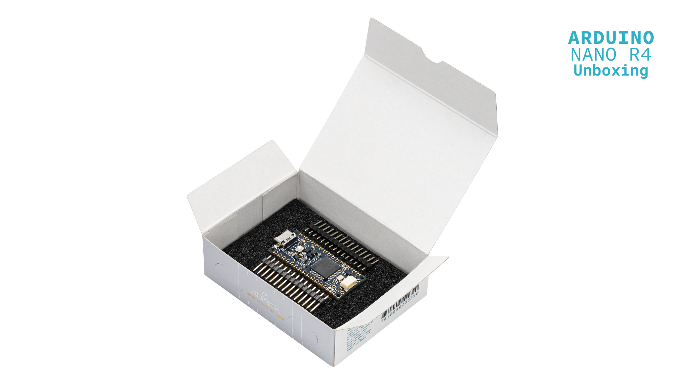

This user manual provides a comprehensive overview of the Nano R4 board, highlighting its hardware and software elements. With it, you will learn how to set up, configure and use all the main features of the Nano R4 board.


## Hardware and Software Requirements

### Hardware Requirements

- [Nano R4](https://store.arduino.cc/products/nano-r4) (x1)
- [USB-C® cable](https://store.arduino.cc/products/usb-cable2in1-type-c) (x1)
- [Breadboard](https://store.arduino.cc/products/breadboard-400-contacts) (x1) (recommended) 
- [Male/male jumper wires](https://store.arduino.cc/products/breadboard-400-contacts) (recommended)

### Software Requirements

- [Arduino IDE 2.0+](https://www.arduino.cc/en/software) or [Arduino Web Editor](https://create.arduino.cc/editor)
- [Arduino UNO R4 Boards core](https://github.com/arduino/ArduinoCore-renesas)

***The Nano R4 is compatible with the complete Arduino ecosystem and can be programmed directly as a standalone device.***

## Nano R4 Overview

The Nano R4 board represents the natural evolution of the Nano family, combining the powerful RA4M1 microcontroller from Renesas with the compact and familiar Nano form factor. This board is designed to facilitate seamless transition from prototyping to production, using the same powerful core already used in the UNO R4 family.


The Nano R4 includes a high-performance 32-bit microcontroller (R7FA4M1AB3CFM), expanded connectivity through an onboard Qwicc connector and advanced features such as DAC, CAN and operational amplifiers. Its compact dimensions (18 mm x 45 mm) and robust construction make the Nano R4 board an excellent choice for projects that demand sensor fusion capabilities and the computational power of modern microcontrollers.

### Nano R4 Architecture Overview

The Nano R4 board features a secure, certified and durable design that suits various applications, such as industrial automation, building automation and rapid prototyping.

The top view of the Nano R4 board is shown in the image below:


The bottom view of the Nano R4 board is shown in the image below:


***The bottom side of the Nano R4 board only features test points for debugging and development purposes, along with the board's certification markings and identification information (board model and SKU).***

Here is an overview of the board's main components shown in the images above:

- **Microcontroller**: At the heart of the Nano R4 board there is a Renesas RA4M1 family microcontroller ([R7FA4M1AB3CFM](https://www.renesas.com/en/document/dst/ra4m1-group-datasheet?srsltid=AfmBOoryT-HIws0lHBASVG1QdfHDNWNQ5FNnoQV3hpoQ0FbncC7FI3h4)). This single-chip microcontroller, recognized as one of the industry's most energy-efficient microcontroller, is based on a 48 MHz Arm® Cortex®-M4 core with up to 256 KB of flash memory and 32 KB of SRAM memory.
- **USB-C® connector**: The Nano R4 board features a modern USB-C connector for programming, power supply and serial communication with the external world.
- **Qwicc connector**: The Nano R4 board also includes an onboard Qwicc connector to expand the board's communication capabilities via I²C, facilitating connection with a wide range of boards, sensors, actuators and different peripherals.
- **Programmable RGB LED**: The Nano R4 board has an onboard user-programmable RGB LED to provide visual feedback about different operating states.
- **User LED**: In addition to the onboard user-programmable RGB LED, the board also includes an additional onboard user-programmable orange LED for basic status indications.
- **Castellated pins**: The board's castellated pins allow surface mounting as a module, facilitating integration into custom hardware designs.
- **Advanced microcontroller features**: The R7FA4M1AB3CFM microcontroller has integrated peripherals such as a 12-bit Digital-to-Analog Converter (DAC), CAN bus for industrial communications, integrated Operational Amplifiers (OpAmp) and HID emulation capabilities (keyboard/mouse).

### Board Core and Libraries

The **Arduino UNO R4 Boards** core contains the libraries and examples to work with the Arduino Nano R4's peripherals and onboard components, such as its RA4M1 microcontroller, advanced peripherals (DAC, CAN and OpAmp), Qwicc connector and the onboard RGB LED. To install the core for the Nano R4 board, navigate to **Tools > Board > Boards Manager** or click the **Boards Manager** icon in the left tab of the IDE. In the Boards Manager tab, search for `UNO R4` and install the latest Arduino UNO R4 Boards version.


The Arduino UNO R4 Boards core provides support for the following:

- Board control and configuration (reset, pin configuration and power management)
- Advanced peripheral functions (12-bit DAC, ADC, CAN bus and OpAmp)
- Communication interfaces (UART, I²C and SPI)
- Onboard LED control (RGB LED and orange LED)
- Real-time clock (RTC) functionality
- HID emulation capabilities (keyboard and mouse)
- Standard Arduino libraries compatibility

***<strong>Important note:</strong> Since the Nano R4 uses the same RA4M1 microcontroller as the UNO R4 WiFi and the UNO R4 Minima, it shares complete code and library compatibility, making it easy to transition projects between these boards.***

### Pinout


The full pinout is available and downloadable as PDF from the link below:

- Nano R4 pinout

### Datasheet

The complete datasheet is available and downloadable as PDF from the link below:

- Nano R4 datasheet

### Schematics

The complete schematics are available and downloadable as PDF from the link below:

- Nano R4 schematics

### STEP Files

The complete STEP files are available and downloadable from the link below:

- Nano R4 STEP files

## First Use

### Unboxing the Product

When opening the Nano R4 box, you will find the board and its corresponding documentation. **The Nano R4 does not include additional cables**, so you will need a USB-C cable ([available separately here](https://store.arduino.cc/products/usb-cable2in1-type-c)) to connect the board to your computer.



*** ***

The Nano R4 is a standalone device that can be programmed directly without requiring additional boards. However, for more complex projects, you can easily combine it with Arduino shields compatible with the Nano family or connect it to other Arduino devices through its onboard Qwicc connector.

### Connecting the Board

The Nano R4 can be connected to your computer using its onboard USB-C connector. It can also be integrated into larger projects using the following:

- **Direct USB-C connection**: For programming, power supply and serial communication with the computer
- **Pin connection**: For integration into breadboards or custom PCBs
- **Qwicc connection**: For rapid expansion with compatible sensors and modules
- **Module mounting**: Using the board's castellated pins for direct soldering to PCBs

***<strong>Important note:</strong> The Nano R4 operates at +5 VDC natively. When connecting sensors or modules that operate at +3.3 VDC, make sure to verify voltage compatibility to avoid component damage.***

  ### Powering the Board

  The Nano R4 can be powered in several ways:

  - **Via USB-C connector**: The most common method during development and programming
  - **Via `VIN` pin**: Using an external +6-21 VDC power supply that will be internally regulated to +5 VDC
  - **Via `5V` pin**: Directly connecting a regulated +5 VDC source (with caution)

  

  ***<strong>Important note:</strong> The Nano R4's `VIN` pin accepts a voltage range of +6-21 VDC. Do not connect voltages outside this range as you could permanently damage the board. Always verify all the connections before applying power.***

  #### Internal +3.3 VDC Power Supply

  The Nano R4 also includes an onboard +3.3 VDC regulator ([AP2112K](https://www.diodes.com/assets/Datasheets/AP2112.pdf)) that provides power for the following:

  - **Qwicc connector**: Supplies +3.3 VDC power to connected I²C devices
  - **I²C level translation**: Enables communication between the +5 VDC microcontroller and +3.3 VDC Qwicc devices
  - **Internal +3.3 VDC peripherals**: Powers certain internal circuits that require +3.3 VDC operation

  This internal +3.3 VDC supply allows the board to interface with both +5 VDC and +3.3 VDC devices through the Qwicc ecosystem while maintaining the +5 VDC operation of the board's main microcontroller.

  #### VBATT Pin

  The `VBATT` pin allows the connection of a backup battery (within the +1.6-3.6 VDC range) to maintain the microcontroller's real-time clock (RTC) and certain low-power functions when the main power source is disconnected from the board. This is particularly useful for applications that need to keep track of time or maintain certain settings of the microcontroller during power outages. 

  Common battery options for this purpose include the following:

  - Coin cell batteries (CR2032: +3 VDC)
  - Rechargeable LiPo batteries (+3.7 VDC nominal)
  - AA/AAA batteries (+1.5-3 VDC depending on the chemistry of the battery)
    
### Hello World Example

Let's program the Nano R4 to reproduce the classic `Hello World` example used in the Arduino ecosystem: the `Blink` sketch. We will use this example to verify that the Nano R4's connection to the computer works correctly, that the Arduino IDE is properly configured, and that both the board and development environment function as expected.

First, connect your Nano R4 to your computer using a USB-C cable, open the Arduino IDE, and make sure that the board is connected correctly. If you are new to the Arduino IDE, please refer to the official Arduino documentation for more detailed information about initial setup. Copy and paste the following example sketch into a new Arduino IDE file:

```arduino
/**
Blink Example for the Arduino Nano R4 Board
Name: nano_r4_blink.ino
Purpose: This sketch demonstrates how to blink the built-in
user LED of the Arduino Nano R4 board.

@author Arduino Product Experience Team
@version 1.0 01/06/25
*/

// Built-in LED pin
#define LED_PIN LED_BUILTIN

void setup() {
  // Initialize serial communication at 115200 baud
  Serial.begin(115200);
  
  // Configure LED pin as output
  pinMode(LED_PIN, OUTPUT);
  
  // Startup message
  Serial.println("- Arduino Nano R4 - Blink Example started...");
}

void loop() {
  // Turn on the LED, wait 1 second
  digitalWrite(LED_PIN, HIGH);
  Serial.println("- LED on!");
  delay(1000);
  
  // Turn off the LED, wait 1 second
  digitalWrite(LED_PIN, LOW);
  Serial.println("- LED off!");
  delay(1000);  
}
```

To upload the sketch to the board, click the **Verify** button to compile the sketch and check for errors, then click the **Upload** button to program the device with the sketch.


As shown in the animation below, you should see the built-in orange user LED of your Nano R4 board turn on for one second, then turn off for one second, repeating this cycle continuously. 


Additionally, you can open the Arduino IDE's Serial Monitor (Tools > Serial Monitor) to see the status messages that the example sketch sends each time the LED state changes.


This example confirms the following:

- The Nano R4 board is correctly connected
- The Arduino IDE is properly configured
- The board is functioning correctly
- USB communication is working
- Digital pins respond to commands

Congratulations! You have successfully completed your first program on the Nano R4 board. You are now ready to explore the more advanced features of this tiny but powerful board.

## LEDs

This user manual section covers the Nano R4 built-in LEDs, showing their main hardware and software characteristics.

### RGB LED

The Nano R4 features a built-in RGB LED that can be used as a visual feedback indicator for the user.


The built-in RGB LED can be accessed through the following macro definitions:

| **Built-in LED** | **Macro Definition** | **Microcontroller Pin** |
|:----------------:|:--------------------:|:-----------------------:|
|      Red LED     |        `LEDR`        |          `P409`         |
|     Green LED    |        `LEDG`        |          `P411`         |
|     Blue LED     |        `LEDB`        |          `P410`         |

***The built-in RGB LED on the Nano R4 must be pulled to ground (GND) to make it light up. This means that a voltage level of `LOW` on each of their pins will turn the specific color of the LED on, and a voltage level of `HIGH` will turn them off.***

The following example sketch each of the RGB LED colors at an interval of 500 ms:

```arduino
/**
RGB LED Example for the Arduino Nano R4 Board
Name: nano_r4_rgb_led.ino
Purpose: This sketch demonstrates how to control the built-in
RGB LED of the Arduino Nano R4 board.

@author Arduino Product Experience Team
@version 1.0 01/06/25
*/

void setup() {
  // Initialize serial communication at 115200 baud
  Serial.begin(115200);
  
  // Initialize LEDR, LEDG and LEDB as outputs
  pinMode(LEDR, OUTPUT);
  pinMode(LEDG, OUTPUT);
  pinMode(LEDB, OUTPUT);
  
  // Turn off all LEDs initially
  digitalWrite(LEDR, HIGH);
  digitalWrite(LEDG, HIGH);
  digitalWrite(LEDB, HIGH);
  
  Serial.println("- Arduino Nano R4 - RGB LED Example started...");
}

void loop() {
  // Turn on the built-in red LED and turn off the rest
  digitalWrite(LEDR, LOW);
  digitalWrite(LEDG, HIGH);
  digitalWrite(LEDB, HIGH);
  Serial.println("- Red LED on!");
  delay(500);
  
  // Turn on the built-in green LED and turn off the rest
  digitalWrite(LEDR, HIGH);
  digitalWrite(LEDG, LOW);
  digitalWrite(LEDB, HIGH);
  Serial.println("- Green LED on!");
  delay(500);
  
  // Turn on the built-in blue LED and turn off the rest
  digitalWrite(LEDR, HIGH);
  digitalWrite(LEDG, HIGH);
  digitalWrite(LEDB, LOW);
  Serial.println("- Blue LED on!");
  delay(500);
  
  // Turn off all LEDs
  digitalWrite(LEDR, HIGH);
  digitalWrite(LEDG, HIGH);
  digitalWrite(LEDB, HIGH);
  Serial.println("- All LEDs off!");
  delay(500);
}
```

You should now see the built-in RGB LED cycling through red, green, and blue colors, followed by a brief moment with all LEDs off, repeating this pattern continuously.


Additionally, you can open the Arduino IDE's Serial Monitor (Tools > Serial Monitor) to see the status messages that the example sketch sends each time the RGB LEDs state changes.


### Orange LED

The Nano R4 also features a built-in orange user LED that can be used for basic status indications and debugging purposes.


The built-in user LED can be accessed through the following macro definition:

| **Built-in LED** | **Macro Definition** | **Microcontroller Pin** |
|:----------------:|:--------------------:|:-----------------------:|
|  Orange User LED |    `LED_BUILTIN`     |          `P204`         |

***Unlike the RGB LED, the built-in user LED on the Nano R4 operates with standard logic levels. This means that a voltage level of `HIGH` will turn the LED on, and a voltage level of `LOW` will turn it off.***

The following example sketch demonstrates how to control the built-in user LED:

```arduino
/**
User LED Example for the Arduino Nano R4 Board
Name: nano_r4_user_led.ino
Purpose: This sketch demonstrates how to control the built-in
user LED of the Arduino Nano R4 board.

@author Arduino Product Experience Team
@version 1.0 01/06/25
*/

void setup() {
  // Initialize serial communication at 115200 baud
  Serial.begin(115200);
  
  // Configure LED_BUILTIN pin as output
  pinMode(LED_BUILTIN, OUTPUT);
  
  // Turn off LED initially
  digitalWrite(LED_BUILTIN, LOW);
  
  Serial.println("- Arduino Nano R4 - User LED Example started...");
}

void loop() {
  // Turn on the built-in user LED
  digitalWrite(LED_BUILTIN, HIGH);
  Serial.println("- User LED on!");
  delay(1000);
  
  // Turn off the built-in user LED
  digitalWrite(LED_BUILTIN, LOW);
  Serial.println("- User LED off!");
  delay(1000);
}
```

You should now see the built-in orange user LED blinking on and off at 1-second intervals, repeating this pattern continuously.


Additionally, you can open the Arduino IDE's Serial Monitor (Tools > Serial Monitor) to see the status messages that the example sketch sends each time the user LED state changes.

