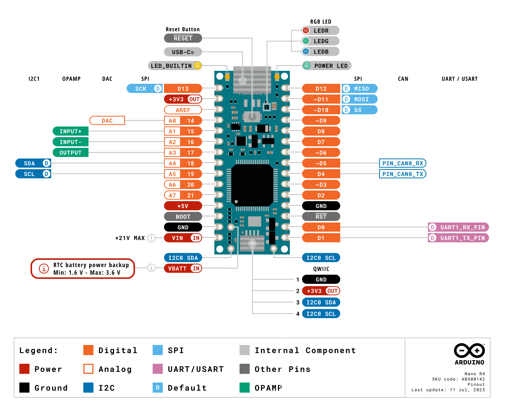

This user manual provides a comprehensive overview of the Nano R4 board, highlighting its hardware and software elements. With it, you will learn how to set up, configure and use all the main features of the Nano R4 board.


## Hardware and Software Requirements

### Hardware Requirements

- [Nano R4](https://store.arduino.cc/products/nano-r4) (x1)
- [USB-C® cable](https://store.arduino.cc/products/usb-cable2in1-type-c) (x1)
- [Breadboard](https://store.arduino.cc/products/breadboard-400-contacts) (x1) (recommended) 
- [Male/male jumper wires](https://store.arduino.cc/products/breadboard-400-contacts) (recommended)

### Software Requirements

- [Arduino IDE 2.0+](https://www.arduino.cc/en/software) or [Arduino Web Editor](https://create.arduino.cc/editor)
- [Arduino UNO R4 Boards core](https://github.com/arduino/ArduinoCore-renesas)

***The Nano R4 is compatible with the complete Arduino ecosystem and can be programmed directly as a standalone device.***

## Nano R4 Overview

The Nano R4 board represents the natural evolution of the Nano family, combining the powerful RA4M1 microcontroller from Renesas with the compact and familiar Nano form factor. This board is designed to facilitate seamless transition from prototyping to production, using the same powerful core already used in the UNO R4 family.


The Nano R4 includes a high-performance 32-bit microcontroller (R7FA4M1AB3CFM), expanded connectivity through an onboard Qwiic connector and advanced features such as DAC, CAN and operational amplifiers. Its compact dimensions (18 mm x 45 mm) and robust construction make the Nano R4 board an excellent choice for projects that demand sensor fusion capabilities and the computational power of modern microcontrollers.


### Nano R4 Architecture Overview

The Nano R4 board features a secure, certified and durable design that suits various applications, such as industrial automation, building automation and rapid prototyping.

The top view of the Nano R4 board is shown in the image below:


The bottom view of the Nano R4 board is shown in the image below:


***The bottom side of the Nano R4 board features only test points for debugging and development purposes, along with the board's certification markings and identification information (board model and SKU).***


Here is an overview of the board's main components shown in the images above:

- **Microcontroller**: At the heart of the Nano R4 board there is a Renesas RA4M1 family microcontroller ([R7FA4M1AB3CFM](https://www.renesas.com/en/document/dst/ra4m1-group-datasheet?srsltid=AfmBOoryT-HIws0lHBASVG1QdfHDNWNQ5FNnoQV3hpoQ0FbncC7FI3h4)). This single-chip microcontroller, recognized as one of the industry's most energy-efficient microcontroller, is based on a 48 MHz Arm® Cortex®-M4 core with up to 256 KB of flash memory and 32 KB of SRAM memory.
- **USB-C® connector**: The Nano R4 board features a modern USB-C connector for programming, power supply and serial communication with the external world.
- **Qwiic connector**: The Nano R4 board also includes an onboard Qwiic connector to expand the board's communication capabilities via I²C, facilitating connection with a wide range of boards, sensors, actuators and different peripherals.

- **Programmable RGB LED**: The Nano R4 board has an onboard user-programmable RGB LED to provide visual feedback about different operating states.
- **User LED**: In addition to the onboard user-programmable RGB LED, the board also includes an additional onboard user-programmable orange LED for basic status indications.
- **Castellated pins**: The board's castellated pins allow surface mounting as a module, facilitating integration into custom hardware designs.
- **Advanced microcontroller features**: The R7FA4M1AB3CFM microcontroller has integrated peripherals such as a 12-bit Digital-to-Analog Converter (DAC), CAN bus for industrial communications, integrated Operational Amplifiers (OpAmp) and HID emulation capabilities (keyboard/mouse).

### Board Core and Libraries

The **Arduino UNO R4 Boards** core contains the libraries and examples to work with the Arduino Nano R4's peripherals and onboard components, such as its RA4M1 microcontroller, advanced peripherals (DAC, CAN and OpAmp), Qwiic connector and the onboard RGB LED. To install the core for the Nano R4 board, navigate to **Tools > Board > Boards Manager** or click the **Boards Manager** icon in the left tab of the IDE. In the Boards Manager tab, search for `UNO R4` and install the latest Arduino UNO R4 Boards version.


The Arduino UNO R4 Boards core provides support for the following:

- Board control and configuration (reset, pin configuration and power management)
- Advanced peripheral functions (12-bit DAC, ADC, CAN bus and OpAmp)
- Communication interfaces (UART, I²C and SPI)
- Onboard LED control (RGB LED and orange LED)
- Real-time clock (RTC) functionality
- HID emulation capabilities (keyboard and mouse)
- Standard Arduino libraries compatibility

***__Important note:__ Since the Nano R4 uses the same RA4M1 microcontroller as the UNO R4 WiFi and the UNO R4 Minima, it shares complete code and library compatibility, making it easy to transition projects between these boards.***


### Pinout



The full pinout is available and downloadable as PDF from the link below:

- Nano R4 pinout

### Datasheet

The complete datasheet is available and downloadable as PDF from the link below:

- Nano R4 datasheet

### Schematics

The complete schematics are available and downloadable as PDF from the link below:

- Nano R4 schematics

### STEP Files

The complete STEP files are available and downloadable from the link below:

- Nano R4 STEP files

## First Use

### Unboxing the Product

When opening the Nano R4 box, you will find the board and its corresponding documentation. **The Nano R4 does not include additional cables**, so you will need a USB-C cable ([available separately here](https://store.arduino.cc/products/usb-cable2in1-type-c)) to connect the board to your computer.


 
The Nano R4 is a standalone device that can be programmed directly without requiring additional boards. However, for more complex projects, you can easily combine it with Arduino shields compatible with the Nano family or connect it to other Arduino devices through its onboard Qwiic connector.


### Connecting the Board

The Nano R4 can be connected to your computer using its onboard USB-C connector. It can also be integrated into larger projects using the following:

- **Direct USB-C connection**: For programming, power supply and serial communication with the computer
- **Pin connection**: For integration into breadboards or custom PCBs
- **Qwiic connection**: For rapid expansion with compatible sensors and modules

- **Module mounting**: Using the board's castellated pins for direct soldering to PCBs

***<strong>Important note:</strong> The Nano R4 operates at +5 VDC natively. When connecting sensors or modules that operate at +3.3 VDC, make sure to verify voltage compatibility to avoid component damage.***

  ### Powering the Board

  The Nano R4 can be powered in several ways:

  - **Via USB-C connector**: The most common method during development and programming
  - **Via `VIN` pin**: Using an external +6-21 VDC power supply that will be internally regulated to +5 VDC
  - **Via `5V` pin**: Directly connecting a regulated +5 VDC source (with caution)

  

  ***<strong>Important note:</strong> The Nano R4's `VIN` pin accepts a voltage range of +6-21 VDC. Do not connect voltages outside this range as you could permanently damage the board. Always verify all the connections before applying power.***

  #### Internal +3.3 VDC Power Supply

  The Nano R4 also includes an onboard +3.3 VDC regulator ([AP2112K](https://www.diodes.com/assets/Datasheets/AP2112.pdf)) that provides power for the following:

  - **Qwiic connector**: Supplies +3.3 VDC power to connected I²C devices
  - **I²C level translation**: Enables communication between the +5 VDC microcontroller and +3.3 VDC Qwiic devices

  - **Internal +3.3 VDC peripherals**: Powers certain internal circuits that require +3.3 VDC operation

  This internal +3.3 VDC supply allows the board to interface with both +5 VDC and +3.3 VDC devices through the Qwiic ecosystem while maintaining the +5 VDC operation of the board's main microcontroller.


#### VBATT Pin

The `VBATT` pin allows the connection of a backup battery (within the +1.6-3.6 VDC range) to maintain the microcontroller's real-time clock (RTC) and certain low-power functions when the main power source is disconnected from the board. This is particularly useful for applications that need to keep track of time or maintain certain settings of the microcontroller during power outages. 

Common battery options for this purpose include the following:

- Coin cell batteries (CR2032: +3 VDC)
- Rechargeable LiPo batteries (+3.7 VDC nominal)
- AA/AAA batteries (+1.5-3 VDC depending on the chemistry of the battery)

    
### Hello World Example

Let's program the Nano R4 to reproduce the classic `Hello World` example used in the Arduino ecosystem: the `Blink` sketch. We will use this example to verify that the Nano R4's connection to the computer works correctly, that the Arduino IDE is properly configured, and that both the board and development environment function as expected.

First, connect your Nano R4 to your computer using a USB-C cable, open the Arduino IDE, and make sure that the board is connected correctly. If you are new to the Arduino IDE, please refer to the official Arduino documentation for more detailed information about initial setup. Copy and paste the following example sketch into a new Arduino IDE file:

```arduino
/**
Blink Example for the Arduino Nano R4 Board
Name: nano_r4_blink.ino
Purpose: This sketch demonstrates how to blink the built-in
user LED of the Arduino Nano R4 board.

@author Arduino Product Experience Team
@version 1.0 01/06/25
*/

// Built-in LED pin
#define LED_PIN LED_BUILTIN

void setup() {
  // Initialize serial communication and wait up to 2.5 seconds for a connection
  Serial.begin(115200);
  for (auto startNow = millis() + 2500; !Serial && millis() < startNow; delay(500));
  
  // Configure LED pin as output
  pinMode(LED_PIN, OUTPUT);
  
  // Startup message
  Serial.println("- Arduino Nano R4 - Blink Example started...");
}

void loop() {
  // Turn on the LED, wait 1 second
  digitalWrite(LED_PIN, HIGH);
  Serial.println("- LED on!");
  delay(1000);
  
  // Turn off the LED, wait 1 second
  digitalWrite(LED_PIN, LOW);
  Serial.println("- LED off!");
  delay(1000);  
}
```

To upload the sketch to the board, click the **Verify** button to compile the sketch and check for errors, then click the **Upload** button to program the device with the sketch.


As shown in the animation below, you should see the built-in orange user LED of your Nano R4 board turn on for one second, then turn off for one second, repeating this cycle continuously. 


Additionally, you can open the Arduino IDE's Serial Monitor (Tools > Serial Monitor) to see the status messages that the example sketch sends each time the LED state changes.


This example confirms the following:

- The Nano R4 board is correctly connected
- The Arduino IDE is properly configured
- The board is functioning correctly
- USB communication is working
- Digital pins respond to commands

Congratulations! You have successfully completed your first program on the Nano R4 board. You are now ready to explore the more advanced features of this tiny but powerful board.

## LEDs

This user manual section covers the Nano R4 built-in LEDs, showing their main hardware and software characteristics.

### RGB LED

The Nano R4 features a built-in RGB LED that can be used as a visual feedback indicator for the user.


The built-in RGB LED can be accessed through the following macro definitions:

| **Built-in LED** | **Macro Definition** | **Microcontroller Pin** |
| :--------------: | :------------------: | :---------------------: |
|     Red LED      |        `LEDR`        |         `P409`          |
|    Green LED     |        `LEDG`        |         `P411`          |
|     Blue LED     |        `LEDB`        |         `P410`          |

***The built-in RGB LED on the Nano R4 must be pulled to ground (`GND`) to make it light up. This means that a voltage level of `LOW` on each of their pins will turn the specific color of the LED on, and a voltage level of `HIGH` will turn them off.***

The following example sketch each of the RGB LED colors at an interval of 500 ms:

```arduino
/**
RGB LED Example for the Arduino Nano R4 Board
Name: nano_r4_rgb_led.ino
Purpose: This sketch demonstrates how to control the built-in
RGB LED of the Arduino Nano R4 board.

@author Arduino Product Experience Team
@version 1.0 01/06/25
*/

void setup() {
  // Initialize serial communication and wait up to 2.5 seconds for a connection
  Serial.begin(115200);
  for (auto startNow = millis() + 2500; !Serial && millis() < startNow; delay(500));
  
  // Initialize LEDR, LEDG and LEDB as outputs
  pinMode(LEDR, OUTPUT);
  pinMode(LEDG, OUTPUT);
  pinMode(LEDB, OUTPUT);
  
  // Turn off all LEDs initially
  digitalWrite(LEDR, HIGH);
  digitalWrite(LEDG, HIGH);
  digitalWrite(LEDB, HIGH);
  
  Serial.println("- Arduino Nano R4 - RGB LED Example started...");
}

void loop() {
  // Turn on the built-in red LED and turn off the rest
  digitalWrite(LEDR, LOW);
  digitalWrite(LEDG, HIGH);
  digitalWrite(LEDB, HIGH);
  Serial.println("- Red LED on!");
  delay(500);
  
  // Turn on the built-in green LED and turn off the rest
  digitalWrite(LEDR, HIGH);
  digitalWrite(LEDG, LOW);
  digitalWrite(LEDB, HIGH);
  Serial.println("- Green LED on!");
  delay(500);
  
  // Turn on the built-in blue LED and turn off the rest
  digitalWrite(LEDR, HIGH);
  digitalWrite(LEDG, HIGH);
  digitalWrite(LEDB, LOW);
  Serial.println("- Blue LED on!");
  delay(500);
  
  // Turn off all LEDs
  digitalWrite(LEDR, HIGH);
  digitalWrite(LEDG, HIGH);
  digitalWrite(LEDB, HIGH);
  Serial.println("- All LEDs off!");
  delay(500);
}
```

You should now see the built-in RGB LED cycling through red, green, and blue colors, followed by a brief moment with all LEDs off, repeating this pattern continuously.


Additionally, you can open the Arduino IDE's Serial Monitor (Tools > Serial Monitor) to see the status messages that the example sketch sends each time the RGB LEDs state changes.


### Orange LED

The Nano R4 also features a built-in orange user LED that can be used for basic status indications and debugging purposes.


The built-in user LED can be accessed through the following macro definition:

| **Built-in LED** | **Macro Definition** | **Microcontroller Pin** |
| :--------------: | :------------------: | :---------------------: |
| Orange User LED  |    `LED_BUILTIN`     |         `P204`          |

***Unlike the RGB LED, the built-in user LED on the Nano R4 operates with standard logic levels. This means that a voltage level of `HIGH` will turn the LED on, and a voltage level of `LOW` will turn it off.***

The following example sketch demonstrates how to control the built-in user LED:

```arduino
/**
User LED Example for the Arduino Nano R4 Board
Name: nano_r4_user_led.ino
Purpose: This sketch demonstrates how to control the built-in
user LED of the Arduino Nano R4 board.

@author Arduino Product Experience Team
@version 1.0 01/06/25
*/

void setup() {
  // Initialize serial communication and wait up to 2.5 seconds for a connection
  Serial.begin(115200);
  for (auto startNow = millis() + 2500; !Serial && millis() < startNow; delay(500));
  
  // Configure LED_BUILTIN pin as output
  pinMode(LED_BUILTIN, OUTPUT);
  
  // Turn off LED initially
  digitalWrite(LED_BUILTIN, LOW);
  
  Serial.println("- Arduino Nano R4 - User LED Example started...");
}

void loop() {
  // Turn on the built-in user LED
  digitalWrite(LED_BUILTIN, HIGH);
  Serial.println("- User LED on!");
  delay(1000);
  
  // Turn off the built-in user LED
  digitalWrite(LED_BUILTIN, LOW);
  Serial.println("- User LED off!");
  delay(1000);
}
```

You should now see the built-in orange user LED blinking on and off at 1-second intervals, repeating this pattern continuously.


Additionally, you can open the Arduino IDE's Serial Monitor (Tools > Serial Monitor) to see the status messages that the example sketch sends each time the user LED state changes.


## Pins

This user manual section provides comprehensive information about the Nano R4's pin capabilities and functionality. Understanding the board's pins capabilities and configurations is important for making the most of your projects with the Nano R4 board.


### Pins Overview

The Nano R4 features a total of **20 accessible pins** arranged in the classic Nano form factor, maintaining compatibility with existing Nano shields and breadboard layouts. These pins provide various functionalities including digital I/O, analog input, PWM output and several communication protocols.


### Pins Specifications and Characteristics

The Nano R4's pins are organized into the following categories:

|   **Pin Type**   | **Count** |      **Pin Numbers**      |           **Primary Functions**            |
| :--------------: | :-------: | :-----------------------: | :----------------------------------------: |
| **Digital Pins** |    14     |       `D0` - `D13`        |    Digital I/O, PWM (6 pins), SPI, UART    |
| **Analog Pins**  |     8     |        `A0` - `A7`        | Analog input, Digital I/O, I²C, DAC (`A0`) |
|  **Power Pins**  |     4     | `VIN`, `5V`, `3V3`, `GND` |          Power supply and ground           |
| **Special Pins** |     2     |     `RESET`, `VBATT`      |         System control and backup          |

The Nano R4 offers several advanced pin capabilities including multi-function pins that can serve multiple purposes depending on your project needs, native +5 VDC operation for compatibility with classic Arduino shields, internal +3.3 VDC level translation for modern sensors and electronic components via Qwiic, and built-in advanced peripherals such as DAC, CAN bus and operational amplifiers on specific pins of the board.


The following table shows the electrical specifications and operating limits for all pins on the Nano R4 board:

|    **Specification**    |  **Value**   |            **Notes**             |
| :---------------------: | :----------: | :------------------------------: |
|  **Operating Voltage**  |    +5 VDC    | Logic level for all digital pins |
| **Input Voltage Range** | 0 - +5.5 VDC |      +5 VDC tolerant inputs      |
| **Max Current per Pin** |     8 mA     |    Source/sink current limit     |
|  **Max Total Current**  |    200 mA    |  Combined current for all pins   |
|  **Analog Reference**   |    +5 VDC    |      Default `AREF` voltage      |

***__Important safety considerations when working with the Nano R4 pins:__ Never exceed +5.5 VDC on any pin to avoid permanent damage, respect the 8 mA per pin and 200 mA total current limits, handle the board with proper anti-static precautions, avoid connecting pins directly to ground or power and always verify voltage levels when connecting +3.3 VDC devices.***


### Digital Pins

The Nano R4 features 14 digital pins (`D0` to `D13`) that can be configured as either digital inputs or digital outputs. These pins operate at +5 VDC logic levels and can source or sink up to 8 mA of current per pin. Digital pins are the foundation of most Arduino projects, allowing you to control LEDs, read button states, interface with sensors and communicate with other devices.

The Nano R4 digital pins provide the following functionality:

| **Arduino Pin** | **Microcontroller Pin** | **Additional Functions** | **Special Features** |
| :-------------: | :---------------------: | :----------------------: | :------------------: |
|      `D0`       |         `P104`          |       UART RX, PWM       | Serial communication |
|      `D1`       |         `P105`          |       UART TX, PWM       | Serial communication |
|      `D2`       |         `P213`          |           PWM            |  External interrupt  |
|      `D3`       |         `P212`          |           PWM            |  External interrupt  |
|      `D4`       |         `P109`          |       CAN TX, PWM        |  CAN communication   |
|      `D5`       |         `P110`          |       CAN RX, PWM        |  CAN communication   |
|      `D6`       |         `P107`          |           PWM            |     Digital I/O      |
|      `D7`       |         `P106`          |           PWM            |     Digital I/O      |
|      `D8`       |         `P300`          |           PWM            |     Digital I/O      |
|      `D9`       |         `P108`          |           PWM            |     Digital I/O      |
|      `D10`      |         `P103`          |       SPI CS, PWM        |  SPI communication   |
|      `D11`      |         `P101`          |      SPI MOSI, PWM       |  SPI communication   |
|      `D12`      |         `P100`          |         SPI MISO         |  SPI communication   |
|      `D13`      |         `P102`          |         SPI SCK          |  SPI communication   |

***__Important note:__ Pins `D0` and `D1` are used for serial communication (UART) and should be avoided for general digital I/O when using Serial communication. Pins `D4` and `D5` can be used for CAN bus communication. Pins `D10`, `D11`, `D12` and `D13` are used for SPI communication.***


The Nano R4's digital pins offer the following specifications:

|  **Specification**   |   **Value**    |           **Notes**           |
| :------------------: | :------------: | :---------------------------: |
|    Logic Voltage     |     +5 VDC     | `HIGH` and `LOW` logic levels |
|    Input Voltage     | 0 to +5.5 VDC  |    +5 VDC tolerant inputs     |
| Max Current (Source) |      8 mA      |    Per pin source current     |
|  Max Current (Sink)  |      8 mA      |     Per pin sink current      |
|  Total Max Current   |     200 mA     |     Combined for all pins     |
|   Input Resistance   |    20-50 kΩ    |   Internal pull-up resistor   |
|    Digital `HIGH`    | +3.5 to +5 VDC |  Minimum voltage for `HIGH`   |
|    Digital `LOW`     | 0 to +1.5 VDC  |   Maximum voltage for `LOW`   |

Digital pins can be configured and controlled using the following basic Arduino functions.

You can configure a pin's mode using the `pinMode()` function:

```arduino
pinMode(pin, mode);
```

To write a digital value to an output pin, use the `digitalWrite()` function:

```arduino
digitalWrite(pin, value);
```

To read the state of a digital input pin, use the `digitalRead()` function:

```arduino
digitalRead(pin);
```

The available pin modes are `OUTPUT` for digital output, `INPUT` for digital input with high impedance, and `INPUT_PULLUP` for digital input with internal pull-up resistor enabled. Digital output values can be `HIGH` (+5 VDC) or `LOW` (0 VDC), and digital input readings will return `HIGH` or `LOW` based on the voltage level detected on the pin.

***The following example demonstrate basic digital pin functionality using simple connections that you can easily test with the Nano R4 board.*** 

The following example demonstrates using both digital input and output simultaneously by reading a button and controlling the built-in LED of the board:

```arduino
/**
Combined Digital I/O Example for the Arduino Nano R4 Board
Name: nano_r4_digital_io_combined.ino
Purpose: This sketch demonstrates reading a button input and toggling
the built-in LED state each time the button is pressed.

@author Arduino Product Experience Team
@version 1.0 01/06/25
*/

// Pin definitions
const int buttonPin = 2;            // Button input on D2
const int ledPin = LED_BUILTIN;     // Built-in LED

// Variables to store button and LED state
int buttonState = 0;
int lastButtonState = HIGH;
bool ledState = false;

void setup() {
  // Initialize serial communication and wait up to 2.5 seconds for a connection
  Serial.begin(115200);
  for (auto startNow = millis() + 2500; !Serial && millis() < startNow; delay(500));
  
  // Configure pins
  pinMode(buttonPin, INPUT_PULLUP);
  pinMode(ledPin, OUTPUT);
  
  // Turn off LED initially
  digitalWrite(ledPin, LOW);
  
  Serial.println("- Arduino Nano R4 - Combined Digital I/O Example started...");
  Serial.println("- Press button to toggle the built-in LED");
}

void loop() {
  // Read current button state
  buttonState = digitalRead(buttonPin);
  
  // Check if button was just pressed (state change from HIGH to LOW)
  if (buttonState == LOW && lastButtonState == HIGH) {
    // Button press detected - toggle LED state
    ledState = !ledState;
    digitalWrite(ledPin, ledState);
    
    Serial.print("- Button pressed! LED is now ");
    if (ledState) {
      Serial.println("ON");
    } else {
      Serial.println("OFF");
    }
    
    // Simple debounce delay
    delay(50);  
  }
  
  // Save current button state for next iteration
  lastButtonState = buttonState;
  
  // Small delay for stability
  delay(10);
}
```

To test this example, connect a push button to the Nano R4 board as follows:

- Connect one leg of a push button to pin `D2`
- Connect the other leg of the push button to `GND`
- No external components needed (using built-in LED and internal pull-up)


You should now see the built-in LED toggle on and off each time you press the button. The LED will stay in its current state until you press the button again. Additionally, you can open the Arduino IDE's Serial Monitor (Tools > Serial Monitor) to see messages indicating when the button is pressed and the current LED state.


### Analog Pins

The Nano R4 features **8 analog input pins** (`A0` to `A7`) that can be read using the `analogRead()` function. These pins allow you to measure continuously varying voltages, making them perfect for reading sensors like potentiometers, light sensors, temperature sensors and other analog components and devices. The analog-to-digital converter (ADC) built into the RA4M1 microcontroller of the Nano R4 board converts the analog voltage into a digital value that your sketch can process.

The Nano R4 analog pins provide the following functionality:

| **Arduino Pin** | **Microcontroller Pin** | **Additional Functions** | **Special Features**  |
| :-------------: | :---------------------: | :----------------------: | :-------------------: |
|      `A0`       |         `P000`          |           DAC            |   12-bit DAC output   |
|      `A1`       |         `P001`          |         OPAMP +          | Operational amplifier |
|      `A2`       |         `P002`          |         OPAMP -          | Operational amplifier |
|      `A3`       |         `P003`          |        OPAMP OUT         | Operational amplifier |
|      `A4`       |         `P004`          |        SDA (I²C)         |   I²C communication   |
|      `A5`       |         `P010`          |        SCL (I²C)         |   I²C communication   |
|      `A6`       |         `P014`          |        Analog In         |   Analog input only   |
|      `A7`       |         `P015`          |        Analog In         |   Analog input only   |

***__Important note:__ Pin `A0` has a built-in 12-bit Digital-to-Analog Converter (DAC) for analog output. Pins `A1`, `A2` and `A3` are connected to the integrated operational amplifier. Pins `A4` and `A5` are primarily used for I²C communication (SDA and SCL respectively).***


The Nano R4's analog pins offer the following specifications:

| **Specification**  |  **Value**   |          **Notes**           |
| :----------------: | :----------: | :--------------------------: |
|   Input Voltage    | 0 to +5 VDC  |  Maximum safe input voltage  |
| Default Resolution |    10-bit    |        Values 0-1023         |
| Maximum Resolution |    14-bit    |        Values 0-16383        |
| Default Reference  |    +5 VDC    |         AREF voltage         |
| Internal Reference |   +1.5 VDC   | Built-in precision reference |
|    Sample Rate     | Up to 1 MSPS |    Maximum sampling speed    |
|      Accuracy      |    ±2 LSB    | Typical conversion accuracy  |

You can read analog values using the `analogRead()` function:

```arduino
value = analogRead(pin);
``` 

The default reference voltage of these pins is +5 VDC, but this can be changed using the `analogReference()` function. You can use `analogReference(AR_DEFAULT)` for the default reference of +5 VDC or `analogReference(AR_INTERNAL)` for the built-in reference of +1.5 VDC.

The default resolution is set to 10-bit, but it can be updated to 12-bit and 14-bit resolutions using the `analogReadResolution()` function in the `setup()` of your sketch. Available options are analogReadResolution(10) for default 10-bit, analogReadResolution(12) for 12-bit, or analogReadResolution(14) for maximum 14-bit resolution.


***The following examples demonstrate basic analog pin functionality using simple connections that you can easily test with the Nano R4 board.***

The following example demonstrates how to read an analog value and display it on the Serial Monitor:

```arduino
/**
Analog Input Example for the Arduino Nano R4 Board
Name: nano_r4_analog_input.ino
Purpose: This sketch demonstrates how to read an analog input
and display the value on the Serial Monitor.

@author Arduino Product Experience Team
@version 1.0 01/06/25
*/

// Analog input pin
const int analogPin = A0;

void setup() {
  // Initialize serial communication and wait up to 2.5 seconds for a connection
  Serial.begin(115200);
  for (auto startNow = millis() + 2500; !Serial && millis() < startNow; delay(500));
  
  Serial.println("- Arduino Nano R4 - Analog Input Example started...");
  Serial.println("- Reading analog values from pin A0");
}

void loop() {
  // Read the analog value (0 - 1023 with 10-bit resolution)
  int analogValue = analogRead(analogPin);
  
  // Convert to voltage (0 to +5 VDC)
  float voltage = analogValue * (5.0 / 1023.0);
  
  // Display the results
  Serial.print("- Analog Value: ");
  Serial.print(analogValue);
  Serial.print(" | Voltage: ");
  Serial.print(voltage, 2);
  Serial.println(" VDC");
  
  // Wait half a second before next reading
  delay(500);  
}
```

To test this example, connect a potentiometer to the Nano R4 board as follows:

- Connect the middle pin of a potentiometer to `A0`
- Connect one outer pin of the potentiometer to +5 VDC
- Connect the other outer pin of the potentiometer to `GND`


You can open the Arduino IDE's Serial Monitor (Tools > Serial Monitor) to see the real-time analog values and voltage measurements as you adjust the potentiometer. As you turn the potentiometer, the values will range from 0 to 1023, with corresponding voltage readings from 0 to +5 VDC.


The following example demonstrates how to use 14-bit resolution for more precise analog readings; **use the same potentiometer connection from the first example**:

```arduino
/**
High-Resolution Analog Input Example for the Arduino Nano R4 Board
Name: nano_r4_analog_high_res.ino
Purpose: This sketch demonstrates how to use 14-bit resolution
for precise analog input measurements.

@author Arduino Product Experience Team
@version 1.0 01/06/25
*/

// Analog input pin
const int analogPin = A0;

void setup() {
  // Initialize serial communication and wait up to 2.5 seconds for a connection
  Serial.begin(115200);
  for (auto startNow = millis() + 2500; !Serial && millis() < startNow; delay(500));
  
  // Set analog read resolution to 14-bit (0 - 16383)
  analogReadResolution(14);
  
  Serial.println("- Arduino Nano R4 - High-Resolution Analog Input Example started...");
  Serial.println("- Using 14-bit resolution (0 - 16383)");
}

void loop() {
  // Read the analog value (0 - 16383 with 14-bit resolution)
  int analogValue = analogRead(analogPin);
  
  // Convert to voltage (0 - +5 VDC)
  float voltage = analogValue * (5.0 / 16383.0);
  
  // Calculate percentage (0 - 100%)
  float percentage = (analogValue / 16383.0) * 100.0;
  
  // Display the results
  Serial.print("- Analog Value: ");
  Serial.print(analogValue);
  Serial.print(" | Voltage: ");
  Serial.print(voltage, 3);
  Serial.print(" VDC | Percentage: ");
  Serial.print(percentage, 1);
  Serial.println(" %");
  
  // Wait half a second before next reading
  delay(500);
}
```

You can open the Arduino IDE's Serial Monitor (Tools > Serial Monitor) to see the high-resolution analog values, voltage measurements and percentage calculations as you adjust the potentiometer. With 14-bit resolution, the values will range from 0 to 16383 instead of the standard 0 to 1023, providing significantly higher precision for sensitive measurements.


### PWM (Pulse Width Modulation)

The Nano R4 board  features multiple pins with PWM capability that can be used to generate analog-like output signals. PWM works by rapidly switching a digital output between `HIGH` and `LOW` states, where the ratio of `HIGH` time to the total period determines the effective analog voltage output.

The Nano R4 board provides PWM functionality on the following pins:

| **Arduino Pin** | **Microcontroller Pin** | **PWM Channel** | **Primary Function**  |
| :-------------: | :---------------------: | :-------------: | :-------------------: |
|      `D3`       |         `P212`          |   Channel 0B    |      Digital I/O      |
|      `D5`       |         `P110`          |   Channel 1B    |      Digital I/O      |
|      `D6`       |         `P107`          |   Channel 0A    |      Digital I/O      |
|      `D9`       |         `P108`          |   Channel 0B    |      Digital I/O      |
|      `D10`      |         `P103`          |   Channel 2A    |  Digital I/O, SPI CS  |
|      `D11`      |         `P101`          |   Channel 5A    | Digital I/O, SPI MOSI |

***<strong>Important note:</strong> Pins `A4` and `A5` also have PWM capability but are primarily used for I²C communication (SDA and SCL respectively). The onboard LEDs (`LEDR`, `LEDG`, `LEDB`, `LED_BUILTIN`) also support PWM for brightness control.***

You can use PWM pins as analog output pins with the `analogWrite()` function:

```arduino
analogWrite(pin, value);
```

By default, the resolution is 8-bit (0 to 255). You can use analogWriteResolution() to change this, supporting up to 12-bit (0 to 4095) resolution: 

```arduino
analogWriteResolution(resolution);
```

***The following PWM examples use the built-in orange user LED (`LED_BUILTIN`) of the Nano R4 board, which supports PWM for brightness control. This eliminates the need for external components and allows you to test PWM functionality immediately.***

The following example demonstrates how to control the brightness of the built-in orange user LED using PWM:

```arduino
/**
PWM Example for the Arduino Nano R4 Board
Name: nano_r4_pwm_led.ino
Purpose: This sketch demonstrates how to use PWM to control
the brightness of the built-in user LED of the Nano R4 board.

@author Arduino Product Experience Team
@version 1.0 01/06/25
*/

// Built-in LED pin (supports PWM)
const int ledPin = LED_BUILTIN;

void setup() {
  // Initialize serial communication and wait up to 2.5 seconds for a connection
  Serial.begin(115200);
  for (auto startNow = millis() + 2500; !Serial && millis() < startNow; delay(500));
  
  // No need to set pinMode for PWM pins - analogWrite() handles this
  
  Serial.println("- Arduino Nano R4 - PWM LED Example started...");
  Serial.println("- Built-in LED will fade in and out continuously");
}

void loop() {
  // Fade in (0 to 255)
  for (int brightness = 0; brightness <= 255; brightness++) {
    analogWrite(ledPin, brightness);
    delay(5);
  }
  
  Serial.println("- LED at maximum brightness");
  delay(500);
  
  // Fade out (255 to 0)
  for (int brightness = 255; brightness >= 0; brightness--) {
    analogWrite(ledPin, brightness);
    delay(5);
  }
  
  Serial.println("- LED turned off");
  delay(500);
}
```

You should now see the built-in orange user LED of your Nano R4 board gradually fade in and out, creating a smooth breathing effect that repeats continuously.


Additionally, you can open the Arduino IDE's Serial Monitor (Tools > Serial Monitor) to see the status messages that the example sketch sends at key brightness levels.


The following example demonstrates how to use a 12-bit PWM resolution for more precise control of the built-in orange user LED:

```arduino
/**
High-Resolution PWM Example for the Arduino Nano R4 Board
Name: nano_r4_pwm_high_res.ino
Purpose: This sketch demonstrates how to use 12-bit PWM resolution
for precise control of the built-in orange user LED brightness.

@author Arduino Product Experience Team
@version 1.0 01/06/25
*/

// Built-in LED pin (supports PWM)
const int pwmPin = LED_BUILTIN;

void setup() {
  // Initialize serial communication and wait up to 2.5 seconds for a connection
  Serial.begin(115200);
  for (auto startNow = millis() + 2500; !Serial && millis() < startNow; delay(500));
  
  // Set PWM resolution to 12-bit (0-4095)
  analogWriteResolution(12);
  
  Serial.println("- Arduino Nano R4 - High-Resolution PWM Example started...");
  Serial.println("- Using 12-bit resolution (0-4095) with built-in LED");
}

void loop() {
  // Generate a smooth sine wave using 12-bit PWM
  for (int i = 0; i < 360; i++) {
    // Calculate sine wave value and map to 12-bit range
    float sineValue = sin(i * PI / 180.0);
    int pwmValue = (int)((sineValue + 1.0) * 2047.5);  // Map -1 to 1 → 0 to 4095
    
    analogWrite(pwmPin, pwmValue);
    
    // Print current values every 30 degrees
    if (i % 30 == 0) {
      Serial.print("- Angle: ");
      Serial.print(i);
      Serial.print("°, PWM Value: ");
      Serial.println(pwmValue);
    }
    
    delay(10);
  }
  
  Serial.println("- Sine wave cycle completed");
  delay(1000);
}
```

This high-resolution example creates a smooth sine wave pattern with the built-in LED brightness, demonstrating the precision available with a 12-bit PWM resolution. You should see a very smooth transition in the LED brightness following a sine wave pattern. Additionally, you can open the Arduino IDE's Serial Monitor (Tools > Serial Monitor) to see the angle and PWM value outputs that demonstrate the precise 12-bit control values being used.


### Operational Amplifier (OPAMP)

The Nano R4 board features a built-in operational amplifier (OPAMP) that provides signal conditioning and amplification capabilities directly on the board. The OPAMP is connected to analog pins `A1`, `A2` and `A3`, allowing you to perform analog signal processing without requiring external amplifier circuits. This feature is particularly useful for sensor signal amplification, buffering and analog filtering applications.

The Nano R4 board OPAMP provides the following pin connections:

| **Arduino Pin** | **Microcontroller Pin** | **OPAMP Function** |     **Description**     |
| :-------------: | :---------------------: | :----------------: | :---------------------: |
|      `A1`       |         `P001`          |      OPAMP +       | Non-inverting input (+) |
|      `A2`       |         `P002`          |      OPAMP -       |   Inverting input (-)   |
|      `A3`       |         `P003`          |     OPAMP OUT      |    Amplifier output     |

***<strong>Important note:</strong> When using the OPAMP functionality, pins `A1`, `A2` and `A3` cannot simultaneously be used as regular analog inputs. The positive supply (Vs+) is fixed to approximately +5 VDC and the negative supply (Vs-) is fixed to `GND`.***

The Nano R4's OPAMP offers the following electrical characteristics:

|       **Parameter**        | **Low-Speed Mode** | **High-Speed Mode** | **Unit** |       **Notes**        |
| :------------------------: | :----------------: | :-----------------: | :------: | :--------------------: |
| Common Input Voltage Range |    +1.8 to +5.5    |    +0.3 to +4.4     |   VDC    | Typical with 5V supply |
|    Output Voltage Range    |    +0.1 to +4.9    |    +0.1 to +4.9     |   VDC    | Typical with 5V supply |
|    Input Offset Voltage    |     -10 to +10     |     -10 to +10      |    mV    |           -            |
|       Open Loop Gain       |    60 (typical)    |    125 (typical)    |    dB    |           -            |
|   Gain-Bandwidth Product   |         -          |         1.7         |   MHz    |    High-speed mode     |
|         Slew Rate          |        0.12        |          -          |   V/μs   |       CL = 20 pF       |
|       Settling Time        |        650         |         13          |    μs    |     To 1% accuracy     |
|        Load Current        |    -100 to +100    |    -100 to +100     |    μA    |        Maximum         |
|      Load Capacitance      |         20         |         20          |    pF    |        Maximum         |

You can configure and use the OPAMP using the dedicated `OPAMP.h` library, which is included in the Arduino UNO R4 Boards core. To startup the OPAMP, simply include the library and call `OPAMP.begin(speed)` where speed can be `OPAMP_SPEED_LOWSPEED` for lower power consumption or `OPAMP_SPEED_HIGHSPEED` for better performance.

The following example demonstrates how to initialize and use the OPAMP. The same code works for both voltage follower and amplifier configurations, **the difference is only in the external connections**:

```arduino
/**
OPAMP Example for the Arduino Nano R4 Board
Name: nano_r4_opamp_example.ino
Purpose: This sketch demonstrates how to initialize the built-in OPAMP.
Works for both voltage follower and amplifier configurations.

@author Arduino Product Experience Team
@version 1.0 01/06/25
*/

#include <OPAMP.h>

void setup() {
  // Initialize serial communication and wait up to 2.5 seconds for a connection
  Serial.begin(115200);
  for (auto startNow = millis() + 2500; !Serial && millis() < startNow; delay(500));
  
  Serial.println("- Arduino Nano R4 - OPAMP Example started...");
  Serial.println("- Initializing OPAMP in high-speed mode...");
  
  // Initialize OPAMP in high-speed mode
  OPAMP.begin(OPAMP_SPEED_HIGHSPEED);
  
  Serial.println("- OPAMP initialized successfully!");
  Serial.println("- OPAMP is now ready for use with external connections");
  Serial.println("- The behavior depends on how you connect the external components");
}

void loop() {
  // The OPAMP operates automatically based on external connections
  // No additional code needed in the loop
  
  Serial.println("- OPAMP running...");
  delay(2000);
}
```

To configure the OPAMP as a **voltage follower**, connect the Nano R4 board as follows:

- Connect pin `A2` (-) to pin `A3` (Output) with a jumper wire
- Connect the input signal to pin `A1` (+)

For testing, connect pin `A1` to `GND` to see 0 VDC output, or connect pin `A1` to +3.3 VDC to verify voltage following.


***In voltage follower configuration, any voltage applied at `A1` should be mirrored onto `A3`. This provides a high-impedance buffer that doesn't load down the input signal source.***

The Nano R4 OPAMP can also be configured as a **non-inverting amplifier** to amplify small signals. For example, a simple 2x amplifier can be built using two 10k Ω resistors as follows:

- Connect one 10k Ω resistor between `A2` (-) and `GND`
- Connect another 10k Ω resistor between `A3` (Output) and `A2` (-)

For testing, apply an input signal to `A1` (+).


The output at `A3` will be double the amplitude of the input signal.

***In a non-inverting amplifier configuration, remember that the input signal and the Nano R4 should share the same GND, and the amplified output signal should not exceed approximately +4.7 VDC to avoid clipping.***

## Digital-to-Analog Converter (DAC)

The Nano R4 features a built-in 12-bit Digital-to-Analog Converter (DAC) connected to pin `A0`. Unlike PWM pins that simulate analog output through rapid switching, the DAC provides true analog voltage output. This makes it ideal for applications requiring precise analog signals, such as audio generation, sensor calibration, control systems and waveform generation.

The Nano R4 DAC provides the following functionality:

|  **Specification**   |     **Value**     |            **Notes**             |
| :------------------: | :---------------: | :------------------------------: |
|      Resolution      |      12-bit       |   4096 discrete output levels    |
|      Output Pin      |       `A0`        |     Dedicated DAC output pin     |
| Output Voltage Range | +0.35 to +4.5 VDC | Typical range with +5 VDC supply |
|  Default Resolution  |       8-bit       |             0 to 255             |
|  Maximum Resolution  |      12-bit       |            0 to 4095             |
|   Output Impedance   |   5Ω (typical)    |       Low impedance output       |
|   Conversion Time    |     Max 30 μs     |  Time to update output voltage   |
|    Resistive Load    |     Min 30 kΩ     |     Minimum recommended load     |
|   Load Capacitance   |     Max 50 pF     |     Maximum capacitive load      |

***__Important note:__ When using the DAC on pin `A0`, this pin cannot simultaneously be used as an analog input. The DAC provides true analog output, making it superior to PWM for applications requiring smooth, continuous voltage levels.***


The Nano R4's DAC offers the following technical specifications:

|          **Parameter**          | **Min** | **Typ** | **Max** | **Unit** |      **Notes**      |
| :-----------------------------: | :-----: | :-----: | :-----: | :------: | :-----------------: |
| Differential Nonlinearity (DNL) |    -    |  ±0.5   |  ±2.0   |   LSB    |      DNL error      |
|   Integral Nonlinearity (INL)   |    -    |  ±2.0   |  ±16.0  |   LSB    |      INL error      |
|          Offset Error           |    -    |    -    |   ±30   |    mV    |    Output offset    |
|        Full-Scale Error         |    -    |    -    |   ±30   |    mV    | Full-scale accuracy |

You can write analog values to the DAC using the `analogWrite()` function:

```arduino
analogWrite(DAC, value);
```

The default resolution is 8-bit (0 to 255), but this can be changed using the `analogWriteResolution()` function. You can use `analogWriteResolution(8)` for 8-bit resolution, `analogWriteResolution(10)` for 10-bit resolution or `analogWriteResolution(12)` for maximum 12-bit resolution.

The DAC reference voltage depends on the selected reference mode, and the output voltage is calculated as: `Output Voltage = (DAC_Value / 4095) × Reference_Voltage`. The output voltage range is typically from +0.35 VDC to +4.5 VDC when using the supply voltage as reference.

***The following examples demonstrate basic DAC functionality that you can easily test with the Nano R4 board.***

The following example demonstrates how to generate a simple voltage output using the DAC. **No external components are needed for this example**:

```arduino
/**
DAC Basic Output Example for the Arduino Nano R4 Board
Name: nano_r4_dac_basic.ino
Purpose: This sketch demonstrates how to use the DAC to generate
precise analog voltages on pin A0.

@author Arduino Product Experience Team
@version 1.0 01/06/25
*/

void setup() {
  // Initialize serial communication and wait up to 2.5 seconds for a connection
  Serial.begin(115200);
  for (auto startNow = millis() + 2500; !Serial && millis() < startNow; delay(500));
  
  // Set DAC resolution to 12-bit for maximum precision
  analogWriteResolution(12);
  
  Serial.println("- Arduino Nano R4 - DAC Basic Output Example started...");
  Serial.println("- Generating precise voltages on pin A0");
  Serial.println("- Connect a multimeter to A0 to measure output");
}

void loop() {
  // Generate different voltage levels
  // 0, +1.25, +2.5, +3.75 and +5 VDC
  int dacValues[] = {0, 1024, 2048, 3072, 4095}; 
  float voltages[] = {0.0, 1.25, 2.5, 3.75, 5.0};
  
  for (int i = 0; i < 5; i++) {
    analogWrite(DAC, dacValues[i]);
    
    Serial.print("- DAC Value: ");
    Serial.print(dacValues[i]);
    Serial.print(" | Target Voltage: ");
    Serial.print(voltages[i], 2);
    Serial.println(" VDC");
    
    // Hold each voltage for 2 seconds
    delay(2000);  
  }
  
  Serial.println("- Cycle completed, repeating...");
  delay(1000);
}
```

To test this example, connect a digital multimeter between pin `A0` and `GND` to measure the output voltage. You should see the voltage change in precise steps every two seconds, showing the DAC's ability to generate exact analog voltages. For best results, connect an oscilloscope to pin `A0` to visualize the step output.


You can open the Arduino IDE's Serial Monitor (Tools > Serial Monitor) to see the DAC values and corresponding target voltages. The output should closely match the calculated voltages with high precision.

The following example demonstrates how to generate a smooth sine wave using the DAC. **No external components are needed for this example**:

```arduino
/**
DAC Sine Wave Generator for the Arduino Nano R4 Board
Name: nano_r4_dac_sine_wave.ino
Purpose: This sketch generates a smooth sine wave using the 12-bit DAC
for testing and signal generation applications.

@author Arduino Product Experience Team
@version 1.0 01/06/25
*/

void setup() {
  // Initialize serial communication and wait up to 2.5 seconds for a connection
  Serial.begin(115200);
  for (auto startNow = millis() + 2500; !Serial && millis() < startNow; delay(500));
  
  // Set DAC resolution to 12-bit for smooth waveform
  analogWriteResolution(12);
  
  Serial.println("- Arduino Nano R4 - DAC Sine Wave Generator started...");
  Serial.println("- Generating sine wave on pin A0");
  Serial.println("- Connect an oscilloscope to A0 to view waveform");
}

void loop() {
  // Generate one complete sine wave cycle (360 degrees)
  for (int angle = 0; angle < 360; angle++) {
    // Calculate sine value (-1 to +1) and convert to DAC range (0 to 4095)
    float sineValue = sin(angle * PI / 180.0);
    int dacValue = (int)((sineValue + 1.0) * 2047.5);  // Center at +2.5 VDC
    
    // Output the calculated value to DAC
    analogWrite(DAC, dacValue);
    
    // Print debug info every 30 degrees
    if (angle % 30 == 0) {
      float voltage = (dacValue / 4095.0) * 5.0;
      Serial.print("- Angle: ");
      Serial.print(angle);
      Serial.print("° | DAC: ");
      Serial.print(dacValue);
      Serial.print(" | Voltage: ");
      Serial.print(voltage, 2);
      Serial.println(" VDC");
    }
    
    // Control wave frequency (~28 Hz)
    delayMicroseconds(100);  
  }
}
```

You can open the Arduino IDE's Serial Monitor (Tools > Serial Monitor) to see the sine wave generation progress with angle, DAC values, and corresponding voltages. 

For best results, connect an oscilloscope to pin `A0` to visualize the smooth sine wave output.


## Real-Time Clock (RTC)

The Nano R4 features a built-in Real-Time Clock (RTC) that allows your projects to keep track of date and time. The RTC is integrated within the RA4M1 microcontroller and can maintain accurate timekeeping for applications that require scheduling, data logging or time-based events. With optional backup power support via the board's `VBATT` pin, the RTC can continue running even when the main power is disconnected, using a 100-year calendar from 2000 to 2099 that automatically adjusts dates for leap years.

The RTC is particularly useful when your project needs to know the actual date and time, rather than just measuring time intervals. While Arduino functions like `millis()` and `delay()` are perfect for timing operations (like blinking an LED every second), the RTC is essential for applications like data loggers that need timestamps, alarm clocks, scheduling systems or any project that needs to know "what time is it right now?" even after being powered off and on again.

The Nano R4's RTC offers the following technical specifications:

|    **Parameter**    |   **Value**    |     **Notes**     |
| :-----------------: | :------------: | :---------------: |
|     Time Range      |  2000 to 2099  | 100-year calendar |
|   Backup Voltage    |  1.6V to 3.6V  |   Via VBATT pin   |
| Current Consumption |     ~1 μA      |  In backup mode   |
|  Temperature Range  | -40°C to +85°C |  Operating range  |

You can configure and use the RTC using the dedicated `RTC.h` library, which is included in the Arduino UNO R4 Boards core. The library provides functions to set time, get time, check RTC status and configure alarms.

The following example demonstrates how to initialize the RTC and display the current date and time:

```arduino
/**
RTC Basic Example for the Arduino Nano R4 Board
Name: nano_r4_rtc_basic.ino
Purpose: This sketch demonstrates how to use the built-in RTC
to keep track of date and time.

@author Arduino Product Experience Team
@version 1.0 01/06/25
*/

#include "RTC.h"

void setup() {
  // Initialize serial communication and wait up to 2.5 seconds for a connection
  Serial.begin(115200);
  for (auto startNow = millis() + 2500; !Serial && millis() < startNow; delay(500));
  
  Serial.println("- Arduino Nano R4 - RTC Basic Example started...");
  Serial.println("- Initializing RTC...");
  
  // Initialize RTC
  RTC.begin();
  
  // Set initial time: January 15, 2025, 12:00:00 PM, Monday
  RTCTime startTime(15, Month::JANUARY, 2025, 12, 0, 0, DayOfWeek::MONDAY, SaveLight::SAVING_TIME_INACTIVE);
  RTC.setTime(startTime);
  
  Serial.println("- RTC time has been set to January 15, 2025, 12:00:00 PM");
  Serial.println("- Current date and time will be displayed every second");
}

void loop() {
  // Get current time from RTC
  RTCTime currentTime;
  RTC.getTime(currentTime);
  
  // Get individual values
  int year = currentTime.getYear();
  int month = Month2int(currentTime.getMonth());
  int day = currentTime.getDayOfMonth();
  
  int hour = currentTime.getHour();
  int minute = currentTime.getMinutes();
  int second = currentTime.getSeconds();
  
  // Display date (YYYY/MM/DD)
  Serial.print("Date: ");
  Serial.print(year);
  Serial.print("/");
  if (month < 10) Serial.print("0");
  Serial.print(month);
  Serial.print("/");
  if (day < 10) Serial.print("0");
  Serial.print(day);
  
  // Display time (HH:MM:SS)
  Serial.print(" | Time: ");
  if (hour < 10) Serial.print("0");
  Serial.print(hour);
  Serial.print(":");
  if (minute < 10) Serial.print("0");
  Serial.print(minute);
  Serial.print(":");
  if (second < 10) Serial.print("0");
  Serial.print(second);
  
  // Display day of week
  Serial.print(" | Day: ");
  DayOfWeek dayOfWeek = currentTime.getDayOfWeek();
  
  if (dayOfWeek == DayOfWeek::MONDAY) {
    Serial.print("Monday");
  } else if (dayOfWeek == DayOfWeek::TUESDAY) {
    Serial.print("Tuesday");
  } else if (dayOfWeek == DayOfWeek::WEDNESDAY) {
    Serial.print("Wednesday");
  } else if (dayOfWeek == DayOfWeek::THURSDAY) {
    Serial.print("Thursday");
  } else if (dayOfWeek == DayOfWeek::FRIDAY) {
    Serial.print("Friday");
  } else if (dayOfWeek == DayOfWeek::SATURDAY) {
    Serial.print("Saturday");
  } else if (dayOfWeek == DayOfWeek::SUNDAY) {
    Serial.print("Sunday");
  }
  
  Serial.println();
  
  // Wait one second before next reading
  delay(1000);
}
```

***To test this example, no external connections are needed. The RTC operates internally within the microcontroller.***

You can open the Arduino IDE's Serial Monitor (Tools > Serial Monitor) to see the real-time date and time updates. The display will show the current date, time, and day of the week, updating every second.


To maintain RTC timekeeping when the main power is disconnected, you can connect a backup battery to the `VBATT` pin:

- Connect the positive terminal of a 3V coin cell battery (CR2032) to the `VBATT` pin of the board
- Connect the negative terminal of the battery to `GND`

With this configuration, the board's RTC will continue running on backup power when main power is removed. You can also set the board's RTC time programmatically using the following format. Remember to update the date and time values to match the current date when you upload your sketch:

```arduino
// Create RTCTime object with current date and time
// Format: day, month, year, hour, minute, second, dayOfWeek, daylightSaving
RTCTime newTime(30, Month::JUNE, 2025, 15, 30, 45, DayOfWeek::MONDAY, SaveLight::SAVING_TIME_INACTIVE);

// Set the RTC time
RTC.setTime(newTime);
```

When working with the RTC on the Nano R4, there are several key points to keep in mind for successful implementation:

- **The RTC requires an initial time setting** before it can provide accurate timekeeping, so make sure to configure the date and time when you first start your project. For applications that need continuous timekeeping even when the main power is disconnected, connecting a backup battery to the VBATT pin is highly recommended. 
- Keep in mind that **the RTC stores time exactly as you set it**, so you'll need to handle time zone conversions and daylight saving time adjustments in your application code if needed.

## EEPROM (Non-Volatile Memory)

The Nano R4 board features built-in EEPROM (Electrically Erasable Programmable Read-Only Memory) that allows your projects to store data permanently, even when the board is powered off. The EEPROM is implemented using flash memory emulation within the RA4M1 microcontroller and provides 8 KB of non-volatile storage space for applications that need to remember settings, sensor calibrations, or user preferences between power cycles.

EEPROM is particularly useful when your project needs to remember information permanently, rather than just during program execution. While variables stored in SRAM are lost when power is removed, EEPROM retains data indefinitely. This makes it essential for applications like saving user preferences, storing sensor calibration values, keeping configuration settings, or any project that needs to "remember" data even after being unplugged and reconnected.

The Nano R4's EEPROM offers the following technical specifications:

|   **Parameter**   |     **Value**     |         **Notes**        |
|:-----------------:|:-----------------:|:------------------------:|
|      Capacity     |        8 KB       |         Data area        |
|    Memory Type    | Data flash memory |  SuperFlash® technology  |
|    Write Cycles   |      100,000      | Program/erase cycles max |
|  Programming Unit |       64-bit      |    Minimum write unit    |
|     Erase Unit    |        1 KB       |    Minimum erase unit    |
|     Read Speed    |   6 clock cycles  |     Time to read data    |
|   Retention Time  |     10+ years     |   Data retention period  |
| Operating Voltage |       +5 VDC      |       Same as board      |

You can read and write to EEPROM using the dedicated `EEPROM.h` library, which is included in the Arduino UNO R4 Boards core. The library provides simple functions to store and retrieve individual bytes or larger data structures.

The following example demonstrates how to store and retrieve data from EEPROM:

```arduino
/**
EEPROM Basic Example for the Arduino Nano R4 Board
Name: nano_r4_eeprom_basic.ino
Purpose: This sketch demonstrates how to store and retrieve data
from the built-in EEPROM memory.

@author Arduino Product Experience Team
@version 1.0 01/06/25
*/

#include <EEPROM.h>

void setup() {
  // Initialize serial communication and wait up to 2.5 seconds for a connection
  Serial.begin(115200);
  for (auto startNow = millis() + 2500; !Serial && millis() < startNow; delay(500));
  
  Serial.println("- Arduino Nano R4 - EEPROM Basic Example started...");
  
  // Read a counter from EEPROM address 0
  int bootCounter = EEPROM.read(0);
  
  // If this is the first time (EEPROM starts with 255), set counter to 0
  if (bootCounter == 255) {
    bootCounter = 0;
    Serial.println("- First boot detected!");
  }
  
  // Add 1 to the counter
  bootCounter = bootCounter + 1;
  
  // Save the new counter value to EEPROM
  EEPROM.write(0, bootCounter);
  
  // Show the results
  Serial.print("- This board has been reset ");
  Serial.print(bootCounter);
  Serial.println(" times");
  
  // Store a user preference (LED brightness)
  int brightness = 128;  // Value from 0 to 255
  EEPROM.write(1, brightness);
  Serial.print("- LED brightness setting saved: ");
  Serial.println(brightness);
  
  // Read the brightness setting back
  int savedBrightness = EEPROM.read(1);
  Serial.print("- LED brightness setting loaded: ");
  Serial.println(savedBrightness);
  
  Serial.println("- Reset the board to see the counter increase!");
}

void loop() {
  // Nothing to do in the loop
  // The counter only increases when you reset the board
  delay(1000);
}
```

***To test this example, no external connections are needed. The EEPROM operates internally within the microcontroller.***

You can open the Arduino IDE's Serial Monitor (Tools > Serial Monitor) to see the EEPROM operations. Each time you reset the board, the boot counter will increment, demonstrating that the value persists in EEPROM memory.


You can also store complex data structures using the `EEPROM.put()` and `EEPROM.get()` functions:

```arduino
// Define a structure for complex data
struct Settings {
  int threshold;
  float calibration;
  bool enabled;
  char deviceName[16];
};

// Store structure to EEPROM
Settings mySettings = {512, 3.14, true, "NanoR4Device"};
EEPROM.put(0, mySettings);

// Read structure from EEPROM
Settings loadedSettings;
EEPROM.get(0, loadedSettings);
```

When working with EEPROM on the Nano R4, there are several key points to keep in mind for successful implementation:

- The EEPROM requires careful management of write operations since flash memory has a limited number of write cycles (100,000). Avoid writing to the same address repeatedly in tight loops, as this will quickly wear out the memory. Instead, only write when values actually change, and consider spreading data across different addresses to distribute wear evenly.
- Keep in mind that EEPROM stores data as individual bytes (0 to 255), so larger data types need to be broken down or use the `put()` and `get()` functions for automatic handling.
- The EEPROM retains data for over 10 years under normal conditions, making it excellent for long-term storage of configuration data and user preferences.

## SPI Communication

The Nano R4 board features built-in SPI (Serial Peripheral Interface) communication that allows your projects to communicate with external devices like sensors, displays, memory cards and other microcontrollers. SPI is implemented within the RA4M1 microcontroller and uses four dedicated pins to provide high-speed synchronous serial communication.

SPI is particularly useful when your project needs to communicate with external components at high speeds, rather than using slower protocols. While I²C is perfect for simple sensor communication and UART for basic serial data exchange, SPI excels at high-speed communication with devices like SD cards, TFT displays, wireless modules or external memory chips. SPI can achieve much faster data rates than I²C and can handle multiple devices on the same bus through individual chip select lines.

The Nano R4's SPI interface offers the following technical specifications:

|   **Parameter**   |   **Value**  |          **Notes**          |
|:-----------------:|:------------:|:---------------------------:|
|    Clock Speed    | Up to 24 MHz |    Maximum SPI frequency    |
|   Data Transfer   |     8-bit    |     Standard data width     |
|   Communication   |  Full-duplex |  Simultaneous send/receive  |
|      SPI Pins     |  `D10`-`D13` | `CS`, `MOSI`, `MISO`, `SCK` |
|  Multiple Devices |   Supported  |   Via different `CS` pins   |
| Operating Voltage |    +5 VDC    |        Same as board        |
|  Protocol Support | Mode 0,1,2,3 |   All SPI modes available   |

The Nano R4 board uses the following pins for SPI communication:

| **Arduino Pin** | **Microcontroller Pin** | **SPI Function** |    **Description**   |
|:---------------:|:-----------------------:|:----------------:|:--------------------:|
|      `D10`      |          `P103`         |       `CS`       |      Chip Select     |
|      `D11`      |          `P101`         |      `MOSI`      | Master Out, Slave In |
|      `D12`      |          `P100`         |      `MISO`      | Master In, Slave Out |
|      `D13`      |          `P102`         |       `SCK`      |     Serial Clock     |

You can communicate via SPI using the dedicated `SPI.h` library, which is included in the Arduino UNO R4 Boards core. The library provides simple functions to initialize the bus, send and receive data and manage multiple devices.

The following example demonstrates how to use SPI communication to control an external device:

```arduino
/**
SPI Basic Example for the Arduino Nano R4 Board
Name: nano_r4_spi_basic.ino
Purpose: This sketch demonstrates how to use SPI communication
to send and receive data.

@author Arduino Product Experience Team
@version 1.0 01/06/25
*/

#include <SPI.h>

// Chip Select pin for SPI device
const int CS_PIN = 10;

void setup() {
  // Initialize serial communication and wait up to 2.5 seconds for a connection
  Serial.begin(115200);
  for (auto startNow = millis() + 2500; !Serial && millis() < startNow; delay(500));
  
  Serial.println("- Arduino Nano R4 - SPI Basic Example started...");
  
  // Set CS pin as output and set it HIGH (inactive)
  pinMode(CS_PIN, OUTPUT);
  digitalWrite(CS_PIN, HIGH);
  
  // Initialize SPI communication
  SPI.begin();
  
  // Configure SPI settings
  // - Clock speed: 1 MHz (1000000 Hz)
  // - Data order: Most Significant Bit first
  // - Data mode: Mode 0 (Clock polarity = 0, Clock phase = 0)
  SPI.beginTransaction(SPISettings(1000000, MSBFIRST, SPI_MODE0));
  
  Serial.println("- SPI initialized successfully");
  Serial.println("- Ready to communicate with SPI devices");
  
  // Example: Send some test data
  sendSPIData();
}

void loop() {
  // Send a counter value every 2 seconds
  static int counter = 0;
  
  // Select the device (CS LOW)
  digitalWrite(CS_PIN, LOW);
  
  // Send counter value
  byte response = SPI.transfer(counter);
  
  // Deselect the device (CS HIGH)
  digitalWrite(CS_PIN, HIGH);
  
  // Display results
  Serial.print("- Sent: ");
  Serial.print(counter);
  Serial.print(" | Received: ");
  Serial.println(response);
  
  // Increment counter and wrap around at 255
  counter++;
  if (counter > 255) {
    counter = 0;
  }
  
  delay(2000);
}

void sendSPIData() {
  Serial.println("- Sending test data...");
  
  // Select the device
  digitalWrite(CS_PIN, LOW);
  
  // Send a sequence of test bytes
  for (int i = 0; i < 5; i++) {
    byte testData = 0x10 + i;  // Send 0x10, 0x11, 0x12, 0x13, 0x14
    byte response = SPI.transfer(testData);
    
    Serial.print("  Sent: 0x");
    if (testData < 16) Serial.print("0");
    Serial.print(testData, HEX);
    Serial.print(" | Received: 0x");
    if (response < 16) Serial.print("0");
    Serial.println(response, HEX);
    
    delay(100);
  }
  
  // Deselect the device
  digitalWrite(CS_PIN, HIGH);
  
  Serial.println("- Test data transmission complete");
}
```

***To test this example, no external SPI device is required. The code will demonstrate SPI communication patterns, though without a connected device, the received data will typically be `0xFF`.***

You can open the Arduino IDE's Serial Monitor (Tools > Serial Monitor) to see the SPI communication in action. The example shows how to properly select devices, send data and handle responses.

For connecting multiple SPI devices, you can use different digital pins as additional Chip Select (`CS`) lines while sharing the `MOSI`, `MISO` and `SCK` pins:

```arduino
// Multiple device example
const int DEVICE1_CS = 10;  // First SPI device
const int DEVICE2_CS = 9;   // Second SPI device
const int DEVICE3_CS = 8;   // Third SPI device

void setup() {
  SPI.begin();
  
  // Configure all CS pins
  pinMode(DEVICE1_CS, OUTPUT);
  pinMode(DEVICE2_CS, OUTPUT);
  pinMode(DEVICE3_CS, OUTPUT);
  
  // Set all CS pins HIGH (inactive)
  digitalWrite(DEVICE1_CS, HIGH);
  digitalWrite(DEVICE2_CS, HIGH);
  digitalWrite(DEVICE3_CS, HIGH);
}
```

When working with SPI on the Nano R4, there are several key points to keep in mind for successful implementation:

- The SPI protocol requires careful attention to timing and device selection. Always ensure that only one device is selected (`CS LOW`) at a time, and remember to deselect devices (`CS HIGH`) after communication to avoid conflicts.
- Different SPI devices may require different clock speeds and modes, so check your device's datasheet for the correct `SPISettings()` parameters.
- Keep in mind that SPI is a synchronous protocol, meaning that data is transferred in both directions simultaneously with each clock pulse. Even if you only need to send data, you'll still receive data back, and vice versa.
- The Nano R4 board can communicate with multiple SPI devices by using different Chip Select (`CS`) pins, making it perfect for complex projects that need to interface with various sensors, displays and storage devices.

## Support

If you encounter any issues or have questions while working with your Nano R4 board, we provide various support resources to help you find answers and solutions.

### Help Center

Explore our Help Center, which offers a comprehensive collection of articles and guides for Nano family boards. The Help Center is designed to provide in-depth technical assistance and help you make the most of your device.

- [Nano family help center page](https://support.arduino.cc/hc/en-us/sections/360004605400-Nano-Family)


### Forum

Join our community forum to connect with other Nano family board users, share your experiences, and ask questions. The Forum is an excellent place to learn from others, discuss issues, and discover new ideas and projects related to the Nano R4.

- [Nano category in the Arduino Forum](https://forum.arduino.cc/c/official-hardware/nano-family/87)

### Contact Us

Please get in touch with our support team if you need personalized assistance or have questions not covered by the help and support resources described before. We're happy to help you with any issues or inquiries about the Nano family boards.

- [Contact us page](https://www.arduino.cc/en/contact-us/)