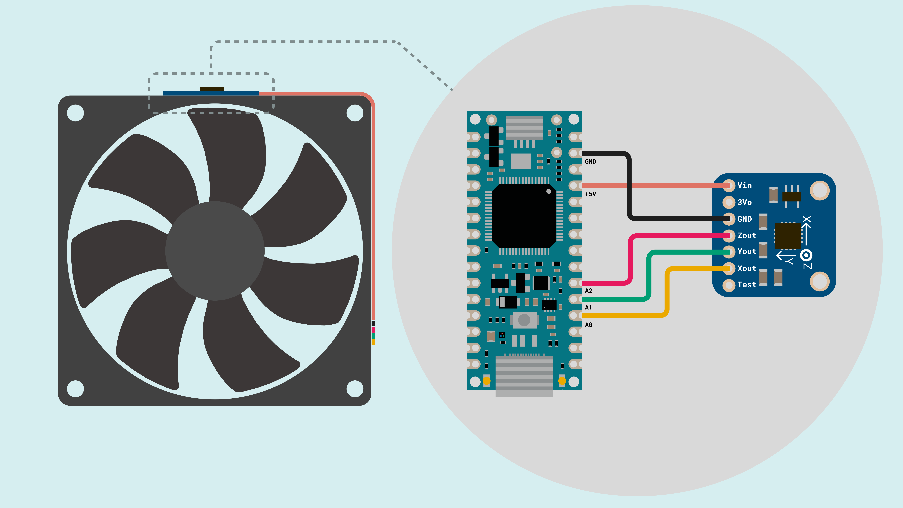

## Introduction

Motor condition monitoring is a critical application in industrial environments where unexpected equipment failures can result in significant downtime and maintenance costs. This application note describes how to build a motor anomaly detection system using the Nano R4 board, the ADXL335 analog accelerometer and Edge Impulse.


The motor anomaly detection system developed in this application note provides real-time monitoring of vibration patterns to identify abnormal operating conditions that may indicate mechanical issues, wear or impending failures. The system uses embedded machine learning to detect anomalous vibration patterns that deviate from normal motor operation, enabling predictive maintenance strategies.

## Goals

The main goals of this application note are the following:

- Develop and implement a motor anomaly detection system that monitors vibration patterns in real-time using an analog accelerometer.
- Collect and analyze vibration data from motors to establish baseline normal operation patterns and detect deviations.
- Train a machine learning model using Edge Impulse for intelligent anomaly detection based on vibration signatures.
- Deploy the trained model directly to the Nano R4 board for real-time, on-device anomaly detection without cloud connectivity requirements.
- Provide visual feedback through the board's built-in LED to indicate detected anomalies and system status.
- Enable industrial predictive maintenance applications with cost-effective embedded intelligence.

## Hardware and Software Requirements

### Hardware Requirements

- [Arduino Nano R4](https://store.arduino.cc/products/nano-r4) (x1)
- [ADXL335 3-axis analog accelerometer breakout board](https://www.adafruit.com/product/163) (x1)
- [USB-C® cable](https://store.arduino.cc/products/usb-cable2in1-type-c) (x1)
- Breadboard and jumper wires for connections (x1 set)
- Motor or rotating equipment for testing purposes (for example, a small DC motor or fan) (x1)
- Power supply appropriate for the motor or rotating equipment (if required) (x1)

### Software Requirements

- [Arduino IDE 2.0+](https://www.arduino.cc/en/software) or [Arduino Web Editor](https://create.arduino.cc/editor)
- [Arduino Renesas Core](https://github.com/arduino/ArduinoCore-renesas) (required to work with the Nano R4 board)
- [Edge Impulse account](https://studio.edgeimpulse.com/) (free tier available)
- [Edge Impulse CLI tools](https://docs.edgeimpulse.com/docs/cli-installation) for data forwarding

***The Nano R4 board provides enhanced processing capabilities with a 32-bit Renesas RA4M1 microcontroller running at 48 MHz, 256 kB Flash memory and 32 kB SRAM for efficient machine learning inference. For detailed hardware specifications, please refer to the Arduino Nano R4 documentation.***

## Hardware Setup Overview

The electrical connections for the motor anomaly detection system are outlined in the diagram shown below:



This diagram shows how the system components are connected. The Nano R4 board serves as the **primary controller**, while the ADXL335 accelerometer collects **3-axis vibration data** from the motor being monitored.

The ADXL335 accelerometer connects to the Nano R4 board using analog input pins. For this application note, the system uses an external +5 VDC power supply that powers both the Nano R4 and the test motor, while the ADXL335 is powered through its onboard voltage regulator from the board's +5 VDC pin.

***This power configuration is designed specifically for testing and demonstration purposes in this application note. In real industrial environments, proper power system design should consider factors such as electrical isolation, noise filtering, surge protection, and compliance with industrial safety standards appropriate for the specific application and operating environment.***

### Circuit Connections

The following connections establish the interface between the Nano R4 board and the ADXL335 accelerometer:

| **ADXL335 Pin** | **Nano R4 Pin** |    **Description**   |
|:---------------:|:---------------:|:--------------------:|
|      `VCC`      |       `5V`      |     Power supply     |
|      `GND`      |      `GND`      |   Ground reference   |
|       `X`       |       `A0`      | X-axis analog output |
|       `Y`       |       `A1`      | Y-axis analog output |
|       `Z`       |       `A2`      | Z-axis analog output |
|       `ST`      |  Not connected  | Self-test (optional) |

### Physical Mounting Considerations

Proper accelerometer mounting is essential for effective vibration monitoring. The sensor must be securely attached to the motor housing or monitored equipment using suitable mechanical fasteners. A good mechanical coupling between the mounting surface and sensor ensures accurate vibration transmission and reliable measurements.

***For this application note, we will use a computer cooling fan to simulate motor operation and demonstrate the anomaly detection system. The ADXL335 accelerometer will be mounted on top of the fan using a custom 3D-printed enclosure, providing a stable and repeatable mounting solution for testing and demonstration purposes.***

## Understanding Motor Vibration Analysis

Motor vibrations contain valuable information about the mechanical condition of the equipment. Normal motor operation produces characteristic vibration patterns that remain relatively consistent during healthy operation. Abnormal conditions manifest as changes in vibration amplitude, frequency content or temporal patterns.

### Common Motor Faults

Typical motor faults that can be detected through vibration analysis include the following conditions:

- **Bearing wear**: Creates higher frequency components and increased overall vibration levels across all axes
- **Misalignment**: Produces specific frequency signatures related to rotational speed, typically appearing in radial directions
- **Imbalance**: Results in increased vibration at the fundamental rotational frequency, primarily in radial directions
- **Looseness**: Causes broadband increases in vibration across multiple frequencies and directions
- **Electrical issues**: May create vibrations at twice the line frequency due to magnetic field variations

### The Role of Sensors in Vibration Monitoring

Effective motor condition monitoring relies on sensors capable of accurately detecting and measuring mechanical vibrations. These sensors must capture the subtle changes in vibration patterns that indicate developing faults or abnormal operating conditions. The choice of sensor technology directly impacts the system's ability to detect problems early and provide reliable maintenance insights.

This application note uses the [ADXL335 analog accelerometer](https://www.analog.com/media/en/technical-documentation/data-sheets/adxl335.pdf) to provide accurate, real-time measurements of motor vibrations. The ADXL335 offers several key advantages for motor monitoring applications:

- **3-Axis measurement**: Captures vibrations in X, Y, and Z directions 
- **Analog output**: Direct compatibility with the Nano R4 board analog inputs without requiring complex digital interfaces
- **Low power consumption**: Only 320 μA current consumption makes it suitable for continuous monitoring applications
- **Wide frequency range**: 0.5 Hz to 1600 Hz bandwidth covers most typical motor fault frequencies

The ADXL335 technical specifications include the following characteristics:

- **Measurement range**: ±3g on all axes, appropriate for typical motor vibration levels
- **Sensitivity**: 330 mV/g nominal sensitivity provides good resolution for vibration analysis
- **Output**: Ratiometric analog voltages with +1.65 VDC representing 0g acceleration
- **Power supply**: +1.8 to +3.6 VDC (regulated to +3.3 VDC usually on breakout boards)

Signal processing considerations include selecting appropriate sampling rates based on the expected frequency content of motor vibrations, typically following the Nyquist criterion to avoid aliasing. The Nano R4 board's 14-bit ADC provides enough resolution for most vibration monitoring applications.

## Simple Vibration Monitor Example Sketch

Now that we have covered the hardware components and vibration analysis fundamentals, let's examine the software that enables vibration data collection. Before implementing intelligent anomaly detection, we need to collect training data representing normal motor operation for Edge Impulse, a platform that simplifies embedded AI development.

Edge Impulse requires training data in a specific format to build effective anomaly detection models. Our data collection sketch formats the accelerometer readings so Edge Impulse can analyze normal operation patterns and create a model that identifies when new data deviates from these established patterns.

This section breaks down the provided example sketch, guiding you through its functionality. We will explore how the accelerometer is initialized, how vibration data is collected at consistent intervals and how the results are formatted specifically for Edge Impulse data collection and model training.

The complete example sketch is shown below.

```arduino
/**
  Motor Vibration Data Collection for Edge Impulse
  Name: motor_vibration_collector.ino
  Purpose: This sketch reads 3-axis acceleration data from an ADXL335 
  accelerometer connected to an Arduino Nano R4. The data is formatted 
  for Edge Impulse data collection and training.
  
  @version 1.0 01/12/24
  @author Arduino Product Experience Team
*/

// Pin definitions for ADXL335 accelerometer
const int xPin = A0;  // X-axis connected to analog pin 0
const int yPin = A1;  // Y-axis connected to analog pin 1
const int zPin = A2;  // Z-axis connected to analog pin 2

// ADXL335 specifications
const float sensitivity = 0.330;  // 330 mV/g sensitivity
const float zeroG = 1.65;         // 1.65V at 0g acceleration
const float vRef = 3.3;           // Reference voltage

// Sampling parameters for Edge Impulse
const int sampleRate = 100;       // 100 Hz sampling rate
const int windowSize = 200;       // 2-second data windows (200 samples)
const unsigned long sampleInterval = 1000 / sampleRate; // 10ms between samples

// Data collection variables
unsigned long lastSample = 0;
int sampleCount = 0;
bool collectingData = false;

/**
  Initializes the accelerometer and serial communication.
  Configures the Arduino Nano R4 ADC resolution and prepares
  the system for vibration data collection.
*/
void setup() {
  // Initialize serial communication at 115200 baud
  Serial.begin(115200);
  
  // Configure ADC for maximum resolution
  // Use 14-bit ADC resolution
  analogReadResolution(14);  
  
  // System ready message
  Serial.println("- Motor Vibration Data Collector");
  Serial.println("- Send 'start' to begin data collection");
  Serial.println("- Data format: X_accel,Y_accel,Z_accel");
  
  // Allow sensor to stabilize
  delay(1000);
}

/**
  Main loop that handles data collection commands and sampling.
  Checks for serial commands to start/stop data collection and
  maintains consistent sampling timing for vibration analysis.
*/
void loop() {
  // Check for serial commands
  if (Serial.available()) {
    String command = Serial.readString();
    command.trim();
    
    if (command == "start" && !collectingData) {
      startDataCollection();
    } else if (command == "stop" && collectingData) {
      stopDataCollection();
    }
  }
  
  // Collect data if active
  if (collectingData) {
    collectVibrationData();
  }
}

/**
  Starts a new data collection window.
  Resets counters and begins sampling vibration data
  at the specified rate for Edge Impulse training.
*/
void startDataCollection() {
  collectingData = true;
  sampleCount = 0;
  lastSample = millis();
  
  Serial.println("- Starting data collection...");
  Serial.println();
  delay(100);
}

/**
  Stops the current data collection window.
  Provides feedback on the number of samples collected
  and prepares system for next collection cycle.
*/
void stopDataCollection() {
  collectingData = false;
  Serial.println();
  Serial.print("- Data collection stopped. Samples collected: ");
  Serial.println(sampleCount);
  Serial.println("- Send 'start' to collect another window");
}

/**
  Collects vibration data from the ADXL335 accelerometer.
  Maintains precise timing for consistent sampling and
  converts raw ADC values to acceleration in g units.
*/
void collectVibrationData() {
  unsigned long currentTime = millis();
  
  // Check if it's time for the next sample
  if (currentTime - lastSample >= sampleInterval) {
    // Read raw ADC values from all three axes
    int xRaw = analogRead(xPin);
    int yRaw = analogRead(yPin);
    int zRaw = analogRead(zPin);
    
    // Convert ADC values to voltages (14-bit ADC: 0-16383)
    float xVolt = (xRaw * vRef) / 16383.0;
    float yVolt = (yRaw * vRef) / 16383.0;
    float zVolt = (zRaw * vRef) / 16383.0;
    
    // Convert voltages to acceleration in g units
    float xAccel = (xVolt - zeroG) / sensitivity;
    float yAccel = (yVolt - zeroG) / sensitivity;
    float zAccel = (zVolt - zeroG) / sensitivity;
    
    // Output data in CSV format for Edge Impulse
    Serial.print(xAccel, 4);
    Serial.print(",");
    Serial.print(yAccel, 4);
    Serial.print(",");
    Serial.println(zAccel, 4);
    
    // Update timing and sample count
    sampleCount++;
    lastSample = currentTime;
    
    // Check if window is complete
    if (sampleCount >= windowSize) {
      stopDataCollection();
    }
  }
}
```

The following sections will help you understand the main components of the example sketch, which can be divided into the following areas:

- Hardware configuration and calibration
- Data collection timing and control
- Signal processing and conversion
- Edge Impulse data formatting

### Hardware Configuration and Calibration

Before we can collect vibration data, we need to configure the Nano R4 board to properly interface with the ADXL335 accelerometer and establish its calibration parameters.

```arduino
// Pin definitions for ADXL335 accelerometer
const int xPin = A0;  // X-axis connected to analog pin 0
const int yPin = A1;  // Y-axis connected to analog pin 1
const int zPin = A2;  // Z-axis connected to analog pin 2

// ADXL335 specifications
const float sensitivity = 0.330;  // 330 mV/g sensitivity
const float zeroG = 1.65;         // 1.65V at 0g acceleration
const float vRef = 3.3;           // Reference voltage
```

In the code snippet shown above:

- Pin assignments map each accelerometer axis to specific analog inputs on the Nano R4 
- Sensitivity and zero-g voltage values come directly from the ADXL335 datasheet specifications
- Reference voltage is set to match the accelerometer's regulated output voltage

### Data Collection Timing and Control

To ensure accurate vibration analysis and successful machine learning training, we need consistent data collection timing. These sampling parameters control how data is gathered:

```arduino
// Sampling parameters for Edge Impulse
const int sampleRate = 100;       // 100 Hz sampling rate
const int windowSize = 200;       // 2-second data windows (200 samples)
const unsigned long sampleInterval = 1000 / sampleRate; // 10ms between samples
```

In the code snippet shown above:

- Sample rate of 100 Hz captures adequate frequency response for detecting most motor faults
- Window size of 200 samples creates 2-second data segments that work well with Edge Impulse training
- Sample interval calculation automatically determines the precise timing needed between measurements

### Signal Processing and Conversion

Once we have the raw sensor readings, we need to convert them into meaningful acceleration values. This conversion process transforms the ADC readings into data we can analyze:

```arduino
void collectVibrationData() {
  unsigned long currentTime = millis();
  
  // Check if it's time for the next sample
  if (currentTime - lastSample >= sampleInterval) {
    // Read raw ADC values from all three axes
    int xRaw = analogRead(xPin);
    int yRaw = analogRead(yPin);
    int zRaw = analogRead(zPin);
    
    // Convert ADC values to voltages (14-bit ADC: 0-16383)
    float xVolt = (xRaw * vRef) / 16383.0;
    float yVolt = (yRaw * vRef) / 16383.0;
    float zVolt = (zRaw * vRef) / 16383.0;
    
    // Convert voltages to acceleration in g units
    float xAccel = (xVolt - zeroG) / sensitivity;
    float yAccel = (yVolt - zeroG) / sensitivity;
    float zAccel = (zVolt - zeroG) / sensitivity;
```

In the code snippet shown above:

- Timing control maintains consistent sample intervals, which is essential for proper frequency analysis
- ADC conversion takes into account the Nano R4's 14-bit resolution that ranges from 0 to 16383
- Acceleration calculation applies the ADXL335 calibration parameters to get accurate g-force values

### Edge Impulse Data Formatting

The final step formats our acceleration data so it can be easily used with Edge Impulse data collection tools:

```arduino
    // Output data in CSV format for Edge Impulse
    Serial.print(xAccel, 4);
    Serial.print(",");
    Serial.print(yAccel, 4);
    Serial.print(",");
    Serial.println(zAccel, 4);
```

In the code snippet shown above:

- CSV format with four decimal places gives us the precision needed for machine learning training
- Single-line output per sample makes it easy to integrate with the Edge Impulse data forwarder
- Comma separation follows standard CSV conventions that most data processing tools expect

After uploading the example sketch to the Nano R4 board, you should see the following output in the Arduino IDE's Serial Monitor when data collection is active:


### Complete Example Sketch

The complete data collection example sketch can be downloaded [here](assets/motor_vibration_collector.zip).

## Connecting the Vibration Monitor to Edge Impulse

As vibration-based condition monitoring continues to grow in importance for predictive maintenance, connecting our data collection system to Edge Impulse enables the development of intelligent anomaly detection models. Edge Impulse provides an end-to-end platform for embedded machine learning, allowing us to transform raw vibration data into actionable insights about motor health.

In this section, we will connect the vibration monitor to Edge Impulse platform to collect training data, develop machine learning models, and deploy intelligent anomaly detection directly to the Arduino Nano R4. This connection transforms our simple vibration monitor into an intelligent system capable of detecting motor anomalies without requiring cloud connectivity.

***If you are new to Edge Impulse, please check out [this tutorial](https://docs.edgeimpulse.com/docs/tutorials/end-to-end-tutorials/time-series/continuous-motion-recognition/) for an introduction to the platform.***

### Setting up Edge Impulse Account and Project

The first step involves creating an Edge Impulse account and configuring a new project for motor anomaly detection. The following steps establish the foundation for machine learning model development:

1. **Create Account**: Register for a free Edge Impulse account at [studio.edgeimpulse.com](https://studio.edgeimpulse.com/)
2. **New Project**: Create a new project and select "Accelerometer data" as the primary data type
3. **Project Configuration**: Configure project settings with appropriate sampling frequency (100 Hz) and time series window length (2 seconds)

### Data Collection with Edge Impulse CLI

The Edge Impulse CLI provides tools for streaming data directly from the Arduino to the Edge Impulse platform. This eliminates manual file transfers and enables efficient data collection workflows.

#### Installing Edge Impulse CLI

Install the Edge Impulse CLI tools using the Node.js package manager:

```bash
npm install -g edge-impulse-cli
```

Verify the installation by checking the available commands:

```bash
edge-impulse-daemon --version
```

#### Setting up Data Forwarding

The following steps establish data forwarding from the Arduino Nano R4 to Edge Impulse:

1. **Login to Edge Impulse**: Use the `edge-impulse-daemon` command to authenticate with your account
2. **Start Data Forwarder**: Run `edge-impulse-data-forwarder` to begin streaming data
3. **Configure Serial Parameters**: Set baud rate to 115200 and select CSV format with 3 axes
4. **Device Configuration**: Configure the forwarder to recognize X, Y, Z acceleration data

#### Data Collection Process

Upload the data collection sketch to the Arduino Nano R4 and follow these steps for comprehensive training data:

**Normal Operation Data Collection:**
- Mount the accelerometer securely to the motor housing
- Ensure stable motor operation at normal load conditions
- Collect 15-20 minutes of "normal" operation data through multiple 2-second windows
- Vary motor load conditions to capture operational diversity
- Label all data as "normal" in Edge Impulse Studio

**Data Quality Verification:**
- Review collected samples in Edge Impulse Studio for consistency
- Check for proper amplitude ranges and absence of clipping
- Verify sample rate consistency and timing accuracy
- Remove any corrupted or anomalous samples from training set

### Training the Anomaly Detection Model

Once sufficient normal operation data is collected, the next step involves configuring and training the machine learning model for anomaly detection.

#### Impulse Design Configuration

Within Edge Impulse Studio, configure the impulse design with appropriate processing and learning blocks:

1. **Input Block**: Configure time series data with 2000ms windows at 100 Hz sampling rate (200 samples per window)
2. **Processing Block**: Add "Spectral Analysis" block for frequency domain feature extraction
3. **Learning Block**: Select "Anomaly Detection (K-means)" for unsupervised learning approach

#### Feature Extraction Configuration

The spectral analysis block extracts relevant features from the raw vibration signals. Configure the following parameters for optimal motor fault detection:

- **FFT Length**: 256 points for adequate frequency resolution up to 50 Hz
- **Filter**: Low-pass filter with 50 Hz cutoff to focus on motor fault frequencies
- **Spectral Power Edges**: Define frequency bands covering 0-50 Hz for motor characteristics
- **Analysis Type**: Power spectral density for energy-based feature extraction

#### Model Training Process

Follow these steps to train the anomaly detection model using the collected normal operation data:

1. **Generate Features**: Click "Generate features" to extract spectral features from all training data
2. **Feature Explorer**: Review the feature explorer visualization to verify data quality and feature separation
3. **Anomaly Detection Setup**: Configure K-means clustering with 32 clusters for pattern recognition
4. **Axis Selection**: Use "Select suggested axes" to automatically choose most relevant spectral features
5. **Start Training**: Initiate the training process and monitor convergence metrics

The training process creates clusters representing normal motor operation patterns. Any future data that falls outside these established clusters will be identified as anomalous.

#### Model Validation and Testing

After training completion, validate the model performance using the following methods:

- **Live Classification**: Test with new motor data to verify anomaly detection capability
- **Threshold Tuning**: Adjust anomaly threshold (typically 0.3-0.5) based on desired sensitivity
- **Performance Analysis**: Review clustering quality and feature importance rankings
- **False Alarm Testing**: Validate with known normal conditions to minimize false positives

### Model Deployment

After successful training and validation, deploy the model as an Arduino library for embedded inference:

1. **Deployment Section**: Navigate to the "Deployment" tab in Edge Impulse Studio
2. **Arduino Library**: Select "Arduino library" as the deployment target
3. **Optimization Settings**: Choose "int8" quantization for memory efficiency on the Nano R4
4. **Model Analysis**: Review memory usage and inference timing estimates
5. **Download Library**: Download the generated Arduino library ZIP file
6. **Library Installation**: Install in Arduino IDE using "Sketch > Include Library > Add .ZIP Library"

The generated library includes optimized inference code specifically compiled for the Arduino Nano R4's ARM Cortex-M4 processor, ensuring efficient real-time anomaly detection with minimal computational overhead.

## Improving the Vibration Monitor with Machine Learning

The previous sections explored data collection and model training using Edge Impulse. Now we can integrate the trained machine learning model directly into our vibration monitoring system, transforming it from a simple data collector into an intelligent anomaly detection device capable of real-time motor health assessment.

In this section, we will enhance the vibration monitor by incorporating the deployed Edge Impulse model. The system will continuously analyze motor vibrations and provide immediate feedback when anomalous conditions are detected, enabling proactive maintenance decisions without requiring external connectivity.


The enhanced monitoring system provides the following intelligent capabilities:

- **Real-time Anomaly Detection**: Continuous analysis of motor vibrations using embedded machine learning
- **Visual Alert System**: Built-in LED provides immediate indication of detected anomalies
- **Low Latency Response**: On-device inference eliminates communication delays for critical fault detection
- **Energy Efficient Operation**: Optimized model ensures minimal power consumption for continuous monitoring

The complete enhanced example sketch is shown below:

```arduino
/**
  Intelligent Motor Anomaly Detection System
  Name: motor_anomaly_detection.ino
  Purpose: This sketch implements real-time motor anomaly detection using
  an ADXL335 accelerometer and Edge Impulse machine learning model deployed
  on Arduino Nano R4 for predictive maintenance applications.
  
  @version 1.0 01/12/24
  @author Arduino Product Experience Team
*/

// Include the Edge Impulse library (name will match your project)
#include <motor_anomaly_detection_inferencing.h>

// Pin definitions for ADXL335 accelerometer
const int xPin = A0;  // X-axis connected to analog pin 0
const int yPin = A1;  // Y-axis connected to analog pin 1
const int zPin = A2;  // Z-axis connected to analog pin 2

// ADXL335 specifications
const float sensitivity = 0.330;  // 330 mV/g sensitivity
const float zeroG = 1.65;         // 1.65V at 0g acceleration
const float vRef = 3.3;           // Reference voltage

// Edge Impulse model parameters
const int samplingFreq = EI_CLASSIFIER_FREQUENCY;           // Model sampling frequency
const int sampleLength = EI_CLASSIFIER_RAW_SAMPLE_COUNT;    // Required sample count
const int featureCount = EI_CLASSIFIER_DSP_INPUT_FRAME_SIZE; // Feature vector size

// Data buffer for model inference
float features[EI_CLASSIFIER_DSP_INPUT_FRAME_SIZE];
int featureIndex = 0;

// Anomaly detection parameters
const float anomalyThreshold = 0.3;  // Adjust based on model performance
const int alertPin = LED_BUILTIN;    // Built-in LED for anomaly alerts
const int alertDuration = 1000;      // Alert LED duration in milliseconds

// System status variables
unsigned long lastInference = 0;
unsigned long lastAlert = 0;
bool systemReady = false;

/**
  Initializes the accelerometer, LED, and machine learning system.
  Configures the Arduino Nano R4 for optimal performance with the
  Edge Impulse model and prepares for real-time anomaly detection.
*/
void setup() {
  // Initialize serial communication
  Serial.begin(115200);
  
  // Configure hardware
  analogReadResolution(14);     // Maximum ADC resolution
  pinMode(alertPin, OUTPUT);    // Configure alert LED
  digitalWrite(alertPin, LOW);  // Ensure LED starts off
  
  // System initialization message
  Serial.println("Motor Anomaly Detection System");
  Serial.println("Initializing Edge Impulse model...");
  
  // Display model information
  Serial.print("Model: ");
  Serial.println(EI_CLASSIFIER_PROJECT_NAME);
  Serial.print("Sampling frequency: ");
  Serial.print(samplingFreq);
  Serial.println(" Hz");
  Serial.print("Sample window: ");
  Serial.print(sampleLength / samplingFreq);
  Serial.println(" seconds");
  
  // Allow sensor stabilization
  delay(2000);
  systemReady = true;
  
  Serial.println("System ready - Starting motor monitoring...");
  Serial.println("Anomaly Score, Status, DSP Time (ms), Inference Time (ms)");
}

/**
  Main loop that continuously monitors motor vibrations and performs
  real-time anomaly detection using the embedded machine learning model.
*/
void loop() {
  if (systemReady) {
    // Collect vibration data for inference
    collectVibrationWindow();
    
    // Perform anomaly detection
    performAnomalyDetection();
    
    // Brief delay between inference cycles
    delay(100);
  }
}

/**
  Collects a complete window of vibration data for machine learning inference.
  Maintains precise timing to match the trained model's sampling requirements
  and ensures data quality for accurate anomaly detection.
*/
void collectVibrationWindow() {
  unsigned long windowStart = millis();
  featureIndex = 0;
  
  // Collect samples according to model requirements
  while (featureIndex < sampleLength) {
    unsigned long sampleTime = micros();
    
    // Read accelerometer values
    int xRaw = analogRead(xPin);
    int yRaw = analogRead(yPin);
    int zRaw = analogRead(zPin);
    
    // Convert to acceleration values
    float xAccel = ((xRaw * vRef / 16383.0) - zeroG) / sensitivity;
    float yAccel = ((yRaw * vRef / 16383.0) - zeroG) / sensitivity;
    float zAccel = ((zRaw * vRef / 16383.0) - zeroG) / sensitivity;
    
    // Store in feature buffer for inference
    if (featureIndex + 2 < sampleLength) {
      features[featureIndex++] = xAccel;
      features[featureIndex++] = yAccel;
      features[featureIndex++] = zAccel;
    }
    
    // Maintain precise sampling timing
    unsigned long sampleDuration = 1000000 / samplingFreq; // Microseconds per sample
    while (micros() - sampleTime < sampleDuration) {
      delayMicroseconds(10);
    }
    
    // Safety timeout to prevent infinite loops
    if (millis() - windowStart > 5000) {
      Serial.println("Warning: Data collection timeout");
      break;
    }
  }
}

/**
  Performs anomaly detection using the Edge Impulse model and provides
  system feedback through serial output and LED alerts. Analyzes the
  collected vibration data and determines motor health status.
*/
void performAnomalyDetection() {
  ei_impulse_result_t result = { 0 };
  
  // Create signal structure for Edge Impulse
  signal_t features_signal;
  features_signal.total_length = sampleLength;
  features_signal.get_data = &getFeatureData;
  
  // Run the Edge Impulse classifier
  EI_IMPULSE_ERROR inferenceResult = run_classifier(&features_signal, &result, false);
  
  if (inferenceResult == EI_IMPULSE_OK) {
    // Extract anomaly score from model output
    float anomalyScore = result.anomaly;
    
    // Determine system status
    String status = "NORMAL";
    bool anomalyDetected = false;
    
    if (anomalyScore > anomalyThreshold) {
      status = "ANOMALY";
      anomalyDetected = true;
    }
    
    // Output results in CSV format for monitoring
    Serial.print(anomalyScore, 4);
    Serial.print(",");
    Serial.print(status);
    Serial.print(",");
    Serial.print(result.timing.dsp);
    Serial.print(",");
    Serial.println(result.timing.anomaly);
    
    // Handle anomaly alerts
    if (anomalyDetected) {
      triggerAnomalyAlert();
    }
    
    // Update timing
    lastInference = millis();
    
  } else {
    // Handle inference errors
    Serial.print("Inference error: ");
    Serial.println(inferenceResult);
    
    // Flash LED to indicate system error
    digitalWrite(alertPin, HIGH);
    delay(100);
    digitalWrite(alertPin, LOW);
  }
}

/**
  Provides visual and serial feedback when motor anomalies are detected.
  Activates the built-in LED alert and logs detailed anomaly information
  for maintenance planning and system diagnostics.
*/
void triggerAnomalyAlert() {
  unsigned long currentTime = millis();
  
  // Rate limit alerts to prevent excessive notifications
  if (currentTime - lastAlert > alertDuration) {
    // Activate visual alert
    digitalWrite(alertPin, HIGH);
    delay(200);
    digitalWrite(alertPin, LOW);
    delay(100);
    digitalWrite(alertPin, HIGH);
    delay(200);
    digitalWrite(alertPin, LOW);
    
    // Log anomaly event
    Serial.println("*** MOTOR ANOMALY DETECTED - CHECK EQUIPMENT ***");
    
    lastAlert = currentTime;
  }
}

/**
  Callback function for Edge Impulse library to access feature data.
  Provides the machine learning model with vibration data in the
  required format for inference processing.
*/
int getFeatureData(size_t offset, size_t length, float *out_ptr) {
  memcpy(out_ptr, features + offset, length * sizeof(float));
  return 0;
}
```

The following sections will help you understand the main components of the enhanced example sketch, which can be divided into the following areas:

- Edge Impulse library integration
- Real-time data collection and buffering
- Machine learning inference execution
- Anomaly detection and alert system

### Edge Impulse Library Integration

The enhanced sketch begins by integrating the trained machine learning model through the Edge Impulse generated library.

```arduino
// Include the Edge Impulse library (name will match your project)
#include <motor_anomaly_detection_inferencing.h>

// Edge Impulse model parameters
const int samplingFreq = EI_CLASSIFIER_FREQUENCY;           // Model sampling frequency
const int sampleLength = EI_CLASSIFIER_RAW_SAMPLE_COUNT;    // Required sample count
const int featureCount = EI_CLASSIFIER_DSP_INPUT_FRAME_SIZE; // Feature vector size

// Data buffer for model inference
float features[EI_CLASSIFIER_DSP_INPUT_FRAME_SIZE];
```

In the code snippet shown above:

- The Edge Impulse library provides pre-compiled inference code optimized for the Arduino Nano R4
- Model parameters are automatically configured based on the training settings
- Feature buffer allocation matches the exact requirements of the trained model

### Real-time Data Collection and Buffering

The system continuously collects vibration data in windows that match the trained model's requirements.

```arduino
void collectVibrationWindow() {
  unsigned long windowStart = millis();
  featureIndex = 0;
  
  // Collect samples according to model requirements
  while (featureIndex < sampleLength) {
    unsigned long sampleTime = micros();
    
    // Read accelerometer values
    int xRaw = analogRead(xPin);
    int yRaw = analogRead(yPin);
    int zRaw = analogRead(zPin);
    
    // Convert to acceleration values
    float xAccel = ((xRaw * vRef / 16383.0) - zeroG) / sensitivity;
    float yAccel = ((yRaw * vRef / 16383.0) - zeroG) / sensitivity;
    float zAccel = ((zRaw * vRef / 16383.0) - zeroG) / sensitivity;
    
    // Store in feature buffer for inference
    if (featureIndex + 2 < sampleLength) {
      features[featureIndex++] = xAccel;
      features[featureIndex++] = yAccel;
      features[featureIndex++] = zAccel;
    }
    
    // Maintain precise sampling timing
    unsigned long sampleDuration = 1000000 / samplingFreq; // Microseconds per sample
    while (micros() - sampleTime < sampleDuration) {
      delayMicroseconds(10);
    }
  }
}
```

In the code snippet shown above:

- Precise timing control ensures consistency with training data characteristics
- Microsecond-level timing maintains the exact sampling frequency used during model training
- Buffer management prevents overflow while collecting the required number of samples

### Machine Learning Inference Execution

The anomaly detection process uses the Edge Impulse library to analyze collected vibration data.

```arduino
void performAnomalyDetection() {
  ei_impulse_result_t result = { 0 };
  
  // Create signal structure for Edge Impulse
  signal_t features_signal;
  features_signal.total_length = sampleLength;
  features_signal.get_data = &getFeatureData;
  
  // Run the Edge Impulse classifier
  EI_IMPULSE_ERROR inferenceResult = run_classifier(&features_signal, &result, false);
  
  if (inferenceResult == EI_IMPULSE_OK) {
    // Extract anomaly score from model output
    float anomalyScore = result.anomaly;
    
    // Determine system status
    String status = "NORMAL";
    bool anomalyDetected = false;
    
    if (anomalyScore > anomalyThreshold) {
      status = "ANOMALY";
      anomalyDetected = true;
    }
    
    // Output results for monitoring
    Serial.print(anomalyScore, 4);
    Serial.print(",");
    Serial.print(status);
    Serial.print(",");
    Serial.print(result.timing.dsp);
    Serial.print(",");
    Serial.println(result.timing.anomaly);
  }
}
```

In the code snippet shown above:

- The classifier analyzes the complete vibration window using the trained anomaly detection model
- Anomaly scores range from 0.0 (normal) to 1.0 (highly anomalous) based on deviation from training patterns
- Performance timing information helps optimize system response and resource usage

### Anomaly Detection and Alert System

The alert system provides immediate feedback when motor anomalies are detected.

```arduino
void triggerAnomalyAlert() {
  unsigned long currentTime = millis();
  
  // Rate limit alerts to prevent excessive notifications
  if (currentTime - lastAlert > alertDuration) {
    // Activate visual alert
    digitalWrite(alertPin, HIGH);
    delay(200);
    digitalWrite(alertPin, LOW);
    delay(100);
    digitalWrite(alertPin, HIGH);
    delay(200);
    digitalWrite(alertPin, LOW);
    
    // Log anomaly event
    Serial.println("*** MOTOR ANOMALY DETECTED - CHECK EQUIPMENT ***");
    
    lastAlert = currentTime;
  }
}
```

In the code snippet shown above:

- Double-flash LED pattern provides clear visual indication of detected anomalies
- Rate limiting prevents excessive alerts during persistent anomaly conditions
- Serial logging creates audit trail for maintenance planning and system analysis

After uploading the enhanced sketch to the Arduino Nano R4, you should see the following output in the Arduino IDE's Serial Monitor during normal operation:


When an anomaly is detected, the built-in LED will flash twice and the serial output will display the anomaly score above the configured threshold along with a warning message.

### Complete Enhanced Example Sketch

The complete intelligent motor anomaly detection sketch can be downloaded [here](assets/motor_anomaly_detection.zip).

### System Integration Considerations

When deploying the intelligent anomaly detection system in industrial environments, consider the following factors:

**Environmental Protection**: Protect the Arduino Nano R4 and accelerometer from dust, moisture, and temperature extremes using appropriate enclosures rated for the operating environment.

**Mounting Stability**: Ensure secure mechanical mounting of both the accelerometer sensor and the Arduino enclosure to prevent sensor movement that could affect measurement accuracy.

**Power Management**: Implement appropriate power supply filtering and protection circuits, especially in electrically noisy industrial environments with motor drives and switching equipment.

**Calibration Procedures**: Establish baseline measurements for each motor installation to account for mounting variations and motor-specific characteristics that may affect anomaly thresholds.

**Maintenance Integration**: Plan integration with existing maintenance management systems through data logging interfaces or communication protocols for comprehensive predictive maintenance programs.

## Conclusions

This application note demonstrates a comprehensive approach to implementing motor anomaly detection using the Arduino Nano R4, ADXL335 accelerometer, and Edge Impulse machine learning platform. The solution provides several key advantages for industrial predictive maintenance applications.

The combination of the Arduino Nano R4's enhanced 32-bit processing capabilities and Edge Impulse's optimized machine learning algorithms enables sophisticated anomaly detection directly on the embedded device. This approach eliminates the need for constant connectivity to cloud services and provides immediate response to potential equipment issues with inference times typically under 20 milliseconds.

The analog interface of the ADXL335 accelerometer provides direct compatibility with the Arduino's high-resolution analog inputs while offering sufficient sensitivity and frequency response for most motor monitoring applications. The 3-axis measurement capability enables comprehensive vibration analysis across multiple directions, improving detection accuracy for various types of motor faults.

The Edge Impulse platform significantly simplifies the machine learning development workflow, providing integrated tools for data collection, feature extraction, model training, and embedded deployment. The generated Arduino libraries are specifically optimized for the Nano R4's ARM Cortex-M4 processor, ensuring efficient real-time inference with minimal computational overhead.

The unsupervised anomaly detection approach using K-means clustering requires only normal operation data for training, making it practical for industrial deployment where fault data may be difficult or expensive to obtain. This approach can detect previously unseen fault conditions that deviate from established normal patterns.

## Next Steps

Building upon this foundation, several enhancements can further improve the motor anomaly detection system for advanced industrial applications:

**Multi-Sensor Fusion**: Integrate additional sensors such as temperature monitoring, current signature analysis, or acoustic emission sensors to provide a more comprehensive view of motor health. Combining multiple sensor modalities can improve detection accuracy and reduce false alarms while providing insights into specific fault mechanisms.

**Advanced Signal Processing**: Implement sophisticated preprocessing techniques such as order tracking for variable speed motors, envelope analysis for bearing fault detection, or cepstrum analysis for gear mesh monitoring. These techniques can improve sensitivity to specific types of motor faults and provide more detailed diagnostic information.

**Wireless Communication**: Add wireless connectivity using modules such as LoRaWAN for long-range communication or WiFi for local network integration. This enhancement supports centralized monitoring systems and enables remote access to anomaly detection results and system status.

**Data Logging and Trending**: Implement local data storage using SD cards or external memory to maintain historical records of motor performance, anomaly scores, and detected events. This capability supports trend analysis, remaining useful life estimation, and validation of maintenance decisions.

**Industrial Protocol Integration**: Develop interfaces for common industrial communication standards such as Modbus RTU, CAN bus, or Industrial Ethernet protocols. This integration enables seamless connection with existing plant automation systems, SCADA platforms, and maintenance management software.

**Fault Classification**: Extend beyond binary anomaly detection to implement multi-class fault classification that can distinguish between different types of motor problems such as bearing faults, misalignment, or electrical issues. This advancement requires collecting labeled fault data but provides more actionable maintenance guidance.

The foundation provided in this application note enables rapid development of custom motor monitoring solutions tailored to specific industrial requirements while leveraging the power of embedded machine learning for intelligent condition monitoring and predictive maintenance strategies