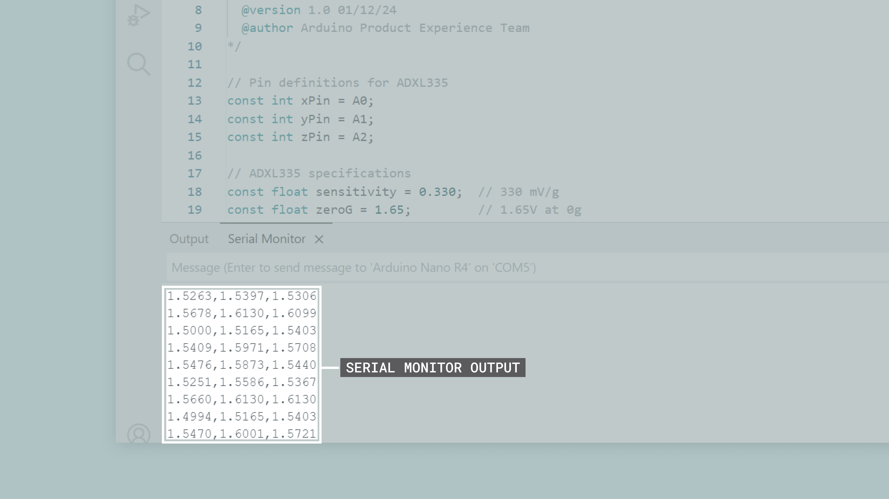
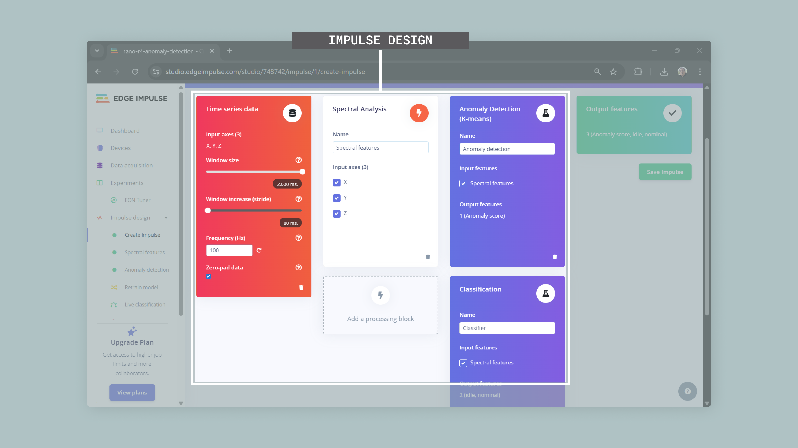
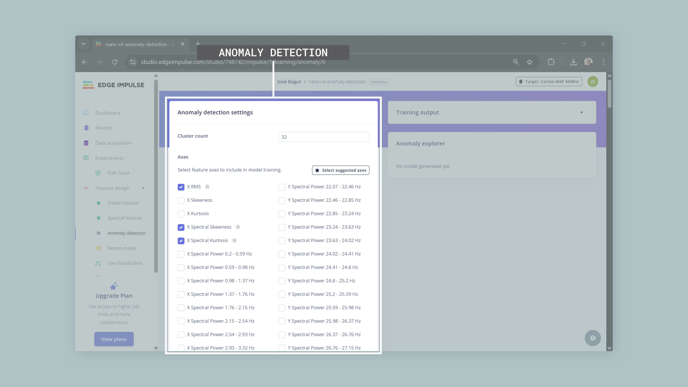

## Introduction

Motor condition monitoring is essential in industrial settings where unexpected equipment failures can cause significant downtime and high maintenance costs. This application note shows how to build a motor anomaly detection system using the Nano R4 board, an ADXL335 accelerometer and Edge Impulse®.


The developed system monitors vibration patterns in real-time to identify unusual operating conditions that may signal mechanical problems, wear or potential failures. The system uses machine learning to detect vibration patterns that differ from normal motor operation, enabling predictive maintenance.

## Goals

This application note will help you to:

- Build a motor anomaly detection system that monitors vibration patterns in real-time using an accelerometer.
- Collect and analyze vibration data from motors to create baseline patterns and detect changes.
- Train a machine learning model using Edge Impulse to detect anomalies based on vibration data.
- Deploy the trained model directly to the Nano R4 board for real-time anomaly detection without needing cloud connectivity.
- Set up visual feedback through the board's built-in LED to show detected anomalies and system status.
- Create industrial predictive maintenance solutions using cost-effective embedded intelligence.

## Hardware and Software Requirements

### Hardware Requirements

- [Arduino Nano R4](https://store.arduino.cc/products/nano-r4) (x1)
- [ADXL335 accelerometer breakout board](https://www.adafruit.com/product/163) (x1)
- [USB-C® cable](https://store.arduino.cc/products/usb-cable2in1-type-c) (x1)
- Breadboard and jumper wires (x1 set)
- Motor or rotating equipment for testing (for example, a small DC motor or fan) (x1)
- Power supply for the motor (if needed) (x1)

### Software Requirements

- [Arduino IDE 2.0+](https://www.arduino.cc/en/software) or [Arduino Web Editor](https://create.arduino.cc/editor)
- [Arduino Renesas Core](https://github.com/arduino/ArduinoCore-renesas) (needed for the Nano R4 board)
- [Edge Impulse account](https://studio.edgeimpulse.com/) (free tier available)
- [Edge Impulse CLI tools](https://docs.edgeimpulse.com/docs/cli-installation) for data collection

***The Nano R4 board offers improved processing power with a 32-bit Renesas RA4M1 microcontroller running at 48 MHz, 256 kB Flash memory and 32 kB SRAM for machine learning tasks. For complete hardware specifications, see the [Arduino Nano R4 documentation](https://docs.arduino.cc/hardware/nano-r4/).***

## Hardware Setup Overview

The electrical connections for the motor anomaly detection system are shown in the diagram below:


This diagram shows how the system components connect. **The Nano R4 board acts as the main controller**, while **the ADXL335 accelerometer collects vibration data** from the motor.

The ADXL335 accelerometer connects to the Nano R4 board using analog input pins. In this setup, an external +5 VDC power supply powers both the Nano R4 and the test motor, while the ADXL335 gets power through its built-in voltage regulator from the board's +5 VDC pin.

***__Important note__: This power setup is for testing and demonstration only. In real industrial environments, proper power system design should include electrical isolation, noise filtering, surge protection and compliance with industrial safety standards for your specific application.***

### Circuit Connections

The following connections establish the interface between the Nano R4 board and the ADXL335 accelerometer:

| **ADXL335 Pin** | **Nano R4 Pin** |    **Description**   |
|:---------------:|:---------------:|:--------------------:|
|      `VCC`      |       `5V`      |     Power supply     |
|      `GND`      |      `GND`      |   Ground reference   |
|       `X`       |       `A0`      | X-axis analog output |
|       `Y`       |       `A1`      | Y-axis analog output |
|       `Z`       |       `A2`      | Z-axis analog output |
|       `ST`      |  Not connected  | Self-test (optional) |

### Physical Mounting Considerations

Proper accelerometer mounting is essential for effective vibration monitoring. The sensor must be securely attached to the motor housing or equipment using appropriate mechanical fasteners. Good mechanical connection between the mounting surface and sensor ensures accurate vibration transmission and reliable measurements.

***For this application note, we will use a computer cooling fan to simulate motor operation and demonstrate the anomaly detection system. The ADXL335 accelerometer will be mounted on top of the fan using a custom 3D-printed enclosure, providing a stable and consistent mounting solution for testing.***

## Understanding Motor Vibration Analysis

Motor vibrations contain valuable information about the mechanical condition of the equipment. Normal motor operation produces characteristic vibration patterns that stay relatively consistent during healthy operation. Abnormal conditions show up as changes in vibration amplitude, frequency content or timing patterns.

### Common Motor Faults

Common motor faults that can be detected through vibration analysis include:

- **Bearing wear**: Creates higher frequency components and increased vibration levels across all axes
- **Misalignment**: Produces specific frequency patterns related to rotational speed, typically appearing in radial directions
- **Imbalance**: Results in increased vibration at the main rotational frequency, primarily in radial directions
- **Looseness**: Causes widespread increases in vibration across multiple frequencies and directions
- **Electrical issues**: May create vibrations at twice the line frequency due to magnetic field changes

### The Role of Sensors in Vibration Monitoring

Effective motor condition monitoring relies on sensors that can accurately detect and measure mechanical vibrations. These sensors must capture the small changes in vibration patterns that indicate developing faults or abnormal operating conditions. The choice of sensor technology directly affects the system's ability to detect problems early and provide reliable maintenance information.

This application note uses the [ADXL335 accelerometer](https://www.analog.com/media/en/technical-documentation/data-sheets/adxl335.pdf) to provide accurate, real-time measurements of motor vibrations. The ADXL335 offers several key advantages for motor monitoring applications:

- **3-Axis measurement**: Captures vibrations in X, Y, and Z directions 
- **Analog output**: Direct compatibility with the Nano R4 board analog inputs without needing complex digital interfaces
- **Low power consumption**: Only 320 μA current consumption makes it suitable for continuous monitoring applications
- **Wide frequency range**: 0.5 Hz to 1600 Hz bandwidth covers most common motor fault frequencies

The ADXL335 technical specifications include:

| **Specification** |          **Value**          |                     **Notes**                    |
|:-----------------:|:---------------------------:|:------------------------------------------------:|
| Measurement range |       ±3g on all axes       |   Appropriate for common motor vibration levels  |
|    Sensitivity    |       330 mV/g nominal      |  Provides good resolution for vibration analysis |
|       Output      | Ratiometric analog voltages |       +1.65 VDC represents 0g acceleration       |
|    Power supply   |       +1.8 to +3.6 VDC      | Usually regulated to +3.3 VDC on breakout boards |

Signal processing considerations include selecting appropriate sampling rates based on the expected frequency content of motor vibrations, typically following the Nyquist rule to avoid aliasing. The Nano R4 board's 14-bit ADC provides sufficient resolution for most vibration monitoring applications.

## Simple Vibration Monitor Example Sketch

Now that we have covered the hardware components and vibration analysis basics, let's look at the software that enables vibration data collection. Before implementing intelligent anomaly detection, we need to collect training data representing normal motor operation for Edge Impulse, a platform that simplifies embedded AI development.

Edge Impulse needs training data in a specific format to build effective anomaly detection models. Our data collection sketch formats the accelerometer readings so Edge Impulse can analyze normal operation patterns and create a model that identifies when new data differs from these patterns.

This section breaks down the example sketch and guides you through its functionality. We will explore how the accelerometer is initialized, how vibration data is collected at consistent intervals, and how the results are formatted for Edge Impulse data collection and model training.

The complete example sketch is shown below.

```arduino
/**
  Motor Vibration Data Collection for Edge Impulse
  Name: motor_vibration_collector.ino
  Purpose: This sketch reads 3-axis acceleration data from an ADXL335 
  accelerometer connected to an Arduino Nano R4. The data is formatted 
  for Edge Impulse data collection and training.
  
  @version 1.0 01/06/25
  @author Arduino Product Experience Team
*/

// Pin definitions for ADXL335
const int xPin = A0;
const int yPin = A1;
const int zPin = A2;

// Arduino ADC specifications
const int ADCMaxVal = 16383;        // 14-bit ADC max value
const float mVMaxVal = 5000.0;      // ADC reference voltage in mV

// ADXL335 specifications (calibrated values for this specific breakout board)
const float supplyMidPointmV = 1237.0;  // Measured 0g bias point
const float mVperg = 303.0;             // Measured sensitivity (mV/g)

// Sampling parameters
const int sampleRate = 100;         // 100 Hz
const unsigned long sampleTime = 1000 / sampleRate; // 10ms between samples

// Conversion factor from ADC to mV
const float mVPerADC = mVMaxVal / ADCMaxVal;

// Data collection variables
unsigned long lastSample = 0;

void setup() {
  Serial.begin(115200);
  analogReadResolution(14);
  
  Serial.println("- Motor Vibration Data Collector");
  Serial.println("- Streaming continuous data for Edge Impulse");
  Serial.println("- Data format: X_accel,Y_accel,Z_accel");
  
  delay(1000);
}

void loop() {
  unsigned long currentTime = millis();
  
  if (currentTime - lastSample >= sampleTime) {
    // Read raw ADC values
    int xRaw = analogRead(xPin);
    int yRaw = analogRead(yPin);
    int zRaw = analogRead(zPin);
    
    // Convert ADC values to millivolts
    float xVoltmV = xRaw * mVPerADC;
    float yVoltmV = yRaw * mVPerADC;
    float zVoltmV = zRaw * mVPerADC;
    
    // Convert to acceleration in g units
    float xAccel = (xVoltmV - supplyMidPointmV) / mVperg;
    float yAccel = (yVoltmV - supplyMidPointmV) / mVperg;
    float zAccel = (zVoltmV - supplyMidPointmV) / mVperg;
    
    // Output CSV format
    Serial.print(xAccel, 4);
    Serial.print(",");
    Serial.print(yAccel, 4);
    Serial.print(",");
    Serial.println(zAccel, 4);
    
    lastSample = currentTime;
  }
}
```

The following sections will help you understand the main components of the example sketch, which can be divided into the following areas:

- Hardware configuration and calibration
- Data collection timing and control
- Signal processing and conversion
- Edge Impulse data formatting

### Hardware Configuration and Calibration

Before we can collect vibration data, we need to configure the Nano R4 board to interface with the ADXL335 accelerometer and set its calibration parameters.

```arduino
// Pin definitions for ADXL335
const int xPin = A0;
const int yPin = A1;
const int zPin = A2;

// Arduino ADC specifications
const int ADCMaxVal = 16383;        // 14-bit ADC max value
const float mVMaxVal = 5000.0;      // ADC reference voltage in mV

// ADXL335 specifications (calibrated values for this specific breakout board)
const float supplyMidPointmV = 1237.0;  // Measured 0g bias point
const float mVperg = 303.0;             // Measured sensitivity (mV/g)

// Conversion factor from ADC to mV
const float mVPerADC = mVMaxVal / ADCMaxVal;
```
In this code:

- Pin assignments map each accelerometer axis to specific analog inputs on the Nano R4 board
- ADC specifications define the 14-bit resolution and 5V reference voltage used by the Nano R4
- ADXL335 specifications use calibrated values measured from the actual breakout board
- The conversion factor translates raw ADC readings to millivolts for processing

***__Important note__: ADXL335 breakout boards typically include onboard voltage regulators that convert the input voltage (+5 VDC from the Nano R4) to a lower voltage (usually +3.3 VDC or less) to power the accelerometer chip. This means the actual supply voltage to the ADXL335 may be different from what you expect. The values shown in this code (supplyMidPointmV = 1237.0 and mVperg = 303.0) are calibrated for a specific breakout board and may need adjustment for your hardware.***

### Data Collection Timing and Control

To ensure accurate vibration analysis and successful machine learning training, we need consistent data collection timing. These parameters control how data is gathered:

```arduino
// Sampling parameters
const int sampleRate = 100;       // 100 Hz
const unsigned long sampleTime = 1000 / sampleRate; // 10 ms between samples
```

In this code:

- Sample rate of 100 Hz captures enough frequency response for detecting most motor faults
- Sample time calculation automatically determines the precise timing needed between measurements
- The system streams data continuously without requiring manual start/stop commands

### Signal Processing and Conversion

Once we have the raw sensor readings, we need to convert them into useful acceleration values. This conversion process transforms the ADC readings into calibrated acceleration data:

```arduino
void loop() {
  unsigned long currentTime = millis();
  
  if (currentTime - lastSample >= sampleTime) {
    // Read raw ADC values
    int xRaw = analogRead(xPin);
    int yRaw = analogRead(yPin);
    int zRaw = analogRead(zPin);
    
    // Convert ADC values to millivolts
    float xVoltmV = xRaw * mVPerADC;
    float yVoltmV = yRaw * mVPerADC;
    float zVoltmV = zRaw * mVPerADC;
    
    // Convert to acceleration in g units
    float xAccel = (xVoltmV - supplyMidPointmV) / mVperg;
    float yAccel = (yVoltmV - supplyMidPointmV) / mVperg;
    float zAccel = (zVoltmV - supplyMidPointmV) / mVperg;
```

In this code:

- Timing control maintains consistent sample intervals, which is essential for proper frequency analysis
- ADC conversion uses the Nano R4's 14-bit resolution to convert raw readings to millivolts
- Acceleration calculation applies the calibrated zero-point and sensitivity values to get accurate g-force measurements

***__Important note__: For accurate measurements, you should calibrate your specific ADXL335 breakout board by placing it flat on a table with the Z-axis pointing up and measuring the actual voltage outputs. The X and Y axes should read approximately the same voltage (this is your zero-g bias point), while the Z-axis should read higher due to gravity (1g acceleration). The difference between Z-axis voltage and the zero-g bias point gives you the sensitivity in mV/g. This calibration accounts for variations in onboard regulators and manufacturing tolerances.***

### Edge Impulse Data Formatting

The final step formats our acceleration data so it can be used with Edge Impulse data collection tools:

```arduino
    // Output CSV format
    Serial.print(xAccel, 4);
    Serial.print(",");
    Serial.print(yAccel, 4);
    Serial.print(",");
    Serial.println(zAccel, 4);
```

In this code:

- CSV format with four decimal places gives us the precision needed for machine learning training
- Single-line output per sample makes it easy to integrate with the Edge Impulse data forwarder
- Comma separation follows standard CSV format that most data processing tools expect

After uploading the example sketch to the Nano R4 board, you should see this output in the Arduino IDE's Serial Monitor when data collection is active:



### Complete Example Sketch

Download the complete data collection example sketch [here](assets/motor_vibration_collector.zip).

[](assets/motor-vibration-data-collection.zip)

## Connecting the Vibration Monitor to Edge Impulse

As vibration-based condition monitoring becomes more important for predictive maintenance, connecting our data collection system to Edge Impulse enables the development of intelligent anomaly detection models. Edge Impulse provides a complete platform for embedded machine learning, allowing us to transform raw vibration data into useful insights about motor health.

In this section, we will connect the vibration monitor to Edge Impulse platform to collect training data, develop machine learning models and deploy intelligent anomaly detection directly to the Nano R4 board. This connection transforms our simple vibration monitor into an intelligent system that can detect motor anomalies without needing cloud connectivity.

***If you are new to Edge Impulse, please check out [this tutorial](https://docs.edgeimpulse.com/docs/tutorials/end-to-end-tutorials/time-series/continuous-motion-recognition/) for an introduction to the platform.***

### Setting up Edge Impulse Account and Project

The first step involves creating an Edge Impulse account and setting up a new project for motor anomaly detection. These steps establish the foundation for machine learning model development:

1. **Create Account**: Register for a free Edge Impulse account at [studio.edgeimpulse.com](https://studio.edgeimpulse.com/)
2. **New Project**: Create a new project with the following settings:

- Enter a project name (for example, "`nano-r4-anomaly-detection`")
- Choose project type: Personal (free tier with 60 min job limit, 4 GB data limit)
- Choose project setting: Private (recommended for this application)


3. **Project Configuration**: Once created, the project will be ready for data collection. Sampling frequency and window settings will be configured later during impulse design.

### Data Collection with Edge Impulse CLI

The Edge Impulse CLI provides tools for streaming data directly from the Arduino to the Edge Impulse platform. This eliminates manual file transfers and enables efficient data collection.

#### Installing Edge Impulse CLI

Before you can collect data from the Arduino, you need to install the Edge Impulse CLI tools on your computer. The installation process varies depending on your operating system.

Prerequisites:

- Node.js 14 or higher
- Python 3

For detailed installation instructions specific to your operating system, follow the [official Edge Impulse CLI installation guide](https://docs.edgeimpulse.com/docs/tools/edge-impulse-cli/cli-installation).

Verify the installation with the following command:

```bash
edge-impulse-daemon --version
```


#### Setting up Data Forwarding

Now that you have the CLI installed, you can set up data forwarding to stream vibration data directly from your Nano R4 board to Edge Impulse.

Connect your Nano R4 to your computer via USB-C cable and upload the data collection sketch. Then open a terminal and run the following command:

```bash
edge-impulse-data-forwarder
```

The tool will guide you through the setup process:

1. **Login**: Enter your Edge Impulse username/email and password when prompted
2. **Select Device**: Choose the correct serial port for your Arduino (for example, `COM5`)
3. **Data Detection**: The tool will automatically detect the data frequency (100 Hz) and number of sensor axes (3)
4. **Name Axes**: When asked "What do you want to call them?", enter: `X`,`Y`,`Z`
5. **Device Name**: Give your device a name (for example, `nano-r4`)
6. **Project Connection**: If you have multiple projects, the tool will ask which Edge Impulse project you want to connect the device to. Select your motor anomaly detection project.


Once configured, the forwarder will stream data from your Nano R4 board to Edge Impulse. You can verify the device connection by checking the "Devices" tab in Edge Impulse Studio. You can then start collecting training data for your machine learning model.


#### Data Collection Process

With the data forwarder running, you can now collect training data for your anomaly detection model. For effective anomaly detection, you need high-quality data representing normal motor operation in different states.

Start by mounting the accelerometer securely to the motor housing. You will collect two types of normal operation data:

1. **Idle data collection**: With the motor turned off, **collect 10 to 15 minutes of "idle" operation** data through multiple two second windows. This captures the baseline vibration environment without motor operation. Label all data as `idle` in Edge Impulse Studio.

2. **Nominal data collection**: With the motor running under normal operating conditions, **collect 10 to 15 minutes of "nominal" operation** data through multiple two second windows. Vary motor load conditions slightly to capture different normal operating scenarios. Label all data as `nominal` in Edge Impulse Studio.

Edge Impulse can automatically split your collected data into **training (80%) and testing (20%) sets**. The 20 to 30 minutes total of data ensures you have enough samples for both training the model and validating its performance on unseen data.


After data collection, review the collected samples in Edge Impulse Studio for consistency. Check for proper amplitude ranges and no clipping, verify sample rate consistency and timing accuracy and remove any corrupted or unusual samples from the training set.

***__Important note__: The anomaly detection model learns what "normal" looks like from both idle and nominal data. Any future vibration patterns that significantly differ from these learned patterns will be flagged as anomalies. This approach allows the system to detect unknown fault conditions without needing examples of actual motor failures.***
   
### Training the Anomaly Detection Model

Once you have collected sufficient `idle` and `nominal`  operation data, the next step involves configuring and training the machine learning model for anomaly detection.

#### Impulse Design Configuration

Within Edge Impulse Studio, configure the impulse design with appropriate processing and learning blocks. Navigate to the "Impulse design" tab and set up the following blocks: 

1. **Input Block**: Configure time series data with window size of 2000 ms, window increase of 80 ms, and frequency of 100 Hz to match your data collection sampling rate.
2. **Processing Block**: Add "Spectral Analysis" block for frequency domain feature extraction
3. **Classification Learning Block**: Add "Classification (Keras)" to distinguish between `idle` and `nominal` operating states.
4. **Learning Block**: Select "Anomaly Detection (K-means)" for unsupervised learning approach



This dual approach provides a more robust monitoring system where the classifier identifies the current operating state (idle vs nominal) while the anomaly detector flags unusual patterns that don't fit either normal category.

#### Feature Extraction Configuration

The spectral analysis block extracts relevant features from the raw vibration signals. Configure the following parameters for optimal motor fault detection:

- **Type**: Low-pass filter to focus on motor fault frequencies
- **Cut-off frequency**: 45 Hz to capture relevant motor vibration characteristics while staying below the Nyquist frequency
- **Order**: 6 for effective filtering
- **FFT length**: 256 points for sufficient frequency resolution
- **Take log of spectrum**: Enable this option to compress the dynamic range of the frequency data
- **Overlap FFT frames**: Enable this option to increase the number of features extracted from each window


***__Important note__: The spectral analysis converts time-domain vibration signals into frequency-domain features. This is crucial because motor faults often appear as specific frequency patterns (like bearing wear creating high-frequency components or imbalance showing up at rotational frequency). The K-means clustering algorithm groups similar frequency patterns together, creating a map of normal operation that can identify when new data doesn't fit the established patterns.***

#### Model Training Process

Follow these steps to train the anomaly detection model using the collected idle and nominal operation data:

1. **Generate Features**: Before clicking "Generate features", enable "Calculate feature importance" to identify which frequency bands are most relevant for distinguishing between idle and nominal states. Then click "Generate features" to extract spectral features from all training data. Edge Impulse will process your data and create the feature vectors needed for training.
2. **Feature Explorer**: Review the feature explorer visualization to verify data quality and feature separation between your idle and nominal classes.


3. **Train Classification Model**:Navigate to the "Classifier" tab and configure the neural network with the following settings:

- Number of training cycles: 30
- Learning rate: 0.0005
- Neural network architecture: Configure dense layers with 32 neurons (first layer) and 16 neurons (second layer) to provide good pattern recognition capability for vibration data. Start training and monitor the accuracy metrics.


1. **Train Anomaly Detection Model**: Navigate to the "Anomaly detection" tab and configure K-means clustering with 32 clusters for pattern recognition. Use "Select suggested axes" to automatically choose the most relevant spectral features based on the calculated feature importance, then start training.



5. **Model Validation**: Test both models using the validation data to ensure the classifier accurately distinguishes between idle and nominal states, and the anomaly detector properly identifies normal operation patterns.

***__Important note__: The feature explorer shows how well your idle and nominal data separate in the feature space. Good separation means the model can clearly distinguish between different operating states. If the data points overlap significantly, you may need to collect more diverse data or adjust your sensor mounting.***

The classification model learns to distinguish between known operating states, while the anomaly detection model creates clusters representing all normal operation patterns. This combination allows the system to both identify the current operating mode and detect unusual conditions that don't fit any normal pattern.


***__Important note__: The 32 clusters create a detailed map of normal operation patterns. Each cluster represents a different "type" of normal vibration signature. When new data doesn't fit well into any existing cluster, it's flagged as an anomaly. More clusters provide finer detail but require more training data.***

#### Model Validation and Testing

After training completion, validate both model performances using the following methods:

- **Live Classification**: Use the "Live classification" feature of Edge Impulse to test both the classifier and anomaly detector with new motor data to verify their detection capabilities
- **Classification Performance**: Review the confusion matrix and accuracy metrics for the neural network classifier to ensure it properly distinguishes between idle and nominal states
- **Anomaly Detection Analysis**: Review the clustering visualization and anomaly scores to understand how well the model separates normal patterns
- **Threshold Adjustment**: During deployment and real-world testing, you may need to adjust the anomaly detection threshold based on observed false alarm rates and detection sensitivity
- **Validation Testing**: Test both models with known normal conditions to reduce false positives and ensure reliable operation


***__Important note__: The anomaly threshold is critical for system performance. A lower threshold makes the system more sensitive and catches subtle problems but may trigger false alarms. A higher threshold reduces false alarms but might miss early-stage faults.***

### Model Deployment

After successful training and validation of both models, deploy them as an Arduino library for embedded inference:

1. **Deployment Section**: Navigate to the "Deployment" tab in Edge Impulse Studio
2. **Arduino Library**: Select "Arduino library" as the deployment target
3. **Optimization Settings**: Choose `int8` quantization for memory efficiency on the Nano R4 board
4. **Model Analysis**:Review memory usage and inference timing estimates
5. **Download Library**: Download the generated Arduino library ZIP file
6. **Library Installation**: Install in the Arduino IDE using "Sketch > Include Library > Add .ZIP Library"


The generated library includes optimized inference code for both the neural network classifier and K-means anomaly detector, specifically compiled for the Nano R4's Arm® Cortex®-M4 processor. This enables efficient real-time classification of operating states (idle/nominal) and detection of anomalous conditions with low computational overhead.

## Improving the Vibration Monitor with Machine Learning

The previous sections explored data collection and model training using Edge Impulse. Now we can integrate the trained machine learning model directly into our vibration monitoring system, transforming it from a simple data collector into an intelligent anomaly detection device capable of real-time motor health assessment.

In this section, we will enhance the vibration monitor by incorporating the deployed Edge Impulse model. The system will continuously analyze motor vibrations and provide immediate feedback when anomalous conditions are detected, enabling proactive maintenance decisions without requiring external connectivity.


The enhanced monitoring system provides the following intelligent capabilities:

- **Real-time Anomaly Detection**: Continuous analysis of motor vibrations using embedded machine learning
- **Visual Alert System**: Built-in LED provides immediate indication of detected anomalies
- **Low Latency Response**: On-device inference eliminates communication delays for critical fault detection
- **Energy Efficient Operation**: Optimized model ensures minimal power consumption for continuous monitoring

The complete enhanced example sketch is shown below:

```arduino
/**
  Intelligent Motor Anomaly Detection System
  Name: motor_anomaly_detection.ino
  Purpose: This sketch implements real-time motor anomaly detection using
  an ADXL335 accelerometer and Edge Impulse machine learning model deployed
  on Arduino Nano R4 for predictive maintenance applications.
  
  @version 1.0 01/06/25
  @author Arduino Product Experience Team
*/

// Include the Edge Impulse library (name will match your project)
#include <nano-r4-anomaly-detection_inferencing.h>

// Pin definitions for ADXL335 accelerometer
const int xPin = A0;
const int yPin = A1;
const int zPin = A2;

// Arduino ADC specifications
const int ADCMaxVal = 16383;        // 14-bit ADC max value
const float mVMaxVal = 5000.0;      // ADC reference voltage in mV

// ADXL335 specifications (calibrated values for this specific breakout board)
const float supplyMidPointmV = 1237.0;  // Measured 0g bias point
const float mVperg = 303.0;             // Measured sensitivity (mV/g)

// Conversion factor from ADC to mV
const float mVPerADC = mVMaxVal / ADCMaxVal;

// Edge Impulse model parameters
const int samplingFreq = EI_CLASSIFIER_FREQUENCY;
const int sampleLength = EI_CLASSIFIER_RAW_SAMPLE_COUNT;

// Data buffer for model inference
float features[EI_CLASSIFIER_DSP_INPUT_FRAME_SIZE];
int featureIndex = 0;

// Detection parameters
const float anomalyThreshold = 0.3;
const int alertPin = LED_BUILTIN;
const int alertDuration = 1000;

// System status variables
unsigned long lastInference = 0;
unsigned long lastAlert = 0;
bool systemReady = false;

/**
  Initializes the accelerometer, LED, and machine learning system.
  Configures the Arduino Nano R4 for optimal performance with the
  Edge Impulse model and prepares for real-time anomaly detection.
*/
void setup() {
  // Initialize serial communication
  Serial.begin(115200);
  while (!Serial);
  
  // Configure hardware
  analogReadResolution(14);     // Maximum ADC resolution
  pinMode(alertPin, OUTPUT);    // Configure alert LED
  digitalWrite(alertPin, LOW);  // Ensure LED starts off
  
  // System initialization message
  ei_printf("Motor Anomaly Detection System\n");
  ei_printf("Initializing Edge Impulse model...\n");
  
  // Display model information
  ei_printf("Model: %s\n", EI_CLASSIFIER_PROJECT_NAME);
  ei_printf("Sampling frequency: %d Hz\n", samplingFreq);
  ei_printf("Sample window: %.1f seconds\n", (float)sampleLength / samplingFreq);
  
  // Allow sensor stabilization
  delay(2000);
  systemReady = true;
  
  ei_printf("System ready - Starting motor monitoring...\n");
  ei_printf("Classifications, Anomaly Score, Status, Timing\n");
}

/**
  Main loop that continuously monitors motor vibrations and performs
  real-time classification and anomaly detection using the embedded machine learning models.
*/
void loop() {
  if (systemReady) {
    // Collect vibration data for inference
    collectVibrationWindow();
    
    // Perform classification and anomaly detection
    performInference();
    
    // Brief delay between inference cycles
    delay(100);
  }
}

/**
  Collects a complete window of vibration data for machine learning inference.
  Maintains precise timing to match the trained model's sampling requirements
  and ensures data quality for accurate classification and anomaly detection.
*/
void collectVibrationWindow() {
  unsigned long windowStart = millis();
  featureIndex = 0;
  
  // Collect samples according to model requirements
  while (featureIndex < sampleLength) {
    unsigned long sampleTime = micros();
    
    // Read raw ADC values
    int xRaw = analogRead(xPin);
    int yRaw = analogRead(yPin);
    int zRaw = analogRead(zPin);
    
    // Convert ADC values to millivolts
    float xVoltmV = xRaw * mVPerADC;
    float yVoltmV = yRaw * mVPerADC;
    float zVoltmV = zRaw * mVPerADC;
    
    // Convert to acceleration in g units
    float xAccel = (xVoltmV - supplyMidPointmV) / mVperg;
    float yAccel = (yVoltmV - supplyMidPointmV) / mVperg;
    float zAccel = (zVoltmV - supplyMidPointmV) / mVperg;
    
    // Store in feature buffer for inference
    if (featureIndex + 2 < sampleLength) {
      features[featureIndex++] = xAccel;
      features[featureIndex++] = yAccel;
      features[featureIndex++] = zAccel;
    }
    
    // Maintain precise sampling timing
    unsigned long sampleDuration = 1000000 / samplingFreq; // Microseconds per sample
    while (micros() - sampleTime < sampleDuration) {
      delayMicroseconds(10);
    }
    
    // Safety timeout to prevent infinite loops
    if (millis() - windowStart > 5000) {
      ei_printf("Warning: Data collection timeout\n");
      break;
    }
  }
}

/**
  Performs classification and anomaly detection using the Edge Impulse models and provides
  system feedback through serial output and LED alerts. Analyzes the collected vibration data
  and determines both motor operating state and health status.
*/
void performInference() {
  ei_impulse_result_t result = { 0 };
  
  // Create signal structure for Edge Impulse
  signal_t features_signal;
  features_signal.total_length = sampleLength;
  features_signal.get_data = &getFeatureData;
  
  // Run the Edge Impulse classifier
  EI_IMPULSE_ERROR inferenceResult = run_classifier(&features_signal, &result, false);
  
  if (inferenceResult == EI_IMPULSE_OK) {
    // Find the classification with highest confidence
    String motorState = "unknown";
    float maxConfidence = 0.0;
    
    for (uint16_t i = 0; i < EI_CLASSIFIER_LABEL_COUNT; i++) {
      if (result.classification[i].value > maxConfidence) {
        maxConfidence = result.classification[i].value;
        motorState = ei_classifier_inferencing_categories[i];
      }
    }
    
    // Print all classification probabilities
    ei_printf("Classifications: ");
    for (uint16_t i = 0; i < EI_CLASSIFIER_LABEL_COUNT; i++) {
      ei_printf("%s: %.4f", 
                ei_classifier_inferencing_categories[i], 
                result.classification[i].value);
      if (i < EI_CLASSIFIER_LABEL_COUNT - 1) ei_printf(", ");
    }
    
    // Print anomaly score and status
#if EI_CLASSIFIER_HAS_ANOMALY
    ei_printf(", Anomaly: %.4f", result.anomaly);
    
    // Status shows motor state + anomaly indicator
    String anomalyFlag = (result.anomaly > anomalyThreshold) ? " [ANOMALY]" : "";
    ei_printf(", Status: %s%s", motorState.c_str(), anomalyFlag.c_str());
    
    if (result.anomaly > anomalyThreshold) {
      triggerAnomalyAlert();
    }
#else
    ei_printf(", Status: %s", motorState.c_str());
#endif
    
    ei_printf(", Timing - DSP: %dms, Inference: %dms\n", 
              result.timing.dsp, 
              result.timing.classification);
    
    // Update timing
    lastInference = millis();
    
  } else {
    // Handle inference errors
    ei_printf("Inference error: %d\n", inferenceResult);
    
    // Flash LED to indicate system error
    digitalWrite(alertPin, HIGH);
    delay(100);
    digitalWrite(alertPin, LOW);
  }
}

/**
  Provides visual and serial feedback when motor anomalies are detected.
  Activates the built-in LED alert and logs detailed anomaly information
  for maintenance planning and system diagnostics.
*/
void triggerAnomalyAlert() {
  unsigned long currentTime = millis();
  
  // Rate limit alerts to prevent excessive notifications
  if (currentTime - lastAlert > alertDuration) {
    // Activate visual alert
    digitalWrite(alertPin, HIGH);
    delay(200);
    digitalWrite(alertPin, LOW);
    delay(100);
    digitalWrite(alertPin, HIGH);
    delay(200);
    digitalWrite(alertPin, LOW);
    
    // Log anomaly event
    ei_printf("*** MOTOR ANOMALY DETECTED - CHECK EQUIPMENT ***\n");
    
    lastAlert = currentTime;
  }
}

/**
  Callback function for Edge Impulse library to access feature data.
  Provides the machine learning model with vibration data in the
  required format for inference processing.
*/
int getFeatureData(size_t offset, size_t length, float *out_ptr) {
  memcpy(out_ptr, features + offset, length * sizeof(float));
  return 0;
}
```

The following sections will help you understand the main components of the enhanced example sketch, which can be divided into the following areas:

- Edge Impulse library integration
- Real-time data collection and buffering
- Machine learning inference execution
- Anomaly detection and alert system

### Edge Impulse Library Integration

The enhanced sketch begins by integrating the trained machine learning model through the Edge Impulse generated library.

```arduino
// Include the Edge Impulse library (name will match your project)
#include <motor_anomaly_detection_inferencing.h>

// Edge Impulse model parameters
const int samplingFreq = EI_CLASSIFIER_FREQUENCY;           // Model sampling frequency
const int sampleLength = EI_CLASSIFIER_RAW_SAMPLE_COUNT;    // Required sample count
const int featureCount = EI_CLASSIFIER_DSP_INPUT_FRAME_SIZE; // Feature vector size

// Data buffer for model inference
float features[EI_CLASSIFIER_DSP_INPUT_FRAME_SIZE];
```

In the code snippet shown above:

- The Edge Impulse library provides pre-compiled inference code optimized for the Arduino Nano R4
- Model parameters are automatically configured based on the training settings
- Feature buffer allocation matches the exact requirements of the trained model

### Real-time Data Collection and Buffering

The system continuously collects vibration data in windows that match the trained model's requirements.

```arduino
void collectVibrationWindow() {
  unsigned long windowStart = millis();
  featureIndex = 0;
  
  // Collect samples according to model requirements
  while (featureIndex < sampleLength) {
    unsigned long sampleTime = micros();
    
    // Read accelerometer values
    int xRaw = analogRead(xPin);
    int yRaw = analogRead(yPin);
    int zRaw = analogRead(zPin);
    
    // Convert to acceleration values
    float xAccel = ((xRaw * vRef / 16383.0) - zeroG) / sensitivity;
    float yAccel = ((yRaw * vRef / 16383.0) - zeroG) / sensitivity;
    float zAccel = ((zRaw * vRef / 16383.0) - zeroG) / sensitivity;
    
    // Store in feature buffer for inference
    if (featureIndex + 2 < sampleLength) {
      features[featureIndex++] = xAccel;
      features[featureIndex++] = yAccel;
      features[featureIndex++] = zAccel;
    }
    
    // Maintain precise sampling timing
    unsigned long sampleDuration = 1000000 / samplingFreq; // Microseconds per sample
    while (micros() - sampleTime < sampleDuration) {
      delayMicroseconds(10);
    }
  }
}
```

In the code snippet shown above:

- Precise timing control ensures consistency with training data characteristics
- Microsecond-level timing maintains the exact sampling frequency used during model training
- Buffer management prevents overflow while collecting the required number of samples

### Machine Learning Inference Execution

The anomaly detection process uses the Edge Impulse library to analyze collected vibration data.

```arduino
void performAnomalyDetection() {
  ei_impulse_result_t result = { 0 };
  
  // Create signal structure for Edge Impulse
  signal_t features_signal;
  features_signal.total_length = sampleLength;
  features_signal.get_data = &getFeatureData;
  
  // Run the Edge Impulse classifier
  EI_IMPULSE_ERROR inferenceResult = run_classifier(&features_signal, &result, false);
  
  if (inferenceResult == EI_IMPULSE_OK) {
    // Extract anomaly score from model output
    float anomalyScore = result.anomaly;
    
    // Determine system status
    String status = "NORMAL";
    bool anomalyDetected = false;
    
    if (anomalyScore > anomalyThreshold) {
      status = "ANOMALY";
      anomalyDetected = true;
    }
    
    // Output results for monitoring
    Serial.print(anomalyScore, 4);
    Serial.print(",");
    Serial.print(status);
    Serial.print(",");
    Serial.print(result.timing.dsp);
    Serial.print(",");
    Serial.println(result.timing.anomaly);
  }
}
```

In the code snippet shown above:

- The classifier analyzes the complete vibration window using the trained anomaly detection model
- Anomaly scores range from 0.0 (normal) to 1.0 (highly anomalous) based on deviation from training patterns
- Performance timing information helps optimize system response and resource usage

### Anomaly Detection and Alert System

The alert system provides immediate feedback when motor anomalies are detected.

```arduino
void triggerAnomalyAlert() {
  unsigned long currentTime = millis();
  
  // Rate limit alerts to prevent excessive notifications
  if (currentTime - lastAlert > alertDuration) {
    // Activate visual alert
    digitalWrite(alertPin, HIGH);
    delay(200);
    digitalWrite(alertPin, LOW);
    delay(100);
    digitalWrite(alertPin, HIGH);
    delay(200);
    digitalWrite(alertPin, LOW);
    
    // Log anomaly event
    Serial.println("*** MOTOR ANOMALY DETECTED - CHECK EQUIPMENT ***");
    
    lastAlert = currentTime;
  }
}
```

In the code snippet shown above:

- Double-flash LED pattern provides clear visual indication of detected anomalies
- Rate limiting prevents excessive alerts during persistent anomaly conditions
- Serial logging creates audit trail for maintenance planning and system analysis

After uploading the enhanced sketch to the Arduino Nano R4, you should see the following output in the Arduino IDE's Serial Monitor during normal operation:


When an anomaly is detected, the built-in LED will flash twice and the serial output will display the anomaly score above the configured threshold along with a warning message.

### Complete Enhanced Example Sketch

The complete intelligent motor anomaly detection sketch can be downloaded [here](assets/motor_anomaly_detection.zip).

### System Integration Considerations

When deploying the intelligent anomaly detection system in industrial environments, consider the following factors:

- **Environmental Protection**: Protect the Nano R4 board and accelerometer from dust, moisture and temperature extremes using appropriate enclosures rated for the operating environment.
- **Mounting Stability**: Ensure secure mechanical mounting of both the accelerometer sensor and the Nano R4 enclosure to prevent sensor movement that could affect measurement accuracy.
- **Power Management**: Implement appropriate power supply filtering and protection circuits, especially in electrically noisy industrial environments with motor drives and switching equipment.
- **Calibration Procedures**: Establish baseline measurements for each motor installation to account for mounting variations and motor-specific characteristics that may affect anomaly thresholds.
- **Maintenance Integration**: Plan integration with existing maintenance management systems through data logging interfaces or communication protocols for complete predictive maintenance programs.

## Conclusions

This application note demonstrates how to implement motor anomaly detection using the Nano R4 board, ADXL335 accelerometer and Edge Impulse machine learning platform for industrial predictive maintenance applications.

The solution combines the Nano R4's 32-bit processing power with Edge Impulse's machine learning tools to enable real-time anomaly detection directly on the embedded device. This eliminates the need for cloud connectivity and provides immediate response to potential equipment issues with inference times under 20 milliseconds.

The unsupervised anomaly detection approach using K-means clustering requires only normal operation data for training, making it practical for industrial deployment where fault data may be difficult to obtain. This approach can detect previously unseen fault conditions that differ from established normal patterns.

## Next Steps

Building upon this foundation, several enhancements can further improve the motor anomaly detection system:

- **Multi-Sensor Fusion**: Integrate additional sensors such as temperature, current or acoustic sensors to provide a more complete view of motor health and improve detection accuracy.
- **Wireless Communication**: Add wireless connectivity using LoRaWAN, Wi-Fi or other modules to enable remote monitoring and integration with existing plant systems.
- **Advanced Analysis**: Implement data logging for trend analysis, industrial protocol integration for SCADA systems or multi-class fault classification to distinguish between different types of motor problems.

The foundation provided in this application note enables rapid development of custom motor monitoring solutions tailored to specific industrial requirements.