## Overview

The Arduino® Nano R4 is a powerful microcontroller board based on the Renesas RA4M1 processor ([R7FA4M1AB3CFM](https://www.renesas.com/en/document/dst/ra4m1-group-datasheet)), combining the familiar Nano form factor with modern 32-bit performance. Like all Arduino boards, the Nano R4 relies on a **bootloader**, a small program that allows you to upload sketches from the Arduino IDE without requiring external or dedicated programming hardware.

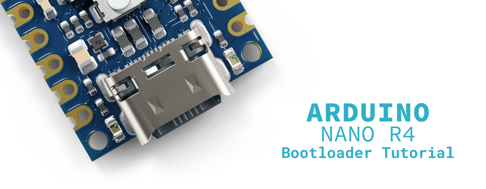

In certain situations, such as corrupted uploads, power interruptions during programming, or accidental bootloader damage, you may need to restore the bootloader on your Nano R4 board. This process, known as **bootloader flashing or recovery**, restores your board to its factory programming state, allowing it to communicate properly with the Arduino IDE again.

This tutorial will guide you through the complete process of flashing the bootloader on your Nano R4 board using the **Renesas Flash Programmer tool**, helping you recover a non-responsive board and restore its full functionality.

## Goals

- Learn how to prepare your Nano R4 board for bootloader flashing using the built-in `BOOT` pins
- Configure and use the Renesas Flash Programmer tool to flash the bootloader
- Verify successful bootloader installation and restore normal board operation

## Hardware and Software Requirements

### Hardware Requirements

- [Nano R4](https://store.arduino.cc/products/nano-r4) (x1)
- [USB-C® cable](https://store.arduino.cc/products/usb-cable2in1-type-c) (x1)
- [Breadboard](https://store.arduino.cc/products/breadboard-400-contacts) (x1) (recommended)
- Jumper wire or tweezers (x1) for shorting pins

### Software Requirements

- [Arduino IDE](https://www.arduino.cc/en/software/) or [Arduino Cloud Editor](https://create.arduino.cc/editor)
- [Arduino UNO R4 Boards core](https://github.com/arduino/ArduinoCore-renesas) (latest version)
- [Renesas Flash Programmer tool](https://www.renesas.com/en/software-tool/renesas-flash-programmer-programming-gui) (latest version)
- The bootloader file (`dfu_nano.hex`, see next section for download options)

***__Important note__: The Arduino IDE is NOT required for the bootloader flashing process itself, only for testing the board afterward.***

## Understanding Bootloader Recovery

The [bootloader](https://en.wikipedia.org/wiki/Bootloader) is essential firmware that runs when your Arduino board powers on or resets. It manages the critical first moments of startup, waiting briefly for new sketch uploads from the Arduino IDE before executing your uploaded program. Without a functional bootloader, your Nano R4 board cannot receive new sketches through the standard USB connection with the Arduino IDE.

Common scenarios requiring bootloader recovery include boards that are not recognized by the Arduino IDE despite proper driver installation, devices showing as unknown or malfunctioning in your computer's device manager, boards that stopped responding after a failed upload or power interruption, and situations where the onboard LEDs behave abnormally during connection attempts. Bootloader recovery is often the solution when standard troubleshooting steps like trying different cables or USB ports have failed.

The Nano R4 includes a special hardware feature that enables bootloader recovery: the `BOOT` pin. When this pin is connected to ground (`GND`) during power-up, the board enters a special programming mode that allows direct access to the microcontroller's flash memory, bypassing the potentially corrupted bootloader.

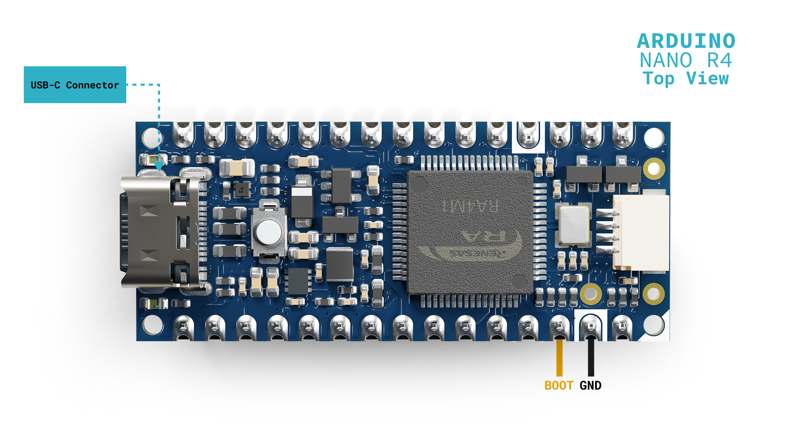

## Preparing for Bootloader Flashing

### Obtaining the Bootloader File

**Option 1: Direct Download (recommended)**

Download the bootloader file directly from the Arduino Renesas Core GitHub repository:

- [Download dfu_nano.hex](https://github.com/arduino/ArduinoCore-renesas/blob/main/bootloaders/NANOR4/dfu_nano.hex)

Click the "**Download raw file**" button and save it to a known location on your computer, as you will need it later in the Renesas Flash Programmer.

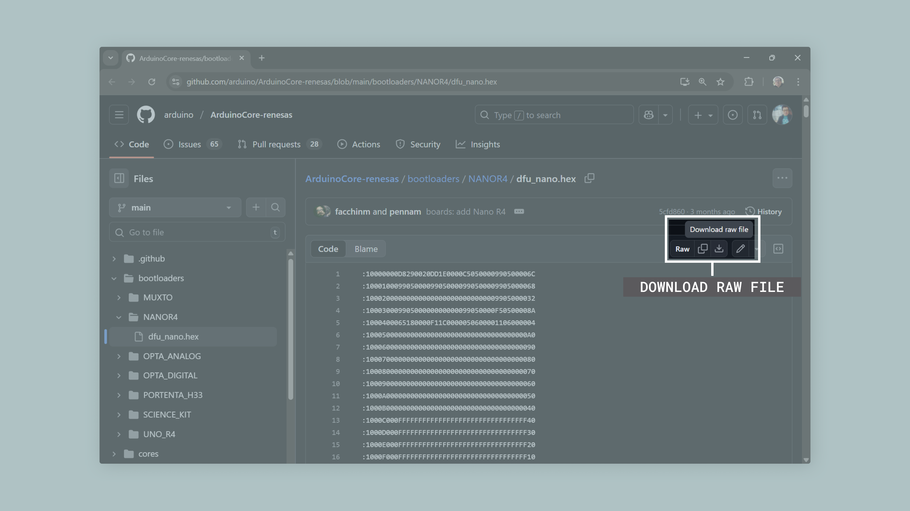

**Option 2: From Arduino IDE Installation (if already installed)**

The bootloader file (`dfu_nano.hex`) is automatically installed when you add the `Arduino UNO R4 Boards` core through the Arduino IDE's Boards Manager. To find this file on your system:

- **For Windows users:**

Navigate to the following directory:

```bash
C:\Users\[YourUsername]\AppData\Local\Arduino15\packages\arduino\hardware\renesas_uno\[version]\bootloaders\NANOR4\
```

- **For macOS users:**
  
Navigate to:

```bash
~/Library/Arduino15/packages/arduino/hardware/renesas_uno/[version]/bootloaders/NANOR4/
```

- **For Linux users**:

Navigate to:

```bash
~/.arduino15/packages/arduino/hardware/renesas_uno/[version]/bootloaders/NANOR4/
```

***__Important note__: Replace `[YourUsername]` with your actual username and `[version]` with the installed core version number (e.g., `1.2.0`). The `AppData` folder on Windows is hidden by default, you can access it by typing `%APPDATA%` in the File Explorer address bar.***

Copy the complete path to the `dfu_nano.hex` file, as you will need it later in the Renesas Flash Programmer.

### Installing the Renesas Flash Programmer Tools

The Renesas Flash Programmer is the official tool for programming Renesas microcontrollers at a low level. Before downloading the software, you will need to create a free Renesas account.

To install the Renesas Flash Programmer, first visit the [Renesas Flash Programmer download page](https://www.renesas.com/en/software-tool/renesas-flash-programmer-programming-gui). Navigate to the ""**Downloads**" section where you will see different versions available for various operating systems. Select the appropriate version for your system.

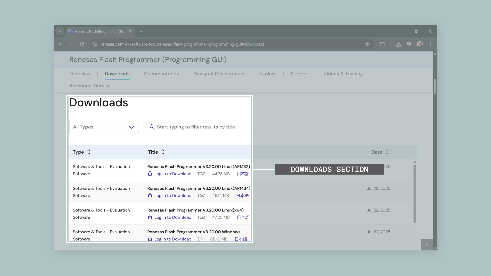

Click "**Log in to Download**" next to your selected version. If you do not have a Renesas account yet, you will see a "Register Now" option on the login page. Click it to create a new account. You will need to provide a valid email address and complete the registration process through the confirmation email you receive.

***__Important note__: The Renesas account is free and only requires email verification. Keep your login credentials handy as you may need them for future updates or accessing other Renesas development tools.***

Once registered and logged in, you will be redirected to the download page. Accept the license agreement if prompted, and the download will begin automatically. Once downloaded, run the installer and follow the installation wizard to complete the setup. For Windows users, you may need to run the installer as Administrator. After installation completes, launch the Renesas Flash Programmer to ensure it opens correctly.

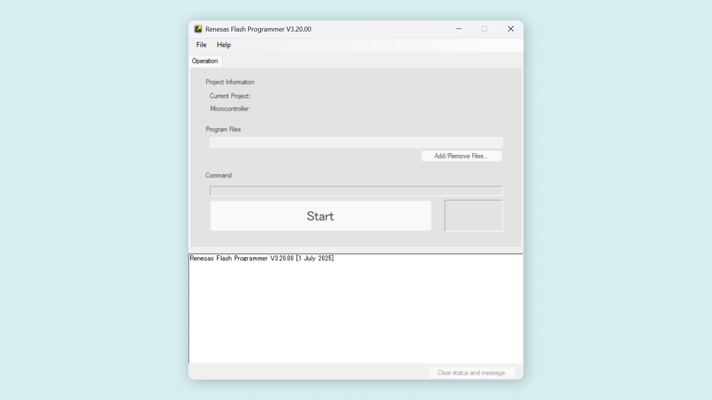

## Flashing the Bootloader

Now that you have located the bootloader file and installed the necessary software, you can proceed with the actual flashing process.

**Step 1: Prepare the Hardware Connection**

First, you need to put your Nano R4 board into bootloader programming mode. Locate the `BOOT` and `GND` pins on your Nano R4 board. These are clearly labeled on the bottom side of the board. Use a jumper wire or tweezers to create a connection between the `BOOT` and `GND` pins. This connection must remain in place during the initial connection to your computer.

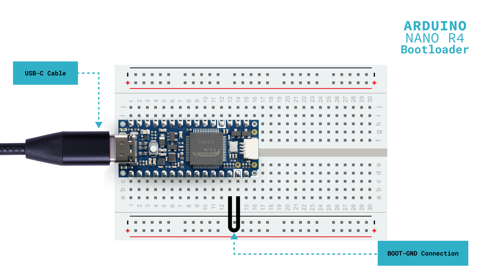

While maintaining the `BOOT-GND` connection, connect your Nano R4 board to your computer using the USB-C cable. Once connected, press the `RESET` button on the board once. The onboard orange LED should turn OFF, and only the green Power (PWR) LED should remain ON.

***__Important note__: The `BOOT-GND` connection must be maintained until after you click "Start" in the Renesas Flash Programmer tool. Removing it too early will prevent the board from entering programming mode.***

**Step 2: Configure Renesas Flash Programmer Tool**

With your board in programming mode, open the Renesas Flash Programmer tool if not already running. Click **File > New Project** to create a new project.

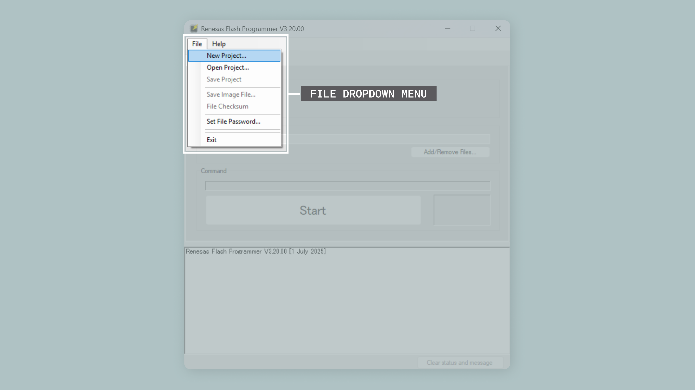

In the **Create New Project** dialog box, configure the following settings. For **Microcontroller**, select `RA`. For **Project Name**, enter a descriptive name such as `Nano_R4_Bootloader`. For **Project Folder**, select where to save the project file.

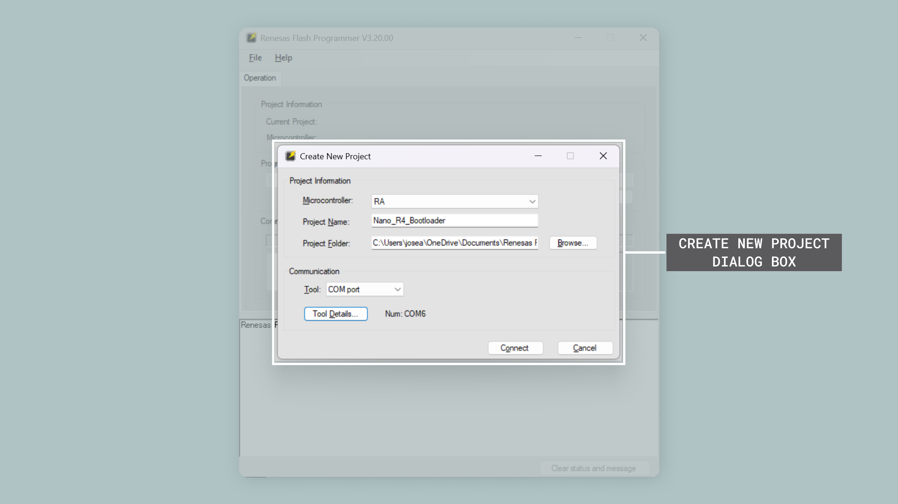

In the main window, configure the connection settings. For **Tool**, select "**COM Port**". The Tool Details section should automatically detect and display your board's COM port number.

**Step 3: Connect and Program**

Now you are ready to flash the bootloader. Click the Connect button in the Renesas Flash Programmer tool. If successful, you should see a green "**Operation completed**" in the output window. If the connection fails, verify the `BOOT-GND` connection and repeat from Step 1.

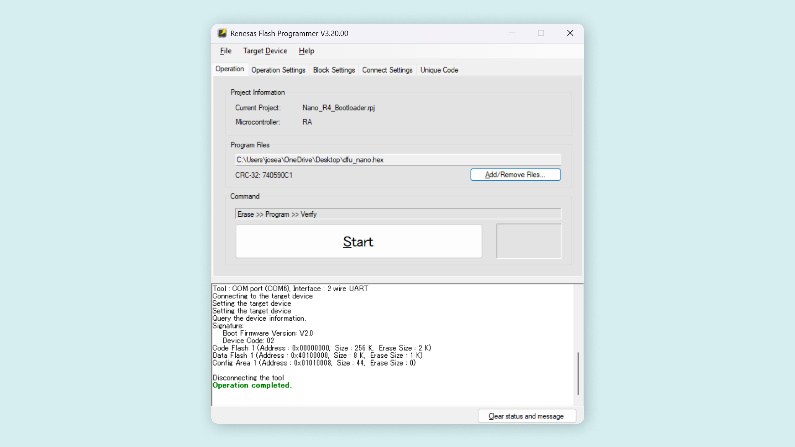

Once connected successfully, you can remove the jumper wire between `BOOT` and `GND`. Under the Operation tab, click the **Add/Remove Files...** button. In the dialog box that appears, click **Add File(s)..** and navigate to the location where you found the `dfu_nano.hex` file earlier. Select the file and click **Open** to add it to the list. Ensure the file is selected and click **OK** to close the dialog.

Click the **Start** button to begin flashing the bootloader. The progress bar will show the flashing progress. Wait for the green "**Operation completed**" message and a green box with an **OK** message.

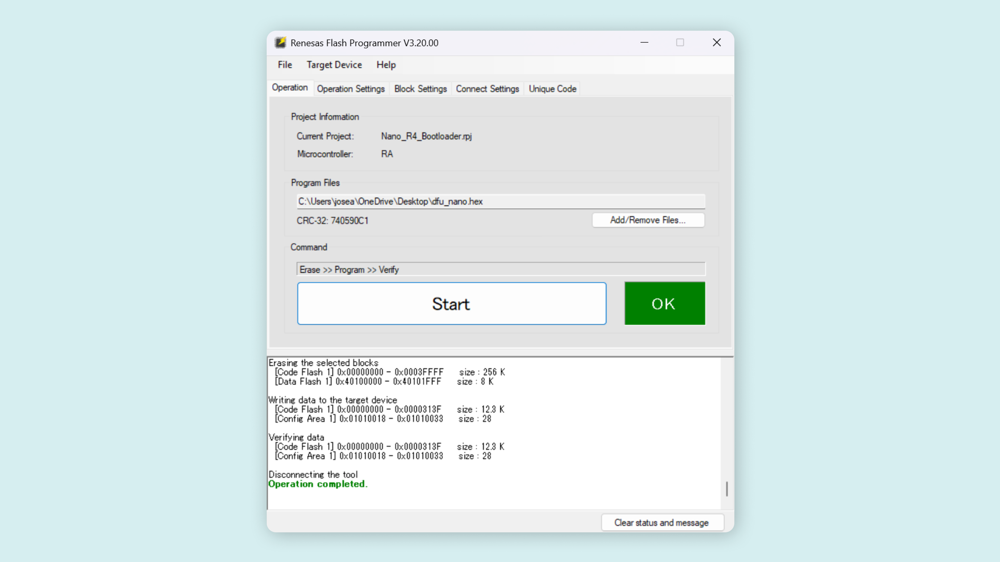

Once flashing is complete, close the Renesas Flash Programmer tool and press the `RESET` button on your Nano R4 board to restart it with the new bootloader.

## Verifying Successful Bootloader Installation

After flashing the bootloader, it is important to verify that your Nano R4 board is functioning correctly.

**Testing with the Blink Sketch**

Open the Arduino IDE and ensure the **Arduino UNO R4 Boards** core is installed via **Tools > Board > Boards Manager**. Select your board by navigating to **Tools > Board > Arduino UNO R4 Boards > Arduino Nano R4**. Select the correct port under **Tools > Port**. Your Nano R4 should now appear as "**Arduino Nano R4**".

Load the following `Blink` example sketch to test the bootloader:

```arduino
/**
Blink Example for the Arduino Nano R4 Board
Name: nano_r4_blink.ino
Purpose: This sketch demonstrates how to blink the built-in
user LED of the Arduino Nano R4 board.

@author Arduino Product Experience Team
@version 1.0 01/06/25
*/

// Built-in LED pin
#define LED_PIN LED_BUILTIN

void setup() {
  // Initialize serial communication and wait up to 2.5 seconds for a connection
  Serial.begin(115200);
  for (auto startNow = millis() + 2500; !Serial && millis() < startNow; delay(500));
  
  // Configure LED pin as output
  pinMode(LED_PIN, OUTPUT);
  
  // Startup message
  Serial.println("- Arduino Nano R4 - Blink Example started...");
}

void loop() {
  // Turn on the LED, wait 1 second
  digitalWrite(LED_PIN, HIGH);
  Serial.println("- LED on!");
  delay(1000);
  
  // Turn off the LED, wait 1 second
  digitalWrite(LED_PIN, LOW);
  Serial.println("- LED off!");
  delay(1000);  
}
```

To upload the sketch to the board, click the **Verify** button to compile the sketch and check for errors, then click the **Upload** button to program the device with the sketch.

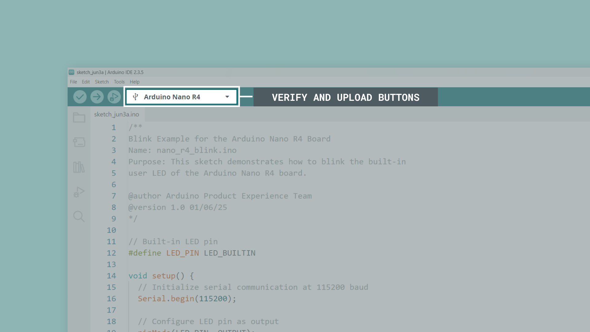

If the upload succeeds and the orange LED starts blinking, your bootloader has been successfully restored!

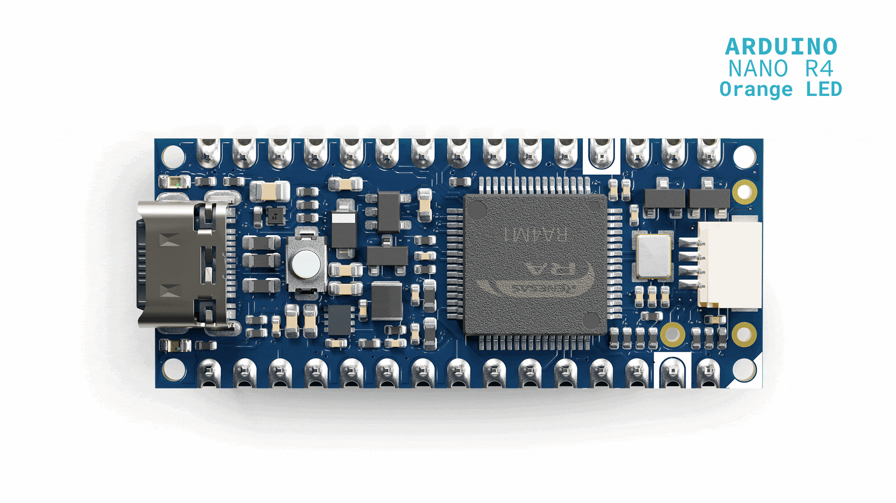

## Quick Verification

After flashing, your board should:

- ✅ Show up as "**Arduino Nano R4**" in your computer's device manager
- ✅ Have only the green PWR LED lit when idle
- ✅ Successfully upload and run the `Blink` sketch (if testing with Arduino IDE)

If any of these checks fail, see the Troubleshooting section below.

## Troubleshooting Common Issues

If you encounter problems during the bootloader flashing process, here are common issues and solutions:

|                    **Issue**                   |           **Possible Cause**          |                          **Solution**                         |
|:----------------------------------------------:|:-------------------------------------:|:-------------------------------------------------------------:|
| Board not detected in Renesas Flash Programmer | BOOT-GND connection not properly made |    Ensure a solid connection between `BOOT` and `GND` pins    |
|            "Connection failed" error           |     Board not in programming mode     |      Press RESET after connecting with `BOOT-GND` shorted     |
|             Wrong COM port selected            |       Multiple devices connected      |           Disconnect other Arduino boards and retry           |
|            Bootloader file not found           |       Arduino core not installed      | Install Arduino UNO R4 Boards core via the IDE Boards Manager |
|           Upload fails after flashing          |       Incorrect board selection       |             Select "Arduino Nano R4" in Tools menu            |

***If problems persist after trying these solutions, the board may have hardware damage. Contact [Arduino Support](https://www.arduino.cc/en/contact-us/) for further assistance.***

## Conclusion

In this tutorial, we successfully walked through the complete process of recovering and flashing the bootloader on a Nano R4 board. We learned how to locate the bootloader file within the Arduino core installation, configure the Renesas Flash Programmer tool, put the Nano R4 board into programming mode using the `BOOT` pin, and verify successful bootloader installation.

The ability to restore the bootloader is an essential skill for any Arduino developer, as it allows you to recover boards that would otherwise appear non-functional. With this knowledge, you can troubleshoot and restore Nano R4 boards that have encountered programming issues or bootloader corruption.

## Next Steps

Now that you have successfully restored your Nano R4's bootloader and verified its functionality, you can explore the full capabilities of this powerful board. Check out the [Nano R4 User Manual](https://docs.arduino.cc/tutorials/nano-r4/user-manual/) to learn about its advanced features including the DAC, CAN bus, operational amplifiers, and HID capabilities.

For more advanced projects and examples specifically designed for the Nano R4, visit the [Arduino Project Hub](https://projecthub.arduino.cc/). You might also want to explore the [Arduino Forum's Nano R4 section](https://forum.arduino.cc/c/official-hardware/nano-family/nano-r4/221) to connect with other users and share your experiences with bootloader recovery and board restoration.