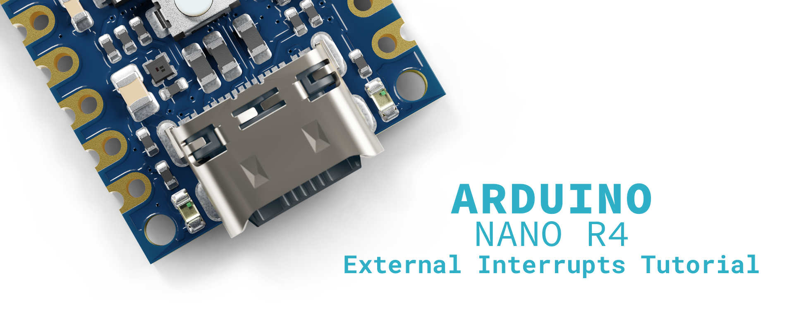
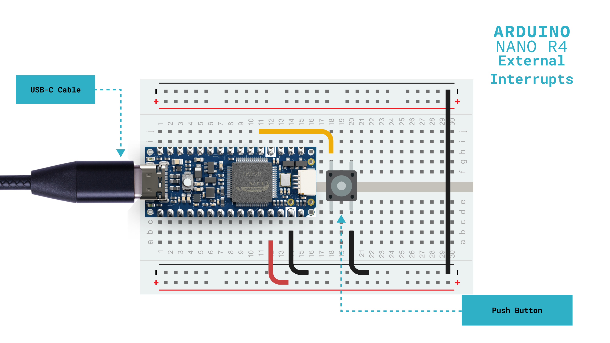
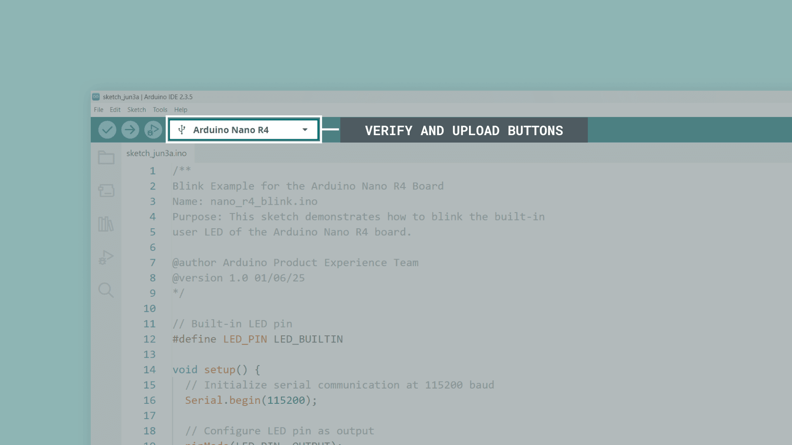
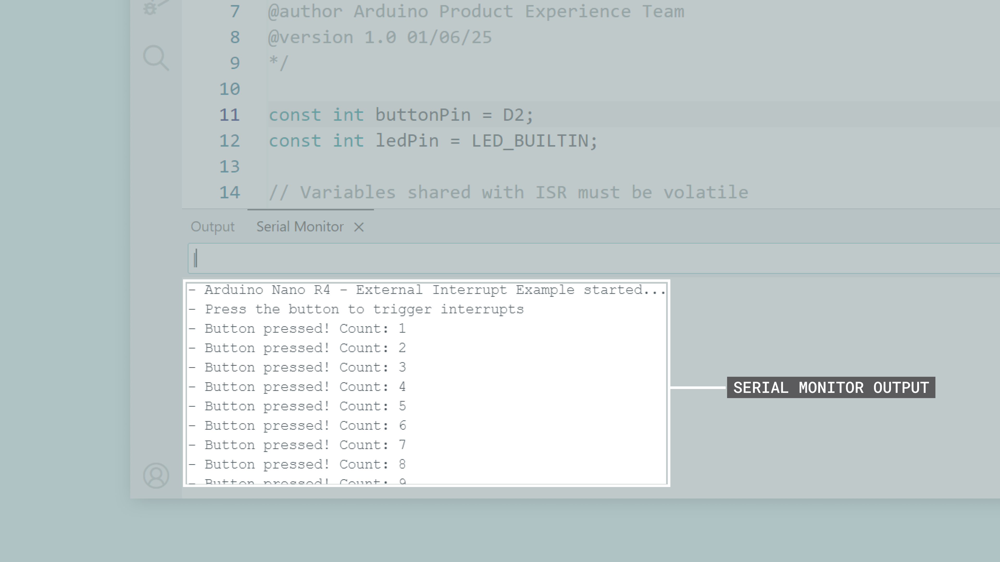
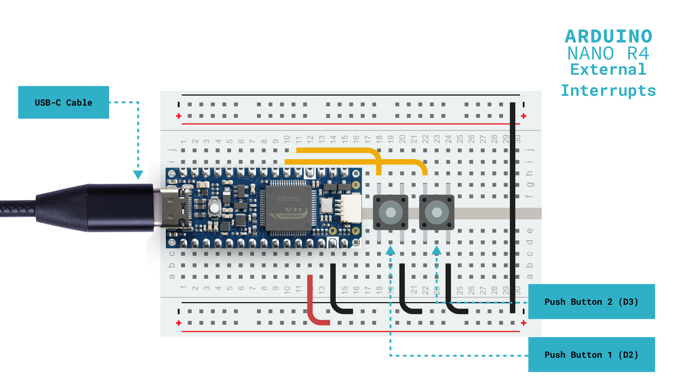
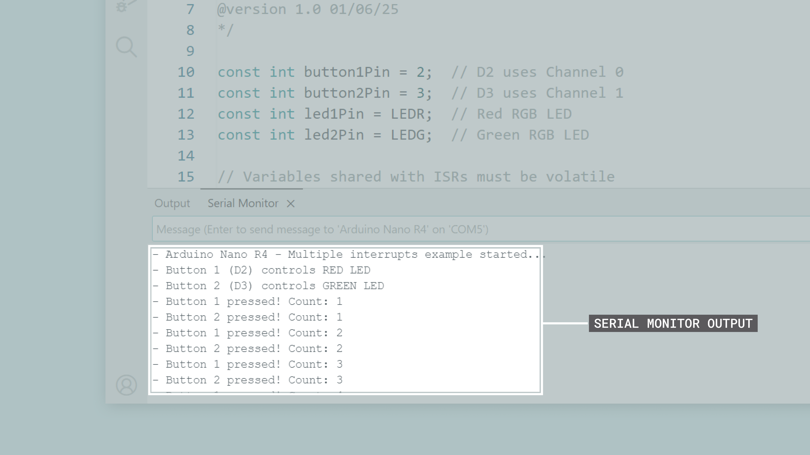

## Overview

External interrupts are one of the most powerful features of microcontrollers, allowing your Nano R4 board to instantly respond to external events. Instead of continuously checking (known as polling) if something happened, interrupts let your board react immediately when an event occurs, making your projects more efficient and responsive.



In this tutorial, you will learn how to use external interrupts on the Nano R4 board, understand channel limitations, implement proper interrupt handling techniques, and create responsive applications that react to real-world events.

## Goals

- Understand how interrupts work and when to use them
- Configure external interrupts on available pins
- Handle shared interrupt channels correctly
- Implement proper ISR (Interrupt Service Routine) coding practices

## Hardware and Software Requirements

### Hardware Requirements

- [Nano R4](https://store.arduino.cc/products/nano-r4) (x1)
- [USB-C® cable](https://store.arduino.cc/products/usb-cable2in1-type-c) (x1)
- [Breadboard](https://store.arduino.cc/products/breadboard-400-contacts) (x1) (recommended)
- Push button (x2)
- 10 kΩ resistor (x2) (optional, can use internal pull-ups)
- LED (x2) (optional, can use built-in orange and RGB LEDs)
- Jumper wires

### Software Requirements

- [Arduino IDE](https://www.arduino.cc/en/software/) or [Arduino Cloud Editor](https://create.arduino.cc/editor)
- [Arduino UNO R4 Boards core](https://github.com/arduino/ArduinoCore-renesas) (latest version)

## Understanding Interrupts

### What Are Interrupts?

An **interrupt** is **a hardware mechanism that allows external events to pause your program's normal execution and run a special function immediately**. Think of it like a phone ringing while you are reading; you stop reading, answer the call, then return to where you left off.


The key advantage is that your program does not waste time constantly checking if something happened. Instead, the hardware monitors the pins for you and only interrupts when necessary, making your code both more efficient and more responsive.

The interrupt process follows these steps:

1. An external event occurs (button press, sensor trigger, etc.)
2. The processor saves its current state
3. A special function called an Interrupt Service Routine (ISR) executes
4. The processor restores its state and continues where it left off

This entire sequence completes in just a few microseconds. It's so fast that your main program appears to run continuously while still catching every event. It is this speed that makes interrupts perfect for capturing brief signals that would otherwise be missed.


### When to Use Interrupts

Interrupts are ideal in situations where timing matters or where constantly checking would waste processor cycles. Here are the ideal scenarios:

- **Time-critical events**: Capturing fast pulses or edges that last only microseconds. For example, reading a hall effect sensor in a motor spinning at high RPM.
- **User inputs**: Responding immediately to button presses without the delay that comes from checking the button state in a busy loop. This ensures responsive user interfaces even when the processor is handling other tasks.
- **Sensor events**: Detecting threshold crossings, limit switches, or alarm conditions that require immediate attention. A water level sensor triggering an overflow alarm cannot wait for the next loop iteration.

- **Communication**: Handling incoming data packets on protocols like I2C or SPI where timing windows are strict and data could be lost if not read quickly.
- **Counting**: Tallying pulses from rotary encoders, flow meters, or frequency counters where missing even one pulse would compromise accuracy.

***__Important note__: Avoid using interrupts for operations that are inherently slow, such as analog readings (ADC conversion takes time), complex mathematical calculations, or serial printing. These belong in your main loop where timing is less critical.***

### Polling vs Interrupts

To understand the value of interrupts, let's compare them with the traditional polling approach using a practical example: detecting a button press.

#### Polling Approach

With polling, your program must continuously check the button state in each loop cycle. This consumes processor cycles even when nothing is happening and can miss fast events if the program is busy with other tasks.

```arduino
// Polling approach - constantly checking
void loop() {
  // Check button state every loop iteration
  if (digitalRead(buttonPin) == LOW) {
    handleButtonPress();
  }
  
  // Other tasks that take time
  readSensors();        // Takes 20ms
  updateDisplay();      // Takes 30ms
  processData();        // Takes 15ms
  // Total loop time: 65ms+ means button must be held for at least that long
}
```

The problem becomes clear when you consider timing. If your loop takes 65 milliseconds to complete, a quick button tap of 30 milliseconds would be missed entirely. Even worse, the processor wastes energy checking the button thousands of times when it is not being pressed.


#### Interrupt Approach

With interrupts, the hardware monitors the pin continuously while your program focuses on other tasks. When the button is pressed, the ISR executes immediately, regardless of what the main program is doing.

```arduino
void setup() {
  // Configure interrupt once during setup
  attachInterrupt(digitalPinToInterrupt(buttonPin), buttonISR, FALLING);
}

void buttonISR() {
  // This runs immediately when button pressed
  buttonPressed = true;  // Just set a flag
}

void loop() {
  // Main program never needs to check the pin
  readSensors();        // Takes 20ms
  updateDisplay();      // Takes 30ms  
  processData();        // Takes 15ms
  // Button press detected instantly at any point, even during these tasks
  
  if (buttonPressed) {
    buttonPressed = false;
    handleButtonPress();  // Process the button event
  }
}
```

The interrupt approach guarantees detection of even the briefest button press (microseconds) while freeing the processor from constant checking. The hardware does the monitoring, your code does the processing — a perfect division of labor.

#### Key Differences

The choice between polling and interrupts often comes down to your application's requirements. Polling is simpler to debug and understand, making it suitable for non-critical applications where occasional missed events are acceptable. Interrupts provide guaranteed response times and better efficiency, essential for time-critical applications or battery-powered devices where every processor cycle counts.

Consider a real-world example: a bike computer counting wheel rotations. With polling, at high speeds you might miss rotations, giving inaccurate speed readings. With interrupts, every single rotation is captured perfectly, no matter how fast the wheel spins or what else the processor is calculating.

### Nano R4 Interrupt Architecture

The Nano R4 board provides **13 pins** with interrupt capability across **9 hardware channels**. This channel-sharing architecture is a critical limitation you must understand to avoid frustrating bugs in your projects.

| **Arduino Pin** | **Interrupt Channel** | **Primary Function** |          **Notes**         |
|:---------------:|:---------------------:|:--------------------:|:--------------------------:|
|       `D0`      |       Channel 6       |      Digital I/O     |  Shares channel with `A1`  |
|       `D1`      |       Channel 5       |      Digital I/O     |      Dedicated channel     |
|       `D2`      |       Channel 0       |      Digital I/O     | Recommended for interrupts |
|       `D3`      |       Channel 1       |   Digital I/O, PWM   |  Shares channel with `A4`  |
|       `D8`      |       Channel 9       |      Digital I/O     |      Dedicated channel     |
|      `D12`      |       Channel 3       |   Digital I/O, MISO  |  Shares channel with `A6`  |
|      `D13`      |       Channel 4       |   Digital I/O, SCK   |      Dedicated channel     |
|       `A1`      |       Channel 6       |    Analog, OPAMP+    |  Shares channel with `D0`  |
|       `A2`      |       Channel 7       |    Analog, OPAMP-    |      Dedicated channel     |
|       `A3`      |       Channel 2       |   Analog, OPAMP OUT  |  Shares channel with `A5`  |
|       `A4`      |       Channel 1       |    Analog, I²C SDA   |  Shares channel with `D3`  |
|       `A5`      |       Channel 2       |    Analog, I²C SCL   |  Shares channel with `A3`  |
|       `A6`      |       Channel 3       |     Analog input     |  Shares channel with `D12` |

***__Important note__: Pins sharing the same interrupt channel cannot be used for interrupts simultaneously. For example, `D3` and `A4` both use channel 1, so only one can be configured for interrupt functionality at a time.***

This channel sharing creates a critical issue that often catches developers by surprise. When you attach an interrupt to a second pin that shares the same channel, it silently overwrites the first interrupt with no error or warning:

```arduino
attachInterrupt(digitalPinToInterrupt(3), buttonISR, FALLING);
attachInterrupt(digitalPinToInterrupt(A4), sensorISR, FALLING);
```

In the code snippet shown before, both `D3` and `A4` use Channel 1. When the second `attachInterrupt()` executes, it disconnects `buttonISR` completely. Only `sensorISR` will function, and your button will stop responding with no indication of why.

#### Interrupt Trigger Modes

The Nano R4 board supports four trigger modes that determine when your ISR executes, as shown in the table below:

|  **Mode** |         **Trigger Condition**        |        **Typical Use Cases**       |
|:---------:|:------------------------------------:|:----------------------------------:|
|  `RISING` | Pin transitions from `LOW` to `HIGH` | Button press detection (pull-down) |
| `FALLING` | Pin transitions from `HIGH` to `LOW` |  Button press detection (pull-up)  |
|  `CHANGE` | Pin changes state (either direction) |   Encoder reading, pulse counting  |
|   `LOW`   |      Pin remains at `LOW` level      |       Level-triggered events       |

***__Important note__: The `HIGH` trigger mode is not supported by the hardware. If specified, it will behave as `RISING` mode (detecting only the `LOW`-to-`HIGH` transition, not the continuous `HIGH` state). For continuous `HIGH` level detection, use polling with `digitalRead()` instead.***


This hardware limitation becomes apparent when you try to use `HIGH` mode:

```arduino
attachInterrupt(digitalPinToInterrupt(2), wakeISR, HIGH);
```

This code will not continuously trigger while the pin is `HIGH` as you might expect. Instead, it will only trigger once when the pin transitions from `LOW` to `HIGH`, behaving identically to `RISING` mode. If you need to detect a continuous `HIGH` state, you must use polling in your main loop.  

## Basic Interrupt Implementation

Let's start with a simple example that toggles an LED when a button is pressed. This example demonstrates the fundamental concepts of interrupt programming: using volatile variables, keeping ISRs short, and processing events in the main loop.

Before we begin, ensure your Arduino IDE is properly configured for the Nano R4 board. Open the Arduino IDE and verify that the Arduino UNO R4 Boards core is installed via **Tools > Board > Boards Manager**. Select your board by navigating to **Tools > Board > Arduino UNO R4 Boards > Arduino Nano R4**, then select the correct port under **Tools > Port**.

Load the following example sketch to your Nano R4 board:

```arduino
/**
Basic Interrupt Example for the Arduino Nano R4 Board
Name: nano_r4_interrupt_basic.ino
Purpose: Toggles LED when button pressed using interrupts


@author Arduino Product Experience Team
@version 1.0 01/06/25
*/

const int buttonPin = 2;  // D2 has dedicated interrupt channel
const int ledPin = LED_BUILTIN;

// Variables shared with ISR must be volatile
volatile bool toggleLED = false;

// Interrupt Service Routine - executes when button pressed
void buttonPressed() {
  toggleLED = true;
}

void setup() {
  // Initialize serial communication and wait up to 2.5 seconds for a connection
  Serial.begin(115200);
  for (auto startNow = millis() + 2500; !Serial && millis() < startNow; delay(500));
  
  pinMode(buttonPin, INPUT_PULLUP);
  pinMode(ledPin, OUTPUT);
  
  // Attach interrupt to button pin
  // FALLING = HIGH to LOW transition (button press with pull-up)
  attachInterrupt(digitalPinToInterrupt(buttonPin), buttonPressed, FALLING);
  
  Serial.println("- Arduino Nano R4 - Basic interrupt example started...");
  Serial.println("- Press button to toggle LED");
}

void loop() {
  // Check flag set by ISR
  if (toggleLED) {
    toggleLED = false;
    digitalWrite(ledPin, !digitalRead(ledPin));
    Serial.println("- LED toggled!");
  }
  
  // Main loop continues running other tasks
  delay(100);
}
```

To test this example, connect a push button to the Nano R4 board as follows:

- Connect one leg of a push button to pin `D2`
- Connect the other leg of the push button to `GND`
- No external components needed (using built-in LED and internal pull-up)



To upload the sketch to the board, click the **Verify** button to compile the sketch and check for errors, then click the **Upload** button to program the device with the sketch.



Open the Arduino IDE's Serial Monitor (Tools > Serial Monitor) to see the interrupt count increase with each button press. You should also see the built-in orange user LED of your Nano R4 board turn on when the button is pressed.



This example illustrates three important concepts in interrupt programming:

1. **The `volatile` keyword**: The `toggleLED` variable is declared as `volatile` because it is shared between the ISR and the main loop. Without this keyword, the compiler might optimize the code in ways that prevent the main loop from seeing changes made by the ISR. This is a common source of bugs where interrupts seem to "not work" when actually the variable updates are being cached.
2. **Minimal ISR design**: `The buttonPressed()` function does only one thing, sets a flag. It does not toggle the LED directly, does not call `Serial.print()`, and does not perform any time-consuming operations. This is intentional; ISRs should execute in microseconds, not milliseconds. By just setting a flag, we ensure the interrupt system remains responsive.
3. **Flag processing in the main loop**: The actual LED toggling happens in the main loop when it detects the flag has been set. This pattern is the gold standard for interrupt programming. It keeps interrupts fast while allowing complex processing to happen safely in the main code.

## Handling Multiple Interrupts

When using multiple interrupts, be aware of channel conflicts. This example demonstrates using two buttons on different interrupt channels to control different LEDs independently.

Load the following example sketch to your Nano R4 board:

```arduino
/**
Multiple Interrupts Example for the Arduino Nano R4 Board
Name: nano_r4_interrupt_multiple.ino
Purpose: Demonstrates using two interrupt sources on different channels

@author Arduino Product Experience Team
@version 1.0 01/06/25
*/

const int button1Pin = 2;  // D2 uses Channel 0
const int button2Pin = 3;  // D3 uses Channel 1
const int led1Pin = LEDR;  // Red RGB LED
const int led2Pin = LEDG;  // Green RGB LED

// Variables shared with ISRs must be volatile
volatile bool button1Flag = false;
volatile bool button2Flag = false;
volatile unsigned long button1Count = 0;
volatile unsigned long button2Count = 0;

// ISR for button 1
void button1ISR() {
  button1Flag = true;
  button1Count++;
}

// ISR for button 2
void button2ISR() {
  button2Flag = true;
  button2Count++;
}

void setup() {
  // Initialize serial communication and wait up to 2.5 seconds for a connection
  Serial.begin(115200);
  for (auto startNow = millis() + 2500; !Serial && millis() < startNow; delay(500));
  
  // Configure pins
  pinMode(button1Pin, INPUT_PULLUP);
  pinMode(button2Pin, INPUT_PULLUP);
  pinMode(led1Pin, OUTPUT);
  pinMode(led2Pin, OUTPUT);
  
  // RGB LEDs are active LOW - turn them off initially
  digitalWrite(led1Pin, HIGH);
  digitalWrite(led2Pin, HIGH);
  
  // Attach interrupts to different channels
  attachInterrupt(digitalPinToInterrupt(button1Pin), button1ISR, FALLING);
  attachInterrupt(digitalPinToInterrupt(button2Pin), button2ISR, FALLING);
  
  Serial.println("- Arduino Nano R4 - Multiple interrupts example started...");
  Serial.println("- Button 1 (D2) controls RED LED");
  Serial.println("- Button 2 (D3) controls GREEN LED");
}

void loop() {
  // Process button 1 flag
  if (button1Flag) {
    button1Flag = false;
    digitalWrite(led1Pin, !digitalRead(led1Pin));
    Serial.print("- Button 1 pressed! Count: ");
    Serial.println(button1Count);
  }
  
  // Process button 2 flag
  if (button2Flag) {
    button2Flag = false;
    digitalWrite(led2Pin, !digitalRead(led2Pin));
    Serial.print("- Button 2 pressed! Count: ");
    Serial.println(button2Count);
  }
  
  delay(10);
}
```

To test this example, connect a push button to the Nano R4 board as follows:

- Connect one leg of the first push button to pin `D2`, and its other leg to `GND`
- Connect one leg of the second push button to pin `D3`, and its other leg to `GND`
- No external components needed (using built-in RGB LED and internal pull-ups)



To upload the sketch to the board, click the **Verify** button to compile the sketch and check for errors, then click the **Upload** button to program the device with the sketch.


Open the Arduino IDE's Serial Monitor (Tools > Serial Monitor) to see the interrupt count increase with each of the button presses.



Notice also the following: 

- Button 1 (`D2`) toggles the red LED and displays its count
- Button 2 (`D3`) toggles the green LED and displays its count
- Each button works independently without interfering with the other

This example demonstrates several key concepts when working with multiple interrupts:

1. **Channel independence**: `D2` uses Channel 0 and `D3` uses Channel 1, so both interrupts can work simultaneously without conflict. If we had used `D3` and `A4` (both Channel 1), only the last attached interrupt would function.
2. **Separate ISRs and flags**: Each interrupt has its own ISR (`button1ISR` and `button2ISR`) and its own flag variable. This keeps the interrupt handling clean and prevents cross-contamination between events.
3. **RGB LED control**: The Nano R4's RGB LEDs are active-low, meaning `LOW` turns them on and `HIGH` turns them off. This is opposite to the built-in orange LED, which is why we initialize them to `HIGH` in setup.
4. **Counter variables**: Each ISR increments its own counter, demonstrating that ISRs can safely modify multiple volatile variables. These counters help verify that no interrupts are being missed, even when both buttons are pressed rapidly.

## Best Practices 

### ISR Design Rules

Writing effective Interrupt Service Routines requires discipline. These guidelines will help you avoid the most common pitfalls:

- **Keep ISRs extremely short**. Your ISR should execute in microseconds, not milliseconds. The golden rule is to do the absolute minimum work necessary (typically just setting a flag or incrementing a counter). Complex operations belong in your main loop where they do not block other interrupts.
- **Always use `volatile` for shared variables**. Any variable modified in an ISR and read in your main code (or vice versa) must be declared `volatile`. This prevents the compiler from caching the variable in a register where changes would not be visible between the ISR and main code.

- **Never call blocking functions**: Functions like `delay()`, `Serial.print()`, `millis()`, or anything that waits for hardware are forbidden in ISRs. These functions often rely on interrupts themselves and calling them from an ISR can cause deadlocks or crashes.
- **Protect multi-byte shared data**. When your main code needs to read a multi-byte variable that an ISR modifies (like `long` or `float`), you must temporarily disable interrupts to prevent the value from changing mid-read. 

Here is how to safely read a multi-byte variable that is modified by an ISR:

```arduino
// Reading a 4-byte counter safely
volatile unsigned long pulseCount = 0;

void countISR() {
  pulseCount++;  // ISR modifies this
}

void loop() {
  // Wrong way - could read corrupted value
  unsigned long count = pulseCount;  // Dangerous!
  
  // Right way - atomic read
  noInterrupts();
  unsigned long count = pulseCount;  // Safe
  interrupts();
  
  // Now use 'count' for calculations
}
```
### Common Mistakes to Avoid

Even experienced developers fall into these traps when working with interrupts. Understanding these common mistakes will save you hours of debugging:

- **Channel conflicts on the Nano R4 board**: The most frustrating error is when interrupts mysteriously stop working because you have accidentally used two pins on the same channel. The second attachment silently overwrites the first with no warning:


```arduino
// This creates a silent failure, no error message!
attachInterrupt(digitalPinToInterrupt(3), button1ISR, FALLING);   // D3 uses Channel 1
attachInterrupt(digitalPinToInterrupt(A4), button2ISR, FALLING);  // A4 also Channel 1
// Result: button1ISR stops working, only button2ISR functions
```

- **Doing too much in the ISR**. It is tempting to process data right in the ISR, but this blocks other interrupts and can break timing-sensitive functions. Here is a comparison of wrong and right approaches:

```arduino
// BAD (this ISR takes milliseconds to execute)
void badISR() {
  float voltage = analogRead(A0) * 5.0 / 1023.0;  // ADC takes ~100μs
  Serial.print("Voltage: ");                       // Serial takes ~1ms
  Serial.println(voltage);                         // More serial delay
}

// GOOD (this ISR takes microseconds)
volatile bool readVoltage = false;
void goodISR() {
  readVoltage = true;  // Set flag, exit immediately
}

void loop() {
  if (readVoltage) {
    readVoltage = false;
    float voltage = analogRead(A0) * 5.0 / 1023.0;
    Serial.print("Voltage: ");
    Serial.println(voltage);
  }
}
```

### Troubleshooting Guide

When interrupts do not work as expected, these are the most common culprits and their solutions:

|             **Problem**            |               **Likely Cause**               |                                                                      **Solution**                                                                      |
|:----------------------------------:|:--------------------------------------------:|:------------------------------------------------------------------------------------------------------------------------------------------------------:|
|      Interrupt never triggers      | Wrong pin selected or incorrect trigger mode | Verify pin has interrupt capability (see architecture table), ensure trigger mode matches your circuit (`FALLING` for pull-up, `RISING` for pull-down) |
| Multiple triggers per button press |    Switch bounce from mechanical contacts    |                                     Add hardware debouncing (capacitor) or software debouncing (time check in ISR)                                     |
|    Some interrupts stop working    |          Channel conflict on Nano R4         |                                     Check if pins share the same interrupt channel, use pins on different channels                                     |
|       Variables not updating       |           Missing volatile keyword           |                                                      Declare all ISR-shared variables as volatile                                                      |
|     Program crashes or freezes     |        Blocking function called in ISR       |                                         Remove all `delay()`, `Serial.print()`, and similar functions from ISR                                         |
|      Incorrect counter values      |    Race condition on multi-byte variables    |                                           Use `noInterrupts()`/`interrupts()` when reading multi-byte values                                           |

## Conclusions

External interrupts on the Nano R4 board provide powerful event-driven capabilities for your projects. By understanding the channel limitations, following best practices for ISR implementation, and avoiding common pitfalls, you can build responsive applications that react instantly to real-world events. Remember: keep ISRs minimal, use `volatile` for shared variables, and carefully manage the 9 shared interrupt channels among the 13 available pins in the Nano R4 board.

## Next Steps

Now that you understand interrupts on the Nano R4 board, consider building practical applications, such as tachometers, frequency counters, or power-efficient sensors that wake from sleep mode. Interrupts integrate seamlessly with other Nano R4 features, such as the CAN bus for automotive projects or the DAC for triggered analog outputs. Check out the [Nano R4 User Manual](https://docs.arduino.cc/tutorials/nano-r4/user-manual/) to learn about its advanced features, including the DAC, CAN bus, operational amplifiers, and HID capabilities.


For more advanced projects and examples specifically designed for the Nano R4, visit the [Arduino Project Hub](https://projecthub.arduino.cc/). You might also want to explore the [Arduino Forum's Nano R4 section](https://forum.arduino.cc/c/official-hardware/nano-family/nano-r4/221) to connect with other users and share your experiences with external interrupts.