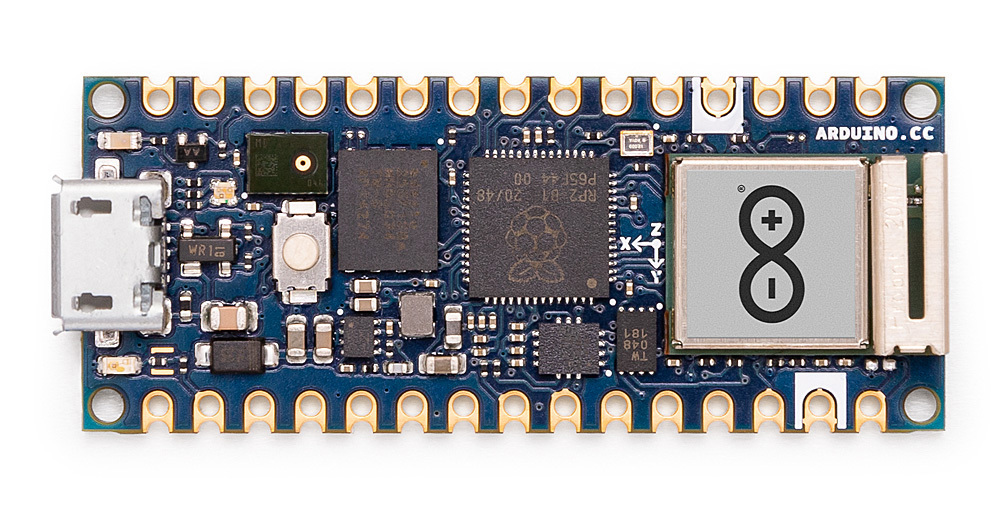
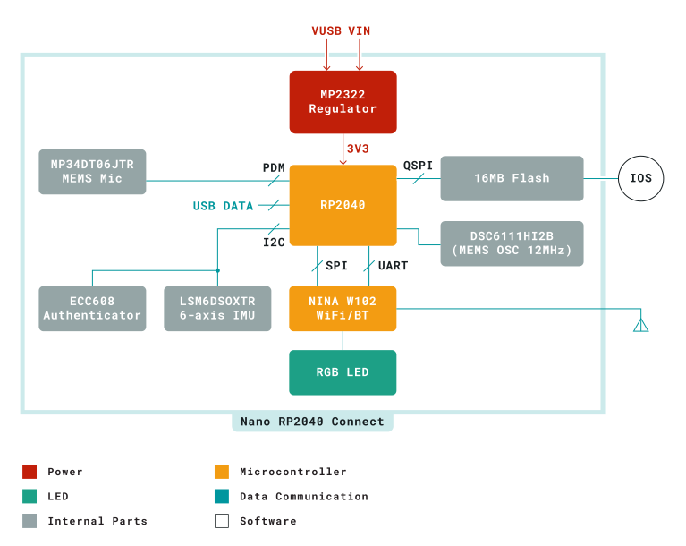
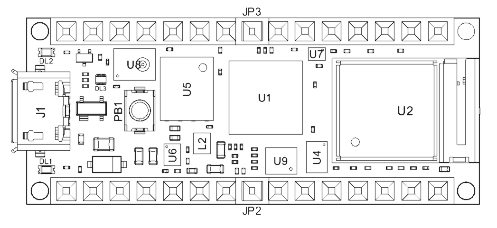
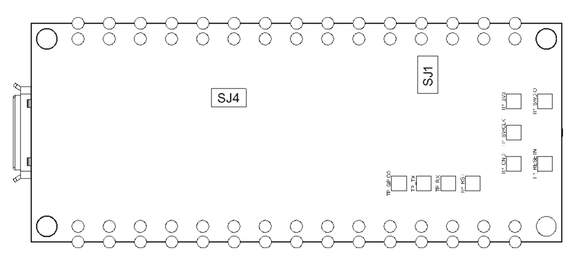
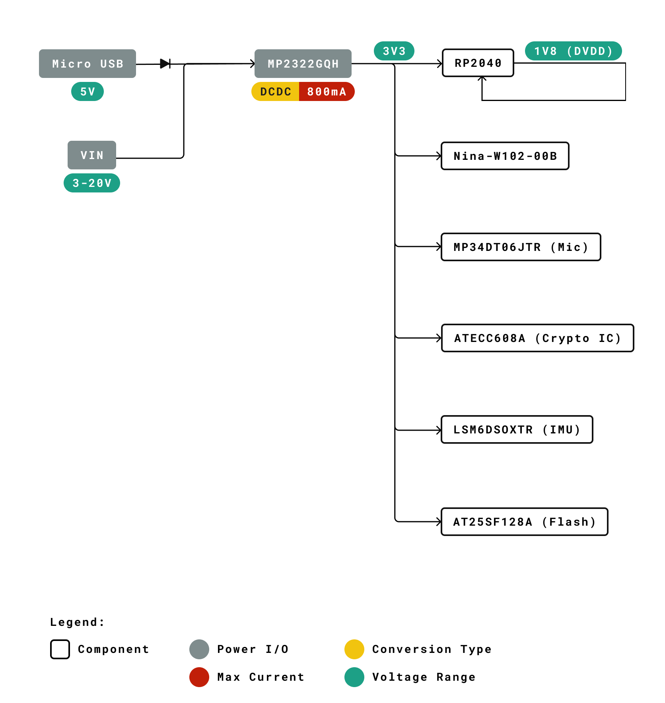
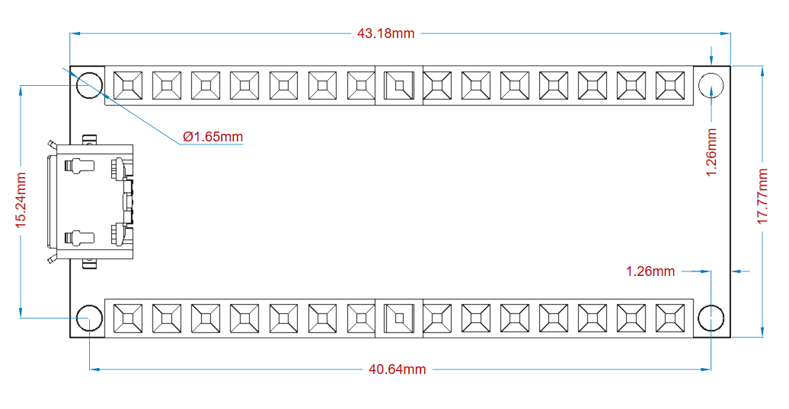

# Description

The feature packed **Arduino® Nano RP2040 Connect** brings the new **Raspberry Pi RP2040** microcontroller to the Nano form factor. Make the most of the dual core **32-bit Arm® Cortex®-M0+** to make Internet of Things projects with Bluetooth®  and Wi-Fi connectivity thanks to the **U-blox® Nina W102** module. Dive into real-world projects with the onboard accelerometer, gyroscope, RGB LED and microphone. Develop robust embedded AI solutions with minimal effort using the **Arduino® Nano RP2040 Connect**!

# Target Areas 
Internet of Things (IoT), machine learning, prototyping,

# Features
- **Raspberry Pi RP2040** Microcontroller
  - 133MHz 32bit Dual Core Arm® Cortex®-M0+
  - 264kB on-chip SRAM
  - Direct Memory Access (DMA) controller
  - Support for up to 16MB of off-chip Flash memory via dedicated QSPI bus
  - USB 1.1 controller and PHY, with host and device support
  - 8 PIO state machines
  - Programmable IO (PIO) for extended peripheral support
  - 4 channel ADC with internal temperature sensor, 0.5 MSa/s, 12-bit conversion
  - SWD Debugging
  - 2 on-chip PLLs to generate USB and core clock
  - 40nm process node
  - Multiple low power mode support
  - USB 1.1 Host/Device
  - Internal Voltage Regulator to supply the core voltage
  - Advanced High-performance Bus (AHB)/Advanced Peripheral Bus (APB)
- **U-blox® Nina W102** Wi-Fi/Bluetooth®  Module
  - 240MHz 32bit Dual Core Xtensa LX6
  - 520kB on-chip SRAM
  - 448 Kbyte ROM for booting and core functions
  - 16 Mbit FLASH for code storage including hardware encryption to protect programs and data
  -  1 kbit EFUSE (non- erasable memory) for MAC addresses, module configuration, Flash-Encryption, and Chip-ID
  - IEEE 802.11b/g/n single-band 2.4 GHz Wi-Fi operation
  - Bluetooth®  4.2
  - Integrated Planar Inverted-F Antenna (PIFA)
  - 4x 12-bit ADC
  - 3x I2C, SDIO, CAN, QSPI
- **Memory**
  - AT25SF128A 16MB NOR Flash
  - QSPI data transfer rate up to 532Mbps
  - 100K program/erase cycles
- **ST LSM6DSOXTR** 6-axis IMU
  - 3D Gyroscope
    - ±2/±4/±8/±16 g full scale
  - 3D Accelerometer
    - ±125/±250/±500/±1000/±2000 dps full scale
  - Advanced pedometer, step detector and step counter
  - Significant Motion Detection, Tilt detection
  - Standard interrupts: free-fall, wake-up, 6D/4D orientation, click and double-click
  - Programmable finite state machine: accelerometer, gyroscope and external sensors
  - Machine Learning Core
  - Embedded temperature sensor
- **ST MP34DT06JTR** MEMS Microphone
  - AOP = 122.5 dBSPL
  - 64 dB signal-to-noise ratio
  - Omnidirectional sensitivity
  - -26 dBFS ± 1 dB sensitivity
- **RGB LED**
  - Common Anode
  - Connected to U-blox® Nina W102 GPIO
- **Microchip® ATECC608A** Crypto
  -  Cryptographic Co-Processor with Secure Hardware-Based Key Storage
  -  I2C, SWI
  -  Hardware Support for Symmetric Algorithms:
     -  SHA-256 & HMAC Hash including off-chip context save/restore
     -  AES-128: Encrypt/Decrypt, Galois Field Multiply for GCM
  -  Internal High-Quality NIST SP 800-90A/B/C Random Number Generator (RNG)
  -  Secure Boot Support:
     -  Full ECDSA code signature validation, optional stored digest/signature
     -  Optional communication key disablement prior to secure boot
     -  Encryption/Authentication for messages to prevent on-board attacks
- **I/O**
  - 14x Digital Pin
  - 8x Analog Pin
  - Micro USB
  - UART, SPI, I2C Support
- **Power**
  - Buck step-down converter  
- **Safety Information**
  - Class A

# Contents 

## The Board
### Application Examples
The Arduino® Nano RP2040 Connect can be adapted to a wide range of use cases thanks to the powerful microprocessor, range of onboard sensors and Nano form factor. Possible applications include:

**Edge Computing:** Make use of the fast and high RAM microprocessor to run TinyML for anomaly detection, cough detection, gesture analysis and more.

**Wearable Devices:** The small Nano footprint provides the possibility of providing machine learning to a range of wearable devices including sports trackers and VR controllers.

**Voice assistant:** The Arduino® Nano RP2040 Connect includes an omnidirectional microphone that can act as your personal digital assistant and enable voice control for your projects.

### Accessories
- Micro USB cable
- 15-pin 2.54mm male headers
- 15-pin 2.54mm stackable headers

### Related Products
- [Gravity: Nano I/O Shield](https://store.arduino.cc/gravity-shield-arduino-nano)

## Ratings

### Recommended Operating Conditions
| Symbol             | Description                                | Min  | Typ | Max  | Unit |
| ------------------ | ------------------------------------------ | ---- | --- | ---- | ---- |
| VIN     | Input voltage from VIN pad                 | 4    | 5   | 20   | V    |
| VUSB    | Input voltage from USB connector           | 4.75 | 5   | 5.25 | V    |
| V3V3    | 3.3V output to user application            | 3.25 | 3.3 | 3.35 | V    |
| I3V3    | 3.3V output current (including onboard IC) | -    | -   | 800  | mA   |
| VIH     | Input high-level voltage                   | 2.31 | -   | 3.3  | V    |
| VIL     | Input low-level voltage                    | 0    | -   | 0.99 | V    |
| IOH Max | Current at VDD-0.4 V, output set high      |      |     | 8    | mA   |
| IOL Max | Current at VSS+0.4 V, output set low       |      |     | 8    | mA   |
| VOH     | Output high voltage, 8 mA                  | 2.7  | -   | 3.3  | V    |
| VOL     | Output low voltage, 8 mA                   | 0    | -   | 0.4  | V    |
| TOP     | Operating Temperature                      | -20  | -   | 80   | °C   |

### Power Consumption
| Symbol          | Description                         | Min | Typ | Max | Unit |
| --------------- | ----------------------------------- | --- | --- | --- | ---- |
| PBL  | Power consumption with busy loop    |     | TBC |     | mW   |
| PLP  | Power consumption in low power mode |     | TBC |     | mW   |
| PMAX | Maximum Power Consumption           |     | TBC |     | mW   |

## Functional Overview
### Block Diagram

### Board Topology
**Front View**

| **Ref.** | **Description**                                  | **Ref.** | **Description**                                 |
| -------- | ------------------------------------------------ | -------- | ----------------------------------------------- |
| U1       | Raspberry Pi RP2040 Microcontroller              | U2       | Ublox NINA-W102-00B Wi-Fi/Bluetooth®  Module    |
| U3       | N/A                                              | U4       | ATECC608A-MAHDA-T Crypto IC                     |
| U5       | AT25SF128A-MHB-T 16MB Flash IC                   | U6       | MP2322GQH Step-Down Buck Regulator              |
| U7       | DSC6111HI2B-012.0000 MEMS Oscillator             | U8       | MP34DT06JTR  MEMS Omnidirectional Microphone IC |
| U9       | LSM6DSOXTR 6-axis IMU with Machine Learning Core | J1       | Male Micro USB Connector                        |
| DL1      | Green Power On LED                               | DL2      | Builtin Orange LED                              |
| DL3      | RGB Common Anode LED                             | PB1      | Reset Button                                    |
| JP2      | Analog Pin + D13 Pins                            | JP3      | Digital Pins                                    |

**Back View**

| **Ref.** | **Description**         | **Ref.** | **Description**            |
| -------- | ----------------------- | -------- | -------------------------- |
| SJ4      | 3.3V jumper (connected) | SJ1      | VUSB jumper (disconnected) |

### Processor
The processor is based upon the new Raspberry Pi RP2040 silicon (U1). This microcontroller provides opportunities for low-power Internet of Things (IoT) development and embedded machine learning. Two symmetric Arm® Cortex®-M0+ clocked at 133MHz provide computation power for embedded machine learning and parallel processing with low power consumption. Six independent banks of 264 KB SRAM and 2MB are provided. Direct memory access provides fast interconnect between the processors and the memory that can be made inactive along with the core to enter a sleep state. Serial wire debug (SWD) is available from boot via the pads under the board. The RP2040 runs at 3.3V and has an internal voltage regulator providing 1.1V.

The RP2040 controls the peripherals and digital pins, as well as analog pins (A0-A3). The I2C connections on pins A4 (SDA) and A5 (SCL) are used for connecting to the onboard peripherals and are pulled up with a 4.7 kΩ resistor. SWD Clock line (SWCLK) and reset are also pulled up with a 4.7 kΩ resistor. An external MEMS oscillator (U7) running at 12MHz provides the clock pulse. Programmable IO helps to the implementation of arbitrary communication protocol with minimal burden on the main processing cores. A USB 1.1 device interface is implemented on the RP2040 for uploading code.

### Wi-Fi/Bluetooth® Connectivity
Wi-Fi and Bluetooth®  connectivity is provided by the Nina W102 (U2) module. The RP2040 only has 4 analog pins, and the Nina is used to extend that to the full eight as is standard in the Arduino Nano form factor with another 4 12-bit analog inputs (A4-A7). Additionally, the common anode RGB LED is also controlled by the Nina W-102 module such that the LED is off when the digital state is HIGH and on when the digital state is LOW. The internal PCB antenna in the module eliminates the need for an external antenna.
The Nina W102 module also includes a dual core Xtensa LX6 CPU that can also be programmed independently of the RP2040 through the pads under the board using SWD. 

### 6-Axis IMU
It is possible to obtain 3D gyroscope and 3D accelerometer data from the LSM6DSOX 6-axis IMU (U9). In addition to providing such data, it is also possible to do machine learning on the IMU for gesture detection.

### External Memory
The RP2040 (U1) has access to an additional 16 MB of flash memory via a QSPI interface. The execute-in-place (XIP) feature of the RP2040 allows external flash memory to be addressed and accessed by the system as though it were internal memory,  without first copying the code to internal memory.

### Cryptography
The ATECC608A Cryptographic IC (U4) provides secure boot capabilities alongside SHA and AES-128 encryption/decryption support for security in Smart Home and Industrial IoT (IIoT) applications. Additionally, a random number generator is also available for use by the RP2040. 

### Microphone
The MP34DT06J microphone is connected via a PDM interface to the RP2040. The digital MEMS microphone is omnidirectional and operate via a capacitive sensing element with a high (64 dB) signal to noise ratio. The sensing element, capable of detecting acoustic waves, is manufactured using a specialized silicon micromachining process dedicated to produce audio sensors.

### RGB LED
The RGB LED (DL3) is a common anode LED that is connected to the Nina W102 module. The LED are off when the digital state is HIGH and on when the digital state is LOW.

### Power Tree

The Arduino Nano RP2040 Connect can be powered by either the Micro USB port (J1) or alternatively via VIN on JP2. An onboard buck converter provides 3V3 to the RP2040 microcontroller and all other peripherals. Additionally, the RP2040 also has an internal 1V8 regulator.

## Board Operation
### Getting Started - IDE
If you want to program your Arduino® Nano RP2040 Connect while offline you need to install the Arduino® Desktop IDE **[1]** To connect the Arduino® Edge control to your computer, you’ll need a micro USB cable. This also provides power to the board, as indicated by the LED.

### Getting Started - Arduino Web Editor
All Arduino® boards, including this one, work out-of-the-box on the Arduino® Web Editor **[2]**, by just installing a simple plugin. 

The Arduino® Web Editor is hosted online, therefore it will always be up-to-date with the latest features and support for all boards. Follow **[3]** to start coding on the browser and upload your sketches onto your board.

### Getting Started - Arduino IoT Cloud
All Arduino® IoT enabled products are supported on Arduino® IoT Cloud which allows you to Log, graph and analyze sensor data, trigger events, and automate your home or business.

### Sample Sketches
Sample sketches for the Arduino® Nano RP2040 Connect can be found either in the “Examples” menu in the Arduino® IDE or in the “Documentation” section of the Arduino website **[4]**

### Online Resources
Now that you have gone through the basics of what you can do with the board you can explore the endless possibilities it provides by checking exciting projects on ProjectHub **[5]**, the Arduino® Library Reference **[6]** and the online store **[7]** where you will be able to complement your board with sensors, actuators and more.

### Board Recovery
All Arduino boards have a built-in bootloader which allows flashing the board via USB. In case a sketch locks up the processor and the board is not reachable anymore via USB it is possible to enter bootloader mode by double-tapping the reset button right after power up.

## Connector Pinouts
### J1 Micro USB
| Pin | Function | Type         | Description             |
| --- | -------- | ------------ | ----------------------- |
| 1   | VBUS     | Power        | 5V USB Power            |
| 2   | D-       | Differential | USB differential data - |
| 3   | D+       | Differential | USB differential data + |
| 4   | ID       | Digital      | Unused                  |
| 5   | GND      | Power        | Ground                  |

### JP1 
| Pin | Function | Type    | Description             |
| --- | -------- | ------- | ----------------------- |
| 1   | TX1      | Digital | UART TX / Digital Pin 1 |
| 2   | RX0      | Digital | UART RX / Digital Pin 0 |
| 3   | RST      | Digital | Reset                   |
| 4   | GND      | Power   | Ground                  |
| 5   | D2       | Digital | Digital Pin 2           |
| 6   | D3       | Digital | Digital Pin 3           |
| 7   | D4       | Digital | Digital Pin 4           |
| 8   | D5       | Digital | Digital Pin 5           |
| 9   | D6       | Digital | Digital Pin 6           |
| 10  | D7       | Digital | Digital Pin 7           |
| 11  | D8       | Digital | Digital Pin 8           |
| 12  | D9       | Digital | Digital Pin 9           |
| 13  | D10      | Digital | Digital Pin 10          |
| 14  | D11      | Digital | Digital Pin 11          |
| 15  | D12      | Digital | Digital Pin 12          |

### JP2 
| Pin | Function | Type    | Description       |
| --- | -------- | ------- | ----------------- |
| 1   | D13      | Digital | Digital Pin 13    |
| 2   | 3.3V     | Power   | 3.3V Power        |
| 3   | REF      | Analog  | NC                |
| 4   | A0       | Analog  | Analog Pin 0      |
| 5   | A1       | Analog  | Analog Pin 1      |
| 6   | A2       | Analog  | Analog Pin 2      |
| 7   | A3       | Analog  | Analog Pin 3      |
| 8   | A4       | Analog  | Analog Pin 4      |
| 9   | A5       | Analog  | Analog Pin 5      |
| 10  | A6       | Analog  | Analog Pin 6      |
| 11  | A7       | Analog  | Analog Pin 7      |
| 12  | VUSB     | Power   | USB Input Voltage |
| 13  | REC      | Digital | BOOTSEL           |
| 14  | GND      | Power   | Ground            |
| 15  | VIN      | Power   | Voltage Input     |

**Note:** The analog reference voltage is fixed at +3.3V. A0-A3 are connected to the RP2040's ADC. A4-A7 are connected to the Nina W102 ADC. Additionally, A4 and A5 are shared with the I2C bus of the RP2040 and are each pulled up with 4.7 KΩ resistors.

### RP2040 SWD Pad
| Pin | Function  | Type    | Description     |
| --- | --------- | ------- | --------------- |
| 1   | SWDIO     | Digital | SWD Data Line   |
| 2   | GND       | Digital | Ground          |
| 3   | SWCLK     | Digital | SWD Clock       |
| 4   | +3V3      | Digital | +3V3 Power Rail |
| 5   | TP_RESETN | Digital | Reset           |

### Nina W102 SWD Pad
| Pin | Function | Type    | Description |
| --- | -------- | ------- | ----------- |
| 1   | TP_RST   | Digital | Reset       |
| 2   | TP_RX    | Digital | Serial Rx   |
| 3   | TP_TX    | Digital | Serial Tx   |
| 4   | TP_GPIO0 | Digital | GPIO0       |

## Mechanical Information

## Certifications
### Declaration of Conformity CE DoC (EU)
We declare under our sole responsibility that the products above are in conformity with the essential requirements of the following EU Directives and therefore qualify for free movement within markets comprising the European Union (EU) and European Economic Area (EEA). 

### Declaration of Conformity to EU RoHS & REACH 211 01/19/2021
Arduino boards are in compliance with RoHS 2 Directive 2011/65/EU of the European Parliament and RoHS 3 Directive 2015/863/EU of the Council of 4 June 2015 on the restriction of the use of certain hazardous substances in electrical and electronic equipment. 

| **Substance**                          | **Maximum Limit (ppm)** |
| -------------------------------------- | ----------------------- |
| Lead (Pb)                              | 1000                    |
| Cadmium (Cd)                           | 100                     |
| Mercury (Hg)                           | 1000                    |
| Hexavalent Chromium (Cr6+)             | 1000                    |
| Poly Brominated Biphenyls (PBB)        | 1000                    |
| Poly Brominated Diphenyl ethers (PBDE) | 1000                    |
| Bis(2-Ethylhexyl} phthalate (DEHP)     | 1000                    |
| Benzyl butyl phthalate (BBP)           | 1000                    |
| Dibutyl phthalate (DBP)                | 1000                    |
| Diisobutyl phthalate (DIBP)            | 1000                    |

Exemptions : No exemptions are claimed. 

Arduino Boards are fully compliant with the related requirements of European Union Regulation (EC) 1907 /2006 concerning the Registration, Evaluation, Authorization and Restriction of Chemicals (REACH). We declare none of the SVHCs (https://echa.europa.eu/web/guest/candidate-list-table), the Candidate List of Substances of Very High Concern for authorization currently released by ECHA, is present in all products (and also package) in quantities totaling in a concentration equal or above 0.1%. To the best of our knowledge, we also declare that our products do not contain any of the substances listed on the "Authorization List" (Annex XIV of the REACH regulations) and Substances of Very High Concern (SVHC) in any significant amounts as specified by the Annex XVII of Candidate list published by ECHA (European Chemical Agency) 1907 /2006/EC.

### Conflict Minerals Declaration 
As a global supplier of electronic and electrical components, Arduino is aware of our obligations with regards to laws and regulations regarding Conflict Minerals, specifically the Dodd-Frank Wall Street Reform and Consumer Protection Act, Section 1502. Arduino does not directly source or process conflict minerals such as Tin, Tantalum, Tungsten, or Gold. Conflict minerals are contained in our products in the form of solder, or as a component in metal alloys. As part of our reasonable due diligence Arduino has contacted component suppliers within our supply chain to verify their continued compliance with the regulations. Based on the information received thus far we declare that our products contain Conflict Minerals sourced from conflict-free areas. 

### FCC Caution
Any Changes or modifications not expressly approved by the party responsible for compliance could void the user’s authority to operate the equipment.

This device complies with part 15 of the FCC Rules. Operation is subject to the following two conditions: 

(1) This device may not cause harmful interference

(2) this device must accept any interference received, including interference that may cause undesired operation.

**FCC RF Radiation Exposure Statement:**

1. This Transmitter must not be co-located or operating in conjunction with any other antenna or transmitter.

2. This equipment complies with RF radiation exposure limits set forth for an uncontrolled environment.

3. This equipment should be installed and operated with minimum distance 20cm between the radiator & your body.

English: 
User manuals for license-exempt radio apparatus shall contain the following or equivalent notice in a conspicuous location in the user manual or alternatively on the device or both. This device complies with Industry Canada license-exempt RSS standard(s). Operation is subject to the following two conditions:

(1) this device may not cause interference

(2) this device must accept any interference, including interference that may cause undesired operation of the device.

French: 
Le présent appareil est conforme aux CNR d’Industrie Canada applicables aux appareils radio exempts de licence. L’exploitation est autorisée aux deux conditions suivantes :

(1) l’ appareil nedoit pas produire de brouillage

(2) l’utilisateur de l’appareil doit accepter tout brouillage radioélectrique subi, même si le brouillage est susceptible d’en compromettre le fonctionnement.

Hereby, Arduino S.r.l. declares that this product is in compliance with essential requirements and other relevant provisions of Directive 2014/53/EU. This product is allowed to be used in all EU member states. 

| Frequency bands | Maximum Effective Isotropic Radiated Power (EIRP) |
| --------------- | -------------------------- |
| TBC             | TBC                        |

## Company Information

| Company name    | Arduino S.r.l.                       |
| --------------- | ------------------------------------ |
| Company Address | Via Andrea Appiani, 2520900 MONZA    |

## Reference Documentation

| Ref                                   | Link                                                                                                |
| ------------------------------------- | --------------------------------------------------------------------------------------------------- |
| Arduino IDE (Desktop)                 | https://www.arduino.cc/en/Main/Software                                                             |
| Arduino IDE (Cloud)                   | https://create.arduino.cc/editor                                                                    |
| Cloud IDE Getting Started             | https://create.arduino.cc/projecthub/Arduino_Genuino/getting-started-with-arduino-web-editor-4b3e4a |
| Arduino Website                       | https://www.arduino.cc/                                                                             |
| Project Hub                           | https://create.arduino.cc/projecthub?by=part&part_id=11332&sort=trending                            |
| PDM (microphone)     Library          | https://www.arduino.cc/en/Reference/PDM                                                             |
| WiFiNINA (Wi-Fi, W102)  Library       | https://www.arduino.cc/en/Reference/WiFiNINA                                                        |
| ArduinoBLE (Bluetooth®, W-102) Library | https://www.arduino.cc/en/Reference/ArduinoBLE                                                     |
| IMU Library                           | https://reference.arduino.cc/reference/en/libraries/arduino_lsm6ds3/                                |
| Online Store                          | https://store.arduino.cc/                                                                           |

## Revision History

| **Date**   | **Revision** | **Changes**   |
| ---------- | ------------ | ------------- |
| 12/07/2022 | 3            | General maintenance updates |
| 02/12/2021 | 2            | Changes requested for certification |
| 14/05/2020 | 1            | First Release |
