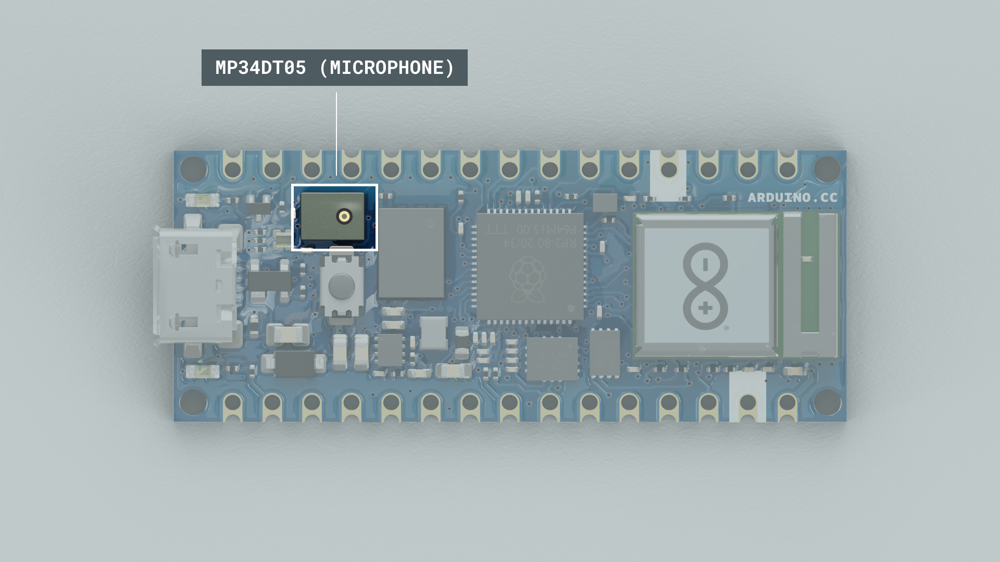

The Arduino® Nano RP2040 Connect is a development board in Nano format, based on the [RP2040](https://datasheets.raspberrypi.org/rp2040/rp2040-datasheet.pdf) microcontroller. It features a Wi-Fi / Bluetooth® module, a 6-axis IMU (Inertial Measurement Unit) with machine learning capabilities, a microphone and a built-in RGB. 

This article is a collection of guides, API calls, libraries and tutorials that can help you get started with the Nano RP2040 Connect board.

You can also visit the [documentation platform for the Nano RP2040 Connect](/hardware/nano-rp2040-connect).

## Board Package

The Nano RP2040 Connect uses the [Arduino Mbed OS Nano Board Package](https://github.com/arduino/ArduinoCore-mbed).

## Datasheet

The full datasheet is available as a downloadable PDF from the link below:

- [Download the Arduino Nano RP2040 Connect datasheet](https://content.arduino.cc/assets/ABX00053-datasheet.pdf)

## Installation

### Arduino IDE 1.8.X

The Nano RP2040 Connect can be programmed through the **Classic Arduino IDE 1.8.X**. To install your board, you can check out the guide below:

- [Installing the Arduino Mbed OS Nano Board Package](/software/ide-v2/tutorials/ide-v2-board-manager)

### Arduino IDE 2 

The Nano RP2040 Connect can be programmed through the **Arduino IDE 2**. To install your board, you can check out the guide below:

- [How to use the board manager with the Arduino IDE 2](/software/ide-v2/tutorials/ide-v2-board-manager)

### Web Editor

The Nano RP2040 Connect can be programmed through the **Web Editor**. To get started with your board, you will only need to install a plugin, which is explained in the guide below:

- [Getting started with the Web Editor](/cloud/web-editor/tutorials/getting-started/getting-started-web-editor)

## Arduino Cloud

The Nano RP2040 Connect is compatible with the [Arduino Cloud](https://create.arduino.cc/iot/things), a Cloud service that allows you to create IoT applications in just minutes.

If you need help to get started, you can go through the [Nano RP2040 Connect with Arduino Cloud tutorial](/tutorials/nano-rp2040-connect/rp2040-iot-cloud).

## Upgrading the Firmware

If you need to upgrade the firmware on your Nano RP2040 Connect,  you can do so by using the Arduino IDE 2. See the link below for a more detailed guide.

- [Upgrading Nano RP2040 Connect NINA firmware](/software/ide-v2/tutorials/ide-v2-fw-cert-uploader)


## Bootloader

Since our upload procedure relies on the Raspberry’s bootloader using a mass storage device, if your computer is fast enough during an upload, it can notify you about an USB removable being plugged.

When a sketch is uploaded successfully, the mass storage of the Nano RP2040 Connect may be visible in the operating system. The mass storage should only appear for a few seconds, then it will automatically close.
When this occurs, we can force the ROM bootloader mode, which will enable mass storage, allowing us to upload UF2 images like CircuitPython / MicroPython or a regular Arduino sketch.

### Forcing Bootloader

There is a risk that the uploading process gets stuck during an upload. If this happens, we can double-tap the reset button, to forcefully trigger the bootloader.

### Board Not Detected

Sometimes the board is not detected even when the board is connected to your computer. This can be solved through the following steps: 

**1.** Connect the board to your computer via USB.

**2.** Place a jumper wire between the REC and GND pins on the board, then press the reset button.


**3.** This will open the mass storage device. You can now remove the jumper wire.

**4.** Upload a basic sketch, such as the blink example to the board (even though it is not visible in the port selection).

**5.** When it has finished uploading, your board should be visible in the board/port selection, and your board's built-in LED should be blinking. This means it is successful!

Alternatively, you can choose to factory-reset the board by dragging the `blink.ino.elf.uf2` file into the mass storage. You can download the file from the link below:

- [Download the blink.ino.elf.uf2 file](https://content.arduino.cc/assets/Blink.ino.elf.uf2)


After dragging the `U2F` file, the board will be flashed with a program that blinks the built-in LED, and shifts between the `red`, `green` and `blue` pixels. 

## Pins


### Analog Pins

The Nano RP2040 Connect has 8 analog pins, that can be used through the `analogRead()` function.

```arduino
value = analogRead(pin, value);
```

>**Please note:** pin `A4` and `A5` should be used for I2C only. 

>**Please note:** pin `A6` and `A7` does not support PWM. 

### PWM Pins

Most of the digital & analog pins can be used as PWM (Pulse Width Modulation) pins, the exception being the following pins:

- A4
- A5
- A6
- A7

```arduino
analogWrite(pin, value);
```

### Digital Pins

There are a total of 14 digital pins, whereas the 8 analog pins can also be used as digital pins.

>**Please note:** A4 and A5 are I2C only, while A6 and A7 can only be used as inputs.

To use them, we first need to define them inside the `void setup()` function of our sketch.

>**Note:** digital pin 3 cannot be configured as `INPUT_PULLUP`.

```arduino
pinMode(pin, INPUT); //configured as an input
pinMode(pin, OUTPUT); //configured as an output
pinMode(pin, INPUT_PULLUP); //uses the internal 10k ohm resistor
```

To read the state of a digital pin:

```arduino
state = digitalRead(pin);
```

To write a state to a digital pin:

```arduino
digitalWrite(pin, HIGH);
```

### 5V Pin

The Arduino RP2040 Connect operates at 3.3 V, and has the 5V pin (VUSB) disabled by default. This is a **safety precaution**, as connecting higher voltage signals to the board can damage the hardware.

The 5V pin will be **enabled** if the pads marked VUSB are shorted, by soldering them.

The VUSB pin is located on the bottom of the board. The pads on the Arduino RP2040 Connect are highlighted below.


## IMU


### LSM6DSOXTR

The LSM6DSOXTR from STM is an IMU (Inertial Measurement Unit) that features a 3D digital **accelerometer** and a 3D digital **gyroscope**. It features among many other things, a **machine learning core**, which is useful for any motion detection projects, such as free fall, step detector, step counter, pedometer.

This module also features an embedded **temperature sensor**.

### LSM6DSOX Library

To access the data from the LSM6DSOX module, we need to install the [LSM6DSOX](https://github.com/arduino-libraries/Arduino_LSM6DSOX) library, which comes with examples that can be used directly with the Nano RP2040 Connect. 

It can be installed directly from the library manager through the IDE of your choice. To use it, we need to include at the top of the sketch:

```arduino
#include <Arduino_LSM6DSOX.h>
```

And to initialize the library, we can use the following command inside `void setup()`.

```arduino
  if (!IMU.begin()) {
    Serial.println("Failed to initialize IMU!");
    while (1);
  }
```

### Accelerometer

The accelerometer data can be accessed through the following commands:

```arduino
  float x, y, z;

  if (IMU.accelerationAvailable()) {
    IMU.readAcceleration(x, y, z);
  }
```

### Gyroscope

The gyroscope data can be accessed through the following commands:

```arduino
  float x, y, z;

  if (IMU.gyroscopeAvailable()) {
    IMU.readGyroscope(x, y, z);
  }
```

### Temperature

The temperature data can be accessed through the following code:

```arduino
if (IMU.temperatureAvailable())
  {
    int temperature_deg = 0;
    IMU.readTemperature(temperature_deg);

    Serial.print("LSM6DSOX Temperature = ");
    Serial.print(temperature_deg);
    Serial.println(" °C");
  }
```

### Tutorials

If you want to learn more on how to use the IMU, please check out the tutorial below:

- [Accessing IMU data with Nano RP2040 Connect](/tutorials/nano-rp2040-connect/rp2040-imu-basics)
- [Using the IMU Machine Learning Core Features](/tutorials/nano-rp2040-connect/rp2040-imu-advanced)

## Microphone



### MP34DT06JTR 

The **MP34DT06JTR** is a compact, low-power omnidirectional digital MEMS microphone with an IC interface. It has a 64 dB signal-to-noise ratio, is capable of sensing acoustic waves and can operate in temperatures of -40 °C to +85 °C.

### PDM Library

To access the data from the MP34DT06JTR, we need to use the [PDM](https://www.arduino.cc/en/Reference/PDM) library that is included in the **Arduino Mbed OS Nano Board Package**. If the Board Package is installed, you will find an example that works by browsing **File > Examples > PDM > PDMSerialPlotter**. 

- **Please note:** The sampling frequency in the PDMSerialPlotter example is set to 16000 Hz. If the microphone appears to not be working (monitor is printing a value of -128), try to change this rate to 20000 Hz. You can change this at the top of the PDMSerialPlotter example sketch, as shown in the example below:

```arduino
static const int frequency = 20000; //frequency at 20 KHz instead of 16 KHz
```

### Tutorials

If you want to learn more on how to use the Microphone, please check out the tutorial below:

- [Reading microphone data with Nano RP2040 Connect](/tutorials/nano-rp2040-connect/rp2040-microphone-basics)

## RGB


***Please note: While using the Bluetooth® Low Energy mode on the NINA module, the RGB cannot be used by default. While the module is in Bluetooth® Low Energy mode, SPI is deactivated, which is used to control the RGBs.***

The Nano RP2040 Connect features a built-in RGB that can be utilized as a feedback component for applications. The RGB is connected through the W-102 module, so the `WiFiNINA` library needs to be installed and included at the top of your sketch to work.

The `WiFiNINA` library is required to use the RGB.

```arduino
#include <WiFiNINA.h>
```

The pins needs to be defined inside `void setup()` as outputs:

```arduino
pinMode(LEDR, OUTPUT);
pinMode(LEDG, OUTPUT);
pinMode(LEDB, OUTPUT);
```

To turn ON the pixels, write a `HIGH` state to the LED:

```arduino
digitalWrite(LEDR, HIGH); //RED
digitalWrite(LEDG, HIGH); //GREEN
digitalWrite(LEDB, HIGH); //BLUE
```

To turn OFF the pixels, write a `LOW` state to the LED:

```arduino
digitalWrite(LEDR, LOW); //RED
digitalWrite(LEDG, LOW); //GREEN
digitalWrite(LEDB, LOW); //BLUE
```

We can also choose a value between 255 - 0 to write to the LED:

```arduino
analogWrite(LEDR, 72);  //GREEN 
analogWrite(LEDG, 122); //BLUE 
analogWrite(LEDB, 234); //RED 
```

## Communication

Like other Arduino® products, the Nano RP2040 Connect features dedicated pins for different protocols.

### SPI

The pins used for SPI (Serial Peripheral Interface) on the Nano RP2040 Connect are the following:

- (CIPO) - D12
- (COPI) - D11
- (SCK) - D13
- (CS) - Any GPIO (except for A6/A7)

***The signal names MOSI, MISO and SS has been replaced by COPI (Controller Out, Peripheral In), CIPO (Controller In, Peripheral Out) and CS (Chip Select).***

To use SPI, we first need to include the [SPI](https://www.arduino.cc/en/reference/SPI) library.

```arduino
#include <SPI.h>
```

Inside `void setup()` we need to initialize the library.

```arduino
SPI.begin();
```

And to write to the device:

```arduino
  digitalWrite(chipSelectPin, LOW); //pull down the CS pin
  
  SPI.transfer(address); // address for device, for example 0x00
  SPI.transfer(value); // value to write

  digitalWrite(chipSelectPin, HIGH); // pull up the CS pin
```


### I2C

The pins used for I2C (Inter-Integrated Circuit) on the Nano RP2040 Connect are the following:

- (SDA) - A4
- (SCL) - A5

To use I2C, we can use the [Wire](https://www.arduino.cc/en/Reference/wire) library, which we need to include at the top of our sketch.

```arduino
#include <Wire.h>
```

Inside `void setup()` we need to initialize the library.

```arduino
Wire.begin(); 
```

And to write something to a device connected via I2C, we can use the following commands:

```arduino
  Wire.beginTransmission(1); //begin transmit to device 1
  Wire.write(byte(0x00)); //send instruction byte 
  Wire.write(val); //send a value
  Wire.endTransmission(); //stop transmit
```

### UART

The pins used for UART (Universal asynchronous receiver-transmitter) are the following:

- (Rx) - D0
- (Tx) - D1

To send and receive data through UART, we will first need to set the baud rate inside `void setup()`.

```arduino
Serial1.begin(9600);
```

To read incoming data, we can use a while loop() to read each individual character and add it to a string.

```arduino
  while(Serial1.available()){
    delay(2);
    char c = Serial1.read();
    incoming += c;
  }
```

And to write something, we can use the following command:

```arduino
Serial1.write("Hello world!");
```

## Connectivity

The Nano RP2040 Connect supports both Wi-Fi and Bluetooth® through the [uBlox W-102](https://content.arduino.cc/assets/Arduino_NINA-W10_DataSheet_%28UBX-17065507%29.pdf) module. To use this module, we can use the [WiFiNINA](https://www.arduino.cc/en/Reference/WiFiNINA) library or the [ArduinoBLE](https://www.arduino.cc/en/Reference/ArduinoBLE) library. 


## Wi-Fi

To use the Wi-Fi module on the Nano RP2040 Connect, we will need to install the [WiFiNINA](https://www.arduino.cc/en/Reference/WiFiNINA) library, and include it at the top of our sketch:

```arduino
#include <WiFiNINA.h>
```

To connect to a Wi-Fi network, we can use the following command:

```arduino
WiFi.begin(ssid, pass);
```

### GET / POST Requests

The **WiFiNINA** library can be used to make GET & POST requests, while connected to the server. The command below is used to connect to `www.google.com` and return the results of searching for the keyword `arduino`.

```arduino
  if (client.connect(server, port)) {
    client.println("GET /search?q=arduino HTTP/1.1");
    client.println("Host: www.google.com");
    client.println("Connection: close");
    client.println();
  }
```

### Tutorials


- [Web Server AP mode with Arduino Nano RP2040 Connect](/tutorials/nano-rp2040-connect/rp2040-ap-web-server-rgb)
- [RGB Control over Wi-Fi with Arduino Nano RP2040 Connect](/tutorials/nano-rp2040-connect/rp2040-web-server-rgb) 

## Bluetooth®

***Please note: While using the Bluetooth® Low Energy mode on the NINA module, the RGB cannot be used by default. While the module is in Bluetooth® Low Energy mode, SPI is deactivated, which is used to control the RGBs.***

To enable Bluetooth® on the Nano RP2040 Connect, we can use the [ArduinoBLE](https://www.arduino.cc/en/Reference/ArduinoBLE) library, and include it at the top of our sketch:

```arduino
#include <ArduinoBLE.h>
```

Set the service and characteristic:

```arduino
BLEService ledService("180A"); // BLE LED Service
BLEByteCharacteristic switchCharacteristic("2A57", BLERead | BLEWrite);
```

Set advertised name and service:

```arduino
  BLE.setLocalName("Nano RP2040 Connect");
  BLE.setAdvertisedService(ledService);
```

Start advertising:

```arduino
BLE.advertise();
```

Listen for BLE peripherals to connect:

```arduino  
BLEDevice central = BLE.central();
```

### Tutorials

- [Nano RP2040 device to device via Bluetooth®](/tutorials/nano-rp2040-connect/rp2040-ble-device-to-device)

## USB Keyboard

To use the board as a keyboard, you can refer to the [USBHID](https://github.com/arduino/ArduinoCore-mbed/tree/master/libraries/USBHID) library that can be found inside the Board Package.

You first need to include the libraries and create an object:

```arduino
#include "PluggableUSBHID.h"
#include "USBKeyboard.h"

USBKeyboard Keyboard;
```

Then use the following command to write something:

```arduino
Keyboard.printf("This is RP2040 speaking!");
```
