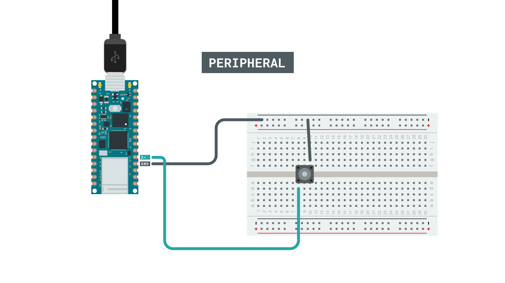
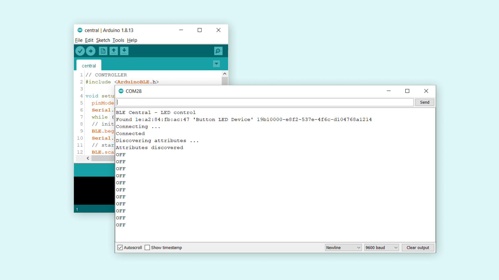
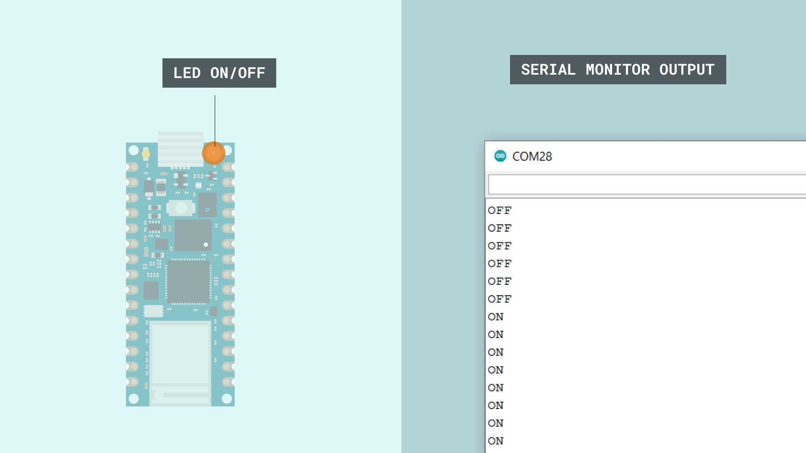

## Introduction 

In this tutorial, we will learn how to turn on the blue pixel onboard the Arduino® Nano RP2040 Connect board, from another board. For this, we will need two Bluetooth® Low Energy compatible boards, such as the Nano RP2040 Connect board, where we will use the [ArduinoBLE](https://www.arduino.cc/en/Reference/ArduinoLSM6DS3) library to make the connection. 

>**Note:** if you need help setting up your environment to use your Arduino Nano RP2040 board, please refer to [this installation guide](/software/ide-v2/tutorials/ide-v2-board-manager).

## Goals

The goals of this project are:

- Connect two Nano RP2040 Connect boards using Bluetooth® Low Energy.
- Set up one board as a "peripheral" and one as a "central" device.
- Set up a boolean that switches each time a button is pressed.
- Depending on what state the boolean is in, send a byte to the other board (either 0x00 or 0x01 which represents 0 and 1).

## Hardware & Software Needed

- Arduino IDE ([online](https://create.arduino.cc/) or [offline](https://www.arduino.cc/en/main/software)).
- [ArduinoBLE](https://www.arduino.cc/en/Reference/ArduinoBLE) library.
- 2x [Arduino Nano RP2040 Connect](https://store.arduino.cc/nano-rp2040-connect).
- Breadboard.
- Pushbutton.
- Jumper wires.

### Circuit

For the peripheral device, we need to connect a pushbutton the to board.



For the central device, we do not need any additional circuit.


## Programming the Board

We will now get to the programming part of this tutorial. 

1. First, let's make sure we have the drivers installed. If we are using the Web Editor, we do not need to install anything. If we are using an offline editor, we need to install it manually. This can be done by navigating to **Tools > Board > Board Manager...**. Here we need to look for the **Arduino Mbed OS Nano Boards** and install it. 

2. Now, we need to install the libraries needed. If we are using the Web Editor, there is no need to install anything. If we are using an offline editor, simply go to **Tools > Manage libraries..**, and search for **ArduinoBLE** and install it.

3. We can now take a look at some of the core functions of the sketches we will use:

- `BLE.begin()` - initializes the library
- `BLE.scanForUuid("19b10000-e8f2-537e-4f6c-d104768a1214")` - scans for Bluetooth® Low Energy peripherals until the one inside parenthesis is found. 
- `BLEDevice peripheral = BLE.available()` checks whether peripheral has been discovered.
- `BLEDevice central = BLE.available()` checks whether peripheral has been discovered.
- `while (peripheral.connected())` - while a peripheral is connected, enter a while loop.
- `while (central.connected())` - while a peripheral is connected, enter a while loop.
- `LEDCharacteristic.writeValue((byte)0x00)` - sends a "0" to the central.
- `LEDCharacteristic.writeValue((byte)0x01)` - sends a "1" to the central.
- `byte value = LEDCharacteristic.read()` - reads incoming data.
- `LEDCharacteristic.readValue(value)` - stores incoming data in the `value` byte.
- `if (value == 0x00)` - checks if incoming data is "0".
- `if (value == 0x01)` - checks if incoming data is "1".


### Complete Code for Peripheral Device

Upload the code below to the peripheral device.

```arduino
#include <ArduinoBLE.h>

int buttonPin = 2;
boolean ledSwitch;

BLEService LEDService("19B10000-E8F2-537E-4F6C-D104768A1214"); // BLE LED Service
// BLE LED Switch Characteristic - custom 128-bit UUID, read and writable by central
BLEByteCharacteristic LEDCharacteristic("19B10001-E8F2-537E-4F6C-D104768A1214", BLERead | BLENotify | BLEWrite);
void setup() {
  Serial.begin(9600);
  pinMode(buttonPin, INPUT_PULLUP);
  // begin initialization
  if (!BLE.begin()) {
    Serial.println("starting Bluetooth® Low Energy failed!");
  }
  // set advertised local name and service UUID:
  BLE.setLocalName("Button Device");
  BLE.setAdvertisedService(LEDService);
  // add the characteristic to the service
  LEDService.addCharacteristic(LEDCharacteristic);
  // add service
  BLE.addService(LEDService);
  // start advertising
  BLE.advertise();
  Serial.println("BLE LED Peripheral, waiting for connections....");
}
void loop() {
  // listen for BLE peripherals to connect:
  BLEDevice central = BLE.central();
  // if a central is connected to peripheral:
  if (central) {
    Serial.print("Connected to central: ");
    // print the central's MAC address:
    Serial.println(central.address());
    // while the central is still connected to peripheral:
    while (central.connected()) {

      int buttonState = digitalRead(buttonPin);

      if (buttonState == LOW) {
        ledSwitch = !ledSwitch;
        delay(500);

        if (ledSwitch) {
          Serial.println("ON");
          LEDCharacteristic.writeValue((byte)0x01);
        }
        else {
          LEDCharacteristic.writeValue((byte)0x00);
          Serial.println("OFF");
        }
      }
    }
    // when the central disconnects, print it out:
    Serial.print(F("Disconnected from central: "));
    Serial.println(central.address());
  }
}
```

### Complete Code for Central Device

Upload the code below to the central device.

```arduino
#include <ArduinoBLE.h>

void setup() {
  pinMode(LED_BUILTIN, OUTPUT);
  Serial.begin(9600);
  while (!Serial);
  // initialize the BLE hardware
  BLE.begin();
  Serial.println("BLE Central - LED control");
  // start scanning for Button Device BLE peripherals
  BLE.scanForUuid("19b10000-e8f2-537e-4f6c-d104768a1214");
}
void loop() {
  // check if a peripheral has been discovered
  BLEDevice peripheral = BLE.available();
  if (peripheral) {
    // discovered a peripheral, print out address, local name, and advertised service
    Serial.print("Found ");
    Serial.print(peripheral.address());
    Serial.print(" '");
    Serial.print(peripheral.localName());
    Serial.print("' ");
    Serial.print(peripheral.advertisedServiceUuid());
    Serial.println();
    if (peripheral.localName().indexOf("Button Device") < 0) {
      Serial.println("No 'Button Device' in name");
      return;  // If the name doesn't have "Button Device" in it then ignore it
    }
    // stop scanning
    BLE.stopScan();
    controlLed(peripheral);
    // peripheral disconnected, start scanning again
    BLE.scanForUuid("19b10000-e8f2-537e-4f6c-d104768a1214");
  }
}
void controlLed(BLEDevice peripheral) {
  // connect to the peripheral
  Serial.println("Connecting ...");
  if (peripheral.connect()) {
    Serial.println("Connected");
  } else {
    Serial.println("Failed to connect!");
    return;
  }
  // discover peripheral attributes
  Serial.println("Discovering attributes ...");
  if (peripheral.discoverAttributes()) {
    Serial.println("Attributes discovered");
  } else {
    Serial.println("Attribute discovery failed!");
    peripheral.disconnect();
    return;
  }
  // retrieve the LED characteristic
  BLECharacteristic LEDCharacteristic = peripheral.characteristic("19b10001-e8f2-537e-4f6c-d104768a1214");
  if (!LEDCharacteristic) {
    Serial.println("Peripheral does not have LED characteristic!");
    peripheral.disconnect();
    return;
  }
  while (peripheral.connected()) {
    // while the peripheral is connected
    if (LEDCharacteristic.canRead()) {
      byte value = LEDCharacteristic.read();
      LEDCharacteristic.readValue(value);
      //Serial.println(LEDCharacteristic.readValue(value));
      if (value == 0x01) {
        Serial.println("ON");
        digitalWrite(LED_BUILTIN, HIGH);
      }
      else if (value == 0x00) {
        digitalWrite(LED_BUILTIN, LOW);
        Serial.println("OFF");
      }
    }
    delay(500);
  }
  Serial.println("Peripheral disconnected");
}
```

## Testing It Out

After we have uploaded both the **central** and **peripheral** sketches to our boards, we can test out our application.

Let's start by opening the Serial Monitor of the central device. Since we are using the `while(!Serial);` command, the program will not initialize until we open the Serial Monitor. This is done so we don't miss any important information in the Serial Monitor. 

When we open it, the central device will start looking for peripherals. When it finds one, it will attempt to connect to it. If all goes well, we should now start receiving the state of the button from the **peripheral device**. In this case, it is OFF, which we can see being updated continuously.



Now, if we press the button on the peripheral device, we can see two things change on the **central device.** The blue LED will turn ON, and the Serial Monitor will instead print **"ON"**. We can now turn ON or OFF the LED, through pushing the same button.



### Troubleshoot

If the code is not working, there are some common issues we can troubleshoot:

- We have not installed the **ArduinoBLE** library.
- We have not uploaded the right sketch for the right board. Remember that the board with the button needs the peripheral sketch, and the other board needs the central sketch.
- We have not powered both boards. Remember that both programs need to be up and running for this application to work.

## Conclusion

In this tutorial, we have created a simple device-to-device application over Bluetooth®. We set up a **peripheral device** with a button, and used the built-in RGB on the **central device**. With this, we can simply turn ON and OFF the LED using Bluetooth® Low Energy, with the same button.  
