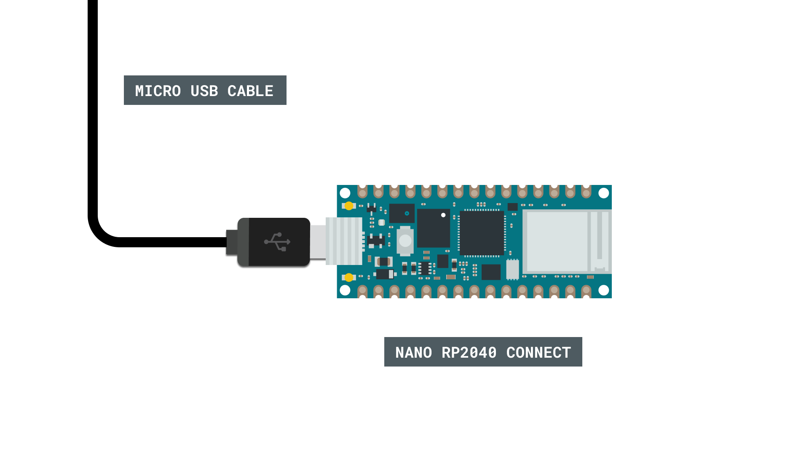
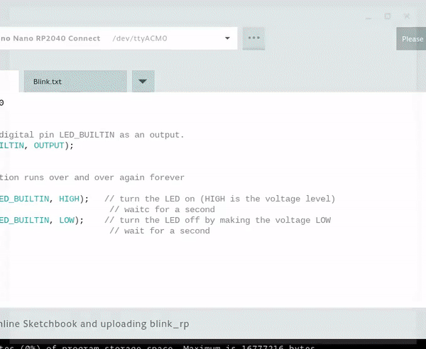

## Introduction 

The [Nano RP2040 Connect](https://store.arduino.cc/nano-rp2040-connect) is a popular development board packed with features. If you are using a **Chromebook**, setting up your board is a bit different:

- It is only possible to use the [Cloud Editor](https://create.arduino.cc/editor), an online IDE that is part of the [Arduino Cloud](https://cloud.arduino.cc/).
- Compiled sketches are saved (in `.uf2` format) on the RP2040's mass storage device.

In this tutorial, we will take you through the steps needed to set up your board using a Chromebook.

***Note that only the Cloud Editor is supported in Chromebooks. It is not possible to configure and upload to Nano RP2040 Connect boards via the [IoT Cloud](https://create.arduino.cc/iot/things).***

## Goals

The goals of this project are:

- Learn how to upload sketches to your Nano RP2040 board, using the Cloud Editor.

## Hardware & Software Needed

- [Arduino Cloud Editor](https://create.arduino.cc/).
- [Arduino Create for Education](https://chrome.google.com/webstore/detail/arduino-create-for-educat/elmgohdonjdampbcgefphnlchgocpaij) (Chrome Web Store)
- [Arduino Nano RP2040 Connect](https://store.arduino.cc/nano-rp2040-connect).

## Install Arduino App (Chrome Store)

To program your Arduino via a Chromebook, you will need the [Arduino Create for Education app](https://chrome.google.com/webstore/detail/arduino-create-for-educat/elmgohdonjdampbcgefphnlchgocpaij). This is downloaded and installed via the Chrome Web Store.


***If you have previously installed the app, make sure your version is up to date.***

## Cloud Editor

***To use the [Cloud Editor](https://create.arduino.cc/editor), you will need to be logged into your Arduino account. If you don't have an account, you will need to register one.***

**1.** Head over to the [Cloud Editor](https://create.arduino.cc/editor).

**2.** Create a new sketch, and write your program.

**3.** When you want to upload, connect your board to your computer via USB.



**4.** After connecting, the board's **name** and **port** is visible at the top of the editor (next to upload button). In this case, it is `COM19`.


**5.** Click the upload button. This will start the **compilation process**. After some seconds, a popup will appear. Click **"Continue"**, and in the next frame, you will need to save it to the `RPI-RP2` mass storage device. The file is named `sketch.uf2`, which is the binary that will be uploaded to your board.



**6.** After you have saved, the upload will finish, and you will see this message in the terminal:

```
Success: Saved on your online Sketchbook and done uploading <sketchname>
```

Congratulations, you have now uploaded a sketch to your Nano RP2040 Connect using the Cloud Editor on a Chromebook.

### Troubleshoot

If things are not working as expected:

- Make sure you have the latest version of the [Arduino Create for Education App](https://chrome.google.com/webstore/detail/arduino-create-for-educat/elmgohdonjdampbcgefphnlchgocpaij) installed.
- Make sure your board is connected to your computer properly.

## Conclusion

In this tutorial, we learned how to upload sketches to the Nano RP2040 Connect board, using the Cloud Editor on a Chromebook. For more tutorials on the Nano RP2040 Connect board, visit the [official documentation](https://docs.arduino.cc/hardware/nano-rp2040-connect).