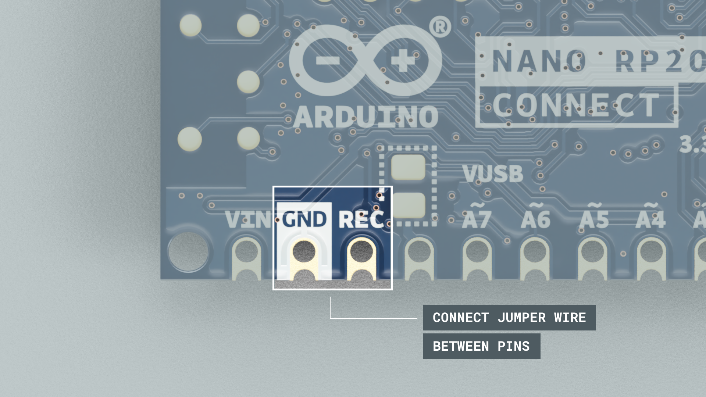
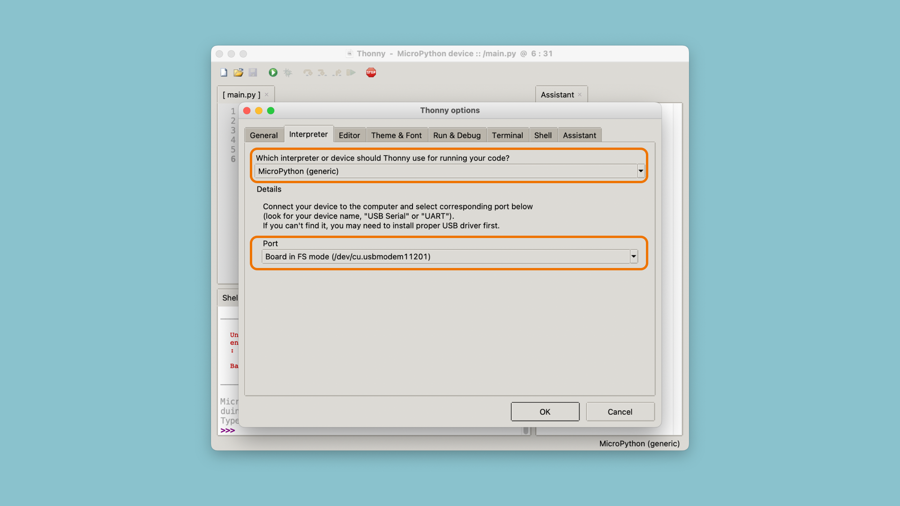
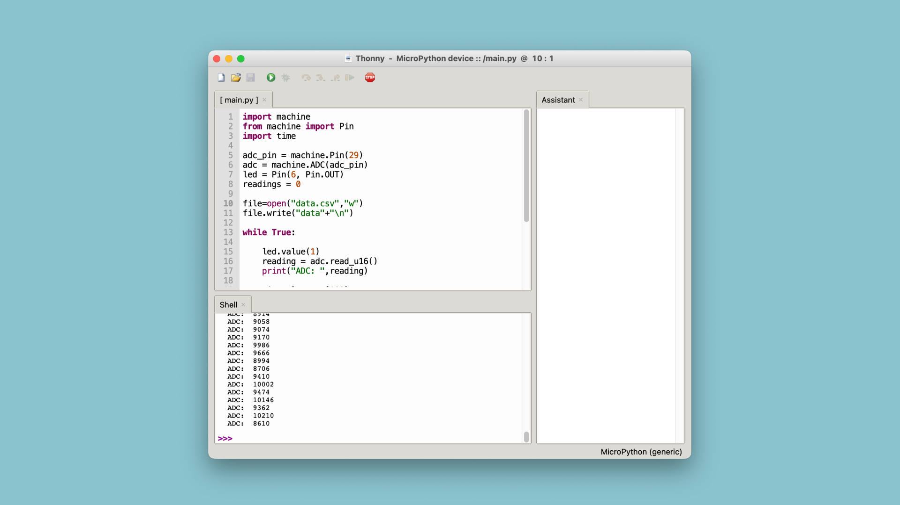
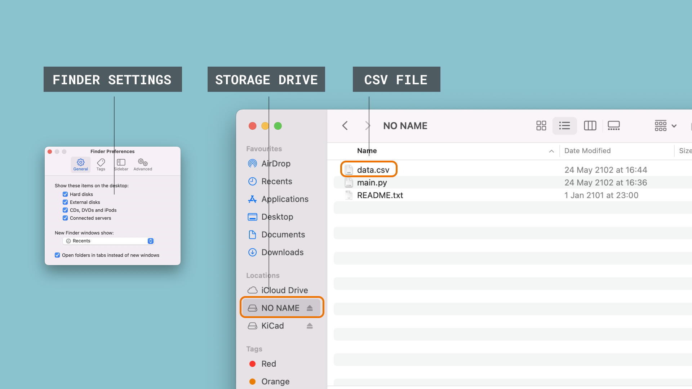

## Introduction 

The [Nano RP2040 Connect](https://store.arduino.cc/nano-rp2040-connect) board has on-board storage that allows you to turn the device into a data logger without any extra components. 

In order to utilize this feature, we need to install the latest release of [OpenMV's flavor of MicroPython](https://github.com/openmv/openmv/). 

## Goals

The goals of this tutorial are:

- Install OpenMV MicroPython firmware on the board.
- Learn how to save data in a `.csv` format directly on the Nano RP2040 Connect.

## Hardware & Software Needed

- [Thonny IDE](https://thonny.org/).
- [Arduino Nano RP2040 Connect](https://store.arduino.cc/nano-rp2040-connect).

## Install MicroPython

**1.** The first step is to install the latest version of the OpenMV firmware (MicroPython) on the Nano RP2040 board. This version is available through the link below:

- [OpenMV firmware v4.3.1. (download)](https://github.com/openmv/openmv/releases/download/v4.3.1/firmware_v4.3.1.zip)

**2.** Unzip the contents, and locate the `firmware.uf2` file inside of the **ARDUINO_NANO_RP2040_CONNECT** folder.

**3.** Force the bootloader on the Nano RP2040 Connect, by connecting a jumper wire between `GND` and `REC` pins as shown in the image below. When the mass storage device opens, drag the `firmware.uf2` onto it, and the latest version will install.



**4.** Install and open the [Thonny IDE](https://thonny.org/). Navigate to **Run > Select Interpreter** and choose the **"MicroPython(generic)"** from the list. Your board should now appear in the other dropdown menu:



If your board appears, it has been successful. In this case, it is called `Board in FS mode (/dev/cu.usbmodem11201)`. 

## Data Logger Example

Now that the OpenMV MicroPython firmware is installed on your device, and it is detected using Thonny, we can create our datalogger.

The script for the datalogger is quite basic, and has the following functionality:

- Create a `.csv` file
- Read the value of an analog pin, and log it, using the `file.write()` function.
- Repeat 25 times and then finish script.
- Each time a reading is recorded, the built-in LED flashes.

### Code

The script for this tutorial can be found below:

```python
import machine
from machine import Pin
import time

adc_pin = machine.Pin(29) 
adc = machine.ADC(adc_pin)
led = Pin(6, Pin.OUT)
readings = 0

# create a file named "data.csv"
file=open("data.csv","w") 
file.write("data"+"\n")

while True:
    
    led.value(1)
    reading = adc.read_u16()     
    print("ADC: ",reading)
    
    time.sleep_ms(100)
    
    # convert and write the reading from the analog pin
    file.write(str(reading)+"\n")
    
    led.value(0)
    time.sleep_ms(100)
    readings += 1
    
    # if 25 readings are done, finish the program
    if readings >= 25:
        file.close()
        break
```

Copy paste this code into the Thonny editor, and click on the **Green Play Button (F5)**. The values recorded are also printed in the terminal, so we can compare it later. After running, it should look like this:



When you run the script, the board should now start blinking fast, every 100 milliseconds, and it will do so 25 times (as is specified in the code, the number can be changed).

### Accessing Data

Once done, navigate to Finder / Explorer, and locate a drive called **"NO NAME"**. This should now include a `data.csv` file. This contains the 25 readings we just made by running the script.

***If you are using a Mac, you may need to change a setting that allows you to see external disks. If you can't see the drive, go to Finder > Preferences and tick the boxes that appear.***



Congratulations, you have now successfully recorded data and stored it in a `.csv` file onboard the Nano RP2040 Connect. 

***Please note that you should never open this file whenever a file management operation is ongoing. This will most likely corrupt your file and you won't be able to obtain the data. Best practice is to record the data, wait a little, and then open up the `data.csv` file.***

## Conclusion

In this tutorial, we turned a Nano RP2040 Connect board into a data logger, without the use of any external components (such as an SD card). 

This is an incredibly useful tool whenever you are working with data collection, and the script found in this tutorial can be easily be altered to fit your project.

While we in this tutorial only recorded values from an analog pin, there are many other things to do, such as:

- Record data from the onboard IMU.
- Record data from an external sensor.
- Record events that occurred along with a timestamp (for example, how many times a sensor value's threshold was met).