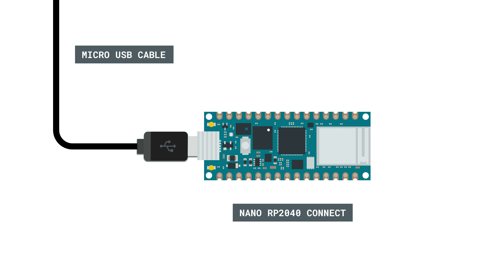
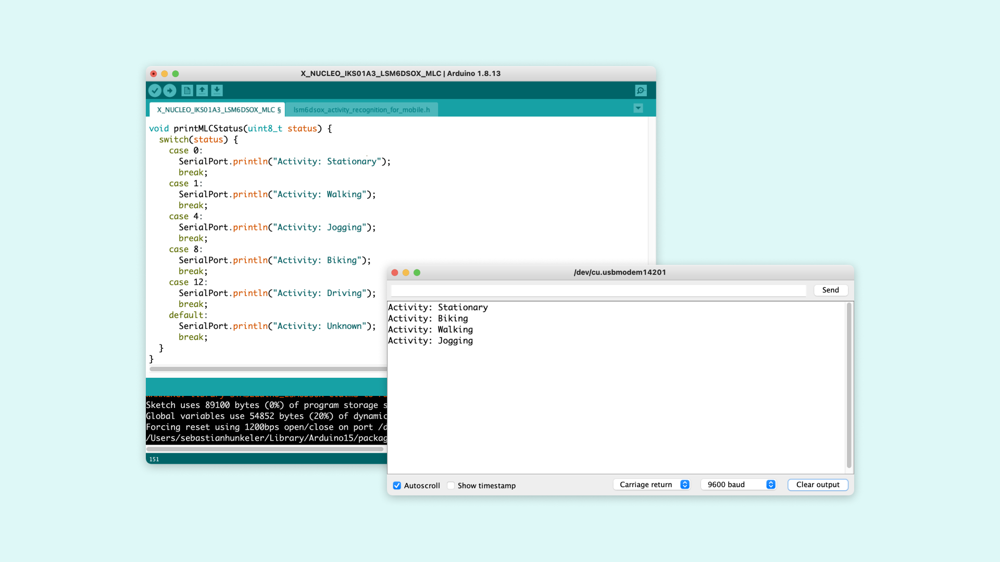

## Introduction 

In this tutorial, you will learn how to access the machine learning core features provided by the LSM6DSOX Inertial Measurement Unit (IMU) module on the Nano RP2040 Connect. For this, we will use the [STM32duino X-NUCLEO-IKS01A3](https://github.com/stm32duino/X-NUCLEO-IKS01A3) library. 

>**Note:** if you need help setting up your environment to use your Arduino Nano RP2040 board, please refer to [this installation guide](/software/ide-v2/tutorials/ide-v2-board-manager).

## Goals

The goals of this project are:

- Detect motion activity such as walking or jogging.
- Print the data to the Serial Monitor.

## Hardware & Software Needed

- Arduino IDE ([online](https://create.arduino.cc/) or [offline](https://www.arduino.cc/en/main/software)).
- [STM32duino X-NUCLEO-IKS01A3](https://github.com/stm32duino/X-NUCLEO-IKS01A3) library.
- [Arduino Nano RP2040 Connect](https://store.arduino.cc/nano-rp2040-connect).

## IMU (Inertial Measurement Unit)

An IMU is a component that measures movement such as specific force, angular rate or orientation. It does that by combining a **gyroscope** and an **accelerometer** sensor. 
If you would like to learn how to access the raw accelerometer or gyroscope data, please refer to [this](/tutorials/nano-rp2040-connect/rp2040-imu-basics) tutorial.

In addition to measuring the raw movement data, the IMU mounted on the Nano RP2040 Connect has a machine learning core. This allows to do advanced movement detection on the IMU itself. This frees the microcontroller from this task so it can do other things like sending data to a network, interacting with other sensors or operating actuators. By using the machine learning core specific activity patterns such as walking, jogging or biking can be recognized.

The patterns that can be recognized by the IMU depend on the machine learning model that is used. In this tutorial we will focus on the pre-trained model that comes with the library.
Let's take a look at how the IMU's smart features work!

### Circuit

## Programming the Board

We will now get to the programming part of this tutorial. 

1. First, let's make sure the drivers are installed. If you are using the Web Editor, you don't need to install anything. If you are using an offline editor, you need to install it manually. This can be done by navigating to **Tools > Board > Board Manager...**. Here you need to search for **Arduino Mbed OS Nano Boards** and install the package. 

2. Now, you need to install the STM32duino X-NUCLEO-IKS01A3 library. If you are using an offline editor, simply go to **Tools > Manage libraries..**, and search for **STM32duino X-NUCLEO-IKS01A3** and install it. If a dialog appears asking whether the dependent libraries should be installed confirm this.

3. Once the library is installed open the example sketch **X_NUCLEO_IKS01A3_LSM6DSOX_MLC** that comes with the library from the examples menu. You may need to check in the **INCOMPATIBLE** group.

4. We can now take a look at some of the core functions of this sketch:

- `DEV_I2C.begin()` - initializes the I2C communication with the IMU module.
- `AccGyr.begin()` - initialized the accelerometer and the gyroscope.
- `AccGyr.Enable_X()` - enables the accelerometer.
- `AccGyr.Enable_G()` - enables the gyroscope sensor.
- `attachInterrupt(INT_1, INT1Event_cb, RISING)` - registers an interrupt callback for when the IMU interrupt pin is pulled high. This indicates that a motion type was detected.
- `AccGyr.Get_MLC_Output(mlc_out)` - reads the machine learning core output and saves the decision tree into an array variable.
- `printMLCStatus(status)` - translates the number retrieved from the machine learning core into a human readable description of the detected activity type.

The machine learning model is stored in the `lsm6dsox_activity_recognition_for_mobile.h` file.

The only thing that needs to be changed in the sketch is the pin mapping for the IMU interrupt pin at the beginning of the sketch. On the Nano RP2040 Connect it is on the GPIO pin 21 which can be referred to as `INT_IMU`:

`#define INT_1 INT_IMU`

Once you changed that, upload the sketch to the board.

## Testing It Out

After successfully uploading the code to the board, open the Serial Monitor. It will print `Activity: Stationary` after a few seconds. When you now move the Nano RP2040 continuously up and down it will pick up this activity and detect it most likely as walking. Try moving it faster and check if it now detects this as jogging. If you have a power bank you can connect your Nano RP2040 Connect to it and go for a run or a walk and check if it detects those activities successfully.

### Troubleshoot

If the code is not working, there are some common issues we can troubleshoot:

- You have not installed the **STM32duino X-NUCLEO-IKS01A3** library. Install it through the IDE's library manager.
- An incorrect pin number was assigned to INT_1. Make sure p24 is assigned to it.
- You have a faulty USB cable. Try with a different Micro USB cable e.g. one from a mobile phone.

## Conclusion

In this tutorial you have learned how to use the IMU's machine learning core with a pre-trained model to detect various activity types. With these machine learning capabilities complex types of motion can be detected which may otherwise be difficult to algorithmically describe.