## Introduction

In this tutorial, we will go through the steps needed to connect the [Nano RP2040 Connect](https://store.arduino.cc/nano-rp2040-connect) to the [Arduino IoT Cloud](https://create.arduino.cc/iot/). 

We will test the connection out, by viewing real time data of the IMU (Inertial Measurement Unit), and remotely controlling the RGB on the board.

## Goals

The goals of this project are:

- Set up the Arduino IoT Cloud.
- Read IMU sensor data.
- Control the built-in RGB.

## Hardware & Software Needed

- [Arduino IoT Cloud](https://create.arduino.cc/iot/).
- [Arduino Nano RP2040 Connect](https://store.arduino.cc/nano-rp2040-connect).

### Circuit

Follow the circuit below to connect the buttons and LEDs to your Arduino board.

>**Note:** Remember that the pinouts are different on a Nano 33 IoT board. This circuit works for the MKR WiFi 1000/1010 boards.


## The Arduino IoT Cloud

To start, we will need to head over to the [Arduino IoT Cloud](https://create.arduino.cc/iot/). This is also accessible through the menu at the top right.

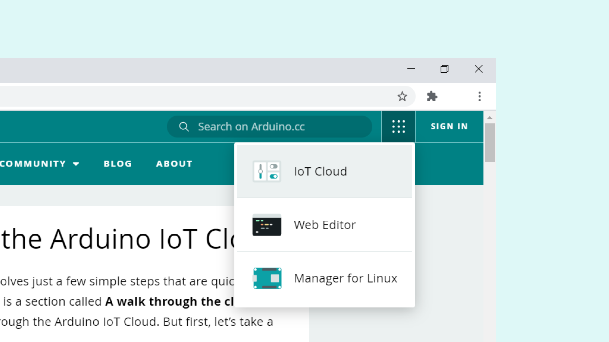

### Step 1: Setting up the Device

**1.** Once we are in the IoT Cloud, we need to first create a Thing, by clicking on the **"Create a Thing"** button.

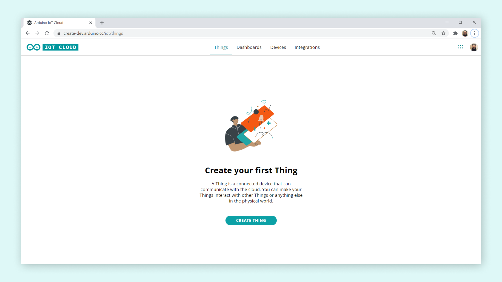

**2.** Now, we need to configure our device, by clicking on the **"Select Device"** button.

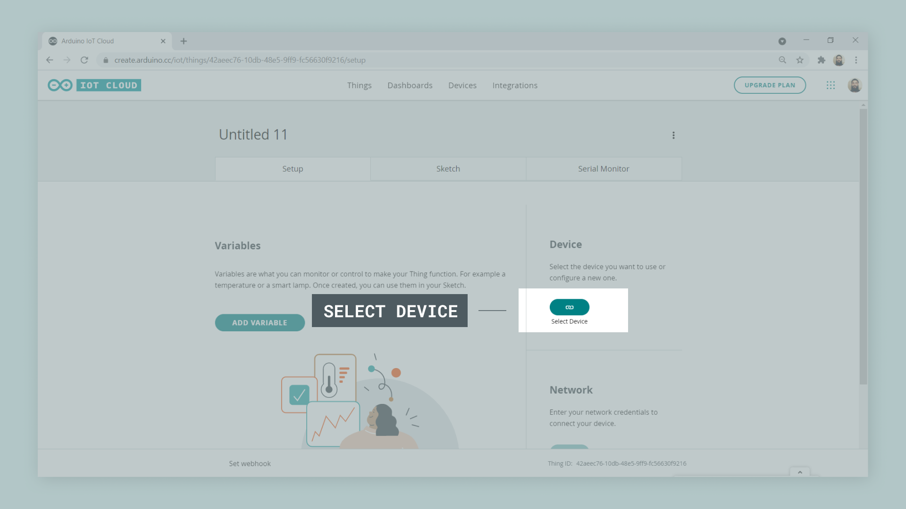

**3.** Next we need to select the **"Set up an Arduino device"** option. After a while, your device should appear. Click on the **"Configure"** button.

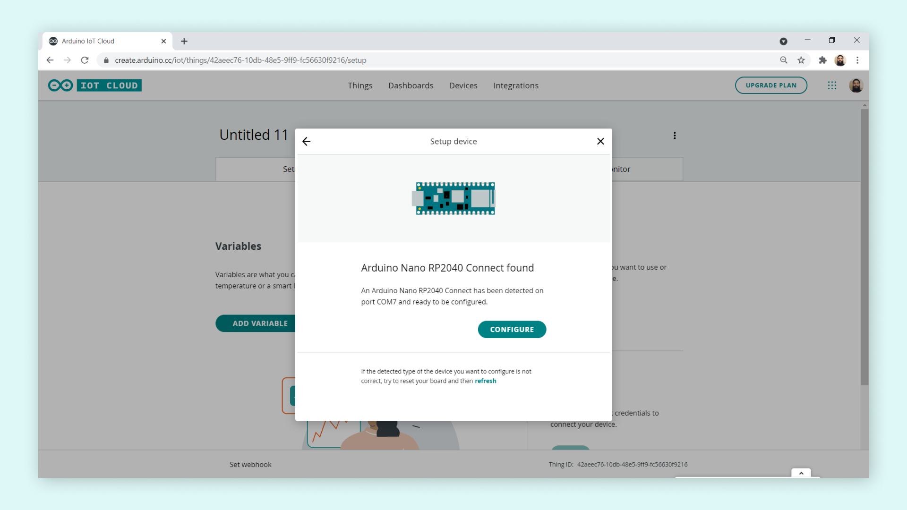

**4.** Name the board, and click on **"Next"** which will start a configuration process. Do not disconnect the board during this process.

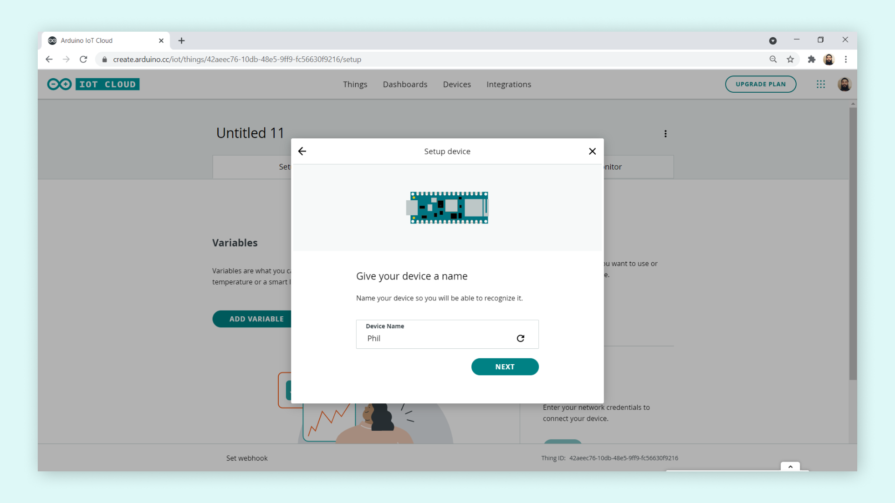

**5.** After some time, the installation will complete, and your Nano RP2040 is ready for the IoT Cloud.

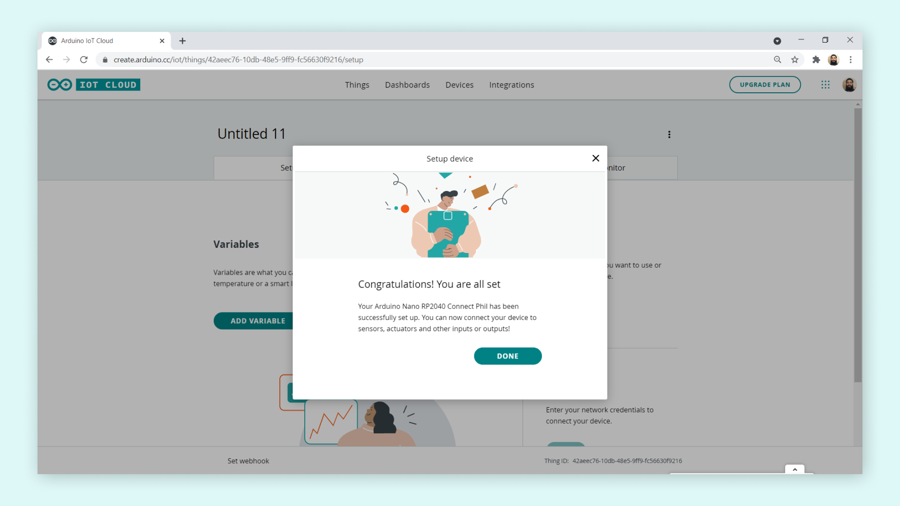

### Step 2: Creating Variables

Now, we will need to create variables that will be used to control and read data from the board. This is done by clicking on the **"Add Variable"** button.

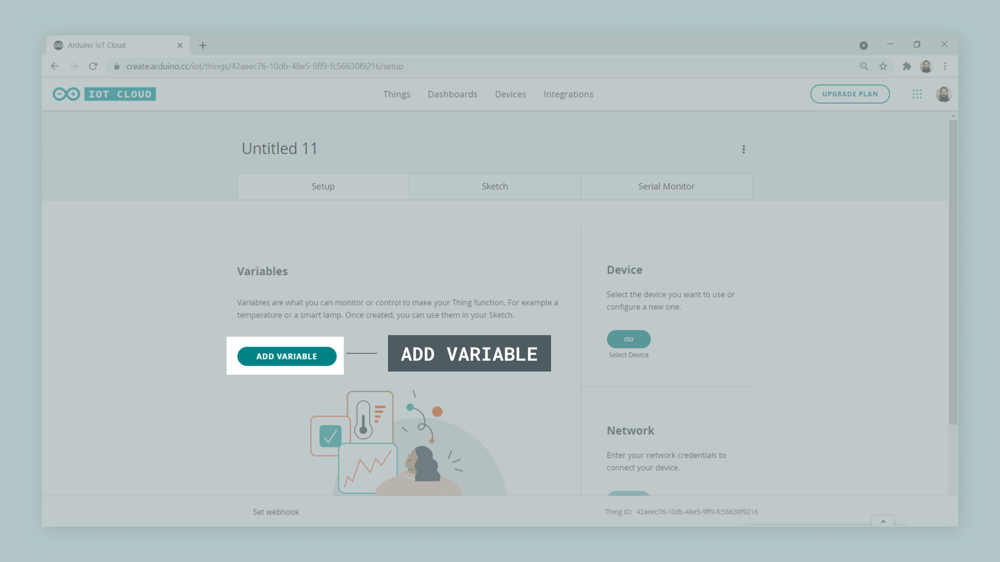

We will add variables to control the **RGB** and to read the **Accelerometer**.


| Variable Name | Data Type | Permission   |
| ------------- | --------- | ------------ |
| a_x           | float     | read only    |
| a_y           | float     | read only    |
| a_z           | float     | read only    |
| red           | boolean   | read & write |
| green         | boolean   | read & write |
| blue          | boolean   | read & write |

The final overview should look something like this:

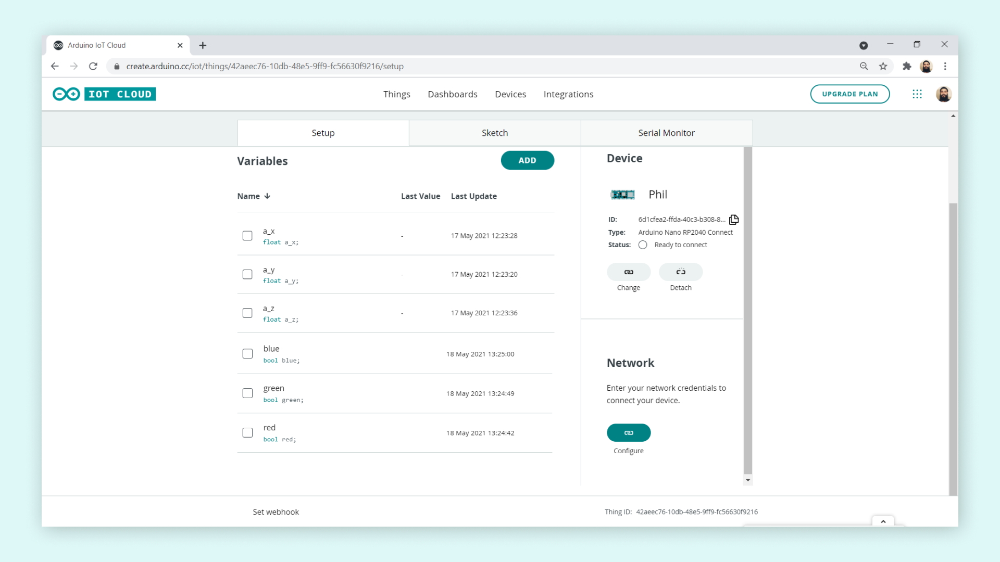

>**Tip:** You can also name your Thing, by clicking on the "Untitled XX" tag. We renamed this Thing RP2040 Cloud Project. This makes it easier to track if you have multiple things.

### Step 3: Network Details

For our board to connect to our Wi-Fi network, we also need to enter the credentials. This is done by clicking the button inside the **"Network Section"**

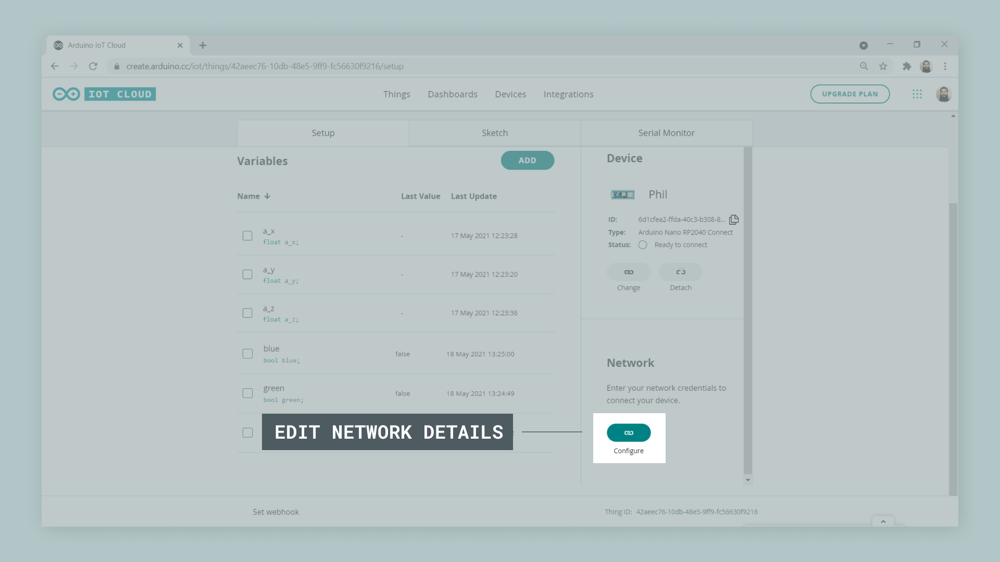

Then, enter your credentials (network and password). Remember that it is case-sensitive.

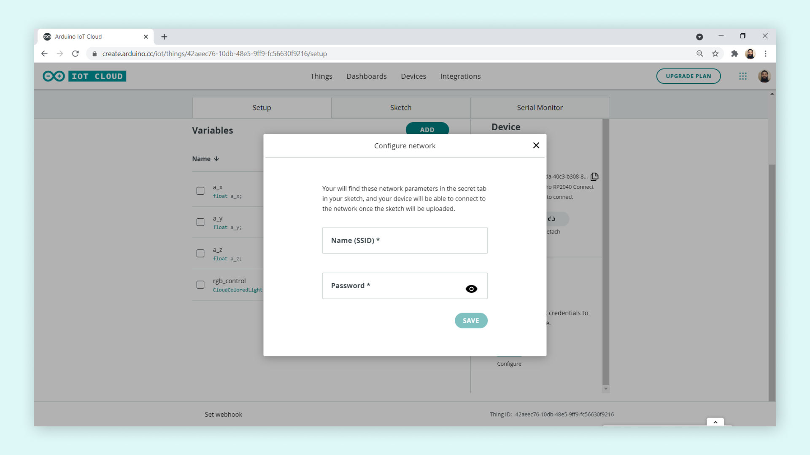

### Step 4: Creating the Program

Now, we need to create the program for our Thing. First, let's head over to the **"Sketch"** tab in the Arduino IoT Cloud. 

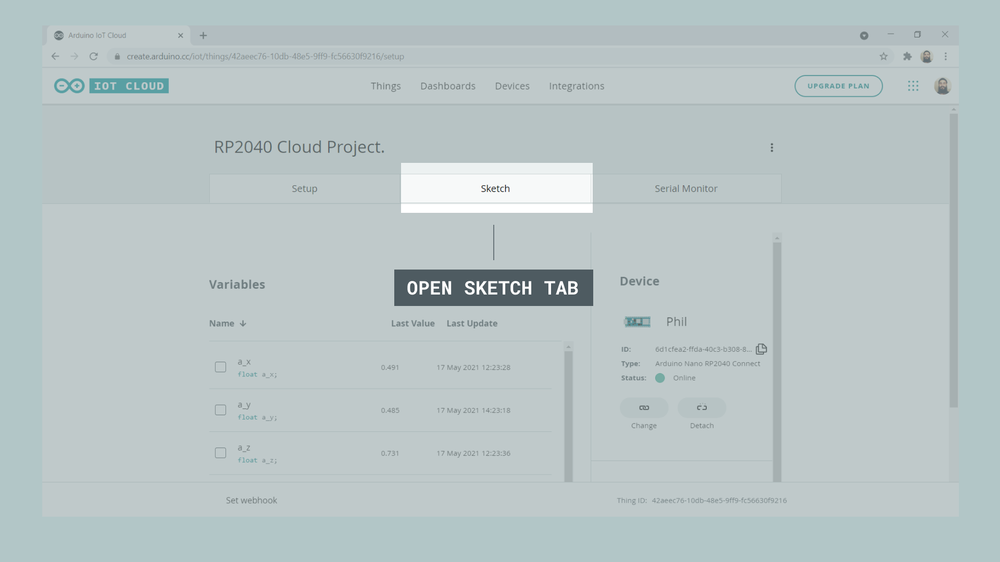

The code that is needed can be found in the snippet below. Upload the sketch to the first board.

```arduino

#include "thingProperties.h"
#include <Arduino_LSM6DSOX.h>

void setup() {
  // Initialize serial and wait for port to open:
  pinMode(LEDR, OUTPUT);
  pinMode(LEDG, OUTPUT);
  pinMode(LEDB, OUTPUT);

  Serial.begin(9600);
  
  while(!Serial); // Prevents sketch from running until Serial Monitor opens.

  if (!IMU.begin()) {
    Serial.println("Failed to initialize IMU!");
    while (1);
  }
  
  delay(1500); 

  // Defined in thingProperties.h
  initProperties();

  // Connect to Arduino IoT Cloud
  ArduinoCloud.begin(ArduinoIoTPreferredConnection);
  
  /*
     The following function allows you to obtain more information
     related to the state of network and IoT Cloud connection and errors
     the higher number the more granular information you’ll get.
     The default is 0 (only errors).
     Maximum is 4
 */
  setDebugMessageLevel(2);
  ArduinoCloud.printDebugInfo();
}

void loop() {
  ArduinoCloud.update();
  //reads acceleration
    if (IMU.accelerationAvailable()) {
    IMU.readAcceleration(a_x, a_y, a_z);
    }
    
}


void onRedChange() {
  if(red){
    digitalWrite(LEDR, HIGH); //turn on RED
  }
  else{
    digitalWrite(LEDR, LOW); //turn off RED
  }
}


void onGreenChange() {
  if(green){
    digitalWrite(LEDG, HIGH); //turn on GREEN
  }
  else{
    digitalWrite(LEDG, LOW); //turn off GREEN
  }
}


void onBlueChange() {
  if(blue){
    digitalWrite(LEDB, HIGH); //turn on BLUE
  }
  else{
    digitalWrite(LEDB, LOW); //turn off BLUE
  }
}
```

### Step 5: Testing the Program

After we have successfully uploaded our sketch to our board, we need to initialize the code, by opening the Serial Monitor.


In this window, we should after a few seconds see information regarding our connection printed.

If the connection (to the network and cloud) is successful, it should print something like the following:

```
***** Arduino IoT Cloud - configuration info *****
Device ID: <your-device-id>
Thing ID: <your-thing-id>
MQTT Broker: mqtts-sa.iot.arduino.cc:8883
WiFi.status(): 0
Current WiFi Firmware: 1.4.4
Connected to "<your-network>"
Connected to Arduino IoT Cloud
```

This means everything is good, and we can move on the next step: creating a dashboard.

>**Troubleshooting tip:** If you're failing to connect, check that your credentials match in the network section, and that you are uploading the right sketch to the right board. 

### Step 6: Creating the Dashboard

Once our sketch is successfully uploaded and the Serial Monitor has given us the green light, we can finalize this project by creating a dashboard. To do this, we need to navigate to the **"Dashboards"** tab.

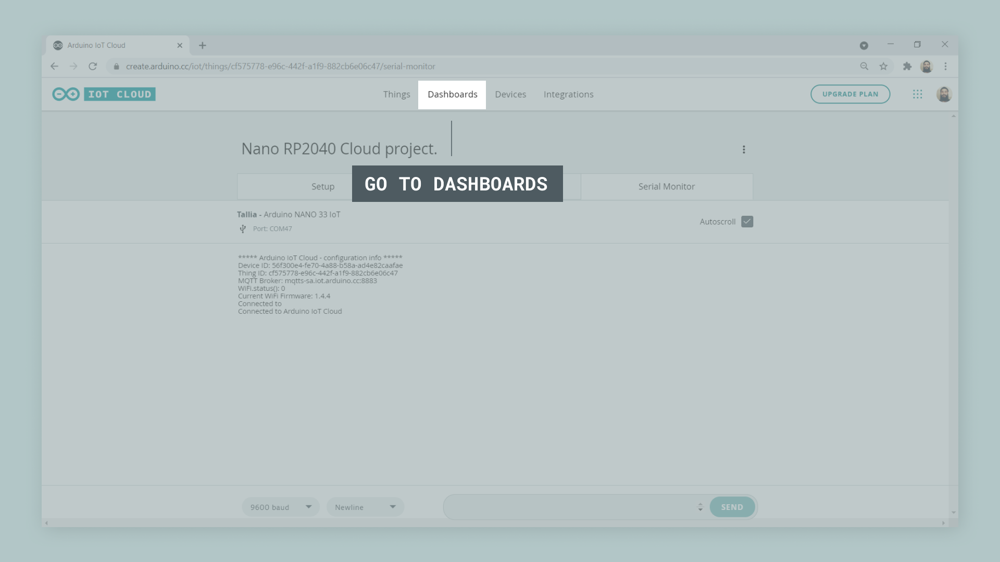

Then, we need to click on the **"Build dashboard"** button.

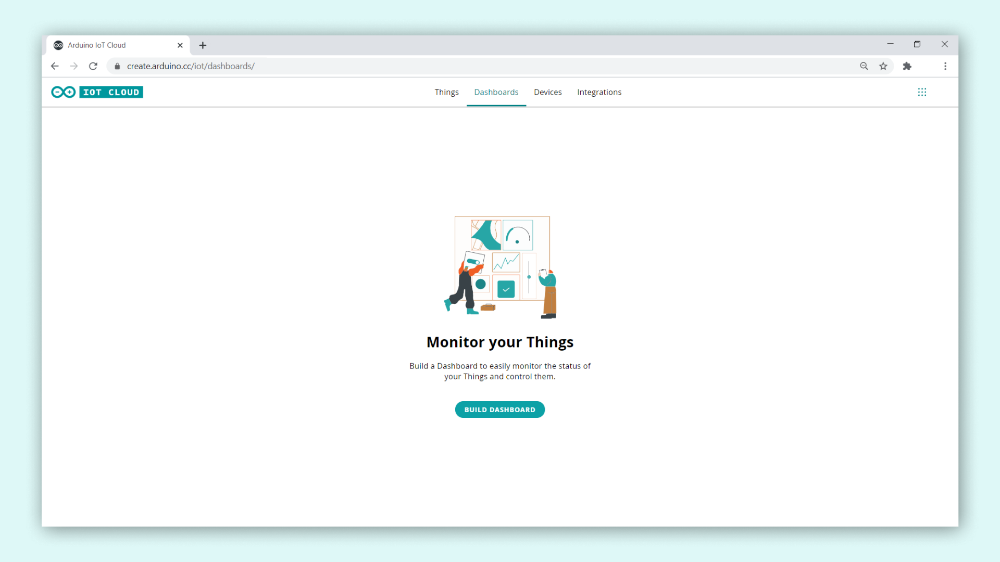

We will now see a blank dashboard. Now, click on the **pen symbol** in the top left corner. This will allow you to edit the dashboard.

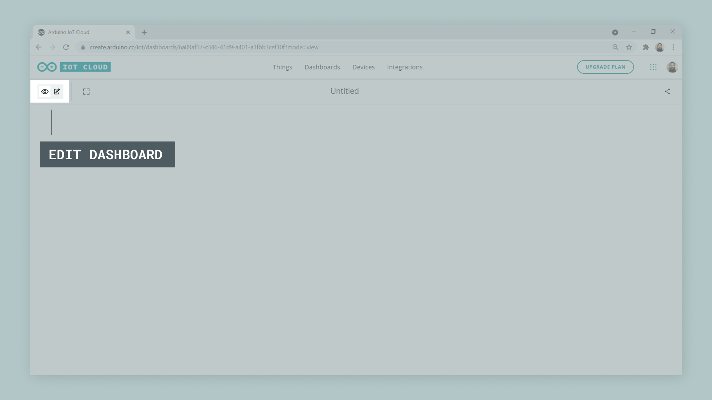

Once we are in edit mode, we can click on **"Add"**, then select the **"Things"** column, and select the Thing we created earlier. We will now be presented with a list of our variables, where we can click on the **"Add variables"** button. This will automatically create **widgets** that are linked to our variables.

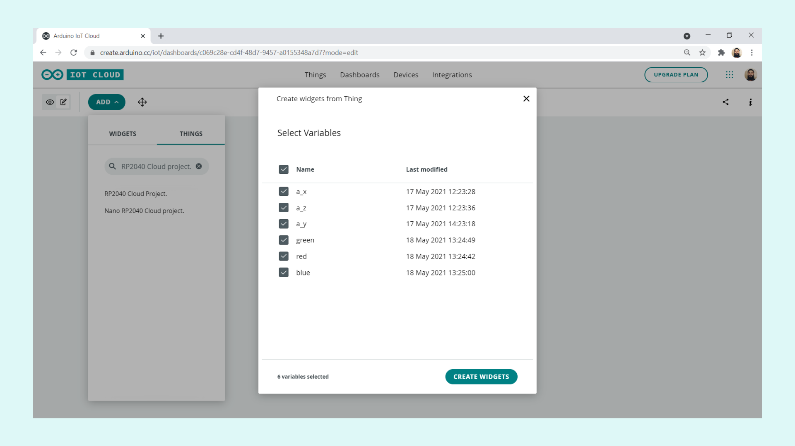

After we click on the button, we be presented with the widget settings window. Just click on the **"Done"** button at the bottom right.

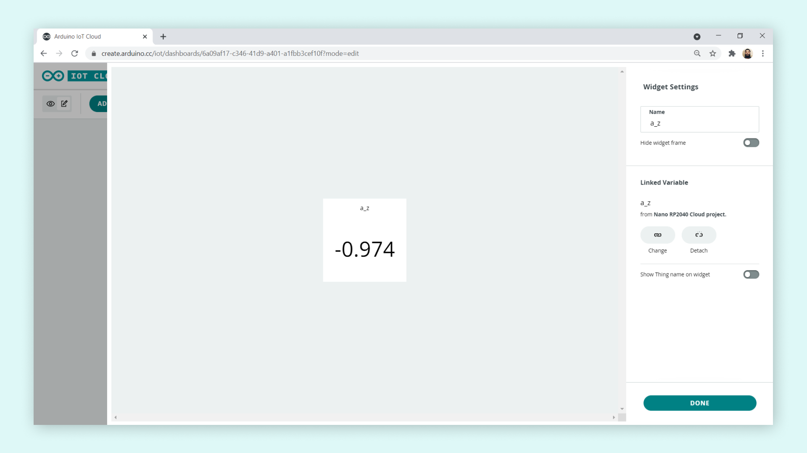

Now, we have our widgets on the dashboard, but the dimensions etc. are not the best. If we click on the **multi-arrow** symbol, we can move around and re-size our widgets however we want to! When we are happy, we can just click on the same button.

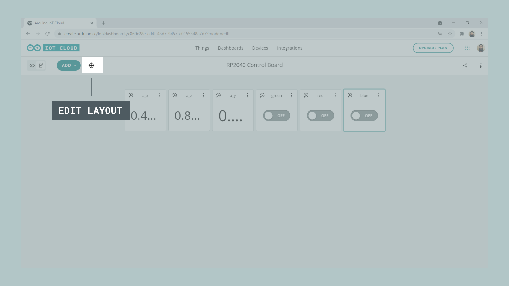

We should now have a pretty nice looking dashboard that displays the value of our accelerometer, and three switch widgets to control the built-in RGB on the Nano RP2040 Connect.

### Step 7: Testing It Out

Now that everything is set up, let's test it out. We can begin by checking the data from the IMU. If we move around our board, we can see that the widgets in the dashboard is changing as well.

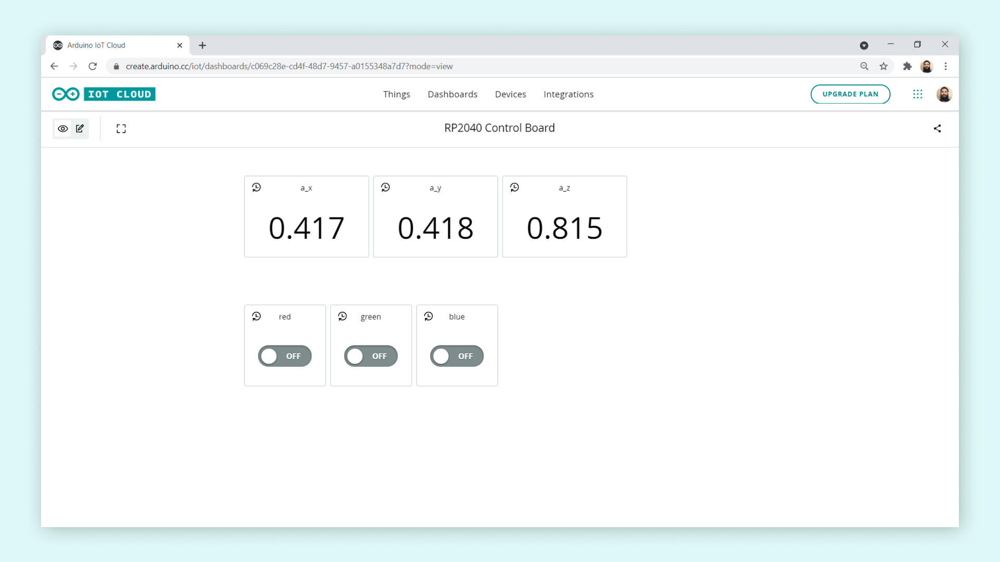

Now, to control the built-in RGB on the board, we need to use the **switch widgets**. These switches are labeled `red`, `green` and `blue` and can simply be turned ON / OFF. In this example, we activated the red pixel, which can be seen in the image below.

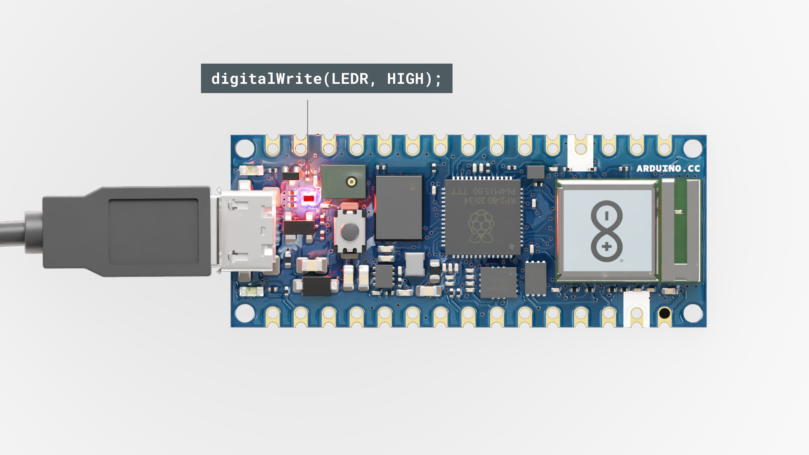

## Conclusion

In this tutorial, we connected a Nano RP2040 Connect board to the [Arduino IoT Cloud](https://create.arduino.cc/iot/things). We created a simple sketch that allows us to display IMU sensor data directly in the Arduino IoT Cloud dashboard, and how to control the built-in RGB on the board.

### More Tutorials

For more interesting tutorials around the IoT Cloud, check out the [Arduino IoT Cloud documentation page](/cloud/iot-cloud/).

To learn more about the Nano RP2040 Connect board, you can check out the [Arduino Nano RP2040 Connect documentation page](/hardware/nano-rp2040-connect).