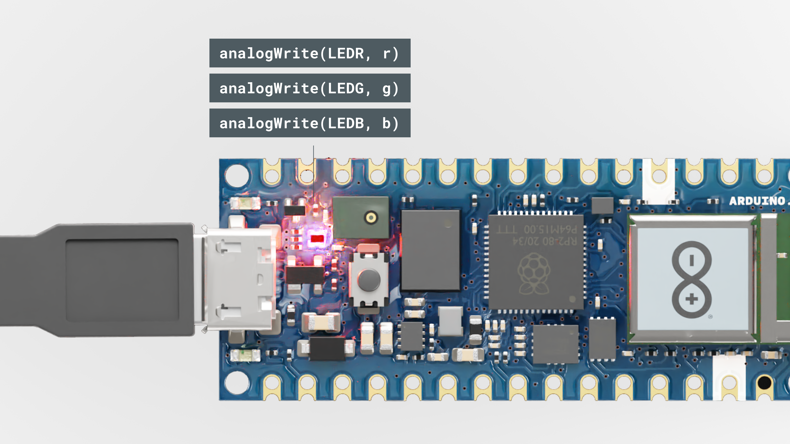

## Introduction

In this tutorial, we will go through the steps needed to connect the [Nano RP2040 Connect](https://store.arduino.cc/nano-rp2040-connect) to the [Arduino Cloud](https://create.arduino.cc/iot/). 

We will test the connection out, by viewing real time data of the IMU (Inertial Measurement Unit), and remotely controlling the RGB on the board.

## Goals

The goals of this project are:

- Set up the Arduino Cloud.
- Read IMU sensor data.
- Control the built-in RGB.

## Hardware & Software Needed

- [Arduino Cloud](https://create.arduino.cc/iot/).
- [Arduino Nano RP2040 Connect](https://store.arduino.cc/nano-rp2040-connect).

### Circuit

Follow the circuit below to connect the buttons and LEDs to your Arduino board.

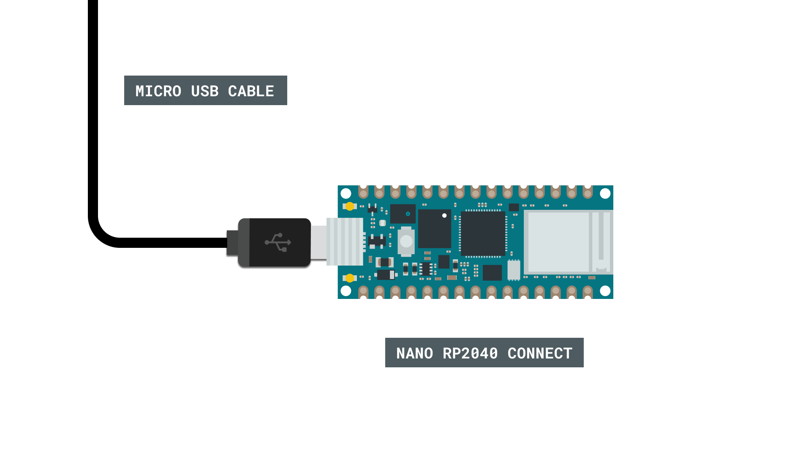

## The Arduino Cloud

To start, we will need to head over to the [Arduino Cloud](https://create.arduino.cc/iot/). 

### Step 1: Configure Your Device

Once we are in the IoT Cloud, to configure our device, click on the **"Devices"** tab. Click on **"Add Device"** and follow the configuration to set up your board.

***Make sure your device is connected to your computer via USB at this point.***

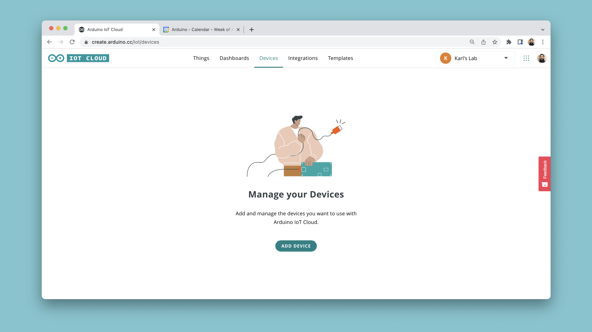


### Step 2: Create a Thing

The next step is to create a new Thing. Navigate to the **"Things"** tab, and click on **"Create Thing".**

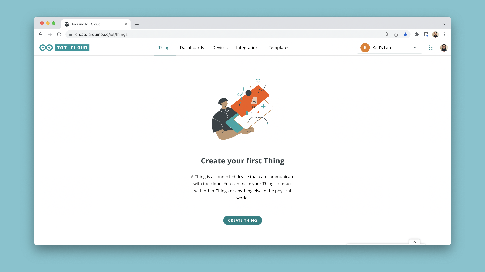

When you create a Thing, you will see a number of options:
- **Select Device** - the device you configured can be selected here. 
- **Select Network** - enter your network credentials (Wi-Fi name and password).
- **Add Variables** - here we add variables that we will synchronize with our sketch.

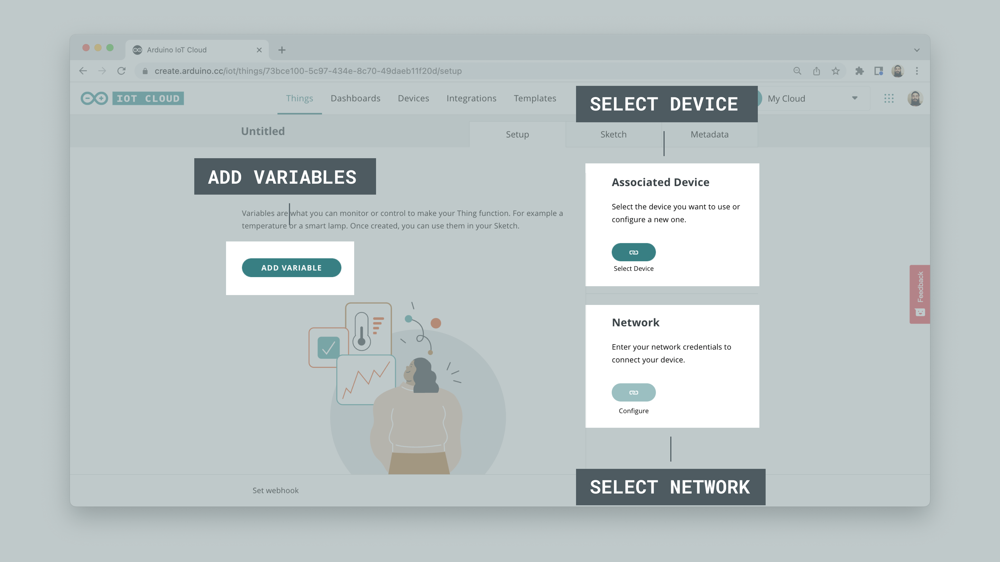

The variables we will add are for controlling the **RGB** and to reading the **Accelerometer**. You can create them based on the table below:


| Variable Name | Data Type     | Permission   |
| ------------- | ------------- | ------------ |
| a_x           | float         | read only    |
| a_y           | float         | read only    |
| a_z           | float         | read only    |
| rgb_light     | Colored Light | read & write |

Once the variables are created, your Thing overview should look similar to the image below:

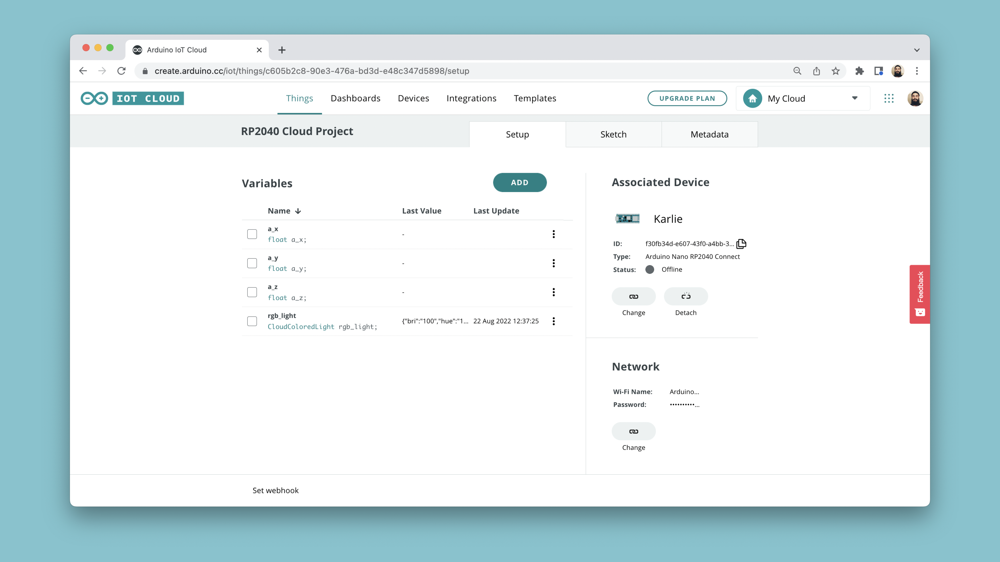

### Step 3: The Sketch

Now, we need to create the program for our Thing. First, let's head over to the **"Sketch"** tab in the Arduino Cloud. At the top, your board should be available in the dropdown menu by default.

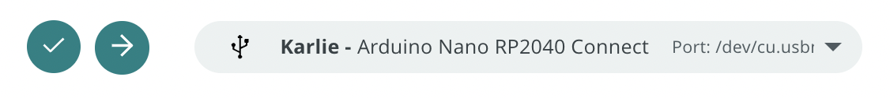

The code can be found in the snippet below. Upload the code to your board.

```arduino
#include "thingProperties.h"
#include <Arduino_LSM6DSOX.h>

void setup() {

  Serial.begin(9600);
  delay(1500);

  //define RGB LED as outputs
  pinMode(LEDR, OUTPUT);
  pinMode(LEDG, OUTPUT);
  pinMode(LEDB, OUTPUT);

  initProperties();

  ArduinoCloud.begin(ArduinoIoTPreferredConnection);

  setDebugMessageLevel(2);
  ArduinoCloud.printDebugInfo();

  //init IMU library
  if (!IMU.begin()) {
    Serial.println("Failed to initialize IMU!");
    while (1);
  }
}

void loop() {
  ArduinoCloud.update();

  //read acceleration and store in a_x, a_y, a_z variables
  if (IMU.accelerationAvailable()) {
    IMU.readAcceleration(a_x, a_y, a_z);
  }
}

/*
  the onRgbLightChange() function is triggered
  when the rgb_light variable changes
*/

void onRgbLightChange()  {
  //create r,g,b variables
  uint8_t r, g, b;

  //retrieve values from the Cloud
  rgb_light.getValue().getRGB(r, g, b);

  //values on Nano RP2040 Connect are inverted
  //so let's remap them
  int red = map(r, 0, 255, 255, 0);
  int green = map(g, 0, 255, 255, 0);
  int blue = map(b, 0, 255, 255, 0);

  if (rgb_light.getSwitch()) {
    analogWrite(LEDR, red);
    analogWrite(LEDG, green);
    analogWrite(LEDB, blue);
  }
  else {
    analogWrite(LEDR, 255);
    analogWrite(LEDG, 255);
    analogWrite(LEDB, 255);
  }
}
```

Once the code has been uploaded to your board, it will attempt to connect to your network, and then with the Arduino Cloud. You can open the Serial Monitor to see if there are any errors.

If all went well, you will see a message like this: 

```
***** Arduino Cloud - configuration info *****
Device ID: <your-device-id>
Thing ID: <your-thing-id>
MQTT Broker: mqtts-sa.iot.arduino.cc:8883
WiFi.status(): 0
Current WiFi Firmware: 1.4.4
Connected to "<your-network>"
Connected to Arduino Cloud
```

If it went wrong, you may encounter errors such as:

```
Connection to "<your-network>" failed. Retrying in 500 milliseconds.
```

Which indicate that something might be wrong with your network credentials.

### Step 4: Creating a Dashboard

Once our sketch is successfully uploaded we can finalize this project by creating a dashboard. To do this, we need to navigate to the **"Dashboards"** tab, and click on the **"Build Dashboard"** tab.

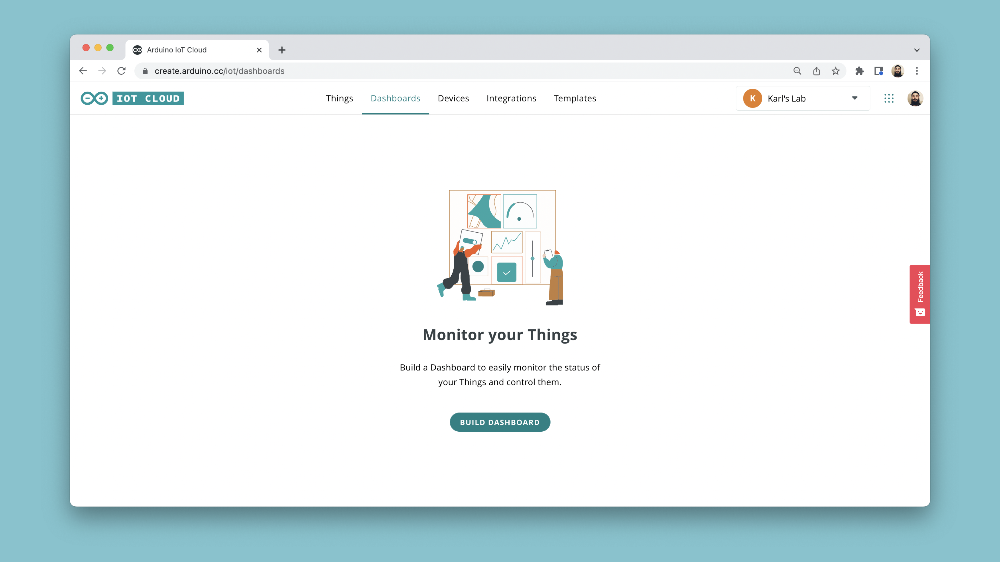

This will open an empty dashboard. At the top left corner, first click on the **Pen Symbol**. You are now in Edit Mode.

Now, click on the **"ADD"** button, then **"Things"**, search and click on your Thing. You will now see a list of variables with a checkmark. Leave all marked, and click on the **"Create Widgets** button. 

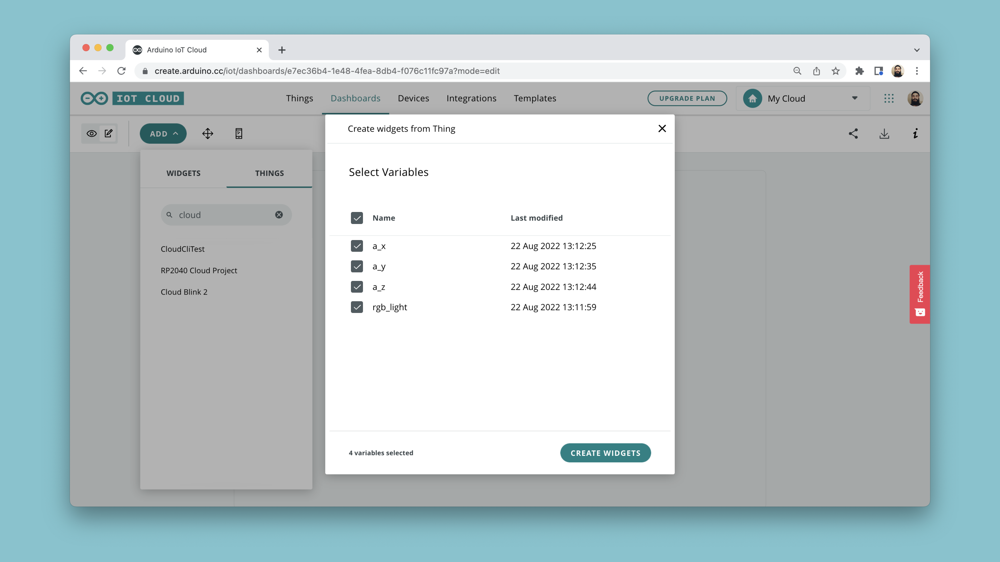
We should now have a pretty nice looking dashboard that displays the value of our accelerometer, and a **colored light widget** to control the built-in RGB on the Nano RP2040 Connect. 

These widgets can be re-sized and adjusted to your liking. You can also select and link other types of widgets, but this is by far the quickest option.

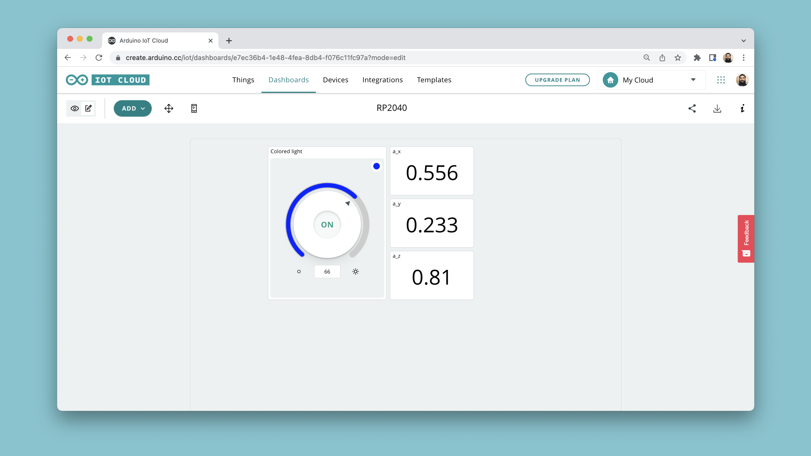

## Expected Outcome

Congratulations. You have now configured your Nano RP2040 Connect board with the Arduino Cloud service.

If your board successfully connects to the Arduino Cloud, we should be seeing values in the dashboard update continuously, and we can change the color of the RGB through the colored light widget.

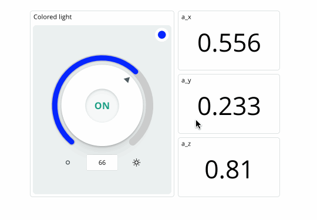


## Conclusion

In this tutorial, we connected a Nano RP2040 Connect board to the [Arduino Cloud](https://create.arduino.cc/iot/things). We created a simple sketch that allows us to display IMU sensor data directly in the Arduino Cloud dashboard, and how to control the built-in RGB on the board.

### More Tutorials

For more interesting tutorials around the IoT Cloud, check out the [Arduino Cloud documentation page](/arduino-cloud).

To learn more about the Nano RP2040 Connect board, you can check out the [Arduino Nano RP2040 Connect documentation page](/hardware/nano-rp2040-connect).