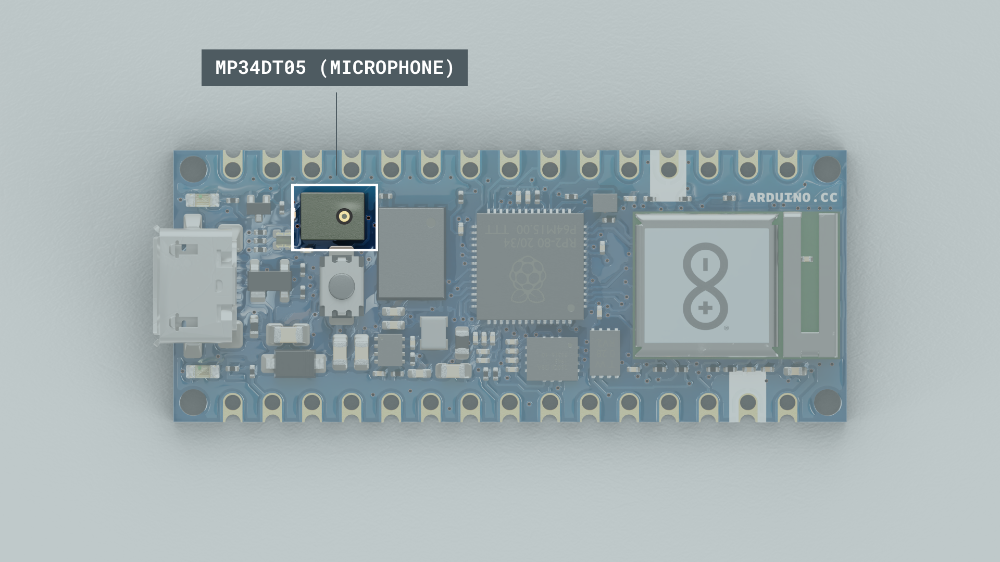
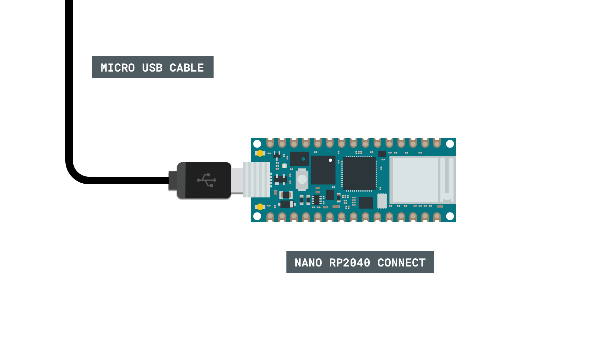
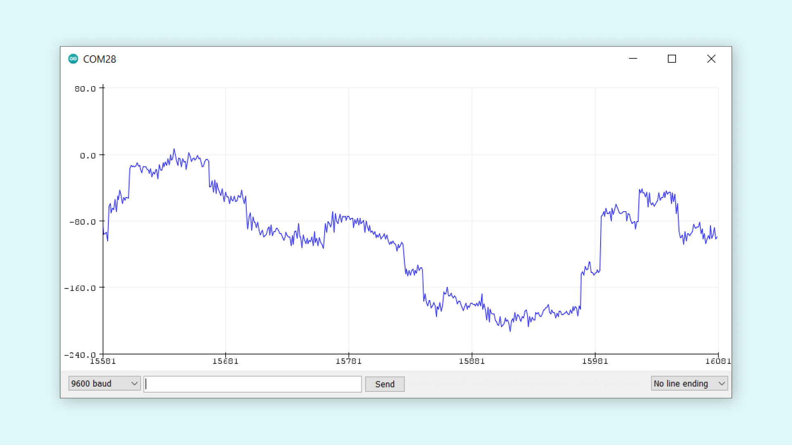
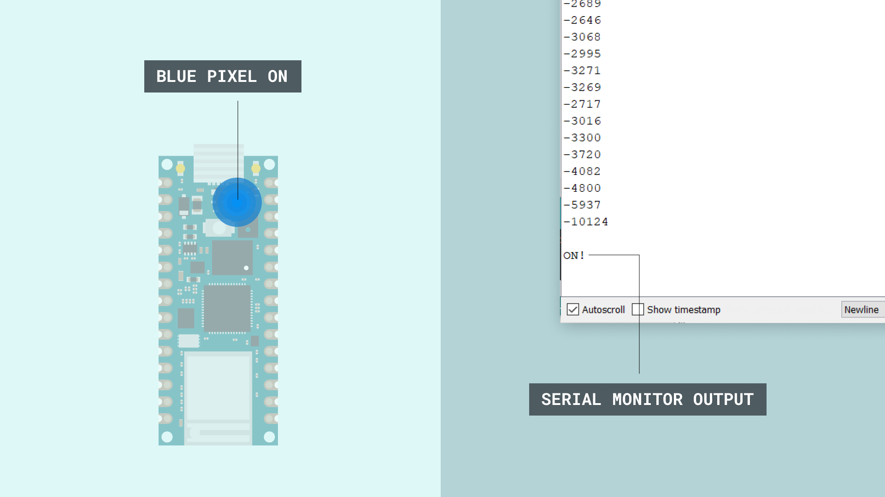

## Introduction 

The Nano RP2040 connect comes with the **MP34DT06JTR** microphone, which can be used to record audio. In this tutorial, we will setup a basic application that simply turns ON or OFF the built in RGB LED whenever a loud noise is recorded (for example snapping our fingers).

>**Note:** if you need help setting up your environment to use your Arduino Nano RP2040 board, please refer to [this installation guide](/software/ide-v2/tutorials/ide-v2-board-manager).

## Goals

The goals of this project are:

- Learn about PDM.
- Read microphone data.
- Print out the data in the Serial Monitor / Serial Plotter.
- Create trigger value(s).
- Activate an RGB based on a loud noise.

## Hardware & Software Needed

- Arduino IDE ([online](https://create.arduino.cc/) or [offline](https://www.arduino.cc/en/main/software)).
- [PDM](https://www.arduino.cc/en/Reference/PDM) library installed.
- [Arduino Nano RP2040 Connect](https://store.arduino.cc/nano-rp2040-connect).

## The MP34DT06JTR Microphone



Microphones are components that convert physical sound into digital data. Microphones are commonly used in mobile terminals, speech recognition systems or even gaming and virtual reality input devices.

The MP34DT06JTR sensor is a ultra-compact microphone that use PDM (Pulse-Density Modulation) to represent an analog signal with a binary signal. The sensor's range of different values are the following:

- Signal-to-noise ratio: 64dB
- Sensitivity: -26dBFS ±3dB
- Temperature range: -40 to 85°C

### Circuit

This tutorial requires no additional circuit. You will only need to connect the board to a computer through a Micro USB cable.



## Programming the Board

We will now get to the programming part of this tutorial. 

1. First, let's make sure we have the drivers installed. If we are using the Web Editor, we do not need to install anything. If we are using an offline editor, we need to install it manually. This can be done by navigating to **Tools > Board > Board Manager...**. Here we need to look for the **Arduino Mbed OS Nano Boards** and install it. 

2. We can now take a look at some of the core functions of this sketch:

- `static const char channels = 1;` - sets the number of output channels. 
- `static const int frequency = 16000;` - sets the sampling frequency to 20 KHz. 
- `short sampleBuffer[512]` - buffer to read samples into, each sample is 16-bits.
- `while (!Serial)` - prevents program from running until Serial Monitor is opened.
- `PDM.begin(channels, frequency)` - initializes the PDM library.
- `Serial.print(sampleBuffer[i])` - prints sample to the Serial Monitor / Plotter.

The sketch can be found in the snippet below. Upload the sketch to the board.

```arduino
#include <WiFiNINA.h>
#include <PDM.h>

bool LED_SWITCH = false;

// default number of output channels
static const char channels = 1;

// default PCM output frequency
static const int frequency = 16000;

// Buffer to read samples into, each sample is 16-bits
short sampleBuffer[512];

// Number of audio samples read
volatile int samplesRead;

void setup() {
  Serial.begin(9600);
  pinMode(LEDB, OUTPUT);
  while (!Serial);
  // Configure the data receive callback
  PDM.onReceive(onPDMdata);

  // Optionally set the gain
  // Defaults to 20 on the BLE Sense and -10 on the Portenta Vision Shields
  // PDM.setGain(30);

  // Initialize PDM with:
  // - one channel (mono mode)
  // - a 16 kHz sample rate for the Arduino Nano 33 BLE Sense
  // - a 32 kHz or 64 kHz sample rate for the Arduino Portenta Vision Shields
  if (!PDM.begin(channels, frequency)) {
    Serial.println("Failed to start PDM!");
    while (1);
  }
}

void loop() {
  // Wait for samples to be read
  if (samplesRead) {

    // Print samples to the serial monitor or plotter
    for (int i = 0; i < samplesRead; i++) {
      if (channels == 2) {
        Serial.print("L:");
        Serial.print(sampleBuffer[i]);
        Serial.print(" R:");
        i++;
      }
      Serial.println(sampleBuffer[i]);

      if (sampleBuffer[i] > 10000 || sampleBuffer[i] <= -10000) {
        LED_SWITCH = !LED_SWITCH;
        if (LED_SWITCH) {
          Serial.println();
          digitalWrite(LEDB, HIGH);
          Serial.println("ON!");
          Serial.println();
          delay(1000);
        }
        else {
          Serial.println();
          digitalWrite(LEDB, LOW);
          Serial.println("OFF!");
          Serial.println();
          delay(1000);
        }
      }
    }

    // Clear the read count
    samplesRead = 0;
  }
}

/**
   Callback function to process the data from the PDM microphone.
   NOTE: This callback is executed as part of an ISR.
   Therefore using `Serial` to print messages inside this function isn't supported.
 * */
void onPDMdata() {
  // Query the number of available bytes
  int bytesAvailable = PDM.available();

  // Read into the sample buffer
  PDM.read(sampleBuffer, bytesAvailable);

  // 16-bit, 2 bytes per sample
  samplesRead = bytesAvailable / 2;
}
```

## Testing It Out

After successfully uploading the code to the board, we will need to open the Serial Monitor to initialize the program. Once we open it, we can see that data is being printed rapidly. These are the audio samples that are record from the microphone. We can also open the Serial Plotter to instead view the data as a graph. 


We can also open the Serial Plotter to instead view the data as a graph. 



Now in the sketch, we have written a conditional that is activated whenever the sample value is either over `10000` or under `-10000`. This can be produced, by for example snapping our fingers, coughing loudly or if you prefer, yelling (we prefer the finger snapping method).

Whenever this condition is met, the following things happen:

- The boolean `LED_SWITCH` changes.
- Depending on the state of `LED_SWITCH`, the blue pixel turns ON or OFF.
- The text `"ON"` or `"OFF"` is printed in the monitor.
- The program freezes for one second, then resumes (this is just to allow some time to see the status of the LED).

In the Serial Monitor we should see the following when the conditional is met, where the **blue** pixel will turn ON / OFF depending on the state of `LED_SWITCH`.



## Conclusion

In this tutorial we have learned how to retrieve data from the microphone onboard the Nano RP2040 Connect board. The sketch we used is an elaboration of the **PDM** example that can be found through **File > Examples > PDM > PDMSerialPlotter**.